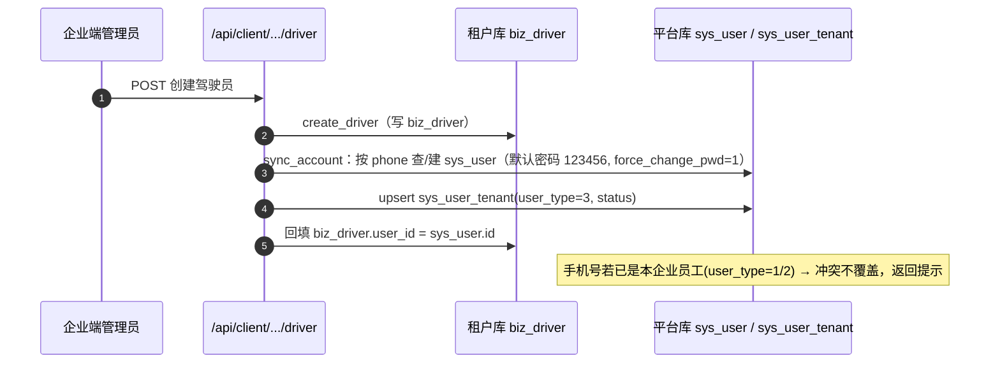
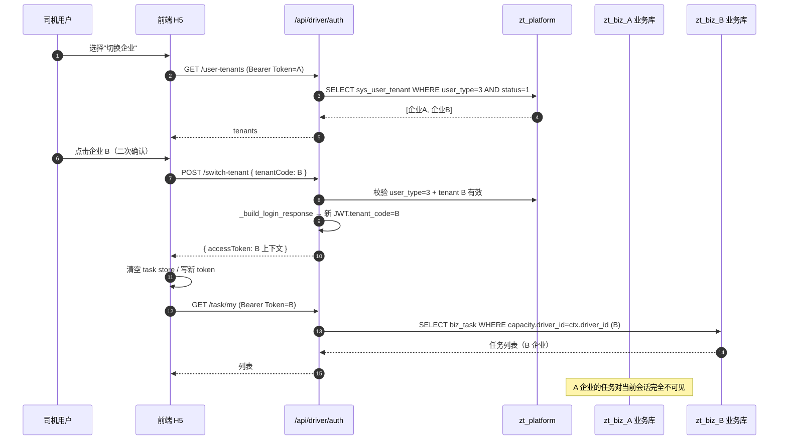
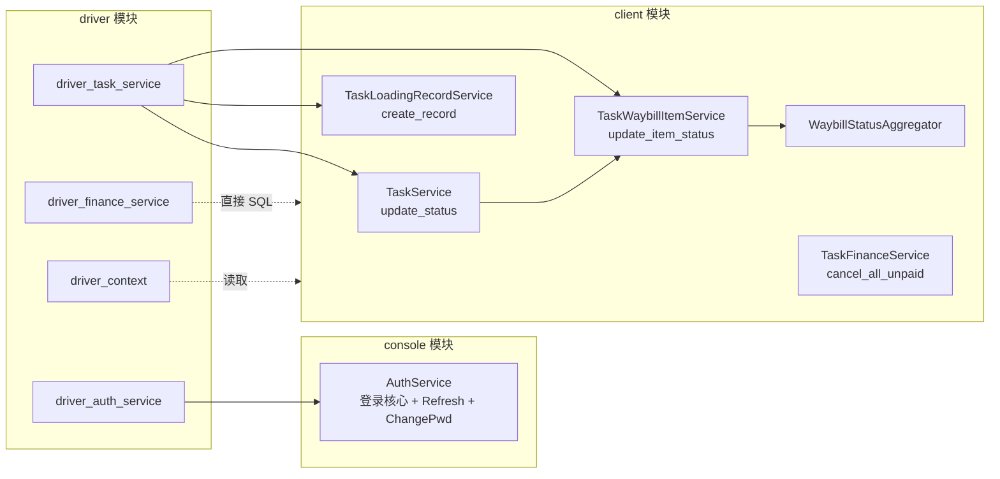
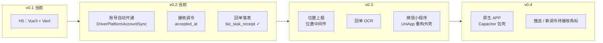

# 驾驶员 H5 端架构设计

> **最后更新**：2026-07-07（v0.2）
>
> 本文档定义驾驶员移动端（H5 / APP / 小程序）的整体架构、技术选型、目录结构、
> API 设计、与企业端的复用边界，以及远期演进路径。
>
> 关联需求文档：[doc/02.需求文档/03.移动端/02.驾驶员H5端/](../02.需求文档/03.移动端/02.驾驶员H5端/)
>
> **v0.2 变更摘要**：
> - 新增「创建驾驶员即自动开通 H5 登录账号」链路（`DriverPlatformAccountSync`），
>   打通"企业建档 → 司机能登录"的断点；
> - 新增「接收调令」轻量流程（司机接单/拒单，写 `accepted_at`，接单后方可装车）；
> - 回单由占位升级为落表（`biz_task_receipt`）+ 驱动端文件上传 `/api/driver/file`。

## 一、整体定位

智途驾驶员 H5 端是面向 `user_type=3`（驾驶员）的移动应用，承担"任务流转中
司机角色的查看与操作"职责。

### 1.1 三层数据流

```mermaid
flowchart LR
    subgraph H5 [frontend/driver-h5 H5 端]
        UI[Vue3 + Vant + Vite]
    end
    subgraph BE [FastAPI 后端]
        DRV[/api/driver/*]
        CLI[/api/client/*]
        OPEN[/api/open/*]
    end
    subgraph DB [多租户数据]
        PLAT[(zt_platform sys_user + sys_user_tenant)]
        T1[(zt_biz_A biz_driver / biz_task / biz_driver_account)]
        T2[(zt_biz_B biz_driver / biz_task / biz_driver_account)]
    end
    UI -->|JWT user_type=3 + tenant_code| DRV
    UI -.短信/找回密码.-> OPEN
    DRV -->|TenantMiddleware| PLAT
    DRV -->|切换 tenant_code 路由租户库| T1
    DRV -->|切换 tenant_code 路由租户库| T2
```

### 1.2 数据隔离的根基

| 层 | 隔离机制 |
|----|---------|
| 鉴权层 | JWT 必带 `tenant_code` + `user_type=3`；登录入口强制 `sys_user_tenant.user_type=3` 过滤 |
| 中间件层 | `TenantMiddleware` 从 JWT 读出 `tenant_code` 写入 `request.state` |
| 数据层 | 每个企业一个独立物理库 `zt_biz_{tenant_code}`，业务表天然按库隔离 |
| 服务层 | `DriverContext.get_current_driver` 按 `user_id` / `phone` 锁定本企业 driver |
| 业务层 | 所有 finance 查询硬过滤 `payee_type=1 AND payee_id=当前 driver_id` |

## 二、技术栈

| 维度 | 选型 | 选型理由 |
|------|------|---------|
| 框架 | Vue 3.5 + TypeScript 5.9 | 与 console / client 一致，复用工程经验 |
| 构建 | Vite 7.1 | 开发体验好，HMR 快 |
| UI 库 | Vant 4 | 移动端社区主流，组件完备 |
| 状态 | Pinia 3 | 同 console / client |
| 路由 | Vue Router 4 | 同 console / client |
| HTTP | Axios 1.12 | 与现有拦截器套路一致 |
| 工程 | pnpm workspace 子包 `zhitu-driver-h5` | 复用 monorepo 工具链 |
| 端口 | 5176 | 避开 5173/5174/5175 |

**未引入 EleAdminPlus**：H5 端不需要后台模板的复杂 layout / Tab 页 / 主题切换，
保持轻量。

## 三、前端目录结构

```
frontend/driver-h5/
├── package.json                # name: zhitu-driver-h5
├── vite.config.ts              # 5176 + 代理 /api/driver、/api/open、/uploads；Vant 自动按需
├── tsconfig.json / tsconfig.node.json
├── index.html                  # viewport + safe-area meta
├── .env.development / .env.production
├── README.md
└── src/
    ├── main.ts                 # createApp + Pinia + Router + Vant 全局样式
    ├── App.vue                 # <router-view> + keep-alive
    ├── styles/{index,variables,vant-theme}.scss
    ├── router/                 # 路由表 + 守卫（token → tenant → force_change_pwd）
    ├── store/{user,tenant,task}.ts
    ├── api/{request,auth,task,task-receipt,finance,profile}.ts
    ├── composables/{useAuth,usePermission}.ts
    ├── utils/{storage,format}.ts
    ├── components/{PageContainer,DriverTabbar,TaskCard,StatusTag}.vue
    └── views/
        ├── login/              # login.vue / sms-login.vue / tenant-select.vue
        ├── home/index.vue      # 工作台首屏
        ├── task/               # task-list.vue / task-detail.vue / status-config.ts
        ├── finance/            # finance-list.vue / finance-detail.vue / income-summary.vue
        ├── profile/            # profile.vue / profile-info.vue / switch-tenant.vue / change-password.vue
        └── common/not-found.vue
```

### 3.1 路由守卫

```mermaid
flowchart LR
    A[路由跳转] --> B{noAuth?}
    B -- 是 --> Z[放行]
    B -- 否 --> C{isLoggedIn?}
    C -- 否 --> L[/login?redirect=...]
    C -- 是 --> D{requireTokenOnly?<br>e.g. /tenant-select}
    D -- 是 --> Z
    D -- 否 --> E{currentTenantCode?}
    E -- 否 --> T[/tenant-select]
    E -- 是 --> F{needForceChangePwd?}
    F -- 是 --> P[/change-password]
    F -- 否 --> Z
```

### 3.2 状态管理

| Store | 持久化 | 字段 |
|-------|--------|------|
| user | localStorage | accessToken / refreshToken / userInfo（含 tenantCode / driverId / forceChangePwd / roles / permissions） |
| tenant | localStorage | tenants 列表（user_type=3） |
| task | 内存 | 短期列表缓存 + 状态过滤；切换企业时 clear() |

### 3.3 请求拦截

- **请求**：自动注入 `Authorization: Bearer {token}`
- **响应**：响应头若回带 `Authorization` 则透传更新 access_token
- **错误**：401 清 token 跳 `/login`，其它统一 Vant Toast

## 四、后端模块

### 4.1 模块结构

```
backend/app/modules/driver/
├── __init__.py
├── api/
│   ├── __init__.py             # 聚合到 /api/driver
│   ├── auth.py                 # /auth/*
│   ├── task.py                 # /task/*（含 accept / reject）
│   ├── task_receipt.py         # /task-receipt/*（落表版）
│   ├── finance.py              # /finance/*
│   ├── profile.py              # /profile/*
│   └── file.py                 # /file/*（复用共享上传路由，driver JWT）
├── schemas/
│   ├── __init__.py
│   ├── task.py                 # Driver* 入参 / 出参（含 accept/reject、accepted 子态）
│   ├── finance.py
│   └── profile.py
└── services/
    ├── __init__.py
    ├── driver_context.py       # get_current_driver(tenant_db, JWT) → biz_driver
    ├── driver_auth_service.py  # 复用 AuthService._build_login_response，强制 user_type=3
    ├── driver_task_service.py  # 薄层包装：accept / reject / confirm-load / depart / confirm-arrive / sign
    ├── driver_receipt_service.py  # 回单落表 biz_task_receipt，按 driver_id 过滤
    └── driver_finance_service.py  # 包 task_finance，强制 payee_type=1 AND payee_id=...
```

> 账号开通链路位于 client 模块（企业端触发）：
> `backend/app/modules/client/services/capacity/self_capacity/driver/driver_account_sync.py`
> —— `DriverPlatformAccountSync`，在企业端创建/编辑/状态变更/删除驾驶员时同步平台
> `sys_user` + `sys_user_tenant(user_type=3)` 并回填 `biz_driver.user_id`。

### 4.2 与 client 模块的服务层复用边界

| 能力 | 实现位置 | 复用方式 |
|------|---------|---------|
| 登录核心逻辑 | `console.AuthService._build_login_response` | driver_auth_service 直接调用 |
| Token / Refresh / 修改密码 | `console.AuthService.refresh_token / change_password` | driver auth API 直接调用 |
| 任务状态机 | `client.services.state_machine.task_state_machine` | 通过 `TaskService.update_status` 间接复用 |
| 装/卸车记录 | `client.services.task.task_loading_record_service` | confirm-load / confirm-arrive 直接调用 |
| Item 状态推进 | `client.services.task.task_waybill_item_service.update_item_status` | sign-item 直接调用 |
| 运单聚合 | `client.services.waybill.waybill_status_aggregator` | 任意 task / item 变更后自动触发 |
| 费用单 / 账户 | `client.models.task.task_finance_doc` + `biz_driver_account` | driver_finance_service 直接 SQL，强加 payee 过滤 |

**单一事实源原则**：所有状态变更都走 `client/services/task/*`，确保
PC 调度员 / H5 司机 / 远期 APP 共享同一份状态机与联动逻辑。

### 4.3 登录账号自动开通链路（v0.2）

H5 登录强依赖平台库 `sys_user` + `sys_user_tenant(user_type=3)`，且租户库
`biz_driver.user_id` 回填。企业端在「驾驶员管理」增删改时，由
`DriverPlatformAccountSync` 保持三者一致：



- 触发点：`create` / `update`（含改手机号）/ `status`（冻结离职→停用登录）/ `delete`（软删本企业 user_tenant，不删全局 sys_user）
- 重置密码：`POST /api/client/.../driver/{id}/reset-password` → 默认密码 + 强制改密
- 存量数据：`python scripts/fix/open_driver_accounts.py --all` 批量补开通
- 关键边界：`sys_user_tenant` 唯一键 `(user_id, tenant_code)`，同手机号在同企业不能既是员工又是驾驶员

### 4.4 接收调令（轻量方案，v0.2）

复用调令表 `biz_task_dispatch_order.accepted_at`，**不新增 task 状态**：

| 动作 | 效果 | 状态影响 |
|------|------|---------|
| 接收调令 `accept` | 该任务下调令 `accepted_at = now()` | task.status 保持「已派车」(1) |
| 拒绝调令 `reject` | `revert_status` 1→0，remark 记录拒单原因 | 退回「待派车」池，供调度员重派 |
| 确认装车 `confirm-load` | 前置校验：无任一 `accepted_at` → 拒绝 | 必须先接单 |

司机视角子态：`status=1 且未接收 → 待接收`；`status=1 且已接收 → 待装车`。
前端 `getDriverDisplayStatus` / `getAvailableActions` 依据 `accepted` 切换标签与按钮。

## 五、API 清单（v0.1 MVP）

### 5.1 认证 `/api/driver/auth`

| 方法 | 路径 | 说明 |
|------|------|------|
| POST | `/login` | 手机号+密码（`sys_user_tenant.user_type=3` 过滤） |
| POST | `/sms-login` | 验证码登录（同上） |
| POST | `/refresh` | Token 刷新 |
| GET | `/user-info` | 司机信息 + 角色 + 权限 + 当前 `biz_driver.id` + `forceChangePwd` |
| GET | `/user-tenants` | 当前手机号关联且 `user_type=3` 的企业列表 |
| POST | `/switch-tenant` | 切换企业，签发新 Token |
| PUT | `/password` | 修改密码（共用 `AuthService.change_password`） |

### 5.2 任务 `/api/driver/task`

| 方法 | 路径 | 说明 |
|------|------|------|
| GET | `/my` | 我的任务分页（`status` / `keyword` 过滤，列表含 `accepted` 子态） |
| GET | `/{id}` | 任务详情（segments + items，含 `acceptedAt`） |
| POST | `/{id}/accept` | 接收调令（写 dispatch_order.accepted_at，不改 task.status） |
| POST | `/{id}/reject` | 拒绝调令（task 1→0 退回待派车池，reason 必填） |
| POST | `/{id}/confirm-load` | 1→2 已装车（创建装车记录 event=1 聚合；**前置：必须已接收调令**） |
| POST | `/{id}/depart` | 2→3 在途（`TaskService.update_status`） |
| POST | `/{id}/confirm-arrive` | 3→4 已到达（创建卸车记录 event=2 聚合） |
| POST | `/items/{itemId}/sign` | item 2/1/0→3 签收（聚合驱动 task 4→5） |
| POST | `/items/{itemId}/revert-sign` | item 3→2 撤销签收（受限） |

### 5.3 回单 `/api/driver/task-receipt`（v0.2 落表）

| 方法 | 路径 | 说明 |
|------|------|------|
| POST | `/upload` | 上传回单（落 `biz_task_receipt`，`fileUrls[]` 1~9 张） |
| GET | `/my` | 我的回单分页（按 `driver_id` 过滤，可按 `taskId`） |
| DELETE | `/{id}` | 删除自己的回单（软删） |

### 5.6 文件上传 `/api/driver/file`

| 方法 | 路径 | 说明 |
|------|------|------|
| POST | `/upload` | 图片上传（driver JWT），`scene ∈ {task_loading, task_receipt, avatar,...}`，返回 `{ url, name }` |

### 5.4 财务 `/api/driver/finance`

| 方法 | 路径 | 说明 |
|------|------|------|
| GET | `/my` | 列表（强加 `payee_type=1 AND payee_id=driver_id`） |
| GET | `/{docId}` | 详情 + items |
| GET | `/summary` | 收入汇总（按月 + doc_type，仅累计已支付） |
| GET | `/account` | 我的结算账户（`biz_driver_account`） |

### 5.5 个人 `/api/driver/profile`

| 方法 | 路径 | 说明 |
|------|------|------|
| GET | `/me` | 我的资料 |
| PUT | `/me` | 更新（白名单字段：紧急联系人 / 家庭住址 / 头像） |

## 六、多企业切换时序图



## 七、与企业端服务层的复用边界



- driver 模块 **不重新实现**任何状态机或聚合逻辑
- driver 模块 **只做**：上下文锁定（driver_id）+ 可见性过滤 + 入参翻译 + 输出裁剪
- 任何 task / item 状态机变更后，PC 端与 H5 自动保持一致

## 八、远期演进



- **接口不变**：`/api/driver/*` 设计上是"通用移动接口"，无 UI 偏好
- **共享业务层**：所有壳共享同一份后端 + 状态机
- **逐步增强**：位置上报、电子回单、推送、社会运力等渐进落地

## 九、关键风险与缓解

| 风险 | 缓解 |
|------|------|
| 司机端误操作导致状态错位 | 弹窗二次确认 + 撤销受限 + 后端状态机强校验 |
| 多企业切换数据串扰 | JWT 重签 + 前端 store clear + 后端 DriverContext 锁定 |
| H5 弱网重复点击 | 按钮 disabled + Toast 防抖 + 后端幂等 |
| 财务隐私 | DriverContext.driver_id 硬过滤 + 银行账号脱敏 |
| 接口被 client 端共用 | driver 模块独立路由树，权限点独立维护 |
