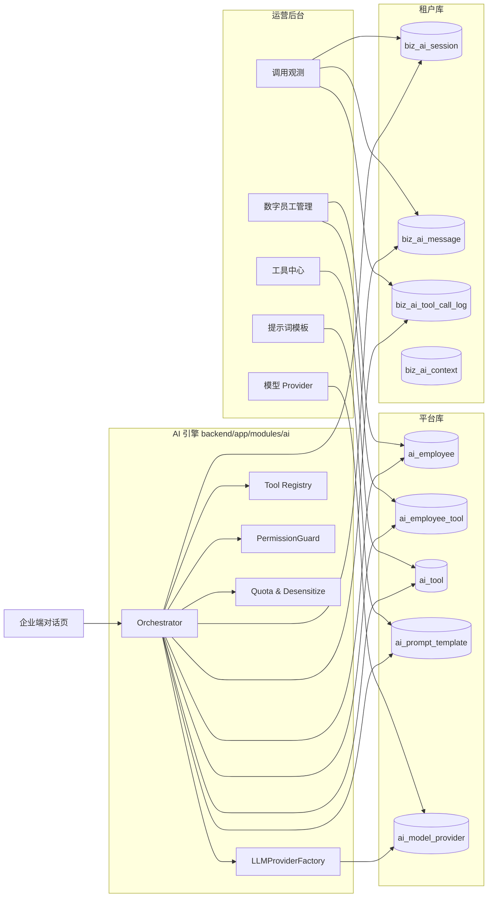

# 运营后台 - AI 数字员工模块总览

> **所属阶段**：阶段五 - 平台 AI 能力建设
>
> **文档状态**：已完成（基于现有实现反向补全）
>
> **优先级**：高（平台 AI 中枢）

## 一、模块定位

「AI 数字员工」是平台为所有租户提供的统一 AI 能力中枢。运营后台承担**全局元数据管理**职责（数字员工角色、工具登记、提示词模板、LLM Provider、跨租户调用观测），不直接持有任何业务数据；企业端在此基础上为本租户用户提供对话工作区。

模块由 5 个 Console 子页面 + 1 个客户端入口构成：

| 端 | 入口 | 文档 |
|----|------|------|
| 运营后台 | `/ai/employee` | [01.数字员工管理.md](01.数字员工管理.md) |
| 运营后台 | `/ai/tool` | [02.工具中心.md](02.工具中心.md) |
| 运营后台 | `/ai/prompt` | [03.提示词模板.md](03.提示词模板.md) |
| 运营后台 | `/ai/provider` | [04.模型%20Provider.md](04.模型%20Provider.md) |
| 运营后台 | `/ai/observe` | [05.调用观测.md](05.调用观测.md) |
| 企业客户端 | `/dashboard/ai-assistant` | [../../02.企业端/06.AI 数字人模块/00.模块总览.md](../../02.企业端/06.AI%20数字人模块/00.模块总览.md) |

## 二、整体架构

### 2.1 数据分层

```
┌──────────────── 平台库（zt_platform） ────────────────┐
│  ai_employee          数字员工角色定义                 │
│  ai_employee_tool     员工 ↔ 工具绑定（多对多）          │
│  ai_tool              工具元数据（代码注册同步）         │
│  ai_prompt_template   提示词模板（支持 {{var}} 占位）   │
│  ai_model_provider    LLM Provider（apiKey 加密存储）  │
└──────────────────────────────────────────────────────┘
                       ▲ 跨库读
                       │
┌──────────────── 租户库（zt_biz_{tenant_code}） ────────┐
│  biz_ai_session         AI 会话主表                    │
│  biz_ai_message         会话消息明细（user/assistant/tool） │
│  biz_ai_context         会话/用户上下文 KV（远期）       │
│  biz_ai_tool_call_log   工具调用审计日志                │
└──────────────────────────────────────────────────────┘
```

设计原则：

- **平台库存元数据，租户库存运行数据**：员工/工具/提示词/Provider 是平台公共资产；会话/消息/调用日志按租户隔离落地。
- **元数据多租户共享，运行数据租户独立**：所有租户看到的是同一份数字员工，但每个租户的对话历史、工具调用都互不可见。
- **租户库 4 张 `biz_ai_*` 表按版本开通**：随产品功能 `ai_assistant` 在租户开通时建表，老租户由 `backend/scripts/fix/fix_ai_tenant_tables.py` 补建，运行时由 `app.core.dependencies.ensure_biz_ai_tables` 首访自愈。

### 2.2 调用拓扑



## 三、通用机制

下列机制由所有 Console 子页面与客户端对话共享，仅在本总览展开。各子文档需要时通过链接回引本节。

### 3.1 路由前缀与鉴权

| 端 | 前缀 | 鉴权 |
|----|------|------|
| 运营后台 | `/api/console/ai/...` | 平台 JWT，`get_current_user` 依赖 |
| 企业客户端 | `/api/client/ai/...` | 租户 JWT + `TenantMiddleware` 解析租户 |

源代码：`backend/app/modules/ai/api/console/__init__.py`、`backend/app/modules/ai/api/client/__init__.py`、`backend/app/main.py`。

### 3.2 引擎工作流

引擎实现位于 `backend/app/modules/ai/engine/orchestrator.py`，每次对话一个 `Orchestrator` 实例。核心流程：

1. **持久化用户消息** → 推送 `message` 事件
2. **装配 messages**：`PromptBuilder` 三段式（system + role + scenario） + `ContextManager` 历史
3. **调用 LLM 流式接口**（`OpenAICompatProvider.chat_stream`），边收边推：
   - 文本 delta → SSE `delta` 事件
   - 工具调用拼装完成 → 进入工具分发分支
4. **工具分发**（`Orchestrator._dispatch_tool_call`）：
   - 推 `tool.call` 事件
   - `PermissionGuard.check` 校验
   - 高风险/`confirm_required` → 写 `pending_confirm` 日志、推 `confirm.required`、本轮提前结束
   - 普通工具 → 进程内直调 `spec.handler` → 落 `tool.result`、把结果作为 `tool` 消息加回上下文 → 进入下一轮 LLM
5. **多轮循环**至无更多 `tool_calls`，推 `done` 结束；超过 `max_tool_loops`（默认 6）推 `error`。

### 3.3 SSE 事件协议（9 类）

引擎统一通过 `engine/streaming.py:sse_pack` 编码事件，前端按 `event:` + `data:` 解析。

| 事件 | 触发时机 | data 字段 |
|------|---------|----------|
| `session` | 会话建立/识别 | `sessionId, sessionNo, employeeCode, employeeName` |
| `message` | 用户消息落库 | `role, message_id, content` |
| `delta` | LLM 文本增量 | `content` |
| `tool.call` | 工具开始调用 | `tool_call_id, tool_code, tool_name, params(脱敏), risk_level` |
| `tool.result` | 工具执行完成 | `tool_call_id, tool_code, status(success/failed/denied/cancelled), summary, error, latency_ms` |
| `confirm.required` | 高风险待确认 | `tool_call_id, tool_code, tool_name, params, confirm_token, risk_level, tip` |
| `usage` | 用量回报 | `prompt_tokens, completion_tokens` |
| `done` | 一轮对话完成 | `message_id, finish_reason(stop/length/tool_calls/confirm_required), usage` |
| `error` | 异常 | `message, fallback?` |

> 错误兜底：当后端在 SSE 启动前抛 `BizException`（如限流、配额）会被全局异常处理改写为 `200 + JSON {code, message}`；客户端检测 `Content-Type` 不为 `text/event-stream` 时按业务错误冒泡。

### 3.4 工具协议

工具是代码注册的可调用单元，完整说明见 [02.工具中心.md](02.工具中心.md)。要点：

- `@register_tool` 装饰器把工具注册进 `ToolRegistry`（`backend/app/modules/ai/tools/registry.py`）。
- 工具入参用 Pydantic `BaseModel` 定义，`json_schema()` 转 OpenAI function 协议。
- 工具命名 wire 编码：内部 `code` 用点号分段（`waybill.search`），送入 LLM 前转双下划线（`waybill__search`），结果回包再反向还原。该映射可逆且幂等。
- 启动时 `ToolRegistry.sync_to_db()` 把代码注册表 upsert 到 `ai_tool`：新增 `inserted++`、已存在 `updated++`（保留 `status` 不覆盖运营手动启停）、代码已删除则 `is_builtin=0` 标记孤立。

### 3.5 权限守卫（PermissionGuard）

位置：`backend/app/modules/ai/security/permission_guard.py`。每次工具调用前**三层校验**全部通过才放行：

1. **工具/员工启用校验**：`ai_tool.status == 1` 且 `ai_employee.status == 1`。
2. **员工白名单**：`ai_employee_tool` 中存在 `(employee_id, tool_id)` 且 `enabled == 1`。
3. **用户菜单权限码**：当工具声明了 `required_permission`（如 `biz:waybill:add`），需要当前用户拥有该 `menu_code`。
   - `user_type=1`（平台管理员）/`user_type=2`（租户管理员）直接放行。
   - 普通用户走 `biz_user_role → biz_role_menu(menu_id)`（租户库）→ 平台库 `sys_menu.menu_code WHERE app_type='client'` 的两步查询。

校验失败抛 `PermissionException`，引擎写一条 `denied` 状态的工具日志、推 `tool.result(status=denied)` 事件，对话继续给 LLM 下一轮处理。

### 3.6 高风险确认状态机

具体流程见 [../../02.企业端/06.AI 数字人模块/02.高风险确认与权限.md](../../02.企业端/06.AI%20数字人模块/02.高风险确认与权限.md)。要点：

- 当工具 `risk_level == "high"` 或 `confirm_required == 1` 时，引擎不直接执行，而是：
  1. 在 `biz_ai_tool_call_log` 写一条 `status=pending_confirm` 日志，生成 `confirm_token = uuid.uuid4().hex`。
  2. 推 SSE `confirm.required` 事件并立即结束本轮。
  3. 等待客户端调 `POST /api/client/ai/chat/confirm`，参数 `(sessionId, confirmToken, approved)`。
  4. `Orchestrator.resume_after_confirm` 续跑：批准则执行工具、否则写 `cancelled` 日志，再进入下一轮 LLM 让其给出回应。

### 3.7 配额与限流

实现位置：`backend/app/modules/ai/security/quota.py`。配置位 `sys_platform_setting`：

| 配置 key | 默认值 | 含义 |
|----------|--------|------|
| `ai.rate_limit_per_minute` | `30` | 用户级每分钟最大对话次数（进程内滑动窗口） |
| `ai.token_daily_limit_per_tenant` | `0` | 租户每日 prompt+completion token 总额（0=不限） |
| `ai.fallback_message` | `服务暂时繁忙，请稍后再试。如有紧急需求请联系客服。` | LLM 调用失败时通过 `delta` 事件下发的兜底文本 |

> 当前限流为单进程内存桶；多实例部署后续会接 Redis 滑窗。

### 3.8 脱敏（Desensitize）

位置：`backend/app/modules/ai/security/desensitize.py`。工具调用日志 `params` / `result_summary`、SSE 推送的 `params` / `summary` 字段在落库或外发前递归过：

| 类型 | 规则 |
|------|------|
| 手机号 `1XX****XXXX` | 正则 `(?<!\d)(1\d{2})\d{4}(\d{4})(?!\d)` |
| 身份证 `XXXXXX********XXXX` | 正则 `(?<!\w)(\d{6})\d{8}(\d{4})(?!\w)` |
| 银行卡 `XXXX****XXXX` | 正则 `(?<!\d)(\d{4})\d{8,12}(\d{4})(?!\d)` |
| 敏感 key | `password/passwd/pwd/api_key/apikey/token/secret` 整体替换为 `***` |

### 3.9 加密（Crypto）

位置：`backend/app/modules/ai/security/crypto.py`。仅用于 `ai_model_provider.api_key_encrypted`：

- 从 `Settings.APP_SECRET_KEY` 经 SHA-256 派生 32 字节密钥，`base64.urlsafe_b64encode` 后作为 Fernet key。
- 落库前 `encrypt_api_key` → `enc::<密文>`；幂等。
- 读取时 `decrypt_api_key` 自动按前缀判断（无 `enc::` 前缀视为兼容老明文数据）。
- 列表展示统一调 `mask_api_key`，仅露前 4 位 + `****` + 后 4 位。

## 四、菜单与产品版本

### 4.1 运营后台菜单

由 `backend/scripts/seed/seed_data.py`（L678~L719）注入。一级菜单 + 五个二级菜单，全部绑定到平台超管角色：

| 菜单编码 | 菜单名 | 路径 | 组件 |
|----------|--------|------|------|
| `ai` | AI 数字员工（一级） | `/ai` | — |
| `ai:employee` | 数字员工 | `/ai/employee` | `/ai/employee/index` |
| `ai:tool` | 工具中心 | `/ai/tool` | `/ai/tool/index` |
| `ai:prompt` | 提示词模板 | `/ai/prompt` | `/ai/prompt/index` |
| `ai:provider` | 模型 Provider | `/ai/provider` | `/ai/provider/index` |
| `ai:observe` | 调用观测 | `/ai/observe` | `/ai/observe/index` |

`app_type='platform'`，五个子菜单 `menu_type=0`（页面级）。当前未拆按钮级权限，操作权限由角色对菜单的可见性间接控制。

### 4.2 企业客户端菜单

由 `backend/scripts/seed/_build_v2_menus.py` 注入到 `sys_menu`（id=302）：

| 字段 | 值 |
|------|----|
| `menu_code` | `dashboard:ai-assistant` |
| `parent_id` | `164`（智能工作台） |
| `path` | `/dashboard/ai-assistant` |
| `component` | `/dashboard/ai-assistant/index` |
| `icon` | `AI` |
| `app_type` | `client` |
| `feature_code` | `ai_assistant` |

### 4.3 产品功能（`sys_product_feature`）

由 `backend/scripts/seed/seed_product_features.py` 注入：

| feature_code | 名称 | required_tables | 默认开通版本 |
|--------------|------|-----------------|--------------|
| `ai_assistant` | AI 数字员工（主开关） | `["biz_ai_session", "biz_ai_message", "biz_ai_tool_call_log", "biz_ai_context"]` | `enterprise` |
| `ai_form_recorder` | AI 录单员（子能力） | — | 继承主开关 |
| `ai_data_analyst` | AI 数据分析员（子能力） | — | 继承主开关 |

> 子能力的独立版本控制为远期预留，当前所有 `enterprise` 租户默认开通主能力，子能力随主开关启用。

### 4.4 租户库表自愈

`ai_assistant` 在主开关启用后由 `backend/app/core/dependencies.py:ensure_biz_ai_tables` 首访自愈：

- 进程内缓存 `_ai_checked_tenants`，每个租户只检查一次。
- 客户端 `chat` / `session` 路由通过 `dependencies=[Depends(ensure_biz_ai_tables)]` 挂载。
- `employee` / `file` 不读租户业务表，无需挂载。
- 老租户（在 `ai_assistant` 上线前已开通 `enterprise`）由 `backend/scripts/fix/fix_ai_tenant_tables.py` 一次性批量补建。

## 五、初始化数据

### 5.1 预置数字员工（`backend/scripts/seed/seed_ai_employees.py`）

| 编码 | 名称 | 类型 | 默认绑定工具 |
|------|------|------|--------------|
| `form_recorder_default` | 录单员小智 | `form_recorder` | `file.parse_excel`、`file.map_columns`、`waybill.search`、`waybill.batch_create`、`customer.search` |
| `data_analyst_default` | 数据分析员小数 | `data_analyst` | `waybill.search`、`vehicle.search`、`customer.search` |

种子脚本是幂等的，已存在的员工不会被覆盖。`temperature` 录单员设 0.2、分析员 0.3，`max_tool_loops` 录单 10、分析 8。

### 5.2 LLM Provider

不在种子脚本中预置（避免明文 apiKey 入库），需在 Console「模型 Provider」中手动新增并设为默认。详见 [04.模型 Provider.md](04.模型%20Provider.md)。

### 5.3 提示词模板

代码内置默认 system prompt（`engine/prompt_builder.py:_DEFAULT_SYSTEM_PROMPT`），平台未预置任何 `ai_prompt_template` 行；运营可通过 Console 新增 `code=system.default` 覆盖默认提示词，详见 [03.提示词模板.md](03.提示词模板.md)。

## 六、相关代码索引

| 子模块 | 路径 | 职责 |
|--------|------|------|
| 模型 | `backend/app/modules/ai/models/platform/` | `ai_employee` / `ai_employee_tool` / `ai_tool` / `ai_prompt_template` / `ai_model_provider` |
| 模型 | `backend/app/modules/ai/models/tenant/` | `biz_ai_session` / `biz_ai_message` / `biz_ai_context` / `biz_ai_tool_call_log` |
| 引擎 | `backend/app/modules/ai/engine/` | `orchestrator` / `prompt_builder` / `streaming` / `context` / `runtime_context` |
| LLM | `backend/app/modules/ai/llm/` | `base` / `openai_compat` / `factory` |
| 工具 | `backend/app/modules/ai/tools/` | `base` / `registry` / `waybill_tools` / `vehicle_tools` / `customer_tools` / `file_tools` |
| 安全 | `backend/app/modules/ai/security/` | `permission_guard` / `quota` / `desensitize` / `crypto` |
| Service | `backend/app/modules/ai/services/` | `chat_service` / `employee_service` / `tool_service` / `prompt_service` / `provider_service` / `audit_service` |
| API（运营） | `backend/app/modules/ai/api/console/` | `employee` / `tool` / `prompt` / `provider` / `observe` |
| API（客户端） | `backend/app/modules/ai/api/client/` | `chat` / `session` / `employee` / `file` |
| 前端（运营） | `frontend/console/src/views/ai/` | 5 个子页面 |
| 前端（客户端） | `frontend/client/src/views/dashboard/ai-assistant/` | `index.vue` + 5 个子组件 |
| 前端 API（运营） | `frontend/console/src/api/ai/` | `index.ts` + `model/index.ts` |
| 前端 API（客户端） | `frontend/client/src/api/ai/` | `index.ts` + `chat-stream.ts` + `model/index.ts` |
| 种子 | `backend/scripts/seed/seed_data.py` / `seed_ai_employees.py` / `seed_product_features.py` / `_build_v2_menus.py` | 菜单 / 员工 / 产品功能 / 客户端菜单 |
| 修复 | `backend/scripts/fix/fix_ai_tenant_tables.py` | 老租户库补建 4 张 biz_ai_* 表 |
