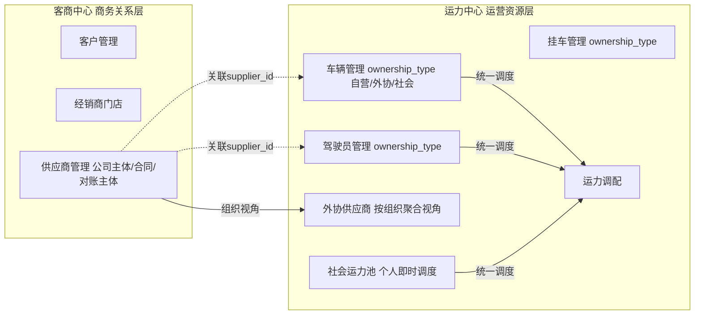
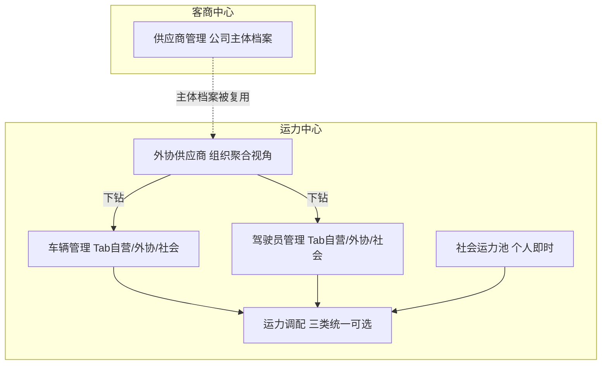
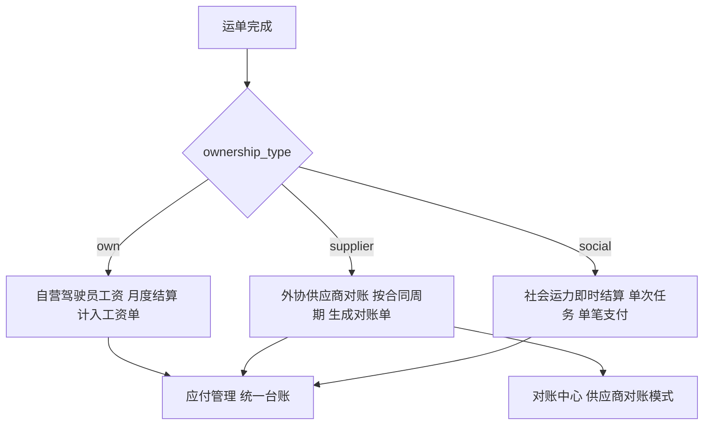

# 客户端菜单架构重构设计

> **文档状态**：方案设计（v2.0）
>
> **创建日期**：2026-04-16
>
> **v2.0 更新日期**：2026-04-19
>
> **优先级**：高
>
> **关联文档**：`项目文档/sys_menu.json`、`项目文档/05.开发计划/开发路线图.md`

## 版本沿革

| 版本 | 日期 | 主要变化 |
|------|------|---------|
| v1.0 | 2026-04-16 | 首版方案：9 个一级菜单的场景化重构 |
| v2.0 | 2026-04-19 | 1）「车队管理」升级为「运力中心」，承载自营/外协供应商/社会运力三类承运资源；2）「客商中心·供应商管理」升级为标准版；3）「财务结算·应付管理」拓展三类结算路径；4）预留「生态平台」一级菜单位置（货源/运力/服务三大厅，暂不下发） |

## 一、背景与问题

### 1.1 系统定位

智途（ZhiTu）的定位不是纯粹的 TMS（运输管理系统），而是**物流公司的操作系统**。这意味着系统需要：

- 覆盖物流公司运营全场景，而非仅运输链路
- 以角色工作流为组织维度，而非功能模块堆叠
- 原生融入 AI 能力，而非事后附加
- 具备审批流等企业级基础设施能力
- **承载多元承运渠道**：自营车队 + 外协供应商 + 社会运力，统一调度、分类管理（v2.0 新增）
- **预留平台生态能力**：货源大厅、运力大厅、服务大厅作为远期平台运营产品（v2.0 新增）

### 1.2 当前菜单结构

当前客户端共 **10 个一级菜单**，按技术/功能模块划分：

```
首页 → 数据分析 → 业务管理 → 运力中心 → 计费引擎 → 合作伙伴 → 财务管理 → 资源管理 → 基础数据 → 系统管理
```

#### 当前菜单树（app_type=client，仅活跃项）

```
├── 首页
│   └── 工作台
├── 数据分析
│   ├── 运营看板
│   └── 数据报表
├── 业务管理
│   ├── 运单管理
│   ├── 调度管理
│   ├── 在途追踪
│   └── 回单管理
├── 运力中心
│   ├── 运力列表
│   └── 运力历史
├── 计费引擎
│   └── 运价合同
├── 合作伙伴
│   └── 客户管理
├── 财务管理
│   ├── 应收管理
│   ├── 应付管理
│   └── 对账管理
├── 资源管理
│   ├── 车辆管理
│   ├── 挂车管理
│   ├── 驾驶员管理
│   └── 路线管理
├── 基础数据
│   ├── 地区数据
│   ├── 品牌车型
│   └── 经销商门店
└── 系统管理
    ├── 组织架构
    ├── 员工管理
    ├── 角色管理
    ├── 数据字典
    ├── 系统设置
    ├── 操作记录
    └── 登录记录
```

### 1.3 核心问题

| 问题 | 表现 | 影响 |
|------|------|------|
| 工作流割裂 | 调度员完成一次发运需跳转 业务管理(运单) → 运力中心(查运力) → 业务管理(调度) → 业务管理(追踪)，至少 3 个一级菜单 | 操作效率低，用户体验差 |
| 技术化命名 | "计费引擎"是开发术语，且仅包含客户运价，未覆盖内部成本规则 | 用户认知门槛高，功能定位不清 |
| 角色视角缺失 | 车队管理员需要的车辆、驾驶员、运力分散在"资源管理"和"运力中心" | 同一角色的工作被割裂到多处 |
| **承运渠道单一**（v2.0 补充） | 现有结构只考虑自有车队，外协供应商和社会运力无明确归属 | 无法承载真实业务场景，外协/社会运力数据散落 |
| 无 AI 集成 | 产品官网强调"AI 助理"能力，但客户端菜单未体现 | 产品差异化价值未传达 |
| 缺少审批能力 | 无审批流支撑，运单确认、费用审核等场景缺少管控手段 | 企业管理粗放 |
| **缺平台生态入口**（v2.0 补充） | 后期"找货/找车/找服务"三大厅产品在菜单架构中无锚点 | 平台化能力难以演进 |
| 定位不匹配 | 菜单结构仍是传统 TMS 风格 | 与"物流公司操作系统"定位脱节 |

---

## 二、设计原则

1. **场景驱动**：每个一级菜单对应一个角色的完整工作场景，而非一个技术模块
2. **减少跳转**：高频操作在同一菜单域内闭环完成
3. **AI 原生**：AI 能力不是附加功能，而是融入每个业务场景
4. **审批贯穿**：审批流作为操作系统级基础设施，贯穿全模块
5. **面向未来**：为移动端协同、IoT 车联网、开放生态预留扩展位
6. **渐进式呈现**：通过产品版本控制菜单可见性，基础版简洁、旗舰版完整
7. **承运渠道分层**（v2.0 新增）：商务关系层（客商中心）与运营资源层（运力中心）分离，三类承运资源（自营/外协/社会）通过统一数据模型承载，调度时统一可选

---

## 三、承运资源分层模型（v2.0 核心新设计）

### 3.1 三类承运资源的本质差异

物流公司的承运渠道在 v2.0 中明确为三类，分别对应不同的商务关系、管理粒度和结算方式：

| 维度 | 自营运力 | 外协供应商 | 社会运力 |
|------|---------|-----------|---------|
| 主体 | 公司内部 | 合作车队（公司主体） | 个人司机/车辆 |
| 商务关系 | 雇佣关系 | 框架合同 | 单次/短期协议 |
| 资源粒度 | 直接管理车辆/挂车/司机 | 管理供应商组织 + 其旗下车辆/司机 | 直接管理司机 + 车辆 |
| 调度优先级 | 优先 | 次选 / 补充 | 临时 / 应急 |
| 结算路径 | 工资 + 提成（应付·驾驶员工资） | 月结 / 趟结对账（应付·供应商对账） | 即时结算（应付·即时支付） |
| 主要管理菜单 | 运力中心·车辆/驾驶员/挂车（自营 Tab） | 客商中心·供应商管理 + 运力中心·外协供应商 | 运力中心·社会运力池 |

### 3.2 商务关系层 与 运营资源层 分离



### 3.3 关键约定

- **客商中心 · 供应商管理**：存储供应商**公司主体**信息——基础档案、联系人、合作合同、对账主体、信用评级。一个供应商档案维护一次，跨模块复用
- **运力中心 · 车辆 / 挂车 / 驾驶员**：所有承运资源的**统一资源档案**，新增 `ownership_type` 字段（自营/外协/社会）+ `supplier_id` 外键。页面顶部以 Tab 区分三类，业务字段差异化展示
- **运力中心 · 外协供应商**：**按供应商组织聚合的运力视角**，复用客商中心的供应商档案，下钻看每个供应商旗下的可用运力、合作历史、对账状态
- **运力中心 · 社会运力池**：个人外协运力的快速登记入口，**无需建立供应商主体**，适合临时/应急调度
- **运力调配**：跨三类承运资源**统一可选**，调度员一处操作即可完成派车，无需切换菜单

### 3.4 数据模型字段变更

车辆 / 驾驶员 / 挂车主表统一新增：

| 字段 | 类型 | 必填 | 说明 |
|------|------|------|------|
| ownership_type | enum('own','supplier','social') | 是，默认 'own' | 归属类型：自营/外协供应商/社会运力 |
| supplier_id | bigint | 仅 ownership_type='supplier' 时必填 | 关联客商中心 · 供应商表 |
| source_remark | varchar(255) | 否 | 来源备注（如社会运力的引荐人、合作渠道） |

---

## 四、新菜单结构（v2.0）

### 4.1 一级菜单总览（9 个 + 1 个预留位）

| 序号 | 菜单名称 | menu_code | sort_order | 面向角色 | icon | 阶段 | v2.0 变化 |
|------|---------|-----------|------------|---------|------|------|-----------|
| 1 | 智能工作台 | dashboard | 0 | 全员 | smart-workspace | 现有改造 | 不变 |
| 2 | 运营调度 | operation | 100 | 调度员/运营主管 | yunying | 阶段五 | 不变 |
| 3 | **运力中心** | **capacity** | 200 | 运力管家/车队长 | yunli | 阶段四 | **重命名（原 fleet 车队管理）+ 扩展承载三类承运资源** |
| 4 | 客商中心 | partner | 300 | 商务/客服 | keshang | 阶段四 | **供应商管理由远期升级为标准版** |
| 5 | 计费中心 | billing | 400 | 运营主管/财务 | jifei | 阶段四 | 不变 |
| 6 | 审批中心 | approval | 500 | 全员 | shenpi | 中期 | 不变 |
| 7 | 财务结算 | finance | 600 | 财务 | caiwu | 阶段六 | **应付管理拓展三类结算路径，对账中心新增供应商对账** |
| — | _生态平台（预留）_ | _ecosystem_ | _800_ | _全员_ | _shengtai_ | _远期_ | **预留位，feature 关闭暂不下发** |
| 8 | 数据洞察 | insight | 700 | 管理层/决策者 | shuju | 阶段七 | 不变 |
| 9 | 企业管理 | enterprise | 900 | 管理员 | qiye | 阶段三 | 不变 |

> 生态平台 sort_order=800 位于"数据洞察(700)"和"企业管理(900)"之间，未来开启时位置自然不打乱已有顺序。

### 4.2 完整菜单树（v2.0）

```
├── 1. 智能工作台
│   ├── 今日工作台          ← 聚合待办/审批/预警/关键指标，AI 今日摘要
│   └── AI 助手            ← 自然语言查询，智能建议（远期）
│
├── 2. 运营调度
│   ├── 运单管理            ← 运输计划录入、确认、全生命周期管理
│   ├── 智能调度            ← 派车派人，AI 推荐时跨"自营/外协/社会"三类候选
│   ├── 在途监控            ← 地图可视化、轨迹回放、异常预警
│   └── 回单签收            ← 电子回单、签收确认、影像管理
│
├── 3. 运力中心 [v2.0 重大变更]
│   ├── 车辆管理            ← 顶部 Tab：自营 | 外协 | 社会，统一档案管理
│   ├── 挂车管理            ← 顶部 Tab：自营 | 外协 | 社会
│   ├── 驾驶员管理          ← 顶部 Tab：自营 | 外协 | 社会
│   ├── 外协供应商          ← 新增：按供应商组织视角下钻其旗下运力（关联客商·供应商）
│   ├── 社会运力池          ← 新增：个人外协司机/车辆快速登记池
│   ├── 运力调配            ← 跨三类运力统一选择/绑定/解绑
│   ├── 运力记录            ← 历史调配记录
│   ├── 车辆维保            ← 主要面向自营，外协维保由供应商负责（远期）
│   └── 证照监控            ← 自营全监控；外协/社会按合作约定监控（远期）
│
├── 4. 客商中心
│   ├── 客户管理            ← 客户档案、分类、联系人、地址簿
│   ├── 经销商门店          ← 收车门店/网点信息维护
│   └── 供应商管理          ← 外协供应商公司主体档案 / 合同 / 对账主体（v2.0 升级为 standard）
│
├── 5. 计费中心
│   ├── 运价合同            ← 客户运价合同与运价明细（收入侧）
│   ├── 路线管理            ← 路线定义、核定公里数、标准时效
│   ├── 成本规则            ← 油费标准、公里数标准、各类费用基准（远期）
│   └── 费用模板            ← 可复用的费用计算模板（远期）
│
├── 6. 审批中心
│   ├── 我的待办            ← 待我审批的事项（跨模块聚合）
│   ├── 我的申请            ← 我发起的审批申请及进度
│   └── 审批记录            ← 历史审批记录查询
│
├── 7. 财务结算 [v2.0 应付逻辑拓展]
│   ├── 应收管理            ← 按客户/运单生成应收账单、收款登记
│   ├── 应付管理            ← 三类结算路径并行：自营驾驶员工资 / 外协供应商对账 / 社会运力即时结算
│   ├── 对账中心            ← 客户对账 + 供应商对账（v2.0 新增供应商对账模式）
│   ├── 发票管理            ← 开票申请、发票状态跟踪（远期）
│   └── 利润分析            ← 按路线/客户/车辆的利润分析（远期）
│
├── 8. 数据洞察
│   ├── 运营看板            ← 运单量趋势、收入/成本/利润率
│   ├── 数据报表            ← 多维度报表（车辆、客户、路线、驾驶员）
│   └── 智能预测            ← AI 预测运量、收入、风险预警（远期）
│
├── [预留] 生态平台（ecosystem，sort_order=800，暂不下发）
│   ├── 货源大厅            ← 物流公司去找新货源（平台撮合）
│   ├── 运力大厅            ← 自有/合作运力不足时去平台找补充运力
│   └── 服务大厅            ← 找优质生态服务商（保险/油卡/维修/金融等）
│
└── 9. 企业管理
    ├── 组织架构            ← 部门树形管理
    ├── 员工管理            ← 员工 CRUD、角色分配
    ├── 角色权限            ← 角色定义、菜单权限分配
    ├── 审批流程配置        ← 审批节点、审批人、条件流转规则
    ├── 基础数据            ← 地区数据、品牌车型
    ├── 数据字典            ← 企业级数据字典维护
    ├── 系统设置            ← 企业信息、业务参数配置
    ├── 操作记录            ← 操作日志查询
    └── 登录记录            ← 登录日志查询
```

---

## 五、各菜单设计详述

### 5.1 智能工作台

**定位**：全员入口，物流公司的"驾驶舱"

| 二级菜单 | path | component | feature_code | 阶段 |
|---------|------|-----------|-------------|------|
| 今日工作台 | /dashboard/workplace | /dashboard/workplace/index | base_dashboard | 现有改造 |
| AI 助手 | /dashboard/ai-assistant | /dashboard/ai-assistant/index | ai_assistant | 远期 |

**今日工作台聚合内容**：

- 待审批事项数量及快捷入口
- 待确认运单数 / 在途车辆数（含三类承运资源）
- 即将到期的证件提醒
- 应收应付账款摘要
- AI 今日运营摘要（远期）
- 快捷操作入口（新建运单、新建调度等）
- _生态平台快捷卡片（远期开关，连通服务大厅）_

**设计意图**：登录后第一印象就是"智能化操作系统"。一屏聚合全公司运营状态，管理者无需逐个模块巡检。

### 5.2 运营调度

**定位**：调度员/运营主管的核心工作域，运输业务全闭环

| 二级菜单 | path | component | feature_code | 阶段 |
|---------|------|-----------|-------------|------|
| 运单管理 | /operation/waybill | /operation/waybill/index | biz_waybill | 阶段五 |
| 智能调度 | /operation/dispatch | /operation/dispatch/index | biz_dispatch | 阶段五 |
| 在途监控 | /operation/tracking | /operation/tracking/index | biz_tracking | 阶段五 |
| 回单签收 | /operation/receipt | /operation/receipt/index | biz_receipt | 阶段五 |

**工作流闭环**：

```
录入运单 → 确认运单 → 调度派车 → 在途跟踪 → 到达签收 → 回单确认
   ↑                  │                                    │
   │                  └── 跨自营/外协/社会三类运力统一可选 ──┤
   └────────────── 全部在「运营调度」菜单内完成 ──────────────┘
```

**AI 融入点**：
- 智能调度：根据车辆位置、载重能力、司机偏好、历史表现自动推荐最优车辆+司机组合，候选池**跨自营/外协/社会**三类
- 在途监控：AI 检测异常停留、偏航、超时，自动触发预警
- _远期_：从「货源大厅」一键导入新运单（平台运营产品成熟后开放）

### 5.3 运力中心 [v2.0 重大变更]

**定位**：运力管家 / 车队长 的工作域，**承载自营 / 外协供应商 / 社会运力三类承运资源的统一管理与调配**

| 二级菜单 | path | component | feature_code | 阶段 | v2.0 变化 |
|---------|------|-----------|-------------|------|----------|
| 车辆管理 | /capacity/vehicle | /capacity/vehicle/index | resource_vehicle | 阶段四 | Tab 区分三类归属，新增 ownership_type 字段 |
| 挂车管理 | /capacity/trailer | /capacity/trailer/index | resource_trailer | 阶段四 | 同上 |
| 驾驶员管理 | /capacity/driver | /capacity/driver/index | resource_driver | 阶段四 | 同上 |
| **外协供应商** | /capacity/external-carrier | /capacity/external-carrier/index | **carrier_external** | 阶段四 | **新增**，按供应商组织视角下钻 |
| **社会运力池** | /capacity/social | /capacity/social/index | **carrier_social** | 阶段四 | **新增**，个人外协运力快速登记池 |
| 运力调配 | /capacity/dispatch | /capacity/dispatch/index | capacity_manage | 阶段四 | 跨三类统一可选 |
| 运力记录 | /capacity/dispatch-log | /capacity/dispatch-log/index | capacity_manage | 阶段四 | 不变 |
| 车辆维保 | /capacity/maintenance | /capacity/maintenance/index | fleet_maintenance | 远期 | 主要面向自营 |
| 证照监控 | /capacity/compliance | /capacity/compliance/index | fleet_compliance | 远期 | 三类按合作约定差异化监控 |

**v2.0 设计意图**：

1. **承运范围扩展**：原"车队管理"语义偏窄（仅自营），升级为"运力中心"以承载三类承运资源
2. **资源档案统一**：车辆 / 挂车 / 驾驶员沿用原菜单，但所有归属类型的资源都在此录入，通过 Tab 切换查看
3. **组织视角增强**：新增"外协供应商"二级菜单，按供应商组织聚合运力，便于运力管家定向管理特定供应商
4. **社会运力池独立**：新增"社会运力池"承载个人外协运力的快速登记，无需建立公司主体档案，匹配临时/应急场景
5. **调度统一**：调度员在「运力调配」一处即可跨三类选择运力，无需切换菜单

**与「客商中心 · 供应商管理」的协作关系**：

- 客商中心的供应商 = **公司主体档案**（一次维护）：基础信息、合作合同、对账周期、信用、联系人
- 运力中心的"外协供应商" = **运力组织视角**（复用主体档案）：在主体档案下挂载该供应商的具体车辆、司机、当前可用状态、合作历史



**AI 融入点**：
- 证照监控：证件到期前自动提醒，智能排期年检/保养
- 车辆维保（远期）：基于里程和时间预测维保需求
- 智能调度时基于历史合作表现，对外协/社会运力做风控评分
- _远期_：「运力调配」候选列表底部接入「运力大厅」找补充运力

### 5.4 客商中心 [v2.0 微调]

**定位**：商务/客服的工作域，管理"跟谁做生意"——客户、收车终端、外协供应商三类商务关系

| 二级菜单 | path | component | feature_code | 阶段 | v2.0 变化 |
|---------|------|-----------|-------------|------|----------|
| 客户管理 | /partner/customer | /partner/customer/index | partner_customer | 阶段四 | 不变 |
| 经销商门店 | /partner/dealer | /partner/dealer/index | basic_data_dealer | 阶段四 | 不变 |
| 供应商管理 | /partner/supplier | /partner/supplier/index | partner_supplier | 阶段四 | **由远期升级为标准版** |

**v2.0 升级原因**：外协供应商运力是物流公司普遍存在的核心场景（很多中小物流公司外协占比 30%~70%），不应作为旗舰版功能限制。供应商管理与运力中心·外协供应商配套使用：

- 客商中心 · 供应商管理：供应商**公司主体档案**——基础信息、联系人、框架合同、对账周期、信用评级
- 运力中心 · 外协供应商：**复用上述档案**，提供"按供应商组织"的运力管理与调度视角

### 5.5 计费中心

**定位**：收入规则 + 成本规则的双引擎，物流公司的"定价与成本大脑"

| 二级菜单 | path | component | feature_code | 阶段 |
|---------|------|-----------|-------------|------|
| 运价合同 | /billing/contract | /billing/contract/index | billing_contract | 阶段四 |
| 路线管理 | /billing/route | /billing/route/index | billing_route | 阶段四 |
| 成本规则 | /billing/cost-rule | /billing/cost-rule/index | billing_cost_rule | 远期 |
| 费用模板 | /billing/fee-template | /billing/fee-template/index | billing_fee_template | 远期 |

**收入侧与成本侧**：

```
┌─────────────────── 计费中心 ───────────────────┐
│                                                 │
│  收入侧（对外）           成本侧（对内）         │
│  ┌──────────────┐      ┌───────────────────┐   │
│  │ 运价合同      │      │ 成本规则           │   │
│  │ · 客户运价    │      │ · 核定油费标准     │   │
│  │ · 按路线定价  │      │ · 核定公里数标准   │   │
│  │ · 按品牌定价  │      │ · 过路费基准       │   │
│  └──────┬───────┘      │ · 装卸费标准       │   │
│         │              │ · 其他费用基准     │   │
│         │              └────────┬──────────┘   │
│         │                       │               │
│         │    ┌──────────────┐   │               │
│         └───→│ 路线管理      │←──┘               │
│              │ · 路线定义    │                    │
│              │ · 核定公里数  │                    │
│              │ · 标准时效    │                    │
│              └──────────────┘                    │
│                                                 │
│              ┌──────────────┐                    │
│              │ 费用模板      │                    │
│              │ · 按趟/按吨   │                    │
│              │ · 按台/按公里  │                    │
│              └──────────────┘                    │
└─────────────────────────────────────────────────┘
         │                        │
         ▼                        ▼
   财务结算·应收管理         财务结算·应付管理
```

**设计意图**：路线管理归入计费中心，因为路线的**核定公里数**是成本计算和运价匹配的核心输入。成本规则覆盖公司内部核定的各类费用标准，为应付结算和利润分析提供数据基础。

### 5.6 审批中心

**定位**：跨模块审批流聚合，操作系统级基础设施

| 二级菜单 | path | component | feature_code | 阶段 |
|---------|------|-----------|-------------|------|
| 我的待办 | /approval/pending | /approval/pending/index | approval_manage | 中期 |
| 我的申请 | /approval/initiated | /approval/initiated/index | approval_manage | 中期 |
| 审批记录 | /approval/history | /approval/history/index | approval_manage | 中期 |

**典型审批场景**：

| 审批类型 | 触发场景 | 审批人示例 |
|---------|---------|-----------|
| 运单审批 | 大额运单、特殊运单需上级确认 | 运营主管 |
| 费用审批 | 超标费用报销、异常成本审核 | 财务主管 |
| 运价审批 | 新运价合同/运价调整生效前 | 总经理 |
| 车辆审批 | 车辆报废申请、新购申请 | 车队长 → 总经理 |
| **外协供应商准入审批**（v2.0 新增） | 新供应商入库、合同变更 | 商务主管 → 总经理 |
| **社会运力准入审批**（v2.0 新增） | 高风险/大额社会运力首次合作 | 运力管家 → 风控 |
| 人事审批 | 驾驶员入职/离职审批 | 人事主管 |
| 维修审批 | 大额维修费用审批 | 车队长 → 财务 |

**设计意图**：审批能力是"操作系统"区别于"工具软件"的核心特征。独立的审批中心聚合全模块审批事项，用户无需逐个进入业务模块查看。类似钉钉/飞书的审批中心体验，体现平台化能力。

**审批中心 vs 审批流程配置**：
- **审批中心**（一级菜单）：日常操作入口，处理审批事项
- **审批流程配置**（企业管理下）：管理员设置审批规则的地方（谁审批什么、几级审批、条件流转）

### 5.7 财务结算 [v2.0 应付逻辑拓展]

**定位**：财务人员的工作域，消费计费中心的规则输出，**支持三类承运资源的差异化结算**

| 二级菜单 | path | component | feature_code | 阶段 | v2.0 变化 |
|---------|------|-----------|-------------|------|----------|
| 应收管理 | /finance/receivable | /finance/receivable/index | finance_receivable | 阶段六 | 不变 |
| 应付管理 | /finance/payable | /finance/payable/index | finance_payable | 阶段六 | **三类结算路径并行** |
| 对账中心 | /finance/reconciliation | /finance/reconciliation/index | finance_reconciliation | 阶段六 | **新增供应商对账模式** |
| 发票管理 | /finance/invoice | /finance/invoice/index | finance_invoice | 远期 | 不变 |
| 利润分析 | /finance/profit | /finance/profit/index | finance_profit | 远期 | 不变 |

**v2.0 应付管理三路径**：应付管理需根据运单关联的运力 `ownership_type` 自动分流到不同结算路径：



| 结算路径 | 触发来源 | 结算节奏 | 主要单据 |
|---------|---------|---------|---------|
| 自营驾驶员工资 | ownership_type='own' | 月度 | 工资单（含基本工资+提成+扣款） |
| 外协供应商对账 | ownership_type='supplier' | 按合同周期（月/季） | 对账单（多运单聚合） |
| 社会运力即时结算 | ownership_type='social' | 单次/T+N | 即时支付凭证 |

**对账中心扩展**：原"客户对账"基础上新增"供应商对账"模式，与外协供应商按合同周期生成对账单，支持差异核对和导出。

**数据流向**：

```
计费中心·运价合同 ──→ 应收管理（收入 = 运价 × 数量）
计费中心·成本规则 ──→ 应付管理（成本 = 核定费用标准）
                       │
                       ├── 自营运单 ──→ 驾驶员工资
                       ├── 外协运单 ──→ 供应商对账 ──→ 对账中心
                       └── 社会运单 ──→ 即时支付

应收 - 应付 ─────────→ 利润分析（按路线/客户/车辆/承运类型）
```

**AI 融入点**：利润分析模块接入 AI 预测，基于历史数据预测未来利润趋势；按承运类型对比毛利率，辅助运力结构优化决策。

### 5.8 数据洞察

**定位**：决策层的数据中心，从数据到决策的转化

| 二级菜单 | path | component | feature_code | 阶段 |
|---------|------|-----------|-------------|------|
| 运营看板 | /insight/overview | /insight/overview/index | bi_overview | 阶段七 |
| 数据报表 | /insight/report | /insight/report/index | bi_report | 阶段七 |
| 智能预测 | /insight/prediction | /insight/prediction/index | bi_prediction | 远期 |

**v2.0 报表维度增强**：数据报表新增"承运结构分析"维度，对比自营/外协/社会三类运力的运单量、成本、利润、准点率。

**AI 融入点**：智能预测模块提供 AI 驱动的运量预测、收入预测、风险预警等前瞻性分析能力。

### 5.9 企业管理

**定位**：管理员后台，合并原"系统管理"和"基础数据"

| 二级菜单 | path | component | feature_code | 阶段 |
|---------|------|-----------|-------------|------|
| 组织架构 | /enterprise/organization | /enterprise/organization/index | base_organization | 阶段三 |
| 员工管理 | /enterprise/user | /enterprise/user/index | base_user | 阶段三 |
| 角色权限 | /enterprise/role | /enterprise/role/index | base_role | 阶段三 |
| 审批流程配置 | /enterprise/approval-config | /enterprise/approval-config/index | approval_config | 中期 |
| 基础数据 | /enterprise/basic-data | /enterprise/basic-data/index | basic_data | 阶段三 |
| 数据字典 | /enterprise/dictionary | /enterprise/dictionary/index | base_dict | 阶段三 |
| 系统设置 | /enterprise/config | /enterprise/config/index | base_config | 阶段三 |
| 操作记录 | /enterprise/operation-log | /enterprise/operation-log/index | base_log | 阶段三 |
| 登录记录 | /enterprise/login-log | /enterprise/login-log/index | base_log | 阶段三 |

**设计意图**：将原"系统管理"和"基础数据"合并，减少一级菜单数量。"基础数据"（地区、品牌车型）降为企业管理的二级菜单。新增"审批流程配置"作为审批中心的规则管理后台。

---

## 六、生态平台预留设计（v2.0 新增）

### 6.1 三大厅产品定位

三大厅是**平台运营的产品**，旨在为物流公司提供"找货 / 找车 / 找优质服务商"的能力，是"物流公司操作系统"向"物流行业协作网络"演进的关键载体。

| 大厅 | menu_code | path | feature_code | 用户视角 | 平台价值 |
|------|-----------|------|-------------|---------|---------|
| 货源大厅 | cargo-hall | /ecosystem/cargo-hall | ecosystem_cargo_hall | 物流公司去找新货源（被发货方/平台撮合） | 为物流公司拓展业务来源 |
| 运力大厅 | capacity-hall | /ecosystem/capacity-hall | ecosystem_capacity_hall | 自有/合作运力不足时去平台找补充运力 | 跨企业撮合运力余量 |
| 服务大厅 | service-hall | /ecosystem/service-hall | ecosystem_service_hall | 找优质生态服务商（保险/油卡/维修/金融等） | 平台生态变现入口 |

### 6.2 预留方式

为避免一级菜单膨胀、又确保后期演进路径清晰，采用**预留位 + feature 开关**机制：

- **菜单数据预定义**：在 `sys_menu` 表中预定义 1 个一级菜单 + 3 个二级菜单（共 4 条记录），但 `is_visible=0` 或加 `feature_flag` 控制
- **位置占位**：一级菜单 sort_order=800，位于"数据洞察(700)"和"企业管理(900)"之间，未来开启时位置自然不打乱已有顺序
- **版本隔离**：feature_code（`ecosystem_cargo_hall`、`ecosystem_capacity_hall`、`ecosystem_service_hall`）归入未来 `ecosystem` 版本（暂不归入任何现有版本）
- **当前不影响**：当前用户菜单可见性和体验完全不变

### 6.3 远期扩展锚点（设计预留，暂不实现）

为方便后期"业务模块 → 大厅"的快捷跳转，设计层面预留以下接入点：

| 业务菜单 | 接入点 | 跳转目标 |
|---------|-------|---------|
| 运营调度 · 运单管理 | 列表右上角"从货源大厅找货" | 货源大厅 |
| 运力中心 · 运力调配 | 候选列表底部"从运力大厅找补充运力" | 运力大厅 |
| 智能工作台 · 今日工作台 | 右上角"服务大厅"快捷卡片 | 服务大厅 |
| 客商中心 · 供应商管理 | 列表顶部"从运力大厅认证优质供应商" | 运力大厅 |

### 6.4 演进路线

```
v2.0（本期）        v2.x（中期）          v3.0（远期）
预留 sys_menu  ──→ feature 开关下发  ──→ 三大厅独立成为生态平台一级菜单
4 条记录            灰度试点企业            全量上线 + 业务模块锚点联动
```

---

## 七、核心模块关系

### 7.1 业务数据流

```
┌──────────┐    客户信息     ┌──────────────┐    运单数据    ┌──────────┐
│ 客商中心  │──────────────→│  运营调度     │──────────────→│ 财务结算  │
│ 客户/经销商│              │ 运单→调度→    │              │ 应收管理  │
│ /供应商   │              │ 在途→回单     │              └──────────┘
└──────────┘              └──────┬───────┘                    ↑
      │                          │                       运价规则 │
      │ 供应商主体档案            │                            │
      ▼                          │                    ┌──────┴───┐
┌──────────────┐    运力资源     │                    │ 计费中心   │
│ 运力中心      │──────────────→┘                    │ 运价合同   │
│ 三类承运资源  │                  运单数据             │ 路线管理   │
│ 自营/外协/社会│  ────────────────────────────────→ │ 成本规则   │
└──────────────┘                                       └──────┬───┘
                                                        成本规则 │
                                                              ↓
                                                  ┌────────────────────┐
                                                  │ 财务结算 · 应付管理 │
                                                  │ ├ 自营→驾驶员工资   │
                                                  │ ├ 外协→供应商对账   │
                                                  │ └ 社会→即时结算     │
                                                  └──────────┬─────────┘
                                                             │
                                                       应收-应付 │
                                                             ↓
                                                       ┌──────────┐
                                                       │ 财务结算  │
                                                       │ 利润分析  │
                                                       └──────────┘
```

### 7.2 审批流贯穿

```
运营调度 ─── 运单审批 ──┐
                        │
计费中心 ─── 运价审批 ──┤
                        ├──→ 审批中心（聚合展示）←── 审批流程配置（企业管理）
财务结算 ─── 费用审批 ──┤
                        │
运力中心 ─── 车辆审批 ──┤
                        │
客商中心 ─── 供应商准入 ┘  （v2.0 新增）
```

---

## 八、新旧对照

### 8.1 一级菜单变化

| 旧一级菜单（10个） | 归入新菜单（9 个 + 1 预留） | 变化说明 |
|-----------|-----------|---------|
| 首页 | 智能工作台 | 升级为 AI 驱动的聚合工作台 |
| 数据分析 | 数据洞察 | 更名，远期增加 AI 预测 |
| 业务管理 | 运营调度 | 更名，强调场景化闭环 |
| 运力中心（旧） | **运力中心（新，capacity）** | 重命名 + 大幅扩展（自营/外协/社会三类） |
| 计费引擎 | 计费中心 | 保留独立一级，扩展为收入+成本双侧引擎，路线管理归入 |
| 合作伙伴 | 客商中心 | 聚焦客户/经销商/**供应商**等商务关系（供应商升级为标准版） |
| 财务管理 | 财务结算 | 微调命名，**应付管理拓展三类结算路径** |
| 资源管理 | **运力中心** + 计费中心 | 车辆/驾驶员/挂车归入运力中心；路线归入计费中心 |
| 基础数据 | 企业管理 | 降为企业管理的二级菜单 |
| 系统管理 | 企业管理 | 更名，合并基础数据，新增审批流程配置 |
| -- | 审批中心（新增） | 跨模块审批流聚合，操作系统级基础设施 |
| -- | _生态平台（v2.0 预留位）_ | 预留货源/运力/服务三大厅，暂不下发 |

### 8.2 路由路径对照（v2.0 调整）

| 旧路径 | v2.0 路径 | 说明 |
|--------|--------|------|
| /dashboard/workplace | /dashboard/workplace | 不变 |
| /analytics/overview | /insight/overview | 菜单域变更 |
| /analytics/report | /insight/report | 菜单域变更 |
| /business/waybill | /operation/waybill | 菜单域变更 |
| /business/dispatch | /operation/dispatch | 菜单域变更 |
| /business/tracking | /operation/tracking | 菜单域变更 |
| /business/receipt | /operation/receipt | 菜单域变更 |
| /capacity/list | /capacity/dispatch | 菜单域变更（路径前缀沿用） |
| /capacity/log | /capacity/dispatch-log | 菜单域变更 |
| /billing/contract | /billing/contract | 不变 |
| /resource/vehicle | **/capacity/vehicle** | 菜单域变更（fleet → capacity） |
| /resource/trailer | **/capacity/trailer** | 菜单域变更 |
| /resource/driver | **/capacity/driver** | 菜单域变更 |
| /resource/route | /billing/route | 归入计费中心 |
| — | **/capacity/external-carrier** | **v2.0 新增**：外协供应商运力视角 |
| — | **/capacity/social** | **v2.0 新增**：社会运力池 |
| /partner/customer | /partner/customer | 不变 |
| /basic_data/dealer | /partner/dealer | 归入客商中心 |
| — | **/partner/supplier** | **v2.0 升级为标准版** |
| /finance/receivable | /finance/receivable | 不变 |
| /finance/payable | /finance/payable | 不变（内部结算路径拓展为三类） |
| /finance/reconciliation | /finance/reconciliation | 不变（新增供应商对账模式） |
| /basic_data/regional_data | /enterprise/basic-data | 降为企业管理二级 |
| /basic_data/brand_series | /enterprise/basic-data | 降为企业管理二级 |
| /system/organization | /enterprise/organization | 菜单域变更 |
| /system/user | /enterprise/user | 菜单域变更 |
| /system/role | /enterprise/role | 菜单域变更 |
| /system/dictionary | /enterprise/dictionary | 菜单域变更 |
| /system/config | /enterprise/config | 菜单域变更 |
| /logcenter/operation-record | /enterprise/operation-log | 菜单域变更 |
| /logcenter/login-record | /enterprise/login-log | 菜单域变更 |
| — | _/ecosystem/cargo-hall_ | _v2.0 预留位_ |
| — | _/ecosystem/capacity-hall_ | _v2.0 预留位_ |
| — | _/ecosystem/service-hall_ | _v2.0 预留位_ |

### 8.3 v1.0 → v2.0 增量变更（专项汇总）

| v1.0 | v2.0 | 变化原因 |
|------|------|---------|
| 车队管理 (fleet) | **运力中心 (capacity)** | 承载范围扩展到外协+社会运力，"车队"语义偏窄 |
| 车队管理·车辆/驾驶员/挂车 | 运力中心·车辆/驾驶员/挂车 + Tab 三类归属 | 数据模型新增 ownership_type / supplier_id |
| — | 运力中心·**外协供应商**（新增） | 按组织视角管理外协运力 |
| — | 运力中心·**社会运力池**（新增） | 个人外协运力快速登记 |
| 客商中心·供应商管理 (远期/enterprise) | 客商中心·供应商管理 (**standard**) | 外协业务是普遍刚需 |
| 财务结算·应付管理（单一路径） | 应付管理（**三类路径**：工资/对账/即时） | 适配三类运力差异化结算 |
| 财务结算·对账中心（仅客户对账） | 对账中心（**+ 供应商对账**） | 对接外协供应商 |
| — | _生态平台（预留位）_ | 三大厅未来独立挂载点 |

---

## 九、产品版本与菜单对应关系（v2.0）

| 版本 | 可见的一级菜单 | 说明 |
|------|-------------|------|
| basic（基础版） | 智能工作台、企业管理 | 基础管理能力 |
| standard（标准版） | + 运营调度、**运力中心（含三类承运资源）**、客商中心（**含供应商管理**）、计费中心 | 完整运输业务能力 |
| pro（专业版） | + 审批中心、财务结算（**三路径应付**）、数据洞察 | 企业级管理 + 数据分析 |
| enterprise（旗舰版） | 全功能 + AI 助手、智能预测、利润分析、车辆维保、证照监控 | 全功能 + AI 增值 |
| _ecosystem（生态版，远期）_ | _+ 生态平台（货源/运力/服务三大厅）_ | _平台运营产品_ |

### 9.1 feature_code 清单（v2.0）

| feature_code | 功能名称 | 所属菜单 | 版本要求 | v2.0 变化 |
|-------------|---------|---------|---------|----------|
| base_dashboard | 工作台 | 智能工作台 | basic | — |
| ai_assistant | AI 助手 | 智能工作台 | enterprise | — |
| biz_waybill | 运单管理 | 运营调度 | standard | — |
| biz_dispatch | 智能调度 | 运营调度 | standard | — |
| biz_tracking | 在途监控 | 运营调度 | standard | — |
| biz_receipt | 回单签收 | 运营调度 | standard | — |
| resource_vehicle | 车辆管理 | 运力中心 | standard | 字段扩展（ownership_type） |
| resource_trailer | 挂车管理 | 运力中心 | standard | 同上 |
| resource_driver | 驾驶员管理 | 运力中心 | standard | 同上 |
| **carrier_external** | **外协供应商**（运力视角） | 运力中心 | **standard** | **v2.0 新增** |
| **carrier_social** | **社会运力池** | 运力中心 | **standard** | **v2.0 新增** |
| capacity_manage | 运力调配/记录 | 运力中心 | standard | 跨三类候选 |
| fleet_maintenance | 车辆维保 | 运力中心 | enterprise | — |
| fleet_compliance | 证照监控 | 运力中心 | enterprise | — |
| partner_customer | 客户管理 | 客商中心 | standard | — |
| basic_data_dealer | 经销商门店 | 客商中心 | standard | — |
| **partner_supplier** | **供应商管理** | 客商中心 | **standard** | **v2.0 由 enterprise 提前到 standard** |
| billing_contract | 运价合同 | 计费中心 | standard | — |
| billing_route | 路线管理 | 计费中心 | standard | — |
| billing_cost_rule | 成本规则 | 计费中心 | enterprise | — |
| billing_fee_template | 费用模板 | 计费中心 | enterprise | — |
| approval_manage | 审批中心 | 审批中心 | pro | — |
| approval_config | 审批流程配置 | 企业管理 | pro | — |
| finance_receivable | 应收管理 | 财务结算 | pro | — |
| finance_payable | 应付管理 | 财务结算 | pro | **支持三类结算路径** |
| finance_reconciliation | 对账中心 | 财务结算 | pro | **+ 供应商对账模式** |
| finance_invoice | 发票管理 | 财务结算 | enterprise | — |
| finance_profit | 利润分析 | 财务结算 | enterprise | — |
| bi_overview | 运营看板 | 数据洞察 | pro | — |
| bi_report | 数据报表 | 数据洞察 | pro | + 承运结构分析维度 |
| bi_prediction | 智能预测 | 数据洞察 | enterprise | — |
| base_organization | 组织架构 | 企业管理 | basic | — |
| base_user | 员工管理 | 企业管理 | basic | — |
| base_role | 角色权限 | 企业管理 | basic | — |
| basic_data | 基础数据 | 企业管理 | basic | — |
| base_dict | 数据字典 | 企业管理 | basic | — |
| base_config | 系统设置 | 企业管理 | basic | — |
| base_log | 操作/登录记录 | 企业管理 | basic | — |
| **ecosystem_cargo_hall** | **货源大厅** | 生态平台 | **ecosystem（远期）** | **v2.0 预留** |
| **ecosystem_capacity_hall** | **运力大厅** | 生态平台 | **ecosystem（远期）** | **v2.0 预留** |
| **ecosystem_service_hall** | **服务大厅** | 生态平台 | **ecosystem（远期）** | **v2.0 预留** |

---

## 十、AI 集成规划

### 10.1 AI 能力矩阵

| AI 能力 | 融入菜单 | 具体场景 | 优先级 |
|---------|---------|---------|--------|
| 今日摘要 | 智能工作台 > 今日工作台 | AI 自动生成当日运营要点，含审批提醒、异常通知 | 中 |
| AI 助手 | 智能工作台 > AI 助手 | 自然语言查询全系统数据（"上个月哪条路线利润最高？"） | 低 |
| 智能调度推荐 | 运营调度 > 智能调度 | 基于车辆位置、载重、司机偏好推荐最优派车方案，**候选跨自营/外协/社会三类** | 高 |
| 异常预警 | 运营调度 > 在途监控 | AI 检测异常停留、偏航、超时，自动触发预警 | 高 |
| **承运资源风控评分**（v2.0） | 运力中心 > 外协供应商/社会运力池 | 基于历史合作表现对外协/社会运力打分，辅助调度优选 | 中 |
| 证照提醒 | 运力中心 > 证照监控 | 证件到期前智能提醒、年检排期建议 | 中 |
| 智能计费建议 | 计费中心 | AI 分析历史数据，建议运价调整方向和成本优化策略 | 低 |
| **承运结构优化建议**（v2.0） | 数据洞察 > 数据报表 | 对比三类运力毛利率，建议自营/外协/社会的最优配比 | 中 |
| 利润预测 | 财务结算 > 利润分析 | 基于历史数据预测未来利润趋势 | 低 |
| 运量预测 | 数据洞察 > 智能预测 | 预测未来运输需求，辅助资源规划 | 低 |

### 10.2 AI 集成阶段

| 阶段 | 能力 | 说明 |
|------|------|------|
| Phase 1 | 智能调度推荐、异常预警 | 核心业务场景，直接提升运营效率 |
| Phase 2 | 今日摘要、证照提醒、承运资源风控评分 | 信息聚合与提醒类，提升管理效率 |
| Phase 3 | AI 助手、运量/利润预测、计费建议、承运结构优化建议 | 高级分析与决策辅助 |

---

## 十一、实施规划

### 11.1 本次输出

- 本设计文档 v2.0（本文件）

### 11.2 后续步骤

| 步骤 | 内容 | 前置条件 |
|------|------|---------|
| 1 | 更新 `seed_client_menus.py` 种子数据脚本（按 v2.0 结构，包含生态平台预留 4 条记录） | 本文档方案确认 |
| 2 | 更新 `seed_product_features.py` 功能版本映射（含 carrier_external、carrier_social 与 partner_supplier 版本调整） | 步骤 1 完成 |
| 3 | 车辆/驾驶员/挂车主表新增 `ownership_type` `supplier_id` 字段及迁移脚本 | 阶段四开发启动 |
| 4 | 前端路由和组件目录结构按新菜单域调整（fleet → capacity） | 步骤 1、2 完成 |
| 5 | 已有页面（车辆、驾驶员、运力等）迁移到新路由 | 步骤 4 完成 |
| 6 | "外协供应商"和"社会运力池"模块独立需求文档 | 阶段四中段 |
| 7 | 财务结算·应付管理三路径设计与开发 | 阶段六前 |
| 8 | 审批中心模块设计与开发 | 单独立项，独立需求文档 |
| 9 | 计费中心·成本规则模块设计与开发 | 单独立项，独立需求文档 |
| 10 | 三大厅（生态平台）产品需求 PRD 独立立项 | 平台运营产品规划成熟后 |

### 11.3 迁移注意事项

- 菜单数据迁移需同步更新 `sys_menu` 表（app_type=client 的记录）
- 旧菜单项通过 `is_deleted=1` 软删除，新菜单项新增
- 已有前端组件文件暂不移动物理位置，通过 `component` 字段映射到正确的组件路径
- 角色菜单分配（`biz_role_menu`）需在迁移脚本中同步更新
- 产品版本功能关联（`sys_version_feature`）需同步更新
- **v2.0 数据模型迁移**：
  - 车辆/驾驶员/挂车存量数据默认 `ownership_type='own'`（向后兼容）
  - `supplier_id` 默认 NULL，仅 ownership_type='supplier' 时强校验非空
  - 应付管理存量数据默认走"自营驾驶员工资"路径，不影响历史账目
- **v2.0 生态平台预留**：在 `sys_menu` 表预定义 4 条记录（cargo-hall / capacity-hall / service-hall + 一级菜单 ecosystem），`is_visible=0` 或 `feature_flag` 控制不可见，避免后续上线时菜单结构大调

---

## 十二、v2.0 升级实施纪要（已实现）

### 12.1 已完成产物清单

- 后端 seed 源（v2.0 终态）
  - `backend/scripts/seed/sys_menu.json` ：156 条记录（client 活跃 103 + 软删 + 平台 53）
  - `backend/scripts/seed/seed_client_menus.py` ：支持基于 `_seed_id` 主键匹配（v2.0 重命名/路径变更可原地 UPDATE），并对 ID 主键冲突做了显式预检与报错
  - `backend/scripts/seed/seed_product_features.py` ：44 个 feature_code，按 basic/standard/pro/enterprise/ecosystem 五档累积式映射
  - `backend/scripts/seed/seed_data.py` ：新增 `ecosystem` 版本（status=0，远期开启），`enterprise` 显示名调整为「旗舰版」
- 数据修复 + 迁移脚本
  - `backend/scripts/fix/fix_client_menu_v2.py` （新增）：清理历史脏数据
  - `backend/scripts/fix/migrate_client_menu_v2.py` ：组合"修复 → 软删旧容器 → 同步菜单 → 同步 feature"四步
- 文档
  - `项目文档/sys_menu.sql` ：与 seed/sys_menu.json 一致的全量 INSERT 文档
  - 本设计文档（v2.0）

### 12.2 历史 ID 冲突说明（重要）

v2.0 中 client 端「运力中心 / 运力调配 / 查询」分别占用 `sys_menu.id = 260 / 261 / 262`。

但在 v1.0 历史 DB 中，这三个 ID 已被旧的 platform 菜单（用户管理 / 司机列表 / 平台运力）占用。这些 platform 记录虽已被 `is_deleted=1` 软删除，但主键仍占用，导致 `seed_client_menus.py` 直接 INSERT 时触发 `Duplicate entry for PRIMARY KEY` 错误。

| ID | v2.0 设计 (client) | v1.0 历史 (platform, deleted) | 当前 platform 菜单替代 |
|----|------|------|------|
| 260 | 运力中心 (root) | 用户管理 | id=14 用户管理 |
| 261 | 运力调配 | 司机列表 | id=16 司机列表 |
| 262 | 查询 | 平台运力 | id=270 运力中心 (platform) |

**处理方案**：在 `fix_client_menu_v2.py` 中**物理删除**这三条已废弃的 platform 记录（确认它们 `app_type='platform' AND is_deleted=1`），释放主键供 client 使用。该操作幂等、无副作用，旧 platform 「用户管理」业务已由新 ID 14 接管。

### 12.3 推荐执行顺序

**全新部署**（无 v1.0 历史数据）：
```bash
python backend/scripts/init/init_dev_env.py    # 一键初始化
```

**已运行过 v1.0 / 中途版本，需升级到 v2.0**：
```bash
# 1) 预览变更（不写库）
python backend/scripts/fix/migrate_client_menu_v2.py --dry-run

# 2) 一键完成全部升级
python backend/scripts/fix/migrate_client_menu_v2.py
#   ├── 第零步：fix_client_menu_v2 清理 ID 冲突 + 重复 + 自引用
#   ├── 第一步：软删除 v2.0 已废弃容器（177/200/208）
#   ├── 第二步：seed_client_menus.py --force-all（首次 v2 切换需重排）
#   └── 第三步：seed_product_features.py（同步 feature 与版本关联）
```

**只想单独修复脏数据**（不重跑 seed）：
```bash
python backend/scripts/fix/fix_client_menu_v2.py --dry-run
python backend/scripts/fix/fix_client_menu_v2.py
python backend/scripts/fix/fix_client_menu_v2.py --soft-delete-orphans  # 顺带软删孤儿
```

### 12.4 前端目录调整结论

v2.0 菜单的 `component` 字段尽量复用旧文件路径（`/system/user/index`、`/resource/vehicle/index` 等保持原位），避免大规模目录迁移。

仅以下 18 个 v2.0 新菜单需要新建占位 vue 文件，已通过公共组件 `frontend/client/src/components/PlaceholderPage/index.vue` 实现：

```
dashboard/ai-assistant         capacity/external-carrier      capacity/social
capacity/maintenance           capacity/compliance            partner/supplier
billing/cost-rule              billing/fee-template           approval/pending
approval/initiated             approval/history               finance/invoice
finance/profit                 insight/prediction             ecosystem/cargo-hall
ecosystem/capacity-hall        ecosystem/service-hall         enterprise/approval-config
```

每个占位页都标注了 `feature_code` 与所属版本，便于后续按需替换为实际页面。

### 12.5 验证清单

执行迁移后请验证：

- 运营后台「客户端菜单」管理页能正常展示树形（无 data error，由 toTree 在脏数据上失败）
- 客户端登录后一级菜单顺序：智能工作台 → 运营调度 → 运力中心 → 客商中心 → 计费中心 → 审批中心 → 财务结算 → 数据洞察 → 企业管理（生态平台 visible=0 默认隐藏）
- 运力中心展开包含：自营运力（车辆/挂车/驾驶员/运力调配/运力记录）、外协供应商、社会运力池、车辆维保（旗舰版）、证照监控（旗舰版）
- 18 个 v2.0 新菜单点进去显示「功能开发中」占位页，不报 404
- 不同产品版本登录显示对应一级菜单数量符合 9.1 节 feature 矩阵
