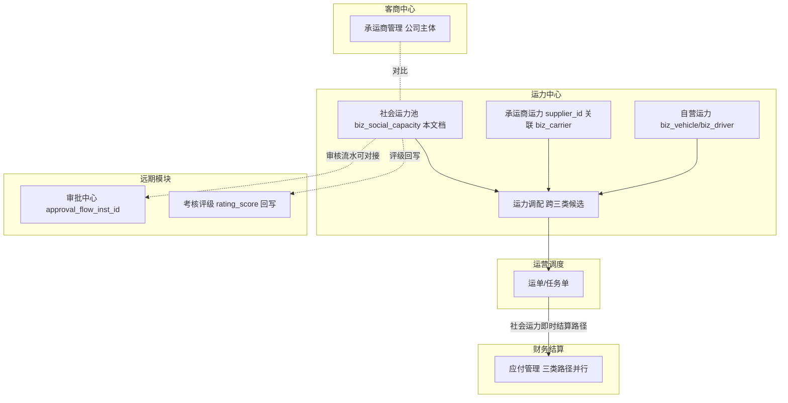
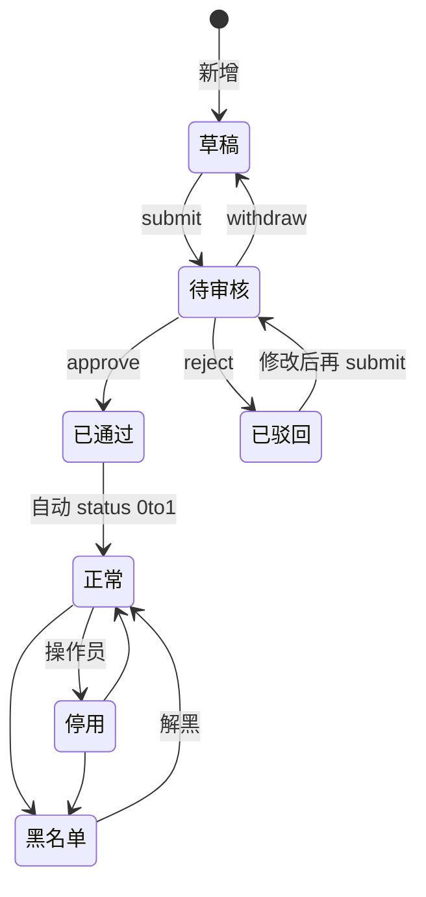
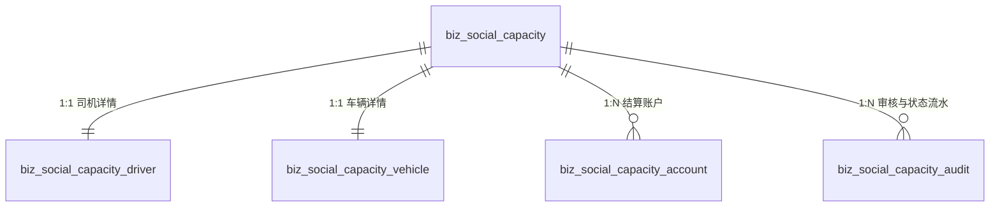

# 企业端资源模块 - 社会运力池

> **所属阶段**：阶段四 - 企业端运力中心
>
> **文档状态**：方案确认
>
> **创建日期**：2026-05-25
>
> **优先级**：高

## 一、功能概述

社会运力池承载物流公司在自有车队 + 承运商均不够用时，从同行个体或同行 B 端的某辆车一次性"打包登记"的临时承运单元（人 + 车 + 证照 + 结算）。本模块提供从运力录入、审核、启用、停用到拉黑的全生命周期管理，并为调度、应付结算、考核评级三个上下游模块预留对接位。

核心设计原则：

- **单元化登记**：一条社会运力 = 一辆车 + 一个驾驶员 + 一组证照 + 一组结算账户，一次性打包登记，不再像自有运力那样做"上下车"绑定。
- **与承运商解耦**：承运商管理的是公司主体档案（多车多人），社会运力是个人即时单元，不挂 `carrier_id`，独立的 `biz_social_capacity_*` 表系。
- **与自有车辆/驾驶员表解耦**：不污染 `biz_vehicle` / `biz_driver`，避免冗余 `ownership_type` 维度，调度时通过 select 接口聚合三类运力。
- **审核闭环**：每条社会运力必须经过审核才能投入业务使用；审核与状态变更全部留痕（`biz_social_capacity_audit`）。
- **预留考核评级**：主表预留 `rating_*` 字段及 `evaluation_summary` JSON 快照位，远期独立模块完成后直接回写。

## 二、业务背景

### 2.1 核心业务诉求

1. **运力补给**：物流旺季或非主营路线下，自有车队 + 长期合作承运商无法覆盖运力需求时，需要从同行个体司机/同行 B 端临时调用车辆。
2. **资质合规**：社会运力涉及外部人车，必须先做证照核验（驾驶证 / 从业资格证 / 行驶证 / 道路运输证 / 身份证）才能投入业务，否则承担合规风险。
3. **结算独立**：社会运力的结算与自有驾驶员（工资）、承运商（对账）都不同，通常按运单按次即时结算到指定账户（银行卡 / 支付宝 / 微信）。
4. **风险沉淀**：临时合作的运力出现服务质量问题（事故 / 违章 / 客户投诉）时需要可追溯，远期通过考核评级模块沉淀历史合作数据，辅助调度优选。

### 2.2 与其他模块的关系



> **解耦说明**：本模块完全独立，调度时通过 `GET /capacity/social_capacity/list/select` 提供候选，与自营运力 / 承运商运力的 select 接口在调度模块内 UNION。

### 2.3 现有代码基础

| 项目 | 现状 |
|------|------|
| 后端 ORM | `backend/app/modules/client/models/capacity/social_capacity/__init__.py` 占位 |
| 后端 API | `api/capacity/social_capacity/list.py` / `approval.py` 仅返回空分页占位 |
| 前端页面 | `frontend/client/src/views/capacity/social-capacity/{list,capacity-approval}/index.vue` 是 PlaceholderPage |
| 菜单 | `sys_menu`：`capacity:social_capacity`(id=304) 容器，`capacity:social_capacity:list`(id=344) 列表，`capacity:social_capacity:approval`(id=347) 审批 已注册 |
| 产品功能 | `sys_product_feature`：`carrier_social` / `capacity_social_list` / `capacity_social_approval` 三个 feature 已注册到 standard 及以上版本，但 `required_tables` 为空 |

本文档的核心改造：**新增 5 张表 + Service + API + 前端页面 + 按钮级权限子菜单 + 数据字典**，打通完整闭环。

## 三、需求详情

### 3.1 社会运力列表

- 分页表格展示，按创建时间倒序
- 列字段：社会运力编号、姓名、手机号、车牌号、车辆类型、默认结算方式、评级、审核状态、启用状态、创建时间、操作
- 关键字搜索：编号 / 姓名 / 手机号 / 车牌号 模糊搜索
- 筛选：审核状态、启用状态、来源、评级
- 工具栏：新增运力
- 行操作（按状态条件展示）：
  - 草稿 / 已驳回：查看 / 编辑 / 提交审核 / 删除
  - 待审核：查看 / 撤回提交 / 删除（管理员）
  - 已通过：查看 / 编辑账户 / 启用-停用-黑名单 / 审核流水 / 删除（需先停用）

### 3.2 新增 / 编辑社会运力

编辑弹窗（宽度 820px）使用 `el-tabs` 分四个 Tab：

#### 3.2.1 基础信息 Tab（biz_social_capacity 主表）

| 字段 | 说明 | 规则 |
|------|------|------|
| 社会运力编号 | `S{YYYY}{NNNNN}` | 系统自动生成，不可编辑 |
| 来源 | 引荐 / 平台撮合 / 自荐 / 合作车队 / 其他 | 选填，数据字典 `social_capacity_source` |
| 来源备注 | 引荐人姓名 / 合作渠道 | 选填，文本 |
| 备注 | 补充说明 | 选填，文本域 |

> 编号、审核状态、启用状态展示在弹窗顶部 Badge 区。

#### 3.2.2 车辆信息 Tab（biz_social_capacity_vehicle）

基础信息：

| 字段 | 说明 | 规则 |
|------|------|------|
| 车牌号 | 车辆唯一标识 | **必填**，租户内（非删除）唯一 |
| 车牌类型 | 蓝牌 / 黄牌 / 新能源 | 默认黄牌 |
| 车辆类型 | 重型货车 / 轻型货车 / ... | 数据字典 `vehicle_type` |
| 品牌 / 型号 / 颜色 | 车辆基础属性 | 选填 |
| 车架号 / 发动机号 | VIN / Engine No | 选填 |
| 核定载重(吨) / 核定容积(m³) | 数值，精度 2 | 选填 |
| 长 / 宽 / 高(m) | 车厢尺寸 | 选填 |
| 轴数 | 整数 | 选填 |

挂车信息（轻量内嵌，不再单独建挂车表）：

| 字段 | 说明 |
|------|------|
| 是否含挂车 | 默认否，勾选后展开下方字段 |
| 挂车车牌号 | 选填 |
| 挂车类型 | 数据字典 `trailer_type` |
| 挂车核定载重(吨) | 选填 |

资质与证照：

| 字段 | 说明 |
|------|------|
| 注册日期 / 年检到期 / 保险到期 | 日期 |
| 道路运输证号 / 道路运输证有效期 | 选填 |
| 行驶证主页 / 行驶证副页 / 道路运输证 / 车辆外观照 | 4 张图片上传 |

#### 3.2.3 司机信息 Tab（biz_social_capacity_driver）

基础信息：

| 字段 | 说明 | 规则 |
|------|------|------|
| 姓名 | 驾驶员姓名 | **必填** |
| 性别 | 男 / 女 | 选填 |
| 手机号 | 联系手机号 | **必填**，租户内（非删除）唯一 |
| 身份证号 | 18 位身份证 | 选填，格式校验 |
| 出生日期 | 日期 | 选填 |
| 头像 | 单张上传 | 选填 |
| 紧急联系人 / 电话 | 选填 | |
| 居住地址 | 选填 | |

资质：

| 字段 | 说明 |
|------|------|
| 驾驶证类型 | A1/A2/B1/B2/C1 等 |
| 驾驶证号 / 初次领证日期 / 有效期 / 准驾车型 | 选填 |
| 从业资格证号 / 有效期 | 选填 |
| 驾驶证 / 从业资格证 / 身份证正面 / 身份证反面 | 4 张图片上传 |

#### 3.2.4 结算账户 Tab（biz_social_capacity_account 1:N）

子表格形式，支持新增 / 编辑 / 删除多条结算账户：

| 字段 | 说明 |
|------|------|
| 默认 | Radio，单选；同社会运力内最多 1 条 is_default=1 |
| 账户类型 | 银行卡 / 支付宝 / 微信 / 其他 |
| 账户标签 | 主账户 / 油卡专用 等 |
| 户名 / 账号 | 必填；账号格式按账户类型校验 |
| 开户行 / 开户支行 | 仅银行卡需要 |
| 持卡人身份证号 | 配偶卡 / 第三方代收时填 |
| 状态 | 启用 / 停用 |
| 备注 | 可选 |

新增首条自动设为默认；删除当前默认账户时如其他账户中存在状态为正常的，自动将"创建时间最早"的一条置为默认。

### 3.3 提交审核 / 撤回提交

- 草稿 / 已驳回 状态下，行操作 / 弹窗底部"提交审核"按钮可点击
- 必填校验：姓名、手机号、车牌号、至少 1 条结算账户
- 提交后审核状态由 0/3 → 1（待审核），写一条 `biz_social_capacity_audit` 流水（action=1）
- 待审核状态下，提交人或管理员可"撤回"，状态由 1 → 0，写流水（action=8）

### 3.4 审核（运力审批页）

- 顶部 Tab：待审核（默认） / 已通过 / 已驳回 / 全部；待审核数量在 Tab Badge 上展示
- 列字段：社会运力编号、姓名、手机号、车牌号、车辆类型、来源、提交时间、提交人、操作
- 操作：查看（弹出运力详情，附审核流水时间线）/ 通过 / 驳回
- 通过：审核状态 1 → 2，自动把启用状态由 0 → 1（"已通过 + 正常"），写流水（action=2）
- 驳回：审核状态 1 → 3，**驳回理由必填**，写流水（action=3）
- 通过 / 驳回后侧边栏 Badge 与待审核 Tab 数量同步刷新

### 3.5 启用 / 停用 / 黑名单切换

仅 `approval_status=2` 的社会运力可调整启用状态：

| 当前状态 | 可切目标 | 流水 action |
|---------|---------|------|
| 0 未生效 / 1 正常 | 2 停用 | 5 |
| 2 停用 | 1 正常 | 4 |
| 1 正常 / 2 停用 | 3 黑名单 | 6 |
| 3 黑名单 | 1 正常 | 7 |

切换时可填"原因"，写到 `audit.remark`。

### 3.6 编辑权限矩阵

| 审核状态 | 可编辑字段 |
|---------|-----------|
| 0 草稿 | 全部字段 |
| 1 待审核 | 禁止编辑（必须先撤回） |
| 2 已通过 | **仅结算账户和备注**（其他字段灰显） |
| 3 已驳回 | 全部字段（修改后再次提交） |

> 设计意图：审核通过后避免随意篡改资质照片导致合规漏洞；如需更换车辆/驾驶员，应停用旧档案后新增。

### 3.7 删除规则

- 草稿 / 已驳回：直接软删
- 待审核：管理员可删，提交人无权
- 已通过 + 正常：禁止删除，提示"先停用"
- 已停用 / 黑名单：可删
- 已被运单 / 任务单引用：禁止删除（接入运单接口后补校验，本期保留代码扩展点）

删除时主表 + 4 张子表（driver / vehicle / accounts[] / audits 不删）级联软删。

### 3.8 状态机



### 3.9 调度选择器（预留运力调配接入位）

- `GET /capacity/social_capacity/list/select` 仅返回 `approval_status=2 AND status=1` 的社会运力
- 简要字段：id、socialCode、driverName、driverPhone、plateNumber、vehicleType、loadCapacity、ratingLevel、defaultAccount（含户名摘要）
- 供未来运力调配 / 智能调度模块在跨自营 / 承运商 / 社会三类候选中聚合查询使用

## 四、数据模型设计

所有表落 `zt_biz_{tenant_code}`，`__table_tier__ = "business"`，由 `carrier_social` 的 `required_tables` 驱动建表。

### 4.1 ER 总览



### 4.2 biz_social_capacity（主表）

| 字段 | 类型 | 必填 | 说明 |
|------|------|------|------|
| id | BIGINT PK | 是 | 自增主键 |
| social_code | VARCHAR(30) UK | 是 | 社会运力编号 `S{YYYY}{NNNNN}` |
| driver_name | VARCHAR(50) | 是 | 驾驶员姓名（冗余检索） |
| driver_phone | VARCHAR(20) | 是 | 驾驶员手机号（冗余检索 + 唯一性校验） |
| driver_id_card | VARCHAR(20) | 否 | 驾驶员身份证号（冗余） |
| plate_number | VARCHAR(20) | 是 | 车牌号（冗余检索 + 唯一性校验） |
| vehicle_type_label | VARCHAR(50) | 否 | 车辆类型快照（用于列表展示） |
| source | VARCHAR(50) | 否 | 来源（数据字典 `social_capacity_source`） |
| source_remark | VARCHAR(255) | 否 | 来源备注（引荐人 / 渠道） |
| referrer_user_id | BIGINT | 否 | 引荐人 user_id（如有） |
| **approval_status** | SMALLINT | 是 | 审核状态 0-草稿 1-待审核 2-已通过 3-已驳回，default 0 |
| approval_user_id | BIGINT | 否 | 最近一次审核人 user_id |
| approval_time | DATETIME | 否 | 最近一次审核时间 |
| approval_remark | VARCHAR(500) | 否 | 最近一次审核意见 / 驳回理由 |
| **status** | SMALLINT | 是 | 启用状态 0-未生效 1-正常 2-停用 3-黑名单，default 0 |
| status_remark | VARCHAR(500) | 否 | 状态变更原因 |
| rating_score | DECIMAL(3,1) | 否 | 预留：考核综合评分 0.0~5.0 |
| rating_level | SMALLINT | 否 | 预留：考核等级 1-A 2-B 3-C 4-D |
| last_evaluated_at | DATETIME | 否 | 预留：最近考核时间 |
| evaluation_summary | JSON | 否 | 预留：评级摘要快照 |
| order_count | INT | 是 | 预留：累计承运次数，default 0 |
| last_dispatched_at | DATETIME | 否 | 预留：最近一次派单时间 |
| created_user_id | BIGINT | 否 | 创建人 user_id |
| updated_user_id | BIGINT | 否 | 最近修改人 user_id |
| remark | TEXT | 否 | 备注 |
| created_at / updated_at / is_deleted | — | — | 标准三件套 |

**索引**：
- 唯一索引：`uk_social_code(social_code)`
- 普通索引：`idx_driver_phone(driver_phone)`、`idx_plate_number(plate_number)`、`idx_approval_status(approval_status)`、`idx_status(status)`

### 4.3 biz_social_capacity_driver（司机详情 1:1）

| 字段 | 类型 | 必填 | 说明 |
|------|------|------|------|
| id | BIGINT PK | 是 | 自增 |
| social_capacity_id | BIGINT UK | 是 | 关联 biz_social_capacity.id |
| name | VARCHAR(50) | 是 | 姓名 |
| gender | SMALLINT | 否 | 0-未知 1-男 2-女 |
| phone | VARCHAR(20) | 是 | 手机号 |
| id_card | VARCHAR(20) | 否 | 身份证号 |
| birth_date | DATE | 否 | 出生日期 |
| avatar | VARCHAR(500) | 否 | 头像 URL |
| license_type | VARCHAR(10) | 否 | 驾驶证类型 A1/A2/B1/B2/C1 |
| license_no | VARCHAR(50) | 否 | 驾驶证号 |
| license_issue_date | DATE | 否 | 初次领证日期 |
| license_expire | DATE | 否 | 驾驶证有效期 |
| license_class | VARCHAR(50) | 否 | 准驾车型 |
| qualification_no | VARCHAR(50) | 否 | 从业资格证号 |
| qualification_expire | DATE | 否 | 从业资格证有效期 |
| license_photo | VARCHAR(500) | 否 | 驾驶证照片 URL |
| qualification_photo | VARCHAR(500) | 否 | 从业资格证照片 URL |
| id_card_front_photo | VARCHAR(500) | 否 | 身份证正面照 URL |
| id_card_back_photo | VARCHAR(500) | 否 | 身份证反面照 URL |
| emergency_contact | VARCHAR(50) | 否 | 紧急联系人 |
| emergency_phone | VARCHAR(20) | 否 | 紧急联系电话 |
| home_address | VARCHAR(255) | 否 | 居住地址 |
| created_at / updated_at / is_deleted | — | — | 标准三件套 |

### 4.4 biz_social_capacity_vehicle（车辆详情 1:1）

| 字段 | 类型 | 必填 | 说明 |
|------|------|------|------|
| id | BIGINT PK | 是 | 自增 |
| social_capacity_id | BIGINT UK | 是 | 关联 biz_social_capacity.id |
| plate_number | VARCHAR(20) | 是 | 车牌号 |
| plate_category | VARCHAR(20) | 是 | BLUE/YELLOW/NEW_ENERGY，default YELLOW |
| vehicle_type | VARCHAR(50) | 否 | 数据字典 `vehicle_type` |
| brand | VARCHAR(50) | 否 | 品牌 |
| model | VARCHAR(50) | 否 | 型号 |
| color | VARCHAR(20) | 否 | 颜色 |
| vin | VARCHAR(50) | 否 | 车架号 |
| engine_no | VARCHAR(50) | 否 | 发动机号 |
| load_capacity | DECIMAL(10,2) | 否 | 核定载重（吨） |
| volume_capacity | DECIMAL(10,2) | 否 | 核定容积（m³） |
| length | DECIMAL(6,2) | 否 | 长度（m） |
| width | DECIMAL(6,2) | 否 | 宽度（m） |
| height | DECIMAL(6,2) | 否 | 高度（m） |
| axle_count | SMALLINT | 否 | 轴数 |
| has_trailer | SMALLINT | 是 | 是否含挂车 0-否 1-是，default 0 |
| trailer_plate | VARCHAR(20) | 否 | 挂车车牌号 |
| trailer_type | VARCHAR(50) | 否 | 挂车类型（数据字典 `trailer_type`） |
| trailer_load_capacity | DECIMAL(10,2) | 否 | 挂车载重 |
| registration_date | DATE | 否 | 注册日期 |
| inspection_expire | DATE | 否 | 年检到期 |
| insurance_expire | DATE | 否 | 保险到期 |
| transport_license_no | VARCHAR(50) | 否 | 道路运输证号 |
| transport_license_expire | DATE | 否 | 道路运输证有效期 |
| vehicle_license_photo | VARCHAR(500) | 否 | 行驶证主页 URL |
| vehicle_license_back_photo | VARCHAR(500) | 否 | 行驶证副页 URL |
| transport_license_photo | VARCHAR(500) | 否 | 道路运输证 URL |
| vehicle_photo | VARCHAR(500) | 否 | 车辆外观照 URL |
| created_at / updated_at / is_deleted | — | — | 标准三件套 |

### 4.5 biz_social_capacity_account（结算账户 1:N）

| 字段 | 类型 | 必填 | 说明 |
|------|------|------|------|
| id | BIGINT PK | 是 | 自增 |
| social_capacity_id | BIGINT IDX | 是 | 关联 biz_social_capacity.id |
| account_type | SMALLINT | 是 | 1-银行卡 2-支付宝 3-微信 4-其他 |
| account_label | VARCHAR(50) | 否 | 账户标签 |
| account_name | VARCHAR(100) | 是 | 户名 |
| account_no | VARCHAR(100) | 是 | 账号 / 手机号 |
| bank_name | VARCHAR(100) | 否 | 开户行 |
| bank_branch | VARCHAR(100) | 否 | 开户支行 |
| holder_id_card | VARCHAR(20) | 否 | 持卡人身份证（配偶卡场景） |
| is_default | SMALLINT | 是 | 是否默认 0/1，default 0；同 social_capacity_id 内最多 1 条 is_default=1 |
| status | SMALLINT | 是 | 0-停用 1-正常，default 1 |
| remark | VARCHAR(255) | 否 | 备注 |
| created_at / updated_at / is_deleted | — | — | 标准三件套 |

**索引**：`idx_account_social_capacity(social_capacity_id, is_default, status)`

### 4.6 biz_social_capacity_audit（审核与状态流水 1:N）

| 字段 | 类型 | 必填 | 说明 |
|------|------|------|------|
| id | BIGINT PK | 是 | 自增 |
| social_capacity_id | BIGINT IDX | 是 | 关联 biz_social_capacity.id |
| action | SMALLINT | 是 | 1-提交 2-通过 3-驳回 4-启用 5-停用 6-加入黑名单 7-移出黑名单 8-撤回 |
| before_status | SMALLINT | 否 | 操作前状态（审核类记 approval_status，启停黑记 status） |
| after_status | SMALLINT | 否 | 操作后状态 |
| operator_user_id | BIGINT | 是 | 操作人 user_id |
| operator_name | VARCHAR(50) | 否 | 操作人姓名（冗余） |
| remark | VARCHAR(500) | 否 | 审核意见 / 状态变更原因 |
| attachment | JSON | 否 | 预留：审核备查附件 |
| approval_flow_inst_id | BIGINT | 否 | **预留**：对接审批中心的多级审批实例 ID |
| created_at / is_deleted | — | — | created_at 即操作时间 |

> 该表无 `updated_at`（流水不可修改），仅 `created_at + is_deleted`。

### 4.7 远期 biz_social_capacity_evaluation（仅文档预留，本期不建表）

参照 `biz_carrier_evaluation` 字段建议：

| 字段 | 类型 | 说明 |
|------|------|------|
| id / social_capacity_id | — | 主键 + 外键 |
| period_type | SMALLINT | 1-月度 2-季度 3-年度 4-按运单 |
| period_start / period_end | DATE | 周期 |
| order_count | INT | 周期内承运次数 |
| on_time_rate | DECIMAL(5,2) | 准点率 % |
| violation_count / accident_count / customer_complaint_count | INT | 违章 / 事故 / 投诉次数 |
| customer_score / internal_score / composite_score | DECIMAL(3,1) | 评分 |
| level | SMALLINT | A/B/C/D 等级 |
| evaluator_user_id / evaluation_remark | — | 评估人 / 说明 |

每次评估完成后回写主表 `rating_score / rating_level / last_evaluated_at / evaluation_summary`。

### 4.8 数据字典扩展

| 编码 | 名称 | 字典项（item_name / item_value） |
|------|------|---------|
| `social_capacity_source` | 社会运力来源 | 引荐 / referral；平台撮合 / platform；自荐 / self；合作车队 / partner_fleet；其他 / other |

复用：`vehicle_type`、`trailer_type`（已存在）。账户类型 / 状态用代码常量，不入字典。

## 五、API 接口设计

### 5.1 路由前缀

| Router | Prefix | 说明 |
|--------|--------|------|
| `social_capacity_list_router` | `/capacity/social_capacity/list` | 社会运力档案 + 结算账户管理 |
| `social_capacity_approval_router` | `/capacity/social_capacity/approval` | 审批中心 |

### 5.2 列表 / 档案接口

| 方法 | 路径 | 说明 | 权限 |
|------|------|------|------|
| GET | `/` | 分页查询，支持 `keyword/approvalStatus/status/source/ratingLevel/page/limit` | `capacity:social_capacity:list:list` |
| GET | `/select` | 调度选择器（仅 approval_status=2 AND status=1） | `capacity:social_capacity:list:list` |
| GET | `/{id}` | 详情（聚合主表 + driver + vehicle + accounts + 最近 audit） | `capacity:social_capacity:list:list` |
| GET | `/{id}/audit-history` | 审核 / 状态流水（按 created_at 倒序） | `capacity:social_capacity:list:list` |
| POST | `/` | 新增（默认 approval_status=0，写新增日志） | `capacity:social_capacity:list:add` |
| PUT | `/{id}` | 编辑（按状态控制可编辑字段） | `capacity:social_capacity:list:edit` |
| DELETE | `/{id}` | 软删除（含状态校验 + 引用预留） | `capacity:social_capacity:list:delete` |
| POST | `/{id}/submit` | 提交审核 | `capacity:social_capacity:list:submit` |
| POST | `/{id}/withdraw` | 撤回提交 | `capacity:social_capacity:list:submit` |
| PUT | `/{id}/status` | 启用 / 停用 / 黑名单切换（body: `{status, remark}`） | `capacity:social_capacity:list:status` |
| GET | `/{id}/accounts` | 结算账户列表 | `capacity:social_capacity:list:account` |
| POST | `/{id}/accounts` | 新增账户 | `capacity:social_capacity:list:account` |
| PUT | `/{id}/accounts/{accountId}` | 更新账户 | `capacity:social_capacity:list:account` |
| DELETE | `/{id}/accounts/{accountId}` | 删除账户 | `capacity:social_capacity:list:account` |
| POST | `/{id}/accounts/{accountId}/set-default` | 设为默认账户 | `capacity:social_capacity:list:account` |

### 5.3 审核接口

| 方法 | 路径 | 说明 | 权限 |
|------|------|------|------|
| GET | `/` | 审核单分页（默认 approval_status=1） | `capacity:social_capacity:approval:list` |
| GET | `/stats` | 待审核数量（用于工作台 Badge） | `capacity:social_capacity:approval:list` |
| GET | `/{id}` | 审核详情（聚合 + 流水） | `capacity:social_capacity:approval:detail` |
| POST | `/{id}/approve` | 通过（body: `{remark}`） | `capacity:social_capacity:approval:approve` |
| POST | `/{id}/reject` | 驳回（body: `{remark}` 必填） | `capacity:social_capacity:approval:reject` |

### 5.4 通用约定

- 写接口（POST/PUT/DELETE）统一加 `@operation_log(module="社会运力池", action="...")`
- 错误码沿用 `BizException`（如 `运力不存在` / `状态不允许变更` / `手机号已存在` 等）
- 分页响应统一 `{ list, total, page, page_size }` 风格

## 六、前端页面设计

### 6.1 目录结构

```
frontend/client/src/
├── api/capacity/social-capacity/
│   ├── list/
│   │   ├── model/index.ts        — 类型定义
│   │   └── index.ts              — 14 个 service 方法
│   └── approval/
│       ├── model/index.ts
│       └── index.ts              — 5 个 service 方法
├── views/capacity/social-capacity/
│   ├── list/
│   │   ├── index.vue                              (替换占位)
│   │   └── components/
│   │       ├── social-capacity-search.vue
│   │       ├── social-capacity-edit.vue           — 4 Tab：基础 / 车辆 / 司机 / 结算账户
│   │       ├── social-capacity-detail.vue         — 只读详情 + 审核流水时间线
│   │       ├── social-capacity-account.vue        — 1:N 子表格（编辑用 + 审核详情用）
│   │       └── social-capacity-status.vue         — 启用/停用/黑名单切换弹窗
│   └── capacity-approval/
│       ├── index.vue                              (替换占位)
│       └── components/
│           ├── approval-search.vue
│           ├── approval-detail.vue                — 复用 social-capacity-detail，底部带审核动作区
│           └── approval-action.vue                — 通过 / 驳回弹窗
└── constants/dict-codes.ts                        — 新增 DICT_CODE_SOCIAL_CAPACITY_SOURCE
```

UI 风格统一对齐已有 `views/capacity/self-capacity/driver/`：`ele-page` + `ele-pro-table` + `floating-label` + `el-tabs`。

### 6.2 列表页交互

工具栏：
- 关键字搜索（编号 / 姓名 / 手机号 / 车牌号）
- 审核状态筛选 / 启用状态筛选 / 来源筛选 / 评级筛选
- 新增运力按钮

表格列：
- 社会运力编号（链接，点击查看详情）
- 姓名 / 手机号 / 车牌号 / 车辆类型
- 默认结算方式（账户类型 + 户名摘要）
- 评级（Tag：A/B/C/D，未评级显示"—"）
- 审核状态 Tag：草稿(灰) / 待审核(蓝) / 已通过(绿) / 已驳回(红)
- 启用状态 Tag：未生效(灰) / 正常(绿) / 停用(黄) / 黑名单(红)
- 创建时间
- 操作列（按状态条件展示）

### 6.3 编辑弹窗（4 Tab）

- 弹窗顶部 Badge 区显示：编号 + 审核状态 + 启用状态
- Tab 顺序：基础信息 → 车辆信息 → 司机信息 → 结算账户
- 当 `approval_status=1` 时整个表单只读
- 当 `approval_status=2` 时只有结算账户 Tab 与基础信息备注可编辑，其他字段灰显
- 底部按钮：保存草稿 / 提交审核（草稿/已驳回时） / 撤回提交（待审核时） / 关闭

### 6.4 详情弹窗

- 上半部分：分组只读展示 5 类信息
- 下半部分：审核流水时间线（按 created_at 倒序），每条显示 action 名称、操作人、时间、备注

### 6.5 审核页

- 顶部 Tab：待审核 / 已通过 / 已驳回 / 全部，待审核 Tab 带 Badge 数字
- 表格列：编号、姓名、手机号、车牌号、车辆类型、来源、提交时间、提交人、操作
- 操作：查看（弹出 detail，附底部审核动作区）、通过、驳回
- 通过 / 驳回成功后刷新列表 + Badge 数

### 6.6 dict-codes.ts 补充

```ts
export const DICT_CODE_SOCIAL_CAPACITY_SOURCE = "social_capacity_source";
```

## 七、菜单与产品版本注册

### 7.1 菜单（已注册容器 + 二级菜单，需补按钮级权限）

容器菜单已存在：

| menu_code | menu_name | menu_type | parent_id |
|-----------|-----------|-----------|-----------|
| `capacity:social_capacity` | 社会运力池 | 0（目录） | capacity 容器 |
| `capacity:social_capacity:list` | 社会运力管理 | 0（页面） | `capacity:social_capacity` |
| `capacity:social_capacity:approval` | 运力审批 | 0（页面） | `capacity:social_capacity` |

需要新增按钮级权限（`menu_type=1`）：

`capacity:social_capacity:list` 子按钮：
- `:list` 查询
- `:add` 新增
- `:edit` 编辑
- `:delete` 删除
- `:submit` 提交 / 撤回审核
- `:status` 启用 / 停用 / 黑名单
- `:account` 结算账户管理

`capacity:social_capacity:approval` 子按钮：
- `:list` 查询
- `:detail` 查看详情
- `:approve` 通过
- `:reject` 驳回

### 7.2 产品功能映射

`backend/scripts/platform_sync/snapshots/product_feature.json` 中：

```json
{
  "code": "carrier_social",
  "required_tables": [
    "biz_social_capacity",
    "biz_social_capacity_driver",
    "biz_social_capacity_vehicle",
    "biz_social_capacity_account",
    "biz_social_capacity_audit"
  ]
}
```

`carrier_social` 已挂在 standard / professional / enterprise 版本下，basic 不可见。

### 7.3 数据字典 seed

在 `backend/scripts/seed/seed_client_dicts.py` 增加：

```python
{
  "code": "social_capacity_source",
  "name": "社会运力来源",
  "items": [
    {"item_name": "引荐", "item_value": "referral", "sort": 1},
    {"item_name": "平台撮合", "item_value": "platform", "sort": 2},
    {"item_name": "自荐", "item_value": "self", "sort": 3},
    {"item_name": "合作车队", "item_value": "partner_fleet", "sort": 4},
    {"item_name": "其他", "item_value": "other", "sort": 99},
  ],
}
```

## 八、上下游模块衔接

| 模块 | 衔接方式 | 时机 |
|------|---------|------|
| 客商中心 - 承运商管理 | 完全解耦；社会运力档案不挂 carrier_id | 本期 |
| 运营调度 - 智能调度 | 通过 `GET /capacity/social_capacity/list/select` 提供候选 | 调度模块上线时接入 |
| 财务结算 - 应付管理 | 运单完成时按 `is_default=1` 账户生成应付凭证（即时结算路径） | 应付管理上线时接入 |
| 审批中心 | `audit.approval_flow_inst_id` 预留外键 | 审批中心上线后切多级审批 |
| 考核评级 | 主表 rating_* + evaluation_summary + order_count + last_dispatched_at 全部预留 | 考核模块上线后回写 |

## 九、测试要点

### 9.1 数据 / 状态

- 5 张表正确创建；新增/编辑/删除主体时 5 张表事务一致（含级联软删）
- 审核状态机 0↔1↔2/3 全路径覆盖
- 启用状态仅在 `approval_status=2` 后可切换
- `is_default` 全局唯一性：新增 / 设默认时其他账户自动置 0
- 审核与状态流水按动作码全量记录，可通过 `audit-history` 接口完整追溯

### 9.2 业务校验

- 同手机号 / 同车牌号在 `(0,1,2)` 状态下唯一；删除后释放
- `approval_status=2` 下编辑表单字段灰显，仅账户 / 备注可改
- `approval_status=1` 下整体不可编辑，必须先撤回
- 已被运单引用的社会运力禁止删除（接入运单接口后补实际校验，本期保留扩展点）

### 9.3 权限 / 菜单

- 按钮级权限齐全；未授权的 `submit / approve / reject / status` 按钮在前端隐藏
- standard 及以上版本登录可见菜单；basic 不可见

### 9.4 预留对接位

- `list/select` 在没有调度模块时也能稳定返回候选
- `audit.approval_flow_inst_id` 字段始终为 NULL，等审批中心接入再写值
- 评级字段在所有列表 / 详情 / 选择器接口中正确返回 NULL，不影响前端渲染

## 十、变更记录

| 日期 | 版本 | 变更内容 | 负责人 |
|------|------|---------|--------|
| 2026-05-25 | v1.0 | 初版需求文档 | AI Assistant |

