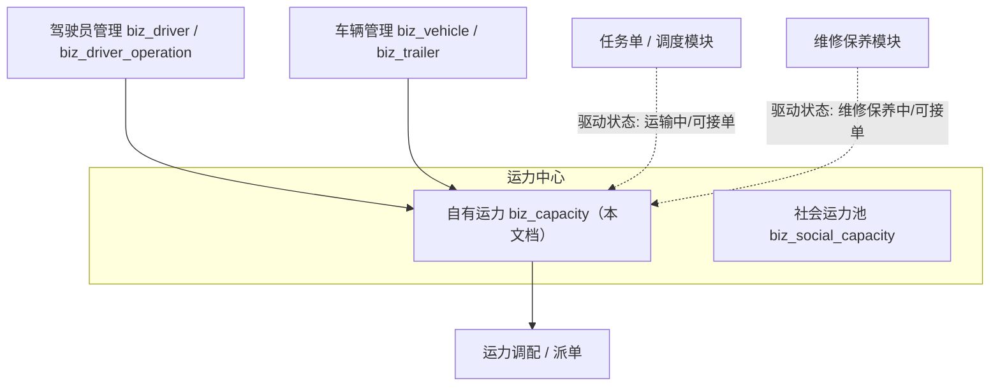
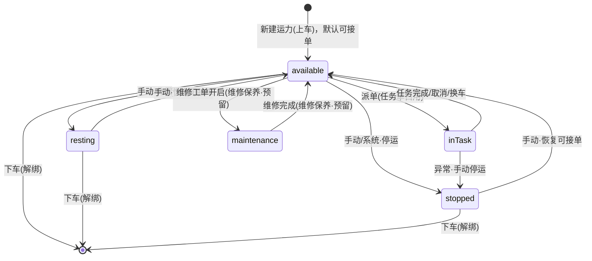

# 企业端资源模块 - 运力中心（自有运力）

> **所属阶段**：阶段四 - 企业端运力中心
>
> **文档状态**：已落地（`operation_status` 迁移 `20260625_001` 已上线）
>
> **创建日期**：2026-06-25
>
> **最近更新**：2026-07-06（同步：列表支持 `operationStatus` 过滤；卡片响应新增挂车车牌/车型字段）
>
> **优先级**：高（运力调度的核心基础）

## 一、功能概述

运力中心是把「驾驶员」与「车辆（+挂车）」组合为可调度运输单元的核心模块。在物流系统中，一个可用的**运力 = 司机 + 车辆（+ 挂车）**，运力是运单派车、调度排班的直接对象。

自有运力采用**「上车 / 下车」绑定模式**：从在职驾驶员中选一人、从正常车辆中选一辆，绑定为一条「绑定中」的运力；当人车关系结束时执行「下车」解绑，运力终结并归档到变动记录。这与「社会运力池」的一次性打包登记模式不同。

核心设计原则：

- **人车组合**：同一驾驶员、同一车辆在同一时刻只能参与一条绑定中的运力，避免重复占用。
- **运力独立状态机**：运力拥有**属于自己**的运营状态（`biz_capacity.operation_status`），与驾驶员的运营状态（`biz_driver_operation.operation_status`）解耦。运力状态既支持人工手动变更，也预留由任务单、维修保养等上游模块驱动。
- **全程留痕**：上车、下车、状态变更全部写入 `biz_capacity_log` 变动记录，并记录企业动态。

## 二、业务背景

### 2.1 核心业务诉求

1. **运力可视**：调度需要一眼看出每条运力当前是否可派单（空闲）、是否正在执行任务（运输中）、是否因休假/停运/维修不可用。
2. **状态可控**：管理员可手动把运力置为休假、停运，或恢复可接单；运输中、维修中等"被动状态"由对应业务模块驱动，避免人工误操作。
3. **模块回写**：任务单占用运力时置为运输中，交车/取消/换车后回落空闲；维修保养开工置为维修保养中，完工回落空闲。

### 2.2 与其他模块的关系



> **说明**：运力中心向上游（驾驶员、车辆）取数组合，向下游（调度派单）提供可用运力。任务单与维修保养模块通过**回写运力状态**与运力中心联动。

## 三、需求详情

### 3.1 运力列表

- **卡片式**布局展示绑定中的运力，突出企业级专业品质（克制配色，状态以细标签 + 状态点呈现）。
- 卡片信息层级：状态（L1）→ 驾驶员（头像/姓名/手机号/车队）（L2）→ 车牌+挂车（L3）→ 车型/上车时间（L4）。
- 支持按驾驶员姓名 / 手机号 / 车牌号关键字搜索，支持按运营状态（`operationStatus`）过滤。
- 工具栏：新建运力。
- 卡片操作（更多菜单）：手动变更运力状态、下车。
- 已解绑的运力不在此列表展示，统一在「变更记录」中查看。

### 3.2 新建运力（上车）

- 左右双栏：左选驾驶员（在职），右选车辆（正常）。
- 支持"仅显示空闲驾驶员 / 空闲车辆"过滤，搜索 + 滚动分页加载。
- 已被其它运力占用的驾驶员/车辆行置灰，hover 提示原因，不可选。
- 可选行 hover 时鼠标为手形（`cursor: pointer`）。
- 提交后创建一条绑定中运力，运力状态默认「可接单」。

### 3.3 下车（解绑）

- 二次确认，可填写下车备注。
- 解绑后 `status` 置 0、记录 `unbound_at`，写变动记录（action=2）。

### 3.4 运力状态机设计

运力的运营状态存于 `biz_capacity.operation_status`，取值如下：

| 状态值 | 状态名称 | 触发方 | 是否可派单 | 说明 |
|--------|---------|--------|-----------|------|
| 1 | 可接单（空闲） | 默认 / 手动 / 任务完成回落 | 是 | 已组建、无任务，可被调度派单 |
| 2 | 运输中（有任务） | 任务单 / 调度模块 | 否 | 已分配进行中任务（待接单或执行中），自动置位 |
| 3 | 休假 | 手动 | 否 | 司机休息等，人工置位 |
| 4 | 停运 | 手动 / 系统 | 否 | 因故停运（证件过期、违规等） |
| 5 | 维修保养中 | 维修保养模块（**预留**） | 否 | 车辆维修，自动置位 |

> **运力状态 vs 驾驶员状态**：二者**相互独立**。驾驶员运营状态（`biz_driver_operation.operation_status`）属于「驾驶员管理」模块的人员维度；运力状态属于「人+车」组合维度，由运力中心独立维护。卡片展示的是**运力自身状态**。

#### 状态转移图



#### 转移规则

| 来源状态 | 目标状态 | 触发方 | 校验 |
|---------|---------|--------|------|
| (无) | 可接单 | 上车 | 创建运力时默认 |
| 可接单 | 休假 | 手动 | 允许 |
| 可接单 | 停运 | 手动 | 允许 |
| 休假 | 可接单 | 手动 | 允许 |
| 停运 | 可接单 | 手动 | 允许 |
| 可接单 | 运输中 | 任务单 | 建单选运力 / 派车 / 换车写入 |
| 运输中 | 可接单 | 任务单 | 交车、取消、删除、换走后回落 |
| 运输中 | 停运 | 手动 | 异常处理，允许 |
| 可接单 | 维修保养中 | 维修保养（预留） | 仅由维修工单写入 |
| 维修保养中 | 可接单 | 维修保养（预留） | 仅由维修完成写入 |

约束说明：

- **手动可变更**的目标仅限：`可接单`、`休假`、`停运`（含从这些状态间互转）。
- **运输中 / 维修保养中**为"被动状态"，前端不提供手动切回入口，需由任务单 / 维修保养模块关闭后回落；本期接口对非法手动转移返回业务异常拦截。
- 任一非「绑定中」（`status != 1`）的运力不参与状态机变更。
- 每次状态变更写入 `biz_capacity_log`（`action=3`），并通过 `CompanyActivityService` 记企业动态。

## 四、数据模型设计

### 4.1 biz_capacity（运力表 -- 调整）

| 字段 | 类型 | 说明 | 变更 |
|------|------|------|------|
| id | BIGINT PK | 自增主键 | — |
| driver_id | BIGINT | 关联司机 ID | — |
| driver_name | VARCHAR(50) | 司机姓名（冗余） | — |
| driver_phone | VARCHAR(20) | 司机手机号（冗余） | — |
| vehicle_id | BIGINT | 关联车辆 ID | — |
| plate_number | VARCHAR(20) | 车牌号（冗余） | — |
| status | SMALLINT | 绑定状态 1-绑定中 0-已解绑 | — |
| **operation_status** | SMALLINT | **运力运营状态 1-可接单 2-运输中 3-休假 4-停运 5-维修保养**，默认 1 | **新增** |
| bound_at | DATETIME | 上车时间 | — |
| unbound_at | DATETIME | 下车时间 | — |
| remark | TEXT | 备注 | — |
| created_at / updated_at / is_deleted | — | 公共字段 | — |

### 4.2 biz_capacity_log（运力变动记录 -- 调整）

| 字段 | 类型 | 说明 | 变更 |
|------|------|------|------|
| action | SMALLINT | 操作类型 1-上车 2-下车 **3-状态变更** | **扩展取值** |
| remark | TEXT | 备注 / 变更说明（如「可接单 → 停运」） | — |

> 状态变更类日志复用现有 `biz_capacity_log` 结构，`action=3`，`remark` 记录变更前后状态。

## 五、API 接口设计

接口前缀：`/api/client/capacity/self_capacity/list`，需 JWT 认证。

| 方法 | 路径 | 说明 | 状态 |
|------|------|------|------|
| GET | `` | 运力分页列表（仅绑定中；支持 `keyword` / `operationStatus` 过滤） | 已有 |
| POST | `/bind` | 上车（绑定），fire-and-forget 同步平台运力库 | 已有 |
| PUT | `/{id}/unbind` | 下车（解绑），同步平台运力库 | 已有 |
| PUT | `/{id}/operation-status` | 变更运力运营状态 | 已落地 |

**变更运营状态请求体**（`PUT /{id}/operation-status`）：

```json
{
  "operationStatus": 3
}
```

- 后端校验：运力存在且 `status==1`（绑定中）；目标状态为合法手动目标（1/3/4）；非法转移（如手动置 2/5）抛业务异常。
- 成功后写 `biz_capacity_log`（action=3）并记企业动态。

**响应字段映射**（`biz_capacity` → 前端）：

| 后端字段 | Schema 输出字段 | 说明 |
|---------|----------------|------|
| operation_status | operationStatus | 运力运营状态（卡片数据源） |
| （驾驶员联查） | driverOperationStatus | 驾驶员运营状态（可选，仅参考） |
| （车辆联查）plate_category | plateCategory | 车牌类型（黄牌/蓝牌等） |
| （挂车联查） | trailerPlateNumber / trailerPlateCategory | 挂车车牌与类型 |
| （驾驶员联查）avatar | driverAvatar | 司机头像（卡片 L2） |
| （车辆联查） | vehicleType | 车型（卡片 L4） |

## 六、前端页面设计

- **路由**：`/capacity/self-capacity/list`
- **组件**：`views/capacity/self-capacity/list/index.vue`
- **子组件**：
  - `components/capacity-card.vue`：运力卡片（状态展示 + 状态变更/下车操作）
  - `components/capacity-bind.vue`：新建运力弹框
  - `components/capacity-search.vue`：搜索栏

**卡片交互**：

- 状态以细标签 + 左侧状态点呈现，整体克制配色，避免大面积色块。
- 「更多」菜单：根据当前状态动态给出可手动切换的目标（休假 / 停运 / 恢复可接单），运输中、维修保养中不提供手动切回入口（提示由对应模块管理），并提供「下车」。

## 七、测试要点

1. 新建运力后默认状态为「可接单」。
2. 手动切换：可接单 ↔ 休假、可接单 ↔ 停运，卡片实时刷新。
3. 非法手动转移（手动置运输中/维修中）被后端拦截。
4. 状态变更写入变动记录（action=3）且企业动态有记录。
5. 下车后运力从列表消失，可在变更记录查看。
6. 运力状态与驾驶员运营状态互不影响。
