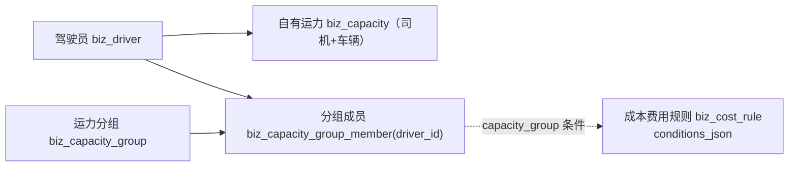

# 企业端资源模块 - 运力中心（运力分组）

> **所属阶段**：阶段四 - 企业端运力中心
>
> **文档状态**：设计中
>
> **创建日期**：2026-07-21
>
> **优先级**：高（成本政策 / 计费分组的核心基础）

## 一、功能概述

运力分组是把「自有运力」按运营需要划分到若干**自定义分组**的功能，供成本政策 / 计费规则按分组指定不同政策使用。典型场景：企业把运力按「月薪车队 / 计程车队」「华东片区 / 华北片区」「重卡组 / 轻卡组」等维度分组，再在成本中心为不同分组配置不同的司机运费、油补、维保等费用规则。

核心设计原则：

- **多对多**：一个运力可同时属于多个分组，一个分组可包含多个运力。不同分组代表不同的划分维度（车队 / 区域 / 业务线…），互不排斥。
- **以司机为成员锚点、以运力为操作入口**：分组成员在数据层锚定到**司机**（`biz_capacity_group_member.driver_id`），页面按当前绑定中的**运力**（司机+车辆）展示与选择。司机换车（下车再上车）不会丢失分组归属，保证成本政策稳定。
- **与计费解耦、按需接入**：分组本身只做归类，不写死任何政策。成本规则通过条件引擎的 `capacity_group` 条件按分组匹配，加不加、怎么用由成本规则决定。

## 二、业务背景

### 2.1 核心业务诉求

1. **政策分组**：成本中心需要「按一批运力统一定价」，而不是逐条运力配置。分组是这批运力的稳定载体。
2. **多维划分**：同一条运力在结算维度属于「月薪组」，在区域维度属于「华东组」，需要能同时归属。
3. **稳定归属**：司机换车属于日常操作，分组不应因换车而丢失。

### 2.2 与其他模块的关系

> **说明**：分组成员锚定司机；成本规则的 `capacity_group` 条件在计费时用「当前运力对应司机是否在该分组」来判定命中。因此换车不影响命中。

## 三、需求详情

### 3.1 分组列表

- 表格式列表，列：分组名称（带颜色标签）、分组编码、成员数量、状态、备注、创建时间、操作。
- 支持按分组名称 / 编码关键字搜索，支持按状态过滤。
- 工具栏：新建分组。
- 行操作：编辑、成员管理、启用/停用、删除。

### 3.2 新建 / 编辑分组

- 字段：分组名称（必填，同企业内唯一）、分组编码（选填，唯一，留空自动生成）、标签颜色（选填）、排序号、状态、备注。
- 校验：名称非空且不与本企业其它未删除分组重名；编码若填写需唯一。

### 3.3 成员管理

- 抽屉/弹框内展示分组当前成员（按运力维度：司机姓名/手机号 + 车牌）。
- 「添加成员」：从**绑定中的运力**（`biz_capacity.status=1`）中多选加入，实际写入其 `driver_id`；已在本组的运力置灰。
- 「移出成员」：单个或批量移出。
- 成员唯一性：`(group_id, driver_id)` 唯一，重复添加自动跳过。

### 3.4 删除分组

- 软删除（`is_deleted=1`），同时软删除该组下全部成员关联。
- 若分组已被成本规则条件引用，允许删除但提示「该分组可能已被成本规则引用，删除后相关规则将不再命中该分组」（引用为弱关联，不做强外键）。

## 四、数据模型设计

### 4.1 biz_capacity_group（运力分组表）

| 字段 | 类型 | 说明 |
|------|------|------|
| id | BIGINT PK | 自增主键 |
| enterprise_id | BIGINT NULL | 所属经营主体ID（可空，空表示企业级公共分组） |
| group_name | VARCHAR(50) | 分组名称（同企业未删除内唯一） |
| group_code | VARCHAR(50) NULL | 分组编码（唯一，留空自动生成 CG+序号） |
| color | VARCHAR(16) NULL | 标签颜色（如 `#409EFF`） |
| sort_order | INT | 排序号，越小越靠前 |
| status | SMALLINT | 状态 0-停用 1-启用，默认 1 |
| remark | VARCHAR(255) NULL | 备注 |
| created_by / updated_by | BIGINT NULL | 创建人 / 更新人 |
| created_at / updated_at / is_deleted | — | 公共字段 |

### 4.2 biz_capacity_group_member（分组成员关联表，M:N）

| 字段 | 类型 | 说明 |
|------|------|------|
| id | BIGINT PK | 自增主键 |
| group_id | BIGINT | 关联分组ID |
| driver_id | BIGINT | 成员锚点：司机ID |
| driver_name | VARCHAR(50) | 司机姓名（冗余，便于展示与检索） |
| capacity_id | BIGINT NULL | 加入时的运力ID（快照，仅用于展示，不参与命中） |
| plate_number | VARCHAR(20) NULL | 加入时车牌（快照冗余） |
| created_by | BIGINT NULL | 添加人 |
| created_at / updated_at / is_deleted | — | 公共字段 |

- 唯一约束：`uk_group_driver (group_id, driver_id, is_deleted)`。
- 索引：`idx_group (group_id)`、`idx_driver (driver_id)`。

## 五、API 接口设计

接口前缀：`/api/client/capacity/self_capacity/group`，需 JWT 认证，`require_feature("capacity_self_group")`。

| 方法 | 路径 | 说明 |
|------|------|------|
| GET | `` | 分组分页列表（含 memberCount，支持 keyword/status 过滤） |
| GET | `/options` | 启用状态分组精简列表（供成本规则条件下拉/选择） |
| POST | `` | 新建分组 |
| PUT | `/{id}` | 编辑分组 |
| PUT | `/{id}/status` | 启用/停用 |
| DELETE | `/{id}` | 删除分组（连带软删成员） |
| GET | `/{id}/members` | 分组成员分页列表（联查当前运力信息） |
| POST | `/{id}/members` | 批量添加成员（传运力ID列表，落库 driver_id） |
| DELETE | `/{id}/members` | 批量移出成员（传成员ID或driver_id列表） |

## 六、计费接入设计

在成本规则条件引擎（v2，可插拔 `ConditionEvaluator`）新增条件类型：

- **key**：`capacity_group`
- **label**：指定运力分组
- **value_type**：`capacity_group`
- **option_source**：`capacity_group`
- **operators**：`eq` / `in`
- **判定**：计费上下文 `CostFactContext` 新增 `capacity_group_ids: set[int]`，编排层在规则集用到 `capacity_group` 条件时，按当前 `driver_id` 预加载其所属分组ID集合；evaluator 判断 `value ∈ ctx.capacity_group_ids`。
- **特异度评分**：`CONDITION_SCORE["capacity_group"] = 5_800`（介于「指定运力 6000」与「指定司机 5500」之间：比单条运力弱、比单个司机属性强）。

> 采用「预加载 set + evaluator 只读 ctx」的方式，与现有 evaluator 全部为纯内存判定的约定一致，不在 evaluator 内做 DB 查询。

## 七、前端页面设计

- **路由**：`/capacity/self-capacity/group`
- **组件**：`views/capacity/self-capacity/group/index.vue`
- **子组件**：
  - `components/group-search.vue`：搜索栏
  - `components/group-edit.vue`：新建/编辑弹框
  - `components/group-members.vue`：成员管理抽屉（含从运力添加成员的选择弹框）

## 八、测试要点

1. 新建分组默认启用；名称本企业内唯一校验生效。
2. 一个运力（司机）可加入多个分组；重复添加同一分组自动跳过。
3. 司机换车（下车→重新上车）后仍保留原分组归属。
4. 成员管理：添加/移出后 memberCount 实时刷新。
5. 停用分组后成本规则条件仍可引用（弱关联），删除分组连带软删成员。
6. 成本规则使用 `capacity_group` 条件：命中当前运力对应司机所在分组；多分组命中由优先级/评分裁决。
