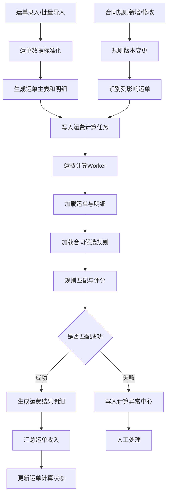
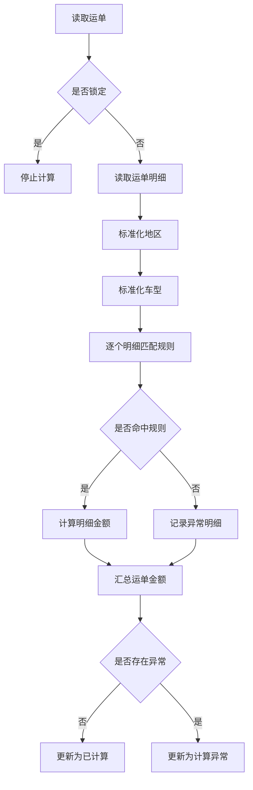
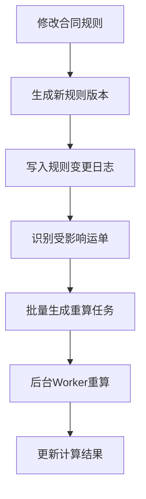
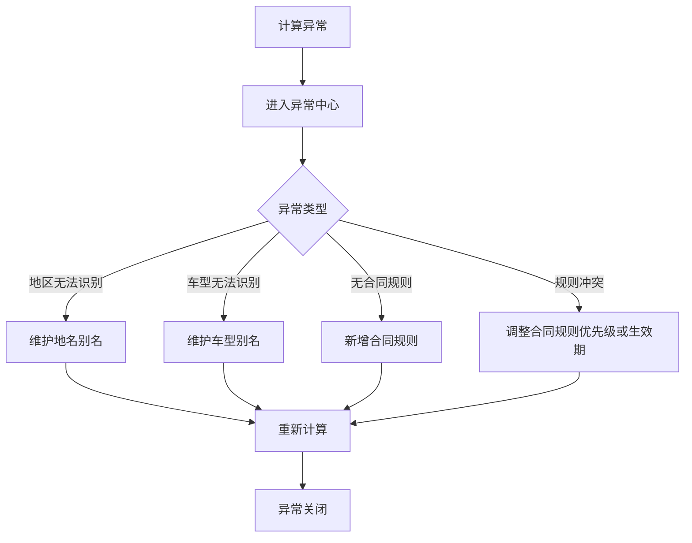

# 运单合同运费自动计算系统设计文档

> 适用技术栈：MySQL + Python FastAPI  
> 文档定位：产品设计 + 架构设计 + 数据模型设计 + 计算规则设计  
> 适用场景：物流企业 SaaS / 运单管理系统 / 合同运价管理 / 运费收入自动计算

---

## 1. 文档目标

本文档用于设计一套完整的 **运单合同运费自动计算系统**，实现用户录入或批量导入运单后，系统根据运单中的关键业务信息自动匹配合同运价规则，并计算运单收入金额。

系统需要解决以下核心问题：

1. 运单批量导入后自动计算运费收入；
2. 运单修改后，运费可以及时重新计算；
3. 合同规则修改后，受影响运单可以及时重新计算；
4. 一个运单中包含多个车型时，可以分别匹配不同运价；
5. 运单录入的出发地、目的地与合同规则中的线路不完全一致时，支持行政区层级向上兼容匹配；
6. 合同规则支持生效期、反向线路、规则冲突识别、最低运费等扩展能力；
7. 运费计算过程可追溯、可解释、可审计。

---

## 2. 业务背景

在物流企业业务系统中，运单是核心业务单据。用户录入运单后，需要根据客户合同中约定的线路、车型、单价等规则自动计算运费收入。

典型业务场景如下：

```text
客户：某汽车主机厂
线路：北京 → 天津
车型：比亚迪秦
运价：800 元/台
```

用户录入运单：

```text
客户：某汽车主机厂
出发地：北京市朝阳区
目的地：天津市滨海新区
货物：比亚迪秦 3 台、特斯拉 Model Y 2 台
```

系统应自动完成以下计算：

```text
比亚迪秦：匹配 北京 → 天津，比亚迪秦，800 元/台，3 台 = 2400 元
特斯拉 Model Y：匹配 北京 → 天津，Model Y，1000 元/台，2 台 = 2000 元
运单总运费收入 = 4400 元
```

---

## 3. 系统设计原则

本系统设计应遵循以下原则：

| 原则 | 说明 |
|---|---|
| 运单事实数据不可丢 | 运单记录用户录入的真实业务数据，包括原始地名、原始车型名称等 |
| 合同规则版本化 | 合同和运价规则修改后要保留历史版本，避免历史计算不可追溯 |
| 计算结果明细化 | 每个运单货物明细都应生成独立计算结果 |
| 匹配过程可解释 | 系统需要记录使用了哪个合同、哪条规则、为何命中 |
| 修改影响任务化 | 运单修改、合同修改后通过任务机制触发重算 |
| 结算之后锁定 | 已确认、已结算、已开票运单不能被自动重算覆盖 |
| 异常必须显性化 | 未匹配、规则冲突、车型无法识别等问题应进入异常中心 |
| 第一阶段避免过度复杂 | 先支持主流程，再逐步扩展附加费、税率、补差等复杂能力 |

---

## 4. 总体架构

### 4.1 模块划分

系统建议拆分为以下模块：

| 模块 | 职责 |
|---|---|
| 运单管理模块 | 运单录入、批量导入、运单修改、运单状态管理 |
| 运单明细模块 | 维护运单中的货物、车型、数量等信息 |
| 合同管理模块 | 维护客户合同、合同生效期、合同状态 |
| 合同运价模块 | 维护客户、线路、车型、运价规则 |
| 标准基础数据模块 | 维护行政区、车型、品牌、车型别名、地名别名 |
| 运费计算引擎 | 根据运单匹配合同规则并计算运费 |
| 计算任务模块 | 管理异步计算、重算、失败重试 |
| 计算结果模块 | 保存运单收入汇总和明细 |
| 计算异常中心 | 处理未匹配、规则冲突、数据异常等问题 |
| 计算审计模块 | 记录每次计算过程、计算版本、匹配轨迹 |

---

### 4.2 系统流程总览



---

## 5. 核心业务对象

### 5.1 运单

运单是物流业务的主单据，记录客户、起始地、目的地、运输日期等基础信息。

核心字段：

```text
运单号
客户
出发地
目的地
运输日期
运单状态
计算状态
运费收入金额
结算状态
版本号
```

---

### 5.2 运单货物明细

一个运单可以包含多个车型，每个车型可以有不同数量和不同运价。

核心字段：

```text
运单ID
品牌
车型
台数
原始车型名称
标准车型ID
```

---

### 5.3 合同

合同是客户运价规则的归属载体。

核心字段：

```text
客户
合同编号
合同名称
生效开始日期
生效结束日期
合同状态
合同版本
```

---

### 5.4 合同运价规则

合同运价规则定义客户在某条线路、某种车型下的价格。

核心字段：

```text
客户
合同
出发地
目的地
车型
品牌
单价
生效期
是否双向
最低运费
优先级
规则版本
```

---

### 5.5 运费计算结果

记录运单最终计算出的运费收入，包括主结果和明细结果。

核心字段：

```text
运单ID
运单版本
计算总金额
计算状态
计算时间
计算引擎版本
匹配规则ID
匹配过程
异常原因
```

---

## 6. 数据模型设计

### 6.1 运单主表：waybill

```sql
CREATE TABLE waybill (
    id BIGINT NOT NULL AUTO_INCREMENT COMMENT '主键ID',
    tenant_id BIGINT NOT NULL COMMENT '租户ID',
    waybill_no VARCHAR(64) NOT NULL COMMENT '运单号',

    customer_id BIGINT NOT NULL COMMENT '客户ID',
    customer_name VARCHAR(200) DEFAULT NULL COMMENT '客户名称',

    origin_raw_name VARCHAR(200) DEFAULT NULL COMMENT '原始出发地名称',
    origin_area_code VARCHAR(20) DEFAULT NULL COMMENT '标准出发地区划编码',
    origin_area_level VARCHAR(20) DEFAULT NULL COMMENT '出发地区划层级：province/city/district',

    destination_raw_name VARCHAR(200) DEFAULT NULL COMMENT '原始目的地名称',
    destination_area_code VARCHAR(20) DEFAULT NULL COMMENT '标准目的地区划编码',
    destination_area_level VARCHAR(20) DEFAULT NULL COMMENT '目的地区划层级：province/city/district',

    transport_date DATE NOT NULL COMMENT '运输日期/发运日期',

    waybill_status VARCHAR(32) NOT NULL DEFAULT 'draft' COMMENT '运单状态：draft/confirmed/settled/invoiced/cancelled',
    calc_status VARCHAR(32) NOT NULL DEFAULT 'pending' COMMENT '计算状态：pending/calculating/calculated/exception/locked',
    freight_amount DECIMAL(18,2) NOT NULL DEFAULT 0.00 COMMENT '运费收入汇总金额',

    waybill_version INT NOT NULL DEFAULT 1 COMMENT '运单版本号',
    is_locked TINYINT NOT NULL DEFAULT 0 COMMENT '是否锁定：0否，1是',

    created_by BIGINT DEFAULT NULL COMMENT '创建人',
    updated_by BIGINT DEFAULT NULL COMMENT '更新人',
    created_at DATETIME NOT NULL DEFAULT CURRENT_TIMESTAMP COMMENT '创建时间',
    updated_at DATETIME NOT NULL DEFAULT CURRENT_TIMESTAMP ON UPDATE CURRENT_TIMESTAMP COMMENT '更新时间',

    PRIMARY KEY (id),
    UNIQUE KEY uk_tenant_waybill_no (tenant_id, waybill_no),
    KEY idx_tenant_customer_date (tenant_id, customer_id, transport_date),
    KEY idx_tenant_origin_dest (tenant_id, origin_area_code, destination_area_code),
    KEY idx_calc_status (tenant_id, calc_status)
) ENGINE=InnoDB DEFAULT CHARSET=utf8mb4 COLLATE=utf8mb4_general_ci COMMENT='运单主表';
```

---

### 6.2 运单货物明细表：waybill_item

```sql
CREATE TABLE waybill_item (
    id BIGINT NOT NULL AUTO_INCREMENT COMMENT '主键ID',
    tenant_id BIGINT NOT NULL COMMENT '租户ID',
    waybill_id BIGINT NOT NULL COMMENT '运单ID',

    raw_goods_name VARCHAR(200) DEFAULT NULL COMMENT '原始货物/车型名称',
    brand_id BIGINT DEFAULT NULL COMMENT '品牌ID',
    brand_name VARCHAR(100) DEFAULT NULL COMMENT '品牌名称',
    model_id BIGINT DEFAULT NULL COMMENT '车型ID',
    model_name VARCHAR(100) DEFAULT NULL COMMENT '车型名称',

    vehicle_qty INT NOT NULL DEFAULT 0 COMMENT '台数',
    item_version INT NOT NULL DEFAULT 1 COMMENT '明细版本号',

    created_at DATETIME NOT NULL DEFAULT CURRENT_TIMESTAMP COMMENT '创建时间',
    updated_at DATETIME NOT NULL DEFAULT CURRENT_TIMESTAMP ON UPDATE CURRENT_TIMESTAMP COMMENT '更新时间',

    PRIMARY KEY (id),
    KEY idx_waybill_id (waybill_id),
    KEY idx_tenant_model (tenant_id, model_id),
    KEY idx_tenant_brand (tenant_id, brand_id)
) ENGINE=InnoDB DEFAULT CHARSET=utf8mb4 COLLATE=utf8mb4_general_ci COMMENT='运单货物明细表';
```

---

### 6.3 合同主表：contract

```sql
CREATE TABLE contract (
    id BIGINT NOT NULL AUTO_INCREMENT COMMENT '主键ID',
    tenant_id BIGINT NOT NULL COMMENT '租户ID',

    customer_id BIGINT NOT NULL COMMENT '客户ID',
    customer_name VARCHAR(200) DEFAULT NULL COMMENT '客户名称',

    contract_no VARCHAR(64) NOT NULL COMMENT '合同编号',
    contract_name VARCHAR(200) DEFAULT NULL COMMENT '合同名称',

    effective_start_date DATE NOT NULL COMMENT '合同生效开始日期',
    effective_end_date DATE DEFAULT NULL COMMENT '合同生效结束日期',

    status VARCHAR(32) NOT NULL DEFAULT 'draft' COMMENT '状态：draft/active/disabled/expired',
    version_no INT NOT NULL DEFAULT 1 COMMENT '合同版本号',

    created_by BIGINT DEFAULT NULL COMMENT '创建人',
    updated_by BIGINT DEFAULT NULL COMMENT '更新人',
    created_at DATETIME NOT NULL DEFAULT CURRENT_TIMESTAMP COMMENT '创建时间',
    updated_at DATETIME NOT NULL DEFAULT CURRENT_TIMESTAMP ON UPDATE CURRENT_TIMESTAMP COMMENT '更新时间',

    PRIMARY KEY (id),
    UNIQUE KEY uk_tenant_contract_no (tenant_id, contract_no),
    KEY idx_tenant_customer (tenant_id, customer_id),
    KEY idx_tenant_status_date (tenant_id, status, effective_start_date, effective_end_date)
) ENGINE=InnoDB DEFAULT CHARSET=utf8mb4 COLLATE=utf8mb4_general_ci COMMENT='合同主表';
```

---

### 6.4 合同运价规则表：contract_price_rule

```sql
CREATE TABLE contract_price_rule (
    id BIGINT NOT NULL AUTO_INCREMENT COMMENT '主键ID',
    tenant_id BIGINT NOT NULL COMMENT '租户ID',

    contract_id BIGINT NOT NULL COMMENT '合同ID',
    customer_id BIGINT NOT NULL COMMENT '客户ID',

    origin_area_code VARCHAR(20) NOT NULL COMMENT '出发地区划编码',
    origin_area_level VARCHAR(20) NOT NULL COMMENT '出发地区划层级：province/city/district',

    destination_area_code VARCHAR(20) NOT NULL COMMENT '目的地区划编码',
    destination_area_level VARCHAR(20) NOT NULL COMMENT '目的地区划层级：province/city/district',

    brand_id BIGINT DEFAULT NULL COMMENT '品牌ID，可为空',
    model_id BIGINT DEFAULT NULL COMMENT '车型ID，可为空',
    match_type VARCHAR(32) NOT NULL DEFAULT 'model' COMMENT '车型匹配类型：model/brand/all',

    pricing_unit VARCHAR(32) NOT NULL DEFAULT 'vehicle' COMMENT '计价单位：vehicle/trip/ton/km',
    unit_price DECIMAL(18,2) NOT NULL COMMENT '单价',
    min_amount DECIMAL(18,2) DEFAULT NULL COMMENT '最低运费',

    is_bidirectional TINYINT NOT NULL DEFAULT 0 COMMENT '是否双向有效：0否，1是',

    effective_start_date DATE NOT NULL COMMENT '规则生效开始日期',
    effective_end_date DATE DEFAULT NULL COMMENT '规则生效结束日期',

    status VARCHAR(32) NOT NULL DEFAULT 'active' COMMENT '状态：active/disabled',
    priority INT NOT NULL DEFAULT 0 COMMENT '人工优先级，数值越大优先级越高',
    rule_version INT NOT NULL DEFAULT 1 COMMENT '规则版本号',

    created_by BIGINT DEFAULT NULL COMMENT '创建人',
    updated_by BIGINT DEFAULT NULL COMMENT '更新人',
    created_at DATETIME NOT NULL DEFAULT CURRENT_TIMESTAMP COMMENT '创建时间',
    updated_at DATETIME NOT NULL DEFAULT CURRENT_TIMESTAMP ON UPDATE CURRENT_TIMESTAMP COMMENT '更新时间',

    PRIMARY KEY (id),
    KEY idx_tenant_customer_date (tenant_id, customer_id, effective_start_date, effective_end_date),
    KEY idx_tenant_route (tenant_id, origin_area_code, destination_area_code),
    KEY idx_tenant_model (tenant_id, model_id),
    KEY idx_tenant_brand (tenant_id, brand_id),
    KEY idx_contract_id (contract_id)
) ENGINE=InnoDB DEFAULT CHARSET=utf8mb4 COLLATE=utf8mb4_general_ci COMMENT='合同运价规则表';
```

---

### 6.5 运费计算结果主表：waybill_freight_result

```sql
CREATE TABLE waybill_freight_result (
    id BIGINT NOT NULL AUTO_INCREMENT COMMENT '主键ID',
    tenant_id BIGINT NOT NULL COMMENT '租户ID',

    waybill_id BIGINT NOT NULL COMMENT '运单ID',
    waybill_version INT NOT NULL COMMENT '运单版本号',

    total_amount DECIMAL(18,2) NOT NULL DEFAULT 0.00 COMMENT '计算总金额',
    calc_status VARCHAR(32) NOT NULL COMMENT '计算状态：success/exception',
    calc_time DATETIME NOT NULL COMMENT '计算时间',
    calc_version VARCHAR(32) DEFAULT NULL COMMENT '计算引擎版本',

    error_message VARCHAR(500) DEFAULT NULL COMMENT '异常信息',

    created_at DATETIME NOT NULL DEFAULT CURRENT_TIMESTAMP COMMENT '创建时间',

    PRIMARY KEY (id),
    KEY idx_waybill_id (waybill_id),
    KEY idx_tenant_calc_time (tenant_id, calc_time),
    KEY idx_calc_status (tenant_id, calc_status)
) ENGINE=InnoDB DEFAULT CHARSET=utf8mb4 COLLATE=utf8mb4_general_ci COMMENT='运费计算结果主表';
```

---

### 6.6 运费计算结果明细表：waybill_freight_result_detail

```sql
CREATE TABLE waybill_freight_result_detail (
    id BIGINT NOT NULL AUTO_INCREMENT COMMENT '主键ID',
    tenant_id BIGINT NOT NULL COMMENT '租户ID',

    result_id BIGINT NOT NULL COMMENT '计算结果主表ID',
    waybill_id BIGINT NOT NULL COMMENT '运单ID',
    waybill_item_id BIGINT NOT NULL COMMENT '运单明细ID',

    brand_id BIGINT DEFAULT NULL COMMENT '品牌ID',
    model_id BIGINT DEFAULT NULL COMMENT '车型ID',
    vehicle_qty INT NOT NULL DEFAULT 0 COMMENT '台数',

    matched_contract_id BIGINT DEFAULT NULL COMMENT '匹配合同ID',
    matched_rule_id BIGINT DEFAULT NULL COMMENT '匹配规则ID',
    matched_rule_version INT DEFAULT NULL COMMENT '匹配规则版本',

    origin_match_code VARCHAR(20) DEFAULT NULL COMMENT '实际匹配的出发地区划编码',
    origin_match_level VARCHAR(20) DEFAULT NULL COMMENT '实际匹配的出发地区划层级',
    destination_match_code VARCHAR(20) DEFAULT NULL COMMENT '实际匹配的目的地区划编码',
    destination_match_level VARCHAR(20) DEFAULT NULL COMMENT '实际匹配的目的地区划层级',

    unit_price DECIMAL(18,2) DEFAULT NULL COMMENT '匹配单价',
    amount DECIMAL(18,2) NOT NULL DEFAULT 0.00 COMMENT '计算金额',

    match_score INT DEFAULT NULL COMMENT '匹配得分',
    match_trace_json JSON DEFAULT NULL COMMENT '匹配过程JSON',

    calc_status VARCHAR(32) NOT NULL COMMENT '计算状态：success/exception',
    error_message VARCHAR(500) DEFAULT NULL COMMENT '异常信息',

    created_at DATETIME NOT NULL DEFAULT CURRENT_TIMESTAMP COMMENT '创建时间',

    PRIMARY KEY (id),
    KEY idx_result_id (result_id),
    KEY idx_waybill_id (waybill_id),
    KEY idx_waybill_item_id (waybill_item_id),
    KEY idx_matched_rule_id (matched_rule_id)
) ENGINE=InnoDB DEFAULT CHARSET=utf8mb4 COLLATE=utf8mb4_general_ci COMMENT='运费计算结果明细表';
```

---

### 6.7 计算任务表：freight_calc_task

```sql
CREATE TABLE freight_calc_task (
    id BIGINT NOT NULL AUTO_INCREMENT COMMENT '主键ID',
    tenant_id BIGINT NOT NULL COMMENT '租户ID',

    task_type VARCHAR(64) NOT NULL COMMENT '任务类型：waybill_changed/rule_changed/batch_import/manual_recalc',
    target_type VARCHAR(64) NOT NULL COMMENT '目标类型：waybill/rule/batch',
    target_id BIGINT NOT NULL COMMENT '目标ID',

    status VARCHAR(32) NOT NULL DEFAULT 'pending' COMMENT '状态：pending/running/success/failed',
    priority INT NOT NULL DEFAULT 0 COMMENT '优先级，数值越大越优先',

    retry_count INT NOT NULL DEFAULT 0 COMMENT '已重试次数',
    max_retry_count INT NOT NULL DEFAULT 3 COMMENT '最大重试次数',

    error_message VARCHAR(1000) DEFAULT NULL COMMENT '错误信息',

    created_at DATETIME NOT NULL DEFAULT CURRENT_TIMESTAMP COMMENT '创建时间',
    started_at DATETIME DEFAULT NULL COMMENT '开始时间',
    finished_at DATETIME DEFAULT NULL COMMENT '完成时间',

    PRIMARY KEY (id),
    KEY idx_task_status_priority (status, priority, created_at),
    KEY idx_tenant_target (tenant_id, target_type, target_id)
) ENGINE=InnoDB DEFAULT CHARSET=utf8mb4 COLLATE=utf8mb4_general_ci COMMENT='运费计算任务表';
```

---

### 6.8 计算异常表：freight_calc_exception

```sql
CREATE TABLE freight_calc_exception (
    id BIGINT NOT NULL AUTO_INCREMENT COMMENT '主键ID',
    tenant_id BIGINT NOT NULL COMMENT '租户ID',

    waybill_id BIGINT NOT NULL COMMENT '运单ID',
    waybill_item_id BIGINT DEFAULT NULL COMMENT '运单明细ID',

    exception_type VARCHAR(64) NOT NULL COMMENT '异常类型',
    exception_message VARCHAR(1000) NOT NULL COMMENT '异常描述',

    status VARCHAR(32) NOT NULL DEFAULT 'pending' COMMENT '处理状态：pending/processed/ignored',
    processed_by BIGINT DEFAULT NULL COMMENT '处理人',
    processed_at DATETIME DEFAULT NULL COMMENT '处理时间',

    created_at DATETIME NOT NULL DEFAULT CURRENT_TIMESTAMP COMMENT '创建时间',

    PRIMARY KEY (id),
    KEY idx_tenant_status (tenant_id, status),
    KEY idx_waybill_id (waybill_id),
    KEY idx_exception_type (tenant_id, exception_type)
) ENGINE=InnoDB DEFAULT CHARSET=utf8mb4 COLLATE=utf8mb4_general_ci COMMENT='运费计算异常表';
```

---

## 7. 标准基础数据设计

### 7.1 标准行政区表

```sql
CREATE TABLE standard_area (
    area_code VARCHAR(20) NOT NULL COMMENT '行政区编码',
    area_name VARCHAR(100) NOT NULL COMMENT '行政区名称',
    parent_code VARCHAR(20) DEFAULT NULL COMMENT '父级行政区编码',
    area_level VARCHAR(20) NOT NULL COMMENT '层级：province/city/district',
    full_name VARCHAR(200) DEFAULT NULL COMMENT '完整名称',
    status TINYINT NOT NULL DEFAULT 1 COMMENT '状态：1启用，0停用',

    PRIMARY KEY (area_code),
    KEY idx_parent_code (parent_code),
    KEY idx_area_name (area_name)
) ENGINE=InnoDB DEFAULT CHARSET=utf8mb4 COLLATE=utf8mb4_general_ci COMMENT='标准行政区表';
```

---

### 7.2 地名别名表

```sql
CREATE TABLE area_alias (
    id BIGINT NOT NULL AUTO_INCREMENT COMMENT '主键ID',
    tenant_id BIGINT NOT NULL DEFAULT 0 COMMENT '租户ID，0表示平台通用',
    alias_name VARCHAR(100) NOT NULL COMMENT '别名',
    area_code VARCHAR(20) NOT NULL COMMENT '标准行政区编码',
    status TINYINT NOT NULL DEFAULT 1 COMMENT '状态：1启用，0停用',

    created_at DATETIME NOT NULL DEFAULT CURRENT_TIMESTAMP COMMENT '创建时间',

    PRIMARY KEY (id),
    UNIQUE KEY uk_tenant_alias (tenant_id, alias_name),
    KEY idx_area_code (area_code)
) ENGINE=InnoDB DEFAULT CHARSET=utf8mb4 COLLATE=utf8mb4_general_ci COMMENT='地名别名表';
```

---

### 7.3 车型基础表

建议至少包含品牌、车系、车型三层。

```text
vehicle_brand
vehicle_series
vehicle_model
vehicle_model_alias
```

第一期如果不做车系，可以先维护：

```text
品牌
车型
车型别名
```

---

### 7.4 车型别名表

```sql
CREATE TABLE vehicle_model_alias (
    id BIGINT NOT NULL AUTO_INCREMENT COMMENT '主键ID',
    tenant_id BIGINT NOT NULL DEFAULT 0 COMMENT '租户ID，0表示平台通用',
    alias_name VARCHAR(100) NOT NULL COMMENT '车型别名',
    model_id BIGINT NOT NULL COMMENT '标准车型ID',
    status TINYINT NOT NULL DEFAULT 1 COMMENT '状态：1启用，0停用',

    created_at DATETIME NOT NULL DEFAULT CURRENT_TIMESTAMP COMMENT '创建时间',

    PRIMARY KEY (id),
    UNIQUE KEY uk_tenant_alias (tenant_id, alias_name),
    KEY idx_model_id (model_id)
) ENGINE=InnoDB DEFAULT CHARSET=utf8mb4 COLLATE=utf8mb4_general_ci COMMENT='车型别名表';
```

---

## 8. 运费匹配算法设计

### 8.1 匹配输入

运费计算引擎的输入包括：

```text
租户ID
运单ID
客户ID
出发地区划编码
目的地区划编码
运输日期
运单货物明细列表
```

每个明细包含：

```text
品牌ID
车型ID
台数
```

---

### 8.2 地区层级匹配算法

运单录入地可能是区县级，合同维护可能是市级或省级，因此需要支持向上兼容匹配。

例如：

```text
运单出发地：北京市朝阳区
运单目的地：天津市滨海新区
合同线路：北京市 → 天津市
```

系统应生成候选地区链路：

```text
出发地候选：
1. 朝阳区
2. 北京市
3. 北京市省级

目的地候选：
1. 滨海新区
2. 天津市
3. 天津市省级
```

匹配优先级：

```text
区-区 > 区-市 > 市-区 > 市-市 > 省-省
```

建议实际打分：

| 匹配类型 | 分值 |
|---|---:|
| 区-区 | 30000 |
| 区-市 | 25000 |
| 市-区 | 25000 |
| 市-市 | 20000 |
| 省-市 / 市-省 | 15000 |
| 省-省 | 10000 |

---

### 8.3 车型层级匹配算法

车型匹配建议支持以下层级：

```text
1. 车型精确匹配
2. 品牌匹配
3. 通用匹配
```

匹配优先级：

| 匹配类型 | 分值 |
|---|---:|
| 车型精确匹配 | 3000 |
| 品牌匹配 | 2000 |
| 通用匹配 | 1000 |

---

### 8.4 合同时间匹配

规则必须在运单运输日期范围内有效：

```text
rule.effective_start_date <= waybill.transport_date
AND (rule.effective_end_date IS NULL OR rule.effective_end_date >= waybill.transport_date)
```

合同也必须有效：

```text
contract.status = active
contract.effective_start_date <= waybill.transport_date
AND (contract.effective_end_date IS NULL OR contract.effective_end_date >= waybill.transport_date)
```

---

### 8.5 反向线路匹配

如果合同规则设置：

```text
is_bidirectional = 1
```

则以下两种线路都可命中：

```text
北京 → 天津
天津 → 北京
```

如果：

```text
is_bidirectional = 0
```

则只能匹配合同维护的方向。

反向匹配建议降低一定分值，例如：

```text
正向匹配：+500
反向匹配：+300
```

---

### 8.6 综合评分算法

候选规则筛选后，系统对每条规则计算得分。

建议公式：

```text
总分 = 客户分 + 线路分 + 车型分 + 方向分 + 合同版本分 + 人工优先级分
```

建议分值：

| 维度 | 分值 |
|---|---:|
| 客户精确匹配 | 100000 |
| 线路匹配 | 10000 ~ 30000 |
| 车型匹配 | 1000 ~ 3000 |
| 正向线路 | 500 |
| 反向线路 | 300 |
| 最新规则版本 | 100 |
| 人工优先级 | priority |

最终选择总分最高的规则。

如果最高分有多条规则，且无法通过优先级、版本号、创建时间唯一确定，则判定为规则冲突。

---

### 8.7 匹配异常类型

| 异常类型 | 说明 |
|---|---|
| AREA_NOT_RECOGNIZED | 出发地或目的地无法标准化 |
| MODEL_NOT_RECOGNIZED | 车型无法标准化 |
| CONTRACT_NOT_FOUND | 客户无有效合同 |
| RULE_NOT_FOUND | 未匹配到有效运价规则 |
| RULE_CONFLICT | 匹配到多条同优先级规则 |
| INVALID_QTY | 台数为空或小于等于0 |
| WAYBILL_LOCKED | 运单已锁定，不允许自动重算 |

---

## 9. 运费计算流程

### 9.1 单个运单计算流程



---

### 9.2 明细金额计算公式

基础公式：

```text
明细金额 = 单价 × 台数
```

如果规则配置最低运费：

```text
明细金额 = max(单价 × 台数, 最低运费)
```

运单总金额：

```text
运单总金额 = SUM(所有明细金额)
```

---

### 9.3 计算结果留痕

每个明细结果应记录：

```text
匹配合同ID
匹配规则ID
规则版本
实际匹配的出发地
实际匹配的目的地
匹配得分
匹配过程JSON
单价
台数
金额
```

`match_trace_json` 示例：

```json
{
  "origin_input": "北京市朝阳区",
  "destination_input": "天津市滨海新区",
  "origin_candidates": ["110105", "110100", "110000"],
  "destination_candidates": ["120116", "120100", "120000"],
  "matched_origin": "110100",
  "matched_destination": "120100",
  "model_match_type": "model",
  "direction_match": "forward",
  "score": 123500
}
```

---

## 10. 批量导入设计

### 10.1 批量导入原则

批量导入不建议在接口中同步完成运费计算。

推荐流程：

```text
上传文件
解析文件
数据校验
标准化处理
生成运单和明细
写入计算任务
后台异步计算
前端查看导入进度和计算结果
```

---

### 10.2 导入批次表：waybill_import_batch

```sql
CREATE TABLE waybill_import_batch (
    id BIGINT NOT NULL AUTO_INCREMENT COMMENT '主键ID',
    tenant_id BIGINT NOT NULL COMMENT '租户ID',

    file_name VARCHAR(255) DEFAULT NULL COMMENT '文件名',
    total_count INT NOT NULL DEFAULT 0 COMMENT '总行数',
    success_count INT NOT NULL DEFAULT 0 COMMENT '成功行数',
    fail_count INT NOT NULL DEFAULT 0 COMMENT '失败行数',
    calc_success_count INT NOT NULL DEFAULT 0 COMMENT '计算成功数',
    calc_exception_count INT NOT NULL DEFAULT 0 COMMENT '计算异常数',

    status VARCHAR(32) NOT NULL DEFAULT 'pending' COMMENT '状态：pending/importing/imported/calculating/done/failed',

    created_by BIGINT DEFAULT NULL COMMENT '创建人',
    created_at DATETIME NOT NULL DEFAULT CURRENT_TIMESTAMP COMMENT '创建时间',
    updated_at DATETIME NOT NULL DEFAULT CURRENT_TIMESTAMP ON UPDATE CURRENT_TIMESTAMP COMMENT '更新时间',

    PRIMARY KEY (id),
    KEY idx_tenant_status (tenant_id, status)
) ENGINE=InnoDB DEFAULT CHARSET=utf8mb4 COLLATE=utf8mb4_general_ci COMMENT='运单导入批次表';
```

---

### 10.3 导入行明细表：waybill_import_row

```sql
CREATE TABLE waybill_import_row (
    id BIGINT NOT NULL AUTO_INCREMENT COMMENT '主键ID',
    tenant_id BIGINT NOT NULL COMMENT '租户ID',
    batch_id BIGINT NOT NULL COMMENT '导入批次ID',

    row_no INT NOT NULL COMMENT 'Excel行号',
    raw_data_json JSON NOT NULL COMMENT '原始行数据JSON',

    validate_status VARCHAR(32) NOT NULL DEFAULT 'pending' COMMENT '校验状态：pending/success/failed',
    validate_message VARCHAR(1000) DEFAULT NULL COMMENT '校验信息',

    waybill_id BIGINT DEFAULT NULL COMMENT '生成的运单ID',
    calc_status VARCHAR(32) DEFAULT NULL COMMENT '计算状态',

    created_at DATETIME NOT NULL DEFAULT CURRENT_TIMESTAMP COMMENT '创建时间',

    PRIMARY KEY (id),
    KEY idx_batch_id (batch_id),
    KEY idx_tenant_validate (tenant_id, validate_status)
) ENGINE=InnoDB DEFAULT CHARSET=utf8mb4 COLLATE=utf8mb4_general_ci COMMENT='运单导入行明细表';
```

---

## 11. 修改与重算机制

### 11.1 运单修改触发重算

以下字段属于计费敏感字段：

```text
客户
出发地
目的地
运输日期
品牌
车型
台数
```

当这些字段发生变化时：

```text
1. 更新运单或明细
2. 运单版本号 + 1
3. 运单计算状态改为 pending
4. 写入 freight_calc_task
5. 后台重新计算
```

---

### 11.2 合同规则修改触发重算

合同规则修改后，需要识别受影响运单。

例如规则：

```text
客户A
北京 → 天津
比亚迪秦
800 元/台调整为 850 元/台
生效日期：2026-05-01
```

受影响运单范围：

```text
客户 = 客户A
运输日期 >= 2026-05-01
出发地属于北京范围
目的地属于天津范围
车型 = 比亚迪秦
运单未锁定
```

处理流程：



---

### 11.3 已结算运单处理原则

| 运单状态 | 是否自动重算 | 处理方式 |
|---|---|---|
| 草稿 | 是 | 自动重算 |
| 已确认 | 是 | 自动重算 |
| 已结算 | 否 | 生成差异提醒 |
| 已开票 | 否 | 生成补差/冲减建议 |
| 已作废 | 否 | 不计算 |

建议字段：

```text
waybill_status
is_locked
```

当运单进入结算或开票状态后，设置：

```text
is_locked = 1
calc_status = locked
```

---

## 12. 规则冲突控制

### 12.1 保存时冲突校验

合同规则保存时，应检查同一客户、同一合同周期内是否存在重叠规则。

冲突判断维度：

```text
客户
线路
车型/品牌/通用
生效期
是否双向
状态
```

典型冲突：

```text
客户A 北京-天津 比亚迪秦 800 2026-01-01 ~ 2026-12-31
客户A 北京-天津 比亚迪秦 850 2026-06-01 ~ 2026-12-31
```

如果没有明确版本关系或优先级，应阻止保存或要求用户确认处理。

---

### 12.2 计算时冲突处理

如果计算时出现多条同分规则：

```text
不允许随机取一条
不允许按数据库返回顺序取一条
必须进入异常中心
```

异常类型：

```text
RULE_CONFLICT
```

---

## 13. 合同版本与规则版本设计

### 13.1 为什么需要版本

合同和规则会经常修改。如果直接覆盖原记录，会导致以下问题：

```text
无法解释历史运单为什么按旧价格计算
无法审计合同价格变化
无法判断某次重算前后差异
```

因此建议：

```text
合同有版本
规则有版本
计算结果记录当时使用的规则版本
```

---

### 13.2 推荐版本策略

第一期可以采用轻量版本策略：

```text
合同主表保留当前版本
规则表保留当前规则
规则变更日志表记录修改前后内容
计算结果记录 rule_version
```

后续增强为：

```text
规则不做物理覆盖，每次修改生成新规则版本
旧版本 disabled，新版本 active
```

---

## 14. 异常中心设计

### 14.1 异常来源

异常可能来自：

```text
运单录入
批量导入
地区标准化
车型标准化
合同匹配
规则冲突
数据质量问题
```

---

### 14.2 异常处理流程



---

### 14.3 异常列表建议字段

前端异常中心建议展示：

```text
运单号
客户
出发地
目的地
车型
台数
异常类型
异常原因
发生时间
处理状态
处理入口
```

---

## 15. FastAPI 接口设计建议

### 15.1 运单接口

| 方法 | 路径 | 说明 |
|---|---|---|
| POST | `/api/waybills` | 创建运单 |
| PUT | `/api/waybills/{id}` | 修改运单 |
| GET | `/api/waybills/{id}` | 查询运单详情 |
| POST | `/api/waybills/import` | 批量导入运单 |
| POST | `/api/waybills/{id}/recalculate` | 手动重算运单 |
| GET | `/api/waybills/{id}/freight-result` | 查询运费计算结果 |

---

### 15.2 合同接口

| 方法 | 路径 | 说明 |
|---|---|---|
| POST | `/api/contracts` | 创建合同 |
| PUT | `/api/contracts/{id}` | 修改合同 |
| GET | `/api/contracts/{id}` | 查询合同详情 |
| POST | `/api/contracts/{id}/activate` | 启用合同 |
| POST | `/api/contracts/{id}/disable` | 停用合同 |

---

### 15.3 合同规则接口

| 方法 | 路径 | 说明 |
|---|---|---|
| POST | `/api/contracts/{contract_id}/price-rules` | 新增运价规则 |
| PUT | `/api/contract-price-rules/{id}` | 修改运价规则 |
| DELETE | `/api/contract-price-rules/{id}` | 停用运价规则 |
| POST | `/api/contract-price-rules/{id}/check-conflict` | 检查规则冲突 |
| POST | `/api/contract-price-rules/{id}/recalculate-affected` | 重算受影响运单 |

---

### 15.4 计算任务接口

| 方法 | 路径 | 说明 |
|---|---|---|
| GET | `/api/freight-calc/tasks` | 查询计算任务 |
| POST | `/api/freight-calc/tasks/{id}/retry` | 重试任务 |
| GET | `/api/freight-calc/exceptions` | 查询计算异常 |
| POST | `/api/freight-calc/exceptions/{id}/resolve` | 处理异常 |

---

## 16. 后端服务设计

### 16.1 推荐代码目录

```text
backend/
├── api/
│   ├── waybill.py
│   ├── contract.py
│   ├── freight_calc.py
│   └── base_data.py
├── services/
│   ├── waybill_service.py
│   ├── contract_service.py
│   ├── freight_calc_service.py
│   ├── freight_matcher.py
│   ├── import_service.py
│   └── exception_service.py
├── repositories/
│   ├── waybill_repo.py
│   ├── contract_repo.py
│   ├── freight_calc_repo.py
│   └── base_data_repo.py
├── workers/
│   └── freight_calc_worker.py
├── schemas/
│   ├── waybill_schema.py
│   ├── contract_schema.py
│   └── freight_calc_schema.py
└── models/
    ├── waybill_model.py
    ├── contract_model.py
    └── freight_calc_model.py
```

---

### 16.2 核心服务职责

| 服务 | 职责 |
|---|---|
| `WaybillService` | 运单新增、修改、版本控制、触发计算任务 |
| `ContractService` | 合同维护、规则维护、规则冲突校验 |
| `FreightCalcService` | 计算入口，负责加载数据、调用匹配器、保存结果 |
| `FreightMatcher` | 纯规则匹配算法，不直接操作数据库 |
| `ImportService` | 批量导入、数据校验、标准化 |
| `ExceptionService` | 异常写入、处理、关闭、重算 |

---

## 17. Worker 设计

### 17.1 第一阶段方案

第一期可以使用：

```text
FastAPI + MySQL任务表 + APScheduler/独立Python Worker
```

Worker 定时扫描任务：

```sql
SELECT *
FROM freight_calc_task
WHERE status = 'pending'
ORDER BY priority DESC, created_at ASC
LIMIT 100;
```

任务处理时：

```text
pending → running → success/failed
```

失败后：

```text
retry_count + 1
未超过 max_retry_count 则重新 pending
超过后标记 failed
```

---

### 17.2 后期升级方案

当计算任务量较大时，升级为：

```text
FastAPI + Celery + Redis/RabbitMQ
```

适用场景：

```text
单次导入数万运单
合同规则修改影响大量历史运单
多租户并发计算
需要任务并发控制
```

---

## 18. 产品页面建议

### 18.1 运单列表

建议展示：

```text
运单号
客户
出发地
目的地
运输日期
车型数量
总台数
运费收入
计算状态
结算状态
操作
```

计算状态：

```text
待计算
计算中
已计算
计算异常
已锁定
```

---

### 18.2 运单详情

建议分区：

```text
基础信息
货物明细
运费计算结果
计算过程
异常记录
操作日志
```

---

### 18.3 合同运价规则页面

建议支持：

```text
按客户查询
按线路查询
按车型查询
按生效期查询
导入合同价格
规则冲突检测
规则版本查看
影响运单数量预估
```

---

### 18.4 异常中心

建议支持：

```text
按异常类型筛选
按客户筛选
按导入批次筛选
按处理状态筛选
一键重算
批量忽略
跳转维护地名别名
跳转维护车型别名
跳转新增合同规则
```

---

## 19. 权限与审计建议

合同价格属于敏感数据，应做权限控制。

建议权限：

```text
合同查看
合同新增
合同修改
合同启用
合同停用
运价规则新增
运价规则修改
运价规则删除
手动重算
异常处理
```

审计日志建议记录：

```text
谁修改了合同
修改前内容
修改后内容
修改时间
是否触发重算
影响运单数量
```

---

## 20. 关键业务边界

### 20.1 哪些运单允许自动重算

允许自动重算：

```text
草稿
已确认
未结算
未开票
未锁定
```

不允许自动覆盖：

```text
已结算
已开票
已作废
人工锁定
```

---

### 20.2 哪些合同规则允许参与计算

允许参与计算：

```text
合同状态 = active
规则状态 = active
运输日期在合同生效期内
运输日期在规则生效期内
```

不参与计算：

```text
草稿合同
已停用合同
过期合同
停用规则
未到生效期规则
```

---

## 21. 第一阶段实施计划

### 阶段一：基础计费能力

目标：实现运单录入后自动匹配合同规则并计算运费。

范围：

```text
1. 运单主表
2. 运单货物明细表
3. 合同主表
4. 合同运价规则表
5. 行政区标准化
6. 车型标准化
7. 单个运单自动计算
8. 计算结果明细
9. 计算异常记录
```

---

### 阶段二：批量导入与异步计算

目标：支持批量导入大量运单并异步计算。

范围：

```text
1. 运单导入批次
2. 导入行明细
3. 导入校验
4. 导入进度查询
5. 计算任务表
6. Worker 异步计算
7. 失败重试
```

---

### 阶段三：合同修改影响重算

目标：合同规则变更后，自动识别影响运单并重算。

范围：

```text
1. 规则版本管理
2. 规则冲突检测
3. 影响运单识别
4. 批量生成重算任务
5. 已结算运单差异提醒
```

---

### 阶段四：复杂计费扩展

目标：支持更复杂的物流计费场景。

范围：

```text
1. 最低运费
2. 反向线路
3. 品牌级价格
4. 通用车型价格
5. 附加费
6. 税率
7. 补差单
8. 合同审批
9. 价格导入模板
```

---

## 22. 后续可扩展方向

### 22.1 附加费用

后续可能增加：

```text
装卸费
保险费
等待费
超距费
夜间费
高速费
特殊车型附加费
```

建议单独设计：

```text
contract_fee_rule
waybill_fee_detail
```

不要把所有费用都塞进合同运价规则表。

---

### 22.2 税率与含税价

合同价格可能存在：

```text
含税价
不含税价
税率
税额
```

后续可扩展字段：

```text
tax_rate
price_tax_type
tax_amount
amount_without_tax
amount_with_tax
```

---

### 22.3 财务补差

当合同价格调整影响已结算运单时，不应直接覆盖原运单金额，而应生成差异单：

```text
freight_adjustment_order
```

差异类型：

```text
补收
冲减
手工调整
```

---

## 23. 关键风险与控制措施

| 风险 | 说明 | 控制措施 |
|---|---|---|
| 地名不标准 | 用户录入地名不统一 | 标准行政区 + 地名别名 |
| 车型不标准 | Excel中车型名称不统一 | 标准车型 + 车型别名 |
| 合同规则冲突 | 多条规则同时命中 | 保存时冲突校验 + 计算时异常拦截 |
| 批量计算超时 | 导入数据量大 | 异步任务 + Worker |
| 合同修改影响历史单据 | 金额被自动覆盖 | 已结算锁定 + 差异提醒 |
| 计算不可解释 | 财务无法核对 | 计算明细 + 匹配轨迹 |
| 规则越来越复杂 | 后续维护困难 | 独立计算引擎 + 插件化规则 |

---

## 24. 总结

本系统的核心不是简单计算金额，而是构建一套可扩展、可追溯、可重算的运费计算体系。

推荐最终架构为：

```text
运单事实数据
+
合同运价规则
+
标准基础数据
+
规则匹配算法
+
异步计算任务
+
计算结果留痕
+
异常中心
+
结算锁定机制
```

核心设计结论：

```text
1. 运单和合同解耦
2. 合同规则版本化
3. 运单明细逐项计算
4. 地区和车型支持层级匹配
5. 批量导入必须异步计算
6. 运单和规则修改必须触发重算
7. 已结算、已开票数据必须锁定
8. 计算结果必须可追溯
9. 异常必须集中处理
10. 后续复杂费用应独立扩展
```

按照该设计建设后，系统可以支撑物流 SaaS 中较完整的合同计费、运单收入计算、财务对账和后续结算扩展能力。

