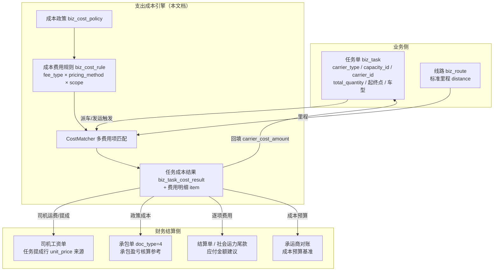
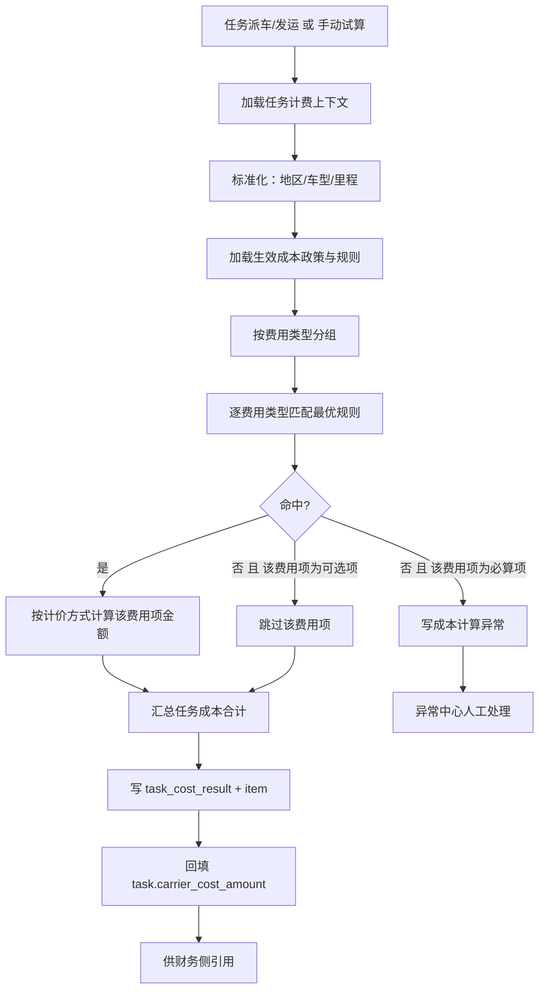
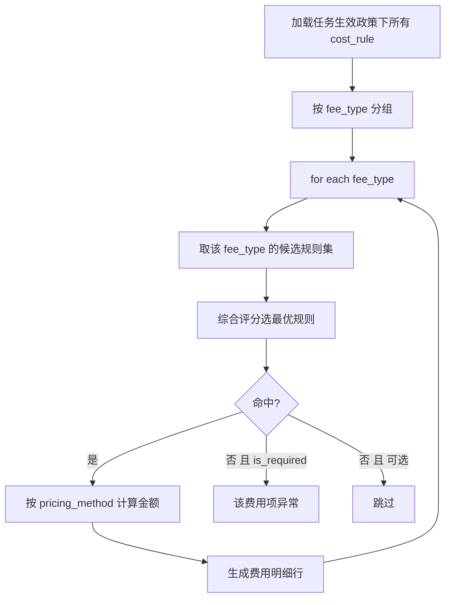

# 任务支出成本自动计算系统设计文档

> 适用技术栈：MySQL + Python FastAPI（复用现有租户库多租户架构）
>
> 文档定位：产品设计 + 架构设计 + 数据模型设计 + 计算规则设计
>
> 所属阶段：阶段五/六 - 计费引擎（支出侧）× 财务结算（应付源头）
>
> 文档状态：方案设计（待评审落地）
>
> 创建日期：2026-07-06
>
> 优先级：高（自有车/承运商发运即时应付成本自动化的前置能力）
>
> 关联文档：
>
> - 同目录 [01.运价合同管理](01.运价合同管理.md)（收入侧运价合同与计费入口）
> - 同目录 [02.运单合同运费自动计算系统设计文档](02.运单合同运费自动计算系统设计文档.md)（收入侧引擎参照系）
> - 同目录 [03.线路管理](03.线路管理.md)（标准里程 `biz_route.distance` 来源）
> - [07.财务结算模块/00.模块总览](../07.财务结算模块/00.模块总览.md)
> - [07.财务结算模块/04.自有司机工资单](../07.财务结算模块/04.自有司机工资单.md)（本引擎结果的主要消费方）
> - [07.财务结算模块/05.任务级费用单演进与社会运力预付尾款](../07.财务结算模块/05.任务级费用单演进与社会运力预付尾款.md)
> - [07.财务结算模块/06.任务级承包单与司机承包结算](../07.财务结算模块/06.任务级承包单与司机承包结算.md)（`settlement_mode` 三种结算模式）
> - [06.运营调度模块/01.运输任务单管理](../06.运营调度模块/01.运输任务单管理.md)

---

## 1. 文档目标

本文档设计一套与「收入侧运费引擎」对称的 **任务支出成本自动计算系统**（下称"成本引擎"）。企业针对每个运输任务会发生多类应付费用（司机运费、洗车费、装车费、卸车费、高速费、油补等），这些费用由公司政策决定，按 **每公里 / 每台 / 每趟 / 包车 / 固定** 等方式计价。系统需要在任务派车/发运时，**自动逐项计算该任务应付给司机（或承运商）的各项费用与总成本**，并为财务侧的工资单、承包单、结算单提供可解释、可追溯、可重算的金额来源。

系统需要解决以下核心问题：

1. 任务派车/发运后，按公司费用政策自动计算该任务的各项应付费用与成本合计；
2. 支持多费用项（司机运费、洗车费、装车费……）分别配置不同计价方式与适用范围；
3. 支持按承运类型（自有车 / 承运商 / 社会运力）、承运主体、线路、车型分层配置政策；
4. 任务关键要素（线路、台数、车型、承运资源）变化后可及时重算；
5. 费用政策修改后，受影响的未锁定任务可及时重算；
6. 计算过程可追溯、可解释、可审计（记录命中了哪条政策规则、为何命中、如何算出金额）；
7. 计算结果与财务结算（工资单 / 承包单 / 结算单 / 承运商对账）解耦但可联动，已支付/已锁定的任务不被自动覆盖。

---

## 2. 业务背景

### 2.1 典型业务场景

物流公司发运一个任务时，需要付给承运方多项费用，且各项费用规则不同：

```text
公司费用政策（示例）：
  司机运费：北京 → 天津，轿运车，按里程 4.5 元/公里
  洗车费：每台 15 元
  装车费：每台 20 元
  高速费：每趟固定 300 元（自有车报销制则据实，不走政策）
  油补：每公里 0.8 元
```

任务发运：

```text
任务：TASK-20260706-001
承运类型：自有车
主驾：张三（承包制？统一管理？计件提成？）
线路：北京市朝阳区 → 天津市滨海新区（标准里程 130km）
装载：轿运车 8 台
```

系统应自动完成以下计算：

```text
司机运费：按里程 4.5 元/公里 × 130km            = 585.00
洗车费：  每台 15 元 × 8 台                       = 120.00
装车费：  每台 20 元 × 8 台                       = 160.00
高速费：  每趟固定 300 元                          = 300.00
油补：    每公里 0.8 元 × 130km                   = 104.00
─────────────────────────────────────────────────────
任务应付司机成本合计                               = 1269.00
```

调度员在发运时即可看到"这个任务应给司机多少钱"，财务侧生成工资单/承包单/结算单时直接引用这些金额，无需人工估算与手工汇总。

### 2.2 与收入侧引擎的对称关系

| 维度 | 收入侧（已落地） | 支出侧（本文档） |
|------|-----------------|-----------------|
| 业务对象 | 运单 `waybill` | 任务 `task` |
| 计价主体 | 客户 `customer` | 承运资源（自有司机 / 承运商 / 社会运力） |
| 政策载体 | 运价合同 `biz_freight_contract` | 成本政策 `biz_cost_policy` |
| 计价规则 | 运价明细 `biz_freight_rate`（单一运费） | 成本费用规则 `biz_cost_rule`（多费用项） |
| 计价方式 | 台单价 / 单公里 / 整单价 | 每台 / 每公里 / 每趟 / 包车固定 / 每吨公里 |
| 结果 | `waybill_freight_result(_detail)`（收入） | `biz_task_cost_result(_item)`（成本 + 费用明细） |
| 下游 | 客户对账 / 客户结算 / 发票 | 司机工资单 / 承包单 / 结算单 / 承运商对账 |

> 设计上**最大程度复用**收入侧引擎的算法思想（多级匹配 + 综合评分 + 匹配留痕 + 区域层级向上兼容 + 车型层级匹配），降低理解与维护成本。核心差异是：一条任务要针对**多个费用类型分别匹配并逐项计算**，最后汇总成本。

### 2.3 与司机结算模式的关系

自有司机在 [`biz_driver_operation.settlement_mode`](../../../../backend/app/modules/client/models/capacity/self_capacity/driver/driver_operation.py) 上声明结算模式（见财务模块 `06`）：

| settlement_mode | 结算模式 | 成本引擎的作用 |
|:--:|------|------|
| 1 | 承包制 | 承包费按 `biz_driver_settlement_config` 周期基准，**成本引擎不主导应付金额**；但可用于承包制盈亏核算（政策成本 vs 承包费对比） |
| 2 | 统一管理各费用（默认） | 各项费用据实报销/结算，成本引擎作为**预算/标准参考**，也可直接生成应付明细 |
| 3 | 计件提成 | **成本引擎为主力**：按台/趟/公里自动计算司机运费与提成，直接喂给工资单任务提成行 |

> 财务模块 `06` 明确"计件提成模式（`settlement_mode=3`）对应的计件规则表与提成单——独立设计"。**本文档即补齐该独立设计**，并将其抽象为通用的、覆盖三种承运类型的成本计费引擎，而不仅是司机计件。

---

## 3. 与现有模块的关系



关键边界：

- **成本引擎不直接生成财务单据**，只产出"任务应付成本明细"；财务单据的创建/审批/支付仍由财务模块负责（弱联动、可解释）。
- **成本引擎与 `task.status` 解耦**：只读任务的稳定字段（线路、台数、车型、承运资源、里程），不驱动任务状态机。
- **已锁定/已进入已支付财务单据的任务不自动覆盖**：与收入侧"已结算运单锁定"原则一致，改用 `task.is_locked` 保护。

---

## 4. 系统设计原则

| 原则 | 说明 |
|------|------|
| 与收入引擎对称复用 | 复用多级匹配、综合评分、区域/车型层级、匹配留痕等成熟算法思想，避免重复造轮子 |
| 多费用项独立匹配 | 每个费用类型（fee_type）在同一任务上**独立匹配最优规则并各自计算**，互不干扰 |
| 政策版本化 | 成本政策与规则修改保留历史版本/变更日志，保证历史任务成本可追溯 |
| 计算结果明细化 | 每个费用项生成独立结果明细行，含单价、数量、金额、命中规则、匹配轨迹 |
| 匹配过程可解释 | 记录命中了哪条政策、哪条规则、为何命中、评分明细 |
| 修改影响任务化 | 任务要素变更、政策变更后通过任务机制触发重算 |
| 结算之后锁定 | 已进入已支付财务单据 / 人工锁定的任务不被自动重算覆盖 |
| 异常必须显性化 | 未匹配、缺里程、缺台数、承运资源缺失、规则冲突等进入成本计算异常中心 |
| 与财务弱联动 | 引擎只产出成本明细，不代替财务单据流程；下游按需引用 |
| 分期落地 | 先支持核心费用项（司机运费）与主流计价方式（每台/每公里/每趟/固定），再逐步扩展比例/阶梯/附加费 |

---

## 5. 核心概念与术语

| 术语 | 含义 |
|------|------|
| 成本引擎 | 本文档设计的"任务支出成本自动计算系统"，与收入侧运费引擎对称 |
| 成本政策（Cost Policy） | 一组费用规则的归属载体，类比运价合同。可按全局默认 / 承运商 / 司机 / 运力划定适用范围与生效期 |
| 成本费用规则（Cost Rule） | 定义"某费用类型在某适用范围下如何计价"的最小规则单元，类比运价明细 |
| 费用类型（fee_type） | 一类应付费用，如司机运费、洗车费、装车费、高速费、油补等（字典 `cost_fee_type`） |
| 计价方式（pricing_method） | 费用金额的计算方式：每台 / 每公里 / 每趟 / 包车固定 / 每吨公里 等 |
| 计价数量维度（qty_dimension） | 计价所依赖的数量：台数 / 里程 / 趟次 / 吨位 |
| 适用范围（scope） | 规则生效的条件集合：承运类型、承运主体、线路、车型、生效期 |
| 成本对象 / 收款方（payee） | 该费用最终应付给谁：司机 / 承运商 / 社会运力司机 |
| 任务成本结果（Task Cost Result） | 一次成本计算的结果主表，含成本合计与逐项费用明细 |
| 费用明细（Cost Result Item） | 单个费用项的计算结果行，含单价、数量、金额、命中规则、匹配轨迹 |
| 成本计算异常 | 未匹配/缺数据/规则冲突等无法完成计算的情形，进入异常中心待人工处理 |
| 引擎版本（cost_engine_version） | 计算引擎版本号，写入结果便于回放与审计 |

---

## 6. 总体架构

### 6.1 模块划分

| 模块 | 职责 |
|------|------|
| 成本政策模块 | 维护成本政策（合同载体）、适用范围、生效期、状态 |
| 成本费用规则模块 | 维护费用类型 × 计价方式 × 适用范围 × 单价的规则明细 |
| 任务上下文加载 | 从任务读取承运类型、承运主体、线路、台数、车型、里程等计费要素 |
| 标准基础数据 | 复用收入侧：标准行政区、区域/车型层级、线路里程 `biz_route` |
| 成本匹配引擎（CostMatcher） | 纯算法层：按费用类型逐项匹配最优规则并计算金额，不访问 DB |
| 成本计算编排（TaskCostCalcService） | 加载数据、调用匹配器、汇总、持久化、写异常 |
| 计算任务模块 | 异步重算、政策变更批量重算、失败重试（复用收入侧任务表模式） |
| 成本计算结果模块 | 保存任务成本合计与逐项费用明细 |
| 成本异常中心 | 处理未匹配、缺数据、规则冲突等 |
| 财务对接适配层 | 把成本明细提供给工资单/承包单/结算单/承运商对账 |

### 6.2 系统流程总览



### 6.3 计算入口（三种）

| 入口 | 触发方 | 是否落库 | 用途 |
|------|--------|---------|------|
| `preview_for_task`（试算） | 调度员编辑任务 / 前端预览 | 否 | 发运前实时预览"应给司机多少" |
| `calculate_and_persist`（正式计算） | 派车/发运事件、手动重算 | 是 | 写结果明细，回填成本，供财务引用 |
| `recalculate_many`（批量重算） | 政策变更、Worker 调度 | 是 | 政策修改后批量重算受影响任务 |

> 入口签名与收入侧 `FreightCalcService.preview_for_waybill` / `calculate_and_persist` / `recalculate_many` 保持一致的形态，便于统一 Worker 编排与团队认知复用。

---

## 7. 费用类型与计价方式设计

### 7.1 费用类型（fee_type）

费用类型由字典 `cost_fee_type` 维护，租户可扩展。系统内置项：

| fee_type | 名称 | 默认计价方式 | 默认收款方 | 说明 |
|----------|------|-------------|-----------|------|
| `driver_freight` | 司机运费 | 每台 / 每公里 / 每趟 | 司机 | 核心费用项，计件提成主力 |
| `car_wash` | 洗车费 | 每台 / 每趟 | 司机 | 商品车运输常见 |
| `loading` | 装车费 | 每台 / 每趟 | 司机 | 装车环节 |
| `unloading` | 卸车费 | 每台 / 每趟 | 司机 | 卸车环节 |
| `highway` | 高速/路桥费 | 每趟固定 / 每公里 | 司机/承运商 | 据实报销时不走政策 |
| `fuel_subsidy` | 油补 | 每公里 / 每台 | 司机 | 计件补贴 |
| `waiting` | 等待费 | 每趟固定 | 司机 | 超时等待 |
| `detour` | 超里程费 | 每公里 | 司机 | 实际里程超标准 |
| `night` | 夜间费 | 每趟固定 | 司机 | 夜间作业 |
| `carrier_freight` | 承运商运费 | 包车固定 / 每台 / 每公里 | 承运商 | 外委承运成本 |
| `other` | 其他费用 | 固定 | 司机/承运商 | 自定义兜底 |

字段属性：

| 字段 | 说明 |
|------|------|
| `direction` | 方向：1-应付加项（默认）/ 2-扣减项（如司机自负部分，罕见） |
| `is_required` | 是否必算项：必算项未命中时进异常；可选项未命中时静默跳过 |
| `payee_type_default` | 默认收款方类型：1-司机 2-承运商 3-社会运力 |
| `applicable_carrier_types` | 适用承运类型集合（如高速费仅自有车） |

> 费用类型采用**字典驱动**而非硬编码枚举：新增一类费用只需加字典项 + 配一条成本规则，无需改代码/建表，符合"通用引擎"定位。

### 7.2 计价方式（pricing_method）

| pricing_method | 名称 | 计价数量维度 | 计算公式 | 对齐收入侧 |
|----------------|------|-------------|---------|-----------|
| `per_vehicle` | 每台 | 台数 `total_quantity` | `unit_price × qty` | billing_mode=0 台单价 |
| `per_km` | 每公里 | 里程 `distance_km` | `unit_price × km`（可选 `× qty`） | billing_mode=1 单公里 |
| `per_trip` | 每趟固定 | 趟次=1 | `unit_price`（不乘） | billing_mode=2 整单价 |
| `per_ton_km` | 每吨公里 | 吨位 × 里程 | `unit_price × ton × km` | 扩展 |
| `fixed` | 固定/包车 | — | `unit_price`（一口价） | 类整单价 |
| `percentage` | 按比例（远期） | 基数（如运费收入） | `base × rate%` | 无 |
| `tiered` | 阶梯（远期） | 台数/里程分段 | 分段累加 | 无 |

计价数量来源与"是否乘台数"通过规则字段 `qty_dimension` + `multiply_by_qty` 明确控制，避免歧义：

```text
per_vehicle : qty = task.total_quantity          金额 = unit_price × qty
per_km      : km  = 里程（见 7.3）                金额 = unit_price × km × (qty if multiply_by_qty else 1)
per_trip    : —                                   金额 = unit_price
per_ton_km  : ton × km                            金额 = unit_price × ton × km
fixed       : —                                   金额 = unit_price
```

> **每公里是否乘台数** 是常见业务分歧点：司机运费"每公里"通常指整车每公里（不乘台数），而某些"每台每公里"补贴要乘台数。用 `multiply_by_qty` 布尔字段显式区分，默认 `false`（不乘台数）。

### 7.3 里程来源优先级

`per_km` / `per_ton_km` 依赖里程，取值优先级（高→低）：

```text
1. 成本规则自带核定里程 rule.distance_km（政策标准，最高优先）
2. 任务线路标准里程（biz_route.distance，按任务起终点 region 匹配）
3. 任务实际行驶里程（远期：GPS/回单里程，若已采集）
4. 缺失 → 该 per_km 费用项进异常（缺里程）
```

### 7.4 金额封顶与保底

每条规则可选配：

| 字段 | 说明 |
|------|------|
| `min_amount` | 该费用项保底金额：`amount = max(计算值, min_amount)` |
| `max_amount` | 该费用项封顶金额：`amount = min(计算值, max_amount)` |
| `round_mode` | 取整方式：不取整（默认，保留 2 位）/ 四舍五入到元 / 进一法 |

---

## 8. 数据模型设计

所有表位于租户独立数据库，`__table_tier__ = "business"`，遵循项目 `TenantModelBase`（含 `id / tenant_id / created_at / updated_at / is_deleted` 等基座字段）。新增表按 `sys_product_feature.required_tables` 由 runner Phase 1 自动建表，无需手写 versioned migration（见 `database-migration.mdc`）。

### 8.1 成本政策表：biz_cost_policy

成本政策是费用规则的归属载体（类比运价合同）。

```sql
CREATE TABLE biz_cost_policy (
    id BIGINT NOT NULL AUTO_INCREMENT COMMENT '主键ID',
    tenant_id BIGINT NOT NULL COMMENT '租户ID',

    policy_no VARCHAR(64) NOT NULL COMMENT '政策编号（租户内唯一）',
    policy_name VARCHAR(200) NOT NULL COMMENT '政策名称',

    scope_type SMALLINT NOT NULL DEFAULT 0 COMMENT '适用范围类型 0-全局默认 1-指定承运商 2-指定司机 3-指定运力',
    scope_id BIGINT DEFAULT NULL COMMENT '适用范围对象ID（承运商/司机/运力ID，scope_type=0时为空）',

    carrier_type SMALLINT DEFAULT NULL COMMENT '适用承运类型 1-自有车 2-承运商 3-社会运力，空表示不限',

    effective_date DATE NOT NULL COMMENT '生效日期',
    expiry_date DATE DEFAULT NULL COMMENT '失效日期（空表示长期）',

    status SMALLINT NOT NULL DEFAULT 0 COMMENT '状态 0-草稿 1-生效 2-已过期 3-已终止',
    priority INT NOT NULL DEFAULT 0 COMMENT '政策级人工优先级（越大越优先）',
    version_no INT NOT NULL DEFAULT 1 COMMENT '政策版本号',

    remark VARCHAR(500) DEFAULT NULL COMMENT '备注',
    created_by BIGINT DEFAULT NULL COMMENT '创建人',
    updated_by BIGINT DEFAULT NULL COMMENT '更新人',
    created_at DATETIME NOT NULL DEFAULT CURRENT_TIMESTAMP COMMENT '创建时间',
    updated_at DATETIME NOT NULL DEFAULT CURRENT_TIMESTAMP ON UPDATE CURRENT_TIMESTAMP COMMENT '更新时间',
    is_deleted SMALLINT NOT NULL DEFAULT 0 COMMENT '软删除 0-否 1-是',

    PRIMARY KEY (id),
    UNIQUE KEY uk_tenant_policy_no (tenant_id, policy_no),
    KEY idx_tenant_scope (tenant_id, scope_type, scope_id),
    KEY idx_tenant_status_date (tenant_id, status, effective_date, expiry_date),
    KEY idx_tenant_carrier_type (tenant_id, carrier_type)
) ENGINE=InnoDB DEFAULT CHARSET=utf8mb4 COLLATE=utf8mb4_general_ci COMMENT='成本政策表';
```

> **适用范围优先级**：`scope_type` 越具体优先级越高（指定司机 > 指定运力 > 指定承运商 > 全局默认），在评分中体现（见 §9）。全局默认政策为兜底，避免任务无政策可匹配。

### 8.2 成本费用规则表：biz_cost_rule

定义"某费用类型在某适用范围下如何计价"（类比运价明细，但多了 fee_type / pricing_method / 收款方等）。

```sql
CREATE TABLE biz_cost_rule (
    id BIGINT NOT NULL AUTO_INCREMENT COMMENT '主键ID',
    tenant_id BIGINT NOT NULL COMMENT '租户ID',

    policy_id BIGINT NOT NULL COMMENT '所属成本政策ID',

    fee_type VARCHAR(32) NOT NULL COMMENT '费用类型（字典 cost_fee_type）：driver_freight/car_wash/loading/...',
    fee_name VARCHAR(50) DEFAULT NULL COMMENT '费用名称（字典 label 冗余）',
    direction SMALLINT NOT NULL DEFAULT 1 COMMENT '方向 1-应付加项 2-扣减项',

    pricing_method VARCHAR(32) NOT NULL DEFAULT 'per_vehicle' COMMENT '计价方式 per_vehicle/per_km/per_trip/per_ton_km/fixed/percentage/tiered',
    qty_dimension VARCHAR(16) DEFAULT NULL COMMENT '计价数量维度 vehicle/km/trip/ton',
    multiply_by_qty SMALLINT NOT NULL DEFAULT 0 COMMENT '每公里/每吨公里是否再乘台数 0-否 1-是',

    unit_price DECIMAL(12,2) NOT NULL COMMENT '单价（含义随 pricing_method 变化）',
    distance_km DECIMAL(10,2) DEFAULT NULL COMMENT '政策核定里程（per_km 时优先于线路里程）',
    min_amount DECIMAL(12,2) DEFAULT NULL COMMENT '该费用项保底金额',
    max_amount DECIMAL(12,2) DEFAULT NULL COMMENT '该费用项封顶金额',
    round_mode SMALLINT NOT NULL DEFAULT 0 COMMENT '取整方式 0-不取整 1-四舍五入到元 2-进一法到元',

    payee_type SMALLINT NOT NULL DEFAULT 1 COMMENT '收款方类型 1-司机 2-承运商 3-社会运力',

    -- 适用范围：线路（复用收入侧行政区层级向上兼容匹配）
    origin_region_id BIGINT DEFAULT NULL COMMENT '出发地行政区ID（biz_region.id），空表示不限线路',
    origin_code VARCHAR(20) DEFAULT NULL COMMENT '出发地编码',
    destination_region_id BIGINT DEFAULT NULL COMMENT '目的地行政区ID',
    destination_code VARCHAR(20) DEFAULT NULL COMMENT '目的地编码',
    is_bidirectional SMALLINT NOT NULL DEFAULT 0 COMMENT '线路是否双向 0-否 1-是',

    -- 适用范围：车型（复用收入侧品牌/车系层级）
    brand_id INT DEFAULT NULL COMMENT '标准品牌ID，空表示不限品牌',
    series_id INT DEFAULT NULL COMMENT '标准车系ID，空表示不限车型',

    effective_date DATE DEFAULT NULL COMMENT '规则生效日期（空则继承政策）',
    expiry_date DATE DEFAULT NULL COMMENT '规则失效日期（空则继承政策）',

    status SMALLINT NOT NULL DEFAULT 1 COMMENT '状态 0-停用 1-启用',
    price_type SMALLINT NOT NULL DEFAULT 0 COMMENT '价格类型 0-明确 1-预估',
    priority INT NOT NULL DEFAULT 0 COMMENT '人工优先级（越大越优先）',
    rule_version INT NOT NULL DEFAULT 1 COMMENT '规则版本号',
    remark VARCHAR(255) DEFAULT NULL COMMENT '备注',

    created_by BIGINT DEFAULT NULL COMMENT '创建人',
    updated_by BIGINT DEFAULT NULL COMMENT '更新人',
    created_at DATETIME NOT NULL DEFAULT CURRENT_TIMESTAMP COMMENT '创建时间',
    updated_at DATETIME NOT NULL DEFAULT CURRENT_TIMESTAMP ON UPDATE CURRENT_TIMESTAMP COMMENT '更新时间',
    is_deleted SMALLINT NOT NULL DEFAULT 0 COMMENT '软删除 0-否 1-是',

    PRIMARY KEY (id),
    KEY idx_policy_id (policy_id),
    KEY idx_tenant_fee_type (tenant_id, fee_type, status, is_deleted),
    KEY idx_tenant_route (tenant_id, origin_region_id, destination_region_id),
    KEY idx_tenant_series (tenant_id, series_id),
    KEY idx_tenant_brand (tenant_id, brand_id)
) ENGINE=InnoDB DEFAULT CHARSET=utf8mb4 COLLATE=utf8mb4_general_ci COMMENT='成本费用规则表';
```

> 线路 / 车型字段与收入侧 `biz_freight_rate` 完全对齐（`origin_region_id` / `destination_region_id` / `brand_id` / `series_id` / `is_bidirectional`），可**直接复用 `FreightMatcher` 的区域链路与车型层级判定逻辑**（见 §9）。

### 8.3 任务成本结果主表：biz_task_cost_result

```sql
CREATE TABLE biz_task_cost_result (
    id BIGINT NOT NULL AUTO_INCREMENT COMMENT '主键ID',
    tenant_id BIGINT NOT NULL COMMENT '租户ID',

    task_id BIGINT NOT NULL COMMENT '任务ID',
    task_version INT NOT NULL DEFAULT 1 COMMENT '任务版本号（要素变更+1，用于识别过期结果）',
    is_active SMALLINT NOT NULL DEFAULT 1 COMMENT '是否当前有效结果 0-否 1-是',

    carrier_type SMALLINT DEFAULT NULL COMMENT '承运类型快照 1-自有车 2-承运商 3-社会运力',
    payee_type SMALLINT DEFAULT NULL COMMENT '主收款方类型快照',
    payee_id BIGINT DEFAULT NULL COMMENT '主收款方ID快照（司机/承运商）',
    payee_name VARCHAR(100) DEFAULT NULL COMMENT '主收款方名称快照',

    total_cost_amount DECIMAL(14,2) NOT NULL DEFAULT 0.00 COMMENT '成本合计（所有加项-扣减项）',
    total_addition_amount DECIMAL(14,2) NOT NULL DEFAULT 0.00 COMMENT '加项合计',
    total_deduction_amount DECIMAL(14,2) NOT NULL DEFAULT 0.00 COMMENT '扣减项合计',

    calc_status VARCHAR(32) NOT NULL COMMENT '计算状态 success/partial/exception/locked',
    calc_engine_version VARCHAR(32) DEFAULT NULL COMMENT '成本引擎版本',
    calc_time DATETIME NOT NULL COMMENT '计算时间',
    triggered_by VARCHAR(64) DEFAULT NULL COMMENT '触发来源 dispatch/manual_recalc/policy_changed/task_changed',
    triggered_user_id BIGINT DEFAULT NULL COMMENT '触发人',
    error_message VARCHAR(500) DEFAULT NULL COMMENT '异常摘要',

    created_at DATETIME NOT NULL DEFAULT CURRENT_TIMESTAMP COMMENT '创建时间',
    updated_at DATETIME NOT NULL DEFAULT CURRENT_TIMESTAMP ON UPDATE CURRENT_TIMESTAMP COMMENT '更新时间',
    is_deleted SMALLINT NOT NULL DEFAULT 0 COMMENT '软删除 0-否 1-是',

    PRIMARY KEY (id),
    KEY idx_task_id (task_id),
    KEY idx_task_active (tenant_id, task_id, is_active),
    KEY idx_tenant_calc_time (tenant_id, calc_time),
    KEY idx_calc_status (tenant_id, calc_status)
) ENGINE=InnoDB DEFAULT CHARSET=utf8mb4 COLLATE=utf8mb4_general_ci COMMENT='任务成本计算结果主表';
```

### 8.4 任务成本费用明细表：biz_task_cost_result_item

每个费用项一行（司机运费 / 洗车费 / 装车费……）。

```sql
CREATE TABLE biz_task_cost_result_item (
    id BIGINT NOT NULL AUTO_INCREMENT COMMENT '主键ID',
    tenant_id BIGINT NOT NULL COMMENT '租户ID',

    result_id BIGINT NOT NULL COMMENT '成本结果主表ID',
    task_id BIGINT NOT NULL COMMENT '任务ID',

    fee_type VARCHAR(32) NOT NULL COMMENT '费用类型（字典 cost_fee_type）',
    fee_name VARCHAR(50) DEFAULT NULL COMMENT '费用名称（冗余）',
    direction SMALLINT NOT NULL DEFAULT 1 COMMENT '方向 1-加项 2-扣减项',
    payee_type SMALLINT DEFAULT NULL COMMENT '收款方类型',

    pricing_method VARCHAR(32) NOT NULL COMMENT '计价方式',
    unit_price DECIMAL(12,2) DEFAULT NULL COMMENT '匹配单价',
    quantity DECIMAL(12,2) DEFAULT NULL COMMENT '计价数量（台/公里/趟/吨）',
    distance_km DECIMAL(10,2) DEFAULT NULL COMMENT '本次采用的里程',
    amount DECIMAL(14,2) NOT NULL DEFAULT 0.00 COMMENT '该费用项金额',

    matched_policy_id BIGINT DEFAULT NULL COMMENT '命中政策ID',
    matched_rule_id BIGINT DEFAULT NULL COMMENT '命中规则ID',
    matched_rule_version INT DEFAULT NULL COMMENT '命中规则版本',
    match_score INT DEFAULT NULL COMMENT '匹配得分',
    match_trace_json JSON DEFAULT NULL COMMENT '匹配过程JSON',

    calc_status VARCHAR(32) NOT NULL COMMENT '计算状态 success/exception/skipped',
    error_type VARCHAR(64) DEFAULT NULL COMMENT '异常类型',
    error_message VARCHAR(500) DEFAULT NULL COMMENT '异常信息',

    created_at DATETIME NOT NULL DEFAULT CURRENT_TIMESTAMP COMMENT '创建时间',

    PRIMARY KEY (id),
    KEY idx_result_id (result_id),
    KEY idx_task_id (task_id),
    KEY idx_fee_type (tenant_id, fee_type),
    KEY idx_matched_rule (matched_rule_id)
) ENGINE=InnoDB DEFAULT CHARSET=utf8mb4 COLLATE=utf8mb4_general_ci COMMENT='任务成本费用明细表';
```

### 8.5 成本计算异常表：biz_cost_calc_exception

```sql
CREATE TABLE biz_cost_calc_exception (
    id BIGINT NOT NULL AUTO_INCREMENT COMMENT '主键ID',
    tenant_id BIGINT NOT NULL COMMENT '租户ID',

    task_id BIGINT NOT NULL COMMENT '任务ID',
    fee_type VARCHAR(32) DEFAULT NULL COMMENT '费用类型（整任务级异常时为空）',

    exception_type VARCHAR(64) NOT NULL COMMENT '异常类型',
    exception_message VARCHAR(1000) NOT NULL COMMENT '异常描述',
    context_json JSON DEFAULT NULL COMMENT '上下文JSON（触发来源/匹配轨迹）',

    status VARCHAR(32) NOT NULL DEFAULT 'pending' COMMENT '处理状态 pending/processed/ignored',
    processed_by BIGINT DEFAULT NULL COMMENT '处理人',
    processed_at DATETIME DEFAULT NULL COMMENT '处理时间',

    created_at DATETIME NOT NULL DEFAULT CURRENT_TIMESTAMP COMMENT '创建时间',

    PRIMARY KEY (id),
    KEY idx_tenant_status (tenant_id, status),
    KEY idx_task_id (task_id),
    KEY idx_exception_type (tenant_id, exception_type)
) ENGINE=InnoDB DEFAULT CHARSET=utf8mb4 COLLATE=utf8mb4_general_ci COMMENT='成本计算异常表';
```

### 8.6 计算任务表：复用 / 新增

政策变更批量重算可**复用收入侧 `biz_freight_calc_task` 的模式**，或新增 `biz_cost_calc_task`（结构一致，`target_type` 改为 `task/policy/rule`）。第一期建议：任务量不大时用同步重算 + 简易 Worker 扫描；建独立 `biz_cost_calc_task` 以隔离两类引擎的任务队列。

```sql
-- 结构与 freight_calc_task 一致，仅 target_type 语义不同
-- task_type: task_dispatched / policy_changed / rule_changed / manual_recalc
-- target_type: task / policy / rule
```

### 8.7 字典表：cost_fee_type（数据字典）

通过项目现有数据字典机制（见 `11.数据字典对接指南`）初始化 `cost_fee_type`：

```text
字典编码：cost_fee_type
字典项：
  driver_freight   司机运费
  car_wash         洗车费
  loading          装车费
  unloading        卸车费
  highway          高速/路桥费
  fuel_subsidy     油补
  waiting          等待费
  detour           超里程费
  night            夜间费
  carrier_freight  承运商运费
  other            其他费用
```

配套字典（可选）：`cost_pricing_method`（计价方式）、`cost_policy_scope_type`（适用范围类型）用于前端下拉。

### 8.8 任务侧字段复用与新增

| 字段 | 表 | 状态 | 用途 |
|------|-----|------|------|
| `carrier_cost_amount` | `biz_task` | 已有 | 成本引擎回填成本合计 |
| `carrier_cost_type` | `biz_task` | 已有 | 成本引擎回填主计价类型（映射 1-包车 2-按台 3-按吨公里 4-其他） |
| `total_quantity` / `origin_region_id` / `destination_region_id` / `capacity_id` / `carrier_id` / `carrier_type` | `biz_task` | 已有 | 计费上下文只读来源 |
| `cost_calc_status` | `biz_task` | **新增（可选）** | 成本计算状态 pending/calculated/exception/locked（便于列表筛选） |
| `last_cost_result_id` | `biz_task` | **新增（可选）** | 最近一次成本结果ID |

> `cost_calc_status` / `last_cost_result_id` 为可选增强字段。若新增，需按 `database-migration.mdc` 走 `autogen tenant` 迁移；若暂不加，成本状态可通过 `biz_task_cost_result.is_active` 反查。

---

## 9. 匹配与计算算法

### 9.1 计费上下文（TaskCostContext）

从任务读取计费要素（只读）：

```text
tenant_id
task_id / task_version
carrier_type            承运类型（1-自有车 2-承运商 3-社会运力）
payee 主体              capacity_id → 主驾 driver_id / carrier_id / social_driver_id
origin_region_id        起点行政区
destination_region_id   终点行政区
total_quantity          总台数
车型集合                任务下挂接运单明细的车型（brand_id/series_id），可能多车型
distance_km             里程（按 §7.3 优先级解析）
transport_date          发运/计费日期（planned_load_time 或当天）
```

> **多车型处理**：任务可能装载多种车型。对"每台"类费用，若不同车型单价不同，按车型分组分别匹配并累加；若费用规则不限车型（`series_id/brand_id` 为空），则按总台数一次计算。默认司机运费/洗车费/装车费多为"不限车型按总台数"，故常规场景一次算清。

### 9.2 逐费用类型匹配（核心差异点）

与收入侧"一条货物匹配一条运价"不同，成本引擎对**每个费用类型独立跑一次匹配**：



### 9.3 候选规则筛选

一条 `cost_rule` 进入某任务某费用类型的候选，需同时满足：

```text
1. rule.status = 1 且 rule.is_deleted = 0
2. 所属 policy.status = 1（生效）且在生效期内
3. policy 适用范围匹配：
   - scope_type = 0 全局默认：命中
   - scope_type = 1 承运商：policy.scope_id == task.carrier_id
   - scope_type = 2 司机：policy.scope_id == task 主驾 driver_id
   - scope_type = 3 运力：policy.scope_id == task.capacity_id
4. policy.carrier_type 为空 或 == task.carrier_type
5. rule 生效期覆盖 transport_date（空则继承 policy 生效期）
6. rule.payee_type 与承运类型自洽（如 payee_type=1 司机 仅自有车/社会运力）
7. 线路维度：rule 未限线路（region 均空）→ 通用命中；
   否则按收入侧行政区层级向上兼容匹配（含双向）
8. 车型维度：rule 未限车型 → 通用命中；否则按 brand/series 层级匹配
```

### 9.4 综合评分（复用收入侧思想 + 支出特化）

对候选规则打分，最高分唯一即命中；同分进冲突。

```text
总分 = 范围分(scope) + 线路分(line) + 车型分(model) + 方向分(direction)
      + 价格类型分(price_type) + 政策优先级 + 规则优先级 + 版本分
```

建议分值：

| 维度 | 分值 |
|------|-----:|
| 适用范围：指定司机 | 40000 |
| 适用范围：指定运力 | 35000 |
| 适用范围：指定承运商 | 30000 |
| 适用范围：全局默认 | 10000 |
| 线路：区-区 / 区-市 / 市-市 / 省-省 | 10000~30000（同收入侧 `LINE_SCORE`）|
| 线路：不限线路（通用） | 5000 |
| 车型：车系 / 品牌 / 通用 | 3000 / 2000 / 1000（同收入侧 `MODEL_SCORE`）|
| 方向：正向 / 反向 | 500 / 300 |
| 价格类型：明确 / 预估 | 200 / 0 |
| 政策优先级 | policy.priority |
| 规则优先级 | rule.priority |
| 版本分 | rule_version × 1 |

> 线路分与车型分**直接复用** `freight_matcher.LINE_SCORE` / `MODEL_SCORE` 与其区域链路展开、`_direction_for`、`_model_match_type` 等静态方法，仅把最外层"范围分"从"客户精确匹配 CUSTOMER_SCORE"替换为"承运范围 scope 分"。

### 9.5 金额计算

命中规则后按 `pricing_method` 计算（对齐 §7.2）：

```text
per_vehicle : amount = unit_price × qty
per_km      : amount = unit_price × km × (qty if multiply_by_qty else 1)
per_trip    : amount = unit_price
per_ton_km  : amount = unit_price × ton × km
fixed       : amount = unit_price
```

再应用保底/封顶/取整：

```text
amount = clamp(amount, min_amount, max_amount)
amount = round(amount, round_mode)
```

### 9.6 任务成本汇总

```text
加项合计   = Σ amount (direction=1)
扣减项合计 = Σ amount (direction=2)
成本合计   = 加项合计 - 扣减项合计
```

写入 `biz_task_cost_result`，逐项写 `biz_task_cost_result_item`。

### 9.7 匹配留痕（match_trace_json）

每个费用明细记录匹配轨迹，示例：

```json
{
  "engine": "cost-v1.0.0",
  "fee_type": "driver_freight",
  "carrier_type": 1,
  "payee_type": 1,
  "scope_matched": "driver",
  "origin_chain": [110105, 110100, 110000],
  "destination_chain": [120116, 120100, 120000],
  "matched_origin": 110100,
  "matched_destination": 120100,
  "model_match_type": "general",
  "direction_match": "forward",
  "pricing_method": "per_km",
  "distance_source": "biz_route",
  "distance_km": 130.0,
  "unit_price": 4.5,
  "quantity": 1,
  "amount": 585.00,
  "score": 46030,
  "top_candidates": [ { "rule_id": 12, "score": 46030 }, { "rule_id": 8, "score": 15030 } ]
}
```

### 9.8 异常类型

| 异常类型 | 说明 |
|----------|------|
| `POLICY_NOT_FOUND` | 该任务无任何生效成本政策 |
| `RULE_NOT_FOUND` | 某必算费用类型未匹配到规则 |
| `RULE_CONFLICT` | 某费用类型匹配到多条同分规则 |
| `DISTANCE_NOT_FOUND` | per_km/per_ton_km 缺里程 |
| `AREA_NOT_RECOGNIZED` | 起点/终点无法标准化 |
| `INVALID_QTY` | 台数为空或 ≤ 0（per_vehicle 时） |
| `CARRIER_RESOURCE_MISSING` | 缺承运资源（无法确定收款方） |
| `TASK_LOCKED` | 任务已锁定，跳过自动重算 |

---

## 10. 触发与重算机制

### 10.1 触发时机

| 触发来源 | triggered_by | 说明 |
|----------|-------------|------|
| 派车/发运 | `dispatch` | `task.status` 0→1 派车 或装车时自动计算（推荐派车完成即算） |
| 任务要素变更 | `task_changed` | 线路/台数/车型/承运资源变化，任务版本+1 后重算 |
| 政策/规则变更 | `policy_changed` / `rule_changed` | 识别受影响任务批量重算 |
| 手动重算 | `manual_recalc` | 调度员/财务在任务详情点"重算成本" |
| 试算 | `preview` | 编辑态实时预览，不落库 |

### 10.2 任务要素敏感字段

以下字段变化触发成本重算（任务版本+1，`cost_calc_status → pending`）：

```text
carrier_type / capacity_id / carrier_id / social_driver_id（承运资源）
origin_region_id / destination_region_id（线路）
total_quantity（台数）
挂接运单明细的车型集合（车型）
planned_load_time（计费日期，影响政策生效期匹配）
```

### 10.3 政策变更影响任务识别

政策/规则修改后，识别受影响任务（粗匹配，重算时再精细评分）：

```text
- 政策 scope 命中的任务（全局默认 → 全部未锁定任务；指定承运商/司机/运力 → 对应任务）
- carrier_type 一致
- 规则线路命中（origin/destination_region_id 与任务起终点交集，含双向）
- 任务发运日期落在规则生效期内
- 任务未锁定（task.is_locked = 0）
```

处理流程与收入侧一致：生成规则变更日志 → 识别受影响任务 → 批量生成重算任务 → Worker 重算 → 更新结果。

### 10.4 锁定与已结算保护

| 任务状态 | 是否自动重算 | 处理方式 |
|----------|-------------|---------|
| 待派车/已派车（未锁定） | 是 | 自动重算 |
| 已装车/在途/已到达（未锁定） | 是 | 自动重算 |
| 已进入已支付财务单据（`task.is_locked=1`） | 否 | 生成差异提醒，不覆盖 |
| 已挂已审批/已发放工资单 | 否 | 生成差异提醒 |
| 已取消 | 否 | 不计算 |

> 复用 `task.is_locked`（最终结算单/承运商结算单支付后置 1）。锁定后重算只写异常 `TASK_LOCKED` + 生成差异提醒，绝不覆盖历史成本，保证已支付金额可追溯。

---

## 11. 与财务结算模块的对接

成本引擎是财务应付侧的**金额源头**，但不代替财务单据流程。对接关系：

### 11.1 司机工资单（计件提成 settlement_mode=3 主场景）

司机工资单任务提成行 [`biz_driver_payroll_task_link`](../07.财务结算模块/04.自有司机工资单.md) 需要 `unit_price` / `commission_amount`，此前为手工。对接后：

```text
生成工资单候选任务时：
  - 读取任务的 biz_task_cost_result（is_active=1）
  - 取 fee_type='driver_freight' 明细 → 写入 task_link.unit_price / quantity / commission_amount
  - 其它费用项（洗车费/装车费/油补）可汇总为工资项 biz_driver_payroll_item（category=1 应发项）
  - billing_base 由 pricing_method 映射：per_vehicle→按台 per_ton_km→按吨 per_trip→按趟
```

### 11.2 承包单 doc_type=4（承包制盈亏核算）

承包制司机应付金额由 `biz_driver_settlement_config` 周期基准决定，**成本引擎不主导金额**；但成本引擎结果可用于：

```text
承包盈亏核算报表：
  政策测算成本（成本引擎逐项合计） vs 承包费基准（周期分摊）
  → 辅助判断承包价是否合理
```

### 11.3 任务级结算单 / 社会运力尾款（doc_type=3）

创建应付结算单时，成本引擎结果作为**金额建议与逐项明细来源**：

```text
- doc.actual_amount 默认 = biz_task_cost_result.total_cost_amount
- biz_task_finance_item（费用项明细）逐行来自 biz_task_cost_result_item
- 财务可人工调整；调整后与引擎值差异记录，供审计
```

> 呼应财务模块 `05` 远期锚点"与计费引擎反向校验承运成本：创建结算单时若 `actual_amount ≠ task.carrier_cost_amount` 触发警示"——本引擎正是 `carrier_cost_amount` 的自动来源。

### 11.4 承运商对账（carrier_type=2）

承运商任务的成本预算基准：

```text
- fee_type='carrier_freight' 明细 → task.carrier_cost_amount
- 承运商对账/结算时作为应付预算，与承运商实际报价核对
```

### 11.5 回填任务字段

```text
task.carrier_cost_amount = biz_task_cost_result.total_cost_amount
task.carrier_cost_type   = 主计价方式映射（包车/按台/按吨公里/其他）
```

回填受 `task.is_locked` 保护：锁定任务不回填。

### 11.6 边界总结

| 成本引擎负责 | 财务模块负责 |
|-------------|-------------|
| 按政策算出"应付多少、逐项明细、如何算出" | 单据创建、审批、支付、锁定、审计事件 |
| 产出可追溯的成本结果 | 引用成本结果作为金额建议，允许人工调整 |
| 政策变更后重算未锁定任务成本 | 已支付单据不受重算影响（快照原则） |

---

## 12. API 接口设计

所有接口前缀 `/api/client`，需 JWT 认证。

### 12.1 成本政策

| 方法 | 路径 | 说明 |
|------|------|------|
| GET | `/billing/cost-policy` | 分页查询成本政策 |
| GET | `/billing/cost-policy/{id}` | 政策详情（含费用规则列表） |
| POST | `/billing/cost-policy` | 创建政策 |
| PUT | `/billing/cost-policy/{id}` | 更新政策 |
| PUT | `/billing/cost-policy/{id}/terminate` | 终止政策 |
| DELETE | `/billing/cost-policy/{id}` | 软删除（仅草稿可删） |

### 12.2 成本费用规则

| 方法 | 路径 | 说明 |
|------|------|------|
| GET | `/billing/cost-policy/{policy_id}/rule` | 查询政策下费用规则 |
| POST | `/billing/cost-policy/{policy_id}/rule` | 新增费用规则 |
| PUT | `/billing/cost-rule/{id}` | 更新费用规则 |
| DELETE | `/billing/cost-rule/{id}` | 删除费用规则 |
| POST | `/billing/cost-rule/{id}/check-conflict` | 规则冲突检测 |
| POST | `/billing/cost-rule/{id}/recalculate-affected` | 重算受影响任务 |

### 12.3 任务成本计算

| 方法 | 路径 | 说明 |
|------|------|------|
| POST | `/billing/task-cost/preview` | 试算任务成本（不落库，发运前预览） |
| POST | `/billing/task/{id}/cost/recalculate` | 手动重算任务成本 |
| GET | `/billing/task/{id}/cost-result` | 查询任务成本结果（含费用明细） |
| GET | `/billing/cost-calc/exceptions` | 查询成本计算异常 |
| POST | `/billing/cost-calc/exceptions/{id}/resolve` | 处理异常 |

**试算请求体示例**：

```json
{
  "carrierType": 1,
  "capacityId": 12,
  "driverId": 34,
  "originRegionId": 110105,
  "destinationRegionId": 120116,
  "totalQuantity": 8,
  "vehicles": [{ "brandId": null, "seriesId": null, "quantity": 8 }],
  "distanceKm": 130.0,
  "transportDate": "2026-07-06"
}
```

**试算响应示例**：

```json
{
  "code": 0,
  "data": {
    "totalCostAmount": 1269.00,
    "calcStatus": "success",
    "items": [
      { "feeType": "driver_freight", "feeName": "司机运费", "pricingMethod": "per_km", "unitPrice": 4.5, "quantity": 130.0, "amount": 585.00, "matchedRuleId": 12 },
      { "feeType": "car_wash", "feeName": "洗车费", "pricingMethod": "per_vehicle", "unitPrice": 15.0, "quantity": 8, "amount": 120.00, "matchedRuleId": 15 },
      { "feeType": "loading", "feeName": "装车费", "pricingMethod": "per_vehicle", "unitPrice": 20.0, "quantity": 8, "amount": 160.00, "matchedRuleId": 16 },
      { "feeType": "highway", "feeName": "高速费", "pricingMethod": "per_trip", "unitPrice": 300.0, "quantity": 1, "amount": 300.00, "matchedRuleId": 18 },
      { "feeType": "fuel_subsidy", "feeName": "油补", "pricingMethod": "per_km", "unitPrice": 0.8, "quantity": 130.0, "amount": 104.00, "matchedRuleId": 20 }
    ]
  }
}
```

---

## 13. 后端代码蓝图

### 13.1 目录结构（复用收入侧 billing 目录）

```text
backend/app/modules/client/
├── models/billing/
│   ├── cost_policy.py                 # 新增 CostPolicy
│   ├── cost_rule.py                   # 新增 CostRule
│   ├── task_cost_result.py            # 新增 TaskCostResult + TaskCostResultItem
│   └── cost_calc_exception.py         # 新增 CostCalcException
├── services/billing/
│   ├── cost_policy_service.py         # 政策 CRUD + 冲突校验
│   ├── cost_rule_service.py           # 费用规则 CRUD
│   ├── cost_matcher.py                # 纯算法：逐费用类型匹配（复用 freight_matcher 静态方法）
│   ├── task_cost_calc_service.py      # 编排：加载/试算/落库/重算/受影响识别
│   └── cost_finance_adapter.py        # 财务对接适配（工资单/结算单取数）
├── schemas/billing/
│   ├── cost_policy.py
│   ├── cost_rule.py
│   └── task_cost.py
├── api/billing/
│   ├── cost_policy.py
│   ├── cost_rule.py
│   └── task_cost.py
└── workers/
    └── cost_calc_worker.py            # 政策变更批量重算（可选，复用现有 Worker 模式）
```

### 13.2 核心服务职责

| 服务 | 职责 | 复用点 |
|------|------|--------|
| `CostPolicyService` | 政策维护、生效期状态流转、规则冲突校验 | 参照 `FreightContractService` |
| `CostRuleService` | 费用规则 CRUD、版本+1、变更日志 | 参照 `FreightRateService` |
| `CostMatcher` | 逐费用类型综合评分匹配、金额计算、留痕（纯算法不碰 DB） | 复用 `freight_matcher` 的 `LINE_SCORE`/`MODEL_SCORE`/区域链路/`_direction_for`/`_model_match_type` |
| `TaskCostCalcService` | 加载任务上下文、标准化、分组匹配、汇总、落库、写异常、回填任务、受影响识别、批量重算 | 参照 `FreightCalcService`（`preview_for_task` / `calculate_and_persist` / `recalculate_many`） |
| `CostFinanceAdapter` | 供工资单/结算单取成本明细 | 新增 |

### 13.3 与收入侧引擎的复用矩阵

| 能力 | 收入侧现成实现 | 支出侧做法 |
|------|---------------|-----------|
| 区域标准化 / 层级链路 | `StandardizeService.resolve_region` | 直接复用 |
| 车型标准化 / 层级 | `StandardizeService.resolve_vehicle` | 直接复用 |
| 线路评分 / 车型评分 | `LINE_SCORE` / `MODEL_SCORE` | 直接复用 |
| 方向判定 / 双向 | `_direction_for` | 直接复用 |
| 明确/预估价 | `PRICE_TYPE_SCORE` | 直接复用 |
| 综合评分主键分 | `CUSTOMER_SCORE`（客户） | 替换为 `SCOPE_SCORE`（承运范围） |
| 单条匹配 → 单结果 | `match_one_cargo` | 扩展为 `match_fee_types`（多费用项循环） |
| 里程来源 | `rate.distance_km` | 扩展为"规则里程 > 线路里程 > 实际里程"优先级 |

---

## 14. 前端页面设计

### 14.1 菜单层级

```text
计费管理
├── 运价合同        /billing/contract        （已有，收入侧）
├── 线路管理        /billing/route           （已有）
└── 成本政策        /billing/cost-policy     （新增，支出侧）
```

### 14.2 成本政策列表页

- 路由 `/billing/cost-policy`，组件 `views/billing/cost-policy/index.vue`
- 工具栏：关键字搜索、适用范围筛选、承运类型筛选、状态筛选、新增政策
- 列：政策编号、政策名称、适用范围（全局/承运商/司机/运力 Tag）、承运类型、生效/失效日期、规则条数、状态、操作
- 子组件：
  - `cost-policy-edit.vue`：政策新增/编辑弹窗
  - `cost-policy-detail.vue`：政策详情（内嵌费用规则管理）
  - `cost-rule-edit.vue`：费用规则编辑弹窗

### 14.3 费用规则编辑表单（cost-rule-edit.vue）

| 字段 | 组件 | 数据来源 | 说明 |
|------|------|---------|------|
| 费用类型 | `el-select` | 字典 `cost_fee_type` | 司机运费/洗车费/装车费… |
| 计价方式 | `el-radio-group` | 枚举 | 每台/每公里/每趟/包车固定/每吨公里 |
| 是否乘台数 | `el-switch` | — | 仅每公里/每吨公里显示 |
| 出发地/目的地 | `el-cascader` | `getRegionNavTree` | 选填，空=不限线路 |
| 品牌/车型 | `el-select` | 品牌车系 API | 选填，空=不限车型 |
| 核定里程 | `el-input-number` | 用户输入 | 每公里时可填，覆盖线路里程 |
| 单价 | `el-input-number` | 用户输入 | 标签随计价方式变化 |
| 保底/封顶金额 | `el-input-number` | 用户输入 | 选填 |
| 收款方类型 | `el-radio-group` | 枚举 | 司机/承运商/社会运力 |
| 价格类型 | `el-radio-group` | 枚举 | 明确/预估 |
| 生效/失效日期 | `el-date-picker` | 用户输入 | 选填，空则继承政策 |

### 14.4 任务详情"应付成本"区块

在任务详情页新增"应付成本"卡片：

```text
应付成本合计：¥1,269.00      计算状态：已计算    [重算成本]
┌──────────────────────────────────────────────┐
│ 费用项    计价方式   单价    数量    金额    命中规则 │
│ 司机运费  每公里     4.50   130km   585.00   #12    │
│ 洗车费    每台       15.00  8台     120.00   #15    │
│ 装车费    每台       20.00  8台     160.00   #16    │
│ 高速费    每趟       300.0  1趟     300.00   #18    │
│ 油补      每公里     0.80   130km   104.00   #20    │
└──────────────────────────────────────────────┘
点击"命中规则"可查看匹配轨迹（match_trace）
```

派车/编辑任务时调用 `/billing/task-cost/preview` 实时预览。

### 14.5 成本计算异常中心

复用收入侧异常中心交互：按异常类型/承运类型/处理状态筛选，支持一键重算、跳转维护政策规则。

---

## 15. 菜单与产品版本注册

### 15.1 注册菜单（seed_client_menus.py）

在"计费管理"菜单下新增：

```python
{
    "menu_name": "成本政策",
    "menu_code": "billing:cost-policy",
    "menu_type": 0,
    "path": "/billing/cost-policy",
    "component": "/billing/cost-policy/index",
    "icon": "MoneyCollectOutlined",
    "sort_order": 1,
    "feature_code": "billing_cost_policy",
    "children": [
        {"menu_name": "查询", "menu_code": "billing:cost-policy:list", "menu_type": 1, "feature_code": "billing_cost_policy"},
        {"menu_name": "新增", "menu_code": "billing:cost-policy:add", "menu_type": 1, "feature_code": "billing_cost_policy"},
        {"menu_name": "编辑", "menu_code": "billing:cost-policy:edit", "menu_type": 1, "feature_code": "billing_cost_policy"},
        {"menu_name": "删除", "menu_code": "billing:cost-policy:delete", "menu_type": 1, "feature_code": "billing_cost_policy"},
        {"menu_name": "重算", "menu_code": "billing:cost-policy:recalc", "menu_type": 1, "feature_code": "billing_cost_policy"},
    ],
}
```

### 15.2 注册产品功能（seed_product_features.py）

```python
{"feature_code": "billing_cost_policy", "feature_name": "成本政策", "module": "billing", "sort_order": 27,
 "required_tables": '["biz_cost_policy", "biz_cost_rule", "biz_task_cost_result", "biz_task_cost_result_item", "biz_cost_calc_exception"]'},
```

在 `VERSION_FEATURES` 的 `standard` / `pro` / `enterprise` 中加入 `"billing_cost_policy"`（计件提成/自动成本核算通常为 pro 及以上，可按商业化策略调整）。

> 新表通过 `required_tables` 由 runner Phase 1 自动建表；改 ORM 后仍需 `autogen tenant` 刷新 snapshot（见 `database-migration.mdc`）。

---

## 16. 实施分期计划

### 阶段一：成本政策与核心费用计算（MVP）

```text
1. biz_cost_policy / biz_cost_rule / biz_task_cost_result(_item) / biz_cost_calc_exception 建表
2. 字典 cost_fee_type 初始化
3. CostMatcher（复用收入侧算法）+ TaskCostCalcService（试算 + 单任务落库）
4. 支持计价方式：per_vehicle / per_km / per_trip / fixed
5. 支持费用类型：driver_freight + 常见附加费（洗车/装车/高速/油补）
6. 政策/规则 CRUD + 前端页面
7. 派车/发运触发自动计算 + 任务详情"应付成本"区块
```

### 阶段二：重算与财务对接

```text
1. 任务要素变更、政策变更触发重算（含 Worker 批量）
2. 受影响任务识别 + 规则冲突检测
3. 与司机工资单对接（计件提成 unit_price/commission 自动取数）
4. 与任务级结算单/社会运力尾款对接（金额建议 + 逐项明细）
5. 回填 task.carrier_cost_amount + 锁定保护
```

### 阶段三：复杂计价与核算扩展

```text
1. per_ton_km 每吨公里
2. percentage 按比例（如按运费收入百分比）
3. tiered 阶梯计价
4. 承包制盈亏核算报表（政策成本 vs 承包费）
5. 实际里程（GPS/回单）接入 per_km
6. 多车型差异化单价
```

---

## 17. 测试要点

1. 单任务试算：每台/每公里/每趟/固定四种计价方式金额正确
2. 多费用项：司机运费+洗车费+装车费+高速费+油补分别命中并汇总正确
3. 每公里乘台数开关：`multiply_by_qty` 生效
4. 里程优先级：规则核定里程 > 线路里程 > 缺失进异常
5. 适用范围优先级：指定司机 > 指定运力 > 指定承运商 > 全局默认
6. 承运类型隔离：自有车政策不命中承运商任务
7. 线路层级向上兼容：区县任务命中市级规则
8. 车型层级：车系规则优先于品牌优先于通用
9. 明确/预估价：同级明确价优先
10. 保底/封顶/取整生效
11. 必算项未命中 → 异常；可选项未命中 → 跳过
12. 规则冲突：同分多规则 → RULE_CONFLICT
13. 政策变更批量重算：受影响任务正确识别并重算
14. 锁定保护：`task.is_locked=1` 时重算写 TASK_LOCKED 异常，不覆盖历史成本
15. 财务对接：工资单任务提成 unit_price 来自 driver_freight 明细
16. 回填：`task.carrier_cost_amount` = 成本合计（未锁定时）
17. 计算留痕：match_trace_json 可回放命中过程

---

## 18. 关键风险与控制措施

| 风险 | 说明 | 控制措施 |
|------|------|---------|
| 政策规则爆炸 | 费用类型 × 线路 × 车型 × 承运主体组合多 | 全局默认兜底 + 范围优先级 + 冲突检测 |
| 里程不准 | per_km 依赖里程质量 | 里程来源优先级 + 缺里程显性异常 + 线路库维护 |
| 多车型分摊复杂 | 同任务多车型不同单价 | 默认按总台数；差异化单价放阶段三 |
| 成本被自动覆盖 | 已支付后政策变更 | `task.is_locked` 锁定 + 差异提醒 + 快照原则 |
| 与收入引擎耦合 | 复用算法但语义不同 | 算法层静态方法共享，编排层独立，主键分替换 |
| 计件与承包混淆 | settlement_mode 不同处理不同 | 承包制不主导金额，仅盈亏核算；计件提成为引擎主场景 |
| 计算不可解释 | 财务无法核对应付 | 逐项明细 + match_trace + 命中规则可溯 |

---

## 19. 后续可扩展方向

| 方向 | 说明 |
|------|------|
| 按比例计价 | 司机运费 = 运单运费收入 × 分成比例（需读收入侧结果，收支联动分成模式） |
| 阶梯计价 | 台数/里程分段单价（如前 100km 5 元/km，超出 4 元/km） |
| 时段/季节浮动 | 春运、夜间、节假日附加系数 |
| 实际里程结算 | 接入 GPS/回单里程，标准里程 vs 实际里程差异（超里程费自动算） |
| 成本预算 vs 实际对比 | 引擎测算成本 vs 财务实付，形成偏差分析报表 |
| 承包盈亏看板 | 承包费收入 vs 政策测算成本，评估承包定价合理性 |
| 多账户拆分 | 一笔成本按费用类型拆分到不同司机账户（银行卡/油卡） |
| AI 数字员工调用 | 成本试算作为 AI 工具，支持自然语言"这单给司机多少" |

---

## 20. 总结

本系统与收入侧运费引擎对称，构建一套 **可扩展、可追溯、可重算的任务支出成本计算体系**：

```text
任务事实数据（线路/台数/车型/承运资源）
+ 成本政策与费用规则（多费用类型 × 多计价方式 × 分层适用范围）
+ 标准基础数据（行政区/车型/线路里程，复用收入侧）
+ 逐费用类型匹配算法（复用收入侧评分与层级）
+ 异步重算与政策变更影响识别
+ 成本结果逐项留痕
+ 成本异常中心
+ 与财务结算弱联动（工资单/承包单/结算单/承运商对账取数）
```

核心设计结论：

```text
1. 与收入引擎对称、最大化复用算法层
2. 每个费用类型独立匹配并逐项计算，最后汇总成本
3. 承运范围（司机/运力/承运商/全局）分层，全局默认兜底
4. 计价方式覆盖 每台/每公里/每趟/包车固定/每吨公里
5. 里程来源分优先级，缺里程显性异常
6. 政策/任务变更触发重算，已锁定任务不覆盖
7. 成本结果作为财务应付金额源头，但不代替财务单据流程
8. 计件提成 settlement_mode=3 是引擎主场景；承包制用于盈亏核算
9. 计算结果逐项可解释、可审计、可回放
10. 费用类型字典驱动，新增费用零改代码
```

按该设计落地后，调度员在发运时即可自动获知"该任务应付司机/承运商多少、每项如何算出"，并为财务侧工资单、承包单、结算单、承运商对账提供标准、可追溯的应付金额来源，补齐计费引擎从"收入自动计算"到"支出自动计算"的完整闭环。

