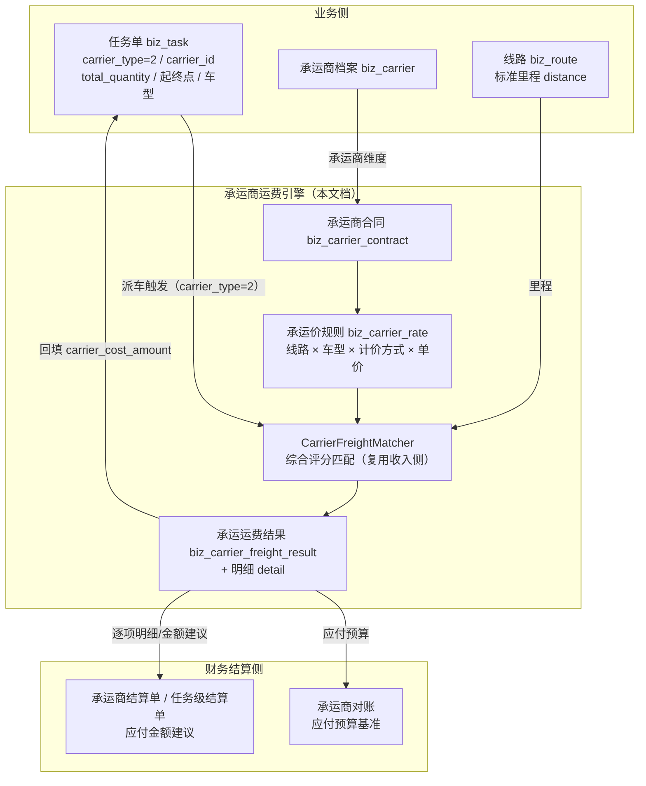
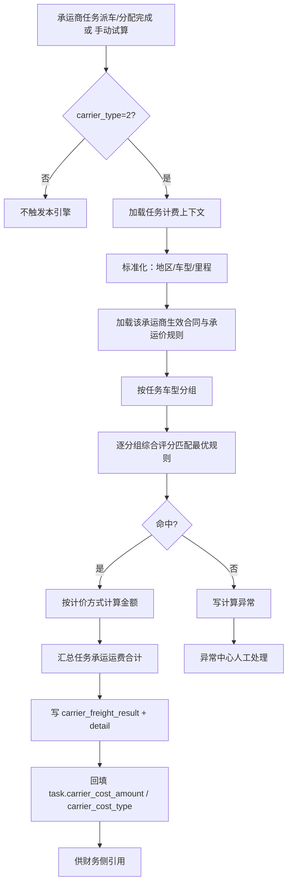

# 承运商运费自动计算系统设计文档

> 适用技术栈：MySQL + Python FastAPI（复用现有租户库多租户架构）
>
> 文档定位：产品设计 + 架构设计 + 数据模型设计 + 计算规则设计
>
> 所属阶段：阶段五/六 - 计费引擎（承运商应付侧）× 财务结算（承运商对账/结算源头）
>
> 文档状态：方案设计（待评审落地）
>
> 创建日期：2026-07-07
>
> 优先级：高（承运商外委发运即时应付运费自动化、承运商合同标准化可管理的前置能力）
>
> 关联文档：
>
> - 同目录 [01.运价合同管理](01.运价合同管理.md)（收入侧运价合同与计费入口，本引擎的参照系）
> - 同目录 [02.运单合同运费自动计算系统设计文档](02.运单合同运费自动计算系统设计文档.md)（收入侧引擎，算法层复用来源）
> - 同目录 [03.线路管理](03.线路管理.md)（标准里程 `biz_route.distance` 来源）
> - 同目录 [04.任务支出成本自动计算系统设计文档](04.任务支出成本自动计算系统设计文档.md)（司机侧费用项引擎，本引擎的边界对侧）
> - [05.合作伙伴模块/02.承运商管理](../05.合作伙伴模块/02.承运商管理.md)（承运商档案 `biz_carrier`）
> - [07.财务结算模块/03.承运商侧-对账与结算](../07.财务结算模块/03.承运商侧-对账与结算.md)（本引擎结果的主要消费方）
> - [06.运营调度模块/01.运输任务单管理](../06.运营调度模块/01.运输任务单管理.md)（任务派车触发源）

---

## 1. 文档目标

本文档设计一套与「客户收入侧运费引擎」**完全对称**的 **承运商运费自动计算系统**（下称"承运商运费引擎"）。公司把运输任务外委给承运商时，需要按事先维护好的**承运商合同**与**承运价规则**，在给承运商指派任务后**自动计算该任务应付给承运商的运费**，形成可追溯、可重算、可对账的应付金额来源。

核心定位一句话：**承运商合同 → 承运价规则 → 运费记录**，把"给承运商的运费"从"调度员人工估算/手工填写"升级为"合同规则驱动、派车即自动算清"，解决承运商运费的**标准化可管理**。

系统需要解决以下核心问题：

1. 公司维护承运商合同与承运价规则（线路 × 车型 × 计价方式 × 单价 × 生效期）；
2. 给承运商指派任务（`carrier_type=2`）后，自动匹配该承运商的合同规则并计算整单运费；
3. 支持台单价 / 单公里单价 / 整单（包车）/ 按吨公里等计价方式，覆盖商品车与大宗运输常见形态；
4. 任务关键要素（线路、台数、车型、承运商）变化后可及时重算；
5. 合同/规则修改后，受影响的未锁定任务可及时重算；
6. 计算过程可追溯、可解释、可审计（命中了哪份合同、哪条承运价规则、为何命中、如何算出金额）；
7. 计算结果与财务结算（承运商对账 / 承运商结算单 / 任务级结算单）解耦但可联动，已支付/已锁定的任务不被自动覆盖。

---

## 2. 业务背景

### 2.1 典型业务场景

公司自有运力不足时，把任务外委给合作承运商。承运商运费由双方签订的合同约定，按线路、车型、计价方式分档：

```text
承运商合同（示例）：华北物流有限公司 · 2026 年度承运协议
  北京 → 天津，轿运车（不限品牌），整单包车 1200 元/趟
  北京 → 石家庄，轿运车，按台 180 元/台
  天津 → 济南，重卡，按公里 6.5 元/公里（核定里程 320km）
  生效期：2026-01-01 ~ 2026-12-31
```

调度员给该承运商指派任务：

```text
任务：TASK-20260707-001
承运类型：承运商
承运商：华北物流有限公司
线路：北京市朝阳区 → 天津市滨海新区
装载：轿运车 8 台
```

系统应自动完成：

```text
命中合同：华北物流 2026 年度承运协议
命中规则：北京 → 天津 · 轿运车 · 整单包车 1200 元/趟
承运运费 = 1200.00
```

调度员派车时即可看到"这个任务应付承运商多少钱"，财务侧生成承运商对账/结算单时直接引用该金额，无需人工估算与手工汇总，且金额来源可追溯到具体合同规则。

### 2.2 与客户收入侧引擎的对称关系

本引擎是收入侧引擎在"承运商应付方向"的镜像。二者在概念、模型、算法上高度对称：

| 维度 | 客户收入侧（已落地） | 承运商应付侧（本文档） |
|------|---------------------|----------------------|
| 业务对象 | 运单 `biz_waybill` | 任务 `biz_task` |
| 计价主体 | 客户 `customer_id` | 承运商 `carrier_id` |
| 合同载体 | 运价合同 `biz_freight_contract` | 承运商合同 `biz_carrier_contract` |
| 计价规则 | 运价明细 `biz_freight_rate` | 承运价规则 `biz_carrier_rate` |
| 计价方式 | 台单价 / 单公里 / 整单价 | 台单价 / 单公里 / 整单（包车）/ 按吨公里 |
| 结果主表 | `biz_waybill_freight_result` | `biz_carrier_freight_result` |
| 结果明细 | `biz_waybill_freight_result_detail`（按 cargo） | `biz_carrier_freight_result_detail`（按任务车型分组） |
| 触发时机 | 运单创建/变更 | 承运商任务派车/分配完成 |
| 回填字段 | `waybill.freight_amount` / `contract_id` / `rate_id` | `task.carrier_cost_amount` / `carrier_cost_type` |
| 下游 | 客户对账 / 客户结算 / 发票 | 承运商对账 / 承运商结算 / 任务级结算单 |

> 设计上**最大化复用**收入侧引擎的算法思想与代码（多级匹配 + 综合评分 + 匹配留痕 + 区域层级向上兼容 + 车型层级匹配），把最外层"客户精确分 `CUSTOMER_SCORE`"替换为"承运商精确分 `CARRIER_SCORE`"，其余评分维度直接复用，降低理解与维护成本。

### 2.3 与「任务支出成本引擎」的边界（关键）

现有 [04.任务支出成本自动计算系统设计文档](04.任务支出成本自动计算系统设计文档.md) 落地的成本引擎（`biz_cost_policy` / `biz_cost_rule`）是**以费用项（fee_type）为中心、以公司政策（scope）为适用范围**的通用支出引擎，主场景是**自有车/社会运力司机侧的多项费用**（司机运费、洗车费、装车费、油补……）。它虽内置了 `fee_type='carrier_freight'`（承运商运费）作为费用项之一，但那是"政策 + 费用项"形态，**不是**以承运商合同为核心、可标准化管理的合同体系。

本引擎与成本引擎的分工边界明确如下：

| 承运类型 | 承运运费（整单应付承运商） | 司机侧费用项（司机运费/洗车/装车/油补…） |
|---------|--------------------------|----------------------------------------|
| `carrier_type=1` 自有车 | 不适用 | 成本引擎负责 |
| `carrier_type=2` 承运商 | **本引擎负责**（合同规则驱动） | 一般不适用；如有代垫费用另计 |
| `carrier_type=3` 社会运力 | 不适用（走社会运力司机付款） | 成本引擎负责 |

关键约定（避免双算）：

- `carrier_type=2` 的任务，其**整单承运运费**由本引擎计算并回填 `task.carrier_cost_amount`；
- 成本引擎在 `carrier_type=2` 的任务上**停用 `fee_type='carrier_freight'` 费用项**（该 fee_type 的匹配对承运商任务短路跳过），承运商任务的应付金额以本引擎结果为准；
- 二者共享 `task.carrier_cost_amount` 回填口径与 `task.is_locked` 锁定保护，不会互相覆盖（同一任务的 `carrier_type` 唯一，二选一负责回填）。

---

## 3. 与现有模块的关系



关键边界：

- **承运商运费引擎不直接生成财务单据**，只产出"任务应付承运商运费结果"；财务单据的创建/审批/支付仍由财务模块负责（弱联动、可解释）。
- **与 `task.status` 解耦**：只读任务的稳定字段（承运商、线路、台数、车型、里程），不驱动任务状态机。
- **已锁定/已进入已支付财务单据的任务不自动覆盖**：复用 `task.is_locked` 保护，与收入侧"已结算运单锁定"、成本侧"任务锁定"原则一致。

---

## 4. 系统设计原则

| 原则 | 说明 |
|------|------|
| 与收入引擎对称复用 | 复用多级匹配、综合评分、区域/车型层级、匹配留痕等成熟算法，最外层分替换为承运商精确分 |
| 合同为核心 | 承运商合同是承运价规则的归属载体，承运商维度独立管理、可标准化 |
| 合同/规则版本化 | 合同与规则修改保留历史版本/变更日志，保证历史任务运费可追溯 |
| 计算结果明细化 | 每次计算生成结果主表 + 明细行，含单价、数量、里程、金额、命中规则、匹配轨迹 |
| 匹配过程可解释 | 记录命中了哪份合同、哪条规则、为何命中、评分明细 |
| 修改影响任务化 | 任务要素变更、合同/规则变更后通过任务机制触发重算 |
| 结算之后锁定 | 已进入已支付财务单据 / 人工锁定的任务不被自动重算覆盖 |
| 异常必须显性化 | 未匹配合同、未匹配规则、缺里程、缺台数、区域无法识别、规则冲突等进入异常中心 |
| 与成本引擎解耦 | 承运商整单运费与司机侧费用项分属两个引擎，按 `carrier_type` 二选一负责 |
| 与财务弱联动 | 引擎只产出运费结果，不代替财务单据流程；下游按需引用 |
| 分期落地 | 先支持核心计价方式（台单价/单公里/整单包车），再扩展按吨公里/阶梯/比例 |

---

## 5. 核心概念与术语

| 术语 | 含义 |
|------|------|
| 承运商运费引擎 | 本文档设计的"承运商运费自动计算系统"，与客户收入侧运费引擎对称 |
| 承运商合同（Carrier Contract） | 一组承运价规则的归属载体，归属某承运商，定义生效期与状态，类比运价合同 |
| 承运价规则（Carrier Rate） | 定义"某线路某车型下承运商运费如何计价"的最小规则单元，类比运价明细 |
| 计价方式（billing_mode） | 运费金额的计算方式：台单价 / 单公里 / 整单（包车）/ 按吨公里 |
| 适用范围（scope） | 规则生效的条件集合：承运商、线路、车型、生效期 |
| 承运运费结果（Carrier Freight Result） | 一次运费计算的结果主表，含运费合计与匹配快照 |
| 运费明细（Result Detail） | 单个车型分组的计算结果行，含单价、数量、里程、金额、命中规则、匹配轨迹 |
| 承运运费计算异常 | 未匹配/缺数据/规则冲突等无法完成计算的情形，进入异常中心待人工处理 |
| 引擎版本（calc_engine_version） | 计算引擎版本号，写入结果便于回放与审计 |

---

## 6. 总体架构

### 6.1 模块划分

| 模块 | 职责 |
|------|------|
| 承运商合同模块 | 维护承运商合同（规则载体）、承运商归属、生效期、状态、版本 |
| 承运价规则模块 | 维护线路 × 车型 × 计价方式 × 单价的承运价规则，版本快照与冲突检测 |
| 任务上下文加载 | 从任务读取承运商、线路、台数、车型、里程等计费要素 |
| 标准基础数据 | 复用收入侧：标准行政区、区域/车型层级、线路里程 `biz_route` |
| 承运运费匹配引擎（CarrierFreightMatcher） | 纯算法层：综合评分匹配最优规则并计算金额，不访问 DB |
| 承运运费计算编排（CarrierFreightCalcService） | 加载数据、标准化、调用匹配器、汇总、持久化、写异常、回填任务 |
| 计算任务模块 | 异步重算、合同/规则变更批量重算、失败重试（复用收入侧任务表模式） |
| 承运运费结果模块 | 保存运费结果主表与明细，版本快照（is_active） |
| 异常中心 | 处理未匹配、缺数据、规则冲突等 |
| 财务对接适配层 | 把运费结果提供给承运商对账/结算单/任务级结算单 |

### 6.2 系统流程总览



### 6.3 计算入口（三种）

| 入口 | 触发方 | 是否落库 | 用途 |
|------|--------|---------|------|
| `preview_for_task`（试算） | 调度员编辑任务 / 前端预览 | 否 | 派车前实时预览"应付承运商多少" |
| `calculate_and_persist`（正式计算） | 派车/分配完成事件、手动重算 | 是 | 写结果明细，回填成本，供财务引用 |
| `recalculate_many`（批量重算） | 合同/规则变更、Worker 调度 | 是 | 合同/规则修改后批量重算受影响任务 |

> 入口签名与收入侧 `FreightCalcService.preview_for_waybill` / `calculate_and_persist` / `recalculate_many` 保持一致的形态，便于统一 Worker 编排与团队认知复用。

---

## 7. 计价方式设计

### 7.1 计价方式（billing_mode）

与收入侧 `biz_freight_rate.billing_mode` 对齐并扩展一位（按吨公里）：

| billing_mode | 名称 | 计价数量维度 | 计算公式 | 对齐收入侧 |
|:--:|------|-------------|---------|-----------|
| 0 | 台单价 | 台数 `total_quantity` | `unit_price × qty` | billing_mode=0 |
| 1 | 单公里单价 | 里程 `distance_km` | `unit_price × km`（可选 `× qty`） | billing_mode=1 |
| 2 | 整单价（包车） | 趟次=1 | `unit_price`（一口价，不乘台数） | billing_mode=2 |
| 3 | 按吨公里（远期） | 吨位 × 里程 | `unit_price × ton × km` | 扩展 |

> **整单包车**是承运商外委最常见形态（一趟车一口价），对应收入侧"整单价"。多车型命中同一整单价规则时，由编排层按台数加权分摊到各明细行（与收入侧整单价分摊逻辑一致）。

### 7.2 里程来源优先级

`billing_mode=1`（单公里）/ `3`（按吨公里）依赖里程，取值优先级（高→低）：

```text
1. 承运价规则自带核定里程 rate.distance_km（合同标准，最高优先）
2. 任务线路标准里程（biz_route.distance，按任务起终点 region 匹配）
3. 任务实际行驶里程（远期：GPS/回单里程，若已采集）
4. 缺失 → 该规则命中的费用进异常（DISTANCE_NOT_FOUND）
```

### 7.3 金额保底与取整

| 字段 | 说明 |
|------|------|
| `min_amount` | 最低运费：`amount = max(计算值, min_amount)`（命中后兜底，与收入侧一致） |
| `round_mode`（可选，远期） | 取整方式：不取整（默认，保留 2 位）/ 四舍五入到元 / 进一法到元 |

---

## 8. 数据模型设计

所有表位于租户独立数据库，`__table_tier__ = "business"`，遵循项目 `TenantModelBase`（含 `id / tenant_id / created_at / updated_at / is_deleted` 等基座字段）。新增表按 `sys_product_feature.required_tables` 由 runner Phase 1 自动建表，无需手写 versioned migration；改 ORM 后仍需 `autogen tenant` 刷新 snapshot（见 `database-migration.mdc`）。

### 8.1 承运商合同表：biz_carrier_contract

承运价规则的归属载体（类比 `biz_freight_contract`，主体从客户换成承运商）。

```sql
CREATE TABLE biz_carrier_contract (
    id BIGINT NOT NULL AUTO_INCREMENT COMMENT '主键ID',
    tenant_id BIGINT NOT NULL COMMENT '租户ID',

    contract_no VARCHAR(100) NOT NULL COMMENT '合同编号（租户内唯一）',
    contract_name VARCHAR(200) NOT NULL COMMENT '合同名称',
    carrier_id BIGINT NOT NULL COMMENT '承运商ID（biz_carrier.id）',
    carrier_name VARCHAR(100) DEFAULT NULL COMMENT '承运商名称（冗余快照）',
    enterprise_id BIGINT DEFAULT NULL COMMENT '所属经营主体ID（biz_business_entity.id）',

    effective_date DATE NOT NULL COMMENT '生效日期',
    expiry_date DATE NOT NULL COMMENT '到期日期',

    status SMALLINT NOT NULL DEFAULT 0 COMMENT '状态 0-草稿 1-生效 2-已终止',
    contract_version INT NOT NULL DEFAULT 1 COMMENT '合同版本号',

    remark TEXT DEFAULT NULL COMMENT '备注',
    created_by BIGINT DEFAULT NULL COMMENT '创建人',
    updated_by BIGINT DEFAULT NULL COMMENT '更新人',
    created_at DATETIME NOT NULL DEFAULT CURRENT_TIMESTAMP COMMENT '创建时间',
    updated_at DATETIME NOT NULL DEFAULT CURRENT_TIMESTAMP ON UPDATE CURRENT_TIMESTAMP COMMENT '更新时间',
    is_deleted SMALLINT NOT NULL DEFAULT 0 COMMENT '软删除 0-否 1-是',

    PRIMARY KEY (id),
    UNIQUE KEY uk_tenant_contract_no (tenant_id, contract_no),
    KEY idx_tenant_carrier (tenant_id, carrier_id),
    KEY idx_tenant_status_date (tenant_id, status, effective_date, expiry_date)
) ENGINE=InnoDB DEFAULT CHARSET=utf8mb4 COLLATE=utf8mb4_general_ci COMMENT='承运商合同表';
```

### 8.2 承运价规则表：biz_carrier_rate

定义"某线路某车型下承运商运费如何计价"（类比 `biz_freight_rate`，线路/车型字段完全对齐，便于复用匹配算法）。

```sql
CREATE TABLE biz_carrier_rate (
    id BIGINT NOT NULL AUTO_INCREMENT COMMENT '主键ID',
    tenant_id BIGINT NOT NULL COMMENT '租户ID',

    contract_id BIGINT NOT NULL COMMENT '所属承运商合同ID',
    carrier_id BIGINT NOT NULL COMMENT '承运商ID（冗余，加速筛选）',

    -- 适用范围：线路（与收入侧 biz_freight_rate 完全对齐，复用行政区层级向上兼容匹配）
    origin VARCHAR(255) DEFAULT NULL COMMENT '出发地名称',
    origin_code VARCHAR(20) DEFAULT NULL COMMENT '出发地编码',
    origin_region_id BIGINT DEFAULT NULL COMMENT '出发地行政区ID（biz_region.id），空表示不限线路',
    destination VARCHAR(255) DEFAULT NULL COMMENT '目的地名称',
    destination_code VARCHAR(20) DEFAULT NULL COMMENT '目的地编码',
    destination_region_id BIGINT DEFAULT NULL COMMENT '目的地行政区ID',
    is_bidirectional SMALLINT NOT NULL DEFAULT 0 COMMENT '线路是否双向 0-否 1-是',

    -- 适用范围：车型（复用收入侧品牌/车系层级）
    vehicle_brand VARCHAR(100) DEFAULT NULL COMMENT '车辆品牌（名称冗余）',
    vehicle_model VARCHAR(100) DEFAULT NULL COMMENT '车型（名称冗余）',
    brand_id INT DEFAULT NULL COMMENT '标准品牌ID，空表示不限品牌',
    series_id INT DEFAULT NULL COMMENT '标准车系ID，空表示不限车型',
    match_type VARCHAR(16) NOT NULL DEFAULT 'series' COMMENT '车型匹配类型 series/brand/general',

    -- 计价
    billing_mode SMALLINT NOT NULL DEFAULT 0 COMMENT '计价模式 0-台单价 1-单公里单价 2-整单(包车) 3-按吨公里',
    multiply_by_qty SMALLINT NOT NULL DEFAULT 0 COMMENT '单公里/按吨公里是否再乘台数 0-否 1-是',
    distance_km DECIMAL(10,2) DEFAULT NULL COMMENT '核定里程（单公里/吨公里时优先于线路里程）',
    unit_price DECIMAL(12,2) NOT NULL COMMENT '单价（含义随 billing_mode 变化）',
    min_amount DECIMAL(12,2) DEFAULT NULL COMMENT '最低运费（命中后兜底）',

    price_type SMALLINT NOT NULL DEFAULT 0 COMMENT '价格类型 0-明确运价 1-预估运价',
    priority INT NOT NULL DEFAULT 0 COMMENT '人工优先级（越大越优先）',

    effective_date DATE DEFAULT NULL COMMENT '规则生效日期（空则继承合同）',
    expiry_date DATE DEFAULT NULL COMMENT '规则失效日期（空则继承合同）',
    status SMALLINT NOT NULL DEFAULT 1 COMMENT '状态 0-停用 1-启用',
    rule_version INT NOT NULL DEFAULT 1 COMMENT '规则版本号（每次更新+1，旧版本快照在 biz_carrier_rate_change_log）',
    remark VARCHAR(255) DEFAULT NULL COMMENT '备注',

    created_by BIGINT DEFAULT NULL COMMENT '创建人',
    updated_by BIGINT DEFAULT NULL COMMENT '更新人',
    created_at DATETIME NOT NULL DEFAULT CURRENT_TIMESTAMP COMMENT '创建时间',
    updated_at DATETIME NOT NULL DEFAULT CURRENT_TIMESTAMP ON UPDATE CURRENT_TIMESTAMP COMMENT '更新时间',
    is_deleted SMALLINT NOT NULL DEFAULT 0 COMMENT '软删除 0-否 1-是',

    PRIMARY KEY (id),
    KEY idx_carrier_rate_contract (contract_id),
    KEY idx_carrier_rate_match (tenant_id, carrier_id, origin_code, destination_code, status, is_deleted),
    KEY idx_carrier_rate_match_region (tenant_id, carrier_id, origin_region_id, destination_region_id, status, is_deleted),
    KEY idx_carrier_rate_series (tenant_id, series_id),
    KEY idx_carrier_rate_brand (tenant_id, brand_id)
) ENGINE=InnoDB DEFAULT CHARSET=utf8mb4 COLLATE=utf8mb4_general_ci COMMENT='承运价规则表';
```

> 线路 / 车型字段与收入侧 `biz_freight_rate` **完全对齐**（`origin_region_id` / `destination_region_id` / `brand_id` / `series_id` / `match_type` / `is_bidirectional`），可**直接复用 `FreightMatcher` 的区域链路展开、`_direction_for`、`_model_match_type` 与 `LINE_SCORE` / `MODEL_SCORE`**（见 §9）。

### 8.3 承运运费结果主表：biz_carrier_freight_result

一次计算的结果快照（类比 `biz_waybill_freight_result`，粒度从运单换成任务）。

```sql
CREATE TABLE biz_carrier_freight_result (
    id BIGINT NOT NULL AUTO_INCREMENT COMMENT '主键ID',
    tenant_id BIGINT NOT NULL COMMENT '租户ID',

    task_id BIGINT NOT NULL COMMENT '任务ID',
    task_version INT NOT NULL DEFAULT 1 COMMENT '任务版本号（要素变更+1，用于识别过期结果）',
    is_active SMALLINT NOT NULL DEFAULT 1 COMMENT '是否当前有效结果 0-否 1-是',

    carrier_id BIGINT DEFAULT NULL COMMENT '承运商ID快照',
    carrier_name VARCHAR(100) DEFAULT NULL COMMENT '承运商名称快照',

    total_amount DECIMAL(14,2) NOT NULL DEFAULT 0.00 COMMENT '承运运费合计',

    calc_status VARCHAR(32) NOT NULL COMMENT '计算状态 success/partial/exception/locked',
    calc_engine_version VARCHAR(32) DEFAULT NULL COMMENT '承运运费引擎版本',
    calc_time DATETIME NOT NULL COMMENT '计算时间',
    triggered_by VARCHAR(64) DEFAULT NULL COMMENT '触发来源 dispatch/manual_recalc/contract_changed/rate_changed/task_changed',
    triggered_user_id BIGINT DEFAULT NULL COMMENT '触发人',
    error_message VARCHAR(500) DEFAULT NULL COMMENT '异常摘要',

    created_at DATETIME NOT NULL DEFAULT CURRENT_TIMESTAMP COMMENT '创建时间',
    updated_at DATETIME NOT NULL DEFAULT CURRENT_TIMESTAMP ON UPDATE CURRENT_TIMESTAMP COMMENT '更新时间',
    is_deleted SMALLINT NOT NULL DEFAULT 0 COMMENT '软删除 0-否 1-是',

    PRIMARY KEY (id),
    KEY idx_cfr_task (task_id),
    KEY idx_cfr_task_active (tenant_id, task_id, is_active),
    KEY idx_cfr_calc_time (tenant_id, calc_time),
    KEY idx_cfr_calc_status (tenant_id, calc_status)
) ENGINE=InnoDB DEFAULT CHARSET=utf8mb4 COLLATE=utf8mb4_general_ci COMMENT='承运运费计算结果主表';
```

### 8.4 承运运费结果明细表：biz_carrier_freight_result_detail

按任务下的车型分组一行（单车型任务通常一行；多车型分别命中不同规则时多行）。

```sql
CREATE TABLE biz_carrier_freight_result_detail (
    id BIGINT NOT NULL AUTO_INCREMENT COMMENT '主键ID',
    tenant_id BIGINT NOT NULL COMMENT '租户ID',

    result_id BIGINT NOT NULL COMMENT '结果主表ID',
    task_id BIGINT NOT NULL COMMENT '任务ID',

    brand_id INT DEFAULT NULL COMMENT '车型分组品牌ID快照',
    series_id INT DEFAULT NULL COMMENT '车型分组车系ID快照',
    quantity DECIMAL(12,2) DEFAULT NULL COMMENT '本分组计价数量（台/公里/吨公里）',
    distance_km DECIMAL(10,2) DEFAULT NULL COMMENT '本次采用的里程',
    billing_mode SMALLINT DEFAULT NULL COMMENT '命中计价模式',
    unit_price DECIMAL(12,2) DEFAULT NULL COMMENT '命中单价',
    amount DECIMAL(14,2) NOT NULL DEFAULT 0.00 COMMENT '本分组金额',

    matched_contract_id BIGINT DEFAULT NULL COMMENT '命中承运商合同ID',
    matched_rate_id BIGINT DEFAULT NULL COMMENT '命中承运价规则ID',
    matched_rate_version INT DEFAULT NULL COMMENT '命中规则版本',
    match_score INT DEFAULT NULL COMMENT '匹配得分',
    match_trace_json JSON DEFAULT NULL COMMENT '匹配过程JSON',

    calc_status VARCHAR(32) NOT NULL COMMENT '计算状态 success/exception',
    error_type VARCHAR(64) DEFAULT NULL COMMENT '异常类型',
    error_message VARCHAR(500) DEFAULT NULL COMMENT '异常信息',

    created_at DATETIME NOT NULL DEFAULT CURRENT_TIMESTAMP COMMENT '创建时间',

    PRIMARY KEY (id),
    KEY idx_cfrd_result (result_id),
    KEY idx_cfrd_task (task_id),
    KEY idx_cfrd_matched_rate (matched_rate_id)
) ENGINE=InnoDB DEFAULT CHARSET=utf8mb4 COLLATE=utf8mb4_general_ci COMMENT='承运运费结果明细表';
```

### 8.5 承运运费计算异常表：biz_carrier_freight_calc_exception

```sql
CREATE TABLE biz_carrier_freight_calc_exception (
    id BIGINT NOT NULL AUTO_INCREMENT COMMENT '主键ID',
    tenant_id BIGINT NOT NULL COMMENT '租户ID',

    task_id BIGINT NOT NULL COMMENT '任务ID',
    carrier_id BIGINT DEFAULT NULL COMMENT '承运商ID',

    exception_type VARCHAR(64) NOT NULL COMMENT '异常类型',
    exception_message VARCHAR(1000) NOT NULL COMMENT '异常描述',
    context_json JSON DEFAULT NULL COMMENT '上下文JSON（触发来源/匹配轨迹）',

    status VARCHAR(32) NOT NULL DEFAULT 'pending' COMMENT '处理状态 pending/processed/ignored',
    processed_by BIGINT DEFAULT NULL COMMENT '处理人',
    processed_at DATETIME DEFAULT NULL COMMENT '处理时间',

    created_at DATETIME NOT NULL DEFAULT CURRENT_TIMESTAMP COMMENT '创建时间',

    PRIMARY KEY (id),
    KEY idx_cfce_tenant_status (tenant_id, status),
    KEY idx_cfce_task (task_id),
    KEY idx_cfce_type (tenant_id, exception_type)
) ENGINE=InnoDB DEFAULT CHARSET=utf8mb4 COLLATE=utf8mb4_general_ci COMMENT='承运运费计算异常表';
```

### 8.6 计算任务表：biz_carrier_freight_calc_task

结构对齐收入侧 `biz_freight_calc_task`，隔离承运商引擎的任务队列。

```sql
CREATE TABLE biz_carrier_freight_calc_task (
    id BIGINT NOT NULL AUTO_INCREMENT COMMENT '主键ID',
    tenant_id BIGINT NOT NULL COMMENT '租户ID',

    task_type VARCHAR(64) NOT NULL COMMENT '任务类型 task_dispatched/task_changed/contract_changed/rate_changed/manual_recalc',
    target_type VARCHAR(32) NOT NULL COMMENT '目标类型 task/contract/rate',
    target_id BIGINT NOT NULL COMMENT '目标ID',
    biz_task_id BIGINT DEFAULT NULL COMMENT '冗余业务任务ID（合同/规则触发时由展开阶段写入）',

    status VARCHAR(32) NOT NULL DEFAULT 'pending' COMMENT '状态 pending/running/success/failed',
    priority INT NOT NULL DEFAULT 0 COMMENT '优先级（越大越优先）',
    retry_count INT NOT NULL DEFAULT 0 COMMENT '已重试次数',
    max_retry_count INT NOT NULL DEFAULT 3 COMMENT '最大重试次数',
    error_message VARCHAR(1000) DEFAULT NULL COMMENT '最近一次错误信息',
    triggered_by_user_id BIGINT DEFAULT NULL COMMENT '触发用户ID',
    started_at DATETIME DEFAULT NULL COMMENT '开始时间',
    finished_at DATETIME DEFAULT NULL COMMENT '完成时间',

    created_at DATETIME NOT NULL DEFAULT CURRENT_TIMESTAMP COMMENT '创建时间',
    updated_at DATETIME NOT NULL DEFAULT CURRENT_TIMESTAMP ON UPDATE CURRENT_TIMESTAMP COMMENT '更新时间',
    is_deleted SMALLINT NOT NULL DEFAULT 0 COMMENT '软删除 0-否 1-是',

    PRIMARY KEY (id),
    KEY idx_cfct_status_priority (status, priority, created_at),
    KEY idx_cfct_target (target_type, target_id),
    KEY idx_cfct_biz_task (biz_task_id)
) ENGINE=InnoDB DEFAULT CHARSET=utf8mb4 COLLATE=utf8mb4_general_ci COMMENT='承运运费计算任务表';
```

### 8.7 承运价规则版本快照表：biz_carrier_rate_change_log

结构对齐收入侧 `biz_freight_rate_change_log`，每次规则更新写全量 JSON 快照，保证历史任务运费可追溯。

```sql
CREATE TABLE biz_carrier_rate_change_log (
    id BIGINT NOT NULL AUTO_INCREMENT COMMENT '主键ID',
    tenant_id BIGINT NOT NULL COMMENT '租户ID',
    rate_id BIGINT NOT NULL COMMENT '承运价规则ID',
    contract_id BIGINT NOT NULL COMMENT '所属合同ID',
    rule_version INT NOT NULL COMMENT '版本号',
    change_type VARCHAR(32) NOT NULL COMMENT '变更类型 create/update/disable/enable/delete',
    snapshot_json JSON NOT NULL COMMENT '规则全量快照',
    changed_by BIGINT DEFAULT NULL COMMENT '变更人',
    created_at DATETIME NOT NULL DEFAULT CURRENT_TIMESTAMP COMMENT '创建时间',
    PRIMARY KEY (id),
    KEY idx_crcl_rate (tenant_id, rate_id),
    KEY idx_crcl_contract (tenant_id, contract_id)
) ENGINE=InnoDB DEFAULT CHARSET=utf8mb4 COLLATE=utf8mb4_general_ci COMMENT='承运价规则版本快照表';
```

### 8.8 任务侧字段复用与回填

| 字段 | 表 | 状态 | 用途 |
|------|-----|------|------|
| `carrier_id` / `carrier_type` / `carrier_name` | `biz_task` | 已有 | 承运商主体与承运类型（`carrier_type=2` 触发本引擎） |
| `origin_region_id` / `destination_region_id` / `total_quantity` | `biz_task` | 已有 | 线路与台数计费上下文（只读） |
| `planned_load_time` | `biz_task` | 已有 | 计费日期（影响合同/规则生效期匹配） |
| `carrier_cost_amount` | `biz_task` | 已有 | 本引擎回填承运运费合计 |
| `carrier_cost_type` | `biz_task` | 已有 | 回填主计价类型映射（1-包车 2-按台 3-按吨公里 4-其他） |
| `is_locked` / `locked_at` / `locked_by_doc_id` | `biz_task` | 已有 | 锁定保护，已支付/锁定任务不覆盖 |

> `carrier_cost_amount` / `carrier_cost_type` 与成本引擎共享同一回填口径。因同一任务 `carrier_type` 唯一（承运商任务走本引擎、自有/社会运力走成本引擎），二者不会同时回填、互不覆盖。可选增强字段 `carrier_freight_calc_status` / `last_carrier_freight_result_id` 用于列表筛选，若新增需按 `database-migration.mdc` 走 `autogen tenant`；不加时计算状态可通过 `biz_carrier_freight_result.is_active` 反查。

---

## 9. 匹配与计算算法

### 9.1 计费上下文（CarrierFreightContext）

从任务读取计费要素（只读）：

```text
tenant_id
task_id / task_version
carrier_id              承运商ID（必需，缺失进异常）
origin_region_id        起点行政区
destination_region_id   终点行政区
total_quantity          总台数
车型集合                任务下挂接运单明细（task_waybill_item → waybill_cargo）的车型 (brand_id/series_id)
distance_km             里程（按 §7.2 优先级解析）
transport_date          发运/计费日期（planned_load_time 或当天）
```

> **多车型处理**：任务可能装载多种车型。承运商运费默认按"整单包车 / 不限车型按总台数"一次算清；若不同车型对应不同承运价规则，则按车型分组分别匹配并累加，各生成一条明细行。

### 9.2 候选规则筛选

一条 `biz_carrier_rate` 进入候选，需同时满足：

```text
1. rate.status = 1 且 rate.is_deleted = 0
2. rate.carrier_id == task.carrier_id（承运商精确匹配）
3. 所属 contract.status = 1（生效）且在生效期内
4. rate 生效期覆盖 transport_date（空则继承 contract 生效期）
5. 线路维度：rate 未限线路（region 均空）→ 通用命中；
   否则按收入侧行政区层级向上兼容匹配（含双向 is_bidirectional）
6. 车型维度：rate 未限车型 → 通用命中；否则按 brand/series 层级匹配
```

### 9.3 综合评分（复用收入侧 + 承运商特化）

对候选规则打分，最高分唯一即命中；同分进冲突。直接复用 `freight_matcher` 的评分权重与展开逻辑，仅最外层主键分不同：

```text
总分 = 承运商精确分(CARRIER_SCORE) + 线路分(line) + 车型分(model)
      + 方向分(direction) + 价格类型分(price_type) + 版本分 + 规则优先级
```

| 维度 | 分值 | 复用来源 |
|------|-----:|---------|
| 承运商精确匹配 CARRIER_SCORE | 100000 | 对应收入侧 `CUSTOMER_SCORE` |
| 线路：区-区 / 区-市 / 市-市 / 省-省 等 | 8000~30000 | 直接复用 `LINE_SCORE` |
| 线路：不限线路（通用） | 5000 | 复用（默认兜底分） |
| 车型：车系 / 品牌 / 通用 | 3000 / 2000 / 1000 | 直接复用 `MODEL_SCORE` |
| 方向：正向 / 反向 | 500 / 300 | 直接复用 `DIR_SCORE` |
| 价格类型：明确 / 预估 | 200 / 0 | 直接复用 `PRICE_TYPE_SCORE` |
| 版本分 | rule_version × 1 | 直接复用 `VERSION_BONUS_PER` |
| 规则优先级 | rate.priority | 直接复用 |

> 线路分、车型分、方向判定、区域链路展开**直接复用** `freight_matcher.LINE_SCORE` / `MODEL_SCORE` / `DIR_SCORE` / `_direction_for` / `_model_match_type` / `_origin_candidate_region_ids` / `_destination_candidate_region_ids`，仅把 `CUSTOMER_SCORE` 替换为 `CARRIER_SCORE`，`FreightRate` 类型替换为 `CarrierRate`（字段同名，鸭子类型可直接套用）。

### 9.4 金额计算

命中规则后按 `billing_mode` 计算（对齐 §7.1）：

```text
billing_mode=0 台单价 : amount = unit_price × qty
billing_mode=1 单公里 : amount = unit_price × km × (qty if multiply_by_qty else 1)
billing_mode=2 整单包车: amount = unit_price（多车型分组命中同一整单价规则时按 qty 加权分摊）
billing_mode=3 吨公里 : amount = unit_price × ton × km
```

再应用保底/取整：

```text
amount = max(amount, min_amount)      # min_amount 命中后兜底
amount = round(amount, round_mode)    # 远期
```

### 9.5 任务运费汇总

```text
承运运费合计 = Σ 各车型分组明细 amount
```

写入 `biz_carrier_freight_result`，逐分组写 `biz_carrier_freight_result_detail`。

### 9.6 匹配留痕（match_trace_json）

每条明细记录匹配轨迹，示例：

```json
{
  "engine": "carrier-v1.0.0",
  "carrier_id": 21,
  "transport_date": "2026-07-07",
  "origin_chain": [110105, 110100, 110000],
  "destination_chain": [120116, 120100, 120000],
  "matched_origin": 110100,
  "matched_destination": 120100,
  "model_match_type": "general",
  "direction_match": "forward",
  "billing_mode": 2,
  "distance_source": "rate",
  "distance_km": null,
  "unit_price": 1200.0,
  "quantity": 8,
  "amount": 1200.00,
  "score": 121200,
  "top_candidates": [
    { "rate_id": 12, "contract_id": 5, "score": 121200 },
    { "rate_id": 8, "contract_id": 5, "score": 106200 }
  ]
}
```

### 9.7 异常类型

| 异常类型 | 说明 |
|----------|------|
| `CARRIER_MISSING` | 任务无承运商（carrier_id 为空） |
| `CONTRACT_NOT_FOUND` | 该承运商无任何生效合同 |
| `RATE_NOT_FOUND` | 未匹配到有效承运价规则 |
| `RATE_CONFLICT` | 匹配到多条同优先级规则 |
| `AREA_NOT_RECOGNIZED` | 起点/终点无法标准化 |
| `DISTANCE_NOT_FOUND` | 单公里/吨公里缺里程 |
| `INVALID_QTY` | 台数为空或 ≤ 0（台单价时） |
| `TASK_LOCKED` | 任务已锁定，跳过自动重算 |

---

## 10. 触发与重算机制

### 10.1 触发时机

| 触发来源 | triggered_by | 说明 |
|----------|-------------|------|
| 承运商分配/派车完成 | `dispatch` | `carrier_type=2` 且承运分配完成/派车完成时自动计算 |
| 任务要素变更 | `task_changed` | 承运商/线路/台数/车型变化，任务版本+1 后重算 |
| 合同变更 | `contract_changed` | 合同激活/终止/编辑，识别受影响任务批量重算 |
| 规则变更 | `rate_changed` | 承运价规则新增/修改/停用，批量重算 |
| 手动重算 | `manual_recalc` | 调度员/财务在任务详情点"重算承运运费" |
| 试算 | `preview` | 编辑态实时预览，不落库 |

### 10.2 触发接入点（task_service）

复用成本引擎的接入模式，在派车链新增独立入队方法（SAVEPOINT 包裹，表缺失/未开功能不污染派车主事务）：

```text
async def _try_enqueue_carrier_freight_calc(db, task_id, task_type="task_dispatched"):
    # 仅当 task.carrier_type == 2（承运商）时入队
    await CarrierFreightCalcTaskService.enqueue_task_recalc(db, task_id, priority=3)

触发点（与成本引擎并列，按 carrier_type 分流）：
  1) complete_carrier_assignment → status 变为 已派车
  2) assign_carrier → 待派车→已派车
  3) create_task 若初始即已派车
```

> 分流原则：`carrier_type=2` → 入队承运商运费引擎（本引擎），跳过成本引擎的 `carrier_freight` 费用项；`carrier_type=1/3` → 入队成本引擎（司机侧费用项），如既有逻辑。

### 10.3 任务要素敏感字段

以下字段变化触发承运运费重算（任务版本+1）：

```text
carrier_type / carrier_id（承运商）
origin_region_id / destination_region_id（线路）
total_quantity（台数）
挂接运单明细的车型集合（车型）
planned_load_time（计费日期，影响合同/规则生效期匹配）
```

### 10.4 合同/规则变更影响任务识别

合同/规则修改后，识别受影响任务（粗匹配，重算时再精细评分）：

```text
- 合同/规则所属 carrier_id 命中的未锁定任务（carrier_type=2 且 carrier_id 相同）
- 规则线路命中（origin/destination_region_id 与任务起终点交集，含双向）
- 任务发运日期落在合同/规则生效期内
- 任务未锁定（task.is_locked = 0）
```

处理流程与收入侧一致：生成规则变更日志 → 识别受影响任务 → 批量生成重算任务 → Worker 重算 → 更新结果（旧 result 置 is_active=0，写新 result）。

### 10.5 锁定与已结算保护

| 任务状态 | 是否自动重算 | 处理方式 |
|----------|-------------|---------|
| 待派车/已派车（未锁定） | 是 | 自动重算 |
| 已装车/在途/已到达（未锁定） | 是 | 自动重算 |
| 已进入已支付财务单据（`task.is_locked=1`） | 否 | 写 `TASK_LOCKED` 异常 + 差异提醒，不覆盖 |
| 已挂承运商对账/结算单已支付 | 否 | 生成差异提醒 |
| 已取消 | 否 | 不计算 |

> 复用 `task.is_locked`（承运商结算单/最终结算单支付后置 1）。锁定后重算只写异常 `TASK_LOCKED` + 差异提醒，绝不覆盖历史运费，保证已支付金额可追溯（快照原则）。

---

## 11. 与财务结算模块的对接

承运商运费引擎是财务**承运商应付侧**的金额源头，但不代替财务单据流程。

### 11.1 承运商对账（[07.财务结算/03.承运商侧-对账与结算](../07.财务结算模块/03.承运商侧-对账与结算.md)）

```text
- 跨任务批量对账时，逐任务读取 biz_carrier_freight_result（is_active=1）total_amount
- 作为该承运商应付运费的预算基准，与承运商实际报价/结算核对
- 与承运商结算单差额记录，供审计
```

### 11.2 任务级结算单 / 承运商结算单

```text
- doc.actual_amount 默认 = biz_carrier_freight_result.total_amount
- 逐项明细来自 biz_carrier_freight_result_detail（按车型分组）
- 财务可人工调整；调整后与引擎值差异记录，供审计
```

> 呼应财务模块"创建结算单时若 `actual_amount ≠ task.carrier_cost_amount` 触发警示"——本引擎正是承运商任务 `carrier_cost_amount` 的自动来源。

### 11.3 回填任务字段

```text
task.carrier_cost_amount = biz_carrier_freight_result.total_amount
task.carrier_cost_type   = 主计价方式映射（0台单价→2按台 / 1单公里→4其他 / 2整单→1包车 / 3吨公里→3）
```

回填受 `task.is_locked` 保护：锁定任务不回填。

### 11.4 边界总结

| 承运商运费引擎负责 | 财务模块负责 |
|-------------------|-------------|
| 按合同规则算出"应付承运商多少、如何算出" | 单据创建、审批、支付、锁定、审计事件 |
| 产出可追溯的运费结果 | 引用运费结果作为金额建议，允许人工调整 |
| 合同/规则变更后重算未锁定任务运费 | 已支付单据不受重算影响（快照原则） |

---

## 12. API 接口设计

所有接口前缀 `/api/client`，需 JWT 认证，`require_feature("billing_carrier_freight")` 门控。

### 12.1 承运商合同

| 方法 | 路径 | 说明 |
|------|------|------|
| GET | `/billing/carrier-contract` | 分页查询承运商合同 |
| GET | `/billing/carrier-contract/{id}` | 合同详情（含承运价规则列表） |
| POST | `/billing/carrier-contract` | 创建合同 |
| PUT | `/billing/carrier-contract/{id}` | 更新合同 |
| PUT | `/billing/carrier-contract/{id}/activate` | 激活（草稿→生效） |
| PUT | `/billing/carrier-contract/{id}/terminate` | 终止合同 |
| DELETE | `/billing/carrier-contract/{id}` | 软删除（仅草稿可删） |

### 12.2 承运价规则

| 方法 | 路径 | 说明 |
|------|------|------|
| GET | `/billing/carrier-contract/{contract_id}/rate` | 查询合同下承运价规则 |
| POST | `/billing/carrier-contract/{contract_id}/rate` | 新增承运价规则 |
| PUT | `/billing/carrier-rate/{id}` | 更新承运价规则 |
| DELETE | `/billing/carrier-rate/{id}` | 删除承运价规则 |
| POST | `/billing/carrier-rate/{id}/check-conflict` | 规则冲突检测 |
| POST | `/billing/carrier-rate/{id}/recalculate-affected` | 重算受影响任务 |

### 12.3 承运运费计算

| 方法 | 路径 | 说明 |
|------|------|------|
| POST | `/billing/carrier-freight/preview` | 试算承运运费（不落库，派车前预览） |
| POST | `/billing/task/{id}/carrier-freight/recalculate` | 手动重算任务承运运费 |
| GET | `/billing/task/{id}/carrier-freight-result` | 查询任务承运运费结果（含明细） |
| GET | `/billing/carrier-freight-calc/exceptions` | 查询计算异常 |
| POST | `/billing/carrier-freight-calc/exceptions/{id}/resolve` | 处理异常 |

**试算请求体示例**：

```json
{
  "carrierId": 21,
  "originRegionId": 110105,
  "destinationRegionId": 120116,
  "totalQuantity": 8,
  "vehicles": [{ "brandId": null, "seriesId": null, "quantity": 8 }],
  "distanceKm": null,
  "transportDate": "2026-07-07"
}
```

**试算响应示例**：

```json
{
  "code": 0,
  "data": {
    "totalAmount": 1200.00,
    "calcStatus": "success",
    "details": [
      {
        "brandId": null, "seriesId": null,
        "billingMode": 2, "unitPrice": 1200.0, "quantity": 8,
        "amount": 1200.00,
        "matchedContractId": 5, "matchedRateId": 12, "matchScore": 121200
      }
    ]
  }
}
```

---

## 13. 后端代码蓝图

### 13.1 目录结构（复用收入侧 billing 目录）

```text
backend/app/modules/client/
├── models/billing/
│   ├── carrier_contract.py               # 新增 CarrierContract
│   ├── carrier_rate.py                   # 新增 CarrierRate
│   ├── carrier_freight_result.py         # 新增 CarrierFreightResult + Detail
│   ├── carrier_freight_calc_task.py      # 新增 CarrierFreightCalcTask
│   ├── carrier_freight_calc_exception.py # 新增 CarrierFreightCalcException
│   └── carrier_rate_change_log.py        # 新增 CarrierRateChangeLog
├── services/billing/
│   ├── carrier_contract_service.py       # 合同 CRUD + 状态流转 + 变更触发重算
│   ├── carrier_rate_service.py           # 承运价规则 CRUD + 版本+1 + 变更日志
│   ├── carrier_freight_matcher.py        # 纯算法：综合评分匹配（复用 freight_matcher 静态方法）
│   ├── carrier_freight_calc_service.py   # 编排：加载/试算/落库/重算/受影响识别/回填
│   ├── carrier_freight_calc_task_service.py  # 异步任务入队/认领
│   ├── carrier_freight_result_service.py # 结果查询
│   ├── carrier_freight_exception_service.py  # 异常处理
│   └── carrier_rate_conflict_service.py  # 承运价冲突检测
├── schemas/billing/
│   ├── carrier_contract.py
│   ├── carrier_rate.py
│   └── carrier_freight.py
├── api/billing/
│   ├── carrier_contract.py               # /billing/carrier-contract
│   ├── carrier_rate.py                   # /billing/carrier-rate
│   ├── carrier_freight.py                # 试算/重算/结果
│   └── carrier_freight_engine.py         # tasks/exceptions
└── workers/
    └── carrier_freight_calc_worker.py    # 合同/规则变更批量重算（入口 app/workers/carrier_freight_calc_main.py）
```

### 13.2 核心服务职责

| 服务 | 职责 | 复用点 |
|------|------|--------|
| `CarrierContractService` | 合同维护、生效期状态流转、变更触发重算 | 参照 `FreightContractService` |
| `CarrierRateService` | 承运价规则 CRUD、版本+1、变更日志 | 参照 `FreightRateService` |
| `CarrierFreightMatcher` | 综合评分匹配、金额计算、留痕（纯算法不碰 DB） | 复用 `freight_matcher` 的 `LINE_SCORE`/`MODEL_SCORE`/`DIR_SCORE`/区域链路/`_direction_for`/`_model_match_type` |
| `CarrierFreightCalcService` | 加载任务上下文、标准化、匹配、汇总、落库、写异常、回填任务、受影响识别、批量重算 | 参照 `FreightCalcService`（`preview_for_task`/`calculate_and_persist`/`recalculate_many`） |
| `CarrierFreightCalcTaskService` | 异步任务入队/认领 | 参照 `FreightCalcTaskService` |
| `CarrierRateConflictService` | 承运价规则冲突检测 | 参照 `freight_rule_conflict_service` |

### 13.3 与收入侧引擎的复用矩阵

| 能力 | 收入侧现成实现 | 承运商侧做法 |
|------|---------------|-------------|
| 区域标准化 / 层级链路 | `StandardizeService.resolve_region` | 直接复用 |
| 车型标准化 / 层级 | `StandardizeService.resolve_vehicle` | 直接复用 |
| 线路评分 / 车型评分 | `LINE_SCORE` / `MODEL_SCORE` | 直接复用 |
| 方向判定 / 双向 | `_direction_for` | 直接复用 |
| 明确/预估价 | `PRICE_TYPE_SCORE` | 直接复用 |
| 综合评分主键分 | `CUSTOMER_SCORE`（客户） | 替换为 `CARRIER_SCORE`（承运商） |
| 单条匹配 → 单结果 | `match_one_cargo`（按 cargo） | `match_one_group`（按任务车型分组） |
| 金额计算 | `_calc_amount`（3 种 billing_mode） | 扩展 `billing_mode=3` 按吨公里 |
| 里程来源 | `rate.distance_km` | 扩展"规则里程 > 线路里程 > 实际里程"优先级 |
| 异步任务/异常/版本快照 | `freight_calc_task`/`_exception`/`rate_change_log` | 同构新表 |

### 13.4 路由注册（api/__init__.py）

参照现有 billing 路由注册方式，追加：

```python
from app.modules.client.api.billing.carrier_contract import router as carrier_contract_router
from app.modules.client.api.billing.carrier_rate import router as carrier_rate_router
from app.modules.client.api.billing.carrier_freight import router as carrier_freight_router
from app.modules.client.api.billing.carrier_freight_engine import (
    task_router as carrier_freight_task_router,
    exception_router as carrier_freight_exception_router,
)

router.include_router(carrier_contract_router, prefix="/billing/carrier-contract",
                      tags=["客户端-承运商合同"],
                      dependencies=[Depends(require_feature("billing_carrier_freight"))])
router.include_router(carrier_rate_router, prefix="/billing/carrier-rate",
                      tags=["客户端-承运价规则"],
                      dependencies=[Depends(require_feature("billing_carrier_freight"))])
router.include_router(carrier_freight_router, prefix="/billing",
                      tags=["客户端-承运运费计算"],
                      dependencies=[Depends(require_feature("billing_carrier_freight"))])
router.include_router(carrier_freight_task_router, prefix="/billing/carrier-freight-calc/tasks",
                      tags=["客户端-承运运费引擎-任务"],
                      dependencies=[Depends(require_feature("billing_carrier_freight"))])
router.include_router(carrier_freight_exception_router, prefix="/billing/carrier-freight-calc/exceptions",
                      tags=["客户端-承运运费引擎-异常"],
                      dependencies=[Depends(require_feature("billing_carrier_freight"))])
```

---

## 14. 前端页面设计

### 14.1 菜单层级

```text
计费管理
├── 运价合同        /billing/contract          （已有，客户收入侧）
├── 线路管理        /billing/route             （已有）
├── 成本政策        /billing/cost-policy       （已有，司机侧支出）
└── 承运商合同      /billing/carrier-contract  （新增，承运商应付侧）
```

### 14.2 承运商合同列表页

- 路由 `/billing/carrier-contract`，组件 `views/billing/carrier-contract/index.vue`（对齐 `views/billing/contract/`）
- 工具栏：关键字搜索、承运商筛选、状态筛选、新增合同
- 列：合同编号、合同名称、承运商、生效/到期日期、规则条数、状态、操作
- 子组件：
  - `carrier-contract-edit.vue`：合同新增/编辑弹窗（承运商选择器来自 `biz_carrier`）
  - `carrier-contract-detail.vue`：合同详情（内嵌承运价规则管理）
  - `carrier-rate-edit.vue`：承运价规则编辑弹窗

### 14.3 承运价规则编辑表单（carrier-rate-edit.vue）

| 字段 | 组件 | 数据来源 | 说明 |
|------|------|---------|------|
| 出发地/目的地 | `el-cascader` | `getRegionNavTree` | 选填，空=不限线路 |
| 是否双向 | `el-switch` | — | 双向线路 |
| 品牌/车型 | `el-select` | 品牌车系 API | 选填，空=不限车型 |
| 计价方式 | `el-radio-group` | 枚举 | 台单价/单公里/整单包车/按吨公里 |
| 是否乘台数 | `el-switch` | — | 仅单公里/按吨公里显示 |
| 核定里程 | `el-input-number` | 用户输入 | 单公里时可填，覆盖线路里程 |
| 单价 | `el-input-number` | 用户输入 | 标签随计价方式变化 |
| 最低运费 | `el-input-number` | 用户输入 | 选填，命中兜底 |
| 价格类型 | `el-radio-group` | 枚举 | 明确/预估 |
| 生效/到期日期 | `el-date-picker` | 用户输入 | 选填，空则继承合同 |

### 14.4 任务详情"承运运费"区块

在任务详情页（`carrier_type=2` 时展示）新增"承运运费"卡片：

```text
承运运费合计：¥1,200.00      计算状态：已计算    [重算承运运费]
┌─────────────────────────────────────────────────────┐
│ 车型     计价方式   单价     数量   金额      命中规则   │
│ 轿运车   整单包车   1200.0   1趟    1200.00   #12      │
└─────────────────────────────────────────────────────┘
点击"命中规则"可查看匹配轨迹（match_trace）
```

派车/编辑任务时调用 `/billing/carrier-freight/preview` 实时预览。

### 14.5 承运运费计算异常中心

复用收入侧异常中心交互：按异常类型/承运商/处理状态筛选，支持一键重算、跳转维护合同规则。

---

## 15. 菜单与产品版本注册

### 15.1 注册菜单（seed_client_menus.py）

在"计费管理"菜单下新增：

```python
{
    "menu_name": "承运商合同",
    "menu_code": "billing:carrier-contract",
    "menu_type": 0,
    "path": "/billing/carrier-contract",
    "component": "/billing/carrier-contract/index",
    "icon": "TruckOutlined",
    "sort_order": 2,
    "feature_code": "billing_carrier_freight",
    "children": [
        {"menu_name": "查询", "menu_code": "billing:carrier-contract:list", "menu_type": 1, "feature_code": "billing_carrier_freight"},
        {"menu_name": "新增", "menu_code": "billing:carrier-contract:add", "menu_type": 1, "feature_code": "billing_carrier_freight"},
        {"menu_name": "编辑", "menu_code": "billing:carrier-contract:edit", "menu_type": 1, "feature_code": "billing_carrier_freight"},
        {"menu_name": "删除", "menu_code": "billing:carrier-contract:delete", "menu_type": 1, "feature_code": "billing_carrier_freight"},
        {"menu_name": "重算", "menu_code": "billing:carrier-contract:recalc", "menu_type": 1, "feature_code": "billing_carrier_freight"},
    ],
}
```

### 15.2 注册产品功能（seed_product_features.py）

```python
{"feature_code": "billing_carrier_freight", "feature_name": "承运商运费", "module": "billing", "sort_order": 28,
 "required_tables": '["biz_carrier_contract", "biz_carrier_rate", "biz_carrier_freight_result", "biz_carrier_freight_result_detail", "biz_carrier_freight_calc_task", "biz_carrier_freight_calc_exception", "biz_carrier_rate_change_log"]'},
```

在 `VERSION_FEATURES` 的 `standard` / `pro` / `enterprise` 中加入 `"billing_carrier_freight"`（承运商外委场景通常 standard 及以上，可按商业化策略调整）。

> 新表通过 `required_tables` 由 runner Phase 1 自动建表；改 ORM 后仍需 `autogen tenant` 刷新 snapshot（见 `database-migration.mdc`）。

---

## 16. 实施分期计划

### 阶段一：承运商合同与核心运费计算（MVP）

```text
1. biz_carrier_contract / biz_carrier_rate / biz_carrier_freight_result(_detail)
   / biz_carrier_freight_calc_exception 建表
2. CarrierFreightMatcher（复用收入侧算法，主键分替换为 CARRIER_SCORE）
   + CarrierFreightCalcService（试算 + 单任务落库 + 回填）
3. 支持计价方式：台单价 / 单公里 / 整单包车
4. 合同 / 承运价规则 CRUD + 前端页面（对齐运价合同）
5. carrier_type=2 派车/分配完成触发自动计算 + 任务详情"承运运费"区块
6. 成本引擎在 carrier_type=2 任务上停用 carrier_freight 费用项（边界切分）
```

### 阶段二：重算与财务对接

```text
1. biz_carrier_freight_calc_task + biz_carrier_rate_change_log + Worker 批量重算
2. 任务要素变更、合同/规则变更触发重算 + 受影响任务识别 + 冲突检测
3. 回填 task.carrier_cost_amount / carrier_cost_type + 锁定保护
4. 与承运商对账/结算单对接（金额建议 + 逐项明细取数适配 carrier_finance_adapter）
```

### 阶段三：复杂计价与核算扩展

```text
1. billing_mode=3 按吨公里
2. 阶梯计价 / 按比例（如按客户运费收入分成的返点场景）
3. 实际里程（GPS/回单）接入单公里
4. 承运商报价 vs 引擎测算偏差分析报表
5. 多车型差异化单价
```

---

## 17. 测试要点

1. 单任务试算：台单价/单公里/整单包车三种计价方式金额正确
2. 承运商精确匹配：A 承运商合同不命中 B 承运商任务
3. 里程优先级：规则核定里程 > 线路里程 > 缺失进异常（DISTANCE_NOT_FOUND）
4. 单公里乘台数开关：`multiply_by_qty` 生效
5. 线路层级向上兼容：区县任务命中市级规则
6. 车型层级：车系规则优先于品牌优先于通用
7. 双向线路：`is_bidirectional=1` 反向命中且反向低 200 分
8. 明确/预估价：同级明确价优先
9. 最低运费兜底生效
10. 整单包车多车型按台数加权分摊正确
11. 规则冲突：同分多规则 → RATE_CONFLICT
12. 合同/规则变更批量重算：受影响任务正确识别并重算（旧 result 置 is_active=0）
13. 锁定保护：`task.is_locked=1` 时重算写 TASK_LOCKED 异常，不覆盖历史运费
14. 边界切分：carrier_type=2 任务成本引擎不再产出 carrier_freight，避免双算
15. 回填：`task.carrier_cost_amount` = 承运运费合计（未锁定时）
16. 计算留痕：match_trace_json 可回放命中过程
17. 财务对接：承运商结算单 actual_amount 默认取自结果 total_amount

---

## 18. 关键风险与控制措施

| 风险 | 说明 | 控制措施 |
|------|------|---------|
| 与成本引擎双算 | carrier_freight 在两处都算 | 按 carrier_type 二选一；成本引擎承运商任务上停用 carrier_freight |
| 规则爆炸 | 承运商 × 线路 × 车型组合多 | 承运商精确 + 层级向上兼容 + 冲突检测 + priority |
| 里程不准 | 单公里依赖里程质量 | 里程来源优先级 + 缺里程显性异常 + 线路库维护 |
| 多车型分摊复杂 | 同任务多车型不同单价 | 默认整单/按总台数；差异化单价放阶段三 |
| 运费被自动覆盖 | 已支付后合同变更 | `task.is_locked` 锁定 + 差异提醒 + 快照原则 |
| 与收入引擎耦合 | 复用算法但语义不同 | 算法层静态方法共享，编排层独立，主键分替换 |
| 承运商档案缺失 | carrier_id 无对应档案 | CARRIER_MISSING 异常显性化，引导先建承运商档案 |
| 计算不可解释 | 财务无法核对应付 | 逐项明细 + match_trace + 命中合同/规则可溯 |

---

## 19. 后续可扩展方向

| 方向 | 说明 |
|------|------|
| 按比例返点 | 承运运费 = 客户运费收入 × 比例（读收入侧结果，收支联动） |
| 阶梯计价 | 台数/里程分段单价 |
| 时段/季节浮动 | 春运、节假日附加系数 |
| 实际里程结算 | 接入 GPS/回单里程，标准里程 vs 实际里程差异 |
| 承运商报价对比 | 引擎测算 vs 承运商报价偏差分析，辅助议价 |
| 多承运商比价 | 同线路多承运商合同并列比价，辅助派单决策 |
| AI 数字员工调用 | 承运运费试算作为 AI 工具，支持自然语言"这单给这家承运商多少" |

---

## 20. 总结

本系统与客户收入侧运费引擎完全对称，在承运商应付方向构建一套 **可标准化管理、可追溯、可重算的承运商运费计算体系**：

```text
承运商合同 + 承运价规则（线路 × 车型 × 计价方式 × 单价 × 生效期）
+ 任务事实数据（承运商/线路/台数/车型）
+ 标准基础数据（行政区/车型/线路里程，复用收入侧）
+ 综合评分匹配算法（复用收入侧评分与层级，主键分替换为承运商精确分）
+ 异步重算与合同/规则变更影响识别
+ 运费结果逐项留痕
+ 承运运费异常中心
+ 与财务结算弱联动（承运商对账/结算单取数）
```

核心设计结论：

```text
1. 与收入引擎对称，最大化复用算法层，主键分替换为 CARRIER_SCORE
2. 承运商合同为核心，承运商维度独立、可标准化管理
3. 计算粒度为任务，carrier_type=2 派车即自动算清
4. 与成本引擎按 carrier_type 二选一分工，承运商整单运费归本引擎，避免双算
5. 计价方式覆盖 台单价/单公里/整单包车（吨公里/阶梯远期）
6. 里程来源分优先级，缺里程显性异常
7. 合同/规则/任务变更触发重算，已锁定任务不覆盖
8. 运费结果作为财务承运商应付金额源头，但不代替财务单据流程
9. 计算结果逐项可解释、可审计、可回放
10. 独立表 + 独立服务 + 独立 Worker + feature 门控，与既有引擎解耦
```

按该设计落地后，调度员给承运商派车时即可自动获知"该任务应付承运商多少、如何算出"，并为财务侧承运商对账、承运商结算单、任务级结算单提供标准、可追溯的应付金额来源，补齐计费引擎从"客户收入自动计算""司机成本自动计算"到"承运商运费自动计算"的完整三方闭环。
