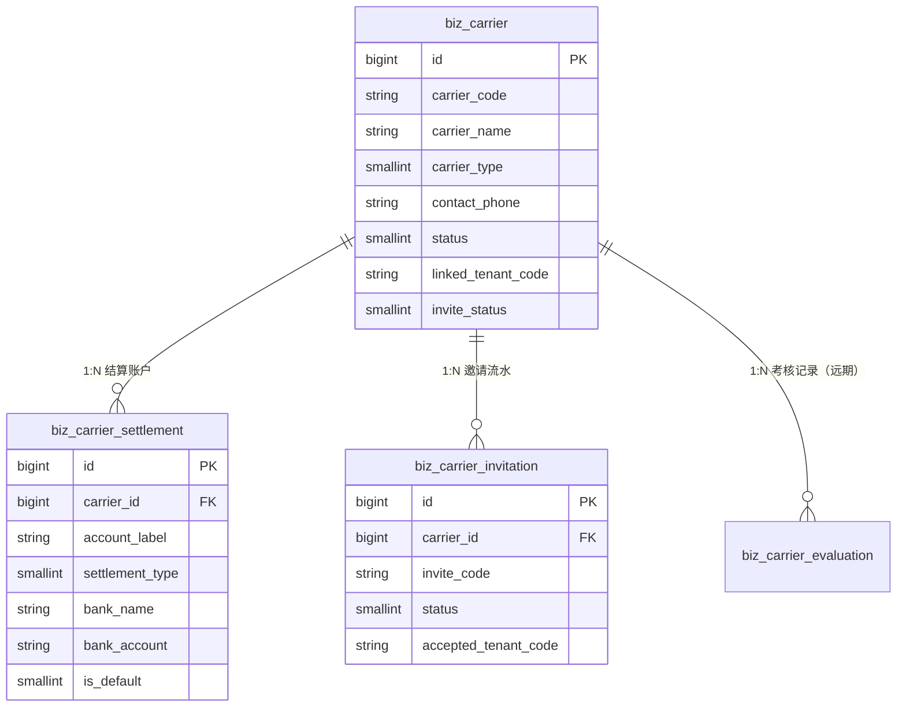
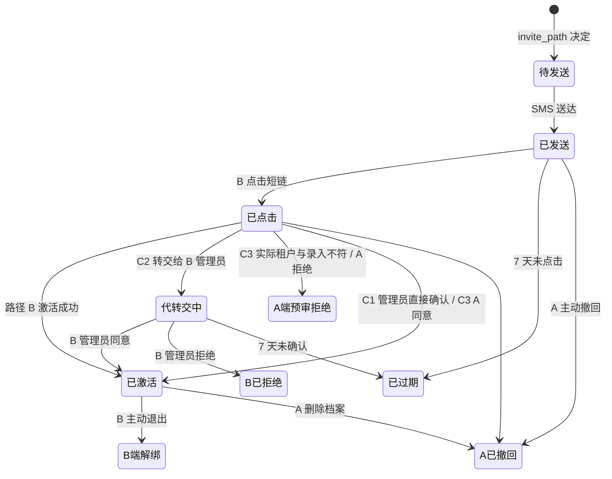

# 企业端合作伙伴模块 - 承运商管理

> **所属阶段**：阶段四 - 企业端合作伙伴模块（承运商子模块）
>
> **文档状态**：方案确认
>
> **创建日期**：2026-05-08
>
> **优先级**：高
>
> **关联文档**：
> - 同目录《01.客户管理.md》
> - 同目录《03.平台互联体系-账号互通设计.md》
> - 《02.需求文档/02.企业端/01.客户端菜单架构重构设计.md》（v2.0）

## 一、功能概述

承运商管理是「合作伙伴」模块的第二个子模块。在物流车队的实际运营中，「承运商」是车队的**下游运输合作伙伴**——车队承接上游客户的运输任务后，部分货物会分包给下游车队（外协）或个体司机来承运。承运商管理负责维护这些下游伙伴的**公司主体档案**（包括公司性质同行车队、个体小车队），并与「运力中心」配合，提供"档案 + 运力组织视角 + 个人即时运力"三层承载结构。

### 1.1 与「供应商」的术语区分

> **重要约定**：本系统在合作伙伴体系中严格区分两个术语，避免日后生态扩展时混淆。

| 术语 | 业务定义 | 主体类型 | 模块位置 | 落地节奏 |
|------|---------|---------|---------|---------|
| **承运商（Carrier）** | 下游**运输**合作伙伴：分包运单、提供运力 | 同行物流车队 / 个体司机 / 小车队 | 客商中心-承运商管理（本文档） | 本期 |
| **供应商（Supplier）** | 上游**物资/服务**卖家：为车队提供轮胎、油卡、保险、维修等 | 轮胎经销商 / 油卡商 / 保险公司 / 维修厂 | 客商中心-供应商管理（占位，远期） | 后期生态 |

历史 v2.0 菜单中暂以 `partner_supplier` 占位的"供应商管理"，本期统一**改名/重定向为 `partner_carrier` 承运商管理**；`partner_supplier` 这一 feature_code/路径**保留并重新定义为远期上游供应商**入口（轮胎/油卡/保险等），本期菜单仍保留占位但 `visible=0`。

### 1.2 核心设计原则

- **合作伙伴体系内统一目录**：承运商与客户、经销商门店、（远期）供应商一同隶属于 `partner/` 业务域，保持统一的设计范式
- **档案与运力解耦**：本模块只管"承运商主体档案"（公司/个体的基础信息、合作合同、对账主体、信用与考核）；具体承运车辆/驾驶员的资源档案在「运力中心」维护，通过 `supplier_id`（语义=承运商 ID）外键关联
- **互联可选**：承运商既可以是"纯档案"（仅 A 自己留存的合作伙伴信息），也可以"互联激活"（B 在本系统拥有自己的租户库，能登录管理自己的运力）。互联设计详见同目录《03.平台互联体系-账号互通设计.md》
- **考核体系前瞻**：本期不实现承运商考核评价体系，但在主表中**预留 `rating_score` / `rating_level` / `last_evaluated_at` 字段**，并在数据模型章节给出 `biz_carrier_evaluation` 表的字段建议，供后期独立模块直接落地

## 二、业务背景

### 2.1 核心业务诉求

1. **承运资源扩展**：车队自营运力有限，承接大批量运单或非主营路线时需要外协；外协能力是车队的核心竞争力之一
2. **合作伙伴档案沉淀**：每次外协前都需要快速找到"合适的、可信任的、价格合理的"承运商，需要长期沉淀合作伙伴档案
3. **结算路径分流**：承运商的结算与自营驾驶员、社会运力（个人即时）有差异，需在档案中维护结算方式/周期/收款账户
4. **互联互通**：被加为承运商的车队，本身也可能是潜在客户。系统设计需在账号体系层面打通，让 B 也能用我们的产品（即便是免费的轻量版），便于业内推广

### 2.2 与其他模块的关系

```
                ┌─────────────────────────┐
                │  运力中心                │
                │  · 车辆/挂车/驾驶员      │  ← supplier_id 关联承运商主体
                │  · 承运商运力（组织视角） │
                │  · 社会运力池（个人即时） │
                └────────────┬────────────┘
                             │ 复用主体档案
            ┌────────────────┴───────────────┐
            │   承运商管理（本文档）          │
            │   · 公司/个体主体档案           │
            │   · 邀请激活与互联              │
            │   · 考核评价（远期预留）         │
            └────────┬──────────────┬────────┘
                     │              │
         carrier_id  │              │ linked_tenant_code
                     ▼              ▼
        ┌────────────────┐  ┌──────────────────────┐
        │  财务结算-应付  │  │  平台互联-账号体系    │
        │  · 供应商对账   │  │  · sys_user 复用      │
        │  · 即时结算     │  │  · sys_user_tenant   │
        └────────────────┘  │  · 推荐人 referrer   │
                            └──────────────────────┘
```

### 2.3 现有代码与占位

| 项目 | 现状 |
|------|------|
| 后端 ORM | 仅有 `biz_customer`，**无 `biz_supplier` / `biz_carrier`** |
| 前端页面 | `frontend/client/src/views/partner/supplier/index.vue` 为 `PlaceholderPage` 占位 |
| 菜单数据 | `backend/scripts/seed/sys_menu.json` 第 2558-2575 行 `partner:supplier` 占位记录（id=307） |
| feature 配置 | `backend/scripts/seed/seed_product_features.py` 中 `partner_supplier` 在 `_STANDARD_DELTA`、`required_tables=None` |
| 菜单架构文档 | 《01.客户端菜单架构重构设计.md》v2.0 已规划"客商中心-供应商管理 + 运力中心-外协供应商 + 社会运力池"三层结构 |

本文档的核心改造：**将 v2.0 中的"供应商管理"占位改造为"承运商管理"实体模块，保留 v2.0 的三层架构语义但术语全面对齐到「承运商」**。

## 三、需求详情

### 3.1 承运商列表

- 分页表格展示，支持按创建时间排序
- 列字段：承运商编码、承运商名称、简称、承运商类型、联系人、联系电话、**默认结算方式**（来自 `is_default=1` 的结算账户）、**互联状态**、状态、操作
- 关键字搜索：承运商名称 / 编码 / 联系人模糊搜索
- 筛选：承运商类型、状态、互联状态（结算方式作为辅助筛选项，按默认账户判定）
- 工具栏：新增承运商、批量删除
- 行操作：编辑、邀请激活、撤回邀请、查看邀请历史、删除

### 3.2 新增 / 编辑承运商

编辑弹窗采用 Tab 结构（宽度 760px），分为「基础信息」「结算账户」「备注」三个 Tab：

#### 3.2.1 基础信息 Tab（biz_carrier 主表字段）

| 字段 | 说明 | 规则 |
|------|------|------|
| 承运商编码 | 系统生成或手动输入 | 选填，租户内唯一，建议格式 `CY0001` |
| 承运商名称 | 全称 | 必填 |
| 承运商简称 | 日常使用的简称 | 选填 |
| 承运商类型 | 公司车队 / 个体司机或小车队 / 其他 | 必填，下拉选择 |
| 统一社会信用代码 | 企业信用代码 | 公司类型必填，个体选填 |
| 身份证号 | 法人/负责人身份证 | 个体类型建议必填 |
| 法人/负责人 | 法人代表或个体负责人姓名 | 选填 |
| 主要联系人 | 日常对接联系人姓名 | 选填 |
| 联系电话 | 主要联系人手机号 | **必填**（互联激活的关键字段，校验手机号格式） |
| 联系邮箱 | 邮箱 | 选填 |
| 省市区 + 详细地址 | 三级联动 + 详细地址 | 选填 |
| 合作起始日 | 合作起始日期 | 选填 |
| 状态 | 正常 / 停用 / 黑名单 | 默认正常 |

#### 3.2.2 结算账户 Tab（biz_carrier_settlement 多记录管理）

子表格形式，支持新增 / 编辑 / 删除多条结算账户。表格列：

| 列 | 说明 |
|----|------|
| 默认 | Radio 单选，仅 1 条可设为默认（同 carrier_id 内 is_default=1 唯一） |
| 账户标签 | 必填，例 "对公主账户" / "私户-司机张三" / "运输专用" |
| 账户类型 | 对公 / 对私 / 其他 |
| 结算方式 | 月结 / 票结 / 预付 / 趟结 |
| 结算周期 | 月结/趟结天数 |
| 开户行 / 账号 / 户名 | 银行三件套（账号格式校验，户名建议与承运商名/法人一致提示） |
| 适用范围 | 文本备注（如"长途专用" "C 客户线路"） |
| 状态 | 启用 / 停用 |
| 操作 | 编辑 / 删除（已被运单引用过的账户禁止删除，仅能停用） |

新增承运商时若用户跳过结算账户 Tab：保存后允许 `biz_carrier_settlement` 为空（纯档案场景，后期补录）；触发邀请激活时无强校验。

#### 3.2.3 备注 Tab

- 备注（文本域）
- 互联状态展示（只读，仅当 linked_tenant_code 非空时显示：关联租户编码、租户名、产品版本、激活时间、解绑入口）

### 3.3 邀请激活（互联互通入口）

承运商档案保存后，列表行操作中提供"邀请激活"按钮。完整的激活路径分流（路径 B / C1 / C2 / C3）与状态机详见《03.平台互联体系-账号互通设计.md》第三章。本节约束本模块需暴露的能力点：

- 仅当承运商联系电话不为空时，"邀请激活"按钮可点击
- 邀请短信内容因路径不同有差异：
  - 路径 B（手机号未注册）：含激活短链 + 验证码提示
  - 路径 C1（手机号已注册且持有人是某租户管理员）：提示"请登录系统在合作客户中确认"
  - 路径 C2（手机号已注册但持有人非任何租户管理员）：提示"请将邀请转交您所在企业的管理员"
- 同一承运商最多保留 1 条"邀请中/代转交中/A 端预审"流水；重复点击会撤回旧邀请并创建新邀请
- 列表的"互联状态"列展示标签：
  - 纯档案（contact_phone 为空）
  - 未邀请（invite_status=0）
  - 邀请中（invite_status=1）
  - 代转交中（invite_status=7，C2 路径）
  - A 端预审待确认（invite_status=4，C3 路径，A 端可点击进入预审弹窗）
  - 已激活（invite_status=2，已建立互联）
  - A 已撤回（invite_status=5）
  - B 已拒绝（invite_status=6）
  - A 端预审拒绝（invite_status=8）
  - B 端解绑（invite_status=9）

### 3.4 A 端预审（C3 路径专用）

当被邀请人接受邀请时，系统发现"实际接受方租户名"与 A 录入的 carrier_name 不一致（target_match=2），会触发 A 端预审：

- A 的承运商列表行加红色 Badge "待预审"
- 点击进入预审弹窗，展示：
  - A 当初录入的承运商名 / 承运商类型 / 联系电话
  - 实际接受方租户的：tenant_name / 联系人 / 联系电话 / 创建时间 / 产品版本
  - 名称匹配度判定结果与原因
- A 操作员/管理员二选一：
  - 同意建立互联：写 `linked_tenant_code`、`invite_status=2`，并提示是否同步修正 carrier_name
  - 拒绝建立互联：`invite_status=8`，可附拒绝理由（写入 `revoked_reason`）

### 3.5 删除承运商

- 软删除（`is_deleted = 1`）
- 校验：如承运商已被运单引用（`biz_waybill.assign_carrier_id` 或运力主表 `supplier_id`），禁止删除并提示
- 已停用 / 已删除的承运商不影响历史运单的查询和展示
- 删除时如该承运商已"互联激活"（`linked_tenant_code` 非空），仅删除 A 端档案与互联关系，**不删除 B 的租户**（B 仍可独立使用其轻量版账号）

### 3.6 承运商状态

| 状态值 | 名称 | 说明 |
|--------|------|------|
| 1 | 正常 | 可在新运单/调度中引用 |
| 0 | 停用 | 不可在新运单中引用，历史数据保留 |
| 2 | 黑名单 | 不可在新运单中引用，列表标红，附拉黑原因（remark） |

### 3.7 承运商选择器组件

提供可复用的承运商选择器组件，供运单分配/调度场景使用：

- 关键字搜索（名称/编码/简称）
- 只展示 `status=1` 的承运商
- 选中后回填：承运商 ID、承运商名称、互联状态（互联状态用于上层判断是否可投递任务到 B 端）

## 四、数据模型设计

所有表位于租户独立数据库（`zt_biz_{tenant_code}`），`__table_tier__ = "business"`，遵循《01.客户管理.md》中的命名/字段规范。

### 4.1 数据表关系总览

承运商相关数据按"主体信息 / 结算信息 / 邀请流水 / 考核评价"四张表解耦设计，遵循"一对多"结构以适配真实业务：



> **解耦原则**：一个承运商可以维护**多个结算账户**（例如：公司主账户 + 个体司机临时账户、不同业务线不同账户、不同结算周期不同账户）；主表只负责"承运商是谁"，结算表负责"钱怎么打给他"。

### 4.2 biz_carrier（承运商主表 · 仅主体信息）

| 字段 | 类型 | 必填 | 说明 |
|------|------|------|------|
| id | BIGINT PK | 是 | 自增主键 |
| carrier_code | VARCHAR(50) UK | 否 | 承运商编码，租户内唯一 |
| carrier_name | VARCHAR(100) | **是** | 承运商全称 |
| short_name | VARCHAR(50) | 否 | 简称 |
| carrier_type | SMALLINT | **是** | 0-公司车队 1-个体司机/小车队 2-其他，default 0 |
| credit_code | VARCHAR(50) | 否 | 统一社会信用代码（公司必填，个体可空） |
| id_card_no | VARCHAR(20) | 否 | 身份证号（个体场景） |
| legal_person | VARCHAR(50) | 否 | 法人代表 / 负责人 |
| contact_person | VARCHAR(50) | 否 | 主要联系人 |
| contact_phone | VARCHAR(20) | **是** | 联系电话（手机号格式，互联激活关键字段） |
| contact_email | VARCHAR(100) | 否 | 联系邮箱 |
| province | VARCHAR(50) | 否 | 省 |
| city | VARCHAR(50) | 否 | 市 |
| district | VARCHAR(50) | 否 | 区/县 |
| address | VARCHAR(255) | 否 | 详细地址 |
| cooperation_start_date | DATE | 否 | 合作起始日 |
| status | SMALLINT | 是 | 0-停用 1-正常 2-黑名单，default 1 |
| **linked_tenant_code** | VARCHAR(32) | 否 | **互联：B 在本系统的 tenant_code，NULL 表示纯档案** |
| **invite_status** | SMALLINT | 是 | **0-未邀请 1-邀请中 2-已激活 3-邀请失败 5-A 已撤回 6-B 已拒绝 7-代转交中 8-A 端预审拒绝 9-B 端解绑，default 0** |
| invite_user_id | BIGINT | 否 | 触发邀请的操作员 user_id |
| invited_at | DATETIME | 否 | 最近邀请时间 |
| activated_at | DATETIME | 否 | B 首次登录或确认接受时间 |
| rating_score | DECIMAL(3,1) | 否 | 预留：考核综合评分 0.0~5.0 |
| rating_level | SMALLINT | 否 | 预留：1-A 2-B 3-C 4-D |
| last_evaluated_at | DATETIME | 否 | 预留：最近一次考核时间 |
| capacity_summary | JSON | 否 | 预留：运力概要快照（车数/车型分布等，列表快展） |
| remark | TEXT | 否 | 备注 |
| created_at | DATETIME | 是 | 创建时间 |
| updated_at | DATETIME | 是 | 更新时间 |
| is_deleted | SMALLINT | 是 | 软删除标记，default 0 |

**索引建议**：
- 唯一索引：`uk_carrier_code (carrier_code)` 仅在租户内
- 普通索引：`idx_carrier_name`, `idx_contact_phone`, `idx_linked_tenant_code`, `idx_status_invite (status, invite_status)`

> 与第一版差异：**移除 `settlement_type / settlement_period / bank_name / bank_account / bank_account_name`**，独立到下面的 `biz_carrier_settlement` 表。`invite_status` 状态码细化以承载更多场景（详见《03.平台互联体系-账号互通设计.md》）。

### 4.3 biz_carrier_settlement（承运商结算账户表）

一个承运商可以挂多个结算账户。运单/对账单生成应付时，按账户级别选定具体收款方与结算方式（例如：A 与"顺达车队"合作，按运单类型走不同账户：长途走"主账户对公"，短途走"代付司机私账"）。

| 字段 | 类型 | 必填 | 说明 |
|------|------|------|------|
| id | BIGINT PK | 是 | 自增主键 |
| carrier_id | BIGINT | 是 | 关联 biz_carrier.id（必填外键） |
| account_label | VARCHAR(50) | 是 | 账户标签（如"对公主账户" "私户-司机张三" "运输专用账户"） |
| account_type | SMALLINT | 是 | 0-对公账户 1-对私账户 2-其他，default 0 |
| settlement_type | SMALLINT | 是 | 结算方式 0-月结 1-票结 2-预付 3-趟结 |
| settlement_period | SMALLINT | 否 | 月结/趟结周期天数（票结/预付场景为空） |
| settlement_day | SMALLINT | 否 | 月结结账日（每月几号，1-28，预留） |
| bank_name | VARCHAR(100) | 否 | 开户行 |
| bank_branch | VARCHAR(100) | 否 | 开户支行 |
| bank_account | VARCHAR(50) | 否 | 银行账号 |
| bank_account_name | VARCHAR(100) | 否 | 户名 |
| swift_code | VARCHAR(20) | 否 | 联行号（可选） |
| tax_rate | DECIMAL(5,2) | 否 | 税率 %（远期，结合发票） |
| applicable_scope | VARCHAR(255) | 否 | 适用范围（业务线/路线/车型，文本备注，远期可结构化） |
| is_default | SMALLINT | 是 | 是否默认账户：1-是 0-否，default 0；同一 carrier_id 内最多 1 条 is_default=1 |
| status | SMALLINT | 是 | 0-停用 1-正常，default 1 |
| sort_order | INT | 是 | 排序，default 0 |
| remark | TEXT | 否 | 备注 |
| created_at / updated_at / is_deleted | — | — | 标准三件套 |

**索引建议**：
- 普通索引：`idx_carrier_id (carrier_id)`, `idx_carrier_default (carrier_id, is_default, status)`
- 业务约束（应用层校验）：同一 `carrier_id` 内最多 1 条 `is_default=1 AND status=1`

**主表与结算表的协作**：

- 列表页 `biz_carrier` 不直接展示结算字段；如需展示"主结算方式"，通过 LEFT JOIN `biz_carrier_settlement WHERE is_default=1` 查询单条记录回填
- 选择器（运单/调度场景）：返回承运商基础信息 + 默认结算账户摘要
- 删除承运商时，结算账户 / 邀请流水级联软删（`is_deleted=1`）
- 删除/停用单个结算账户时校验：如已被运单引用过 → 仅能停用不能删除

### 4.4 biz_carrier_invitation（邀请流水表）

| 字段 | 类型 | 必填 | 说明 |
|------|------|------|------|
| id | BIGINT PK | 是 | 自增主键 |
| carrier_id | BIGINT | 是 | 关联 biz_carrier.id |
| invite_code | VARCHAR(32) UK | 是 | 邀请码（用于短链 URL，全局唯一） |
| invite_phone | VARCHAR(20) | 是 | 被邀请人手机号 |
| expected_carrier_name | VARCHAR(100) | 是 | A 录入承运商档案时的名称快照（用于 A 端预审：实际接受方租户名是否一致） |
| invite_channel | VARCHAR(20) | 是 | sms / wechat / link，default sms |
| sms_content | TEXT | 否 | 短信内容快照（便于审计与追责） |
| invite_token | VARCHAR(64) | 是 | 一次性激活 token（hash 后存储） |
| expires_at | DATETIME | 是 | 失效时间，default now()+7d |
| **invite_path** | VARCHAR(8) | 是 | **路径分支：`B`-未注册新建 `C1`-已注册管理员直接确认 `C2`-已注册非管理员代转交 `C3`-A 端预审待确认（实际接受方与录入名不一致）** |
| **status** | SMALLINT | 是 | **0-待发送 1-已发送 2-已点击 3-已激活/已建立互联 4-已过期 5-A 已撤回 6-B 已拒绝 7-代转交中（C2 待 B 管理员确认） 8-A 端预审拒绝（A 看到实际接受方与录入不符决定回退）** |
| invitee_user_id | BIGINT | 否 | 被邀请人 sys_user.id（点击短链/接受时识别后回填） |
| invitee_role_in_tenant | SMALLINT | 否 | 被邀请人在自己候选租户中的角色：1-管理员 2-普通员工 3-驾驶员；C2 路径触发 |
| forwarder_user_id | BIGINT | 否 | 代转交者 user_id（C2 场景：被邀请人是普通员工，转交给本企业管理员） |
| forwarder_tenant_code | VARCHAR(32) | 否 | C2 场景被邀请人选择转交所在的租户 tenant_code |
| accepted_tenant_code | VARCHAR(32) | 否 | 最终建立互联时的租户编码（路径 B 为新建租户，C1/C2 为现有租户） |
| accepted_user_id | BIGINT | 否 | 最终接受邀请的 user_id（路径 B 为新建用户，C1 为被邀请人本人，C2 为 B 管理员） |
| accepted_role | SMALLINT | 否 | 最终接受方在所选租户中的角色：1-管理员 2-普通员工 |
| target_match | SMALLINT | 否 | 实际接受方租户名与 expected_carrier_name 的匹配度：0-完全匹配 1-相近 2-不匹配（C3 触发） |
| pending_a_review | SMALLINT | 是 | A 端预审待确认 1-是 0-否；C3 路径默认置 1 |
| a_review_decision | SMALLINT | 否 | A 端预审决策：0-未决策 1-同意 2-拒绝 |
| a_review_user_id | BIGINT | 否 | 进行预审的 A 端操作员 user_id |
| revoked_reason | VARCHAR(255) | 否 | 撤回/拒绝/解绑的原因 |
| created_at | DATETIME | 是 | 创建时间 |
| updated_at | DATETIME | 是 | 更新时间 |
| is_deleted | SMALLINT | 是 | 软删除，default 0 |

**索引建议**：
- 唯一索引：`uk_invite_code (invite_code)`
- 普通索引：`idx_carrier_id`, `idx_invite_phone`, `idx_status_expires (status, expires_at)`, `idx_pending_a_review (pending_a_review, status)`

**状态机简图**（详细分支与异常处理见《03.平台互联体系-账号互通设计.md》）：



### 4.5 biz_carrier_evaluation（考核评价表 · 远期预留）

> 本期**不实现**，仅在文档中给出字段建议供后期独立模块直接落地。建议字段如下：

| 字段 | 类型 | 说明 |
|------|------|------|
| id | BIGINT PK | 自增主键 |
| carrier_id | BIGINT | 关联 biz_carrier.id |
| period_type | SMALLINT | 评估周期类型 1-月度 2-季度 3-年度 4-按运单 |
| period_start | DATE | 周期起 |
| period_end | DATE | 周期止 |
| waybill_count | INT | 周期内运单数 |
| on_time_rate | DECIMAL(5,2) | 准点率 % |
| violation_count | INT | 违章/事故/异常次数 |
| customer_complaint_count | INT | 客户投诉次数 |
| customer_score | DECIMAL(3,1) | 客户评分（来自客商中心-客户对承运商的评分） |
| internal_score | DECIMAL(3,1) | 内部评分（运营/调度对承运商的评分） |
| composite_score | DECIMAL(3,1) | 综合评分（公式由后期模块定义） |
| level | SMALLINT | A/B/C/D 等级 |
| evaluator_user_id | BIGINT | 评估人 user_id |
| evaluation_remark | TEXT | 评估说明 |
| created_at / updated_at / is_deleted | — | 标准三件套 |

每次新增评估完成后，**回写** `biz_carrier.rating_score / rating_level / last_evaluated_at`，保证列表页快速展示无需 JOIN。

### 4.6 与「运力中心」的字段衔接

原 v2.0 设计的车辆/挂车/驾驶员主表 `ownership_type / supplier_id` 字段在本期文档中**字段名沿用 `supplier_id`**（避免数据库改名成本与外键级联调整），但**语义对齐为"承运商 ID"**，外键指向 `biz_carrier.id`。`ownership_type` 取值不变（`own / supplier / social`），其中 `supplier` 在新术语下读作"承运商外协"。

未来当远期"上游供应商"模块落地，且需要在车辆/驾驶员上记录上游供应商时，再单独考虑命名空间的细分。

### 4.7 需变更/新建的代码文件

| 操作 | 文件路径 | 变更内容 |
|------|----------|---------|
| **新建** | `backend/app/modules/client/models/partner/carrier.py` | `Carrier` ORM 模型 |
| **新建** | `backend/app/modules/client/models/partner/carrier_settlement.py` | `CarrierSettlement` ORM 模型 |
| **新建** | `backend/app/modules/client/models/partner/carrier_invitation.py` | `CarrierInvitation` ORM 模型 |
| **新建** | `backend/app/modules/client/schemas/partner/carrier.py` | Pydantic Schema |
| **新建** | `backend/app/modules/client/schemas/partner/carrier_settlement.py` | Pydantic Schema |
| **新建** | `backend/app/modules/client/services/partner/carrier_service.py` | 承运商 CRUD Service |
| **新建** | `backend/app/modules/client/services/partner/carrier_invite_service.py` | 邀请激活 Service（调用 console TenantService） |
| **新建** | `backend/app/modules/client/api/partner/carrier.py` | API 路由 |
| **新建** | `backend/app/modules/open/api/carrier_invite.py` | B 端激活/接受邀请的开放接口 |
| **改造** | `backend/app/modules/console/models/system/user_tenant.py` | 新增 `invite_source_tenant` 列（可空） |
| **改造** | `backend/app/modules/client/models/vehicle.py` `driver/driver.py` 等 | 新增 `ownership_type` `supplier_id` 字段（v2.0 已规划，本期一并落地） |
| **新建** | `frontend/client/src/api/partner/carrier/index.ts` | 前端 API |
| **新建** | `frontend/client/src/api/partner/carrier/model/index.ts` | TypeScript 类型 |
| **重命名** | `frontend/client/src/views/partner/supplier/` → `frontend/client/src/views/partner/carrier/` | 目录改名 |
| **新建** | `frontend/client/src/views/partner/carrier/index.vue` | 列表页 |
| **新建** | `frontend/client/src/views/partner/carrier/components/carrier-edit.vue` | 编辑弹窗 |
| **新建** | `frontend/client/src/views/partner/carrier/components/carrier-search.vue` | 搜索条 |
| **新建** | `frontend/client/src/views/partner/carrier/components/carrier-invite-dialog.vue` | 邀请激活弹窗 |
| **新建** | `frontend/client/src/views/partner/carrier/components/carrier-invitation-history.vue` | 邀请历史 |
| **新建** | `frontend/client/src/views/partner/inbound/index.vue` | 反向视角"合作客户"页面（lite 版必含） |

## 五、API 接口设计

所有接口前缀：`/api/client`，需要 JWT 认证。

**承运商主体**：

| 方法 | 路径 | 说明 |
|------|------|------|
| GET | `/partner/carrier` | 分页查询承运商 |
| GET | `/partner/carrier/{id}` | 查询承运商详情（含结算账户列表 + 互联状态） |
| GET | `/partner/carrier/select` | 选择器（仅返回 status=1 的简要字段 + 默认结算账户摘要） |
| POST | `/partner/carrier` | 创建承运商（请求体可同时带 settlements 数组一次性创建） |
| PUT | `/partner/carrier/{id}` | 更新承运商主体信息（仅修改主表字段，结算账户走独立接口） |
| DELETE | `/partner/carrier/{id}` | 软删除承运商（级联软删 settlements / invitations） |

**结算账户**：

| 方法 | 路径 | 说明 |
|------|------|------|
| GET | `/partner/carrier/{id}/settlements` | 获取某承运商的全部结算账户 |
| POST | `/partner/carrier/{id}/settlements` | 新增结算账户（is_default=1 时自动把同 carrier 的其他账户置 0） |
| PUT | `/partner/carrier/{id}/settlements/{settlementId}` | 更新结算账户 |
| DELETE | `/partner/carrier/{id}/settlements/{settlementId}` | 删除结算账户（已被运单引用则报错） |
| POST | `/partner/carrier/{id}/settlements/{settlementId}/set-default` | 设为默认账户 |
| POST | `/partner/carrier/{id}/settlements/{settlementId}/toggle-status` | 启用 / 停用 |

**邀请管理**：

| 方法 | 路径 | 说明 |
|------|------|------|
| POST | `/partner/carrier/{id}/invite` | 触发邀请激活（已激活 / 邀请中状态时报错） |
| POST | `/partner/carrier/{id}/revoke-invite` | 撤回当前邀请（仅 invite_status=1 / 7 时可用） |
| GET | `/partner/carrier/{id}/invitations` | 邀请历史列表 |
| GET | `/partner/carrier/{id}/invitations/{inviteId}/preview-acceptor` | 查询当前邀请的实际接受方（C3 路径 A 端预审用） |
| POST | `/partner/carrier/{id}/invitations/{inviteId}/a-review` | A 端预审决策（同意 / 拒绝），C3 路径专用 |

**分页查询参数**：

| 参数 | 类型 | 说明 |
|------|------|------|
| page | int | 页码，default 1 |
| limit | int | 每页条数，default 20 |
| keyword | string | 名称/编码/联系人模糊搜索 |
| carrierType | int | 承运商类型筛选 |
| settlementType | int | 结算方式筛选 |
| status | int | 状态筛选 |
| inviteStatus | int | 互联状态筛选 |
| linked | bool | 是否已互联（true → linked_tenant_code 非空） |

**创建承运商请求体示例**（含一次性创建多个结算账户）：

```json
{
  "carrierCode": "CY0001",
  "carrierName": "顺达外协运输有限公司",
  "shortName": "顺达",
  "carrierType": 0,
  "creditCode": "91110108XXXXXXXXXX",
  "legalPerson": "李四",
  "contactPerson": "李四",
  "contactPhone": "13900139000",
  "contactEmail": "lisi@shunda.com",
  "province": "北京市",
  "city": "北京市",
  "district": "海淀区",
  "address": "上地十街 10 号",
  "cooperationStartDate": "2026-05-01",
  "remark": "",
  "settlements": [
    {
      "accountLabel": "对公主账户",
      "accountType": 0,
      "settlementType": 0,
      "settlementPeriod": 30,
      "bankName": "中国工商银行",
      "bankBranch": "海淀支行",
      "bankAccount": "62220200000000000000",
      "bankAccountName": "顺达外协运输有限公司",
      "isDefault": 1,
      "applicableScope": "长途运输"
    },
    {
      "accountLabel": "私户-司机张三",
      "accountType": 1,
      "settlementType": 3,
      "bankName": "招商银行",
      "bankAccount": "6225888800000000",
      "bankAccountName": "张三",
      "isDefault": 0,
      "applicableScope": "短途/趟结代付"
    }
  ]
}
```

**结算账户单独 CRUD 请求体示例**（`POST /partner/carrier/{id}/settlements`）：

```json
{
  "accountLabel": "运输专用账户",
  "accountType": 0,
  "settlementType": 1,
  "bankName": "中国农业银行",
  "bankAccount": "62281234000000000",
  "bankAccountName": "顺达外协运输有限公司",
  "isDefault": 0,
  "applicableScope": "票结-散单"
}
```

**邀请触发请求体**（`POST /partner/carrier/{id}/invite`）：

```json
{
  "channel": "sms",
  "remark": "首次邀请激活"
}
```

**邀请触发响应**：

```json
{
  "code": 0,
  "data": {
    "carrierId": 12,
    "inviteId": 28,
    "inviteCode": "Cv8YQ3p2",
    "inviteStatus": 1,
    "expiresAt": "2026-05-15T09:00:00",
    "userExisted": false,
    "linkedTenantCode": null
  }
}
```

字段语义：`userExisted=true` 表示该手机号已是 sys_user，对方接受后只走"关联现租户"分支；为 false 时对方激活后会**自动创建 lite 租户**。详细流程见《03.平台互联体系-账号互通设计.md》。

**承运商选择器响应**（`GET /partner/carrier/select`）：

```json
{
  "code": 0,
  "data": [
    {
      "id": 12,
      "carrierName": "顺达外协运输有限公司",
      "shortName": "顺达",
      "carrierCode": "CY0001",
      "carrierType": 0,
      "linked": true,
      "linkedTenantCode": "1015",
      "defaultSettlement": {
        "id": 30,
        "accountLabel": "对公主账户",
        "settlementType": 0,
        "settlementPeriod": 30,
        "bankAccountName": "顺达外协运输有限公司",
        "bankAccountMasked": "6222 0200 **** **** 0000"
      }
    }
  ]
}
```

> 出于安全考虑，选择器响应中银行账号默认脱敏（中间 8 位用 `*` 替换），明文仅在编辑权限下的详情接口返回。

## 六、前端页面设计

### 6.1 承运商管理页

- **路由**：`/partner/carrier`
- **组件**：`views/partner/carrier/index.vue`
- **子组件**：
  - `components/carrier-edit.vue` —— 新增/编辑弹窗（宽度 760px，Tab：**基础信息 / 结算账户 / 备注**）
  - `components/carrier-settlement-table.vue` —— 结算账户子表格（支持新增/编辑/删除/设默认/启停）
  - `components/carrier-settlement-edit.vue` —— 单条结算账户编辑表单
  - `components/carrier-search.vue` —— 搜索条
  - `components/carrier-invite-dialog.vue` —— 邀请激活弹窗（确认手机号、展示激活后产品版本说明、A 端预审 C3 路径专用区块）
  - `components/carrier-invitation-history.vue` —— 邀请流水表
  - `components/carrier-a-review-dialog.vue` —— A 端预审决策弹窗（C3 场景：展示实际接受方租户名 vs 录入承运商名）

**列表交互**：

- 工具栏：关键字搜索 + 类型/结算/状态/互联状态下拉 + 新增承运商按钮
- 表格列：
  - 承运商编码、名称、简称
  - 类型（Tag 区分公司/个体）
  - 联系人、联系电话
  - 默认结算方式（Tag，从默认结算账户取值；无结算账户时显示"未配置"）
  - 默认收款户名（脱敏摘要）
  - **互联状态**（Tag：未邀请-灰 / 邀请中-蓝 / 代转交中-紫 / A 端预审-橙 / 已激活-绿 / 已拒绝/已撤回-红 / 纯档案-默认）
  - 状态（Switch 切换正常/停用，黑名单单独入口）
  - 创建时间
  - 操作（编辑、邀请激活/撤回、邀请历史、A 端预审、删除，按互联状态条件展示）

**详情面板（编辑弹窗顶部）**：

- 基础档案区块
- 结算与银行区块
- 互联信息区块（仅 linked_tenant_code 非空时展示）：
  - 关联租户编码、租户名称、产品版本（lite/standard/...）
  - "查看 B 的运力概要"快捷链接（跳转运力中心-承运商运力下钻视图）
  - "解除互联"按钮（仅删除 A 端关联，不影响 B 的租户）

### 6.2 反向视角："合作客户"页（partner_inbound）

- **路由**：`/partner/inbound`
- **组件**：`views/partner/inbound/index.vue`
- **可见对象**：所有版本（lite / standard / pro / enterprise）
- **数据源**：调用平台开放接口 `GET /api/open/inbound-customers` 反查"哪些 A 把当前租户加为承运商"
- **列表字段**：A 的租户名称、A 的联系人/电话、合作起始日、最近一次派单时间（远期）、操作（查看详情）
- **详情下钻**：进入查看 A 派给"我"的运单只读视图（运单数据互联属于下一期，本期接口先返回空数组）
- **意义**：让 lite 版用户也能看到"谁邀请了我"，这是互联互通在 B 端的核心呈现

详细设计见《03.平台互联体系-账号互通设计.md》第 4.x 节。

### 6.3 菜单层级

```
客商中心 (partner)
├── 客户管理        /partner/customer        partner_customer    standard+
├── 经销商门店      /partner/dealer          basic_data_dealer   standard+
├── 承运商管理      /partner/carrier         partner_carrier     standard+   ← 本期落地
├── 合作客户        /partner/inbound         partner_inbound     lite, standard+   ← 本期新增
└── 供应商管理      /partner/supplier        partner_supplier    enterprise（远期）   ← 重新定义为上游供应商
```

## 七、菜单与产品版本注册

### 7.1 关键命名变更（v2.0 → 本期）

| 维度 | 旧（v2.0 占位） | 新（本期） |
|------|---------------|----------|
| 客商中心-供应商管理 menu_code | `partner:supplier` | **保留 `partner:supplier`** 但 `visible=0` 留作远期上游供应商 |
| 客商中心-供应商管理 feature_code | `partner_supplier` | **保留 `partner_supplier`** 但版本归属由 standard 调整为 enterprise（远期） |
| 客商中心-供应商管理 path | `/partner/supplier` | 同 menu_code，保留路径 |
| 客商中心-承运商管理 menu_code | — | **新增 `partner:carrier`** |
| 客商中心-承运商管理 feature_code | — | **新增 `partner_carrier`** |
| 客商中心-承运商管理 path | — | **新增 `/partner/carrier`** |
| 客商中心-合作客户 menu_code | — | **新增 `partner:inbound`**（lite 版必含） |
| 客商中心-合作客户 feature_code | — | **新增 `partner_inbound`** |
| 客商中心-合作客户 path | — | **新增 `/partner/inbound`** |
| 运力中心-外协供应商 menu_name | `外协供应商` | **改名为 `承运商运力`**（feature_code/path 保持 `carrier_external`/`/capacity/external-carrier` 不变） |
| 运力中心-社会运力池 | 保持不变 | 保持不变 |

> 所有 feature_code 仍以 `_carrier_` / `_supplier_` 作为术语前缀严格区分。

### 7.2 注册菜单（seed_client_menus.py / sys_menu.json）

在 `backend/scripts/seed/sys_menu.json` 中：

1. **id=303**（外协供应商）：
   - `menu_name`: `外协供应商` → `承运商运力`
   - 其余字段不动（icon/path/component/feature_code）

2. **id=307**（供应商管理）：
   - 保留作为远期上游供应商占位
   - `visible`: `1` → `0`
   - `feature_code` 不变（仍 `partner_supplier`）

3. **新增承运商管理记录**（id 取下一可用值）：

```json
{
  "parent_id": 237,
  "menu_name": "承运商管理",
  "menu_code": "partner:carrier",
  "menu_type": 0,
  "path": "/partner/carrier",
  "component": "/partner/carrier/index",
  "icon": "chengyunshang",
  "sort_order": 15,
  "visible": 1,
  "status": 1,
  "app_type": "client",
  "feature_code": "partner_carrier",
  "is_deleted": 0
}
```

按钮级权限子节点：

```
partner:carrier:list / add / edit / delete / invite / revoke-invite
```

4. **新增合作客户记录**（lite 版必含，所有版本可见）：

```json
{
  "parent_id": 237,
  "menu_name": "合作客户",
  "menu_code": "partner:inbound",
  "menu_type": 0,
  "path": "/partner/inbound",
  "component": "/partner/inbound/index",
  "icon": "hezuokehu",
  "sort_order": 25,
  "visible": 1,
  "status": 1,
  "app_type": "client",
  "feature_code": "partner_inbound",
  "is_deleted": 0
}
```

### 7.3 注册产品功能（seed_product_features.py）

在 `_STANDARD_DELTA` 中：

- **删除** `"partner_supplier"`
- **新增** `"partner_carrier"`、`"partner_inbound"`

新增 `_LITE_DELTA`（被邀请承运商默认版本，详见《03.平台互联体系-账号互通设计.md》）：

```python
_LITE_DELTA = [
    "capacity_manage", "resource_vehicle", "resource_trailer", "resource_driver",
    "carrier_external", "carrier_social",
    "partner_inbound",
]
```

`partner_supplier` 移入 `_ENTERPRISE_DELTA`（释义为远期上游供应商）。

`sys_product_feature` 表新增条目：

```python
{"feature_code": "partner_carrier", "feature_name": "承运商管理", "module": "partner",
 "sort_order": 16, "required_tables": '["biz_carrier", "biz_carrier_invitation"]'},
{"feature_code": "partner_inbound", "feature_name": "合作客户（反向视角）", "module": "partner",
 "sort_order": 17, "required_tables": None},
```

`partner_supplier` 条目保留，但 `feature_name` 调整为 "供应商管理（远期·上游）"，`required_tables` 仍为 `None`。

### 7.4 关于运力中心的协同

本期不直接修改运力中心代码，但运力中心的 `carrier_external` 菜单与本模块强协同：

- 「运力中心-承运商运力」按 `biz_carrier.id`（即车辆/驾驶员的 `supplier_id`）聚合下钻
- 调度中心选承运资源时，可通过 `biz_carrier.linked_tenant_code` 判断是否能将运单**投递到 B 端**（互联运单将在下一期实现）

## 八、下一阶段编码改造清单

> 本期仅产出文档与设计；以下清单为下一阶段（独立 PR）的具体落地动作。

### 8.1 后端

| 类别 | 文件路径 | 操作 |
|------|---------|------|
| 模型 | `backend/app/modules/client/models/partner/carrier.py` | **新建** `Carrier` ORM（仅主体字段，参照 `models/partner/customer.py`） |
| 模型 | `backend/app/modules/client/models/partner/carrier_settlement.py` | **新建** `CarrierSettlement` ORM |
| 模型 | `backend/app/modules/client/models/partner/carrier_invitation.py` | **新建** `CarrierInvitation` ORM（含 invite_path/target_match/pending_a_review 等新增字段） |
| 模型 | `backend/app/modules/client/models/partner/__init__.py` | 注册新模型 |
| Schema | `backend/app/modules/client/schemas/partner/carrier.py` | **新建** Pydantic Schema（含嵌套 settlements 数组） |
| Schema | `backend/app/modules/client/schemas/partner/carrier_settlement.py` | **新建** 结算账户独立 Schema |
| Service | `backend/app/modules/client/services/partner/carrier_service.py` | **新建** 主体 CRUD Service（创建时联动落 settlements） |
| Service | `backend/app/modules/client/services/partner/carrier_settlement_service.py` | **新建** 结算账户 CRUD + 默认账户互斥逻辑 |
| Service | `backend/app/modules/client/services/partner/carrier_invite_service.py` | **新建** 邀请激活 Service（含 C1/C2/C3 路径分支） |
| API | `backend/app/modules/client/api/partner/carrier.py` | **新建** 主体 + 结算 + 邀请共 14 个端点 |
| API 注册 | `backend/app/modules/client/api/partner/__init__.py` | include `carrier.router` |
| API 注册 | `backend/app/modules/client/api/__init__.py` | 第二级 partner.carrier 路由挂载 |
| 开放 API | `backend/app/modules/open/api/carrier_invite.py` | **新建** B 端激活/接受/拒绝/转交/管理员审核接口 |
| 开放 API | `backend/app/modules/open/api/inbound_customer.py` | **新建** B 端反向视角列表 + 解绑接口 |
| 平台模型 | `backend/app/modules/console/models/system/user_tenant.py` | **新增列** `invite_source_tenant: Optional[str]` |
| 平台模型 | `backend/app/modules/console/models/system/carrier_link.py` | **新建** `CarrierLink` ORM（已建立互联关系镜像，详见 03 文档第 6.3 节） |
| 平台模型 | `backend/app/modules/console/models/system/carrier_invitation_inbox.py` | **新建** `CarrierInvitationInbox` ORM（邀请索引中转表，详见 03 文档第 9 节） |
| Alembic 迁移 | `backend/alembic/versions/xxx_add_carrier_tables.py` | 新建 `biz_carrier` / `biz_carrier_settlement` / `biz_carrier_invitation` 表（租户库） |
| Alembic 迁移 | `backend/alembic/versions/xxx_add_invite_source_tenant.py` | 平台库 `sys_user_tenant` 加列 |
| Alembic 迁移 | `backend/alembic/versions/xxx_add_carrier_link_inbox.py` | 平台库新建 `sys_carrier_link` / `sys_carrier_invitation_inbox` 中转表 |
| 模型一并落地 | `backend/app/modules/client/models/vehicle.py` `driver/driver.py` 等 | 增 `ownership_type` `supplier_id` 字段（v2.0 既定） |
| 定时任务 | `backend/app/modules/console/tasks/carrier_invite_expire.py` | **新建** 每 30 分钟扫一次邀请过期任务（详见 03 文档第 14.6 节） |

### 8.2 前端

| 类别 | 路径 | 操作 |
|------|------|------|
| 目录 | `frontend/client/src/views/partner/supplier/` | **删除/废弃** 旧占位（保留一份 `supplier/index.vue` 作为远期上游供应商占位即可） |
| 目录 | `frontend/client/src/views/partner/carrier/` | **新建**，含 `index.vue` + `components/carrier-edit.vue` + `carrier-settlement-table.vue` + `carrier-settlement-edit.vue` + `carrier-search.vue` + `carrier-invite-dialog.vue` + `carrier-invitation-history.vue` + `carrier-a-review-dialog.vue` |
| 目录 | `frontend/client/src/views/partner/inbound/` | **新建** `index.vue` + `components/pending-invitations.vue`（C1/C2 待处理）+ `admin-pending.vue`（C2 转交后管理员审核）+ `linked-customers.vue`（已建立互联的合作客户列表） |
| 着陆页 | `frontend/client/src/views/invite-landing/index.vue` | **新建** 路径 B 邀请激活着陆页（无需登录） |
| 升级横幅 | `frontend/client/src/components/UpgradeToProBanner/index.vue` | **新建** lite 版顶部升级引导 |
| API | `frontend/client/src/api/partner/carrier/index.ts` | **新建** 含主体 + 结算 + 邀请 14 个端点 |
| API | `frontend/client/src/api/partner/carrier/model/index.ts` | **新建**（`Carrier` `CarrierSettlement` `CarrierInvitation` 类型） |
| API | `frontend/client/src/api/partner/inbound/index.ts` | **新建**（调用 `/api/open/inbound-customers`） |
| API | `frontend/client/src/api/open/carrier-invite/index.ts` | **新建** 着陆页激活接口 |

### 8.3 Seed / 迁移脚本

| 文件 | 操作 |
|------|------|
| `backend/scripts/seed/sys_menu.json` | 第 2486 行（id=303）`menu_name` 改为 `承运商运力`；第 2558 行（id=307）`visible` 改为 `0`；新增 `partner:carrier` `partner:inbound` 两条记录 + 各自的按钮权限子记录 |
| `backend/scripts/seed/seed_product_features.py` | 调整 `_STANDARD_DELTA`、新增 `_LITE_DELTA`、移动 `partner_supplier` 至 `_ENTERPRISE_DELTA`、`VERSION_FEATURES` 添加 `lite` 档；`PRODUCT_FEATURES` 新增 `partner_carrier` `partner_inbound` 条目 |
| `backend/scripts/seed/seed_data.py` | 新增 `lite` ProductVersion 记录（`version_code='lite'`, `version_name='轻量版'`, `status=1`） |
| `backend/scripts/fix/migrate_supplier_to_carrier.py` | **新建**：对所有已有租户库执行 ① 创建 `biz_carrier` / `biz_carrier_settlement` / `biz_carrier_invitation` 三张表 ② 已存量数据无须迁移（之前 `biz_supplier` 不存在）③ 客户端菜单 `sys_menu` 同步刷新（运力中心-承运商运力改名、partner:supplier 隐藏、新增 partner:carrier / partner:inbound）④ 平台库新建 `sys_carrier_link` / `sys_carrier_invitation_inbox` 中转表 |

## 九、测试要点

### 9.1 主体档案

1. **新增承运商**：必填校验（名称/类型/电话），手机号格式校验，创建后默认 `invite_status=0`
2. **承运商编码唯一性**：同一租户内 `carrier_code` 不可重复
3. **公司类型补字段**：选择"公司车队"时校验 `credit_code` 必填
4. **个体类型补字段**：选择"个体司机/小车队"时建议 `id_card_no` 必填
5. **删除承运商**：已被运单引用 → 禁止删除并提示；已互联 → 仅删除 A 端档案+级联软删 settlements/invitations，B 的租户保持不变
6. **承运商选择器**：仅返回 `status=1` 的承运商；返回数据含默认结算账户脱敏摘要
7. **互联状态筛选**：列表筛选"已激活"仅返回 `linked_tenant_code IS NOT NULL` 的记录

### 9.2 结算账户

8. **创建主体时一并创建多个结算账户**：请求体 `settlements` 数组多条，全部正确落 `biz_carrier_settlement`，含 1 条 `is_default=1`
9. **默认账户唯一性**：同一 carrier_id 内最多 1 条 `is_default=1`，新增/设默认时自动把其他账户置 0
10. **结算账户独立 CRUD**：通过 `/settlements` 路由增删改不影响主体；至少 1 条状态正常时主表选择器才返回默认结算摘要
11. **结算账户删除保护**：已被运单/对账单引用过的结算账户 → 禁止删除，仅可停用
12. **银行账号脱敏**：列表/选择器返回脱敏号，详情接口（编辑权限）返回明文
13. **结算账户级联软删**：删除承运商时，级联软删全部结算账户

### 9.3 互联激活（详细测试见《03.平台互联体系-账号互通设计.md》）

14. **路径 B 未注册激活**：触发 invite → SMS 发送 → 着陆页激活 → `linked_tenant_code` 与 `invite_status=2`/`accepted_role=1` 回写
15. **路径 C1 已注册管理员直接确认**：B 端管理员接受 → 不新建租户 → 仅写 `linked_tenant_code = B 选定的租户` + `accepted_role=1`
16. **路径 C2 已注册非管理员代转交**：被邀请人是普通员工 → 邀请进入 status=7 代转交中 → B 管理员收到代为确认 → 同意后写入；7 天未确认自动过期
17. **路径 C3 实际接受方与录入不符**：B 选定的租户名与 A 录入的 carrier_name 不一致 → `target_match=2` + `pending_a_review=1` → A 端预审拒绝则 `status=8`，A 同意则 `status=3`
18. **撤回邀请**：仅 `invite_status=1/7` 状态可撤回，撤回后 `biz_carrier_invitation.status=5`，B 再点链接报"邀请已失效"
19. **重复邀请**：在 invite_status=1/7 状态下再次邀请 → 旧流水自动撤回（status=5），新流水生效
20. **B 端解绑**：B 在合作客户页主动退出 → A 端 `linked_tenant_code=NULL`、`invite_status=9`
21. **A 端删除已互联档案**：B 端"合作客户"列表中该 A 消失（link_status=2）

### 9.4 安全与权限

22. **菜单权限**：登录后侧边栏可见「客商中心 → 承运商管理 / 合作客户」
23. **多租户隔离**：A 租户的 `biz_carrier`/`biz_carrier_settlement` 数据不会泄漏到 B 租户
24. **lite 版菜单**：lite 用户登录后只看到《03.平台互联体系-账号互通设计.md》4.2 节定义的菜单子集
25. **角色边界**：B 端非管理员收到 C2 邀请只能"转交给管理员"，无法直接"接受"
26. **A 不能单方面绑架**：A 录入 phone 后 → `linked_tenant_code` 字段在 B 端未确认前**始终为 NULL**

## 十、远期演进锚点

| 远期能力 | 本文档预留 |
|---------|-----------|
| 承运商考核体系 | 主表预留 `rating_score / rating_level / last_evaluated_at`；4.3 节给出 `biz_carrier_evaluation` 字段建议 |
| 上游供应商（轮胎/油卡/保险） | 保留 `partner_supplier` feature_code 与 `/partner/supplier` 路径；隐藏占位 |
| 运单互联（A 派 B 接） | 主表预留 `linked_tenant_code`；运力中心 `supplier_id` 已能定位关联 |
| 跨企业对账 | `biz_carrier_invitation.accepted_tenant_code` 可作为对账主体的核心键 |
| 承运商等级与白名单 | 配合 `rating_level` + `status=2` 黑名单状态实现 |
| 风控数据互通 | B 在多个 A 那里被加为承运商，可平台层聚合"行业信誉"；接口预留 `GET /api/open/inbound-customers` |
