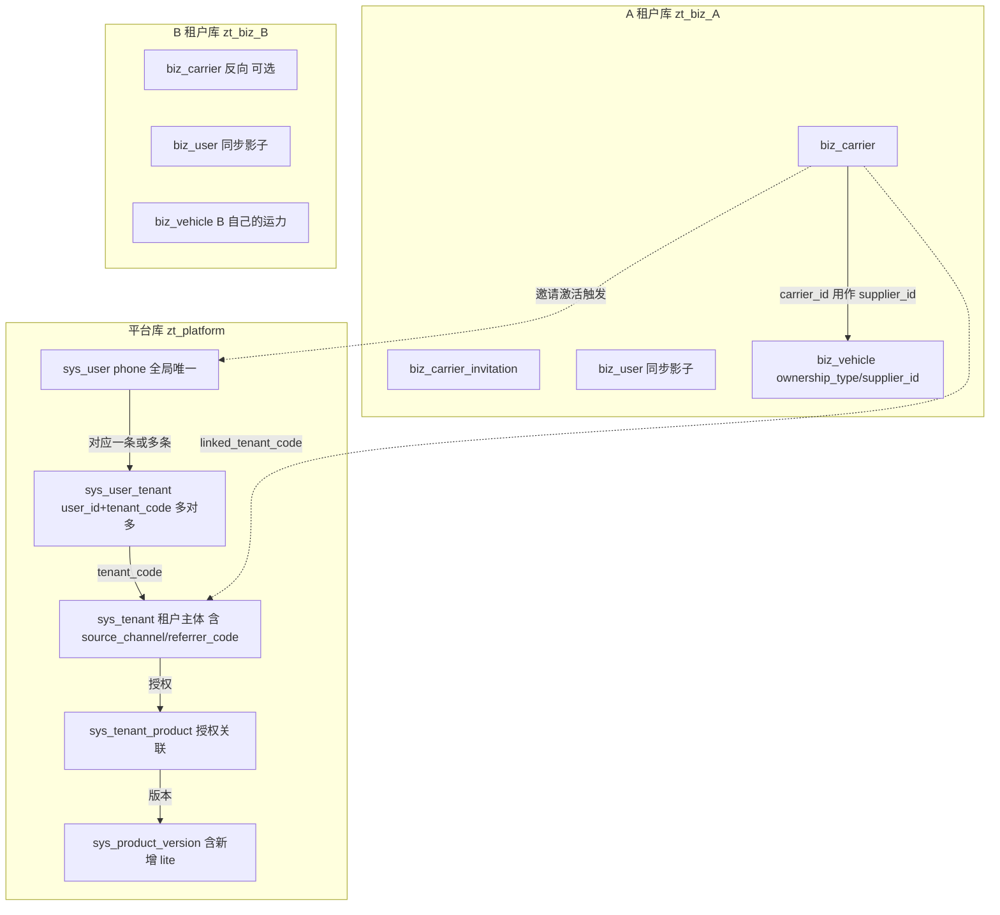
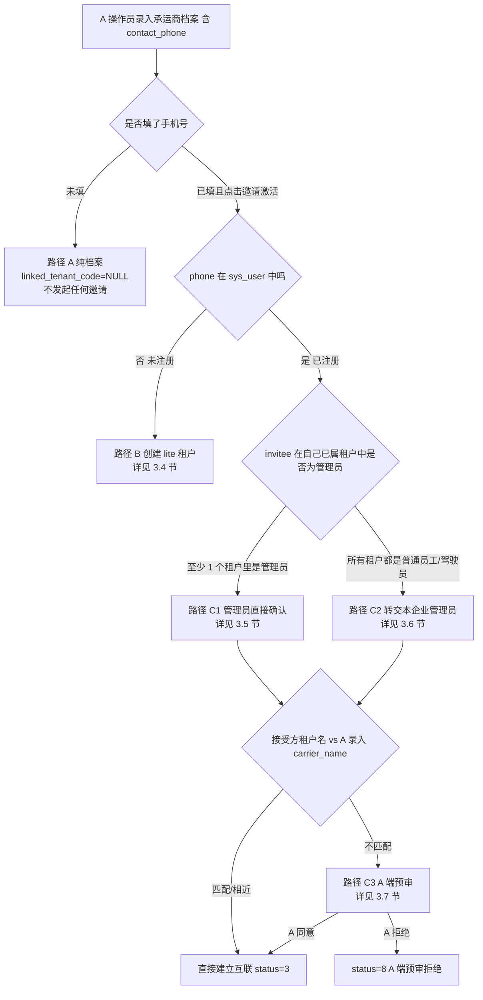
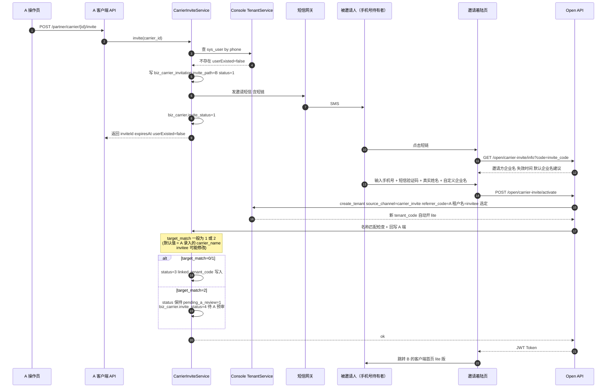
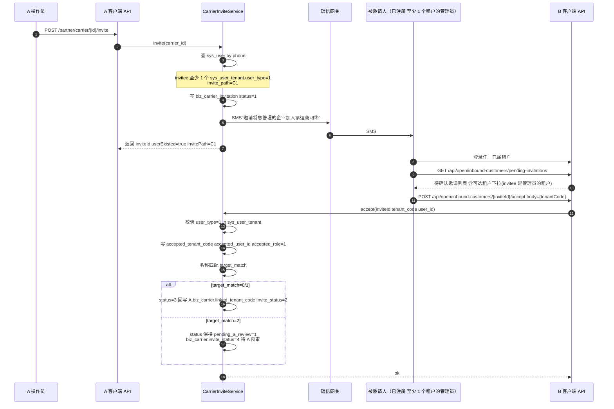
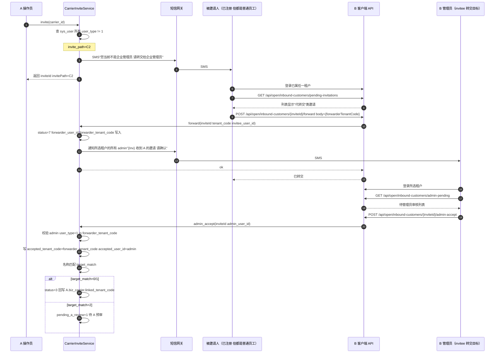
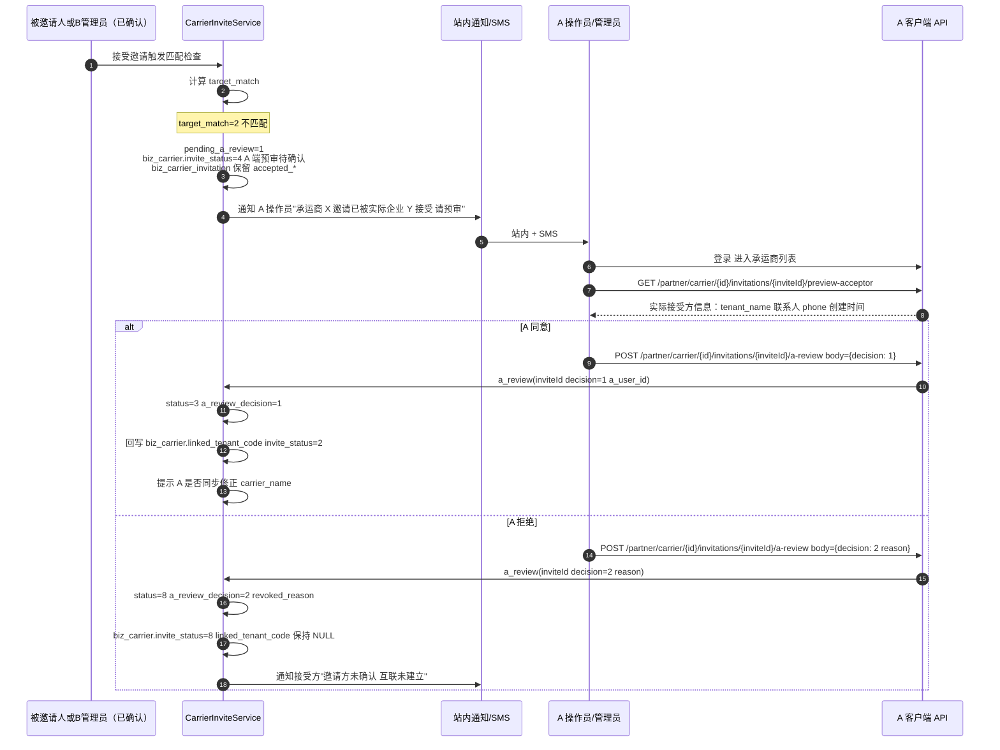
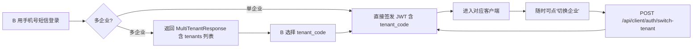

# 平台互联体系 · 账号互通设计

> **所属阶段**：阶段四 - 企业端合作伙伴模块（互联子能力）
>
> **文档状态**：方案确认
>
> **创建日期**：2026-05-08
>
> **优先级**：高（与《02.承运商管理.md》同步落地）
>
> **关联文档**：
> - 同目录《02.承运商管理.md》
> - 《02.需求文档/02.企业端/01.客户端菜单架构重构设计.md》v2.0

## 一、设计背景与价值

### 1.1 业务诉求

物流车队之间存在**高频、双向、长期**的业务协作关系：

- A 把 B 加为承运商（外协），把部分运单分包给 B
- B 自己也是物流车队，同样会把更下游的车队 C 加为承运商
- A、B、C 任意两两之间，都可能既是上游客户也是下游承运商

业内推广目标：**用产品本身做"连接器"**——只要 A 在我们的产品里把 B 加为承运商，B 就能用我们的产品（即便是免费的轻量版）登录，看到"谁加了我"，独立维护自己的运力档案。当 B 体会到价值后，自然会购买正式版，形成"客户带客户"的网络效应。

### 1.2 设计哲学

**复用现有原语，零侵入扩展**。当前架构已经天然支持账号互通：

| 现有能力 | 文件 | 互通价值 |
|---------|------|---------|
| `sys_user.phone` 全平台唯一 | `backend/app/modules/console/models/system/user.py` | 同一手机号天然跨企业 |
| `sys_user_tenant (user_id, tenant_code)` | `backend/app/modules/console/models/system/user_tenant.py` | 一个用户挂多个企业 |
| `Tenant.source_channel / referrer_code` | `backend/app/modules/console/models/tenant/tenant.py` | 来源渠道与推荐人字段已存在 |
| `TenantService.create_tenant` | `backend/app/modules/console/services/tenant/tenant_service.py` 第 180-233 行 | 已实现"手机号已注册→复用 User+新建 UserTenant；未注册→创建 User+UserTenant" |
| `MultiTenantResponse` | `backend/app/modules/console/schemas/auth/auth.py` | 多企业登录第二步选择 |
| `POST /api/client/auth/switch-tenant` | `backend/app/modules/client/api/auth.py` | 一键切换租户上下文 |
| `OpenRegisterPolicyService` | `backend/app/modules/console/services/system/open_register_policy_service.py` | 自助注册策略，控制默认产品版本 |

仅需要在此之上做三件事：

1. 新增 `lite` **产品版本**与对应功能集（被邀请承运商默认开通）
2. 新增 `carrier_invite` **来源渠道**取值
3. 封装 `CarrierInviteService` 调用现有 `TenantService.create_tenant` 走邀请分支

> 对现有平台层只需要 **1 处可空字段新增**（`sys_user_tenant.invite_source_tenant`），向后兼容。

### 1.3 本期范围与下一期划界

| 范围 | 本期（账号互联） | 下一期（数据互联） |
|------|---------------|------------------|
| 同手机号跨租户登录 | ✅ | — |
| 路径 B 邀请未注册手机号建 lite 租户 | ✅ | — |
| 路径 C1 管理员直接确认 | ✅ | — |
| 路径 C2 非管理员转交本企业管理员 | ✅ | — |
| 路径 C3 A 端预审（实际接受方与录入名不符） | ✅ | — |
| B 端"合作客户"反向视角（已激活 + 待处理邀请） | ✅（页面+真实邀请数据 + 运单数据空） | 真实运单只读视图 |
| `linked_tenant_code` 字段 + 平台中转表 | ✅ | — |
| 跨租户运单投递 | ⚠️ 接口预留 | ✅ 实施 |
| 跨租户对账 | ⚠️ 接口预留 | ✅ 实施 |
| 风控/信誉聚合 | ❌ | ❌（远期） |

## 二、现有多租户架构速览



**核心心智模型**：

- 一个手机号 = 一条 `sys_user`
- 一个手机号在多个企业有账号 = 多条 `sys_user_tenant`
- 一个企业 = 一个 `sys_tenant` + 一个独立 MySQL 库 `zt_biz_{tenant_code}`
- JWT 中携带 `tenant_code` 决定连哪个库；切换租户 = 重签 Token

## 三、四种激活路径与关键安全原则

### 3.1 角色澄清（关键术语）

为避免混淆，以下术语在本文档贯穿使用：

| 角色 | 定义 |
|------|------|
| **A 操作员** | 在 A 租户中点击"邀请激活"的用户（通常是 A 的运营/调度员） |
| **A 管理员** | A 租户的管理员（user_type=1），需要在 C3 路径做"是否接受这个 B"的预审 |
| **被邀请人 invitee** | A 录入手机号的持有者（一个自然人） |
| **B 租户** | A 期望关联的承运商企业（A 主观以 carrier_name 描述） |
| **B 管理员** | invitee 自称所属（且 user_type=1）的某个真实租户的管理员 |
| **接受方租户** | invitee 最终选择以"哪个租户身份"接受邀请的租户 |

### 3.2 核心安全原则（v2 修订关键）

> **关键修订**：第一版设计存在"phone 持有者代表 B 直接接受"的隐含假设。但现实中 phone 持有者可能不是 B 管理员，甚至不属于 B。直接把 phone 持有者塞进 B 的员工列表，会**入侵 B 的员工数据**。本版本严格区分"个人意愿"与"组织决策权"。

| 原则 | 含义 |
|------|------|
| **P1 最小入侵** | 互联激活**绝不能**为已存在的 B 租户**新增**任何 `biz_user` / `sys_user_tenant` 记录。已注册的 invitee 只能"以自己已属的租户身份"接受邀请，不能被强行加入新企业 |
| **P2 组织决策** | 互联关系（`linked_tenant_code`）的建立，本质是"两个租户之间的合作"，必须由**双方租户的管理员**确认。invitee 是普通员工时只能转交，不能直接代表租户决策 |
| **P3 双向预审** | A 录入的 carrier_name 仅是 A 的备注；invitee 实际所属租户名可能不一致。A 应在最终建立互联前**预审实际接受方租户**，决定是否同意 |
| **P4 可拒可撤** | 任何阶段双方都可主动拒绝/撤回，状态可回滚；7 天未确认自动过期 |
| **P5 数据隔离** | 即使建立了互联关系，A 仍看不到 B 租户内的业务数据，反之亦然；互联只是"关系存在"的事实 |

### 3.3 路径总览（按 invitee 状态分流）



### 3.4 路径 A：纯档案（手机号为空）

业务场景：A 只想留个本地档案备查，暂不打算激活互联（如临时合作的小车队，不便发邀请）。

- `biz_carrier.linked_tenant_code = NULL`
- `biz_carrier.invite_status = 0`
- 不创建任何 `biz_carrier_invitation` 记录
- B 端不感知

后期 A 补填手机号并点"邀请激活"时，进入路径 B / C1 / C2 / C3 中的某一条。

### 3.5 路径 B：未注册手机号 → 创建 lite 租户（invitee 即新租户管理员）

业务场景：A 邀请的 phone 持有者**从未用过我们产品**。

时序：

1. A 点击邀请 → 校验手机号未在 `sys_user` 中 → `invite_path='B'`
2. 后端创建 `biz_carrier_invitation`（status=1, invite_path=B, token 7 天有效，`expected_carrier_name=carrier_name`）
3. 短信发送：`【智途】{A的tenant_name}邀请您加入承运商网络。点击 https://app.zhitu.com/i/{invite_code} 完成激活，首次登录免费开通轻量版。7 天内有效。`
4. invitee 点击短链 → 落地 `frontend/client/invite-landing` 邀请着陆页 → 输入手机号 + 短信验证码 + 真实姓名 + 自定义企业名（默认值 = A 录入的 carrier_name，invitee 可改）
5. 后端 `POST /api/open/carrier-invite/activate`：
   - 校验 invite_token 与有效期
   - 调用 `TenantService.create_tenant(source_channel="carrier_invite", referrer_code=A.tenant_code, tenantName=invitee 填写的企业名, contactPhone=invitee.phone, contactPerson=invitee.name)`
   - 现有逻辑：① 生成 `tenant_code` ② 创建 `zt_biz_{tenant_code}` 物理库 ③ 创建 `sys_user` + `sys_user_tenant`（user_type=1 管理员） ④ 通过 `OpenRegisterPolicyService` 拓展支持 lite 自动开通
   - `sys_user_tenant.invite_source_tenant = A.tenant_code` 写入
6. 后端回写：
   - A 的 `biz_carrier.linked_tenant_code = 新 tenant_code`、`invite_status=2`、`activated_at=now()`
   - `biz_carrier_invitation.status=3`、`accepted_tenant_code=新tenant_code`、`accepted_user_id=新user_id`、`accepted_role=1`
7. 落地页签发 JWT，跳转 B 的客户端首页（lite 版）

> **关键**：路径 B 中 invitee = 新建 sys_user = 新建 lite 租户的唯一管理员，**没有"已存在企业的员工数据"**，不存在入侵问题。

### 3.6 路径 C1：已注册手机号 + invitee 是管理员

业务场景：invitee 已经是某个租户的管理员（在那个租户中 `sys_user_tenant.user_type=1`）。

时序：

1. A 点击邀请 → 校验手机号已在 `sys_user`，且至少 1 个 `sys_user_tenant.user_type=1`（活跃且未删除）→ `invite_path='C1'`
2. 后端创建 `biz_carrier_invitation`（status=1, invite_path=C1，**不创建任何 sys_user_tenant 新记录**）
3. SMS 发送：`【智途】{A的tenant_name}邀请将您管理的企业添加为其承运商。请登录系统在"客商中心-合作客户"中以企业管理员身份确认。7 天内有效。`
4. invitee 登录已属任一租户 → 进入"合作客户 → 待确认邀请"列表
5. invitee 在确认页**显式选择**"以哪个企业身份接受"（下拉只列 invitee 是管理员的租户）
6. 后端 `POST /api/open/inbound-customers/{inviteId}/accept`：
   - 校验 `invitee_user_id == 当前 JWT user_id`
   - 校验所选 `tenant_code` 在 invitee 的 `sys_user_tenant` 中且 `user_type=1`
   - 写 `accepted_tenant_code = 所选租户`、`accepted_user_id = invitee_user_id`、`accepted_role=1`
   - **进入 3.8 节的 carrier_name 匹配检查**
7. 命中 P3 → carrier_name 不匹配 → 进入路径 C3
8. 命中名称匹配/相近 → 直接 `status=3`，回写 A 的 `biz_carrier.linked_tenant_code` + `invite_status=2`

> **关键**：路径 C1 中 invitee 必须是所选租户的管理员，且**不会**新建任何 `sys_user_tenant`，B 的员工列表不变。

### 3.7 路径 C2：已注册手机号 + invitee 不是任何租户的管理员

业务场景：invitee 已注册（如自己曾是某试用租户管理员后被踢走），但当前**所有 `sys_user_tenant` 都是普通员工/驾驶员**（user_type=2/3）。或者 invitee 完全没有活跃 `sys_user_tenant`（仅 sys_user 存在）。

> **重要识别**：A 录入的 phone 持有者是某 B 公司的财务/调度员/司机，A 以为 phone 持有者能"代 B 接受"，但实际上 phone 持有者无权代表 B。

时序（**非管理员转交模式**）：

1. A 点击邀请 → 校验 → invitee 所有 `sys_user_tenant.user_type != 1` → `invite_path='C2'`
2. 后端创建 `biz_carrier_invitation`（status=1, invite_path=C2）
3. SMS 发送：`【智途】{A的tenant_name}邀请将您所在企业添加为其承运商。您当前不是企业管理员，请登录系统将邀请转交给企业管理员处理。7 天内有效。`
4. invitee 登录 → 进入"合作客户 → 待确认邀请"列表 → **看到的不是"接受/拒绝"按钮，而是"转交给本企业管理员"按钮 + 拒绝按钮**
5. invitee 在转交页选择：
   - 选项 a：**转交给我所在某企业的管理员**：选 invitee 已属租户中的某一个 → 系统找该租户的所有 `sys_user_tenant.user_type=1` 用户，向他们发送站内消息+SMS"{invitee_name} 收到 A 的承运商邀请，请确认"
   - 选项 b：**这不属于我所在企业，请 A 改邀请其他人**：直接拒绝，`status=6 已拒绝`
6. 选项 a 后端处理：
   - `biz_carrier_invitation.status=7 代转交中`
   - `forwarder_user_id = invitee_user_id`
   - `forwarder_tenant_code = invitee 选定的租户`
7. B 管理员登录所选租户 → 进入"合作客户 → 待管理员审核"看到由 invitee 转交的邀请
8. B 管理员点击"接受"或"拒绝"：
   - 接受：`accepted_tenant_code = forwarder_tenant_code`、`accepted_user_id = B 管理员 user_id`、`accepted_role=1` → 继续 3.8 节名称匹配检查
   - 拒绝：`status=6`
9. 7 天内 B 管理员未操作 → `status=4 已过期`

**特殊子分支**：invitee 完全没有任何活跃 `sys_user_tenant`（即只有 sys_user，未加入任何企业）：

- 邀请页提供"以新企业身份接受邀请"的选项 → 类似路径 B，但**复用现有 sys_user，新建租户**（再开 lite 版）
- 此时 invitee_user 主动选择"创建新租户"，等同于自己重新走一遍开户流程，不存在数据入侵

### 3.8 路径 C3：A 端预审（接受方租户名与 A 录入不符）

业务场景：路径 C1 / C2 走到"接受"时，发现"实际接受方租户名"与 A 当初录入的 `carrier_name` 不匹配。

判定算法（应用层 `target_match`）：

```python
def compute_target_match(expected: str, actual: str) -> int:
    expected_norm = normalize(expected)  # 去空格/标点/大小写
    actual_norm = normalize(actual)
    if expected_norm == actual_norm:
        return 0  # 完全匹配
    if expected_norm in actual_norm or actual_norm in expected_norm:
        return 1  # 包含关系（相近）
    similarity = jaro_winkler(expected_norm, actual_norm)
    if similarity > 0.85:
        return 1  # 相近
    return 2  # 不匹配
```

匹配度处理：

- `target_match=0`（完全匹配）→ 直接 status=3，建立互联
- `target_match=1`（相近）→ 直接 status=3，但在 A 的列表给"互联状态"打小提示"接受方名称略有差异：实际为 XX 物流"
- `target_match=2`（不匹配）→ 进入路径 C3 A 端预审：
  - `pending_a_review=1`、`status=3` 暂不更新（保持已点击/代转交后状态）
  - **`biz_carrier.invite_status=4 A 端预审待确认`**
  - A 的承运商列表行操作出现"待预审"标签，A 操作员/管理员可点击查看预审弹窗

A 端预审弹窗内容：

```
您邀请的承运商：顺达外协运输有限公司
实际接受方租户：北京顺达货运代理有限公司（tenant_code: 1023, 联系人: 李四 13900139000）

请确认这是否是您预期的合作方？
[同意 - 建立互联]   [拒绝 - 不建立互联]
```

A 点击"同意"：
- `pending_a_review=0`、`a_review_decision=1`、`status=3`
- 回写 `biz_carrier.linked_tenant_code = accepted_tenant_code`、`invite_status=2`
- 同时建议 A 操作员**编辑承运商档案**校正 carrier_name 为实际接受方名称（前端给出便捷入口）

A 点击"拒绝"：
- `a_review_decision=2`、`status=8 A 端预审拒绝`
- `biz_carrier.linked_tenant_code` 保持 NULL、`invite_status=8`
- B 端"合作客户"列表不展示 A
- A 可后续修改 carrier_name 与 contact_phone 再次发起邀请

> **关键**：路径 C3 防止 A 因手机号录错把"错的企业"作为承运商，给了 A 撤回的最后机会。

## 四、新增产品版本：lite（轻量版）

### 4.1 版本定位

`lite` 是**承运商被动激活后的默认版本**，与现有 `basic`（客户主动注册的免费版）不同：

| 维度 | basic | lite | standard | pro | enterprise |
|------|-------|------|---------|-----|-----------|
| 来源 | 自助注册 | 被邀请激活（carrier_invite） | 付费 | 付费 | 付费 |
| 价格 | 免费 | 免费 | 标准价 | 高 | 旗舰价 |
| 主要受众 | 试用客户 | 被邀请的下游车队 | 中型车队 | 大型车队 | 集团客户 |
| 默认菜单 | 智能工作台 + 企业管理 | 智能工作台 + **运力中心** + **合作客户** + 企业管理 | + 运营调度 + 客商中心 + 计费中心 | + 审批 + 财务 + 数据洞察 | + AI 助手 + 智能预测 + 利润分析 |

> `basic` 与 `lite` 都是免费档，但 `lite` 比 `basic` 多出运力相关功能与"合作客户"反向视角，因为承运商的核心使用动作就是维护自己的运力 + 看 A 派给自己的任务。

### 4.2 lite 可见菜单白名单

按你确认的 `scope_minimal` 范围：

| 一级菜单 | 二级菜单 | feature_code | 在 lite 中可见 |
|---------|---------|-------------|--------------|
| 智能工作台 | 今日工作台 | `base_dashboard` | ✅ |
| 智能工作台 | AI 助手 | `ai_assistant` | ❌ |
| 运营调度 | 全部 | `biz_*` | ❌ |
| 运力中心 | 车辆管理 | `resource_vehicle` | ✅ |
| 运力中心 | 挂车管理 | `resource_trailer` | ✅ |
| 运力中心 | 驾驶员管理 | `resource_driver` | ✅ |
| 运力中心 | 承运商运力 | `carrier_external` | ✅（B 也可能有自己的下游） |
| 运力中心 | 社会运力池 | `carrier_social` | ✅ |
| 运力中心 | 运力调配 / 运力记录 | `capacity_manage` | ✅ |
| 运力中心 | 车辆维保 / 证照监控 | `fleet_maintenance` `fleet_compliance` | ❌（旗舰版） |
| 客商中心 | 客户管理 | `partner_customer` | ❌ |
| 客商中心 | 经销商门店 | `basic_data_dealer` | ❌ |
| 客商中心 | 承运商管理 | `partner_carrier` | ❌ |
| 客商中心 | **合作客户**（反向视角） | `partner_inbound` | **✅** |
| 客商中心 | 供应商管理（远期） | `partner_supplier` | ❌ |
| 计费中心 | 全部 | `billing_*` | ❌ |
| 审批中心 | 全部 | `approval_*` | ❌ |
| 财务结算 | 全部 | `finance_*` | ❌ |
| 数据洞察 | 全部 | `bi_*` | ❌ |
| 企业管理 | 组织架构 / 员工 / 角色 / 数据字典 / 系统设置 / 操作记录 / 登录记录 / 基础数据 | `base_*` `basic_data` | ✅ |
| 企业管理 | 审批流程配置 | `approval_config` | ❌ |

`seed_product_features.py` 配置：

```python
_LITE_DELTA = [
    "capacity_manage", "resource_vehicle", "resource_trailer", "resource_driver",
    "carrier_external", "carrier_social",
    "partner_inbound",
]

VERSION_FEATURES = {
    "basic":      list(_BASIC_FEATURES),
    "lite":       _BASIC_FEATURES + _LITE_DELTA,
    "standard":   _BASIC_FEATURES + _STANDARD_DELTA,
    "pro":        _BASIC_FEATURES + _STANDARD_DELTA + _PRO_DELTA,
    "enterprise": _BASIC_FEATURES + _STANDARD_DELTA + _PRO_DELTA + _ENTERPRISE_DELTA,
    "ecosystem":  _BASIC_FEATURES + _STANDARD_DELTA + _PRO_DELTA + _ENTERPRISE_DELTA + _ECOSYSTEM_DELTA,
}
```

### 4.3 lite 数据库初始化

被邀请激活的 lite 租户库初始化策略：

- **全量建 core 层表**（与 basic 相同），保证未来升级版本时无需补表
- **business 层表按需建**：本期承运商场景下，需要 `biz_vehicle / biz_trailer / biz_driver / biz_carrier / biz_carrier_invitation / biz_user / biz_role / biz_department / biz_dict / biz_dict_item / biz_region / system_config / sys_menu_role`（沿用现有 `_init_tenant_seed_data` 逻辑 + `_ensure_version_tables`）
- 不建 `biz_customer / biz_waybill / biz_contract / biz_dispatch_*` 等运营/计费相关表，节省存储

后续 B 升级到 standard 时，由 `_ensure_version_tables` 自动补建缺失表（现有逻辑已支持）。

### 4.4 升级横幅交互

lite 用户登录后，所有页面顶部固定一条横幅组件（`UpgradeToProBanner`）：

```
您当前使用的是「轻量版」，部分功能受限。
[查看版本对比] [立即升级]
```

- 「查看版本对比」打开 modal，展示 lite/standard/pro/enterprise 的功能矩阵
- 「立即升级」跳转到 `/enterprise/product`（企业管理-产品授权页，复用现有页面）
- 用户可点 `×` 临时关闭横幅，但每次登录会重置；不提供"永久关闭"选项

特殊位置加深引导：

| 位置 | 提示 |
|------|------|
| 智能工作台主区 | "升级到 standard，开始接单运营" |
| 合作客户列表为空时 | "等待邀请方派单中... 想自己接客户业务？升级 standard" |
| 运力调配页（远期） | 进入空态时引导升级 |

### 4.5 与 OpenRegisterPolicy 的整合

现有 `OpenRegisterPolicyService` 控制"官网自助注册时默认开通哪个版本 + 试用天数"。本期扩展：

- 新增策略键：`carrier_invite_default_version`，默认 `lite`，运营可调整为 `basic` 或 `standard`（运营推广期可临时升档吸引）
- 新增策略键：`carrier_invite_trial_days`，默认 0（不限期）
- `CarrierInviteService.activate()` 调用 `OpenRegisterPolicyService.get_policy_for(source="carrier_invite")` 取版本与试用期，传给 `TenantService.create_tenant`

## 五、邀请流程时序图

### 5.1 路径 B：未注册手机号 → 创建 lite 租户



### 5.2 路径 C1：已注册管理员直接确认



### 5.3 路径 C2：已注册非管理员转交



### 5.4 路径 C3：A 端预审（任一路径触发名称不匹配）



## 六、反向视角：合作客户（partner_inbound）

### 6.1 业务定位

让 B 在登录后能看到"哪些 A 把我加为承运商"，是 lite 版的核心使用动作。lite 用户登录后：

1. 在客商中心看到"合作客户"菜单
2. 列表展示所有把 B 加为承运商的 A 租户（即所有 A 库中 `biz_carrier.linked_tenant_code = B.tenant_code` 的记录）
3. 可查看每个 A 的合作详情（合作起始日、A 的联系人/电话）
4. 远期：查看 A 派给"我"的运单只读视图

### 6.2 数据查询路径

由于"合作客户"数据分散在**所有 A 的租户库**里，B 不能直接 SELECT。设计：

- **平台中转表 `sys_carrier_link`**（已建立互联的关系镜像，详见 6.3 节）：B 端反查 `WHERE linked_tenant_code = current_tenant_code AND link_status=1`
- **平台中转表 `sys_carrier_invitation_inbox`**（邀请索引，详见第 9 节）：B 端反查待处理邀请清单
- 两张中转表均由后端在 A 的源数据写入时**同步刷新**（事务内或可靠消息），保证 B 端查询毫秒级响应，不需要遍历租户库

### 6.3 sys_carrier_link 表设计（推荐落地）

```sql
CREATE TABLE sys_carrier_link (
  id            BIGINT PRIMARY KEY AUTO_INCREMENT,
  source_tenant_code  VARCHAR(32)  NOT NULL COMMENT 'A 的 tenant_code',
  source_carrier_id   BIGINT       NOT NULL COMMENT 'A.biz_carrier.id',
  source_carrier_name VARCHAR(100) NOT NULL COMMENT 'A 中维护的承运商名（脱敏冗余）',
  linked_tenant_code  VARCHAR(32)  NOT NULL COMMENT 'B 的 tenant_code',
  link_status         SMALLINT     NOT NULL DEFAULT 1 COMMENT '1-激活 2-A 端已删除 3-B 端已退出',
  cooperation_start   DATE         NULL,
  created_at          DATETIME     NOT NULL,
  updated_at          DATETIME     NOT NULL,
  is_deleted          SMALLINT     NOT NULL DEFAULT 0,
  UNIQUE KEY uk_source (source_tenant_code, source_carrier_id),
  KEY idx_linked (linked_tenant_code, link_status)
) COMMENT '跨租户承运商互联关系（B 端反查加速）';
```

**写入时机**：A 端 `biz_carrier` 的 `linked_tenant_code` 字段从 NULL 变为非 NULL 时，同步插入；从非 NULL 变 NULL（解除互联或软删档案）时同步更新 `link_status`。

### 6.4 反向视角的 API

```
GET  /api/open/inbound-customers                       列表（已建立互联的合作客户，含分页）
GET  /api/open/inbound-customers/{sourceTenantCode}    详情

GET  /api/open/inbound-customers/pending-invitations   被邀请人待处理邀请（路径 C1/C2 视角）
                                                       - 响应含 acceptableTenants（user_type=1 的租户）
                                                       - 响应含 forwardableTenants（user_type=2/3 的租户）

POST /api/open/inbound-customers/{inviteId}/accept     C1 管理员直接接受
                                                       body: {tenantCode}
POST /api/open/inbound-customers/{inviteId}/forward    C2 转交本企业管理员
                                                       body: {forwarderTenantCode}
POST /api/open/inbound-customers/{inviteId}/reject     拒绝邀请

GET  /api/open/inbound-customers/admin-pending         B 管理员待审核列表（C2 转交而来）
POST /api/open/inbound-customers/{inviteId}/admin-accept  B 管理员代为接受
POST /api/open/inbound-customers/{inviteId}/admin-reject  B 管理员代为拒绝

POST /api/open/inbound-customers/{sourceTenantCode}/unlink  B 主动解绑互联关系
```

> 命名空间用 `/api/open/` 是因为这是"跨租户视角"接口，不属于任何单一租户库的资源。但 JWT 认证仍保持，由 token 决定 `current_user_id`，进而判定可用的接受/转交租户列表。

### 6.5 反向视角的 lite 端体验

- 列表为空时引导：`"还没有合作客户哟。等待邀请方派单中... 想升级到 standard 主动接单？[查看]"`
- 列表非空时：每行展示 A 的简称、合作起始日、最近一次派单时间（远期）、互联状态
- 进入详情：查看 A 的联系人/电话；远期支持查看派单运单只读列表

## 七、对现有平台层的最小改动

### 7.1 sys_user_tenant 增列 invite_source_tenant

| 字段 | 类型 | 说明 |
|------|------|------|
| invite_source_tenant | VARCHAR(32) NULL | 通过谁的邀请加入此企业，存 A 的 tenant_code（仅 carrier_invite 场景写入），用于审计与裂变追踪 |

迁移脚本：

```sql
ALTER TABLE sys_user_tenant
  ADD COLUMN invite_source_tenant VARCHAR(32) NULL COMMENT '邀请来源租户编码（carrier_invite 场景）';
```

向后兼容：现有数据 NULL，正常使用不受影响。

### 7.2 sys_tenant.source_channel 取值扩展

`source_channel` 字段已存在，本期约定新增取值 `carrier_invite`：

| 取值 | 含义 |
|------|------|
| website | 官网自助注册 |
| console | 后台运营录入 |
| referral | 老客户推荐 |
| **carrier_invite** | **新增：承运商邀请激活** |

`OpenRegisterPolicyService.get_policy_raw` 在判断 `use_open_register_policy` 时，扩展为 `source_ch in ("website", "referral", "carrier_invite")`。

### 7.3 新增产品版本 lite

`backend/scripts/seed/seed_data.py` 新增：

```python
{
    "version_code": "lite",
    "version_name": "轻量版",
    "description": "承运商邀请激活专用版本，仅含运力管理与合作客户",
    "status": 1,
    "sort_order": 5,
}
```

### 7.4 新增开放接口入口

| 模块 | 路径 | 操作 |
|------|------|------|
| `backend/app/modules/open/api/carrier_invite.py` | `/api/open/carrier-invite/info`（GET） | 获取邀请信息（着陆页用） |
|  | `/api/open/carrier-invite/activate`（POST） | 路径 B 激活 |
| `backend/app/modules/open/api/inbound_customer.py` | `/api/open/inbound-customers`（GET） | B 端已建立互联的合作客户列表 |
|  | `/api/open/inbound-customers/{sourceTenantCode}`（GET） | 详情 |
|  | `/api/open/inbound-customers/pending-invitations`（GET） | C1/C2 invitee 待处理邀请，含 acceptableTenants/forwardableTenants |
|  | `/api/open/inbound-customers/{id}/accept`（POST） | C1 管理员直接接受 |
|  | `/api/open/inbound-customers/{id}/forward`（POST） | C2 转交本企业管理员 |
|  | `/api/open/inbound-customers/{id}/reject`（POST） | 拒绝邀请 |
|  | `/api/open/inbound-customers/admin-pending`（GET） | B 管理员待审核列表（C2） |
|  | `/api/open/inbound-customers/{id}/admin-accept`（POST） | B 管理员代为接受 |
|  | `/api/open/inbound-customers/{id}/admin-reject`（POST） | B 管理员代为拒绝 |
|  | `/api/open/inbound-customers/{sourceTenantCode}/unlink`（POST） | B 主动解绑 |

## 八、安全与合规

### 8.1 邀请 token 安全

- `invite_token` 客户端短链中携带的实际是 `invite_code`（公开标识），后端服务器存 `invite_token=hash(invite_code+secret)`，通过 `invite_code` 反查 + 比对 hash 防伪造
- token 7 天失效（可通过运营策略配置 `carrier_invite_expire_days`），一次性使用
- 同一 `invite_code` 激活后立刻置为 `status=3 已激活`，再次访问报错"邀请已使用"

### 8.2 防止恶意激活

- 短信验证码限频：同一手机号 60 秒内只能发送 1 次，单日上限 10 次
- IP 频次：同一 IP 每分钟最多 10 次邀请落地页访问
- A 端发起邀请也限频：同一承运商 5 分钟内最多 1 次（撤回不计）

### 8.3 B 端撤回与解绑

B 在合作客户页可主动"退出合作关系"：

- 软删除 `sys_carrier_link.is_deleted=1`
- 同步将 A 的 `biz_carrier.linked_tenant_code` 置 NULL，`invite_status=9`
- A 收到通知（远期：站内消息）

### 8.4 数据隐私

- A 看不到 B 租户库内的任何业务数据（除非 B 主动派单回流，远期）
- B 的"合作客户"列表只展示 A 的**租户名称、联系人、电话、合作起始日**，不展示 A 的内部数据
- 删除 `biz_carrier` 仅删 A 端档案，不影响 B 的租户存活

### 8.5 审计

- `sys_user_tenant.invite_source_tenant` 记录裂变源
- `biz_carrier_invitation` 全量保留邀请历史（即使撤回/过期也不物理删除）
- 平台运营后台增加"邀请漏斗看板"（远期）：邀请发出 → 点击 → 激活 → 30 天活跃 → 升级付费的转化率

### 8.6 角色边界（关键安全约束）

回应"防止入侵 B 员工数据"的核心修订：

| 约束 | 落地点 |
|------|-------|
| C1/C2/C3 路径**绝不**新建 `sys_user_tenant` 或 `biz_user` 记录 | `CarrierInviteService.accept()` 中只更新 `biz_carrier_invitation` 与 A 端 `biz_carrier`，无 INSERT 到 platform 用户表 |
| 路径 B 中新建 `sys_user_tenant` 是合法的（这是新租户，不是已有 B 的员工列表） | `TenantService.create_tenant` 自带的逻辑 |
| invitee 接受邀请时必须**显式选择**用哪个 tenant_code 身份接受，下拉只列 invitee 是管理员（user_type=1）的租户 | `GET /api/open/inbound-customers/pending-invitations` 响应中 `acceptableTenants` 字段服务端过滤 user_type=1 |
| C2 路径"代转交"中，invitee 选定的 forwarder_tenant_code 必须是 invitee 自己已属租户（即使是普通员工身份） | 服务端校验 `sys_user_tenant` 含 `(invitee_user_id, forwarder_tenant_code)` |
| B 管理员"代为接受"时校验自己是 forwarder_tenant_code 的管理员（user_type=1） | `admin_accept()` 中 `assert sys_user_tenant.user_type==1` |
| A 操作员只能为自己 A 租户内的承运商触发邀请；不能跨租户操作 | API 中间件按 JWT 解析 `tenant_code` 自动隔离 |
| 邀请数据存于 A 的租户库 `biz_carrier_invitation`，B 端通过开放接口反查（不直接访问 A 的数据库） | 平台中转表 `sys_carrier_invitation_inbox`（详见 9 节） |

## 九、平台中转表 sys_carrier_invitation_inbox（被邀请方索引）

### 9.1 设计背景

`biz_carrier_invitation` 落在 A 的租户库内。B 端用户/管理员要查询"我或我管理的企业是否有待处理邀请"时，**不应**直接遍历所有 A 租户库（性能差且权限边界模糊）。引入平台中转索引表：

| 字段 | 类型 | 说明 |
|------|------|------|
| id | BIGINT PK | — |
| invite_code | VARCHAR(32) UK | 同 biz_carrier_invitation.invite_code |
| source_tenant_code | VARCHAR(32) | A 的 tenant_code |
| source_carrier_id | BIGINT | A.biz_carrier.id（用于反查源数据） |
| source_carrier_name | VARCHAR(100) | A 录入的承运商名（脱敏冗余） |
| source_tenant_name | VARCHAR(100) | A 的企业名（脱敏冗余） |
| invite_phone | VARCHAR(20) | 被邀请手机号 |
| invitee_user_id | BIGINT NULL | invitee sys_user.id（路径 C 写入；路径 B 创建租户后回填） |
| invite_path | VARCHAR(8) | B / C1 / C2 / C3 |
| status | SMALLINT | 与 biz_carrier_invitation.status 镜像 |
| forwarder_tenant_code | VARCHAR(32) NULL | C2 转交所选租户 |
| forwarder_user_id | BIGINT NULL | C2 转交者 |
| target_admin_tenants | JSON | C2 待 admin 审核的目标租户列表（冗余加速 admin 查询） |
| expires_at | DATETIME | 失效时间 |
| created_at / updated_at / is_deleted | — | 标准三件套 |
| 索引 | `idx_invite_phone`, `idx_invitee_user_id`, `idx_forwarder_tenant_status (forwarder_tenant_code, status)` | 加速 B 端反查 |

### 9.2 写入触发

| 时机 | 操作 |
|------|------|
| A 端 `POST /partner/carrier/{id}/invite` 成功 | 平台层 INSERT `sys_carrier_invitation_inbox` |
| `biz_carrier_invitation.status` 变更（status / accepted_* / pending_a_review 等） | 同步 UPDATE 中转表 |
| A 端 `POST .../revoke-invite` | UPDATE inbox.status=5 |
| A 端预审 a-review 决策 | UPDATE inbox.status |
| 邀请过期定时任务 | 批量 UPDATE inbox.status=4 + biz_carrier_invitation.status=4 |
| 软删 `biz_carrier_invitation.is_deleted=1` | 同步软删 inbox |

### 9.3 B 端反查接口（基于 inbox）

```
GET /api/open/inbound-customers/pending-invitations
  - 当前 user_id
  - 反查 inbox WHERE invitee_user_id=current_user_id AND status IN (1, 2, 7) AND expires_at>now()
  - 返回带 acceptableTenants 字段（user_type=1 的租户列表）和 forwardableTenants（user_type=2/3 的租户列表）

GET /api/open/inbound-customers/admin-pending
  - 当前 user_id 在 admin 角色的所有 tenant_code 列表
  - 反查 inbox WHERE forwarder_tenant_code IN (...) AND status=7
  - 返回待管理员审核的 C2 邀请清单
```

### 9.4 性能考量

- 路径 C2 中 `target_admin_tenants` JSON 字段冗余，避免 admin 查询时 JOIN 用户表
- 中转表只存"邀请索引"，不冗余 carrier 主体的所有字段，B 同意接受后通过 `source_tenant_code + source_carrier_id` 反查 A 库取详细信息
- 入库与反查都按 `invite_phone / invitee_user_id / forwarder_tenant_code` 建索引，万级邀请下毫秒级响应

## 十、异常情况处理矩阵

| 异常场景 | 触发条件 | 系统行为 |
|---------|---------|---------|
| **A 录错手机号给路径 B** | A 录入了一个未注册手机号，但其实那个号属于无关人员 | 该人员收到 SMS → 视为骚扰可不点击 → 7 天后过期 status=4，A 端 invite_status=3。A 修正手机号重发即可 |
| **A 录错手机号给路径 C** | 已注册手机号但持有者与 A 想合作的 B 完全无关 | invitee 在合作客户列表看到一条邀请 → 点击拒绝 → status=6。或 invitee 转交到其所在租户被 admin 拒绝 |
| **接受方与录入名不符** | invitee 选定的接受方租户名 ≠ A 录入的 carrier_name | target_match=2 触发 C3 A 端预审；A 决策决定建立或回滚 |
| **invitee 选了"以新租户身份接受"** | invitee 已注册但未加入任何企业，主动选择"创建新企业接受" | 复用 sys_user，新建租户走类似路径 B 流程，自动 lite |
| **invitee 是 admin 但选了非 admin 租户** | invitee 在租户 X 是 admin、在租户 Y 是普通员工，错选了 Y | 服务端校验 user_type=1 失败，返回 "您不是该企业管理员，请改选或转交"，前端禁止提交 |
| **B 管理员已离职** | C2 路径转交后，所选租户当前没有任何活跃 admin | 邀请保持 status=7 直到过期；或前端给 invitee 备选项"转交其他企业" |
| **B 管理员同时收到多个 A 的邀请** | 同一企业被多个 A 邀请加为承运商 | 各邀请独立呈现在"待管理员审核"列表，B 管理员可分别处理 |
| **A 在 status=7 时撤回** | A 操作员在 invitee 已转交但 admin 未确认时点撤回 | 允许撤回，inbox.status=5，B 管理员侧邀请消失 |
| **A 删除已激活的 carrier 档案** | linked_tenant_code 已建立，A 删除该 carrier | A 端档案软删，inbox 同步状态变更，B 端"合作客户"列表中该 A 消失 |
| **B 端解绑后 A 重新邀请** | B 已主动解绑 → A 看到 invite_status=9 → 再次发起 | 创建新 invitation 流水（旧的保留为历史），B 重新走完整确认流程 |
| **invitee 同时点了"接受"和"转交"** | 极端并发 | 数据库约束：biz_carrier_invitation 同一时刻只允许 1 个状态变更（CAS 乐观锁），后到的请求报错"邀请已被处理" |
| **同手机号同时被多个 A 邀请** | 多个 A 同时邀请同一 invitee | 多条邀请独立处理，invitee 看到列表逐条决策 |
| **A 与 B 的 contact_phone 是同一人** | 极端：A 操作员手机号正好是 invitee | 服务端校验 invitee_user_id != A 邀请触发的 user_id，否则报错"不能邀请自己" |
| **B 已是 A 的 carrier，B 又把 A 加为自己的 carrier** | 互联反向（A 也是 B 的下游承运商） | 允许，互不冲突；两条 carrier 记录、两条 invitation、两条 inbox |
| **同一 carrier 短期连续邀请** | A 5 分钟内对同一 carrier_id 多次发起 | 第 2 次起前端按钮禁用 + 后端限频 429 |
| **B 升级正式版后** | B 自己买了 standard，原 lite 关系不变 | linked_tenant_code 不变，B 的 lite → standard 由 console 自助升级走现有流程 |
| **A 租户停用/删除** | A 整个企业被停用 | 平台层定时任务把 inbox 中 source_tenant_code=A 的记录 status=5 置撤回；B 端不再看到 A |
| **B 租户停用/删除** | B 企业被停用 | A 端 biz_carrier.linked_tenant_code 保留但 invite_status 置 9 解绑，列表 Tag 显示"对方已停用" |
| **数据库 sharded 时跨库一致性** | A 库 invitation 与平台 inbox 不一致 | 引入消息队列异步重试 + 对账定时任务（远期） |

## 十一、登录与租户切换的影响

现有登录流程已经天然支持互联场景，本期无需改动核心代码：



**注意点**：

- 当 B 通过路径 C 接受 A 的邀请，A 在 B 的视角下不会出现在"切换企业"下拉中（A 与 B 是合作关系，不是 B 的成员关系）
- 只有 B 的 `sys_user_tenant` 记录中的租户才出现在切换列表中
- "合作客户"反向视角通过 `linked_tenant_code` 反查实现，不依赖 `sys_user_tenant`

## 十二、远期演进路线

| 阶段 | 能力 | 说明 |
|------|------|------|
| 本期 | 账号互联（lite + 邀请 + 反向视角空数据） | 文档定义的全部内容 |
| 下一期 | 运单互联只读 | A 派给 B 的运单 → 平台中转表 `sys_waybill_share` → B 端"合作客户"详情可读 |
| 下一期 | 对账互联 | A 与 B 之间的应付应收按互联关系自动生成对账单 |
| 中期 | 互联消息中心 | 跨租户站内消息、派单提醒、签收回执通知 |
| 中期 | 互联结算闭环 | A 的应付直接转账到 B 的银行账户（嵌入第三方支付） |
| 远期 | 信誉评分聚合 | 同一 B 在 N 个 A 那里被加为承运商，平台聚合"行业评分" |
| 远期 | 服务商生态打通 | 与"上游供应商"（轮胎/油卡/保险）模块互通，形成完整的"客户-车队-供应商"网络 |
| 远期 | 反向接单广场 | B 主动声明"可承接的运力" → A 在调度时自动撮合 |

## 十三、与 v2.0 菜单架构的兼容性

本设计**完全兼容 v2.0 菜单架构**，关键差异：

| v2.0 设计 | 本期实际 |
|----------|---------|
| 客商中心-供应商管理 partner_supplier standard | **partner_supplier 重定义为远期上游供应商**（轮胎/油卡），从 standard 移到 enterprise；新增 partner_carrier 占据 standard |
| 运力中心-外协供应商 carrier_external standard | menu_name 从"外协供应商"改名为"承运商运力"；feature_code/path 不变 |
| 运力中心-社会运力池 carrier_social standard | 完全不变 |
| 产品版本 basic / standard / pro / enterprise / ecosystem | **新增 lite 版本**置于 basic 之后、standard 之前 |
| 互联体系 | **新增**：本文档定义 |

升级 v2.0 已完成的部署：

- 通过 `seed_client_menus.py --force-all` 同步菜单变更
- `seed_product_features.py` 同步功能版本映射
- 新增 `migrate_supplier_to_carrier.py` 迁移脚本（详见《02.承运商管理.md》第八章）
- 现有租户数据无影响（之前 `biz_supplier` 表未实际创建过）

## 十四、测试要点（互联部分）

### 14.1 路径分流测试

1. **路径 A 纯档案**：A 创建承运商不填手机号 → 列表显示"纯档案"，无邀请按钮
2. **路径 B 未注册手机号**：A 邀请未注册手机号 → SMS 发送 → invitee 着陆页激活 → 自动建租户 + lite 版 + sys_user + sys_user_tenant(user_type=1) → A 端 invite_status=2 + linked_tenant_code 非空
3. **路径 C1 已注册管理员**：A 邀请的 invitee 在某租户中是 admin → SMS 通知 → invitee 登录后选择该租户接受 → 不新建任何 sys_user_tenant → A 端 linked_tenant_code = invitee 选定租户
4. **路径 C2 已注册非管理员转交**：A 邀请的 invitee 在所有租户中都是普通员工 → invitee 看到"代转交"按钮（无"接受"按钮）→ invitee 选定租户转交 → 该租户管理员收到通知 → 管理员接受 → A 端 linked_tenant_code 写入
5. **路径 C2 子分支 invitee 无任何租户**：invitee 仅有 sys_user 无 sys_user_tenant → 系统提示"以新企业身份接受"→ 复用 sys_user 创建新 lite 租户
6. **路径 C3 名称不匹配**：invitee 接受时实际租户名 ≠ A 录入 carrier_name → 计算 target_match=2 → A 端待预审 → A 同意则建立互联 + 提示修正 carrier_name；A 拒绝则 status=8

### 14.2 角色边界与安全

7. **不入侵 B 员工数据**：路径 C1/C2/C3 任意接受流程，**不会** INSERT 新的 sys_user_tenant 或 biz_user 到 B 租户
8. **invitee 选定租户必须是 admin**：服务端 reject "您不是该企业管理员"；前端下拉只列 user_type=1 的租户
9. **B 管理员代为接受时校验权限**：admin_accept 必须 user_type=1 在 forwarder_tenant_code，否则返回 403
10. **不能邀请自己**：invitee_user_id == A 邀请触发的 user_id 时报错"不能邀请自己"

### 14.3 异常场景

11. **A 录错手机号路径 B**：无关人员收到 SMS → 不点击 → 7 天后过期，A 修正后重发
12. **A 录错手机号路径 C**：无关人员收到通知 → 拒绝 → status=6，A 修正后重发
13. **B 管理员已离职**：C2 转交后所选租户没有活跃 admin → status=7 直到过期
14. **同手机号被多 A 邀请**：多条 invitation 独立处理
15. **B 升级 lite → standard**：linked_tenant_code 不变，B 通过现有自助升级流程
16. **A 租户停用**：B 端"合作客户"列表中该 A 消失（inbox.status=5）
17. **B 租户停用**：A 端 invite_status=9 + Tag"对方已停用"

### 14.4 状态流转

18. **撤回邀请**：仅 status=1/2/7 状态可撤回，撤回后 status=5
19. **重复邀请**：在 status=1/7 状态下 A 再次发起 → 旧 invitation 撤回（status=5），新 invitation 创建
20. **邀请过期**：7 天未点击/未确认 → 定时任务批量 status=4
21. **B 端解绑**：B 主动退出合作关系 → A 端 linked_tenant_code 置 NULL + invite_status=9
22. **A 端解绑**：A 删除承运商档案 → B 端"合作客户"列表中该 A 消失（inbox.status=5）

### 14.5 lite 与升级

23. **lite 菜单白名单**：lite 用户登录后只看到 4.2 节定义的菜单子集，被禁项不出现
24. **lite 升级横幅**：每个页面顶部有升级横幅，点击跳转到 `/enterprise/product`
25. **B 端反向视角**：B 登录任一租户 → 合作客户列表展示所有把 B 加为承运商的 A

### 14.6 数据隔离与审计

26. **跨租户隔离**：A 看不到 B 租户库内的任何业务数据
27. **多租户切换**：B 通过 switch-tenant 切换上下文不影响"合作客户"列表（按当前 tenant_code 反查）
28. **referrer_code 写入**：路径 B 创建的新租户 sys_tenant.referrer_code = A.tenant_code，sys_tenant.source_channel='carrier_invite'
29. **invite_source_tenant 写入**：路径 B 新建的 sys_user_tenant 记录 invite_source_tenant = A.tenant_code
30. **inbox 表镜像同步**：biz_carrier_invitation 任意字段变更，sys_carrier_invitation_inbox 同步刷新
31. **过期定时任务**：定时任务每 30 分钟扫一次 inbox WHERE status IN (1,2,7) AND expires_at<now()，批量 status=4 + 同步源表
