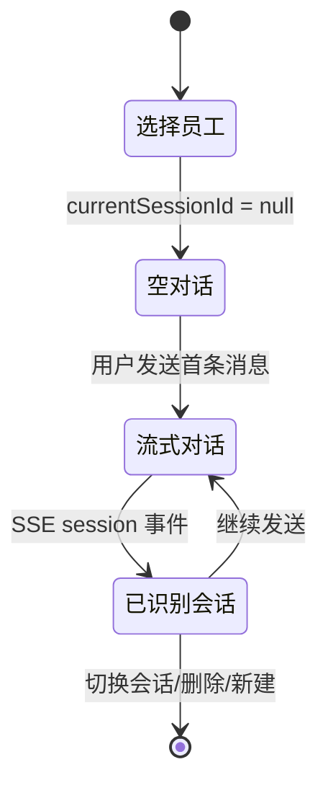

# 企业端 - 数字员工对话页

> 父文档：[00.模块总览.md](00.模块总览.md)
>
> 对应代码：`frontend/client/src/views/dashboard/ai-assistant/index.vue` · `frontend/client/src/views/dashboard/ai-assistant/components/*.vue` · `frontend/client/src/api/ai/index.ts` · `frontend/client/src/api/ai/chat-stream.ts` · `backend/app/modules/ai/api/client/chat.py` · `backend/app/modules/ai/api/client/session.py` · `backend/app/modules/ai/api/client/employee.py`

## 一、功能概述

数字员工对话页是企业端用户与 AI 数字员工交互的唯一工作区，提供：

- 选择数字员工（录单员 / 数据分析员 / 档案管理员等）
- 历史会话管理（新建 / 重命名 / 删除）
- 流式自然语言对话（SSE 9 类事件，含工具调用时间线）
- 高风险动作的内联确认（接 [02.高风险确认与权限.md](02.高风险确认与权限.md)）
- 文件附件上传（接 [03.附件与文件解析.md](03.附件与文件解析.md)）

## 二、需求详情

### 2.1 三栏布局

CSS Grid `grid-template-columns: 260px 1fr 280px`，高度 `calc(100vh - 120px)`，最小高度 500px。

#### 左栏（260px）

| 区块 | 组件 | 行为 |
|------|------|------|
| 数字员工列表 | `employee-list.vue` | 展示当前租户可见的数字员工；点击切换。切换后清空中栏 turns、重载会话列表与右栏工具列表 |
| 历史会话列表 | `session-list.vue` | 当前员工的会话；含「新建」/「重命名」/「删除」 |

#### 中栏（1fr）

自上而下：

1. **Header**：员工头像 + 名称 + 类型 Tag + 描述（员工无选中时灰色提示）。
2. **滚动区**：
   - 空对话：欢迎卡片（员工名 + welcomeMessage + suggestedQuestions chip 列表，点击 chip 直接发送）
   - 消息流：`message-bubble` 列表，按 turn 渲染（user 右、assistant 左，工具时间线嵌在 assistant 内）
   - 流式中提示：`数字员工正在思考…` + `中止` 按钮
3. **输入栏**：`chat-input.vue`，文本域 + 附件按钮 + 发送按钮。

#### 右栏（280px）

- 当前员工的可用工具列表（来自 `GET /ai/employee/{code}/tools`），只读。
- 每条展示工具名 + 描述；`riskLevel='high'` 显示「高风险」橙色 Tag。
- 视口宽度 < 1200px 自动隐藏（响应式 CSS）。

### 2.2 会话生命周期



- 「新建会话」：`currentSessionId = null` + 清空 turns；下次发送时由后端创建新 `biz_ai_session`。
- 「切换历史会话」：调 `GET /session/{id}/messages` 拉历史消息，`mergeMessagesToTurns` 把 user/assistant/tool 三种 role 聚合成 turn 形态展示。
- 「重命名」`PUT /session/{id}`，body `{ title }`，长度 ≤ 80。
- 「删除」`DELETE /session/{id}`（软删除，`is_deleted=1`）。

### 2.3 消息发送

发送动作 `handleSend({content, attachments})`：

1. 校验已选员工与非空内容。
2. 立即在 `turns` 中 push 两个 `reactive(turn)`：用户 turn + 占位 assistant turn（`pending=true`，`content=''`）。**必须用 `reactive()` 包装**，否则 SSE 回调里的 `assistantTurn.content += ...` 不会触发响应式更新。
3. 设 `streaming=true`，新建 `AbortController` 用于「中止」。
4. 调 `postChatStream({employeeCode, sessionId, content, attachments}, {signal, onEvent, onError, onDone})`。
5. SSE 回调按事件类型驱动 turn 状态（详见 §3）。
6. `onDone` 时调用 `flushTyper(assistantTurn, callback)`，等打字机队列吐空再清 `pending` 状态、刷新左栏会话列表。

### 2.4 中止

- 「中止」按钮调 `abortCtrl.abort()`，`fetch` 会抛 `AbortError`，`chat-stream.ts` 静默吞掉 AbortError 不再向 `onError` 报。
- 已经流过来的文本保留在 turn 里，`pending` 标记保持 false。

### 2.5 子组件契约

#### `employee-list.vue`

| 接口 | 类型 | 说明 |
|------|------|------|
| props.employees | `AiEmployee[]` | 数字员工列表 |
| v-model | `string` | 当前选中员工 code |
| emit 'update:modelValue' | `(code: string)` | 选择变更 |

#### `session-list.vue`

| 接口 | 类型 | 说明 |
|------|------|------|
| props.sessions | `AiSession[]` | 会话列表 |
| v-model | `number \| null` | 当前会话 ID |
| emit 'update:modelValue' | `(id: number)` | 选择变更 |
| emit 'new' | `()` | 新建空会话 |
| emit 'delete' | `(id: number)` | 删除会话 |
| emit 'rename' | `(id: number, title: string)` | 重命名 |

#### `message-bubble.vue`

| 接口 | 类型 | 说明 |
|------|------|------|
| props.turn | `ChatTurn` | 一个对话回合（user / assistant 二选一） |
| emit 'confirm' | `(entry: ToolCallEntry, approved: boolean)` | 工具时间线内的高风险确认/取消按钮 |

每个 turn 渲染：

- 头像 + 角色名 + 时间
- 文本 `content`（assistant 端支持 Markdown 渲染）
- `attachments` 列表（user）
- `toolCalls` 时间线（assistant）：每条调用展示 `tool_name + status` 标签，状态 `pending_confirm` 时附「确认 / 取消」按钮（详见 [02.高风险确认与权限.md](02.高风险确认与权限.md)）

#### `tool-call-item.vue`

`message-bubble.vue` 内部用于渲染 `toolCalls[]` 中的单条记录。状态枚举 `calling / success / failed / denied / cancelled / pending_confirm`，分别对应不同 Tag 颜色与图标。

#### `chat-input.vue`

| 接口 | 类型 | 说明 |
|------|------|------|
| props.disabled | boolean | 流式中或未选员工时禁用 |
| props.placeholder | string | — |
| emit 'send' | `({ content, attachments })` | 发送 |

行为：

- Enter 发送，Shift+Enter 换行
- 「附件」按钮触发隐藏 `<input type=file accept=".xlsx,.xls,.csv,.pdf,.png,.jpg,.jpeg">`
- 上传期间按钮 loading；上传完成把 `{fileId, name, size, mime}` push 到本地 attachments 列表
- 已选附件可以单个删除（`x` 图标）

## 三、SSE 事件协议（9 类）

引擎源代码：`backend/app/modules/ai/engine/streaming.py`、`backend/app/modules/ai/engine/orchestrator.py`。

> SSE 编码格式：`event: <name>\ndata: <json>\n\n`，UTF-8。前端 `parseSseChunk` 用 `\n\n` 分隔事件。

### 3.1 `session`

会话建立或识别。`/chat` 第一次发出；`/chat/confirm` 续跑也会发一条精简版。

```json
{
  "sessionId": 123,
  "sessionNo": "S-20260506-0001",
  "employeeCode": "form_recorder_default",
  "employeeName": "录单员小智"
}
```

前端动作：把 `sessionId` 同步到本地 `currentSessionId`，下次发送时回传作为同一会话续跑。

### 3.2 `message`

用户消息已落库。

```json
{ "role": "user", "message_id": 456, "content": "帮我录入这份运单" }
```

前端动作：当前实现未消费此事件（用户 turn 已在前端预 push）；保留供未来定位 / 编辑场景。

### 3.3 `delta`

LLM 文本增量（一次推几个字到一句话不等）。

```json
{ "content": "好的，" }
```

前端动作：调用 `pushDelta(assistantTurn, content)` 写入打字机缓冲，按 `tick()` 节奏吐到 `turn.content`。

### 3.4 `tool.call`

工具调用开始。

```json
{
  "tool_call_id": "call_abc123",
  "tool_code": "waybill.search",
  "tool_name": "waybill__search",
  "params": { "keyword": "陕A123" },
  "risk_level": "low"
}
```

> `params` 已经过脱敏处理（手机号、身份证、apiKey 等被 mask）。

前端动作：把 `ToolCallEntry{ status: 'calling', ... }` push 到 `assistantTurn.toolCalls[]`。

### 3.5 `tool.result`

工具执行结果。

```json
{
  "tool_call_id": "call_abc123",
  "tool_code": "waybill.search",
  "status": "success",
  "summary": "找到 3 条运单：...",
  "error": null,
  "latency_ms": 312
}
```

`status` 取值：

| 值 | 含义 |
|----|------|
| `success` | 正常返回 |
| `failed` | 工具执行抛错（含参数校验失败） |
| `denied` | PermissionGuard 拒绝 |
| `cancelled` | 高风险被用户取消 |

前端动作：在 `assistantTurn.toolCalls` 中按 `tool_call_id` 找到对应 entry，写入 `status / summary / error / latencyMs`。

### 3.6 `confirm.required`

高风险工具暂停，等待用户确认。详见 [02.高风险确认与权限.md](02.高风险确认与权限.md)。

```json
{
  "tool_call_id": "call_xyz789",
  "tool_code": "waybill.batch_create",
  "tool_name": "waybill__batch_create",
  "params": { "items": [/* ... */] },
  "confirm_token": "8b6c1f...",
  "risk_level": "high",
  "tip": "该操作将批量创建 25 条运单，请确认参数无误后执行"
}
```

### 3.7 `usage`

LLM 用量回报（部分 Provider 仅在末尾推一次；Kimi 默认不推，需在 Provider `extra_params` 显式 `include_usage=true`）。

```json
{ "prompt_tokens": 532, "completion_tokens": 128 }
```

前端动作：当前未在 UI 展示，远期可加在消息气泡角标位置。

### 3.8 `done`

一轮对话完成。

```json
{
  "message_id": 789,
  "finish_reason": "stop",
  "usage": { "prompt_tokens": 532, "completion_tokens": 128 }
}
```

`finish_reason`：

| 值 | 含义 |
|----|------|
| `stop` | LLM 自然结束 |
| `length` | 触发 `max_tokens` 截断 |
| `tool_calls` | LLM 决定调工具（实际由引擎吃掉这个状态再续跑，前端通常看不到） |
| `confirm_required` | 引擎因高风险暂停 |
| `max_tool_loops` | 工具循环超 `max_tool_loops`（默认 6）兜底退出 |

前端动作：调 `flushTyper(assistantTurn, () => assistantTurn.pending = false)`。

### 3.9 `error`

异常事件，与上述任何阶段并行。

```json
{ "message": "模型调用失败: BadRequestError: ...", "fallback": true }
```

前端动作：把错误信息追加到 `assistantTurn.content` 末尾（`[错误] ${message}`）；若 `fallback=true` 表示后端已先推过 `delta(兜底文本)`，错误信息只是补充原因。

## 四、打字机平滑层

### 4.1 设计动机

后端 `delta` 粒度参差不齐，Kimi/通义有时一次推半句中文，体验上像"卡顿+爆发"。打字机层把所有 delta 塞进字符队列，按固定 `setTimeout` 节奏吐出，缓冲堆积越多吐字越快，长回复也保持顺滑。

### 4.2 关键函数

源码位置：`frontend/client/src/views/dashboard/ai-assistant/index.vue`（166~226 行）。

```text
pushDelta(turn, text)
  - st = getTyper(turn)（WeakMap 按 turn 缓存）
  - st.buffer += text
  - 若无定时器则 startTyper

startTyper(turn, st)
  - tick():
      - 缓冲长度 len:
          len > 200 → take = min(len, 16)
          len > 80  → take = 6
          len > 30  → take = 3
          len > 10  → take = 2
          else      → take = 1
      - turn.content += st.buffer.slice(0, take)
      - 节流滚到底
      - setTimeout(tick, 24)  // ~42 fps，CJK 视觉舒适

flushTyper(turn, cb)
  - st.finished = true
  - 队列空 + 无定时器 → 立即 cb
  - 否则把 cb 注册到 st.onFlush，tick 把队列吐空时再调
```

### 4.3 与 SSE 的协作

- `delta` 事件 → `pushDelta` 入队
- `done` 事件 / `tool.result` 事件 / `error` 事件 → 等 `flushTyper` 的 `onFlush` 触发后再清 `pending` 标记，避免文本"忽然剩半句"。
- 「中止」按钮 → 直接 `abortCtrl.abort()`，已入队字符仍会继续吐到队列空（视觉上不会被截断）。

### 4.4 滚动节流

`scrollToBottomThrottled` 每 80ms 最多一次，避免每个 tick 都 `scrollTop = scrollHeight` 引发重排。

## 五、客户端 API 详细

### 5.1 数字员工

#### `GET /api/client/ai/employee`

列出当前租户可见的数字员工。当前实现 `EmployeeService.list_visible_for_user` 返回**所有 `status=1, is_deleted=0`** 的员工（暂未按 `feature_code` 进一步过滤）。

```json
{
  "code": 0,
  "data": {
    "list": [
      {
        "id": 1,
        "code": "form_recorder_default",
        "name": "录单员小智",
        "employeeType": "form_recorder",
        "description": "...",
        "avatar": "...",
        "welcomeMessage": "...",
        "suggestedQuestions": ["..."],
        "modelConfig": {}
      }
    ]
  }
}
```

#### `GET /api/client/ai/employee/{code}/tools`

列出某员工的可用工具（启用 + 已绑定 + `enabled=1`），按 `sort_order ASC, id ASC`。

```json
{
  "code": 0,
  "data": {
    "list": [
      {
        "code": "waybill.search",
        "name": "查询运单",
        "category": "waybill",
        "description": "...",
        "riskLevel": "low",
        "confirmRequired": false
      }
    ]
  }
}
```

### 5.2 会话

#### `GET /api/client/ai/session`

| 参数 | 说明 |
|------|------|
| page / limit | 默认 1 / 20 |
| employeeCode | 按数字员工筛选 |
| keyword | 标题 / 会话号模糊 |

返回当前**用户**的会话（`user_id = current.user_id`，租户内自然隔离）。

#### `GET /api/client/ai/session/{id}/messages?limit=200`

返回该会话所有消息（user/assistant/tool），按 `id ASC`。前端 `mergeMessagesToTurns` 把 tool 消息归到上一个 assistant turn。

#### `PUT /api/client/ai/session/{id}`

请求体 `{ title: string }`（≤80 字）；服务端校验 `session.user_id == current.user_id`。

#### `DELETE /api/client/ai/session/{id}`

软删除（`is_deleted=1`）。

### 5.3 对话流

#### `POST /api/client/ai/chat`

请求体（`ChatRequest`）：

```json
{
  "employeeCode": "form_recorder_default",
  "sessionId": 123,
  "content": "帮我查最近一周的运单",
  "attachments": [
    { "fileId": "uuid.xlsx", "name": "运单.xlsx", "size": 102400, "mime": "application/vnd..." }
  ]
}
```

`sessionId` 留空 → 后端按 `(user_id, employee_code)` 创建新会话。

响应：`Content-Type: text/event-stream`；前置错误（员工不存在 / 限流 / 配额超限 / 无可用 Provider）一律以 `event: error` 推送，避免被全局异常处理改成 200 JSON。响应头：

```
Cache-Control: no-cache, no-transform
X-Accel-Buffering: no   # nginx 关闭代理缓冲
Connection: keep-alive
```

#### `POST /api/client/ai/chat/confirm`

详见 [02.高风险确认与权限.md](02.高风险确认与权限.md)。

### 5.4 SDK 与 SSE 客户端

由于浏览器原生 `EventSource` 不支持 POST + 自定义 Header，前端用 fetch + ReadableStream 自解析（`frontend/client/src/api/ai/chat-stream.ts`）：

- 请求头带 `Accept: text/event-stream` + `${TOKEN_HEADER_NAME}: Bearer ${token}`。
- 响应 `Content-Type` 不为 `text/event-stream` 视为 JSON 业务错误，把 `message` 冒泡给 `onError`。
- 解析器按 `\n\n` 切事件，逐条 `event:` / `data:` 行拼装；`data` 多行用 `\n` 拼接后 `JSON.parse`，失败保留为字符串。
- `AbortError` 静默吞掉（用户主动中止）。

## 六、前端页面设计

- 路由：`/dashboard/ai-assistant`
- 主组件：`frontend/client/src/views/dashboard/ai-assistant/index.vue`（约 720 行 + 子组件 5 个）
- TS 类型：`frontend/client/src/api/ai/model/index.ts`，关键接口：
  - `AiEmployee` / `AiEmployeeTool` / `AiSession` / `AiMessage` / `AiAttachment`
  - `AiSseEvent` / `AiSseEventType`
  - `ToolCallEntry` / `ChatTurn`

页面交互要点：

- 切换员工 → 清空 `turns` 和 `currentSessionId`；右栏工具列表重新加载。
- 点击建议提问 chip 等价于 `handleSend({content: q, attachments: []})`。
- 历史会话切换 → `loadSessionMessages` 拉历史 + 重建 turns；附件、工具时间线一并复原。
- 流式中输入栏 disabled，避免并发发送。
- AbortController 在 `handleSend` 与 `handleToolConfirm` 共享同一变量，确保「中止」对当前流式有效。

## 七、测试要点

1. 切换员工后右栏工具列表立即更新；切回原员工显示历史会话。
2. 发送首条消息 → SSE `session` 事件回填 `currentSessionId`；后续消息复用同一会话。
3. 流式打字机：连续推 1000 字符 → 视觉吐字流畅，不会卡顿；缓冲 >200 时一帧吐 16 字符。
4. 工具调用：`waybill.search` 全程 `tool.call → tool.result(success)`，`assistantTurn.toolCalls[]` 长度 +1，`status` 由 `calling → success`。
5. 工具被拒绝（`PermissionGuard.check` 返回 deny）：收到 `tool.result(status=denied)`，UI 显示「拒绝」Tag + 原因。
6. 中止：流式中点「中止」→ 已写出文本保留，`pending=false`；不抛异常。
7. 重命名：`PUT /session/{id}` 成功后左栏会话标题立即更新。
8. 删除当前会话：`DELETE /session/{id}` → 自动 `startNewSession`（清空 turns，currentSessionId=null）。
9. 历史回放：切换到含工具调用的会话，工具时间线由 `tool` 消息正确归到上一个 assistant turn，`status` 默认 `success`。
10. 错误兜底：将 Provider apiKey 改错 → SSE 收到 `delta(兜底文本) + error(message=BadRequestError, fallback=true)`，UI 在文本末尾追加 `[错误] ...`。
11. 限流：1 分钟内连发 31 次 → 第 31 次 SSE 立即收到 `error(message=触发限流)`，前端 `[错误]` 提示。
12. 视口切到 < 1200px：右栏「可用工具」自动隐藏，中栏自适应展开。
