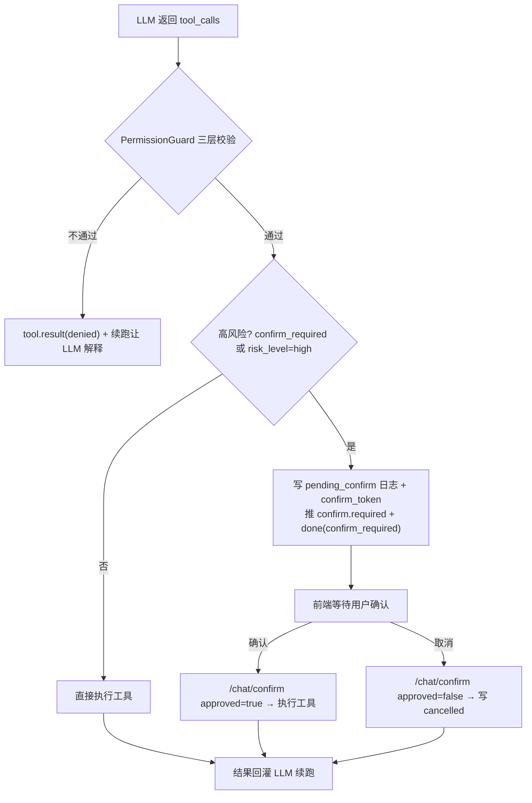
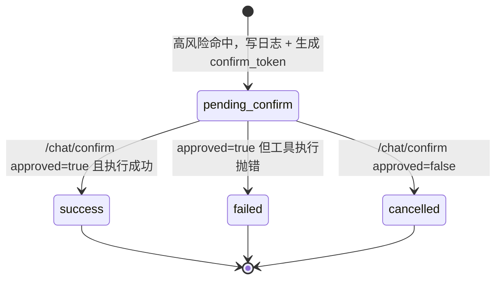
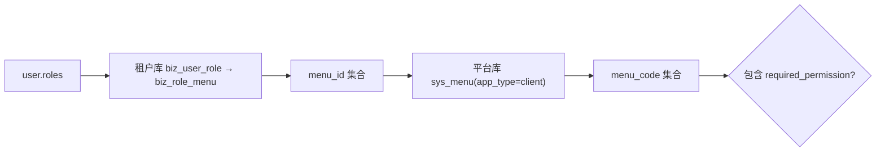

# 企业端 - 高风险确认与权限

> 父文档：[00.模块总览.md](00.模块总览.md)
>
> 对应代码：`backend/app/modules/ai/engine/orchestrator.py` · `backend/app/modules/ai/api/client/chat.py` · `backend/app/modules/ai/security/permission_guard.py` · `backend/app/modules/ai/security/quota.py` · `backend/app/modules/ai/security/desensitize.py` · `backend/app/modules/ai/models/tenant/biz_ai_tool_call_log.py` · `frontend/client/src/views/dashboard/ai-assistant/components/tool-call-item.vue` · `frontend/client/src/api/ai/chat-stream.ts`

## 一、功能概述

数字员工在对话中会自主决定调用工具（function calling）。为避免误操作和越权，引擎在每次工具调用前后设了两道闸门：

1. **权限守卫（PermissionGuard）**：三层校验，任一不过即 `denied`，不执行。
2. **高风险确认**：写库/改库/删库类工具执行前暂停，向用户推 `confirm.required`，用户在前端点「确认执行」后经 `/chat/confirm` 续跑。

配套的还有**限流与 Token 配额**（对话入口前置校验）、**日志脱敏**（参数/结果落库前 mask）、**工具调用日志**（细粒度审计）。



## 二、高风险判定

代码：`orchestrator.py:_dispatch_tool_call`

工具满足以下任一条件即视为高风险，需确认：

- `spec.confirm_required == True`
- `spec.risk_level == "high"`

判定顺序：先过 `PermissionGuard.check`（不通过直接 `denied`），再判高风险。当前唯一高风险工具是 `waybill.batch_create`（批量录入运单）。

## 三、confirm_token 状态机

高风险工具调用对应一条 `biz_ai_tool_call_log`，其 `status` 承载状态机，`confirm_token`（`uuid4().hex`）作为一次待确认的唯一凭据。



- `pending_confirm` 记录含 `params`（脱敏后）、`tool_code`、`tool_call_id`、`message_id`、`confirm_token`。
- 续跑时按 `confirm_token + status=pending_confirm + is_deleted=0` 精确查回该日志；查不到返回 `error`（「未找到待确认的工具调用或已超时」）。
- `approved=true` 分支执行工具时 `_execute_tool` 会**另写一条**成功/失败日志（原 pending 记录 `status` 置为占位的 `success`）。

## 四、确认续跑 API

### 4.1 `confirm.required` 事件（SSE）

高风险暂停时推送，随后紧跟一条 `done(finish_reason=confirm_required)` 结束本轮流。

```json
{
  "tool_call_id": "call_xyz789",
  "tool_code": "waybill.batch_create",
  "tool_name": "waybill__batch_create",
  "params": { "rows": [/* 已脱敏 */] },
  "confirm_token": "8b6c1f...",
  "risk_level": "high",
  "tip": "该操作风险较高，请确认后再执行。可在前端调用 /api/client/ai/chat/confirm 完成确认。"
}
```

### 4.2 `POST /api/client/ai/chat/confirm`

请求体（`ConfirmRequest`）：

| 字段 | 类型 | 说明 |
|------|------|------|
| `sessionId` | int | 会话 ID |
| `confirmToken` | string | `confirm.required` 事件下发的 token |
| `approved` | bool | `true`=确认执行 / `false`=取消，默认 `true` |

响应：同 `/chat` 的 `text/event-stream`。引擎 `resume_after_confirm`：

- **`approved=true`**：装配历史（含 pending 时已落的 `assistant.tool_calls`）→ 执行工具 → 推 `tool.result` → 把结果作为 `tool` 消息回灌 → 进入下一轮 LLM，直至 `done`。
- **`approved=false`**：写一条 `cancelled` 日志 + `tool` 消息（`{cancelled:true, reason:"用户取消执行"}`）→ 推 `tool.result(cancelled)` → 续跑让 LLM 给出友好回复。

> 续跑同样是多轮工具循环，若途中又命中高风险，会再次 `confirm.required + done(confirm_required)`。

## 五、PermissionGuard 三层校验

代码：`security/permission_guard.py`。任一层不过抛 `PermissionException`，引擎转成 `tool.result(status=denied)` 并把原因作为 `tool` 消息回灌，让 LLM 向用户解释。

| 层 | 校验内容 | 不通过原因 |
|:--:|---------|-----------|
| 1 | 工具启用 + 员工启用 | 「工具 {code} 已停用」/「数字员工 {code} 已停用」 |
| 2 | 数字员工白名单：工具须在该 employee 的 `ai_employee_tool` 绑定内且 `enabled=1` | 「数字员工「{name}」未授权调用工具「{tool}」」 |
| 3 | 用户菜单权限：`spec.required_permission` 须在用户拥有的 `menu_code` 集合内 | 「当前用户缺少权限码 {perm}，无法调用工具「{tool}」」 |

### 5.1 用户菜单权限反查

仅当工具声明了 `required_permission` 时才校验（如 `waybill.batch_create` → `biz:waybill:add`）：



- 为避免跨库 JOIN，分两步查：先在租户库拿 `menu_id`，再到平台库映射 `menu_code`。
- **管理员放行**：`user_type=1`（平台管理员）/ `user_type=2`（租户管理员）直接通过第 3 层。
- 反查异常（如租户库连接问题）按「无权限」保守处理。

## 六、限流与 Token 配额

代码：`security/quota.py`。在 `/chat` 进入编排前置校验，超限以 SSE `error` 事件返回（不改成普通 JSON，避免前端解析空内容）。配置项存 `sys_platform_setting`。

| 配置项 | 默认 | 说明 | 超限错误 |
|--------|:----:|------|---------|
| `ai.rate_limit_per_minute` | 30 | 用户级每分钟对话次数（进程内滑动窗口） | `BizException(code=42901)`「对话过于频繁」 |
| `ai.token_daily_limit_per_tenant` | 0（不限） | 租户级当日 Token 上限（`prompt+completion`，按 `biz_ai_session` 实时聚合） | `BizException(code=42902)`「今日 Token 用量已达上限」 |
| `ai.fallback_message` | 「服务暂时繁忙…」 | 模型调用异常时的兜底回复 | — |

> 限流为进程内滑窗，**多实例部署需后续接 Redis**。Token 配额按自然日、以 `last_message_at=today` 聚合。

### 6.1 兜底回复

当 LLM Provider 调用抛异常（apiKey 错误、超时等），引擎先推 `delta(fallback_message)` 再推 `error(fallback=true, message=真实原因)`，保证用户至少看到一句可读回复。

## 七、日志脱敏

代码：`security/desensitize.py`。参数/结果在**推 SSE 前**与**落库前**都会经 `desensitize_obj` 递归处理：

| 类型 | 规则 |
|------|------|
| 手机号 | `1XX****XXXX` |
| 身份证 | 前 6 + `********` + 后 4 |
| 银行卡 | 前 4 + `****` + 后 4 |
| 敏感键 | `password/passwd/pwd/api_key/apikey/token/secret` 的值整体替换为 `***` |

## 八、工具调用日志（审计）

代码：`models/tenant/biz_ai_tool_call_log.py`。每次工具被**尝试**调用都记一行（含被拒/待确认/取消），供运营端「调用观测」跨租户审计。

| 字段 | 说明 |
|------|------|
| `session_id` / `message_id` / `tool_call_id` | 关联会话、触发的 assistant 消息、LLM 侧调用 ID |
| `tool_code` / `tool_name` | 工具编码与名称 |
| `user_id` | 发起会话的用户 |
| `params` | 调用参数（**脱敏后**） |
| `result_summary` | 结果摘要（截断 + 脱敏） |
| `status` | `success / failed / denied / pending_confirm / cancelled` |
| `error_message` | 错误信息 |
| `latency_ms` | 执行耗时 |
| `confirm_token` | 待确认状态下的凭据 |

## 九、前端交互

代码：`components/tool-call-item.vue` + `api/ai/chat-stream.ts:postChatConfirm`。

- 工具时间线卡片按 `status` 显示不同图标/颜色：`calling(转圈) / pending_confirm(警告) / success(勾) / failed·denied(叉) / cancelled(减号)`。
- `riskLevel==='high'` 显示橙色「高风险」Tag。
- `status==='pending_confirm'` 时卡片底部出现**确认操作栏**：「取消」/「确认执行」，分别 `emit('confirm', false|true)`。
- 面板 `handleToolConfirm(entry, approved)` 调 `postChatConfirm({sessionId, confirmToken, approved})`，复用同一套 SSE 回调渲染续跑结果；与「发送」共享同一 `AbortController`，「中止」对确认续跑同样有效。

## 十、测试要点

1. 触发 `waybill.batch_create` → 收到 `confirm.required` + `done(confirm_required)`，卡片进入「待确认」并显示操作栏。
2. 点「确认执行」→ `/chat/confirm(approved=true)` → `tool.result(success)` → LLM 汇总入库结果；日志新增一条 `success`。
3. 点「取消」→ `/chat/confirm(approved=false)` → `tool.result(cancelled)`，LLM 给出「已取消」回复；日志 `cancelled`。
4. 过期/无效 `confirm_token` → `error`「未找到待确认的工具调用或已超时」。
5. 停用某工具后调用 → `tool.result(denied)`，原因「工具 {code} 已停用」。
6. 非管理员用户调用带 `required_permission` 的工具且无对应菜单 → `denied`，原因含权限码；管理员（`user_type=1/2`）放行。
7. 1 分钟内连发超过 `ai.rate_limit_per_minute` → 立即 `error(code=42901)`。
8. 设 `ai.token_daily_limit_per_tenant>0` 且当日已超 → `error(code=42902)`。
9. 参数含手机号/身份证/apiKey → SSE `params` 与日志 `params` 均已脱敏。
10. Provider apiKey 改错 → 收到 `delta(兜底文本) + error(fallback=true)`。
