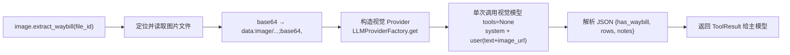
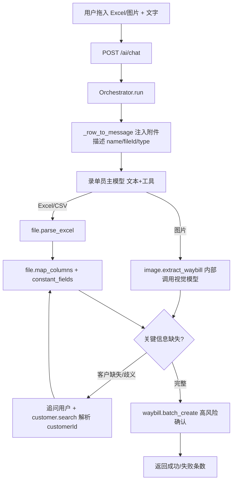

# 企业端 - 附件与文件解析

> 父文档：[00.模块总览.md](00.模块总览.md)
>
> 对应代码：`backend/app/modules/ai/api/client/file.py` · `backend/app/modules/ai/engine/context.py` · `backend/app/modules/ai/tools/file_tools.py` · `backend/app/modules/ai/tools/image_tools.py` · `backend/app/modules/ai/tools/waybill_tools.py` · `frontend/client/src/views/dashboard/ai-assistant/components/chat-input.vue` · `frontend/client/src/api/ai/index.ts`

## 一、功能概述

本文档描述**录单员小智**的核心链路：用户拖入 Excel/CSV 表格或运单图片，数字人提取关键信息、缺失时主动追问、经用户确认后批量入库。

三条能力线：

| 能力线 | 入口工具 | 说明 |
|--------|---------|------|
| 表格录单 | `file.parse_excel` → `file.map_columns` → `waybill.batch_create` | 解析表头 → 字段映射（可整批回填常量）→ 批量入库 |
| 图片录单 | `image.extract_waybill` → `waybill.batch_create` | 视觉大模型识别运单 → 抽取结构化行 → 批量入库 |
| 追问澄清 | `customer.search` | 客户等关键信息缺失/歧义时停下追问，反查真实 `customerId` 后回填 |

> 设计原则：**又快又准，绝不臆造**。信息不全时数字人必须主动追问，而不是猜测或跳过。

## 二、附件上传

### 2.1 上传约束

代码：`backend/app/modules/ai/api/client/file.py`

| 项 | 值 |
|----|----|
| 接口 | `POST /api/client/ai/file/upload`（`multipart/form-data`，字段名 `file`） |
| 允许类型 | `.xlsx` / `.xls` / `.csv` / `.pdf` / `.png` / `.jpg` / `.jpeg` |
| 大小上限 | 20MB（`MAX_AI_ATTACH_SIZE`） |
| 落盘目录 | `backend/uploads/ai_attach/{uuid}{ext}` |
| 鉴权 | 租户 JWT（`get_current_user`） |

### 2.2 返回结构

```json
{
  "code": 0,
  "data": {
    "fileId": "3f2a...e1.xlsx",
    "name": "运单表.xlsx",
    "size": 102400,
    "mime": "application/vnd.openxmlformats-officedocument.spreadsheetml.sheet"
  }
}
```

- `fileId` = `{uuid.hex}{原始扩展名}`，即落盘文件名，后续所有解析工具都用它定位文件。
- 前端封装：`frontend/client/src/api/ai/index.ts:uploadAiAttach(file)` → `POST /ai/file/upload`。
- 上传成功后前端把 `{fileId, name, size, mime}` push 到 `chat-input.vue` 的本地 `attachments`，随下一条消息一并发送。

### 2.3 纯附件发送

- 前端 `chat-input.vue` 允许「只传附件、不打字」发送（发送按钮在 `text` 为空但有附件时仍可点）。
- 后端 `ChatRequest.content` 已放开空值（`schemas/client/chat.py`），仅要求「内容与附件不能同时为空」，纯附件不再被 422 拒绝。

## 三、附件注入上下文（关键机制）

> **为什么需要它**：附件仅落库不够——大模型只读消息文本，若不把附件信息拼进用户消息，模型拿不到 `fileId`，就无法调用解析工具。

代码：`backend/app/modules/ai/engine/context.py`

### 3.1 注入时机

`Orchestrator.run()` 先把用户消息（含 `attachments`）落库，再由 `ContextManager.load_history_messages` 装配上下文；`_row_to_message()` 在 `role=="user"` 且有附件时，把附件清单追加到该条消息文本末尾。由于刚落库的用户消息也在历史内，**当前轮次即可生效**。

### 3.2 注入格式

```
用户本次上传了以下附件（excel/csv 附件请调用 file.parse_excel(file_id=...) 解析后再做字段映射；image 附件请调用 image.extract_waybill(file_id=...) 识别运单信息；）：
[附件] name=运单表.xlsx | fileId=3f2a...e1.xlsx | type=excel
[附件] name=单据.jpg | fileId=7b9c...d2.jpg | type=image
```

### 3.3 类型推断

`_infer_attach_type(name, mime)` 先按文件名后缀，再按 mime 兜底，产出逻辑类型：

| type | 触发条件 | 建议工具 |
|------|---------|---------|
| `excel` | `.xlsx` / `.xls` 或 mime 含 spreadsheet/excel | `file.parse_excel` |
| `csv` | `.csv` 或 mime 含 csv | `file.parse_excel` |
| `image` | `.png/.jpg/.jpeg/.webp/.bmp/.gif` 或 mime `image/*` | `image.extract_waybill` |
| `pdf` | `.pdf` 或 mime 含 pdf | （暂无解析工具，见 §八 待办） |
| `file` | 其它 | — |

> 注入的是**纯文本描述**（不含图片字节）。图片字节只在 `image.extract_waybill` 内部单次调用视觉模型时才 base64 送出，既省 token，又规避主对话模型视觉能力的不确定性。

## 四、文件解析工具（Excel/CSV）

代码：`backend/app/modules/ai/tools/file_tools.py`

### 4.1 `file.parse_excel`

| 项 | 说明 |
|----|------|
| 入参 | `file_id`、`sheet_name`（可选）、`max_preview_rows`（默认 20，1~200） |
| 出参 | `headers`、`rows`（预览）、`total_rows`、`sheet_names`（Excel）、`current_sheet` |
| 实现 | `.csv` 用标准库 `csv`（`utf-8-sig`）；`.xlsx/.xls` 用 `openpyxl`（`read_only + data_only`） |
| 安全 | `_resolve_safe_path` 拒绝含 `/ \ ..` 的 `file_id`，防路径穿越 |

### 4.2 `file.map_columns`

| 项 | 说明 |
|----|------|
| 入参 | `file_id`、`column_mapping`（源列名 → 目标字段名）、`constant_fields`（可选）、`sheet_name`、`max_rows`（默认 500，1~2000） |
| 出参 | `rows`（目标字段行列表）、`row_count`、`unknown_source_columns`、`constant_fields_applied` |

**`constant_fields`（本次新增）**：整批统一填充的常量字段，合并进每一行且**不覆盖行内已有同名字段**。典型用于「追问确认客户后统一回填 `customerId`」：

```json
{
  "file_id": "3f2a...e1.xlsx",
  "column_mapping": { "起点": "origin", "终点": "destination", "车架号": "cargoes" },
  "constant_fields": { "customerId": 12 }
}
```

## 五、图片运单识别（视觉大模型）

代码：`backend/app/modules/ai/tools/image_tools.py`

### 5.1 `image.extract_waybill`

| 项 | 说明 |
|----|------|
| 入参 | `file_id`（图片）、`hint`（可选，如用户已说明客户/单据类型） |
| 出参 | `has_waybill`（bool）、`confidence`、`rows`（对齐 `WaybillRow`）、`row_count`、`notes` |
| 支持格式 | `.png/.jpg/.jpeg/.webp/.bmp/.gif` |

### 5.2 内部流程



- 视觉能力隔离在工具内部：主对话模型只需支持 function calling 的**文本模型**。
- 依赖 `ChatMessage.content` 的多模态支持（`str | list[dict]`，见 `llm/base.py`）：图片以 `{"type":"image_url","image_url":{"url": dataUrl}}` 送入。
- JSON 解析鲁棒（`_extract_json` 容错 markdown 代码块 / 前后缀文字）。

### 5.3 视觉模型配置（部署必读）

视觉模型来自录单员 `model_config_json`，经 `Orchestrator` 透传到 `ToolContext.extras["model_config"]`：

| 键 | 说明 |
|----|------|
| `vision_provider_code` | 视觉模型 Provider 编码，须与 Console「模型 Provider」已配置的 `code` 一致（如 `qwen-vl`） |
| `vision_model` | 覆盖该 Provider 的模型名（如 `qwen-vl-max`），须为支持图片输入的多模态模型 |

未配置时工具返回明确错误，提示管理员在 Console 补配。

## 六、录单工作流

录单员的 `system_prompt` 内置字段字典、双流程与澄清协议（见 `backend/scripts/seed/seed_ai_employees.py:FORM_RECORDER_SYSTEM_PROMPT`）。

### 6.1 运单目标字段字典

`file.map_columns` 目标字段名 / `waybill.batch_create` 行字段名（对齐 `WaybillRow`）：

| 字段 | 含义 | 备注 |
|------|------|------|
| `waybillNo` | 运单号 | 不填则系统生成 |
| `customerId` / `customerName` | 客户ID / 名称 | `customerId` 优先，见澄清规则 |
| `origin` / `destination` | 出发地 / 目的地 | — |
| `vehicleBrand` / `vehicleModel` / `vin` / `quantity` | 品牌 / 车型 / 车架号 / 数量 | — |
| `cargoes` | 货物明细数组 | 每行 `{vehicleBrand, vehicleModel, vin, quantity:1}`；整车物流建议用此字段，**每辆车一行且须带 VIN（10~50 位）** |
| `dealerName` / `dealerContact` / `dealerPhone` / `dealerAddress` | 经销商信息 | — |
| `freightAmount` / `remark` | 运费金额 / 备注 | — |

### 6.2 端到端流程



### 6.3 追问澄清规则

- 客户信息缺失或无法唯一确定时，**必须停下追问**「这批运单是哪个客户的」，不得瞎填或跳过。
- 用户给出客户后调 `customer.search` 反查确认，拿到真实 `customerId` 再回填（Excel 用 `constant_fields`，图片直接写进每行 `customerId`）。
- `customer.search` 命中多个 → 列候选让用户选定；命中 0 个 → 提示核对名称或先建客户。
- 原因：`WaybillService.create_waybill` 直接写 `customer_id`，**不会**按 `customerName` 反查，客户不落 `customerId` 会导致自动计费与收入归属主体缺失。

### 6.4 高风险确认

`waybill.batch_create`（`risk_level=high, confirm_required=True`）入库前推 `confirm.required`，用户在客户端确认后经 `/chat/confirm` 续跑。详见 [02.高风险确认与权限.md](02.高风险确认与权限.md)。

## 七、部署与上线操作

1. Console「模型 Provider」新增/确认视觉模型 Provider，并把录单员 `model_config` 的 `vision_provider_code / vision_model` 改为实际值。
2. 启动一次后端，让 `@register_tool` 反射把 `image.extract_waybill` 同步进 `ai_tool` 表。
3. 执行 `python scripts/fix/update_form_recorder.py`，把新 `system_prompt`/`model_config`/工具绑定同步到**已存在**的录单员记录（`seed_ai_employees.py` 幂等，不覆盖已存在员工）。

## 八、待办（后续件）

对应 [需求-代码落地差距清单](../../../05.开发计划/需求-代码落地差距清单.md) §2.5：

| 项 | 状态 | 说明 |
|----|:----:|------|
| PDF 运单识别 | 📋 | PDF 转图后走视觉识别（当前 PDF 可上传但无解析工具） |
| 表格 → 多业务对象 | 📋 | 除运单外支持车辆/客户等批量建档 |
| 识别结果行内可编辑 | 📋 | 前端在入库前对抽取行做人工微调 |

## 九、测试要点

1. 拖入含完整信息的运单 Excel → `parse_excel → map_columns → batch_create` 确认后入库成功。
2. 拖入缺客户列的 Excel → 模型追问客户 → 回答后 `customer.search` 命中 → `constant_fields` 回填 `customerId` → 入库。
3. 上传运单截图 → `image.extract_waybill` 返回 `has_waybill=true` 并抽取行 → 入库；上传无关图片 → 返回 `has_waybill=false`，模型明确告知「未识别到运单信息」。
4. 纯附件（空文本）发送不再被后端 422 拒绝。
5. 未配置视觉模型时上传图片 → `image.extract_waybill` 返回明确的「未配置视觉模型」错误提示。
6. `file_id` 含 `..` / 路径分隔符 → 解析工具返回「非法 file_id」，不发生路径穿越。
7. `map_columns` 的 `constant_fields` 不覆盖行内已有同名字段（行内 `customerId` 优先于常量）。
