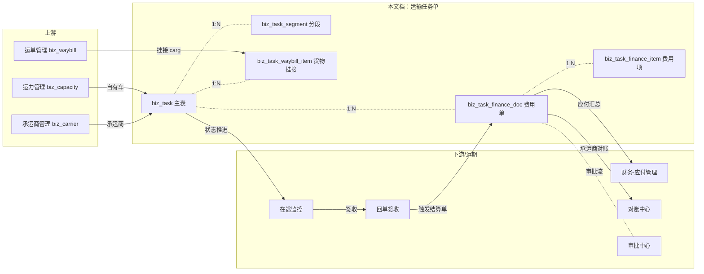
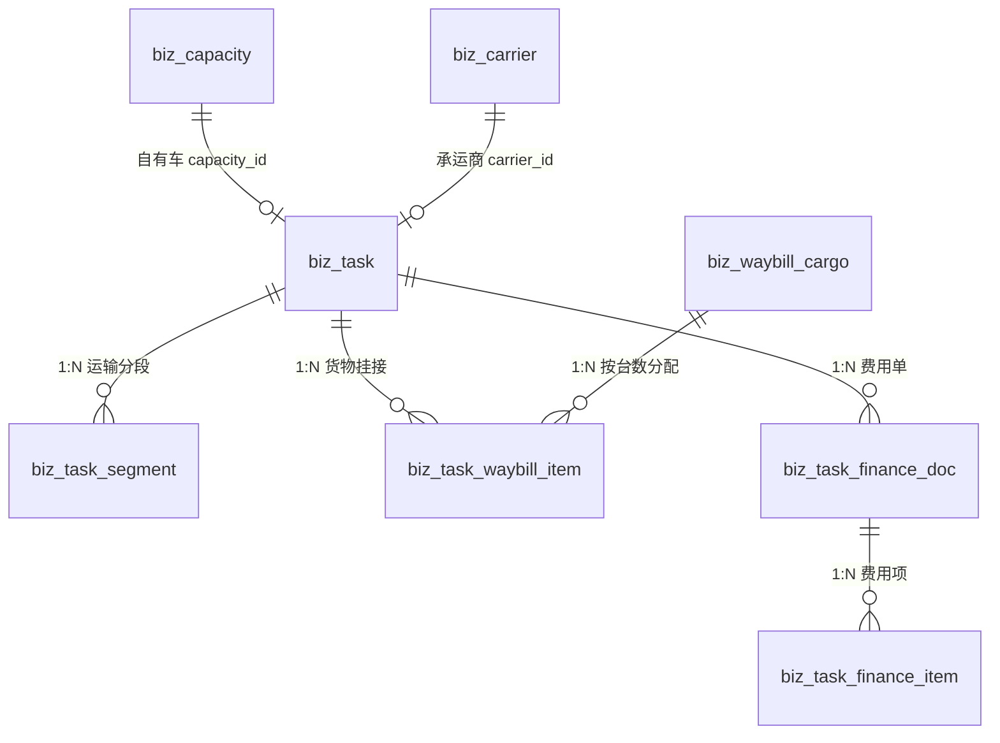

# 企业端运营调度模块 - 运输任务单管理

> **所属阶段**：阶段五 - 企业端运营调度模块
>
> **文档状态**：方案确认（首版）
>
> **创建日期**：2026-05-16
>
> **优先级**：高（核心业务闭环）
>
> **关联文档**：
> - 同目录 `00.模块总览.md`（待建）
> - 同目录 [02.运单与任务单状态机联动设计](02.运单与任务单状态机联动设计.md)
> - 同目录 [03.任务单调令设计](03.任务单调令设计.md)
> - 《02.企业端/05.业务模块-运单管理.md》
> - 《02.企业端/02.资源管理模块/01.车辆管理.md》、`02.驾驶员管理.md`
> - 《02.企业端/05.合作伙伴模块/02.承运商管理.md》
> - 《02.企业端/01.客户端菜单架构重构设计.md》（v2.0）
>
> **⚠️ 概念升级提示**：本文档（v1）中的「**分段 / `biz_task_segment` / `segment_no`**」已在后续迭代重构升级为「**调令 / `biz_task_dispatch_order` / `order_no`**」，并新增了调令类型（重驶 / 空驶 / 年检 / 应急 / 其他）等能力。本文档 §3.2 / §4.3 等处的"分段"内容请以 [03.任务单调令设计](03.任务单调令设计.md) 为准。

## 一、功能概述

运输任务单（以下简称「任务单」，英文 `Task`）是物流公司**调度环节的核心单据**。运单录入后，调度员将多张运单（或单张运单的部分台数）组合成一张任务单，**确定由谁运输哪些货物走哪条线**，并以任务单为单位完成派车、装卸、在途、到达、签收的全过程。

核心设计原则：

- **运单与任务单 M:N 按台数拆分**：一张运单的 cargo 行可拆分到多张任务单（同一品牌车型 10 台中，5 台走任务 T1、5 台走 T2），通过 `biz_task_waybill_item` 中间表 + `allocated_quantity` 维护剩余可分配台数
- **支持真分段路线**：一个任务单可有 N 段运输（A→B→C→D），每段独立装卸/到达时间与状态，便于多段中转、跨车队接驳、未来分段费用归集
- **承运信息归一化**：主表用 `carrier_type` 枚举（1-自有车 / 2-承运商 / 3-社会运力）+ 三个可选外键（capacity_id / carrier_id / social_driver_id），同时冷冻关键快照（主驾姓名/电话/车牌/承运商名称）防止上游变动影响历史数据
- **任务单与财务费用单解耦**：一个任务单可挂多张财务费用单（预付单 / 中途补款单 / 结算单），费用项明细可在数据字典中维护；自有车场景收款方=司机/司机账户，承运商场景收款方=承运商/承运商结算账户

## 二、业务背景

### 2.1 核心业务诉求

1. **调度闭环**：物流公司每天产生大量运单，必须将运单组装成"一辆车一趟运输"的任务单才能真正发运。任务单是连接「运单（计划/收入）」与「运力（车+司机/承运商）」、再到「财务（成本/支付）」的中枢
2. **多源承运**：自营车占主力，但承运商外协 + 社会运力补充是常态；不同承运方式的派车、跟踪、结算路径不同，但需要统一在任务单层面表达
3. **分段运输**：商品车物流常见"A 厂出发 → B 中转仓 → C 4S 店"，每段独立装卸；纯卡车甩挂、接驳同样如此。任务单必须能承载多段
4. **沿途费用与最终结算解耦**：司机出车前需要预付油费/路桥费，中途可能补款，最终凭回单结算。3 种费用单的时点/审批/收款逻辑不同，但都必须能精准回溯到原始任务单与承运方

### 2.2 与其他模块的关系



### 2.3 现有代码基础

| 模块 | 现状 |
|------|------|
| 运单 `biz_waybill` + `biz_waybill_cargo` | 已开发（[backend/app/modules/client/models/waybill/](backend/app/modules/client/models/waybill/)） |
| 运力 `biz_capacity`（司机+车辆绑定） | 已开发 |
| 承运商 `biz_carrier` + `biz_carrier_settlement` | 已开发 |
| 驾驶员 `biz_driver` + `biz_driver_account` | 已开发 |
| **任务单 / 财务费用单** | **完全未实现，本模块新建** |

本文档负责的核心工作：**全新搭建任务单模块 + 财务费用单子模块**，并在 `biz_waybill_cargo` 上扩展 `allocated_quantity` 字段以承载按台数拆分。

## 三、需求详情

### 3.1 任务单列表

- 分页表格展示，支持按创建时间倒序
- 列字段：任务单号、任务名称、客户/线路（起点→终点）、台数总计、承运方式（Tag：自有/承运商/社会）、承运资源（主驾+车牌 / 承运商名）、计划装车/到达时间、状态（Tag）、已预付金额、操作
- 关键字搜索：任务单号、主驾姓名、车牌号、承运商名称
- 筛选：承运方式、状态、客户、线路（起点/终点关键字）、创建时间区间
- 工具栏：新增任务单、批量取消（仅 status≤1 时允许）
- 行操作：详情、编辑（status=0/1）、派车（status=0）、取消、删除

### 3.2 新增 / 编辑任务单

弹窗 / 抽屉宽度 960px。分为 3 个区域：

#### 3.2.1 基础与线路

| 字段 | 说明 | 规则 |
|------|------|------|
| 任务单号 | 系统自动生成（如 `T20260516001`），可手动覆盖 | 选填，租户内唯一 |
| 任务名称 | 简要描述 | 选填，便于列表识别 |
| 计划装车时间 | 首段计划装车时间 | 必填 |
| 计划到达时间 | 末段计划到达时间 | 选填 |
| 备注 | 备注信息 | 选填 |

**运输分段子表**（至少 1 段，最多 5 段）：

| 列 | 说明 |
|----|------|
| 段序号 | 1,2,3... 自动 |
| 起点 | 地区选择器 / 自由文本 |
| 终点 | 同上 |
| 计划装车时间 | 日期选择 |
| 计划到达时间 | 日期选择 |
| 公里数 | 选填（远期自动从路线管理回填） |
| 操作 | 上移/下移/删除 |

> 主表 `origin / destination` 自动取段 1 的起点和末段的终点冗余。

#### 3.2.2 货物挂接（多个运单按台数）

挂接器分左右两栏：

- 左栏：候选运单 cargo 行（按客户/起终点过滤剩余可分配台数 > 0 的运单）
- 右栏：当前任务单已挂接列表

挂接表格列：

| 列 | 说明 |
|----|------|
| 运单号 | 来自 biz_waybill |
| 客户 | 冗余 |
| 品牌/车型 | 来自 biz_waybill_cargo |
| 运单原台数 | 该 cargo 行总台数 |
| 已分配台数 | 该 cargo 行被其他任务单已分配台数 |
| 剩余可分配 | 原台数-已分配-当前已分配 |
| 本任务分配台数 | 必填，数值，>0 且 ≤剩余 |
| 收车门店 | 冗余 |
| 归属段 | 下拉选择 1/2/3...（默认 NULL = 跟随主任务） |
| 操作 | 移除 |

#### 3.2.3 承运方信息

承运方式（Radio）：**自有车 / 承运商 / 社会运力**，根据选择展示不同表单：

**A. 自有车**

| 字段 | 说明 |
|------|------|
| 运力 | 从 `biz_capacity` 选择（仅 status=1 绑定中的运力），展示"司机姓名 + 车牌号" |
| 主驾姓名/电话/车牌 | 自动回填，可手动编辑（冗余快照） |

**B. 承运商**

| 字段 | 说明 |
|------|------|
| 承运商 | 从 `biz_carrier` 选择（仅 status=1） |
| 承运商联系人/电话 | 自动回填 |
| 实际驾驶员/车牌 | 选填手动文本（用于跟踪记录，不强校验） |

**C. 社会运力**（占位）

| 字段 | 说明 |
|------|------|
| 司机姓名 | 必填手动文本 |
| 司机电话 | 必填 |
| 车牌号 | 必填 |
| 身份证号 | 选填 |

**承运成本**（可选，三种承运方式通用）：

| 字段 | 说明 |
|------|------|
| 承运成本类型 | 包车 / 按台 / 按吨公里 / 其他（字典 carrier_cost_type） |
| 承运成本总额 | 数值，2 位小数 |
| 成本备注 | 文本 |

### 3.3 派车与状态推进

- 创建任务单时若已选择承运方 → `status = 1 已派车`
- 创建时未选承运方 → `status = 0 待派车`，后续可通过「派车」按钮再次设置
- 状态推进通过 API 或前端按钮触发：

```
-1 待分配 → 0 待派车 → 1 已派车 → 2 已装车 → 3 在途 → 4 已到达 → 5 已签收 → 7 已关闭
                                                                       9 已取消（终态）
```

> **重要（2026-06）**：原 `6 已结算` 已从任务状态机**彻底移除**——财务结算与 `task.status` 解耦，财务侧只维护 `task.settled_amount / prepaid_amount / supplement_amount / contracted_amount` 冗余金额。状态空间现为 `-1/0/1/2/3/4/5/7/9`（无 6）。详见 [02.运单与任务单状态机联动设计](02.运单与任务单状态机联动设计.md) 与代码 [`task_state_machine.py`](../../../../backend/app/modules/client/services/state_machine/task_state_machine.py)。
>
> - `1→2 已装车`、`3→4 已到达`、`4→5 已签收` 均为**聚合态**：由装卸记录 / 挂接行签收自动驱动，不接受外部 `update_status` 人工推进。

- `status ∈ {-1,0,1,2}` 时可取消（→9），自动释放 `waybill_cargo.allocated_quantity`
- `5 已签收` 后只能"关闭"（→7）
- 状态推进时校验：例如 `2 已装车` 要求至少一个分段进入"装车中"或"已卸车"

### 3.4 货物挂接的台数原子校验

- 新增/更新挂接时，Service 层在事务内：
  1. 锁定 `biz_waybill_cargo` 行（`SELECT ... FOR UPDATE`）
  2. 计算 `allocated = SUM(task_waybill_item.quantity WHERE waybill_cargo_id=X AND status<3)`
  3. 校验 `allocated + 本次新增 ≤ cargo.quantity`，否则抛 `BizException("可分配台数不足")`
  4. 写入 `task_waybill_item` 后，更新 `cargo.allocated_quantity = allocated + 本次新增`
- 取消挂接 / 取消任务单 → 同步把对应台数从 `cargo.allocated_quantity` 中减回

### 3.5 财务费用单

#### 3.5.1 费用单类型

| doc_type | 名称 | 业务含义 |
|----------|------|---------|
| 1 | 预付单 | 司机出车前的油费、路桥费、餐补等预付资金 |
| 2 | 补款单 | 中途补款（油费追加、突发停车修理等） |
| 3 | 结算单 | 任务完成后的最终结算（一般有且只有一张 is_final=1 的结算单） |
| 4 | 承包单 | 承包制司机的周期承包费（收款人限司机、必填结算周期，与结算单互斥） |

> 承包单业务规则与司机承包结算配置见 [07.财务结算模块/06.任务级承包单与司机承包结算](../07.财务结算模块/06.任务级承包单与司机承包结算.md)。

#### 3.5.2 收款对象

- `payee_type=1 司机` —— 自有车场景，`payee_id = driver_id`，可选 `payee_account_id = biz_driver_account.id`
- `payee_type=2 承运商` —— 承运商场景，`payee_id = carrier_id`，可选 `payee_account_id = biz_carrier_settlement.id`
- `payee_type=3 其他` —— 社会运力或临时收款人，使用自由文本字段（payee_name + payee_bank_account_masked）

> 创建费用单时默认根据任务单 `carrier_type` 推断收款人：自有车 → 取主驾司机 + 默认账户；承运商 → 取承运商 + `is_default=1` 结算账户。

#### 3.5.3 费用单状态机

```
0 草稿 → 1 待审批 → 2 已审批 → 3 已支付
   │        │          │
   │        │          └─ cancel_payment(3→2) / force_cancel(3→4)（高权限，需原因）
   └────────┴──────────→ 4 已撤销（未支付：cancel_doc，需原因≥5字）
      2 → 0 退回草稿（withdraw_to_draft）
```

> 状态切换统一走 `FinanceStateMachine` 校验并写 `biz_finance_doc_event` 审计事件（见 [07.财务结算模块/01.通用基座](../07.财务结算模块/01.财务单据体系与业务单据联动设计.md)）。

- 状态 `2 已审批` 后才能进入支付流程
- 支付时录入 `actual_amount` / `pay_method` / `actual_pay_time` / `pay_voucher_url`（凭证）
- 结算单 `is_final=1` 且状态变为 `3 已支付` 时，**锁定** `task.is_locked=1`（保护成本字段），**不再推进** `task.status`（"已结算" 枚举已移除）；撤销支付需走高权限 `cancel_payment` / `force_cancel` 并解锁
- 现金 / 微信 / 支付宝（`pay_method ∈ {4,5,6}`）支付时 `pay_voucher_url` 必填

#### 3.5.4 费用项明细

每张费用单可挂多条费用项：

- `item_type` 取自数据字典 `expense_type`（油费/过路费/装卸费/停车费/餐补/维修费/其他）
- 可填 `quantity + unit + unit_price`（如 50 升 × 8.5 元/升 = 425 元）也可直接录入总金额
- 应用层校验：若 quantity 与 unit_price 均填写，则 `amount ≈ quantity × unit_price`（允许 0.01 误差）

#### 3.5.5 财务聚合冗余

任务单主表维护以下冗余金额（Service 在费用单状态变化时同步更新）：

- `prepaid_amount`：所有"预付单（doc_type=1, status=3 已支付）"的 actual_amount 累加
- `supplement_amount`：所有"补款单（doc_type=2, status=3）"的 actual_amount 累加
- `settled_amount`：所有"结算单（doc_type=3, status=3）"的 actual_amount 累加
- `contracted_amount`：所有"承包单（doc_type=4, status=3）"的 actual_amount 累加
- `finance_doc_count`：所有未撤销（status≠4）的费用单计数
- `is_locked` / `locked_at` / `locked_by_doc_id`：最终结算单支付后置位（成本字段保护）

### 3.6 删除

- 软删除（`is_deleted=1`），仅 `status ∈ {0 待派车, 9 已取消}` 时允许
- 任务单删除时，关联的 segments / waybill_items / finance_docs 联动软删
- 删除前如果存在 status≠4 的费用单 → 提示先处理费用单

## 四、数据模型设计

所有表位于租户业务库（`zt_biz_{tenant_code}`），`__table_tier__ = "business"`。

### 4.1 数据表关系图



### 4.2 `biz_task` 任务单主表

| 字段 | 类型 | 必填 | 说明 |
|------|------|------|------|
| id | BIGINT PK | 是 | 自增主键 |
| task_no | VARCHAR(50) UK | 是 | 任务单号，租户内唯一 |
| task_name | VARCHAR(100) | 否 | 任务名称 |
| source | SMALLINT | 是 | 来源：1-手动 2-AI 智能调度 3-导入，default 1 |
| **carrier_type** | SMALLINT | 是 | **1-自有车 2-承运商 3-社会运力，default 1** |
| capacity_id | BIGINT | 否 | 自有运力 ID（biz_capacity.id），carrier_type=1 时建议必填 |
| carrier_id | BIGINT | 否 | 承运商 ID（biz_carrier.id），carrier_type=2 时建议必填 |
| social_driver_id | BIGINT | 否 | 社会运力司机 ID（社会运力池模块落地后补全外键，本期占位） |
| main_driver_name | VARCHAR(50) | 否 | 主驾姓名（冷冻快照） |
| main_driver_phone | VARCHAR(20) | 否 | 主驾电话（冷冻快照） |
| main_driver_id_card | VARCHAR(20) | 否 | 主驾身份证号（社会运力时常用） |
| plate_number | VARCHAR(20) | 否 | 车牌号（冷冻快照） |
| trailer_plate_number | VARCHAR(20) | 否 | 挂车车牌（冷冻快照） |
| carrier_name | VARCHAR(100) | 否 | 承运商名称（冷冻快照） |
| carrier_short_name | VARCHAR(50) | 否 | 承运商简称（冷冻快照） |
| origin | VARCHAR(255) | 否 | 起点（段 1.from 冗余） |
| origin_code | VARCHAR(20) | 否 | 起点编码 |
| origin_region_id | BIGINT | 否 | 起点行政区 ID |
| destination | VARCHAR(255) | 否 | 终点（末段.to 冗余） |
| destination_code | VARCHAR(20) | 否 | 终点编码 |
| destination_region_id | BIGINT | 否 | 终点行政区 ID |
| segment_count | SMALLINT | 是 | 分段数量，default 1 |
| total_quantity | INT | 是 | 总台数（task_waybill_item.quantity 之和，冗余），default 0 |
| waybill_count | INT | 是 | 关联运单数（去重），default 0 |
| planned_load_time | DATETIME | 否 | 计划装车时间（段 1） |
| planned_arrive_time | DATETIME | 否 | 计划到达时间（末段） |
| actual_load_time | DATETIME | 否 | 实际装车时间 |
| actual_arrive_time | DATETIME | 否 | 实际到达时间 |
| carrier_cost_amount | DECIMAL(12,2) | 否 | 承运成本总额 |
| carrier_cost_type | SMALLINT | 否 | 承运成本类型 1-包车 2-按台 3-按吨公里 4-其他 |
| cost_remark | VARCHAR(255) | 否 | 成本备注 |
| prepaid_amount | DECIMAL(12,2) | 是 | 已预付金额（冗余），default 0 |
| supplement_amount | DECIMAL(12,2) | 是 | 已补款金额（冗余），default 0 |
| settled_amount | DECIMAL(12,2) | 是 | 已结算金额（冗余），default 0 |
| finance_doc_count | INT | 是 | 费用单数量（冗余），default 0 |
| status | SMALLINT | 是 | -1-待分配 0-待派车 1-已派车 2-已装车 3-在途 4-已到达 5-已签收 7-已关闭 9-已取消（**6 已结算已移除**） |
| dispatcher_id | BIGINT | 否 | 调度员 user_id |
| dispatcher_name | VARCHAR(50) | 否 | 调度员姓名（冗余） |
| remark | TEXT | 否 | 备注 |
| created_at / updated_at / is_deleted | — | — | 标准三件套 |

**索引**：
- `UK uk_task_no (task_no)`
- `idx_status (status)`
- `idx_carrier_type (carrier_type)`
- `idx_capacity_id (capacity_id)`、`idx_carrier_id (carrier_id)`
- `idx_planned_load_time (planned_load_time)`

### 4.3 `biz_task_segment` 任务运输分段表

| 字段 | 类型 | 必填 | 说明 |
|------|------|------|------|
| id | BIGINT PK | 是 | 自增主键 |
| task_id | BIGINT | 是 | 关联 biz_task.id |
| segment_no | SMALLINT | 是 | 段序号 1,2,3... |
| from_location | VARCHAR(255) | 否 | 起点名称 |
| from_code | VARCHAR(20) | 否 | 起点编码 |
| from_region_id | BIGINT | 否 | 起点行政区 ID |
| to_location | VARCHAR(255) | 否 | 终点名称 |
| to_code | VARCHAR(20) | 否 | 终点编码 |
| to_region_id | BIGINT | 否 | 终点行政区 ID |
| mileage | DECIMAL(8,2) | 否 | 段公里数 |
| planned_load_time | DATETIME | 否 | 计划装车时间 |
| planned_arrive_time | DATETIME | 否 | 计划到达时间 |
| actual_load_time | DATETIME | 否 | 实际装车时间 |
| actual_arrive_time | DATETIME | 否 | 实际到达时间 |
| status | SMALLINT | 是 | 0-待装车 1-装车中 2-在途 3-已到达 4-已卸车，default 0 |
| remark | VARCHAR(255) | 否 | 备注 |
| created_at / updated_at / is_deleted | — | — | 标准三件套 |

**索引**：
- `idx_task_id (task_id)`
- `uk_task_segment (task_id, segment_no)`（唯一）

### 4.4 `biz_task_waybill_item` 任务-运单货物挂接表

| 字段 | 类型 | 必填 | 说明 |
|------|------|------|------|
| id | BIGINT PK | 是 | 自增主键 |
| task_id | BIGINT | 是 | 关联 biz_task.id |
| waybill_id | BIGINT | 是 | 关联 biz_waybill.id |
| waybill_cargo_id | BIGINT | 是 | 关联 biz_waybill_cargo.id（最小单位） |
| waybill_no | VARCHAR(50) | 否 | 运单号（冗余） |
| customer_id | BIGINT | 否 | 客户 ID（冗余） |
| customer_name | VARCHAR(100) | 否 | 客户名称（冗余） |
| vehicle_brand | VARCHAR(100) | 否 | 商品车品牌（冗余） |
| vehicle_model | VARCHAR(100) | 否 | 商品车型号（冗余） |
| dealer_name | VARCHAR(200) | 否 | 收车门店（冗余） |
| quantity | INT | 是 | 本任务分到的台数（>0） |
| segment_id | BIGINT | 否 | 可选指定走某段 |
| status | SMALLINT | 是 | 0-待装车 1-已装车 2-已卸车 3-已签收，default 0 |
| loaded_at | DATETIME | 否 | 装车时间 |
| unloaded_at | DATETIME | 否 | 卸车时间 |
| signed_at | DATETIME | 否 | 签收时间 |
| remark | VARCHAR(255) | 否 | 备注 |
| created_at / updated_at / is_deleted | — | — | 标准三件套 |

**索引**：
- `idx_task_id (task_id)`、`idx_waybill_id (waybill_id)`、`idx_waybill_cargo_id (waybill_cargo_id)`
- `idx_status (status)`

### 4.5 `biz_waybill_cargo` 字段扩展

> 现有表，本期仅追加 1 列。

| 字段 | 类型 | 必填 | 说明 |
|------|------|------|------|
| **allocated_quantity** | INT | 是 | **已分配到任务单的台数（冗余），default 0** |

应用层维护原子约束：`allocated_quantity + 新增分配 ≤ quantity`。

### 4.6 `biz_task_finance_doc` 任务单财务费用单

| 字段 | 类型 | 必填 | 说明 |
|------|------|------|------|
| id | BIGINT PK | 是 | 自增主键 |
| task_id | BIGINT | 是 | 关联 biz_task.id |
| doc_no | VARCHAR(50) UK | 是 | 单据编号（系统生成，如 `FP202605160001`） |
| doc_type | SMALLINT | 是 | 1-预付单 2-补款单 3-结算单 |
| is_final | SMALLINT | 是 | 是否最终结算单（仅 doc_type=3 可为 1），default 0 |
| payee_type | SMALLINT | 是 | 1-司机 2-承运商 3-其他 |
| payee_id | BIGINT | 否 | driver_id 或 carrier_id |
| payee_name | VARCHAR(100) | 否 | 收款人名称（冗余） |
| payee_account_type | SMALLINT | 否 | 0-未指定 1-driver_account 2-carrier_settlement 3-自由文本 |
| payee_account_id | BIGINT | 否 | driver_account.id 或 carrier_settlement.id |
| payee_bank_name | VARCHAR(100) | 否 | 开户行（冗余） |
| payee_bank_account_masked | VARCHAR(50) | 否 | 银行账号脱敏（冗余） |
| planned_amount | DECIMAL(12,2) | 是 | 计划金额 |
| actual_amount | DECIMAL(12,2) | 否 | 实际支付金额（已支付后填） |
| currency | VARCHAR(8) | 是 | 币种，default 'CNY' |
| pay_method | SMALLINT | 否 | 1-银行转账 2-油卡 3-油气款 4-现金 5-微信 6-支付宝 |
| planned_pay_time | DATETIME | 否 | 计划支付时间 |
| actual_pay_time | DATETIME | 否 | 实际支付时间 |
| pay_voucher_url | VARCHAR(500) | 否 | 支付凭证图片 URL |
| status | SMALLINT | 是 | 0-草稿 1-待审批 2-已审批 3-已支付 4-已撤销，default 0 |
| created_by | BIGINT | 否 | 创建人 user_id |
| reviewed_by | BIGINT | 否 | 审批人 user_id |
| reviewed_at | DATETIME | 否 | 审批时间 |
| paid_by | BIGINT | 否 | 付款操作人 user_id |
| approval_no | VARCHAR(50) | 否 | 关联审批单（远期对接审批中心） |
| remark | TEXT | 否 | 备注 |
| created_at / updated_at / is_deleted | — | — | 标准三件套 |

**索引**：
- `UK uk_doc_no (doc_no)`
- `idx_task_id (task_id)`、`idx_doc_type (doc_type)`、`idx_status (status)`
- `idx_payee (payee_type, payee_id)`

### 4.7 `biz_task_finance_item` 费用项明细表

| 字段 | 类型 | 必填 | 说明 |
|------|------|------|------|
| id | BIGINT PK | 是 | 自增主键 |
| finance_doc_id | BIGINT | 是 | 关联 biz_task_finance_doc.id |
| item_type | VARCHAR(30) | 是 | 数据字典 `expense_type` 的 key（oil/toll/loading/parking/meal/repair/other） |
| item_name | VARCHAR(50) | 否 | 字典 label（冗余） |
| quantity | DECIMAL(10,2) | 否 | 数量（如 50 升） |
| unit | VARCHAR(20) | 否 | 单位（升/公里/趟/次） |
| unit_price | DECIMAL(10,2) | 否 | 单价 |
| amount | DECIMAL(12,2) | 是 | 该项金额（>0） |
| sort_order | INT | 是 | 排序，default 0 |
| remark | VARCHAR(255) | 否 | 备注 |
| created_at / updated_at / is_deleted | — | — | 标准三件套 |

**索引**：
- `idx_finance_doc_id (finance_doc_id)`

### 4.8 数据字典扩展

需在数据字典中新增 3 个字典组（执行 seed 脚本时由 `seed_client_dicts.py` 自动写入）：

| 字典编码 | 字典名称 | 字典项 |
|----------|---------|--------|
| `expense_type` | 费用项类型 | oil 油费 / toll 过路费 / loading 装卸费 / parking 停车费 / meal 餐补 / repair 维修费 / other 其他 |
| `pay_method` | 支付方式 | bank_transfer 银行转账 / fuel_card 油卡 / fuel_gas 油气款 / cash 现金 / wechat 微信 / alipay 支付宝 |
| `carrier_cost_type` | 承运成本类型 | charter 包车 / per_unit 按台 / per_ton_km 按吨公里 / other 其他 |

> 任务单状态、费用单状态、carrier_type 等参与业务逻辑判断，由代码常量定义，**不入字典**。

### 4.9 需变更/新建的代码文件

| 操作 | 文件路径 | 变更内容 |
|------|---------|---------|
| **新建** | `backend/app/modules/client/models/task/__init__.py` | 导出 5 个模型 |
| **新建** | `backend/app/modules/client/models/task/task.py` | `Task` ORM |
| **新建** | `backend/app/modules/client/models/task/task_segment.py` | `TaskSegment` ORM |
| **新建** | `backend/app/modules/client/models/task/task_waybill_item.py` | `TaskWaybillItem` ORM |
| **新建** | `backend/app/modules/client/models/task/task_finance_doc.py` | `TaskFinanceDoc` ORM |
| **新建** | `backend/app/modules/client/models/task/task_finance_item.py` | `TaskFinanceItem` ORM |
| **修改** | `backend/app/modules/client/models/waybill/waybill_cargo.py` | 追加 `allocated_quantity INT DEFAULT 0` |
| **修改** | `backend/app/modules/client/models/__init__.py` | 导入新增模型 |
| **新建** | `backend/app/modules/client/schemas/task/__init__.py` | 统一导出 |
| **新建** | `backend/app/modules/client/schemas/task/task.py` | TaskCreate/Update/Out/ListItem 等 |
| **新建** | `backend/app/modules/client/schemas/task/task_segment.py` | Segment Schema |
| **新建** | `backend/app/modules/client/schemas/task/task_waybill_item.py` | Item Schema |
| **新建** | `backend/app/modules/client/schemas/task/task_finance_doc.py` | Finance Doc Schema |
| **新建** | `backend/app/modules/client/schemas/task/task_finance_item.py` | Finance Item Schema |
| **新建** | `backend/app/modules/client/services/task/__init__.py` | 服务统一导出 |
| **新建** | `backend/app/modules/client/services/task/task_service.py` | 主体 CRUD、派车、状态推进 |
| **新建** | `backend/app/modules/client/services/task/task_waybill_item_service.py` | 货物挂接 + 台数校验 |
| **新建** | `backend/app/modules/client/services/task/task_finance_service.py` | 费用单 CRUD + 状态机 + 冗余聚合 |
| **新建** | `backend/app/modules/client/api/task/__init__.py` | 路由聚合 |
| **新建** | `backend/app/modules/client/api/task/task.py` | 主接口（含 segments / items 子路径） |
| **新建** | `backend/app/modules/client/api/task/task_finance.py` | 费用单接口 |
| **修改** | `backend/app/modules/client/api/__init__.py` | 注册 `/operation/task` 与 `/operation/task-finance` 路由 |
| **新建** | `frontend/client/src/api/operation/task/index.ts`、`model/index.ts` | 前端 API + TS 类型 |
| **新建** | `frontend/client/src/api/operation/task-finance/index.ts`、`model/index.ts` | 费用单 API |
| **新建** | `frontend/client/src/views/operation/task/index.vue` | 列表 |
| **新建** | `frontend/client/src/views/operation/task/components/*` | 编辑/详情/挂接器等 |
| **新建** | `frontend/client/src/views/operation/task-finance/index.vue` | 费用单列表 |
| **新建** | `frontend/client/src/views/operation/task-finance/components/*` | 费用单创建/编辑 |
| **修改** | `backend/scripts/platform_sync/snapshots/product_feature.json` | 新增 biz_task / biz_task_finance |
| **修改** | `backend/scripts/platform_sync/snapshots/version_feature.json` | standard/pro 增加新 feature |
| **修改** | `backend/scripts/platform_sync/snapshots/client_menu.json` | 新增菜单（任务管理 + 任务费用） |
| **修改** | `backend/scripts/seed/seed_client_dicts.py` | 新增 3 个字典组 |

## 五、API 设计

所有接口前缀：`/api/client/operation`，需要 JWT 认证。

### 5.1 任务单主接口

| 方法 | 路径 | 说明 |
|------|------|------|
| GET | `/task` | 分页查询任务单（含承运/线路/状态筛选） |
| GET | `/task/{id}` | 详情（聚合 segments + waybill_items + finance docs 摘要） |
| GET | `/task/check-task-no` | 任务单号唯一性校验 |
| POST | `/task` | 创建任务单（请求体含 segments / waybillItems / 承运方信息） |
| PUT | `/task/{id}` | 编辑（status=0/1 时允许） |
| DELETE | `/task/{id}` | 软删（仅 status=0/9） |
| PUT | `/task/{id}/status` | 推进状态（带流转校验） |
| POST | `/task/{id}/assign-carrier` | 派车（设置承运方） |
| POST | `/task/{id}/cancel` | 取消任务单（释放台数） |
| GET | `/task/candidate-waybills` | 可挂接运单 cargo 行列表（按客户/起终点/剩余台数过滤） |
| GET | `/task/{id}/waybill-items` | 当前挂接列表 |
| POST | `/task/{id}/waybill-items` | 批量挂接（事务校验台数） |
| PUT | `/task/waybill-items/{itemId}` | 更新挂接（状态/段绑定） |
| DELETE | `/task/waybill-items/{itemId}` | 取消挂接（释放台数） |
| GET | `/task/{id}/segments` | 段列表 |
| PUT | `/task/segments/{segId}/status` | 更新段状态 |

### 5.2 财务费用单接口

| 方法 | 路径 | 说明 |
|------|------|------|
| GET | `/task-finance` | 分页查询费用单（跨任务单） |
| GET | `/task-finance/{docId}` | 费用单详情（含 items） |
| GET | `/task-finance/by-task/{taskId}` | 某任务单的费用单列表 |
| POST | `/task-finance/by-task/{taskId}` | 创建费用单（含 items） |
| PUT | `/task-finance/{docId}` | 编辑（仅 status=0/1） |
| DELETE | `/task-finance/{docId}` | 软删（仅 status=0/4） |
| POST | `/task-finance/{docId}/submit` | 提交审批（→ status=1） |
| POST | `/task-finance/{docId}/approve` | 审批通过（→ status=2） |
| POST | `/task-finance/{docId}/pay` | 标记已支付（→ status=3，含凭证） |
| POST | `/task-finance/{docId}/cancel` | 撤销（→ status=4） |

### 5.3 关键请求体示例

**创建任务单**（`POST /task`）：

```json
{
  "taskNo": "T20260516001",
  "taskName": "北京-上海乘用车任务",
  "carrierType": 1,
  "capacityId": 12,
  "carrierCostType": 1,
  "carrierCostAmount": 8500.00,
  "costRemark": "包车价含来回",
  "plannedLoadTime": "2026-05-17T08:00:00",
  "plannedArriveTime": "2026-05-19T18:00:00",
  "segments": [
    {
      "segmentNo": 1,
      "fromLocation": "北京市顺义区",
      "fromCode": "110113",
      "toLocation": "上海市浦东新区",
      "toCode": "310115",
      "mileage": 1200,
      "plannedLoadTime": "2026-05-17T08:00:00",
      "plannedArriveTime": "2026-05-19T18:00:00"
    }
  ],
  "waybillItems": [
    { "waybillId": 101, "waybillCargoId": 202, "quantity": 5 },
    { "waybillId": 101, "waybillCargoId": 203, "quantity": 3 }
  ],
  "remark": ""
}
```

**创建费用单**（`POST /task-finance/by-task/{taskId}`）：

```json
{
  "docType": 1,
  "payeeType": 1,
  "payeeId": 5,
  "payeeAccountType": 1,
  "payeeAccountId": 8,
  "plannedAmount": 800.00,
  "plannedPayTime": "2026-05-17T07:30:00",
  "items": [
    { "itemType": "oil", "quantity": 50, "unit": "升", "unitPrice": 8.5, "amount": 425.00 },
    { "itemType": "toll", "amount": 300.00 },
    { "itemType": "meal", "amount": 75.00 }
  ],
  "remark": "出车前预付"
}
```

## 六、前端页面设计

### 6.1 任务单管理

- **路由**：`/operation/task`
- **入口组件**：`views/operation/task/index.vue`
- **子组件**：
  - `components/task-search.vue` 搜索条
  - `components/task-edit.vue` 创建/编辑（含 3 个区域）
  - `components/task-detail.vue` 详情（状态时间轴 + 货物列表 + 段进度 + 费用单 Tab）
  - `components/task-segment-table.vue` 分段子表
  - `components/task-cargo-picker.vue` 货物挂接器（左侧候选 / 右侧已选）
  - `components/task-carrier-picker.vue` 承运方面板（按 carrier_type 切换）
  - `components/task-status-tag.vue` 状态 Tag 组件

### 6.2 任务费用

- **路由**：`/operation/task-finance`
- **入口组件**：`views/operation/task-finance/index.vue`（跨任务单的费用单中心）
- **子组件**：
  - `components/finance-edit.vue` 创建/编辑（含 items 子表 + 收款人 / 账户选择器）
  - `components/finance-detail.vue` 详情 + 状态流转
  - `components/finance-item-table.vue` 费用项子表
  - `components/payee-picker.vue` 收款人选择器（按 payee_type 切换）

### 6.3 菜单结构

```
运营调度 (operation)
├── 运单管理         /operation/waybill        biz_waybill         （已有）
├── 智能调度         /operation/dispatch       biz_dispatch        （已有）
├── 运输任务单       /operation/task           biz_task            ← 本期新增
├── 任务费用         /operation/task-finance   biz_task_finance    ← 本期新增
├── 在途监控         /operation/tracking       biz_tracking        （已有）
└── 回单签收         /operation/receipt        biz_receipt         （已有）
```

按钮级权限：

- `operation:task:list / add / edit / delete / dispatch / cancel`
- `operation:task-finance:list / add / approve / pay / cancel`

## 七、菜单与产品版本注册

### 7.1 `product_feature.json` 新增

```json
{
  "feature_code": "biz_task",
  "feature_name": "运输任务单",
  "module": "operation",
  "required_tables": ["biz_task", "biz_task_segment", "biz_task_waybill_item"],
  "sort_order": 34,
  "status": 1
},
{
  "feature_code": "biz_task_finance",
  "feature_name": "任务单财务费用",
  "module": "operation",
  "required_tables": ["biz_task_finance_doc", "biz_task_finance_item"],
  "sort_order": 35,
  "status": 1
}
```

### 7.2 `version_feature.json` 调整

`standard` / `pro` 数组中追加 `biz_task` 与 `biz_task_finance`。lite 版本不含。

### 7.3 `client_menu.json` 新增

在 `parent_id=191`（运营调度）下追加：

- 「运输任务单」`menu_code: operation:task` `path: /operation/task` `component: /operation/task/index` `feature_code: biz_task`
  - 子按钮：`list / add / edit / delete / dispatch / cancel`
- 「任务费用」`menu_code: operation:task-finance` `path: /operation/task-finance` `component: /operation/task-finance/index` `feature_code: biz_task_finance`
  - 子按钮：`list / add / approve / pay / cancel`

> 新菜单 id 从 400 起递增（当前最大 id 为 364）。

### 7.4 执行命令

```bash
cd backend

# 1) 字典新增（已在 seed_client_dicts.py 中追加 3 组）
python -m scripts.seed.seed_client_dicts

# 2) 产品功能与版本映射
python scripts/seed/seed_product_features.py

# 3) 客户端菜单
python scripts/seed/seed_client_menus.py

# 4) 重建开发企业库（创建新表）
python -m scripts.init.init_dev_env --reset
```

## 八、测试要点

### 8.1 任务单 CRUD 与状态推进

1. 创建任务单：必填校验（计划装车时间、至少 1 段、至少 1 条挂接），任务单号自动生成
2. 任务单号唯一性校验
3. 编辑：status=0/1 时允许；status≥2 时主表字段大部分锁定
4. 删除：仅 status=0/9 允许，软删时段/挂接/费用单联动软删
5. 状态推进：0→1→2→3→4→5→7 各节点（1→2/3→4/4→5 为聚合态）+ 9 取消的合法跳转校验

### 8.2 货物挂接

6. 候选运单过滤：客户/起终点/剩余可分配台数
7. 一张运单 cargo 行（10 台）拆分到 2 个任务单（5+5）：剩余台数实时变化
8. 单条挂接超出剩余 → 抛错
9. 并发挂接：同一 cargo 行被两个事务同时分配，应有一方失败
10. 取消挂接 / 取消任务单 → cargo.allocated_quantity 正确回滚

### 8.3 分段

11. 单段任务：自动生成 1 段，主表 origin/destination 与段同步
12. 多段任务：最多 5 段，段序号自动递增；任务主表 origin = 段 1.from，destination = 末段.to
13. 段状态独立推进

### 8.4 承运方

14. 自有车：选择 capacity_id 后冷冻 driver/plate 快照；之后即使运力解绑也不影响任务单
15. 承运商：选择 carrier_id 后冷冻 carrier_name 快照
16. 社会运力：手动录入司机姓名/电话/车牌 + 身份证

### 8.5 财务费用单

17. 自有车任务 → 创建预付单：默认带出主驾司机 + 默认账户
18. 承运商任务 → 创建预付单：默认带出承运商 + is_default 结算账户
19. 一张任务单挂多张费用单：预付 1 + 补款 1 + 结算 1
20. 费用项明细：油费/过路费/装卸费分项；amount 与 quantity*unit_price 一致性校验
21. 状态机：0→1→2→3 路径 + 0→4、1→4、2→4 撤销路径校验
22. 已支付的结算单（is_final=1）**锁定** task.is_locked=1（不推进 task.status；6 已结算已移除）；撤销支付后解锁
23. 任务单 prepaid/supplement/settled 冗余金额随支付/撤销实时更新

### 8.6 菜单与权限

24. 执行种子脚本后，「运营调度」下出现「运输任务单」与「任务费用」菜单
25. standard 版本企业可见，lite 版本不可见
26. 按钮级权限正确分配（如未分配 `operation:task:dispatch` 时派车按钮不可见）

## 九、远期演进锚点

| 远期能力 | 本文档预留 |
|---------|-----------|
| 审批中心集成 | 费用单 `approval_no` 字段预留，状态 1 待审批 触发审批流 |
| 智能调度 AI 推荐 | 任务单 `source=2` 标识，预留 dispatch_id 关联 |
| 跨段费用归集 | 费用项已有 `task_id` + 远期可加 `segment_id` |
| 对账中心-任务单维度对账 | 费用单 `payee_id / payee_type` 已可作为对账主键 |
| 自动结算单生成 | 任务完成 → 基于运价合同/成本规则触发，本期手动 |
| 与回单签收联动 | task_waybill_item.status=3 已签收 由回单模块写入 |
| 移动端调度 App | API 已按 RESTful 设计，可复用 |
