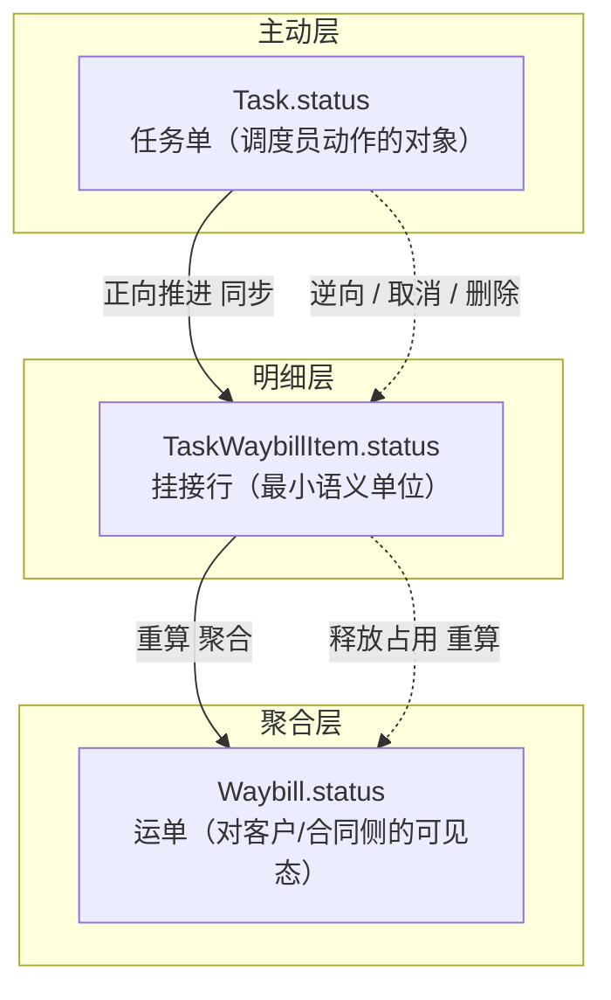
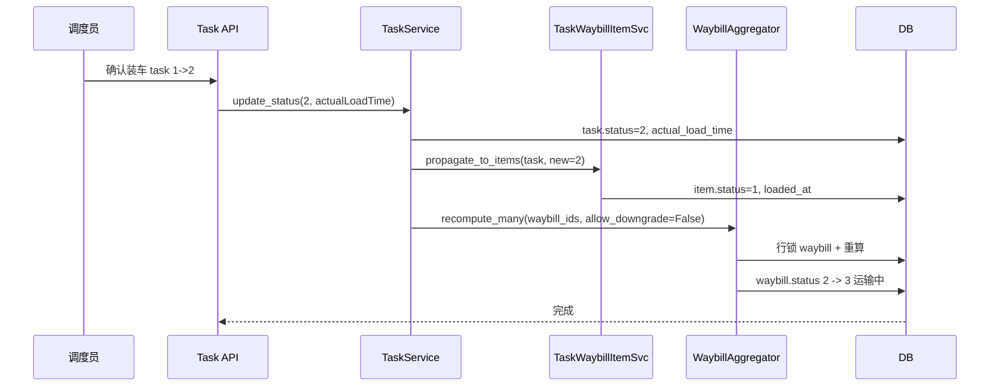
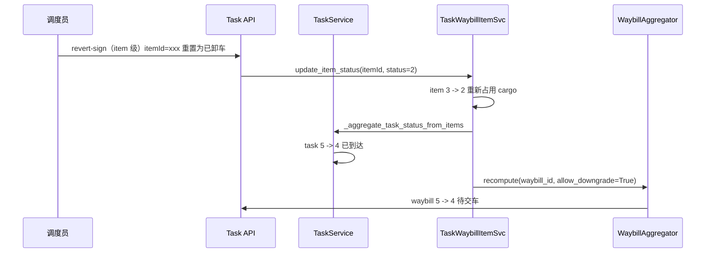
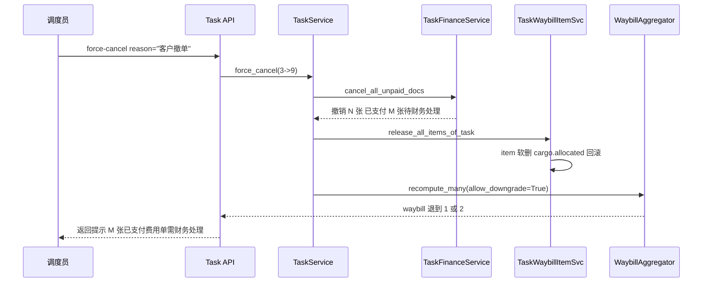
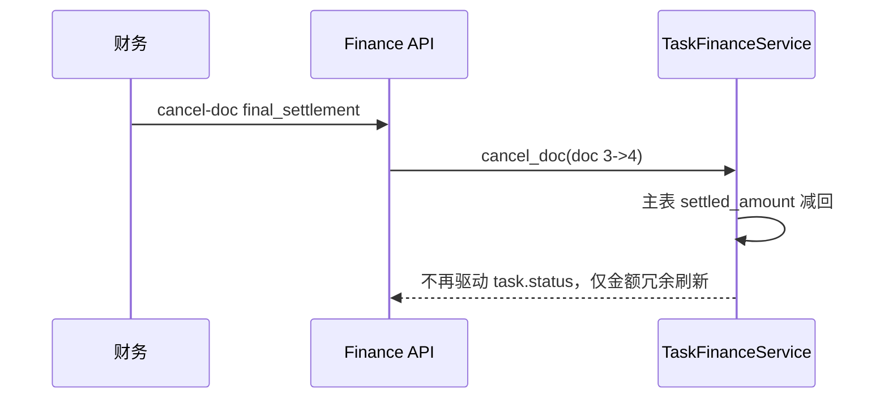
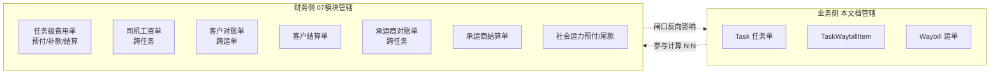

# 企业端运营调度模块 - 运单与任务单状态机联动设计

> **所属阶段**：阶段五 - 企业端运营调度模块
>
> **文档状态**：方案确认（v3 — 运单新增「已回单」，两状态机彻底独立）
>
> **创建日期**：2026-05-18 ｜ **最近更新**：2026-06-23
>
> **优先级**：高（核心业务闭环）
>
> **关联文档**：
> - 同目录 [01.运输任务单管理](01.运输任务单管理.md)
> - [02.企业端/05.业务模块-运单管理](../05.业务模块-运单管理.md)
> - [03.移动端/02.驾驶员H5端/04.回单签收与凭证上传](../../03.移动端/02.驾驶员H5端/04.回单签收与凭证上传.md)
> - 占位：[07.财务结算模块/01.财务单据体系与业务单据联动设计](../07.财务结算模块/01.财务单据体系与业务单据联动设计.md)（后续落地）
>
> **v3 变更摘要（2026-06-23）**：
> 1. **运单新增 `6 已回单`，原 `6 已关闭` 整体后移为 `7`**：回单 = 运单全量签收后把签收底单返还货主的人工动作，是**运单维度**的状态，与任务状态机无关。新增 `biz_waybill_receipt` 凭证表 + `waybill.receipt_at` 冗余字段；存量 `status=6` 关闭数据迁移为 7。
> 2. **两状态机彻底独立**：任务状态机**不含**「回单」环节（仍 `5 已签收 → 7 已关闭`）；运单状态机**不含**任何承运动作态。任务侧只读展示其下运单状态分布（`waybillStatusSummary`），但**不**因运单回单而改变任务状态。
> 3. **聚合器 skip 人工/终态**：`WaybillStatusAggregator` 对 `6 已回单` / `7 已关闭` 不自动改写（仅由运单侧人工 API 驱动）；item 级「撤销签收」若关联运单已回单则拦截，要求先在运单侧撤销回单。
> 4. **回单台账页**：企业端孤页 `operation/receipt` 改造为「运单回单台账」（待回单=已签收 / 已回单），承载确认回单 / 撤销回单；权限点 `operation:waybill:confirm-receipt` / `revert-receipt`。
>
> **v2 变更摘要（2026-05-21）**：
> 1. **任务单移除 `6 已结算`**：财务结算与 `task.status` 彻底解耦，财务侧只维护 `task.settled_amount` 等冗余金额，不再驱动任务状态推进；调度工作台 KPI 卡片去掉「待结算」。
> 2. **任务单 `5 已签收` 改为聚合态**：由 ``TaskWaybillItemService._aggregate_task_status_from_items`` 在 item 全部签收后自动 4→5；`update_status` 不再接受外部 4→5 推进；签收动作下沉到 item 级，调度工作台「待签收」入口触发 item 级签收弹窗。
> 3. **运单文案改为客户视角**：4 由「已送达」改「待签收」、5 由「已完成」改「已签收」（数值不变），强调签收是运单维度的核心动作。

## 一、文档目标与现状问题

### 1.1 文档目标

规范化运单（`Waybill`）、任务单（`Task`）、任务单挂接行（`TaskWaybillItem`）三层业务状态机，明确：

1. **正向**：任务推进时如何同步挂接行、如何按"混合策略"聚合到运单
2. **逆向**：线下取消、误推进撤销、强制取消等场景下的状态回退路径
3. **闸口**：哪些动作禁止、哪些动作必须二次确认 + 留原因
4. **与财务单据的边界**：声明协议，避免本期把财务塞进来导致文档失焦

最终保证：调度员每一次"装车 / 出发 / 到达 / 交车"的动作，能让运单状态自动跟随到对客户可解释的态；线下变更也能在系统里以审计友好的方式回滚。

### 1.2 当前代码评审结论

| # | 问题 | 影响 | 证据 |
|---|------|------|------|
| 1 | **运单状态停在「已确认」** | 调度员把运单挂入任务、装车、交车，运单 status 全程不动 | [waybill_service.update_status](../../../../backend/app/modules/client/services/waybill/waybill_service.py) L724-L741 无校验直接赋值；rg 搜 `waybill.*status` 在 task 服务下零匹配 |
| 2 | **任务-运单只有一处弱联动** | 挂接候选过滤了 `Waybill.status in (1,2)`，反过来不会升档运单 | [task_waybill_item_service.list_candidate_cargoes](../../../../backend/app/modules/client/services/task/task_waybill_item_service.py) L52-L59 |
| 3 | **取消任务只释放台数，不回退运单** | 若运单只挂一张任务且被取消，运单永远停在"已调度" | [task_service.cancel_task](../../../../backend/app/modules/client/services/task/task_service.py) L593-L611 |
| 4 | **任务推进时挂接行从不同步** | item.status 永远是 0；cargo.allocated_quantity 永远不会随交车释放，"剩余可分配"算不准 | [task_service.update_status](../../../../backend/app/modules/client/services/task/task_service.py) L613-L638 |
| 5 | **结算只做了 task 5→6 联动** | waybill 不联动；撤销结算单时 task 不退回 | [task_finance_service.pay_doc](../../../../backend/app/modules/client/services/task/task_finance_service.py) L466-L478；[cancel_doc](../../../../backend/app/modules/client/services/task/task_finance_service.py) L480-L500 |
| 6 | **状态机硬编码、命名不统一** | "已调度"到底指挂入任务还是已派车，文档与列表 Tag 没说清 | [waybill 状态文案](../../frontend/client/src/views/operation/waybill/index.vue) L140-L161；[task 状态文案](../../frontend/client/src/views/operation/task/status-config.ts) L1-L13 |
| 7 | **逆向流转全部缺失** | 装错车 / 误签 / 在途线下取消等场景无法在系统内回滚 | [`_VALID_STATUS_TRANS`](../../../../backend/app/modules/client/services/task/task_service.py) L51-L62 只支持 1→0 一个回退 |

## 二、三层状态机模型

### 2.1 模型概览



- **Task** = 主动状态载体（用户在工作台触发的动作对象，承担"装车/出发/到达/交车"的语义）
- **TaskWaybillItem** = 最小语义单位（一张 cargo 行被拆出来的某段台数的真实进度）
- **Waybill** = 聚合视图（对客户/合同侧的可见态，**不由用户直接驱动**，由所有挂接行聚合得出）

### 2.2 三层间的"驱动方向"约定

| 方向 | 触发 | 同步动作 |
|------|------|---------|
| Task → Item | `task.status` 每次变化（含逆向） | 按映射表推进/回退 item.status，写/清时间字段 |
| Item → Waybill | item 任何写操作（增/删/改/释放） | 调用 `WaybillStatusAggregator.recompute(waybill_id)`（仅推进 `1..5`） |
| Waybill 回单（5↔6/6→7） | 运单侧人工回单/撤销/关闭 | **仅改运单自身**，不回写任务/挂接 |
| Waybill → 任务状态 | 不存在 | 运单不主动驱动任务状态；任务侧仅**只读展示**运单状态分布 |

> 单向驱动保证了"任何业务侧动作 → 一次完整的同步"，避免循环依赖。**两状态机彻底独立：Item 是唯一桥梁，运单回单/关闭不外溢到任务。**

## 三、状态空间规范化

### 3.1 Task.status（数值不变，移除 6；5 改为聚合态）

```text
-1 待分配 → 0 待派车 → 1 已派车 → 2 已装车 → 3 在途 → 4 已到达
                                                       → 5 已交车（聚合态）→ 7 已关闭
                                                                            9 已取消（终态）
```

| 值 | 名称 | 推进方式 |
|---|------|--------|
| -1 | 待分配 | 人工新建 |
| 0 | 待派车 | `complete_carrier_assignment` 自动写入 |
| 1 | 已派车 | 人工（dispatch 弹窗） |
| 2 | 已装车 | 人工（confirm-load 弹窗） |
| 3 | 在途 | 人工（depart 按钮） |
| 4 | 已到达 | 人工（confirm-arrive 弹窗） |
| 5 | **已交车**（聚合态） | **由聚合驱动**：任务下所有 active item.status=3 时自动 4→5；外部 `update_status` 不接受 4→5 |
| 7 | 已关闭 | 人工（close 按钮） |
| 9 | 已取消 | cancel / force-cancel |

> **术语说明（2026-08 文案对齐）**：任务域、item 域与计划域的 `交车` 一律改称 `交车`，贴合乘用车整车物流「逐台验车交接」的行业口径。
> 状态码、`TaskActionKey`（`confirm-sign` / `revert-sign`）、常量名（`WAYBILL_PENDING_SIGN` / `WAYBILL_SIGNED`）与权限点（`operation:task:confirm-sign` 等）**保持不变**，仅展示文案变化。
> 计划域 `6 已回单` 不改名——回单是「交车回单返还货主」的单据动作，与交车动作本身是两件事。
> 文案统一**不影响两个状态机的独立性**：计划状态仍由聚合器从 item 进度单向推导，永不回写任务。

**关键变化**：
- 原 `6 已结算` 已移除——结算单是财务单据，不再纳入任务状态机；财务侧只维护 `task.settled_amount / prepaid_amount / supplement_amount` 等冗余金额字段。
- `5 已交车` 不再人工推进；调度工作台「待交车」入口（`status=4` 的任务）触发 item 级交车弹窗，逐行 `updateTaskWaybillItem(status=3)` 后端聚合自动写 `task.status=5`。

### 3.2 TaskWaybillItem.status（保持现有值）

```text
0 待装车 → 1 已装车 → 2 已卸车 → 3 已交车
```

### 3.3 Waybill.status（v3：新增 6 已回单，已关闭后移为 7）

| 值 | 名称 | 语义 | 驱动方 |
|---|------|--------------|--------|
| 0 | 待确认 | 运单刚录入，待运营/客户确认 | 人工确认 |
| 1 | 待调度 | 已确认；**未挂入任何活跃任务单** | 聚合 / 人工确认 |
| 2 | 调度中 | **至少一行 cargo 被挂入了未取消的任务单**（item.is_deleted=0） | 聚合 |
| 3 | 运输中 | 至少一个挂接行 `item.status ≥ 1` 已装车 | 聚合 |
| 4 | 待交车 | **所有未取消台数**对应的 `item.status ≥ 2` 已卸车，且已卸车台数 = `waybill.quantity` | 聚合（min 闸口） |
| 5 | 已交车 | **所有未取消台数**对应的 `item.status = 3` 已交车，且已交车台数 = `waybill.quantity` | 聚合（min 闸口） |
| 6 | **已回单**（v3 新增） | 交车回单已返还货主（人工动作），运单对货主的真正闭环 | **人工**（回单 API） |
| 7 | **已关闭**（原 6） | 终态（可在任意非草稿状态进入） | 人工 |

**驱动边界（独立性约束）**：
- `1..5` 由聚合器 `WaybillStatusAggregator` 从挂接 item 进度**单向推导**，不由用户直接传值；
- `6 已回单` / `7 已关闭` 为运单侧**人工动作**（`WaybillReceiptService` / `update_status`），聚合器 **skip 不自动改写**；
- 运单状态**永不回写任务**；任务侧只读展示其下运单状态分布（详见 §3.5）。

**v2 文案调整原因（2026-05-21）**：
- "已送达" → "待交车"、"已完成" → "已交车"、"已调度" → "调度中"；关键："调度中" = 挂入任务即升档，不必等"已派车"。

**v3 调整原因（2026-06-23）**：新增 `6 已回单` 表达"交车底单返还货主"，原 `6 已关闭` 整体后移为 `7`（保持数值单调，便于聚合器 max 比较）；存量 `status=6` 关闭数据迁移为 `7`。

### 3.4 状态聚合的"混合策略"

| 方向 | 策略 | 说明 |
|------|------|------|
| 升档 0 → 1 → 2 → 3 | **max** | 任一 item 进入下游 → waybill 立刻升到该下游对应态 |
| 升档 → 4 / → 5 | **min**（终态闸口） | 必须**全部未取消台数都到达 / 都交车**才能升 4 / 5，保护客户对账 |
| `6 已回单` / `7 已关闭` | **skip** | 聚合器命中这两态时直接跳过，不自动改写；只由运单侧人工 API 推进/撤销 |
| 下降（回退） | **重新计算** | 仅在反向通道允许下降；下限永远不低于 1 已确认 |

### 3.5 运单回单流程（运单域人工动作，独立于任务状态机）

回单是**运单维度**的人工动作，与任务/挂接行状态机彼此独立，由 `WaybillReceiptService` 承载：

```text
5 已交车 --确认回单(人工)--> 6 已回单 --撤销回单(人工)--> 5 已交车
6 已回单 --关闭(人工)--> 7 已关闭
```

| 动作 | 状态跳转 | 落库 | 约束 |
|------|---------|------|------|
| 确认回单 | 5 → 6 | 落一条 `biz_waybill_receipt`（底单文件/回收时间/操作人）+ 写 `waybill.receipt_at` | 仅 `5 已交车` 可确认 |
| 撤销回单 | 6 → 5 | 软删该运单回单凭证 + 清 `receipt_at` | 仅 `6 已回单` 可撤销（`7 已关闭` 后不可撤销） |

**独立性防护**：item 级「撤销交车」（item 3→2）时，若关联运单已进入 `6 已回单`，则**拦截**并提示"运单已回单，请先在运单侧撤销回单后再撤销交车"——避免底单已交付货主后又被任务侧反向破坏。

**与任务的关系**：1 个任务挂 3 张运单，其中 1 张已回单、2 张已交车时，任务状态**不变**（仍按自身状态机），任务列表/详情仅**只读展示**这组运单状态分布（部分回单 / 全部回单由用户从运单状态自行解读）。

## 四、三层联动规则

### 4.1 正向：Task → Item 同步

每次 `Task.status` 变化时（含逆向），按下表同步该任务下所有 item：

| Task 新状态 | Item 同步动作 |
|-----------|---------------|
| -1 / 0 / 1 | item 保持 0 待装车 |
| 2 已装车 | item 0 → 1（已装车）；写 `loaded_at = now()` 或 `task.actual_load_time` |
| 3 在途 | item 不变（保持 1） |
| 4 已到达 | item 1 → 2（已卸车）；写 `unloaded_at = now()` 或 `task.actual_arrive_time` |
| 5 已交车 | **不再走 propagate**——由 item → task 反向聚合驱动（见 §4.1bis） |
| 7 已关闭 | item 不变 |
| 9 已取消 | 走 `release_all_items_of_task`（释放未交车台数 + 软删 item） |

### 4.1bis Item → Task 聚合（4↔5 双向）

交车下沉到 item 级后，task 4↔5 由 ``TaskWaybillItemService._aggregate_task_status_from_items`` 统一管理：

```python
async def _aggregate_task_status_from_items(db, task):
    cur = int(task.status)
    if cur not in (TASK_ARRIVED, TASK_SIGNED):  # 4, 5
        return
    items = await list_items_of_task(db, task.id)
    active = [int(it.status) for it in items if int(it.status) != 9]
    if not active:
        return
    all_signed = all(s == 3 for s in active)
    if cur == TASK_ARRIVED and all_signed:
        task.status = TASK_SIGNED        # 4 → 5
    elif cur == TASK_SIGNED and not all_signed:
        task.status = TASK_ARRIVED       # 5 → 4（撤销交车联动）
    await db.flush()
```

调用时机：
- `update_item_status` 末尾（item 状态正/反向变更）
- 任何写 item.status 的批量入口（如未来的"撤销交车" item 批量接口）应同样调用
- 不要在 `update_status(task)` 里调用——避免循环

### 4.2 正向：Item → Waybill 聚合

每次 item 任何写操作后调用 `WaybillStatusAggregator.recompute(waybill_id)`：

```text
1) 取该 waybill 的所有 item where is_deleted=0
2) active_count = len(items)
3) loaded_qty   = SUM(item.quantity where item.status >= 1)
4) unloaded_qty = SUM(item.quantity where item.status >= 2)
5) signed_qty   = SUM(item.quantity where item.status = 3)
6) total_qty    = waybill.quantity

target_status = max(
    waybill.status if waybill.status <= 1 else 1,
    2 if active_count > 0 else 1,                                       # 调度中
    3 if loaded_qty > 0 else 2,                                         # 运输中
    4 if unloaded_qty == total_qty and total_qty > 0 else 3,            # 待交车
    5 if signed_qty == total_qty and total_qty > 0 else 4               # 已交车
)

if target_status > waybill.status:
    waybill.status = target_status      # 升档
elif target_status < waybill.status and allow_downgrade:
    waybill.status = target_status      # 下降仅在反向通道允许
else:
    # 不动
```

**关键约束**：

- 正向通道（add_items / 推进 task）调用时 `allow_downgrade=False` —— 不允许下降
- 反向通道（remove_item / revert_status / force_cancel / cancel_task / cancel_doc）调用时 `allow_downgrade=True`
- 下限：**永远不低于 1 已确认**（保留"客户已确认"的事实）

### 4.3 终态闸口（min 策略）

升到 4 待交车 / 5 已交车 必须满足"全部未取消台数都到 / 都交"，保护客户对账：

- 一张 10 台运单拆到 task1（6 台）、task2（4 台）
- task1 交车 → 6 台 signed_qty=6 != 10 → waybill 仍为 3 运输中
- task2 交车 → signed_qty=10 == 10 → waybill 升 5 已交车

### 4.4 不允许的正向动作（闸口）

| 闸口 | 规则 |
|------|------|
| `waybill.status ≥ 4` | 不允许新增/编辑/删除任务挂接（运单端已锁状态；含 4 待交车 / 5 已交车 / 6 已回单 / 7 已关闭） |
| `waybill.is_locked = 1` | 已结算/已开票，全锁（财务侧已锁） |
| `task.status ∈ {5,7,9}` | item 不能正向改状态 |
| `item.status ≥ 3` | 不能释放占用（既有规则） |
| 外部 API 推进 `task.status = 5` | 拒绝（4→5 仅由 item 全部交车聚合驱动） |
| 外部 API 推进 `task.status = 6` | 拒绝（任务枚举无 6；任务状态机为 …5→7，不存在"回单"态） |
| item 撤销交车（3→2）且关联运单 `status ≥ 6 已回单` | 拒绝（须先在运单侧撤销回单） |
| 运单 `update_status` 人工通道 | 仅允许 `0→1`、`1→7`（手动关闭）、`5↔6`（回单/撤销）、`6→7`；`2..5` 的推进必须通过任务联动 |

### 4.5 逆向流程专项设计

> 物流场景里，线下沟通后的取消、装错车、误签、误标出发等逆向操作非常常见。原 `_VALID_STATUS_TRANS` 只支持 1→0 一个回退点，远远不够。本节系统化梳理。

#### 4.5.1 设计原则

1. **正反通道分离**：正向走 `update_status` / 业务动作 API；反向**单独走 `revert_status` 专项 API**。权限点独立配置（如 `operation:task:revert-*`）。
2. **强制原因 + 审计**：所有反向操作 `reason` 必填，写入三处：
   - `task.remark` 追加 `[回退 X→Y] 原因`
   - `operation_log`
   - `company_activity`
3. **时间字段策略**：不清空 `actual_load_time` / `actual_arrive_time`，保留作为"曾发生"的事实；下次正向推进自然覆盖。这样误推进 → 撤销 → 再推进，留有清晰备注轨迹但不破坏审计。
4. **不支持"已取消恢复"**：`status=9` 是终态。误取消只能新建任务单（避免和 cargo.allocated_quantity 释放后又被别人挂走产生冲突）。
5. **5 已交车 / 7 已关闭 不可走 `revert_status` 直接逆向**：5 必须通过 item 级"撤销交车"反向聚合实现；7 永久锁死，必须建新任务。
6. **强制取消可越级**：线下取消允许从 2/3/4 任意态直接 → 9，但需要二次确认 + 高权限 + 强制原因。`≥ 5` 状态不允许强制取消（客户已交车，业务上等同完成，应走"差异化处理"流程）。

#### 4.5.2 逆向跳转矩阵

| from | to | 场景 | 联动效应 | 权限点 | 二次确认 |
|------|-----|------|---------|--------|----------|
| 1 | 0 | 司机临时变更，撤回派车 | 清空 carrier_* / driver_* 冷冻快照；item 不变（仍 0） | `operation:task:revert-dispatch` | 是 |
| 2 | 1 | 装错车 / 装错货 | item 1→0；清空 `item.loaded_at`；cargo.allocated 不变 | `operation:task:revert-load` | 是 |
| 3 | 2 | 误标出发 | item 不变；`task.actual_load_time` 保留 | `operation:task:revert-depart` | 否 |
| 4 | 3 | 误标到达 | item 2→1；清空 `item.unloaded_at` | `operation:task:revert-arrive` | 是 |
| 5 | 4 | 客户拒签 / 误签 | **走 item 级"撤销交车"**：单独 ``updateTaskWaybillItem(itemId, status=2)`` 把某行 item 3→2，再由 ``_aggregate_task_status_from_items`` 自动 task 5→4；waybill 同步 5→4 | `operation:task:revert-sign`（按钮挂在 item 行） | 是 |
| 7 | — | 已关闭：**永久不允许任何回退** | — | — | — |
| 9 | — | 已取消：**永久不允许恢复** | — | — | — |
| **2/3/4** | **9** | **强制取消（线下取消）**：释放所有未交车 item；保留承运快照备查；自动撤销关联未支付费用单 | 见 4.5.3 | `operation:task:force-cancel` | 是 |

> 原 `6 → 5` 反向行（由财务撤销结算单触发）在 v2 中已删除——结算单与 task.status 解耦后，财务撤销不再驱动 task 回退。

#### 4.5.3 撤销 API 设计

**单步撤销**：

```http
POST /api/client/operation/task/{id}/revert-status
Body: { targetStatus: int, reason: string }   # reason 必填
```

Service 层维护单独的反向跳转表：

```python
_REVERSE_VALID_TRANS = {
    1: {0},     # 撤回派车
    2: {1},     # 撤销装车
    3: {2},     # 撤回出发
    4: {3},     # 撤回到达
    # 5 → 4：不在此表，由 item 级"撤销交车"反向聚合自动驱动
}

_FORCE_CANCEL_FROM = {2, 3, 4}   # 强制取消的可入态
```

撤销路径核心动作（伪代码）：

```python
async def revert_status(task_id, target_status, reason):
    task = get_or_404()
    if not reason or not reason.strip():
        raise BizException("撤销操作必须填写原因")
    if target_status not in _REVERSE_VALID_TRANS.get(task.status, set()):
        raise BizException(
            f"不允许的回退路径：{label(task.status)} → {label(target_status)}"
        )

    old = task.status
    task.status = target_status
    _append_reason(task, f"[回退 {label(old)}→{label(target_status)}] {reason}")

    # 1) Task → Item 反向同步
    await _propagate_revert_to_items(task, old, target_status)

    # 2) 1→0 时清空 carrier 快照
    if old == 1 and target_status == 0:
        _clear_carrier_snapshot(task)

    # 3) 聚合 waybill（必须允许下降）
    waybill_ids = collect_waybill_ids(task)
    await WaybillStatusAggregator.recompute_many(
        waybill_ids, allow_downgrade=True
    )
```

**强制取消 API**：

```http
POST /api/client/operation/task/{id}/force-cancel
Body: { reason: string }
```

```python
async def force_cancel(task_id, reason):
    task = get_or_404()
    if not reason or not reason.strip():
        raise BizException("强制取消必须填写原因")
    if task.status not in _FORCE_CANCEL_FROM:
        raise BizException(
            "仅 已装车/在途/已到达 可强制取消；"
            "已交车/已结算/已关闭 请走客户差异处理流程"
        )

    old = task.status

    # 1) 自动撤销未支付费用单（status ∈ {0,1,2}）
    unpaid_info = await TaskFinanceService.cancel_all_unpaid_docs(
        task.id, reason=f"任务强制取消: {reason}"
    )

    # 2) 释放所有未交车 item
    waybill_ids = await TaskWaybillItemService.release_all_items_of_task(task)

    # 3) 任务进入 9 已取消
    task.status = 9
    _append_reason(task, f"[强制取消 from {label(old)}] {reason}")

    # 4) 聚合 waybill（允许下降）
    await WaybillStatusAggregator.recompute_many(
        waybill_ids, allow_downgrade=True
    )

    # 5) 返回提示信息：已支付的费用单无法自动撤销
    return {
        "cancelled_unpaid_count": unpaid_info.cancelled,
        "paid_count_need_manual": unpaid_info.paid_count,
        "message": "已支付的费用单需财务侧另行追回",
    }
```

#### 4.5.4 财务联动与逆向流程

| 触发 | 联动 |
|------|------|
| `cancel_task` / `force_cancel` | 自动撤销 `status ∈ {0,1,2}` 的费用单 → 4 已撤销；已支付（3）的不动并提示 |
| `pay_doc`（最终结算单已支付） | 仅刷新 `task.settled_amount` 等冗余金额；**不再推进 `task.status`**（"已结算"枚举已下线） |
| `cancel_doc`（撤销最终结算单） | 仅减回 `task.settled_amount`；**不再回退 `task.status`** |
| 撤销交车（item 3→2） | 若运单已挂接到下一个新任务，`item.cargo` 重新占用可能失败 → 拒绝撤销并报"已有新挂接占用" |

#### 4.5.5 Item → Waybill 反向聚合

由于反向通道会让 item 出现 3→2、2→1、1→0 这些下降，`WaybillStatusAggregator` 必须支持下降，但通过 `allow_downgrade` 参数显式区分：

```python
class WaybillStatusAggregator:
    @staticmethod
    async def recompute(db, waybill_id, *, allow_downgrade: bool = False):
        # 行锁 + 重算 + 视开关决定是否允许下降
        ...

    @staticmethod
    async def recompute_many(db, waybill_ids, *, allow_downgrade: bool = False):
        # 按 waybill_id 升序串行处理，避免死锁
        for wid in sorted(set(waybill_ids)):
            await WaybillStatusAggregator.recompute(
                db, wid, allow_downgrade=allow_downgrade
            )
```

| 通道 | `allow_downgrade` |
|------|-------------------|
| add_items / replace_items / update_item_status（正向）| False |
| update_item_status（反向，如撤销交车 3→2）| True |
| remove_item / release_all_items_of_task | True |
| revert_status / force_cancel / cancel_task | True |
| ~~cancel_doc 联动~~ | v2 已下线，财务不再驱动 waybill 聚合 |

#### 4.5.6 关键补丁清单（历史）

1. ~~**`task_finance_service.cancel_doc` 不联动 task 6→5**~~ — **已废弃**：v2 中财务与 `task.status` 彻底解耦，`cancel_doc` 不再触发 6→5，因为枚举 6 已下线。
2. **`cancel_task` 不撤销关联费用单**：
   - 补丁：在 [`cancel_task`](../../../../backend/app/modules/client/services/task/task_service.py) 释放台数前，先调用 `TaskFinanceService.cancel_all_unpaid_docs(task.id, reason)`
3. **`waybill_service.update_status` 无状态机校验**：
   - 补丁：套上 `WaybillStateMachine.assert_transition`；只允许"人工通道"——`0→1`、`1→7`（手动关闭）、`5↔6`（回单/撤销，由 `WaybillReceiptService` 调用）、`6→7`；`2..5` 的推进必须通过任务联动（v3：已关闭由 6 改为 7，新增回单 5↔6 人工通道）

## 五、关键时序图

### 5.1 正向：装车推进



### 5.2 反向：交车后客户拒收



### 5.3 反向：在途中强制取消



### 5.4 反向：撤销最终结算单（v2 与 task.status 解耦）



> v2 设计：财务单据与 `task.status` 彻底解耦——撤销最终结算单仅减回金额，不触发任务状态回退。"已结算"枚举从任务状态机彻底下线。

## 六、异常与并发

### 6.1 并发场景

| 场景 | 处理策略 |
|------|---------|
| 同一 cargo 行被两个事务并发挂接 | 沿用 [`_bump_cargo_allocated`](../../../../backend/app/modules/client/services/task/task_waybill_item_service.py) L132-L153 的 `SELECT FOR UPDATE` |
| 同一 waybill 被两个反向操作同时聚合 | `WaybillStatusAggregator.recompute` 内部 `SELECT waybill FOR UPDATE`，行锁串行化 |
| 一次任务推进影响 N 个 waybill 死锁 | `recompute_many` **按 waybill_id 升序处理**，全局统一加锁顺序 |
| 撤销交车时 cargo 已被新任务挂走 | 重新占用 cargo 时由 `_bump_cargo_allocated` 抛出"可分配台数不足"，撤销整个事务并报"已有新挂接占用，无法撤销交车" |

### 6.2 数据一致性

- 所有联动在**同一事务**内完成（同步），失败整体回滚
- 不引入 domain event 异步队列（与当前代码风格一致；远期可加）
- 状态变更与时间字段、cargo.allocated_quantity 的写入是原子的

### 6.3 异常约定

| 异常 | HTTP 码 | 提示 |
|------|--------|------|
| 非法正向跳转 | 422 | `状态从「X」不能直接跳转到「Y」` |
| 非法逆向跳转 | 422 | `不允许的回退路径：X → Y` |
| 撤销缺 reason | 422 | `撤销操作必须填写原因` |
| 强制取消的源态非法 | 422 | `仅 已装车/在途/已到达 可强制取消` |
| 撤销交车时 cargo 已被新挂接占用 | 409 | `已有新挂接占用，无法撤销交车` |
| 编辑/删除 waybill 时存在活跃挂接 | 409 | `存在活跃任务挂接，请先取消挂接` |

## 七、与财务单据体系的解耦边界与联动

> 本节是本文档与"财务单据体系"之间的协议。**财务单据自身的状态机、数据模型、API 设计不在本文档展开**，由独立的 [07.财务结算模块/01.财务单据体系与业务单据联动设计](../07.财务结算模块/01.财务单据体系与业务单据联动设计.md)（后续落地）承载，并取代当前的 [财务结算模块.md](../财务结算模块.md) 占位文件。

### 7.1 为什么必须解耦

| 维度 | 业务单据（本文档） | 财务单据（07 模块） |
|------|--------------------|--------------------|
| 基数 | 单据级（每天 10-1000） | 任务级 + 跨任务/跨运单的对账级 |
| 关系拓扑 | 运单 ↔ 任务单 M:N | 财务 ↔ 业务普遍 N:N |
| 流转节奏 | 实时（小时级） | 周期（日/周/月对账） |
| 角色 | 调度员 / 装车员 | 财务专员 / 出纳 |
| 状态机维度 | 派 → 装 → 到 → 签（物的流转） | 草稿 → 审批 → 支付 → 核销（钱的流转） |
| 当前代码覆盖 | 任务+运单已基本完整 | [biz_task_finance_doc](../../../../backend/app/modules/client/models/task/task_finance_doc.py) 仅覆盖任务级预付/补款/结算 |

### 7.2 财务单据全景（盘点）

| 财务单据 | 关联对象 | 关联基数 | 收/付向 | 现状 |
|---------|---------|---------|--------|------|
| 客户对账单 | 运单 | N:N | 收款 | 未实现 |
| 客户结算单 | 客户对账单 / 运单 | N:N | 收款 | 未实现 |
| 客户发票 | 客户结算单 | 1:N | 收款 | 未实现 |
| 任务级预付单 | 任务单 | 1:1 | 付款 | **已实现**（doc_type=1） |
| 任务级补款单 | 任务单 | 1:1 | 付款 | **已实现**（doc_type=2） |
| 任务级结算单 | 任务单 | 1:1 | 付款 | **已实现**（doc_type=3） |
| 自有司机工资单 | 任务单 | N:N | 付款 | 未实现 |
| 承运商对账单 | 任务单 | N:N | 付款 | 未实现 |
| 承运商结算单 | 承运商对账单 / 任务单 | N:N | 付款 | 未实现 |
| 社会运力预付单 | 任务单 | 1:1 | 付款 | 可复用 biz_task_finance_doc |
| 社会运力尾款单 | 任务单 | 1:1 | 付款 | 可复用 biz_task_finance_doc |

### 7.3 解耦视图



### 7.4 跨向"联动闸口"清单（双方协议，本文档钉死）

| # | 触发方向 | 闸口 | 级别 | 实现位置 |
|---|---------|------|------|---------|
| 1 | ~~财务 → 业务~~ | ~~任务最终结算单已支付 → task 5→6~~ | **v2 已下线** | task.status 与财务彻底解耦，`pay_doc` 仅维护冗余金额 |
| 2 | ~~财务 → 业务~~ | ~~撤销最终结算单 → task 6→5~~ | **v2 已下线** | 同上，`cancel_doc` 仅维护冗余金额 |
| 3 | 业务 → 财务 | 任务强制取消 → 自动撤销该 task 的所有未支付费用单 | 硬联动 | `cancel_all_unpaid_docs` |
| 4 | 业务 → 财务 | 任务交车（task→5，聚合驱动） → 生成承运商对账候选 / 司机工资候选 | 软触发 | **07 模块实现**，本期不动 |
| 5 | 业务 → 财务 | 运单"已交车 5" → 标记可纳入客户对账 | 软触发 | **07 模块实现**，本期不动 |
| 6 | 业务 → 财务 | `waybill.is_locked=1` / `task.status = 5/7` | 硬闸口（禁止改财务单基准） | **07 模块**在创建/编辑时校验 |
| 7 | 财务 → 业务 | 客户结算单已收款 → waybill 标记 `is_locked=1` | 硬联动 | **07 模块实现** |
| 8 | 财务 → 业务 | 承运商/司机结算单已支付 → task 标记可关闭（→ 7） | 软触发 | **07 模块实现** |

> v2 调整：闸口 1/2 已永久下线（task.status 不再有"已结算"枚举）。闸口 3 在本期落地；4-8 由 07 模块实现。

### 7.5 关联模型契约（接口骨架）

按"基数"分两条路径，避免一刀切：

| 财务单类型 | 关系 | 推荐结构 |
|-----------|------|---------|
| 任务级预付/补款/结算 | 1:N → task | 主单加 `task_id` 列（现有 [biz_task_finance_doc](../../../../backend/app/modules/client/models/task/task_finance_doc.py) 保留） |
| 司机工资单 | N 张任务 | 桥接表 `biz_driver_payroll_task_link` |
| 承运商对账/结算单 | N 张任务 | 桥接表 `biz_carrier_recon_task_link` |
| 客户对账/结算单 | N 张运单 | 桥接表 `biz_customer_recon_waybill_link` |
| 社会运力预付/尾款 | 1:1 → task | 复用 `biz_task_finance_doc`（扩展 `payee_type`） |

**明确不做的事**：

- 不引入多态外键的统一关联表 `biz_finance_doc_link`（biz_doc_type + biz_doc_id），原因：失去强外键、跨表 join 复杂、报表难写
- 本文档不给桥接表字段定义，留给 07 模块

### 7.6 业务侧暴露给财务侧的稳定接口

| 字段/状态 | 含义 | 财务侧使用场景 |
|----------|------|---------------|
| `task.status` | 任务状态 | `=5 已交车` 时可生成承运商对账候选 |
| `task.actual_load_time` / `actual_arrive_time` | 实际装/到达时间 | 应付账期计算 |
| `task.total_quantity` | 总台数（已聚合） | 按台计费 |
| `task.carrier_cost_amount` | 承运成本 | 应付预算 |
| `task.settled_amount` / `prepaid_amount` / `supplement_amount` | 财务聚合冗余 | 报表统计（由 07 模块维护，财务侧自管，不再驱动 task.status） |
| `waybill.status` | 运单状态 | `=5 已交车`/`=6 已回单` 时可生成客户对账候选 |
| `waybill.receipt_at` | 回单确认时间 | 回单时效统计 / 对账凭证 |
| `waybill.freight_amount` | 运费 | 应收基准 |
| `waybill.is_locked` | 锁定 | 已结算/已开票全锁 |
| `item.signed_qty` (派生) | 已交车台数 | 按台对账 |

## 八、后端代码改造蓝图

> 本节不写代码，仅给出"哪些文件、哪些函数、加什么/改什么"的清单。具体实现交给后续 PR 拆分。

### 8.1 新建文件

| 文件 | 用途 |
|------|------|
| `backend/app/modules/client/services/state_machine/__init__.py` | 包初始化 |
| `backend/app/modules/client/services/state_machine/task_state_machine.py` | 抽取 `_VALID_STATUS_TRANS` + `_REVERSE_VALID_TRANS` + `_FORCE_CANCEL_FROM` + `_STATUS_LABELS`；暴露 `assert_transition(old,new)`、`assert_revert(old,new)`、`legal_next(old)` |
| `backend/app/modules/client/services/state_machine/waybill_state_machine.py` | waybill 跳转表（人工通道）+ 标签 |
| `backend/app/modules/client/services/state_machine/item_state_machine.py` | item 跳转表 |
| `backend/app/modules/client/services/waybill/waybill_status_aggregator.py` | 核心 `recompute(db, waybill_id, *, allow_downgrade=False)`、`recompute_many(...)`；用 `SELECT FOR UPDATE` 锁 waybill 行；按 id 升序避免死锁；`_SKIP_STATES = {6 已回单, 7 已关闭}` 命中即跳过 |
| `backend/scripts/migrate/backfill_waybill_status.py` | 一次性回填脚本：扫所有 waybill，对每个调用 `recompute(allow_downgrade=True)`，幂等 |
| `backend/app/modules/client/models/waybill/waybill_receipt.py` | **新建（v3）**：`biz_waybill_receipt` 凭证表模型（`waybill_id` / `file_urls` / `file_type` / `received_at` / `uploaded_by` / `operator_name` / `remark`） |
| `backend/app/modules/client/schemas/waybill/waybill_receipt.py` | **新建（v3）**：`WaybillReceiptConfirm`（入参）、`WaybillReceiptOut`（出参） |
| `backend/app/modules/client/services/waybill/waybill_receipt_service.py` | **新建（v3）**：`list_receipts` / `confirm`（5→6 + 落凭证 + 写 `receipt_at`）/ `revoke`（6→5 + 软删凭证 + 清 `receipt_at`） |
| `backend/scripts/migration/versions/20260623_001_add_waybill_receipt_and_renumber_closed.py` | **新建（v3）**：建 `biz_waybill_receipt` 表 + 给 `biz_waybill` 加 `receipt_at` 列 + 存量 `status=6 → 7` 数据迁移（幂等，`REQUIRES_TABLES=["biz_waybill"]`） |

### 8.2 现有文件改造点

| 文件 | 函数 | 改动 |
|------|------|------|
| [task_service.py](../../../../backend/app/modules/client/services/task/task_service.py) | `update_status` | 末尾追加 `_propagate_to_items(task, new)` + 聚合 `recompute_many(waybill_ids, allow_downgrade=False)` |
| [task_service.py](../../../../backend/app/modules/client/services/task/task_service.py) | **新增 `revert_status`** | 使用 `_REVERSE_VALID_TRANS` 校验；调用 `_propagate_revert_to_items`；`reason` 必填；聚合 `allow_downgrade=True` |
| [task_service.py](../../../../backend/app/modules/client/services/task/task_service.py) | **新增 `force_cancel`** | 仅 `task.status ∈ {2,3,4}` 可用；先撤销未支付费用单；释放 item；聚合 `allow_downgrade=True` |
| [task_service.py](../../../../backend/app/modules/client/services/task/task_service.py) | `cancel_task` | 在释放 item 后追加聚合（`allow_downgrade=True`）；先调用 `cancel_all_unpaid_docs` |
| [task_service.py](../../../../backend/app/modules/client/services/task/task_service.py) | `complete_carrier_assignment` / `assign_carrier` | 不直接动 waybill（已调度态在 `add_items` 升级） |
| [task_waybill_item_service.py](../../../../backend/app/modules/client/services/task/task_waybill_item_service.py) | `add_items` | flush 后追加 `recompute_many(waybill_ids, allow_downgrade=False)` |
| [task_waybill_item_service.py](../../../../backend/app/modules/client/services/task/task_waybill_item_service.py) | `replace_items` | 同上 |
| [task_waybill_item_service.py](../../../../backend/app/modules/client/services/task/task_waybill_item_service.py) | `remove_item` | 释放台数后 `recompute(allow_downgrade=True)` |
| [task_waybill_item_service.py](../../../../backend/app/modules/client/services/task/task_waybill_item_service.py) | `release_all_items_of_task` | 末尾返回 `set[waybill_id]` 给调用方聚合 |
| [task_waybill_item_service.py](../../../../backend/app/modules/client/services/task/task_waybill_item_service.py) | `update_item_status` | 末尾聚合（升降都可能，由调用方传 `allow_downgrade`） |
| [task_waybill_item_service.py](../../../../backend/app/modules/client/services/task/task_waybill_item_service.py) | **新增 `propagate_to_items(task, new_status)`** | 按 4.1 表正向同步：2→item 1+loaded_at；4→item 2+unloaded_at（5 已下沉到 item 聚合，不再走 propagate） |
| [task_waybill_item_service.py](../../../../backend/app/modules/client/services/task/task_waybill_item_service.py) | **新增 `propagate_revert_to_items(task, old, new)`** | 按 4.5.2 表反向同步：4→3: item 2→1+清 unloaded_at；2→1: item 1→0+清 loaded_at |
| [task_waybill_item_service.py](../../../../backend/app/modules/client/services/task/task_waybill_item_service.py) | **新增 `_aggregate_task_status_from_items(task)`** | item 全部交车 → task 4→5；撤销交车（item 3→2）且 task=5 → task 5→4；在 `update_item_status` 末尾调用 |
| [task_finance_service.py](../../../../backend/app/modules/client/services/task/task_finance_service.py) | `pay_doc` | **v2**：仅 `_refresh_task_finance_aggregates`，不再推进 task.status 5→6 |
| [task_finance_service.py](../../../../backend/app/modules/client/services/task/task_finance_service.py) | `cancel_doc` | **v2**：仅 `_refresh_task_finance_aggregates`，不再回退 task.status 6→5 |
| [task_finance_service.py](../../../../backend/app/modules/client/services/task/task_finance_service.py) | **新增 `cancel_all_unpaid_docs(task_id, reason)`** | 把 `task_id` 下 `status ∈ {0,1,2}` 的费用单批量改 4 已撤销；返回 `{cancelled, paid_count}` |
| [waybill_service.py](../../../../backend/app/modules/client/services/waybill/waybill_service.py) | `update_status` | 套上 `WaybillStateMachine.assert_transition`；人工通道：`0→1`、`1→7`、`5↔6`、`6→7`；`2..5` 推进拒绝（必须通过任务联动） |
| [waybill_service.py](../../../../backend/app/modules/client/services/waybill/waybill_service.py) | `delete_waybill` | 增加"无活跃挂接 item"校验；可删态由 `(0,1,6)` 改为 `(0,1,7)` |
| [waybill_service.py](../../../../backend/app/modules/client/services/waybill/waybill_service.py) | `workbench_stats` | KPI 由 7 卡扩展为 8 卡（0-7），新增 `receipted` 计数，`closed` 指向 7 |
| [task_waybill_item_service.py](../../../../backend/app/modules/client/services/task/task_waybill_item_service.py) | `update_item_status` | **v3 防护**：item 从 `3 已交车` 反向且关联运单为 `6 已回单` 时抛 `BizException`，要求先撤销回单 |
| [task_service.py](../../../../backend/app/modules/client/services/task/task_service.py) | **新增 `aggregate_waybill_status_summary`** | 批量聚合任务下运单状态分布（只读），供任务列表/详情展示，不改任务状态 |
| [api/task/task.py](../../../../backend/app/modules/client/api/task/task.py) | **新增 endpoint** | `POST /{id}/revert-status`、`POST /{id}/force-cancel`（含权限点） |
| [api/task/task.py](../../../../backend/app/modules/client/api/task/task.py) | `page_tasks` / 详情 | 注入 `waybillStatusSummary`（运单状态分布只读字段） |
| [api/waybill/waybill.py](../../../../backend/app/modules/client/api/waybill/waybill.py) | `update_waybill_status` | 错误提示更具体；状态标签改为从 `waybill_state_machine` 导入（去硬编码） |
| [api/waybill/waybill.py](../../../../backend/app/modules/client/api/waybill/waybill.py) | **新增 endpoint（v3）** | `GET /{id}/receipts` 列回单凭证、`POST /{id}/receipt` 确认回单（5→6）、`DELETE /{id}/receipt` 撤销回单（6→5），均带操作日志 |

### 8.3 Schema 变更

| 文件 | 改动 |
|------|------|
| `schemas/task/task.py` | 新增 `TaskRevertStatusRequest`（targetStatus + reason）、`TaskForceCancelRequest`（reason） |
| `schemas/task/task.py` | `TaskOut` / `TaskListItem` 新增字段：`canRevert`、`canForceCancel`（由 service 计算返回） |
| `schemas/task/task.py` | **v3**：新增 `WaybillStatusCount` / `WaybillStatusSummary`；`TaskListItemOut` / `TaskOut` 增 `waybillStatusSummary` + `financeStatusSummary`（财务占位，只读） |
| `schemas/waybill/waybill.py` | `WaybillOut` 新增字段：`hasActiveTaskItems`、`taskCount`、`loadedQuantity`、`unloadedQuantity`、`signedQuantity`；**v3** 增 `receiptAt` |

### 8.4 权限点登记

在"运输任务单"菜单下新增按钮权限：

- `operation:task:revert-dispatch` 撤回派车
- `operation:task:revert-load` 撤销装车
- `operation:task:revert-depart` 撤回出发
- `operation:task:revert-arrive` 撤回到达
- `operation:task:revert-sign` 撤销交车
- `operation:task:force-cancel` 强制取消任务

**v3**：在"回单签收"菜单（[client_menu.json](../../../../backend/scripts/platform_sync/snapshots/client_menu.json) ID 195）下新增 `menu_type=1` 按钮权限：

- `operation:waybill:confirm-receipt` 确认回单（ID 815）
- `operation:waybill:revert-receipt` 撤销回单（ID 816）

同时在 [product_feature.json](../../../../backend/scripts/platform_sync/snapshots/product_feature.json) 的 `biz_waybill` / `biz_receipt` 特性 `required_tables` 中登记 `biz_waybill_receipt`，确保租户自动建表。

## 九、前端代码改造蓝图

### 9.1 正向通道改造

| 文件 | 改动 |
|------|------|
| [views/operation/waybill/index.vue](../../frontend/client/src/views/operation/waybill/index.vue) | 操作列：编辑禁用条件由 `status===0/1` 改为 `status<=1 且 !hasActiveTaskItems`；删除按钮同步收紧 |
| `views/operation/waybill/components/waybill-status-tag.vue` | **新建**：状态 Tag + tooltip 显示"已挂接任务数 / 进度概要" |
| `views/operation/waybill/components/waybill-detail.vue` | **新建**：详情抽屉，展示已挂接任务列表 + 每张任务进度 + 聚合状态来源说明 |
| `api/waybill/model/index.ts` | `Waybill` 类型新增 `hasActiveTaskItems` / `taskCount` / `loadedQuantity` / `signedQuantity` 等聚合字段 |
| [views/operation/task/components/task-detail.vue](../../frontend/client/src/views/operation/task/components/task-detail.vue) | 状态时间轴下方追加"挂接运单一览"，展示对应 waybill.status 联动结果 |
| [views/operation/task-workbench/components/action-confirm-sign.vue](../../frontend/client/src/views/operation/task-workbench/components/action-confirm-sign.vue) | 增加 `signedAt` 字段透传后端，与 `item.signed_at` 对应；交车时间不再仅写备注 |

### 9.2 逆向通道改造（新增）

| 文件 | 改动 |
|------|------|
| [views/operation/task/task-actions.ts](../../frontend/client/src/views/operation/task/task-actions.ts) | 新增 `TaskActionKey`：`revert-dispatch` / `revert-load` / `revert-depart` / `revert-arrive` / `revert-sign` / `force-cancel`；对应权限点和按钮类型（danger） |
| `views/operation/task-workbench/components/action-revert.vue` | **新建**：通用"撤销 XX"弹窗，参数化标题/目标状态/提示语；强制原因输入框；二次确认 checkbox |
| `views/operation/task-workbench/components/action-force-cancel.vue` | **新建**：强制取消弹窗；展示"该任务下未支付费用单 N 张将被撤销 / 已支付 M 张需财务侧处理"；强制原因 + 高警示色 |
| [views/operation/task-workbench/components/workbench-action-modals.vue](../../frontend/client/src/views/operation/task-workbench/components/workbench-action-modals.vue) | 接入上述两个弹窗 |
| [views/operation/task/components/task-detail.vue](../../frontend/client/src/views/operation/task/components/task-detail.vue) | 状态时间轴行内追加"撤销该步"按钮（按矩阵显示）；底部增加"强制取消"危险操作区 |
| [views/operation/task/index.vue](../../frontend/client/src/views/operation/task/index.vue) | 行操作下拉新增「撤销上一步」「强制取消」入口（按矩阵显示） |
| `api/operation/task/index.ts` | 新增 `revertTaskStatus(id, target, reason)`、`forceCancelTask(id, reason)` |

### 9.3 文案约定

- 撤销弹窗标题：`撤销「{当前状态}」 → 退回到「{目标状态}」`
- 撤销原因 placeholder：`请填写撤销原因，将记录到操作日志（必填）`
- 强制取消警示语：`强制取消将释放所有未交车台数，并撤销 N 张未支付费用单；已支付的 M 张费用单不会自动撤销，请联系财务处理`

### 9.4 v3 改造（回单 + 状态重编号 + 任务只读展示）

| 文件 | 改动 |
|------|------|
| `views/operation/waybill/components/waybill-status-tag.vue` | `STATUS_LABEL` 增 `6: '已回单'`、`7: '已关闭'` |
| `views/operation/waybill/waybill-pool-registry.ts` | `WAYBILL_STATUS_TO_POOL_KEY` 增 `6→receipted`、`7→closed`；新增 `receipted` 池（status 6），`closed` 池指向 7 |
| `views/operation/waybill/components/waybill-stats-cards.vue` | KPI 8 卡：`TOTAL_KEY_MAP` / `SUB_TEXT` 增 `receipted`，补 `&--receipted` 样式 |
| `api/waybill/model/index.ts` | `Waybill` 增 `receiptAt`；新增 `WaybillReceipt` / `WaybillReceiptConfirmPayload` 类型 |
| `api/waybill/index.ts` | 新增 `listWaybillReceipts` / `confirmWaybillReceipt` / `revokeWaybillReceipt` |
| `views/operation/receipt/index.vue` | **改造**为「运单回单台账」：待回单（status=5）/ 已回单（status=6）双 Tab，行操作确认回单 / 查看凭证 / 撤销回单 |
| `views/operation/receipt/components/receipt-confirm-dialog.vue` | **新建**：上传底单凭证 + 确认回单弹窗（仿 `action-confirm-load.vue`） |
| `views/operation/task/components/waybill-status-summary.vue` | **新建**：只读展示运单状态分布（如 `已交车×2 已回单×1`），供任务列表/详情复用 |
| `views/operation/task/index.vue` | 新增「运单状态」列（`columnKey: waybillStatusSummary`） |
| `views/operation/task/components/task-detail.vue` | 新增「关联单据状态」区块：运单状态分布 + 财务单据占位 |

**前端独立性原则**：任务侧 `waybill-status-summary` 仅作只读展示，不提供任何改运单状态的入口；回单动作只在运单池/回单台账触发。

## 十、测试要点

### 10.1 正向流程

1. **挂接升档**：新建任务挂入运单 A 的 5 台 → `waybill A.status = 2 调度中`
2. **装车升档**：task → 2 → waybill 升 3 运输中
3. **部分到达不升 4**：A 拆到 task1 / task2，task1 到达不能让 A 升 4 待交车
4. **全部交车升 5**：task1 + task2 关联的 item 全部交车（item.status=3）→ 各 task 自动 4→5 已交车；waybill 在台数总和 = `A.quantity` 时升 5 已交车
5. **取消任务回退**：A 只挂 task1，task1 取消 → A 退回 1 待调度
6. **取消挂接回退**：A 挂在 task1（5 台）+ task2（3 台），task2 整张挂接被删 → A 不变（task1 还在）
7. **状态机校验**：直接 PUT `/waybill/{id}/status` 跳 0→3 → 422
8. **并发**：两个调度员同时给同一 cargo 行挂接 → 一方失败
9. **回填脚本**：脏数据库执行后所有 `waybill.status` 与挂接事实一致

### 10.2 逆向流程

10. **撤回派车 1→0**：清空 carrier 快照；waybill 仍为 2 调度中（item 还在）
11. **撤销装车 2→1**：item 1→0，`loaded_at` 清空；waybill 3→2
12. **撤销交车（item 级 3→2）**：撤一行 item，重新占用 `cargo.allocated_quantity`；若该任务下还存在 item.status < 3，task 自动 5→4，waybill 自动 5→4
13. **撤销交车时 cargo 已被新任务挂走**：报"已有新挂接占用"，拒绝撤销
14. **强制取消 3→9**：在途中强制取消，所有 item 释放、未支付费用单自动撤销 4，已支付费用单**保留**并返回提示
15. **5→4 后再 4→5 正向推进**：item 再次交车后聚合再次驱动 task 4→5；备注里能看到完整轨迹
16. **撤销缺少 reason**：返回 422
17. **从 7 已关闭 / 9 已取消 revert**：拒绝
18. **revert 权限校验**：未授权用户调用 → 403
19. **强制取消时 waybill 聚合下降边界**：A 拆到 task1（已在途）+ task2（已交车），task1 强制取消 → 聚合台数变化下 A 应正确处于"运输中 / 待交车 / 已交车"之一（详细分支看交车台数 vs 总台数）
20. **并发撤销**：同时撤销两张关联同一 waybill 的任务 → 行锁串行化，最终 waybill 状态正确

### 10.3 财务联动（v2 简化）

21. ~~**task 5→6**：最终结算单 `is_final=1` 已支付 → task 自动 5→6~~ — v2 已下线，仅刷新 `task.settled_amount`，不再驱动 task.status
22. ~~**task 6→5**：撤销上述结算单 → task 6→5，settled_amount 减回~~ — v2 已下线
23. **强制取消联动撤销费用单**：task 强制取消时，未支付费用单全部到 4 已撤销，返回值含已支付数量

## 十一、远期演进锚点

| 远期能力 | 本文档预留 |
|---------|-----------|
| 在途监控 / 回单签收模块上线 | `item.status` 由这两个模块写入（替代 `task.update_status` 同步） |
| Domain event 解耦 | 抽象事件 `TaskStatusChanged` / `WaybillStatusAggregated` / `TaskReverted` / `TaskForceCancelled`，订阅者落地异步任务（通知、对账触发等） |
| 状态变更历史表 | 新增 `biz_task_state_history`（task_id / from_status / to_status / direction / reason / operator_id / occurred_at），客户对账时定位"为什么这单退回了"，比拼接 `task.remark` 字符串更结构化 |
| 客户级别的逆向审计报表 | 基于上一条历史表，输出"近 30 天反向操作 Top10 任务 / 操作人 / 原因分布"，发现高频反向操作背后的流程缺陷 |
| AI 调度推荐 | 任务 `source=2` 标识；聚合层为推荐评估提供历史轨迹 |
| 跨段费用归集 | `segment_id` 已预留 |
