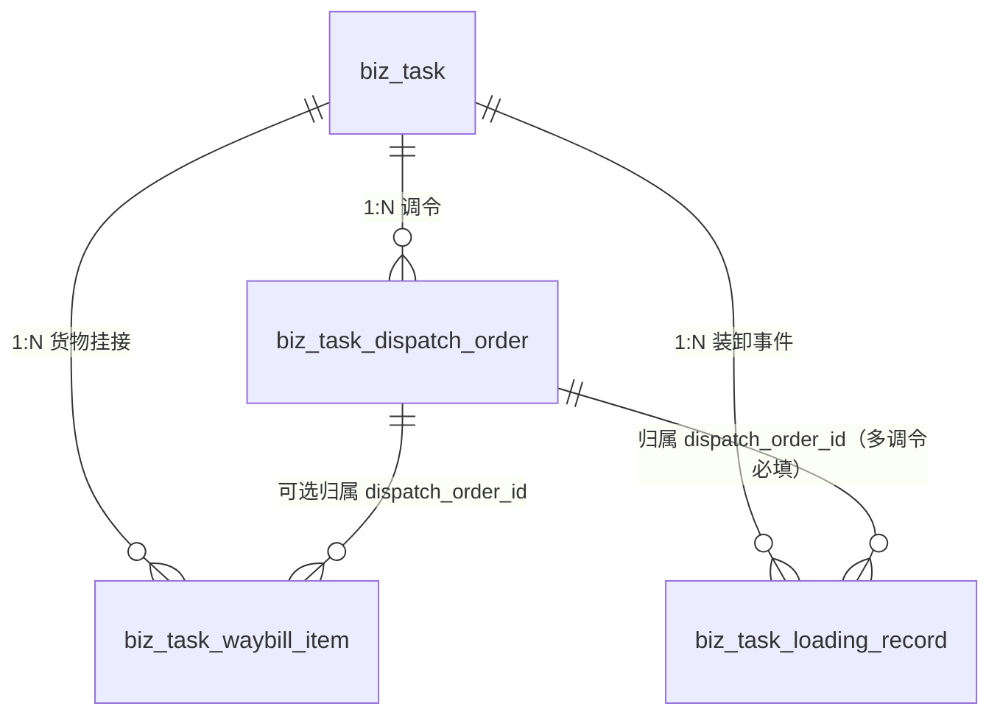

# 企业端运营调度模块 - 任务单调令设计

> **所属阶段**：阶段五 - 企业端运营调度模块
>
> **文档状态**：补档（依据现网代码反向梳理，2026-06-23）
>
> **创建日期**：2026-06-23
>
> **优先级**：高（任务单核心子单据）
>
> **关联文档**：
> - 同目录 [01.运输任务单管理](01.运输任务单管理.md)
> - 同目录 [02.运单与任务单状态机联动设计](02.运单与任务单状态机联动设计.md)
> - [03.移动端/02.驾驶员H5端/04.回单签收与凭证上传](../../03.移动端/02.驾驶员H5端/04.回单签收与凭证上传.md)
>
> **补档说明**：在 v1（[01.运输任务单管理](01.运输任务单管理.md)）中，任务单的运输路线以「**分段（segment / `biz_task_segment`）**」表达，仅记录"A→B→C"的物理段。后续迭代把"分段"重构升级为「**调令（dispatch order / `biz_task_dispatch_order`）**」——从单纯的"地理段"升级为承载**调度归属、车辆运动类型、成本归集**的最小调度单元。该重构已在代码（模型 / 迁移 / Service / API / 前端）中落地，但当时未单独输出产品文档。本文档对调令的概念、数据模型、流程与接口做完整补档，并明确「分段 → 调令」的演进与兼容策略。

---

## 一、功能概述

### 1.1 什么是调令

**调令（Dispatch Order）** 是任务单下"**一段完整运输运动**"的描述单元，是承担**调度安排与成本归属的最小单位**。一张任务单（`biz_task`）由 N 条调令（`biz_task_dispatch_order`）顺序组成。

与 v1「分段」相比，调令的核心升级在于：

| 维度 | 分段（v1 segment） | 调令（现网 dispatch order） |
|------|-------------------|----------------------------|
| 定位 | 任务的"地理路段"（A→B→C） | 一段"完整运输运动"，可重驶 / 空驶 / 调拨 |
| 是否带货 | 默认都带货（运货段） | **区分类型**：重驶带货，空驶 / 年检 / 应急 / 其他不带货 |
| 成本含义 | 弱 | **成本归集的最小单元**（空驶回程、调拨也能挂到任务作为成本） |
| 司机端语义 | 无 | 预留司机端**接收 / 出发 / 完成**三段时间戳 |
| 装卸归属 | 无 | 装卸记录、挂接货物均可**指定归属某条调令** |

### 1.2 为什么要从"分段"升级到"调令"

商品车物流的真实运输运动并非只有"运货"一种：

1. **空驶回程 / 调拨**：板车把车送到 B 地后空车回 A 地，或空车从 A 调拨到 C 地待命——这些运动**不带货但产生成本**（油费、过路费、司机工时），必须能挂在任务上单独核算。
2. **年检调拨**：车辆去车管所 / 检测站年检的调拨运动。
3. **应急调拨**：事故救援、抢修等突发调拨。
4. **重驶（运货）**：真正拉着商品车的运输段，是任务的"主业务段"。

"分段"只能表达"地理上的 A→B"，无法表达"这段是重驶还是空驶、成本归谁"。**调令** 通过 `dispatch_type`（调令类型）把每段运动的业务性质显式化，从而支撑：

- 真分段多段运输（A→B→C→D，每段独立装卸 / 到达）
- 空驶 / 调拨成本归集到任务
- 装卸事件、挂接货物按调令分组
- 司机端按调令逐段执行（远期）

### 1.3 与任务单的关系



- 一张任务单 1:N 多条调令；调令在任务内以 `order_no`（调令序号，1..N）排序
- **货物挂接行**（`biz_task_waybill_item`）可选 `dispatch_order_id` 指定该批货物走哪条调令（NULL = 跟随主任务首条重驶调令）
- **装卸事件**（`biz_task_loading_record`）的 `dispatch_order_id` 标记本次装 / 卸车发生在哪条调令上（**多调令任务必填**，单调令可省略）

---

## 二、概念演进：从"分段"到"调令"

### 2.1 命名映射

代码重构通过迁移 `20260521_001` ~ `20260521_003` 完成，对外尽量平滑兼容旧字段名：

| 维度 | v1（分段） | 现网（调令） | 兼容策略 |
|------|-----------|-------------|---------|
| 表名 | `biz_task_segment` | `biz_task_dispatch_order` | `RENAME TABLE` |
| 段序号列 | `segment_no` | `order_no` | `CHANGE COLUMN` 重命名 |
| 挂接行外键 | `biz_task_waybill_item.segment_id` | `dispatch_order_id` | 重命名 + 数据回填 + 删旧列 |
| 唯一约束 | `uk_task_segment (task_id, segment_no)` | `uk_task_dispatch_order (task_id, order_no)` | `RENAME INDEX` |
| 任务索引 | `idx_segment_task_id` | `idx_dispatch_order_task_id` | `RENAME INDEX` |
| 入参字段 | `segments[].segmentNo` | `segments[].orderNo` | 入参 `segmentNo` 自动映射到 `orderNo` |
| 出参字段 | `segmentNo` | `orderNo` | 出参**同时**返回 `orderNo` 与 `segmentNo`（等价） |
| API 路径 | `/{taskId}/segments`、`/segments/{id}/status` | `/{taskId}/dispatch-orders`、`/dispatch-orders/{id}/status` | 旧路径仍保留并指向同一处理函数 |
| Service 方法 | `list_segments`、`_replace_segments`、`update_segment_status` | `list_dispatch_orders`、`_replace_dispatch_orders`、`update_dispatch_order_status` | 旧名作为新方法别名保留 |

> **设计要点：兼容不破坏**。前端尚未全量改造的位置仍可用 `segmentNo` / `/segments` / `segmentId`，后端在 Schema、路由、Service 三层都保留了等价别名，保证灰度迁移期间不出错。

### 2.2 保留 `segment_count` 命名

任务主表 `biz_task.segment_count`（分段数量）、出参 `segmentCount`、前端详情页 Tab `name="segments"` 这些**字段名未改**，仅语义升级为"调令数量 / 调令 Tab"。这是有意的最小改动——避免主表与列表 Schema 大面积 rename，降低回归风险。文档与 UI 文案统一以"**调令**"呈现给用户。

### 2.3 新增能力（相比纯重命名）

迁移除了重命名，还**新增了 4 个列**，体现"调令 ≠ 分段"的升级：

- `dispatch_type`：调令类型（1 重驶 / 2 空驶 / 3 年检 / 4 应急 / 5 其他）
- `accepted_at`：调令接收时间（司机端确认接收）
- `started_at`：调令开始时间（司机点击出发）
- `completed_at`：调令完成时间

并为 `dispatch_type` 加了索引 `idx_dispatch_order_dispatch_type`。

---

## 三、需求详情

### 3.1 调令类型（dispatch_type）

| 值 | 类型 | 业务含义 | 是否带货 |
|----|------|---------|---------|
| 1 | **重驶** | 拉着商品车的实际运输段（任务主业务段） | 是 |
| 2 | **空驶** | 空车回程或调拨段（无 cargo，归属任务作为成本） | 否 |
| 3 | **年检** | 车辆年检调拨 | 否 |
| 4 | **应急** | 应急调拨（事故 / 抢救） | 否 |
| 5 | **其他** | 其他业务调拨 | 否 |

默认值为 `1 重驶`。前端详情页以彩色 Tag 区分：重驶（绿）/ 空驶（灰）/ 年检（橙）/ 应急（红）/ 其他（默认）。

### 3.2 调令的时间字段语义

调令是当前**记录运输运动全生命周期时间戳**的载体：

| 字段 | 含义 | 写入方 |
|------|------|--------|
| `planned_load_time` | 计划装车时间 | 调度规划 |
| `planned_arrive_time` | 计划到达时间 | 调度规划 |
| `accepted_at` | 调令接收时间（司机端确认接收，lite 端调令池上报） | 司机端（远期） |
| `started_at` | 调令开始时间（司机点击"开始执行" / 出发前） | 司机端（远期） |
| `actual_load_time` | 实际装车时间 | 装卸事件 / 调令状态更新 |
| `actual_arrive_time` | 实际到达时间 | 装卸事件 / 调令状态更新 |
| `completed_at` | 调令完成时间（一般等于 `actual_arrive_time`，预留独立确认入口） | 远期 |

> `accepted_at` / `started_at` / `completed_at` 为司机端逐段执行预留，本期企业端不强制写入。

### 3.3 调令状态机（独立于任务状态机）

调令自身有一套**轻量状态**，描述单段运输运动的进度：

```
0 待装车 → 1 装车中 → 2 在途 → 3 已到达 → 4 已卸车
```

- 调令状态通过专项接口 `PUT /dispatch-orders/{id}/status` 单独更新，可附带 `actualLoadTime` / `actualArriveTime` / `remark`
- **重要边界**：本期任务主状态（`task.status`）的"已装车 / 已到达"推进**并非**由调令状态驱动，而是由**装卸事件（loading record）+ 挂接行（item）聚合**驱动（见 [02.运单与任务单状态机联动设计](02.运单与任务单状态机联动设计.md)）。调令状态目前主要作为**调度侧的段级进度标注**与**装卸 / 货物的归属分组键**，不参与跨层自动联动。
- 装卸事件服务（`TaskLoadingRecordService`）只**校验** `dispatch_order_id` 归属合法性，**不自动回写**调令 status；调令 status 的推进是独立动作。

### 3.4 调令的创建与编辑

调令随任务单生命周期管理，有三个写入入口：

#### 3.4.1 创建任务单时一并提交（可空）

- 入参字段：`TaskCreate.segments`（List，字段名兼容旧前端，元素为调令对象）
- **允许为空**：不传 = "配载草稿"，任务无调令；此时由 `_fill_route_from_waybills` 根据已挂接运单聚合出 `origin/destination` 兜底，保证列表 / 详情有"起→终"展示
- 非空时校验：`orderNo` 不允许重复、必须从 1 开始连续

#### 3.4.2 编辑任务单时整组替换

- 入参：`TaskUpdate.segments`（可选）
- 传入则**整组替换**（软删旧调令 → 写入新调令），仍校验序号从 1 连续
- 仅 `status ∈ {-1 待分配, 0 待派车, 1 已派车}` 时允许编辑

#### 3.4.3 独立"规划路线"动作

- 接口：`POST /{taskId}/plan-route`
- 用途：对已存在任务**补齐 / 重做调令路线**，不影响承运方与货物挂接
- 入参：`segments`（至少 1 条，序号从 1 连续）
- 允许状态：`status ∈ {-1 待分配, 0 待派车, 1 已派车, 2 已装车}`

#### 3.4.4 整组替换逻辑（`_replace_dispatch_orders`）

写入调令后，Service 会回写任务主表的线路冗余：

1. `task.segment_count = 调令数`
2. **起终点取"重驶"优先**：
   - `origin` = 首条**重驶**调令的起点（无重驶则取第一条调令）
   - `destination` = 末条**重驶**调令的终点（无重驶则取最后一条调令）
3. 任务计划装 / 到时间若为空，则用首 / 末调令的计划时间兜底回填

> 此处"重驶优先"的设计，保证了即便任务包含空驶 / 调拨段，列表展示的"起→终"仍是货主关心的**实际运货起终点**。

### 3.5 调令里程联想

规划调令时支持按起终行政区匹配已维护线路自动回填里程：

- 接口：`GET /route-distance?originRegionId=&destinationRegionId=`
- 命中 `biz_route`（已启用、起终行政区一致）最新一条，返回 `{routeId, routeName, origin, destination, distance, estimatedHours}`
- 未命中返回 `null`

### 3.6 货物挂接与调令的归属

挂接行 `biz_task_waybill_item.dispatch_order_id`：

- 可选指定该批货物走**哪条调令**
- `NULL` = 跟随主任务**首条重驶调令**
- 装车 / 卸车弹窗会按所选调令过滤可装 / 可卸的货物行：仅展示 `dispatch_order_id` 为空或等于所选调令的挂接行

### 3.7 装卸事件与调令的归属

装卸事件 `biz_task_loading_record.dispatch_order_id`：

- **多调令任务必填**，单调令可省略（服务端按调令数量校验）
- 必须属于当前任务且未删除，否则报错"调令 X 不属于任务 #Y"
- 前端装 / 卸车弹窗：多调令时强制选择"关联调令"，单调令默认锁定为唯一（重驶）调令；并默认把装车地点填为调令 `from_location`、卸车地点填为调令 `to_location`

---

## 四、数据模型设计

表位于租户业务库（`zt_biz_{tenant_code}`），`__table_tier__ = "business"`。

### 4.1 `biz_task_dispatch_order` 任务单调令表

| 字段 | 类型 | 必填 | 说明 |
|------|------|------|------|
| id | BIGINT PK | 是 | 自增主键 |
| task_id | BIGINT | 是 | 关联 `biz_task.id` |
| order_no | SMALLINT | 是 | 调令序号 1,2,3...（原 `segment_no`） |
| dispatch_type | SMALLINT | 是 | 调令类型 1-重驶 2-空驶 3-年检 4-应急 5-其他，default 1 |
| from_location | VARCHAR(255) | 否 | 起点名称 |
| from_code | VARCHAR(20) | 否 | 起点编码 |
| from_region_id | BIGINT | 否 | 起点行政区 ID |
| to_location | VARCHAR(255) | 否 | 终点名称 |
| to_code | VARCHAR(20) | 否 | 终点编码 |
| to_region_id | BIGINT | 否 | 终点行政区 ID |
| mileage | DECIMAL(8,2) | 否 | 调令公里数 |
| planned_load_time | DATETIME | 否 | 计划装车时间 |
| planned_arrive_time | DATETIME | 否 | 计划到达时间 |
| actual_load_time | DATETIME | 否 | 实际装车时间 |
| actual_arrive_time | DATETIME | 否 | 实际到达时间 |
| accepted_at | DATETIME | 否 | 调令接收时间（司机端确认，**新增**） |
| started_at | DATETIME | 否 | 调令开始时间（司机点击出发，**新增**） |
| completed_at | DATETIME | 否 | 调令完成时间（**新增**） |
| status | SMALLINT | 是 | 0-待装车 1-装车中 2-在途 3-已到达 4-已卸车，default 0 |
| remark | VARCHAR(255) | 否 | 备注 |
| created_at / updated_at / is_deleted | — | — | 标准三件套 |

**索引**：
- `UK uk_task_dispatch_order (task_id, order_no)`
- `idx_dispatch_order_task_id (task_id)`
- `idx_dispatch_order_dispatch_type (dispatch_type)`

### 4.2 关联表中的调令外键

| 表 | 字段 | 说明 |
|----|------|------|
| `biz_task_waybill_item` | `dispatch_order_id` BIGINT NULL | 货物归属调令（NULL = 跟随首条重驶调令）；原 `segment_id` |
| `biz_task_loading_record` | `dispatch_order_id` BIGINT NULL | 装卸事件归属调令（多调令必填）；索引 `idx_loading_record_dispatch_order_id` |

### 4.3 任务主表的调令相关冗余

| 字段 | 说明 |
|------|------|
| `biz_task.segment_count` | 调令数量（命名保留，语义=调令数） |
| `biz_task.origin / destination`（及 code / region_id） | 取首 / 末**重驶**调令的起终点冗余 |

---

## 五、API 设计

接口前缀：`/business/task`，需 JWT 认证。

### 5.1 调令子接口

| 方法 | 路径 | 兼容旧路径 | 说明 |
|------|------|-----------|------|
| GET | `/{taskId}/dispatch-orders` | `/{taskId}/segments` | 列出任务的全部调令（按 `order_no` 升序） |
| PUT | `/dispatch-orders/{orderId}/status` | `/segments/{orderId}/status` | 更新单条调令状态（0~4，可带实际装 / 到时间、备注） |
| POST | `/{taskId}/plan-route` | — | 补齐 / 重做调令路线（整组替换） |
| GET | `/route-distance` | — | 调令里程联想（按起终行政区匹配线路） |

> 调令的**创建 / 整组替换**不走独立 POST，而是内嵌在 `POST /business/task`（创建）、`PUT /business/task/{id}`（编辑）、`POST /business/task/{id}/plan-route`（规划路线）的请求体 `segments` 字段中。

### 5.2 调令对象结构（入参 `segments[]`）

```json
{
  "orderNo": 1,
  "dispatchType": 1,
  "fromLocation": "北京市顺义区",
  "fromCode": "110113",
  "fromRegionId": 110113,
  "toLocation": "上海市浦东新区",
  "toCode": "310115",
  "toRegionId": 310115,
  "mileage": 1200,
  "plannedLoadTime": "2026-05-17T08:00:00",
  "plannedArriveTime": "2026-05-19T18:00:00",
  "remark": ""
}
```

> 入参兼容：若提交 `segmentNo` 而无 `orderNo`，后端自动映射 `orderNo = segmentNo`。

### 5.3 调令对象结构（出参）

出参在入参基础上额外返回：`id`、`taskId`、`segmentNo`（与 `orderNo` 等价，兼容旧前端）、`actualLoadTime`、`actualArriveTime`、`acceptedAt`、`startedAt`、`completedAt`、`status`、`createdAt`。

### 5.4 调令状态更新请求体

```json
{
  "status": 2,
  "actualLoadTime": "2026-05-17T09:00:00",
  "actualArriveTime": null,
  "remark": "已出发"
}
```

---

## 六、前端页面设计

### 6.1 任务详情 - 调令 Tab

- 详情页 `views/operation/task/components/task-detail.vue` 以 Tab 展示「调令 / 装卸记录 / 挂接货物 / 费用单」
- 调令表格列：调令序号、**调令类型 Tag**（重驶 / 空驶 / 年检 / 应急 / 其他）、起点、终点、里程、计划装 / 到时间、实际装 / 到时间、调令状态
- 装卸记录区展示每条事件的"调令 #序号"标签
- 挂接货物列展示"归属调令"列（第 N 段 / `--`）

调令类型 Tag 配色（前端 `DISPATCH_TYPE_LABEL`）：

| 类型 | label | Tag type |
|------|-------|----------|
| 1 | 重驶 | success（绿） |
| 2 | 空驶 | info（灰） |
| 3 | 年检 | warning（橙） |
| 4 | 应急 | danger（红） |
| 5 | 其他 | 默认 |

### 6.2 调度工作台 - 装 / 卸车弹窗

- `action-confirm-load.vue`（确认装车）/ `action-confirm-arrive.vue`（确认到达）
- 表单首项为"**关联调令**"：多调令必选、单调令默认锁定唯一重驶调令
- 选择调令后自动带出装 / 卸地点（调令的 `from_location` / `to_location`）
- 仅展示归属于所选调令（或未指定归属）且状态可装 / 可卸的挂接行

### 6.3 派车弹窗

- `action-dispatch.vue`：承运成本录入已下沉到调令 / 财务模块，派车环节不再录入成本

---

## 七、迁移与兼容

### 7.1 迁移文件

| 迁移 | 内容 |
|------|------|
| `20260521_001_rename_task_segment_to_dispatch_order` | `RENAME TABLE`、`segment_no→order_no`、新增 `dispatch_type/accepted_at/started_at/completed_at`、索引重命名 + 新增 `dispatch_type` 索引、`segment_id→dispatch_order_id` |
| `20260521_002_create_task_loading_record` | 创建装卸记录表（含 `dispatch_order_id`） |
| `20260521_003_drop_legacy_segment_id` | 清理 drift：`biz_task_waybill_item` 残留旧列 `segment_id`（回填新列后 DROP） |

### 7.2 幂等与 drift 兜底

- 全部迁移通过 `information_schema` 判断表 / 列 / 索引存在性，可重复执行
- `20260521_003` 专门修复 runner 执行顺序导致的"新旧列并存"drift：runner Phase 1.5（reconcile_columns）会因 ORM 已声明 `dispatch_order_id` 提前 ADD 空列，使 `001` 的 `CHANGE COLUMN` 条件不成立而跳过；`003` 把旧列数据回填新列后再 DROP，并清理残留旧索引
- 新租户首次开通本特性时，调令表由 runner Phase 1 按 `required_tables` 直接建表，迁移脚本检测到新表名即幂等返回

### 7.3 应用层兼容别名汇总

| 层 | 旧 | 新 |
|----|----|----|
| Schema | `TaskSegmentIn / TaskSegmentOut` | `TaskDispatchOrderIn / TaskDispatchOrderOut` |
| Schema 入参 | `segmentNo` | `orderNo`（自动映射） |
| Schema 出参 | `segmentNo` | `orderNo` + `segmentNo`（并存） |
| Service | `list_segments / _replace_segments / update_segment_status` | `list_dispatch_orders / _replace_dispatch_orders / update_dispatch_order_status` |
| API | `/{id}/segments`、`/segments/{id}/status` | `/{id}/dispatch-orders`、`/dispatch-orders/{id}/status` |
| 挂接行字段 | `segmentId` | `dispatchOrderId` |

---

## 八、与状态机联动的边界

调令与三层状态机（运单 / 任务 / 挂接行）的关系，遵循 [02.运单与任务单状态机联动设计](02.运单与任务单状态机联动设计.md) 的总原则，要点：

1. **调令状态独立**：调令的 0~4 状态由专项接口手动推进，**不**自动触发任务 / 运单状态变化。
2. **任务"已装车 / 已到达"由装卸事件聚合**：调度员通过装卸事件（`POST /loading-records`）推进挂接行 `item.status`，再由 `TaskWaybillItemService` 聚合到 `task.status`；`update_status` 对 1→2 / 3→4 的直接推进会被状态机拒绝。
3. **调令是归属维度**：装卸事件、挂接货物挂到调令上，使得"哪条调令上装 / 卸了哪些货"可追溯，是成本归集与多段执行的基础数据。

---

## 九、远期演进锚点

| 远期能力 | 当前预留 |
|---------|---------|
| 司机端按调令逐段执行 | `accepted_at / started_at / completed_at` 三段时间戳已建 |
| lite 端调令池上报 | `accepted_at` 注释已标注"司机端确认接收（lite 端调令池上报）" |
| 调令级成本归集 | `dispatch_type` 区分重驶 / 空驶 / 调拨；费用项远期可加 `dispatch_order_id` 维度 |
| 调令状态驱动任务推进 | 当前为聚合驱动；如需"段级强约束"，可在 Service 层补调令→任务联动 |
| item 内拆批装卸 | `biz_task_loading_record_item.quantity` 已支持 < item.quantity |
| 调令完成独立确认 | `completed_at` 预留独立确认入口 |
