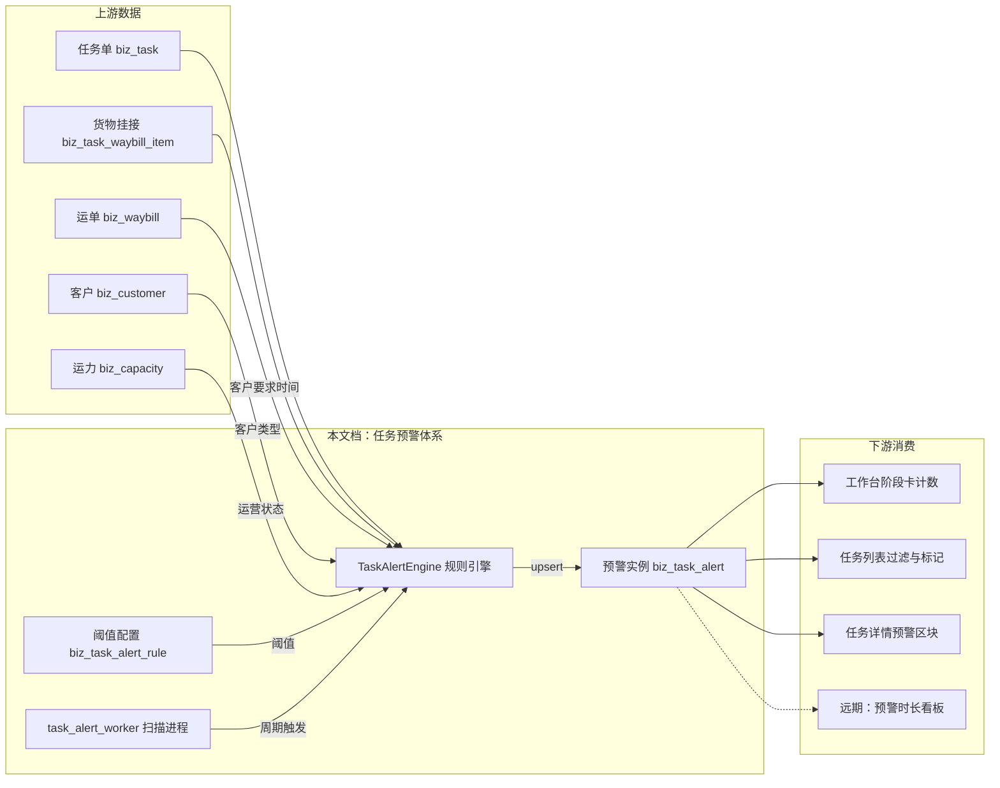
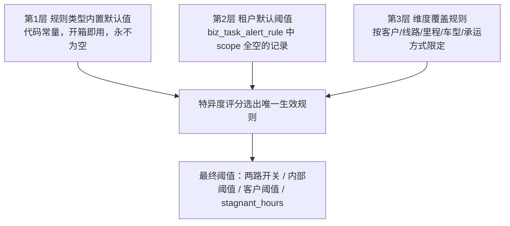
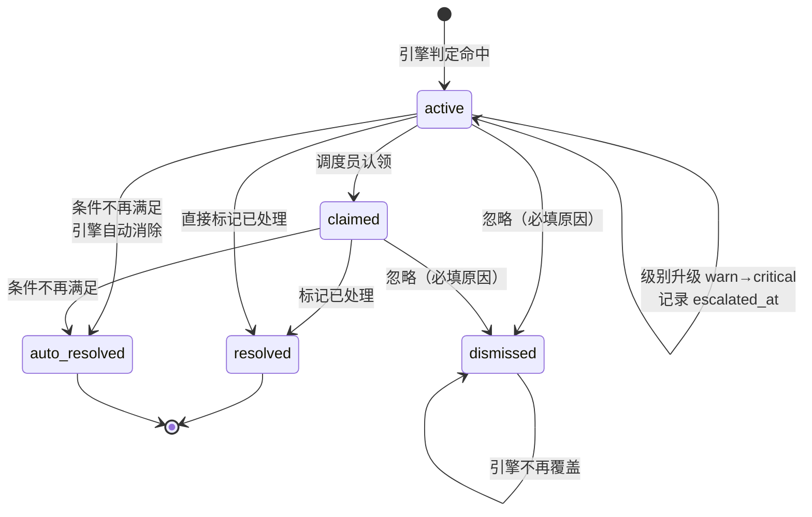
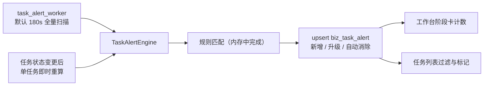

# 企业端运营调度模块 - 任务预警体系设计

> **所属阶段**：阶段五 - 企业端运营调度模块
>
> **文档状态**：方案确认（首版）
>
> **创建日期**：2026-08-12
>
> **优先级**：高（调度工作台核心闭环）
>
> **关联文档**：
> - 同目录 [01.运输任务单管理](01.运输任务单管理.md)
> - 同目录 [02.运单与任务单状态机联动设计](02.运单与任务单状态机联动设计.md)
> - 同目录 [03.任务单调令设计](03.任务单调令设计.md)
> - 《02.企业端/04.计费引擎模块/04.任务支出成本自动计算系统设计文档.md》（规则匹配范式来源）
> - 《02.企业端/05.业务模块-运单管理.md》（`required_load_time` / `required_deliver_time` 字段来源）

## 一、功能概述

调度工作台（`/operation/task-workbench`）的六张阶段卡上，每张卡都有一对「常 / 警」徽标，设计意图是让调度员一眼看出**每个阶段有哪些任务已经脱离了正常节奏**。本文档把这个只完成了一半的能力补成完整闭环。

核心设计原则：

- **预警要提前，不要事后**：每条时效规则产生两级——`warn`（关注，距应完成时间还剩 N 分钟）与 `critical`（严重，已超时 M 分钟）。原实现只有「已经超时」一种判定，等于事后记账，没有干预窗口。
- **客户差异优先走数据，其次才走配置**：`biz_waybill.required_load_time` / `required_deliver_time` 就是客户 SLA 的天然载体，规则通过「时间基准」开关直接消费，绝大多数客户差异不需要配任何规则。
- **单一事实源**：预警判定全部下沉到后端并物化落表，前端不再持有任何判定逻辑，彻底消除卡片计数与列表标记两套口径。
- **漏报比误报更严重**：规则冲突不阻断出警（与计费引擎 `RULE_CONFLICT` 抛异常阻断的策略刻意相反），冲突只在配置页提示。
- **预警可处理、可消除、可追溯**：预警是有生命周期的实体，支持认领、处理、忽略，条件不再满足时自动消除，全过程留痕。

## 二、业务背景

### 2.1 原实现的五个缺口

| 缺口 | 具体表现 |
|------|----------|
| 规则单一且滞后 | 后端 `TaskService.workbench_stats` 只有一条硬编码判断：`planned_load_time < now` 或 `planned_arrive_time < now` |
| 两个阶段完全空缺 | `pendingLoadAlert` / `pendingSignAlert` 直接返回 `0`，待装车、待交车两张卡的「警」恒为 0 |
| 前后端两套口径 | 前端 `workbench-pool-registry.ts` 自带 `loadOverdue` / `arriveOverdue` 行级判定与 `stageAlertHours`（6~48h）停留标红，与后端卡片计数不是同一套规则 |
| 无法差异化 | 阈值写死在代码，主机厂与个人客户、300 公里短驳与 1500 公里干线用同一把尺子 |
| 不可闭环 | 预警不落库，无法记录何时触发、谁在处理、是否已忽略，也无法统计预警时长 |

### 2.2 为什么需要差异化

商品车物流的时效要求天然不统一：

- **客户维度**：主机厂发运有严格的到货窗口，考核到小时；个人客户和贸易商往往只关心「这几天到」。
- **线路维度**：同城短驳 4 小时没装车就是异常；1500 公里干线提前一天备车都算正常。
- **商品车维度**：新能源车受电量与充电桩约束，滞留成本远高于燃油车；高价值车型的在途停留风险也更高。
- **承运方式维度**：自有车队可控性强，社会运力临时接单，需要更早介入。

因此预警阈值必须能按维度覆盖，但**又不能把配置复杂度甩给运营**——所以采用「内置默认值 → 租户默认值 → 维度覆盖」的三层模型，不配任何规则也能开箱可用。

### 2.3 与其他模块的关系



### 2.4 规则引擎范式来源

本模块的「多维度匹配 + 特异度评分 + 人工优先级」直接沿用计费引擎（`FreightMatcher` / `CostMatcher`）已验证的心智模型，但在两处刻意分叉：

1. **存储形态**：用独立列而非 `conditions_json` 条件树。预警阈值是运营人员日常自助维护的对象，配置门槛必须低于计费规则。
2. **冲突策略**：计费同分冲突抛 `RULE_CONFLICT` 阻断计算（金额算错代价大）；预警同分时按 `rule_version` → `id` 兜底继续出警（漏报代价大）。

## 三、需求详情

### 3.1 预警规则类型目录

从物流运营全链路梳理，分四大类。每条规则的统一结构为「规则码 + 适用阶段 + 时间基准 + 阈值」。

#### A 类：时效超时（核心）

| 规则码 | 适用阶段 | 时间基准 | 业务含义 |
|--------|----------|----------|----------|
| `ASSIGN_TIMEOUT` | 待分配(-1) | 计划/要求装车时间 | 临近装车仍未确认承运方 |
| `DISPATCH_TIMEOUT` | 待派车(0) | 计划/要求装车时间 | 临近装车仍未派车 |
| `LOAD_TIMEOUT` | 待装车(1) | 计划/要求装车时间 | 已派车但迟迟未装车 |
| `DEPART_TIMEOUT` | 待发车(2) | 实际装车时间 + 允许停留 | 装完车压在场内不发车 |
| `ARRIVE_TIMEOUT` | 在途(3) | 计划/要求到达时间 | 临近或超过承诺到货 |
| `DELIVER_TIMEOUT` | 待交车(4) | 实际到达时间 + 允许交接 | 到场后迟迟未完成逐台交接 |

判定逻辑统一为：

```
due_at = 基准时间（DEPART/DELIVER 为「锚点时间 + 允许时长」）
若 now >= due_at + critical_after_minutes  → critical（严重）
若 now >= due_at - warn_ahead_minutes      → warn（关注）
否则                                        → 不出警
```

`DEPART_TIMEOUT` 用「实际装车时间 + 允许停留」而非原实现的「计划到达时间」：装完车压在场内不发车是独立的管理问题，用终点时间反推会把长途任务的正常准备期误报成异常。

`DELIVER_TIMEOUT` 同理用「实际到达时间 + 允许交接时长」，因为交车是逐台验车的过程，其时效锚点是到场时刻而不是干线到货承诺。

#### 时间基准（内部计划 / 客户要求两路）

时效类（deadline）规则不再三选一「用哪口钟」，而是**两路同时可配**：

| 一路 | 取值来源 | 阈值字段 |
|------|----------|----------|
| 内部计划时间 | `biz_task.planned_load_time` / `planned_arrive_time` | `warn_ahead_minutes` / `critical_after_minutes` |
| 客户要求时间 | 经 `biz_task_waybill_item` 关联 `biz_waybill.required_load_time` / `required_deliver_time`，一车多单时取最早 | `warn_ahead_required_minutes` / `critical_after_required_minutes` |

每一路可以单独关掉（`plan_enabled` / `required_enabled`）。两路都开时，引擎对两个时间各算一遍关注/严重，**谁先碰到阈值听谁的**（级别更高者优先，同级取应完成更早的那路）。任务上没填的那路自动跳过，不再回落到另一口钟。

`time_basis` 仍保留为派生字段：只开内部=0，只开客户=1，两路都开=2，便于兼容旧配置。存量规则升级时按原 `time_basis` 还原开关，并把原阈值抄到客户这一路，行为与升级前对齐。

系统默认内部略严、客户略松（例如待分配：内部提前 240 分钟 / 客户提前 120 分钟），符合「内部要求比客户红线更早盯」的运营习惯。

#### B 类：阶段滞留

| 规则码 | 适用阶段 | 时间基准 | 业务含义 |
|--------|----------|----------|----------|
| `STAGE_STAGNANT` | 全部执行中阶段 | `biz_task.stage_entered_at` | 本阶段停留超过 N 小时，进度不推进 |

与 A 类互补：A 类回答「对不对得上承诺」，B 类回答「有没有在推进」。计划时间与客户要求时间双双缺失时，B 类是唯一兜底。该字段已存在，原先只被前端用来标红，从未进入卡片计数。

阈值按阶段独立配置（`stagnant_hours_by_stage`），默认值分别为：待分配 12h、待派车 12h、待装车 24h、待发车 6h、在途 48h、待交车 24h——与原前端 `stageAlertHours` 对齐，保证改造前后观感连续。

#### C 类：执行异常

| 规则码 | 适用阶段 | 判定条件 | 交付批次 |
|--------|----------|----------|----------|
| `CAPACITY_ABNORMAL` | 待装车 / 待发车 / 在途 | 承运运力 `operation_status` ∈ {休假, 停运, 维修保养} | 一期 |
| `LOAD_MISMATCH` | 待发车 | 已装车台数 < 任务计划台数 | 一期 |
| `NO_ROUTE_PLAN` | 待装车 | 已派车但未规划运输路线（无有效调令） | 一期 |
| `OVERLOAD` | 待装车 / 待发车 | 任务总台数 > 挂车核定车位数 | 远期 |
| `COMPLIANCE_RISK` | 待装车及之后 | 关联司机/车辆证照已过期或临界 | 远期 |

C 类不依赖时间推移，一律直接判为 `critical`（`CAPACITY_ABNORMAL` 例外，判为 `warn`，因为运力状态可能只是暂时未同步）。

#### D 类：财务与回单（远期，本次不做）

`PREPAY_MISSING`（社会运力未预付即派车）、`RECEIPT_MISSING`（交车后 N 天未回单）。这两条的责任人是财务而非调度，未来应挂在财务工作台而非调度工作台。

### 3.2 分层阈值模型



#### 覆盖维度

| 维度 | 字段 | 说明 |
|------|------|------|
| 客户（精确） | `customer_id` | 任务挂接的任一运单客户命中即算命中 |
| 客户类型 | `customer_type` | 0 主机厂 / 1 贸易商 / 2 经销商 / 3 个人 / 4 其他 |
| 线路 | `origin_region_id` / `destination_region_id` | 支持行政区链向上匹配（区县 → 市 → 省） |
| 里程区间 | `distance_min` / `distance_max` | 取任务调令里程合计，缺失时回落 `biz_route` 匹配值 |
| 商品车品牌 | `brand_id` | 任务挂接的任一商品车命中即算命中 |
| 商品车车系 | `series_id` | 同上，比品牌更特化 |
| 承运方式 | `carrier_type` | 1 自有车 / 2 承运商 / 3 社会运力 |

维度全部为空的规则即「租户默认阈值」，是第 2 层。

#### 特异度评分

| 命中维度 | 分值 |
|----------|------|
| `customer_id` 精确 | 100000 |
| `customer_type` | 50000 |
| 线路 区县↔区县 | 30000 |
| 线路 市↔市 | 20000 |
| 线路 省↔省 | 10000 |
| 里程区间 | 8000 |
| `series_id` | 3000 |
| `brand_id` | 2000 |
| `carrier_type` | 1000 |
| 人工 `priority` | 直接累加 |

得分最高者生效。同分时按 `rule_version` 降序 → `id` 降序兜底选取，**不抛异常**，并在日志中记录一次冲突提示。

### 3.3 预警生命周期



关键约定：

- **同一任务同一规则码在未删除范围内只有一条记录**，重复扫描做 upsert 而非追加。
- **人工忽略后引擎不再覆盖其状态**（与 `biz_compliance_alert` 的 `dismissed` 语义一致），避免调度员刚忽略、下一轮扫描又弹回来。
- **任务离开该阶段或条件不再满足时自动消除**（`status=3`），保留 `resolved_at` 供事后统计预警持续时长。
- **级别只升不降**：`warn` 升 `critical` 记 `escalated_at`；不会因为改了阈值把 `critical` 降回 `warn`（历史事实不应被配置变更改写）。

### 3.4 工作台交互

#### 阶段卡徽标（三级）

原「常 / 警」二元药丸升级为三元：

| 药丸 | 含义 | 颜色 |
|------|------|------|
| 常 | 无任何活跃预警的任务数 | 阶段主题色 |
| 关注 | 最高级别为 `warn` 的任务数 | 警告黄 |
| 严重 | 存在 `critical` 预警的任务数 | 危险红 |

三者互斥且相加等于该阶段总数。一个任务同时命中多条规则时，按**最高级别**归类，避免重复计数。

#### 列表行级

- 状态列的预警标签按级别着色，hover 展示命中的规则名称与超时时长。
- 新增「超时时长」列，可排序，让调度员优先处理拖得最久的。
- 移除前端本地的 `stageAlertHours` 标红逻辑，改由 `STAGE_STAGNANT` 规则统一产出。

#### 处理动作

- 任务详情抽屉新增「预警」区块，列出该任务的活跃预警与历史预警，提供「认领」「标记已处理」「忽略」。
- 忽略必须填写原因，便于事后复盘「为什么这批任务的预警被大量忽略」——这往往说明阈值配错了。
- 列表批量操作栏提供「批量忽略」。

### 3.5 规则配置页

新增菜单「预警规则」（`/operation/alert-rule`），两个 Tab：

- **默认阈值**：各规则类型的租户级默认值，表单式一屏配完，含启用开关。
- **覆盖规则**：列表 + 新增/编辑弹窗，维度选择器 + 阈值。保存前做冲突预检，命中同维度同优先级的既有规则时提示确认。

## 四、数据模型

### 4.1 `biz_task_alert`（预警实例）

| 字段 | 类型 | 说明 |
|------|------|------|
| `task_id` | BIGINT | 关联 `biz_task.id` |
| `task_no` | VARCHAR(50) | 任务单号（冗余） |
| `stage` | SMALLINT | 触发时的任务状态 |
| `rule_code` | VARCHAR(32) | 规则码，见 §3.1 |
| `rule_id` | BIGINT NULL | 命中的覆盖规则；空表示用内置或租户默认阈值 |
| `level` | SMALLINT | 1 关注 / 2 严重 |
| `due_at` | DATETIME NULL | 应完成时间（时效类才有） |
| `overdue_minutes` | INT | 超时分钟数（物化，供排序；未超时为 0 或负） |
| `status` | SMALLINT | 0 活跃 / 1 已处理 / 2 已忽略 / 3 自动消除 |
| `triggered_at` | DATETIME | 首次触发时间 |
| `escalated_at` | DATETIME NULL | 升级为严重的时间 |
| `last_scan_at` | DATETIME | 最近一次扫描命中时间 |
| `handler_id` / `handler_name` / `claimed_at` | — | 认领信息 |
| `resolved_at` / `resolved_by` / `resolve_type` / `resolve_remark` | — | 处理信息 |
| `snapshot_json` | JSON | 触发时的上下文快照（客户、线路、台数、基准时间来源） |

唯一约束：`(task_id, rule_code, is_deleted)`。

`snapshot_json` 的价值在于：阈值改了之后，历史预警仍然能解释「当时为什么报」。没有它，运营复盘时只能面对一堆无法还原的记录。

### 4.2 `biz_task_alert_rule`（阈值配置）

| 分组 | 字段 |
|------|------|
| 标识 | `rule_code`、`rule_name` |
| 客户维度 | `customer_id`、`customer_type` |
| 线路维度 | `origin_region_id`、`destination_region_id` |
| 里程维度 | `distance_min`、`distance_max` |
| 车型维度 | `brand_id`、`series_id` |
| 承运维度 | `carrier_type` |
| 阈值 | `time_basis`、`warn_ahead_minutes`、`critical_after_minutes`、`stagnant_hours` |
| 治理 | `priority`、`status`、`effective_date`、`expiry_date`、`rule_version`、`remark` |

### 4.3 迁移与注册

按 `deploy-migration-guard` 规范，两张新表属于「新增整表」场景：

1. `python -m scripts.migration.autogen tenant` 刷新 snapshot（新表本身不需要手写 versioned migration，由 runner Phase 1 按 `required_tables` 建表）
2. dev console 将 `biz_task_alert`、`biz_task_alert_rule` 加入 `biz_task` feature 的 `required_tables`
3. dev console 配置「预警规则」菜单
4. `python -m scripts.platform_sync export`，提交 `product_feature.json` 与 `client_menu.json`
5. 合并前跑 `python -m scripts.migration.check` 确保退出码 0

## 五、API 设计

### 5.1 工作台统计（改造）

`GET /business/task/workbench-stats`

`alerts` 结构升级为按阶段返回两级计数，同时保留旧字段一个版本供前端灰度：

```json
{
  "statusCounts": { "-1": 12, "0": 30 },
  "totals": { "pendingAssign": 12, "pendingDispatch": 30 },
  "stageAlerts": {
    "-1": { "warn": 3, "critical": 2 },
    "0":  { "warn": 5, "critical": 1 }
  },
  "alerts": { "overdueAssignment": 2, "overdueDispatch": 1 }
}
```

`stageAlerts` 中 `warn` 与 `critical` 互斥（按任务最高级别归类），「常」= `totals` − `warn` − `critical`，由前端计算。

### 5.2 任务列表（改造）

`GET /business/task` 新增 `alertLevel` 参数，取代 `onlyOverdue` / `onlyNormal`：

| 值 | 含义 |
|----|------|
| `normal` | 无活跃预警 |
| `warn` | 最高级别为关注 |
| `critical` | 存在严重预警 |
| `any` | 存在任意活跃预警 |

列表项新增 `alertLevel`（0/1/2）与 `alertCodes`（命中的规则码数组），供行级渲染。

旧参数保留但标记废弃，行为映射为 `onlyOverdue → alertLevel=any`、`onlyNormal → alertLevel=normal`。

### 5.3 预警查询与处理（新增）

| 方法 | 路径 | 说明 |
|------|------|------|
| GET | `/business/task/{taskId}/alerts` | 某任务的预警列表（含历史） |
| GET | `/business/task-alert` | 预警分页（供远期预警中心） |
| POST | `/business/task-alert/{id}/claim` | 认领 |
| POST | `/business/task-alert/{id}/resolve` | 标记已处理 |
| POST | `/business/task-alert/{id}/dismiss` | 忽略（必填原因） |
| POST | `/business/task-alert/batch-dismiss` | 批量忽略 |
| POST | `/business/task-alert/recompute` | 手动触发重算（调试与应急） |

### 5.4 规则配置（新增）

| 方法 | 路径 | 说明 |
|------|------|------|
| GET | `/business/task-alert-rule/catalog` | 规则类型目录 + 内置默认值 |
| GET | `/business/task-alert-rule` | 规则分页 |
| POST | `/business/task-alert-rule` | 新增 |
| PUT | `/business/task-alert-rule/{id}` | 编辑（`rule_version` 自增） |
| DELETE | `/business/task-alert-rule/{id}` | 删除 |
| POST | `/business/task-alert-rule/check-conflict` | 保存前冲突预检 |

## 六、计算与触发



- **Worker**：`backend/app/modules/client/workers/task_alert_worker.py` + `backend/app/workers/task_alert_main.py`，沿用 `compliance_alert_worker` 的多租户轮询结构；`deploy/docker/docker-compose.yml` 增加 service；环境变量 `TASK_ALERT_WORKER_ENABLED` / `TASK_ALERT_WORKER_INTERVAL`。
- **即时触发**：任务状态推进后立即重算该任务，避免操作完还要等一轮扫描 UI 才正确。
- **性能**：一次性加载租户规则表到内存，活跃任务（`status ∈ {-1,0,1,2,3,4}`）批量拉取，关联的运单要求时间、客户类型、商品车品牌车系、调令里程全部批量预取，规则匹配在内存完成，全程无 N+1。

## 七、前端页面

| 文件 | 改造内容 |
|------|----------|
| `workbench-pool-registry.ts` | 删除 `loadOverdue` / `arriveOverdue` / `alertRule` / `stageAlertHours`，子集查询改用 `alertLevel` |
| `kpi-cards.vue` | 「常 / 警」二元药丸改为「常 / 关注 / 严重」三元 |
| `task-pool.vue` | 行级标签按级别着色 + hover 展示命中规则；新增「超时时长」可排序列 |
| `task-alert-panel.vue`（新增） | 任务详情抽屉的预警区块与处理动作 |
| `views/operation/alert-rule/`（新增） | 规则配置页（默认阈值 + 覆盖规则双 Tab） |

面向用户的文案遵循 `humanized-ux-copy` 规范，例如忽略确认写「忽略后该预警不再提醒，请填写原因便于后续复盘」，而不是技术化的 dismiss 表述。

## 八、菜单与产品版本注册

- 新菜单：运营调度 → 预警规则，path `/operation/alert-rule`，component `operation/alert-rule/index`
- 归属 feature：`biz_task`
- `required_tables` 追加 `biz_task_alert`、`biz_task_alert_rule`
- 上述两项均须经 dev console 配置后 `platform_sync export`，提交 snapshots，否则线上 deploy 不会生效

## 九、测试要点

1. **阈值命中**：计划装车时间前 120 分钟未派车 → 出 `warn`；超时后 → 升 `critical` 且 `escalated_at` 有值。
2. **时间基准**：`time_basis=1` 时按客户要求时间判定；一车多单取最早；要求时间缺失时回落计划时间。
3. **自动消除**：任务推进到下一阶段后，上一阶段预警 `status` 变为 3 且 `resolved_at` 有值，不残留。
4. **忽略不回弹**：人工忽略后再次扫描，该预警仍为 `dismissed`。
5. **特异度匹配**：客户级规则优先于客户类型级，客户类型级优先于租户默认。
6. **冲突不阻断**：两条同维度同优先级规则并存时不报错、不漏报，取版本更高者。
7. **口径一致**：六张卡的「关注」「严重」数与点击后列表条数完全一致（原实现待装车、待交车不一致）。
8. **容错**：worker 停止后页面仍展示最后一次扫描结果，不白屏、不报错。

## 十、远期演进

- **通知推送**：`critical` 预警推送站内信 / 企微，支持按责任人路由。
- **预警运营看板**：按客户、线路、承运商统计预警发生率与平均处置时长，反向驱动阈值调优与承运商考核。
- **C 类规则补全**：`OVERLOAD`、`COMPLIANCE_RISK` 接入。
- **D 类财务预警**：挂到财务工作台而非调度工作台。
- **阈值智能推荐**：基于历史实际时长分布，给出建议阈值，替代拍脑袋配置。
