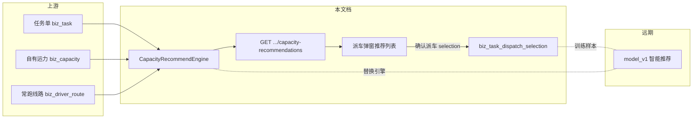

# 企业端运营调度模块 - 自有运力派车推荐

> **所属阶段**：阶段五 - 企业端运营调度模块
>
> **文档状态**：方案确认（首版）
>
> **创建日期**：2026-08-17
>
> **优先级**：高（调度工作台待派车闭环）
>
> **关联文档**：
> - 同目录 [01.运输任务单管理](01.运输任务单管理.md)（任务状态机、`assign-carrier`）
> - 同目录 [02.运单与任务单状态机联动设计](02.运单与任务单状态机联动设计.md)
> - 同目录 [03.任务单调令设计](03.任务单调令设计.md)
> - 《02.企业端/02.资源管理模块/02.驾驶员管理.md》（`biz_driver_route` 常跑线路）
> - 《02.企业端/02.资源管理模块/04.运力中心.md》（`biz_capacity` 运营状态）

## 一、功能概述

调度工作台「待派车」阶段的派车，默认假设调度已经知道派谁，因此弹窗主路径是「搜索司机/车牌」。这与产品理念相反：**系统应先给出运力顺序和理由，调度再选择**；调度可以不采纳推荐，但每一次确认派车都要留下「看到了谁 / 选了谁 / 是否改选」，供后续智能推荐使用。

本文档同时约束两期：

- **本期**：推荐式交互 + 可解释的启发式排序（`heuristic_v1`）+ 选择留痕
- **远期**：智能推荐模块只替换引擎实现，不改 API 路径、响应字段、弹窗主路径和 selection 表结构（只允许加列）

核心设计原则：

- **系统先给顺序，调度再拍板**：打开派车后主区域是带理由的顺序列表，搜索降为过滤，不再是主路径
- **理由必须可解释**：文案不假装「智能推荐」；每条理由有稳定 `code`，展示文本对调度员说人话
- **可以不采纳**：默认看推荐顺序；名单里没有的，用右上角搜索全部运力库。不再提供手填主驾/车牌
- **确认才记，不记点击流**：一条确认派车对应一条 `biz_task_dispatch_selection`，换车再记一条
- **引擎可替换、契约冻结**：前端只认 `engine` + `items[]`；换模型只换 `CapacityRecommendEngine` 实现

## 二、业务背景

### 2.1 原实现的缺口

- 自有车派车弹窗（`action-dispatch.vue`）是远程 `el-select`，placeholder 为「搜索司机/车牌」
- 运力列表 `GET /capacity/self_capacity/list` 按 `id DESC`，无线路匹配、无推荐理由
- `assign-carrier` 只写承运快照；`biz_task_status_event.payload_snapshot` 仅 4 个字段，查不了采纳率，也喂不了算法
- 社会运力选择器已按 `rating_score` 弱排序，但待派车池里社会运力极少（分配承运时已直达待装车）

### 2.2 为什么先做启发式、再留智能推荐

自有运力推荐算法尚未设计，但交互不能继续「先想好再搜」。本期用已有字段做出**诚实、可解释**的顺序，同时把接口和留痕一次做对。智能推荐开工时，只替换引擎，不推倒弹窗和表。

### 2.3 与其他模块的关系



## 三、范围

### 3.1 本期覆盖

- 调度工作台待派车（`status=0`）自有车 / 社会运力「派车」
- 已派车（`status=1`）自有车 / 社会运力「重新派车 / 换车」，复用同一弹窗
- 社会运力派车只选不填：司机、电话、身份证、车牌以运力中心档案为准
- 承运方式在「分配承运」阶段已锁定，本步不能改 `carrierType`

### 3.2 本期不覆盖（后续扩展，不在智能推荐第一期偷偷做）

- 承运商推荐（仍走 LITE 上报 / 调度代填）
- 社会运力评价推荐引擎（本期 `social_pool_v0` 仅池列表 + 评分弱排序）
- 待分配阶段的「分配承运」
- 空驶距离、实时位置、预计空闲、历史接单模型打分

## 四、产品原则与交互

打开派车后，主区域是按顺序排列的运力列表，不是搜索框。调度点选一行即可回填主驾 / 电话 / 车牌；名单里没有的，用右上角搜索全部运力库。

```text
┌──────────────────────────────────────────┐
│ 派车                                      │
│ RW… · 石家庄 → 三明 · 8 台 · 自有车        │
├──────────────────────────────────────────┤
│ 建议按这个顺序派              [过滤司机/车牌] │
│                                          │
│  1  张三   冀A12***   可接单               │
│     当前可接单 · 常跑石家庄→三明            │
│                                          │
│  2  李四   冀B34***   运输中               │
│     正在执行其他任务                       │
│                                          │
│ 已选定  张三  冀A12***                      │
│                        [取消] [确认派车]   │
└──────────────────────────────────────────┘
```

交互约定：

- 记忆点：左侧名次 + 一行业务理由；选中行用主色竖条，不用徽章墙
- 搜索是列表过滤，placeholder 用「过滤司机/车牌」
- 运输中可选，确认前提示「这辆车还在运输中，确认要派给它吗？」
- 休假 / 停运 / 维修默认不进主列表，只能靠过滤找到
- Loading：「正在匹配可用运力，请稍候…」
- 空态：「暂时没有可推荐的运力，用右上角搜索全部运力」
- 成功：「已派给 张三 / 冀A12***」

## 五、分期与稳定契约

### 5.1 分期

| 期次 | 引擎 | 做什么 | 不做什么 |
|------|------|--------|----------|
| 本期 | `heuristic_v1` | 推荐式弹窗、规则排序、选择留痕 | 模型打分、距离/位置特征 |
| 远期 | `model_v1`（示例名） | 替换 `CapacityRecommendEngine` 实现 | 改 API 路径、改响应字段、改弹窗主路径、改 selection 表结构（只允许加列） |

智能推荐真正开工时：只改引擎实现和本文档「远期」章节，不另起炉灶。

### 5.2 拉取推荐（冻结）

`GET /business/task/{task_id}/capacity-recommendations?keyword=&limit=20`

响应：

```json
{
  "engine": "heuristic_v1",
  "items": [
    {
      "capacityId": 12,
      "driverName": "张三",
      "driverPhone": "13800000000",
      "plateNumber": "冀A12345",
      "trailerPlateNumber": "",
      "operationStatus": 1,
      "rank": 1,
      "reasons": [
        { "code": "AVAILABLE", "text": "当前可接单" },
        { "code": "FAMILIAR_ROUTE", "text": "常跑石家庄→三明" }
      ]
    }
  ]
}
```

字段约定：

- `engine`：实现标识，前端原样回传给 `selection.engine`
- `items`：已按推荐顺序排好，`rank` 从 1 起
- `reasons`：至少 0 条；展示时用 `text`，训练/分析用 `code`
- 承运商任务返回 `items: []`，不报错
- 社会运力任务返回 `engine=social_pool_v0` 的池列表；`capacityId` 此时为社会运力 ID，评价推荐落地后只换引擎

### 5.3 确认派车留痕（冻结）

`POST /business/task/{task_id}/assign-carrier` 增加可选字段 `selection`。LITE / 旧客户端不传则不写记录，派车本身不受影响。

`selection` 字段：

- `engine`：当时列表使用的引擎名
- `source`：`recommended` | `search` | `manual`
  - `recommended`：未过滤，从默认列表点选
  - `search`：用过过滤后点选
  - `manual`：未选 `capacityId`，手填主驾+车牌
- `shownCapacityIds`：确认时列表里看到的运力 id
- `topRecommendedId`：首次加载（过滤前）的第 1 名
- `selectedCapacityId` / `selectedRank`：实际选中的运力及当时名次

`adopted` 由后端计算，不接受前端传入：`selectedCapacityId == topRecommendedId` 则为采纳。

### 5.4 选择留痕如何喂算法

按任务**每一次确认派车**落一行（换车再落一行），不记点击流。

| 字段 | 训练含义 |
|------|----------|
| `shownCapacityIds` | 当时曝光集合（未曝光的运力不能当负样本） |
| `topRecommendedId` | 系统当时的第一推荐 |
| `selectedCapacityId` | 正样本（调度最终采纳的运力） |
| `selectedRank` | 点选时的名次，用于看「第几名才被选」 |
| `source` | 是否离开推荐主路径（过滤 / 手填） |
| `adopted` | 是否采纳第一推荐；采纳率 = `adopted=1` 的确认数 / 有 `topRecommendedId` 的确认数 |

## 六、本期启发式（`heuristic_v1`）

只对绑定中的自有运力（`biz_capacity.status=1` 且未删除）打分。

占用规则（先于运营状态）：

- 其他未完成任务已绑定该运力（`biz_task.capacity_id` 有值，且 `status` 为待分配 / 待派车 / 已派车 / 已装车 / 在途 / 已到达）→ **默认推荐排除**
- 当前正在派/换的这张任务自己占用的运力仍出现（换车要看得见现任）
- 右上角搜索全部运力库时仍可找到，理由为「已派其他任务」，确认前再提示一次
- 已交车 / 已关闭 / 已取消不算占用

> 任务模块目前不会在选运力建单或派车时改 `biz_capacity.operation_status`。司机端「待接收 / 待接单」来自任务占用，不是运力运营状态。推荐必须以任务占用为准，不能只看「可接单」。

排序：

1. 可接单（`operation_status=1`）且未被其他任务占用，优先
2. [`biz_driver_route`](../../../../backend/app/modules/client/models/capacity/self_capacity/driver/driver_route.py) 与任务 `origin_code` / `destination_code` 匹配（编码相等或互为前缀）再加分
3. 运输中（`operation_status=2`）且未被其他任务占用，次之
4. 休假 / 停运 / 维修（3 / 4 / 5），以及已被其他任务占用的运力：默认不进主列表；过滤命中时沉底

reason code 清单（本期冻结，远期只增不改语义）：

| code | 展示文案 | 何时出现 |
|------|----------|----------|
| `AVAILABLE` | 当前可接单 | `operation_status=1` 且未被其他任务占用 |
| `FAMILIAR_ROUTE` | 常跑{起点}→{终点} | 常跑线路与本单起终点匹配 |
| `IN_TRANSIT` | 正在执行其他任务 | `operation_status=2` 且未被其他任务占用 |
| `ASSIGNED_OTHER` | 已派其他任务，待接单或执行中 | 已被其他未完成任务占用（仅搜索命中时出现） |
| `ON_LEAVE` | 司机休假中 | `operation_status=3` |
| `STOPPED` | 当前停运 | `operation_status=4` |
| `MAINTENANCE` | 维修保养中 | `operation_status=5` |

本期**不做**：空驶距离、实时位置、预计空闲、历史接单、车型与台数匹配。

## 七、数据

### 7.1 `biz_task_dispatch_selection`

租户表，append-only。挂在产品功能 `biz_task` 的 `required_tables`。

| 字段 | 说明 |
|------|------|
| `task_id` | 任务单 |
| `dispatcher_id` / `dispatcher_name` | 确认派车的调度员 |
| `carrier_type` | 当时承运方式 |
| `engine` | 如 `heuristic_v1` |
| `source` | `recommended` / `search` / `manual` |
| `shown_capacity_ids` | JSON 数组 |
| `top_recommended_id` | 首次加载第 1 名 |
| `selected_capacity_id` / `selected_rank` | 实际选择 |
| `adopted` | 0/1，后端计算 |

不要把这些信息塞进 `biz_task_status_event.payload_snapshot`。

### 7.2 远期可消费、本期不接入的特征

写明出处，避免下一轮再翻代码：

| 特征 | 大概数据来源 | 本期 |
|------|----------------|------|
| 运营状态 | `biz_capacity.operation_status` | 已用 |
| 常跑线路 | `biz_driver_route` ↔ 任务 `origin_code` / `destination_code` | 已用 |
| 空驶 / 线路里程 | `biz_route` / `GET /business/task/route-distance` | 预留 |
| 当前位置 | 在途监控 / 司机定位（若已接入） | 预留 |
| 预计空闲时间 | 该运力当前任务的计划到达时间 | 预留 |
| 历史接单与改选率 | 本表 `adopted` / `source` 聚合 | 预留 |
| 车型与台数匹配 | `biz_vehicle_ext.vehicle_type` ↔ 任务 `total_quantity` | 预留 |
| 司机分组 | `biz_capacity_group` / `biz_capacity_group_member` | 预留 |

## 八、实现锚点

| 职责 | 位置 |
|------|------|
| 引擎协议 + 启发式 | `backend/app/modules/client/services/capacity/self_capacity/recommend/` |
| 推荐 API | `GET /business/task/{id}/capacity-recommendations` |
| 派车 + 留痕 | `TaskService.assign_carrier`，请求体 `selection` |
| 留痕表 | `biz_task_dispatch_selection` |
| 派车弹窗 | `frontend/client/src/views/operation/task-workbench/components/action-dispatch.vue` |

## 九、验收与观测

本期功能验收：

- 待派车点「派车」（自有车）：先看到带理由的顺序列表，不必先搜
- 点选即可派；名单外运力用右上角搜索全部运力库
- 已被其他未完成任务占用的运力不进默认推荐（搜索可找到，确认前再提示）；运输中有确认提示；休假 / 停运 / 维修不抢主列表
- 确认后 `biz_task_dispatch_selection` 有记录，能区分采纳 / 改选 / 手填
- 承运商弹窗行为不变；不传 `selection` 的派车接口仍可用

观测（判断「该上模型了」的依据，本期不做看板）：

- **采纳率**：`adopted=1` / 有 `topRecommendedId` 的确认数
- **改选率**：`source ∈ {search, manual}` 的确认占比
- **空列表率**：推荐接口 `items` 为空的打开次数（可由前端日志或后续补计数）

采纳率长期偏低、改选集中在同一类运力时，再启动 `model_v1`，而不是先改弹窗。
