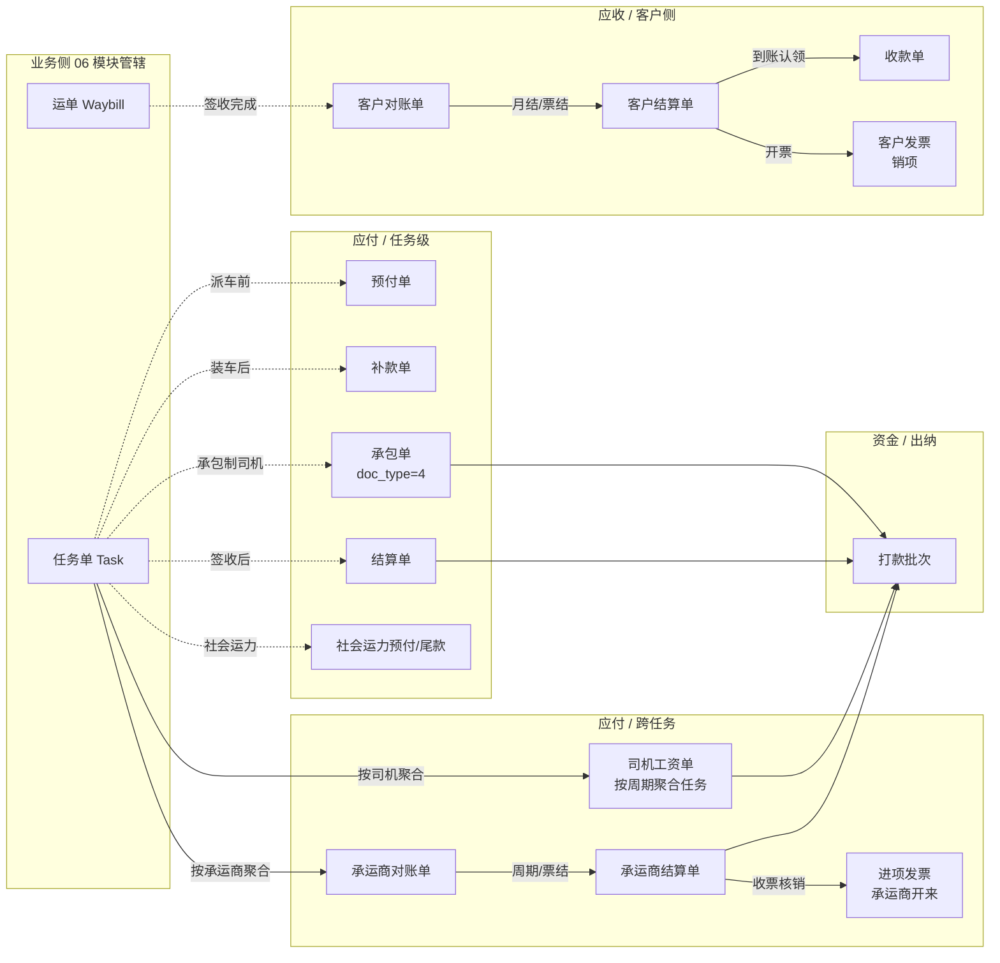
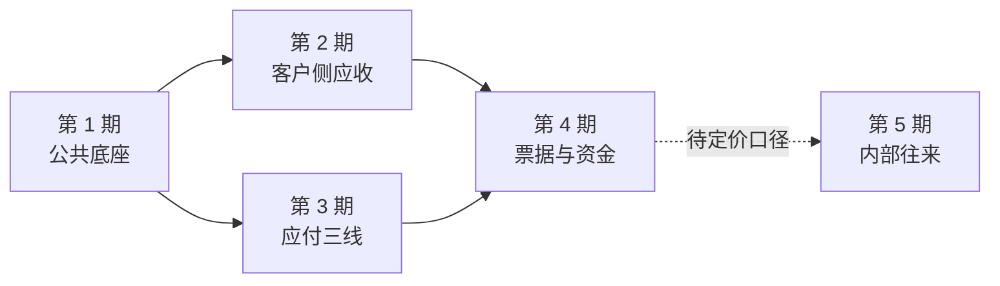

# 企业端财务结算模块 - 模块总览

> **所属阶段**：阶段六 - 财务结算模块
>
> **文档状态**：第 0~4 期全部落地（通用基座、任务级费用单、客户侧应收、应付三线、票据与资金、经营核算）；第 5 期主体内部往来未立项
>
> **创建日期**：2026-05-19
>
> **最近更新**：2026-08-14（模块测试收官：新增 §7.6 记录三个 verify 脚本 187 项断言与写链路修出的 4 个缺陷，其中销项票建单、打款批次建单、开票登记三处为「功能完全不可用」级）
>
> **上一次更新**：2026-08-14（第 3、4 期收官：§5.1/5.2 目录树全绿、§6.2 十类 `doc_kind` 全登记、§6.3 补事件 27/28、§7 分期表 3/4 期转 ✅ 并新增 §7.3/7.4/7.5、§9.2/9.3 回写实际菜单与权限点 id）
>
> **更早更新**：2026-08-14（第 2 期收官：§5.1/5.2 目录树补对账工作台聚合与四个前端页面、§6.3 事件 26 转已落地、§7 分期表第 2 期转 ✅、§7.2 六段全绿并补 E/F 段三处口径、§9.1 更新 id 空档口径为 1123 起）
>
> **历史更新**：2026-08-13（模块框架重构：信息架构改为岗位工作台 + 单据台账双层，二级菜单 16 项其中 13 项新增；补齐进项发票、收款单、打款批次三类单据；新增 08~13 六篇设计文档；实施分期重排为 0~4 期，主体内部往来移出本期）；2026-07-06（同步 `cadcc0c` 财务基座落地：新增承包单 `doc_type=4`、财务与 `task.status` 彻底解耦改用 `is_locked`、审计事件流 `biz_finance_doc_event` 落表）
>
> **优先级**：高（与业务单据闭环对齐）
>
> **关联文档**：
>
> - [06.运营调度模块/02.运单与任务单状态机联动设计](../06.运营调度模块/02.运单与任务单状态机联动设计.md)（§7 业务-财务边界由本模块承接）
> - [05.合作伙伴模块/01.客户管理](../05.合作伙伴模块/01.客户管理.md)
> - [05.合作伙伴模块/02.承运商管理](../05.合作伙伴模块/02.承运商管理.md)
> - [04.计费引擎模块/02.运单合同运费自动计算系统设计文档](../04.计费引擎模块/02.运单合同运费自动计算系统设计文档.md)
>
> **本目录文档清单**：
>
> | # | 文档 | 内容 |
> |---|------|------|
> | 00 | 本文 | 模块全景、单据矩阵、与业务单据边界、菜单信息架构、`doc_kind` 与事件类型分配、实施分期 |
> | 01 | [财务单据体系与业务单据联动设计](01.财务单据体系与业务单据联动设计.md) | 通用基座：基类、状态机、关联结构、锁定/审计、闸口实现位置 |
> | 02 | [客户侧-对账与结算与发票](02.客户侧-对账与结算与发票.md) | 客户对账单 → 客户结算单 → 客户发票 → 应收冲销 |
> | 03 | [承运商侧-对账与结算](03.承运商侧-对账与结算.md) | 承运商对账单 → 承运商结算单（跨任务） |
> | 04 | [自有司机工资单](04.自有司机工资单.md) | 周期 + 任务聚合 + 多工资项的应付工资闭环 |
> | 05 | [任务级费用单演进与社会运力预付尾款](05.任务级费用单演进与社会运力预付尾款.md) | 现有预付/补款/结算如何对接通用基座；社会运力预付/尾款扩展 |
> | 06 | [任务级承包单与司机承包结算](06.任务级承包单与司机承包结算.md) | 承包单 `doc_type=4` + 司机承包结算配置 `biz_driver_settlement_config` + 结算模式（已落地） |
> | 07 | [驾驶员资金账户](07.驾驶员资金账户.md) | 驾驶员往来账户 `biz_driver_fund_account` + 资金流水 `biz_driver_fund_transaction`；预付沉淀、双向往来、手工记账（设计中） |
> | 08 | [岗位视角与工作台设计](08.岗位视角与工作台设计.md) | 五岗位职责边界 + 对账 / 出纳 / 票据三个工作台的信息架构与权限粒度 |
> | 09 | [运输单与财务单一致性核对](09.运输单与财务单一致性核对.md) | 对账快照、`recon_dirty` 脏标记、四类差异检测、三种处置、`biz_recon_diff` |
> | 10 | [资金收付与出纳台](10.资金收付与出纳台.md) | `biz_bank_account` + 打款批次 + 收款单与核销 |
> | 11 | [进项发票管理](11.进项发票管理.md) | 承运商收票 `biz_vendor_invoice` + 票款核对 + 与承运商结算单核销 |
> | 12 | [应收账龄与信用管控](12.应收账龄与信用管控.md) | 账龄分桶口径、客户账期与信用额度（只预警不拦截） |
> | 13 | [经营核算口径](13.经营核算口径.md) | 多维收入-成本-毛利归集口径，与数据洞察驾驶舱的分工边界 |

## 一、模块定位与设计目标

### 1.1 定位

财务结算模块是业务单据（运单 / 任务单 / 挂接行）的"下游账务侧"。它负责把"已发生的物的流转"换算成"对内对外的钱的流转"，并通过审批、支付、核销、开票完成闭环。

它**不重新定义业务单据的状态**，只通过 06 模块《运单与任务单状态机联动设计》§7 约定的稳定接口字段，从业务侧读取"什么可以结算 / 已经结算到什么程度"。

### 1.2 设计目标

| # | 目标 | 落点 |
|---|------|------|
| 1 | **应收 / 应付 / 对账 / 开票四象限闭环** | 客户侧、承运商侧、自有司机、任务级 4 条线 |
| 1b | **岗位可直接开工**：每个财务岗位都有一个聚合待办的工作台，不必在多个台账间跳转拼信息 | 对账 / 出纳 / 票据三个工作台，见 `08` |
| 1c | **账实一致可自证**：财务单据的计费基础必须能与运输事实逐行比对，差异可留痕、可处置 | 一致性核对器，见 `09` |
| 2 | **复用同一套基座抽象**：避免每类单据一套草稿/审批/支付状态机各写一遍 | `01.通用基座` 定义 `FinanceDocBase` + 通用状态机 |
| 3 | **与业务单据强解耦，弱联动**：业务单据状态机不感知财务单据存在，财务单据只在闸口处反向影响业务 | 闸口数 ≤ 8（见 06 模块 §7.4） |
| 4 | **关联拓扑按基数分两条路径**：避免使用多态外键 `(biz_doc_type, biz_doc_id)` | 1:1 → 直接 FK；N:N → 桥接表 |
| 5 | **审计与锁定一等公民**：任何"已支付 / 已收款 / 已开票"动作都不可静默修改，留痕到 `biz_finance_doc_event` | 见 `01.通用基座` §6 |
| 6 | **优先实现已有缺口**：客户对账/结算（应收）零实现需先补上；任务级预付/补款/结算已有，按基座规范"渐进迁移"非"推倒重来" | 见 `05.任务级费用单演进` 兼容策略 |

### 1.3 不在本期范围

| 不做 | 原因 | 未来路径 |
|------|------|---------|
| 自动对账匹配 / 银行流水回单 OCR | 工程量大，依赖外部网关 | 远期独立子模块 |
| 多税率自动开票 / 电子发票网关对接 | 涉及金税合规、依赖第三方 SaaS | `02.客户侧` 预留 `tax_rate` / `invoice_no` 字段，远期接入 |
| 多币种汇率换算 | 当前 99% 业务 CNY | 字段已留 `currency`，远期补汇率表 |
| 多组织合并报表 | 企业端单租户视角即可 | 平台端阶段处理 |
| 财务凭证导出（金蝶/用友） | 一次性脚本即可，不形成模块 | 远期工具脚本 |
| 经营主体内部往来（关联交易）结算 | 跨主体定价口径未定（成本加成 / 内部协议价 / 收入分成三选一未拍板），先建表必返工 | 待业务确认后单独立项，见 `13` §六 |
| 银企直连自动打款 | 依赖银行接口与资质 | `10` 的打款批次预留 `bank_serial_no` 与执行结果字段，远期换实现 |

## 二、业务全景

### 2.1 价值链一图流



### 2.2 单据矩阵（全模块全单据）

| # | 单据 | 收/付 | 关联对象 | 关联基数 | 状态机 | 现状 | 落地文档 |
|---|------|------|---------|---------|--------|------|---------|
| 1 | 客户对账单 | 应收 | 多张运单 | N:N | 草稿→对账中→已确认→已结清/已撤销 | 未实现 | `02` |
| 2 | 客户结算单 | 应收 | 一/多张客户对账单 | 1:N | 草稿→待审批→已审批→已收款→已撤销/已开票 | 未实现 | `02` |
| 3 | 客户发票 | 应收 | 一/多张客户结算单 | 1:N | 草稿→申请中→已开票→已作废/已红冲 | 未实现 | `02` |
| 4 | 承运商对账单 | 应付 | 多张任务单 | N:N | 草稿→对账中→已确认→已结清/已撤销 | 未实现 | `03` |
| 5 | 承运商结算单 | 应付 | 一/多张承运商对账单 | 1:N | 草稿→待审批→已审批→已支付→已撤销 | 未实现 | `03` |
| 6 | 自有司机工资单 | 应付 | 多张任务单 | N:N | 草稿→待审批→已审批→已发放→已撤销 | 未实现 | `04` |
| 7 | 任务级预付单 | 应付 | 1 张任务单 | 1:1 | 草稿→待审批→已审批→已支付→已撤销 | 已落地 | `05` |
| 8 | 任务级补款单 | 应付 | 1 张任务单 | 1:1 | 同上 | 已落地 | `05` |
| 9 | 任务级结算单 | 应付 | 1 张任务单 | 1:1 | 同上；`is_final=1` 已支付 → 锁定 `task.is_locked=1`（不改 `task.status`） | 已落地 | `05` |
| 10 | 任务级承包单 | 应付 | 1 张任务单 | 1:1 | 同 #7；收款人限司机、必填结算周期、与结算单互斥 | 已落地（`doc_type=4`） | `06` |
| 11 | 社会运力预付单 | 应付 | 1 张任务单 | 1:1 | 同 #7 | 复用 `biz_task_finance_doc` | `05` |
| 12 | 社会运力尾款单 | 应付 | 1 张任务单 | 1:1 | 同 #7 | 复用 `biz_task_finance_doc` | `05` |
| 13 | 收款单 | 应收 | 一/多张客户结算单 | N:N | 草稿→已认领（3）→已核销/已撤销 | 未实现 | `10` |
| 14 | 打款批次 | 应付 | 多张任意应付单据 | 1:N | 草稿→待审批→已审批→已执行→部分失败/已撤销 | 未实现 | `10` |
| 15 | 进项发票 | 应付 | 一/多张承运商结算单 | N:N | 草稿→已收票（3）→已核销/已作废 | 未实现 | `11` |

> #13~#15 是本次框架重构补入的单据。#14 打款批次**不是新的应付单据**，它不产生新的应付义务，只是把已审批的多张应付单据打包成一次银行付款动作；每张被打包单据自身的 `status` 仍由其状态机管辖。设计取舍见 `10` §二。

### 2.3 四象限分布

```text
                  应收（客户）              应付（任务/资源）
        ┌─────────────────────────┬─────────────────────────────┐
单据级  │  销项发票（开票/作废）    │  任务级预付/补款/结算/承包    │
        │  ─ 触发：单张结算单       │  ─ 触发：任务推进事件         │
        │  ─ 1:N 结算单 → 发票      │  ─ 1:1 任务 → 单据           │
        ├─────────────────────────┼─────────────────────────────┤
对账级  │  客户对账单 → 结算单      │  司机工资 / 承运商对账 → 结算 │
        │  ─ 触发：按周期/票结      │  ─ 触发：按周期/任务批次      │
        │  ─ N:N 运单 → 对账单      │  ─ N:N 任务 → 单据           │
        ├─────────────────────────┼─────────────────────────────┤
资金级  │  收款单（到账认领）       │  打款批次（批量执行）         │
        │  ─ 触发：银行到账         │  ─ 触发：出纳挑单             │
        │  ─ N:N 收款单 → 结算单    │  ─ 1:N 批次 → 应付单据        │
        ├─────────────────────────┼─────────────────────────────┤
票据级  │  见单据级（销项）         │  进项发票（承运商开来）       │
        │                          │  ─ N:N 进项票 → 承运商结算单  │
        └─────────────────────────┴─────────────────────────────┘
```

单据级 / 对账级解决「该收该付多少」，资金级解决「钱什么时候动、谁动的」，票据级解决「税上怎么认」。三层职责不重叠，是岗位可分工的前提（见 `08`）。

## 三、与业务单据模块的边界

> 这里只罗列协议条款；逐条规则、错误码、闸口实现位置请见 [01.通用基座](01.财务单据体系与业务单据联动设计.md) §3 / §5。

### 3.1 业务侧 → 财务侧（业务推进事件的财务触发）

| 业务事件 | 触发的财务动作 | 联动类型 | 落地文档 |
|---------|--------------|---------|---------|
| `task.status` 0→1 派车 | 允许创建任务级**预付单** | 软触发（UI 提示） | `05` |
| `task.status` 2→4 装车后 | 允许创建任务级**补款单** | 软触发 | `05` |
| `task.status` 4→5 签收 | 允许创建任务级**结算单**；生成承运商对账候选；生成司机工资候选 | 软触发 | `05` / `03` / `04` |
| `waybill.status` 4→5 完成 | 允许纳入客户对账候选 | 软触发 | `02` |
| `task.cancel` / `task.force_cancel` | 自动撤销该任务下所有**未支付**费用单 | 硬联动 | `01` §3.2 |
| `task.revert_status` 任意逆向 | 不联动财务（保留已生成单据，由调度员手动决定） | 显式不联动 | `01` §3.3 |

### 3.2 财务侧 → 业务侧（财务动作反向影响业务）

| 财务事件 | 反向影响 | 联动类型 | 落地文档 |
|---------|---------|---------|---------|
| 任务级最终结算单（`doc_type=3 is_final=1`）已支付 | `task.is_locked=1` + `locked_by_doc_id`（**不改 `task.status`**） | 硬联动（已落地） | `05` |
| 撤销/强制撤销已支付的最终结算单 | `task.is_locked=0`、清空 `locked_*`（解锁） | 硬联动（已落地） | `05` |
| 客户结算单已收款 | 关联运单 `is_locked = 1` | 硬联动 | `02` |
| 承运商结算单已支付 | 关联任务 `is_locked = 1`（`is_recon_bound` 软标记） | 软触发 | `03` |
| 司机工资单已发放 | 关联任务记录 `payroll_settled = 1`（冗余字段，`is_payroll_bound` 软标记） | 软触发 | `04` |

> **重要变更（2026-07）**：早期设计中"最终结算单已支付 → `task.status` 5→6 已结算"的硬联动已废弃。"已结算"枚举已从任务状态机移除，财务侧与 `task.status` **彻底解耦**：财务支付只维护 `task.settled_amount / prepaid_amount / supplement_amount / contracted_amount` 冗余金额，并通过 `task.is_locked` 保护成本字段不被业务侧误改。任务是否"关闭"由调度员综合应付完成情况手动判断。详见 `05` §二、§七。

### 3.3 本次框架重构新增的闸口

| # | 触发 | 影响 | 联动类型 | 落地文档 |
|---|------|------|---------|---------|
| 1 | 业务侧改动已挂对账的运单/任务（台数、金额、挂接、签收状态） | 对账行 `recon_dirty=1`，工作台高亮待重核 | 软触发 | `09` §三 |
| 2 | 对账单确认时存在未处置差异 | 拒绝确认；除非走「强制确认」（高权限 + 留痕事件 19） | 硬闸口 | `09` §五 |
| 3 | 收款单核销满额 | 关联客户结算单自动 2→3 已收款 | 硬联动 | `10` §四 |
| 4 | 打款批次执行成功 | 批次内每张应付单据 2→3 已支付，并各自触发原有反向影响（如 `task.is_locked`） | 硬联动 | `10` §五 |
| 5 | 打款批次部分失败 | 成功笔正常置 3，失败笔保持 2 并记录失败原因，批次置「部分失败 6」 | 硬联动 | `10` §五 |
| 6 | 进项票核销满额 | 关联承运商结算单 `invoice_matched=1`（软标记，不改 status） | 软触发 | `11` §四 |
| 7 | 客户超信用额度 / 有超期挂账 | 录单、派车、对账工作台提示，写事件 26；**不阻断操作** | 软触发 | `12` §四 |

### 3.4 业务侧暴露给财务侧的稳定字段（财务侧只读）

| 字段 | 提供方 | 财务侧使用 |
|------|--------|----------|
| `waybill.status` / `waybill.freight_amount` / `waybill.quantity` / `waybill.is_locked` | 06 模块 | 客户对账基准 |
| `task.status` / `task.actual_*_time` / `task.carrier_cost_amount` / `task.total_quantity` | 06 模块 | 应付账期 / 应付预算 |
| `task.settled_amount` / `prepaid_amount` / `supplement_amount` / `contracted_amount` | 财务侧自维护（各 `doc_type` 已支付合计），业务侧仅展示 | 报表 / 列表筛选 |
| `task.is_locked` / `locked_at` / `locked_by_doc_id` / `is_payroll_bound` / `is_recon_bound` / `payroll_settled` | 财务侧维护，业务侧只读 | 成本字段保护 / 挂接软标记 |
| `item.signed_qty`（派生）/ `item.signed_at` | 06 模块 | 客户对账按台 / 承运商对账按台 |

## 四、技术原则

| 原则 | 说明 |
|------|------|
| **基座 + 子类** | 通用字段（金额、币种、状态、审批人、付款时间、撤销原因）抽到基类；子类只描述领域特定字段，沿用同一套状态机 |
| **关联用桥接表，不用多态外键** | 强外键、强约束、便于报表 join；具体表见 `01.通用基座` §4 |
| **审计先行** | 任何状态变更走 `biz_finance_doc_event`，与 `operation_log` 互补：前者是单据领域内的事实表，后者是跨模块通用日志 |
| **金额一律 `Numeric(12,2)`，币种字段必填** | 远期多币种切换不破坏数据 |
| **锁定优先于删除**：已支付 / 已开票的单据**禁止 hard delete**，只能撤销并留痕 | 与 06 模块"已结算的任务禁止改挂接"对齐 |
| **同事务原子性**：单次 API 内的"状态切换 + 业务联动 + 审计事件"三件套必须在同一事务内 | 与 06 模块状态机的一贯要求一致 |
| **幂等保护**：所有写操作支持 `idempotency_key`（请求头），避免网络重复支付 | 远期落实，本期 schema 预留 |

## 五、目录与代码组织约定

### 5.1 后端目录

> 标记：✅ 已落地（`cadcc0c`）；🕒 规划中（后续期次）。

```text
backend/app/modules/client/
├── models/finance/
│   ├── __init__.py                   # ✅
│   ├── finance_doc_base.py           # ✅ FinanceDocBaseMixin（mixin 风格，不映射表）
│   ├── finance_doc_event.py          # ✅ FinanceDocEvent 审计事件表
│   ├── recon_diff.py                 # ✅ 第 1 期：对账差异 biz_recon_diff（见 09）
│   ├── customer_recon.py             # ✅ 第 2 期：客户对账单 + 桥接
│   ├── customer_settlement.py        # ✅ 第 2 期：客户结算单 + 桥接
│   ├── receipt_voucher.py            # ✅ 第 2 期：收款单 + 结算单核销桥接（见 10）
│   ├── carrier_recon.py              # ✅ 第 3 期：承运商对账单 + 桥接
│   ├── carrier_settlement_doc.py     # ✅ 第 3 期：承运商结算单（避免与现有 carrier_settlement「账户」重名）
│   ├── driver_payroll.py             # ✅ 第 3 期：司机工资单 + 桥接 + 工资项
│   ├── vendor_invoice.py             # ✅ 第 3 期：进项发票 + 行明细 + 结算单核销桥接（见 11）
│   ├── customer_invoice.py           # ✅ 第 4 期：客户发票（销项）+ 行明细 + 桥接
│   ├── bank_account.py               # ✅ 第 4 期：企业银行账户（见 10）
│   └── payment_batch.py              # ✅ 第 4 期：打款批次 + 批次明细（见 10）
├── services/finance/
│   ├── base/
│   │   ├── finance_state_machine.py       # ✅ 通用状态机 FinanceStateMachine
│   │   ├── finance_doc_event_writer.py    # ✅ 审计事件写入器 + FinanceEventType
│   │   ├── finance_stage_rules.py         # ✅ 任务费用单发起节点规则
│   │   ├── constants.py                   # ✅ DocType / PayeeType / PayMethod
│   │   └── finance_doc_service.py         # ✅ 第 1 期：FinanceDocService 通用单据动作模板
│   ├── linkage/
│   │   ├── lock_orchestrator.py           # ✅ 业务侧 is_locked 编排器（task + waybill 锁定/解锁）
│   │   ├── driver_fund_orchestrator.py    # ✅ 预付单 ↔ 驾驶员资金账户
│   │   ├── waybill_to_finance.py          # ✅ 第 1 期：客户侧候选池 / 签收台数口径 / assert_unbound / 置脏
│   │   └── task_to_finance.py             # ✅ 第 1 期：应付侧候选池 / 扣减额口径 / 互斥 / 置脏
│   ├── recon/
│   │   ├── diff_constants.py              # ✅ 第 1 期：DiffType / DiffSeverity / DiffStatus
│   │   ├── consistency_checker.py         # ✅ 第 1 期：一致性核对器 + ReconBinding（见 09）
│   │   └── workbench_service.py           # ✅ 第 2 期：对账工作台读聚合（见 08 §3.2）
│   ├── customer/                          # 第 2 期 + 销项票（4 期）
│   │   ├── customer_recon_service.py      # ✅ 对账单 + 向核对器注册客户侧绑定
│   │   ├── customer_settlement_service.py # ✅ 结算单（关联/审批/收款/撤销收款）
│   │   ├── receipt_voucher_service.py     # ✅ 收款单与核销（满额驱动，4 期补银行余额联动）
│   │   ├── customer_invoice_service.py    # ✅ 第 4 期：销项票（开票/作废/红冲，见 02 §5）
│   │   ├── aging_service.py               # ✅ 账龄分桶与到期日推导（见 12）
│   │   └── credit_alert_service.py        # ✅ 信用预警等级与事件 26 留痕
│   ├── carrier/                           # ✅ 第 3 期
│   │   ├── carrier_recon_service.py       # ✅ 承运商对账单 + 预付扣减
│   │   └── carrier_settlement_doc_service.py # ✅ 承运商结算单 + 付款登记
│   ├── driver/
│   │   └── driver_payroll_service.py      # ✅ 第 3 期：工资单 + 工资项 + 发放（见 04）
│   ├── invoice/
│   │   └── vendor_invoice_service.py      # ✅ 第 3 期：进项票 + 票款核销 + 抵扣台账（见 11）
│   ├── cashier/                           # ✅ 第 4 期
│   │   ├── bank_account_service.py        # ✅ 银行账户主数据 + 余额增减与校准
│   │   ├── payment_batch_service.py       # ✅ 打款批次（建批/审批/执行/逐笔成败）
│   │   └── cashier_service.py             # ✅ 出纳台读聚合 + 资金流水 + 付款日历
│   └── accounting/                        # ✅ 第 4 期：经营核算口径（见 13）
│       ├── accounting_constants.py        # ✅ 纳入状态集 / 维度枚举 / 默认税率键名
│       ├── cost_allocator.py              # ✅ 台数分摊纯函数（未回改 insight，见 13 §8.2）
│       └── profit_accounting_service.py   # ✅ KPI / 六维汇总 / 下钻 / 底稿导出
├── schemas/finance/                       # ✅ 全部落地：recon_diff（1 期）；customer_recon /
│                                          #    customer_settlement / receipt_voucher /
│                                          #    ar_aging（2 期）；carrier_recon /
│                                          #    carrier_settlement / driver_payroll /
│                                          #    vendor_invoice（3 期）；customer_invoice /
│                                          #    bank_account / payment_batch /
│                                          #    profit_accounting（4 期）
│                                          #    任务级复用 schemas/task/task_finance_doc.py
└── api/finance/                           # ✅ 与 schemas 一一对应，另加 recon_workbench（2 期）
                                           #    出纳台三个读接口挂在 payment_batch 的
                                           #    /workbench/* 下，未单建 cashier_workbench.py
                                           #    任务级复用 api/task/task_finance.py
```

> 说明：任务级费用单（含承包单）目前不落在 `models/finance/`，而是沿用既有
> [`models/task/task_finance_doc.py`](../../../../backend/app/modules/client/models/task/task_finance_doc.py)，
> 通过渐进 ALTER 补齐与 `FinanceDocBaseMixin` 同名字段（`doc_kind='task_finance'`）。
> 客户/承运商/司机侧新单据落地时才启用 `models/finance/` 下的独立表与桥接表。

### 5.2 前端目录

```text
frontend/client/src/views/finance/
├── status-config.ts       # ✅ 全模块状态字典与金额格式化（14 个页面共用）
├── components/
│   ├── finance-kpi-cards.vue     # ✅ 通用 KPI 卡片区（工作台与账龄页共用）
│   └── customer-credit-tip.vue   # ✅ 客户信用提示条（业务页也用，见 12 §4.1）
├── recon-workbench/       # ✅ 对账工作台（岗位层）
├── cashier-workbench/     # ✅ 出纳工作台（岗位层，第 4 期：待打款 / 批次 / 待认领 / 付款日历）
├── invoice-workbench/     # ✅ 票据工作台（岗位层，第 4 期：待开票 / 待收票 / 在途申请）
├── customer-recon/        # ✅ 客户对账单
├── customer-settlement/   # ✅ 客户结算单
├── customer-invoice/      # ✅ 销项发票（第 4 期）
├── ar-aging/              # ✅ 应收账龄
├── carrier-recon/         # ✅ 承运商对账单（第 3 期）
├── carrier-settlement/    # ✅ 承运商结算单（第 3 期）
├── vendor-invoice/        # ✅ 进项发票（第 3 期）
├── driver-payroll/        # ✅ 司机工资单（第 3 期）
├── fund-flow/             # ✅ 收付款流水（第 4 期）
├── bank-account/          # ✅ 银行账户（第 4 期）
└── profit/                # ✅ 经营核算（第 4 期已按 13 的口径重做，不再是占位页）
```

> `components/` 下没有「撤销弹窗 / 收付款弹窗」两个通用件——第 2 期落地时判断收益不足，理由见 `02` §8.2。第 3、4 期沿用同一判断：各单据的付款 / 发放 / 开票弹窗字段差异大（付款要选承运商账户、发薪要选司机账户、开票要填票面与税率），抽公共件只会变成一堆 `if docKind`。
>
> 四个旧占位页目录（`receivable/` `payable/` `reconciliation/` `invoice/`）已在第 4 期随菜单软删一并删除。

任务级费用单**不迁入本目录**，继续留在 `views/operation/task-finance/` 与 `views/operation/task-finance-workbench/`，理由见 §5.3.3。

### 5.3 菜单与权限（混合双层架构）

#### 5.3.1 设计取舍

早期规划是「按单据一一对应二级菜单」，实际落库后又演化成「应收 / 应付 / 对账 / 发票 / 利润」五个聚合占位页，两套并存且互不一致。本次统一为**双层结构**：

- **岗位工作台层**：按人组织。一个岗位打开一个页面就能看到自己今天要处理的全部待办，跨单据类型聚合。解决的是「出纳要在 4 个台账里找哪些单能付」这类问题。
- **单据台账层**：按单据组织。每类单据一个标准列表页 + 详情抽屉，承担查询、追溯、导出、审计。

工作台不承载单据的完整生命周期，它只做「筛选待办 → 跳转或批量执行」；单据的增删改查始终在台账层。这样避免两层功能重复实现。

#### 5.3.2 二级菜单全表

一级菜单「财务结算」`/finance`（`sys_menu.id=196`）不变。二级共 16 项，按 `sort_order` 分五段，段间留空便于后续插入：

| 段 | sort | 菜单名 | 路径 | menu_code 前缀 | feature_code | 期次 |
|---|---|------|------|---------------|--------------|:---:|
| 工作台 | 0 | 对账工作台 | `/finance/recon-workbench` | `finance:recon-wb` | `finance_reconciliation` | 2 |
| 工作台 | 10 | 出纳工作台 | `/finance/cashier-workbench` | `finance:cashier-wb` | `finance_cashier` ✚ | 4 |
| 工作台 | 20 | 票据工作台 | `/finance/invoice-workbench` | `finance:invoice-wb` | `finance_invoice` | 4 |
| 应收 | 100 | 客户对账单 | `/finance/customer-recon` | `finance:cust-recon` | `finance_receivable` | 2 |
| 应收 | 110 | 客户结算单 | `/finance/customer-settlement` | `finance:cust-settle` | `finance_receivable` | 2 |
| 应收 | 120 | 销项发票 | `/finance/customer-invoice` | `finance:cust-invoice` | `finance_invoice` | 4 |
| 应收 | 130 | 应收账龄 | `/finance/ar-aging` | `finance:ar-aging` | `finance_receivable` | 2 |
| 应付 | 200 | 承运商对账单 | `/finance/carrier-recon` | `finance:carrier-recon` | `finance_payable` | 3 |
| 应付 | 210 | 承运商结算单 | `/finance/carrier-settlement` | `finance:carrier-settle` | `finance_payable` | 3 |
| 应付 | 220 | 进项发票 | `/finance/vendor-invoice` | `finance:vendor-invoice` | `finance_invoice` | 3 |
| 应付 | 230 | 司机工资单 | `/finance/driver-payroll` | `finance:driver-payroll` | `finance_payable` | 3 |
| 应付 | 280 | 费用工作台 | `/operation/task-finance-workbench` | `operation:task-finance` | `finance_payable` | 已交付 |
| 应付 | 290 | 费用单台账 | `/operation/task-finance` | `operation:task-finance` | `finance_payable` | 已交付 |
| 资金 | 300 | 收付款流水 | `/finance/fund-flow` | `finance:fund-flow` | `finance_cashier` ✚ | 4 |
| 资金 | 310 | 银行账户 | `/finance/bank-account` | `finance:bank-account` | `finance_cashier` ✚ | 4 |
| 核算 | 400 | 经营核算 | `/finance/profit` | `finance:profit` | `finance_profit` | 4 |

> 口径说明：二级菜单共 16 项。其中「费用工作台 / 费用单台账」（`id=403 / 401`）已交付，「经营核算」复用现有 `id=314` 但页面按 `13` 的口径重做，其余 **13 项为新增菜单（`id=941~953`）**。合计需新建 / 重做前端页面 14 个。
>
> `feature_code` 除 `finance_cashier`（标 ✚）需新增外，其余全部复用既有 feature。菜单 id、sort、权限点与入库步骤的可执行清单见 §九。

单据台账页的按钮权限点全集（各页按需裁剪）：

```text
list / detail / create / edit / delete / submit / approve / reject / withdraw /
pay / receive / cancel-payment / cancel / force-cancel / settle / unlock / export
```

工作台页只需 `list` + 该岗位的执行动作（如出纳工作台 `list / batch-pay / claim-receipt`），**不含** `create / edit / delete`。

#### 5.3.3 三个架构决策

| 决策 | 内容 | 理由 |
|------|------|------|
| 任务费用两页不迁移路径 | 保持 `/operation/task-finance*` 与 `operation:task-finance:*` 权限码 | 迁移只换来命名整洁，代价是权限码变更、前端目录搬迁、已配置角色需重新授权 |
| 旧占位菜单软删 | `id=197 应收管理`、`198 应付管理`、`199 对账中心`、`313 发票管理` 置 `is_deleted=1`，删除对应占位页 | 与新架构语义重叠；`198` 早已 `visible=0`。执行步骤见 §9.6 |
| 经营核算与驾驶舱分工 | `/finance/profit` 是财务核算口径（可导出、可追溯到单据）；`/insight/cockpit/profit` 是经营驾驶舱（趋势、排行、KPI） | 二者受众与口径不同，详见 `13` §五 |

## 六、术语与编码约定

### 6.1 术语表

| 术语 | 含义 |
|------|------|
| 对账单 | "事项确认书"：罗列计费基础（按台/按吨/按趟），与对方核对无误后冻结金额；不发生实际钱流 |
| 结算单 | "钱单"：基于已确认对账单或单张运单/任务单，进入审批 → 支付流转 |
| 发票 | 客户结算单完成收款后的开票动作，可拆票（1 张结算单对多张发票） |
| 单据基座 | `FinanceDocBase`：抽象基类，不映射表，只提供通用字段集与方法 |
| 财务单据事件 | `biz_finance_doc_event`：所有状态变更 / 支付 / 撤销 / 锁定动作的领域事件流水 |
| 软触发 | 不阻塞业务推进，仅在 UI 提示或候选池生成 |
| 硬联动 | 一方动作必然在同事务内推动另一方状态变更，失败回滚 |
| 闸口 | 业务↔财务之间被严格定义的双向影响点，全表见 `01.通用基座` §3 |
| 锁定 (`is_locked`) | 单据进入财务终态后，业务侧禁止改基础数据；与 `waybill.is_locked` / `task.is_locked` 互通 |
| 应收冲销 | 客户结算单已收款后，刷新对应运单"待结算金额"为 0 |
| 脏标记 (`recon_dirty`) | 对账行快照与业务侧当前事实已不一致，需重新核对；见 `09` |
| 核销 | 「钱单」与「到账/收票事实」建立对应关系并冲平金额；收款单 ↔ 客户结算单、进项票 ↔ 承运商结算单 |
| 打款批次 | 出纳把多张已审批应付单据打包成一次银行付款动作的载体，不产生新的应付义务；见 `10` |
| 账龄分桶 | 按未收金额的逾期天数分组统计（未到期 / 1-30 / 31-60 / 61-90 / 90+）；见 `12` |

### 6.2 `doc_kind` 取值分配

`doc_kind` 是所有财务单据的大类标识，同时是 `FinanceStateMachine.DOC_KIND_STATES` 与 `biz_finance_doc_event.doc_kind` 的取值来源。**新增单据必须先在此表登记**，避免各期各自造名。

| `doc_kind` | 单据 | 可用状态集 | 状态机已登记 | 表已落地 |
|-----------|------|----------|:----------:|:-------:|
| `task_finance` | 任务级预付/补款/结算/承包 | `{0,1,2,3,4}` | ✅ | ✅ |
| `customer_recon` | 客户对账单 | `{0,2,3,4,5}` | ✅ | ✅ |
| `customer_settle` | 客户结算单 | `{0,1,2,3,4,5}` | ✅ | ✅ |
| `customer_invoice` | 销项发票 | `{0,1,3,4,9}` | ✅ | ✅ |
| `carrier_recon` | 承运商对账单 | `{0,2,3,4,5}` | ✅ | ✅ |
| `carrier_settle` | 承运商结算单 | `{0,1,2,3,4,5}` | ✅ | ✅ |
| `driver_payroll` | 司机工资单 | `{0,1,2,3,4}` | ✅ | ✅ |
| `receipt_voucher` | 收款单 | `{0,3,4,5,6}` | ✅ | ✅ |
| `vendor_invoice` | 进项发票 | `{0,3,4,5,9}` | ✅ | ✅ |
| `payment_batch` | 打款批次 | `{0,1,2,3,4,6}` | ✅ | ✅ |

> 十类单据的 `DOC_KIND_STATES` 已全部登记，`assert_transition` 对每类都有大类校验（未登记的 `doc_kind` 会被宽松放过，不报错但丢失保护，因此新增单据必须先登记）。`bank_account` **不在此表**：它是主数据不是单据，无状态机。
>
> 对账类（`customer_recon` / `carrier_recon`）没有审批环节，由业务主管直接确认，故在 `DOC_KIND_TRANS_EXTRA` 中额外登记 `0→2`；收款单的核销是可逆进度，额外登记 `0→3 / 0→5 / 3→0 / 5→3 / 5→0`。同一状态码在不同单据上的文案差异由 `DOC_KIND_STATUS_LABELS` 覆盖（3 在应付是「已支付」、应收是「已收款」、对账是「已结清」、收款单是「已认领」）。

### 6.3 审计事件类型分配

代码中 `FinanceEventType` 现已占用 1~15。后续各期新增事件类型**统一在此处分配号段**，避免两篇文档撞号：

| 值 | 常量名 | 含义 | 声明文档 |
|:--:|--------|------|---------|
| 1~15 | `CREATE` ~ `RED_OFFSET` | 创建/提交/审批/拒绝/退回/支付/撤销支付/撤销/强制撤销/核销/锁定/解锁/开票/作废/红冲 | ✅ 已落地 |
| 16 | `ADJUST` | 对账行金额调整（`adjust_amount` 变更） | `02` §3.6 ✅ 已落地 |
| 17 | `DIFF_RAISED` | 差异登记（生成 `biz_recon_diff`） | `09` ✅ 已落地 |
| 18 | `DIFF_CLOSED` | 差异关闭（协商一致或回灌后消解） | `09` ✅ 已落地 |
| 19 | `FORCE_CONFIRM` | 带未处置差异强制确认对账单 | `09` ✅ 已落地 |
| 20 | `RECALC_REFRESH` | 触发计费引擎重算并刷新对账行 | `09` ✅ 已落地 |
| 21 | `BATCH_PAY` | 打款批次执行 | `10` ✅ 已落地 |
| 22 | `RECEIPT_CLAIM` | 收款到账认领 | `10` ✅ 已落地 |
| 23 | `UNSETTLE` | 核销冲销（解除核销关系） | `10` ✅ 已落地 |
| 24 | `INVOICE_IN` | 进项票收票登记 | `11` ✅ 已落地 |
| 25 | `INVOICE_MATCH` | 票款核对通过 | `11` ✅ 已落地 |
| 26 | `CREDIT_ALERT` | 信用/账期预警触发（只记录，不拦截） | `12` ✅ 已落地 |
| 27 | `BALANCE_CALIBRATE` | 银行账户余额校准（必填原因） | `10` §3.3 ✅ 已落地 |
| 28 | `BATCH_ITEM_FAIL` | 打款批次某笔执行失败（批次维度补记，便于筛失败） | `10` §5.4 ✅ 已落地 |

> 27、28 是第 4 期新增。28 与 21 并存不冲突：21 记「这个批次执行了」一条，28 按失败笔各记一条，出纳台筛「有失败笔的批次」时不必展开明细。

## 七、实施分期

> 2026-08-13 重排。原「第 1 期」（通用基座 + 任务级费用单）已完成，不再列入。每期结束都是一个可验收里程碑：迁移已实际应用、菜单已放出、页面可操作。

| 期次 | 目标 | 新建表 | 页面 | 覆盖文档 |
|------|------|-------|------|---------|
| **第 0 期** ✅ | 框架设计：信息架构、岗位映射、6 篇新文档 | — | — | `00` 修订 + `08`~`13` |
| **第 1 期** ✅ | 公共底座：通用服务模板、候选池 linkage、一致性核对器；新增 feature `finance_cashier`，`finance_reconciliation` 补 `required_tables` | `biz_recon_diff`（已建） | 无（不做占位页） | `01` §9.1 + `09` |
| **第 2 期** ✅ | 客户侧应收闭环：对账 → 结算 → 收款核销 → 账龄 | ✅ `customer_recon(_waybill_link)`、`customer_settlement(_recon_link)`、`receipt_voucher(_settle_link)`；`biz_customer` 加 3 列 | 客户对账单、客户结算单、应收账龄、对账工作台 | `02` 除发票 + `10` 收款部分 + `12` |
| **第 3 期** ✅ | 应付侧三条线：承运商对账结算、司机工资、进项票 | ✅ `carrier_recon(_task_link)`、`carrier_settlement_doc(_recon_link)`、`driver_payroll(_task_link/_item)`、`vendor_invoice(_item/_settle_link)` | 承运商对账单、承运商结算单、司机工资单、进项发票 | `03` + `04` + `11` |
| **第 4 期** ✅ | 票据与资金：销项票、出纳台、经营核算 | ✅ `customer_invoice(_item/_settle_link)`、`bank_account`、`payment_batch(_item)` | 销项发票、票据工作台、出纳工作台、收付款流水、银行账户、经营核算 | `02` 发票章节 + `10` + `13` |
| **第 5 期**（未立项） | 经营主体内部往来（关联交易）结算 | 待定 | 待定 | `13` §六 |

### 7.1 期间依赖



第 1 期是后续所有期次的共用底座（通用服务模板 + 候选池 + 核对器），必须先行；第 2、3 期之间无强依赖，可并行；第 4 期的出纳台需要至少一条应收线和一条应付线已产出可付/可收单据，故排在最后。

### 7.2 第 2 期落地进度

按「建模 → 单据 → 分析 → 菜单 → 前端」五段推进，每段自带冒烟验证：

| 段 | 内容 | 状态 |
|---|------|:---:|
| A | 三张主表 + 三张桥接表、`biz_customer` 信用三列、`biz_waybill` 锁定与挂接标记列、状态机与事件类型补登记；迁移已实际应用、drift 0、条件唯一已验证 | ✅ |
| B | 客户对账单 service / schemas / API（23 路由）；向核对器注册客户侧 `ReconBinding` 与行级检测器 | ✅ |
| C | 客户结算单（14 路由）+ 收款单核销（12 路由）；满额驱动、收妥锁运单、撤销收款解锁并回退对账单 | ✅ |
| D | 应收账龄分桶与信用摘要 service / API（5 路由，只读）；分桶阈值租户可配；客户档案账期、额度、信用状态三字段读写 | ✅ |
| E | 菜单快照 941/944/945/947 + 权限点（1000~1004、1060~1076、1080~1094、1120~1122）+ seed 入库 + 侧边栏 SVG 图标 + 总览页卡片 | ✅ |
| F | 前端四个页面与 API 封装：对账工作台、客户对账单、客户结算单、应收账龄 | ✅ |

第 2 期实施中确定的三处实现口径（文档已同步）：

- **对账行金额建行时以运单运费为准**，不按「数量 × 单价」乘积：按台单价常除不尽（3 台 1000 元），按乘积落账会少收几分钱；手工改数量或单价后才按乘积重算。见 `02` §3.5 优先级。
- **大额调整审批落三列**（`adjust_amount_total` / `adjust_approved_by` / `adjust_approved_at`）：`02` §3.6 的确认前软门槛需要有落点才存得住审批结果；调整额再次变动会清空审批，避免先批小额再改大额绕过门槛。
- **已有核销记录的结算单不允许直登收款**：`02` §4.6 靠 `status=2` 保证两条路径互斥，但部分核销后单据仍是 2，若允许直登同一笔钱会被记两次。

E、F 两段又确定了三处（文档已同步）：

- **工作台通用骨架只抽 KPI 卡**，不做 `finance-workbench-layout`：对账工作台四个 Tab 的行结构差异太大，插槽化只是把 `v-if` 搬个地方。见 `08` §六。
- **不做通用收款/撤销弹窗**：各单据收款要填的字段不同；「填个原因」的动作用 `ElMessageBox.prompt` + 5 字校验即可。见 `02` §8.2。
- **收款单服务落在 `customer/` 而非 `cashier/`**：第 2 期只有客户侧到账核销，与结算单同批读写；第 4 期上打款批次时再建 `cashier/`。见 `10` §9.1。

### 7.3 第 3 期落地进度

| 段 | 内容 | 状态 |
|---|------|:---:|
| A | 10 张表（承运商对账 2 + 承运商结算 2 + 司机工资 3 + 进项票 3）、状态机补 3 类单据、`constants` 补 8 组枚举、锁定器补批量锁任务与发薪标记；迁移已实际应用、drift 0 | ✅ |
| B | 承运商对账单（23 路由）+ 承运商结算单（20 路由）：预付/补款扣减、任务锁定、与任务级最终结算单互斥 | ✅ |
| C | 司机工资单（26 路由）：任务提成聚合、三类工资项、油气款抵账、发放登记联动司机账户 | ✅ |
| D | 进项发票（14 路由）：多税率行、票款核销（可逆）、抵扣台账、票款不符只警示不阻断 | ✅ |
| E | 菜单快照 948 / 949 / 950 / 955 + 59 个权限点 + seed 入库 + 4 个侧边栏 SVG 图标 + 总览页卡片 | ✅ |
| F | 前端四个页面与 API 封装：承运商对账单、承运商结算单、司机工资单、进项发票 | ✅ |

第 3 期确定的四处实现口径（文档已同步）：

- **承运商结算单的 `_doc` 后缀只留在模型与服务**，schemas / API 不带后缀——DTO 与路由层不存在与「承运商结算账户」撞名的问题。见 `03` §10.1。
- **司机工资条不单独成组件**，作为详情抽屉的一个 Tab：它读的就是详情已有的数据。见 `04` §7.2。
- **抵扣台账不单独建 service**，作为 `vendor_invoice_service.deduct_summary()`——同一批表的聚合查询，独立文件只多一层依赖。见 `11` §8.1。
- **票据工作台改为纯前端聚合**，不建 `api/finance/invoice_workbench.py`：三个 Tab 直接调既有的待开票池、待收票池与销项台账接口，没有写动作要收敛。见 `11` §8.1。

### 7.4 第 4 期落地进度

| 段 | 内容 | 状态 |
|---|------|:---:|
| A | 6 张表（销项票 3 + 银行账户 1 + 打款批次 2）、状态机补 `customer_invoice` / `payment_batch`、事件类型补 27 / 28；迁移已实际应用、drift 0 | ✅ |
| B | 销项发票（18 路由）：开票候选、待开票池、拆票、作废、红冲、结算单锁定 | ✅ |
| C | 银行账户（10 路由）+ 打款批次与出纳台（18 路由，含 `/workbench/*` 三个读接口）：账面余额增减与校准、逐笔成败执行、付款日历 | ✅ |
| D | 经营核算（6 路由）：按 `13` 口径的 KPI、六维汇总、单据下钻、跨主体明细、底稿导出 | ✅ |
| E | 菜单快照 942 / 943 / 946 / 956 / 957 + 314 改名「经营核算」+ 25 个权限点 + seed 入库 + 5 个 SVG 图标 + 总览页卡片；4 个旧占位菜单软删并删除对应页面目录 | ✅ |
| F | 前端六个页面与 API 封装：出纳工作台、票据工作台、销项发票、收付款流水、银行账户、经营核算（占位页重做） | ✅ |

第 4 期确定的五处实现口径（文档已同步）：

- **银行账户不继承 `FinanceDocService`**：它是主数据不是单据，没有状态机与审批，只借用事件写入器记余额变动（事件 27）。见 `10` §9.1。
- **出纳台与资金流水合并到 `cashier_service.py`**，API 挂在 `payment_batch.py` 的 `/workbench/*` 下，不单建 `cashier_workbench.py`；流水用内存合并而非 SQL UNION。见 `10` §9.1。
- **收款单不搬去 `cashier/`**：认领要即时改结算单状态，与客户结算同批读写；出纳台调它的接口取数即可。见 `10` §9.1。
- **不回改 `insight/profit_service.py` 去复用 `cost_allocator`**：驾驶舱已有用户在看，为代码去重去动它，代价是数字可能偏移。见 `13` §8.2。
- **核算页与驾驶舱暂不加互链**：互链要求两边都能讲清对方口径，属文案工作；先在核算页顶部常驻口径说明，守住「不误解」的底线。见 `13` §8.2。

### 7.5 全模块交付口径（第 0~4 期收官）

| 项 | 数 | 说明 |
|---|---:|------|
| `models/finance/` 下的表 | 24 | 事件表 1 + 差异表 1 + 客户侧 6 + 应付侧 10 + 票据资金侧 6；任务级费用单仍复用 `models/task/task_finance_doc.py` |
| `doc_kind` | 10 | 全部已在状态机登记（`bank_account` 是主数据，不占 `doc_kind`） |
| 审计事件类型 | 28 | 1~15 基座 + 16~20 对账差异 + 21~26 资金票据信用 + 27~28 第 4 期 |
| 财务 API 路由 | 194 | `api/finance/` 下 13 个模块；任务级费用单另在 `api/task/task_finance.py` |
| 二级菜单 | 16 | 新增 13（941~950、955~957）+ 复用 3（314、401、403）；旧占位 4 项已软删 |
| 权限点 | 124 | 941~957 各页 + 314 追加，实际占用 1000~1283 区间 |
| 前端页面 | 14 | 3 个岗位工作台 + 10 个单据台账 + 1 个核算页 |

### 7.6 收官验证（2026-08-14）

完整结论见 [财务结算模块测试报告_2026-08-14](../../../07.上线交付/报告/财务结算模块测试报告_2026-08-14.md)。回归脚本已按仓库约定落到 `backend/scripts/verify/`，默认回滚不落库：

| 脚本 | 覆盖 | 结果 |
|---|---|---|
| `verify_finance_readonly.py` | 24 表 / 10 类状态机 / 194 路由 / 32 个读方法 / 台数分摊纯函数 | 54 项通过 |
| `verify_finance_receivable_chain.py` | 客户对账 → 结算 → 收款核销 → 账龄，含逆向撤销 | 39 项通过 |
| `verify_finance_payable_chain.py` | 承运商对账结算 / 工资单 / 进项票 / 银行账户与打款批次 / 销项票，含反向闸口与事件留痕 | 94 项通过 |

写链路测试修出 4 个此前未暴露的缺陷，其中 3 个是「功能完全不可用」级：

1. **销项票、打款批次建单必失败**——`planned_amount` NOT NULL 但建单构造器未占位赋值，金额是建完明细才汇总回填的，首次 flush 即报错。已给两处补 `Decimal("0")` 占位，并核对全部 10 个单据的建单构造器。
2. **销项票状态机缺 `1 → 3`**——票开出去后登记开票结果被状态机拦死。已补进 `DOC_KIND_TRANS_EXTRA`。
3. **对账行调整吃掉分位残差**——`adjust_line` 无条件按 `数量 × 单价` 重算，违背 §3.5「行金额以运费 / 成本为准」的口径，只改调整额也会让 1000 元 3 台的行凭空少 0.01。已改为**仅在显式传数量或单价时才按乘积重算基数**，客户侧与承运商侧同步修复。

教训：这三处都能一路通过 drift 检查、菜单核对、只读冒烟与前端构建而不被发现。**财务这类写重模块，写链路脚本要与代码同轮提交**，不能只靠「页面打得开」背书。

## 八、待办与开放问题

### 8.1 已定调（2026-08-13）

| 项 | 结论 |
|---|------|
| 信用额度与账期超限是否拦截业务 | **只预警不拦截**。录单、派车、对账工作台弹提示并进账龄看板，不阻断任何业务操作，与项目既有「跨主体不拦截」策略一致。见 `12` §四 |
| 与计费引擎反向校验 | 通过一致性核对器 + `biz_recon_diff` 处置，支持回灌重算 / 出差异单 / 强制确认三条路径。见 `09` |
| 收款账户如何管理 | 落 `biz_bank_account` 独立表，取代 `02` §4.5 的「`tenant_bank_account` 字典」临时方案。见 `10` §三 |
| 是否新增付款单实体 | **不新增**。出纳侧只加「打款批次」，批次引用已审批的应付单据，不产生新的应付义务。见 `10` §二 |
| 进项发票归属 | 独立单据 `vendor_invoice`，与承运商结算单 N:N 核销，不复用销项发票表。见 `11` §二 |

### 8.2 仍待确认

| 项 | 说明 | 影响 |
|---|------|------|
| 主体内部往来定价口径 | 跨主体承运时 A、B 主体间按成本加成 / 内部协议价 / 收入分成哪种结算 | **阻塞第 5 期**，未定则不建表。第 4 期的核算页已提供「跨主体往来明细」只读视图，先让金额可见 |
| 跨年/跨月分摊 | 月结客户结算单跨期处理规则 | 当前基线是不约束跨期、仅强警示；核算页按 `13` §2.4 的归期规则取数，跨期不摊 |
| 油卡/油气款核销 | `pay_method` 为油卡时，应付金额是否抵扣司机账户余额 | 第 3 期已按 `04` §3.5 落地为工资单的第 3 类工资项（抵账项），发放时抵减实发额 |
| 多税率发票 | 同一结算单含不同税率运单时是否允许拆票 | `02` 已明确"允许拆票"为基线；第 4 期销项票落地为「关联合计 = 票面合计」，不校验单行对单据 |
| 财务系统外部对接 | 凭证导出格式（金蝶/用友）暂列工具脚本，不入主流程 | 远期 |
| 幂等键 | 所有写操作的 `idempotency_key` 请求头 | 四期均未实现，仍是 schema 预留。上线前建议至少覆盖付款与发薪两类不可逆动作 |

## 九、菜单落地清单（可执行）

> 本节是 §5.3 菜单架构的施工图。事实源是 `backend/scripts/platform_sync/snapshots/`，按 [deploy-migration-guard](../../../../.cursor/rules/deploy-migration-guard.mdc) §B 路径 2 执行：**先改快照 → 再 seed 入库 → 一并提交快照**。只改快照不入库等于没做。

### 9.1 前置核对（每次分配 id 前必做）

**2026-08-14 已入库**：第 2 期的 941 / 944 / 945 / 947 四个页面菜单与 44 个权限点（1000~1004、1060~1076、1080~1094、1120~1122）已写入快照并 seed 入库，前端页面校验 0 缺失。下面这段核对是给**第 3、4 期**用的——951~954 当时已被平台侧菜单占用，第 2 期实际把权限点整体挪到了 1000 起的区间，所以后续分期不能照抄本节的预分配表，必须重新探测空档。

快照当前 `max(id) = 1122`（2026-08-14 核对）。分配前仍需确认目标区间在**实际库**中无占用，包括 `is_deleted=1` 的墓碑行：

```sql
-- 1) 确认当前最大 id
SELECT MAX(id) FROM sys_menu;

-- 2) 确认目标区间无占用（含墓碑）；必须返回 0 行
--    第 3 期起从 1123 之后找连续空档，区间自行代入
SELECT id, menu_name, menu_code, is_deleted
FROM sys_menu
WHERE id BETWEEN 1123 AND 1279;
```

若区间已被占用，整体后移到下一个连续空档，并同步更新本节表格。

### 9.2 页面菜单 id 分配（`menu_type=0`，`parent_id=196`）

| id | 菜单名 | `path` | `component` | `sort_order` | `feature_code` | 期次 |
|:--:|-------|--------|-------------|:-----------:|---------------|:---:|
| 941 | 对账工作台 | `/finance/recon-workbench` | `/finance/recon-workbench/index` | 0 | `finance_reconciliation` | 2 |
| 942 | 出纳工作台 | `/finance/cashier-workbench` | `/finance/cashier-workbench/index` | 10 | `finance_cashier` | 4 |
| 943 | 票据工作台 | `/finance/invoice-workbench` | `/finance/invoice-workbench/index` | 20 | `finance_invoice` | 4 |
| 944 | 客户对账单 | `/finance/customer-recon` | `/finance/customer-recon/index` | 100 | `finance_receivable` | 2 |
| 945 | 客户结算单 | `/finance/customer-settlement` | `/finance/customer-settlement/index` | 110 | `finance_receivable` | 2 |
| 946 | 销项发票 | `/finance/customer-invoice` | `/finance/customer-invoice/index` | 120 | `finance_invoice` | 4 |
| 947 | 应收账龄 | `/finance/ar-aging` | `/finance/ar-aging/index` | 130 | `finance_receivable` | 2 |
| 948 | 承运商对账单 | `/finance/carrier-recon` | `/finance/carrier-recon/index` | 200 | `finance_payable` | 3 |
| 949 | 承运商结算单 | `/finance/carrier-settlement` | `/finance/carrier-settlement/index` | 210 | `finance_payable` | 3 |
| 950 | 进项发票 | `/finance/vendor-invoice` | `/finance/vendor-invoice/index` | 220 | `finance_invoice` | 3 |
| **955** | 司机工资单 | `/finance/driver-payroll` | `/finance/driver-payroll/index` | 230 | `finance_payable` | 3 |
| **956** | 收付款流水 | `/finance/fund-flow` | `/finance/fund-flow/index` | 300 | `finance_cashier` | 4 |
| **957** | 银行账户 | `/finance/bank-account` | `/finance/bank-account/index` | 310 | `finance_cashier` | 4 |

> **实际 id 与预分配的偏差（已入库，以本表为准）**：预分配的 951~954 在实际库里已被平台侧菜单占用，第 3 期落地时探测到后整体后移，司机工资单、收付款流水、银行账户分别改用 955 / 956 / 957。941~950 与预分配一致。

复用的既有菜单只改 `sort_order`（与 `menu_name`）：

| id | 现状 | 调整 |
|:--:|------|------|
| 403 | 费用工作台 `sort=0` | `sort_order → 280` |
| 401 | 费用单台账 `sort=10` | `sort_order → 290` |
| 314 | 利润分析 `/finance/profit` `sort=40` | `menu_name → 经营核算`，`sort_order → 400` |

公共字段：`parent_id=196`、`menu_type=0`、`visible=1`、`status=1`、`app_type='client'`、`icon=""`（**空串，与既有二级菜单一致**——侧边栏图标由前端 `SUBMENU_ICON_BY_PATH` 按 `path` 映射，不存库；只有一级菜单存 `icon`，如 196 的 `caiwuguanli`）、`quick_action=null`。

> **不用 `visible=0` 分期放量**。原方案是一次性写入 13 个菜单再逐期放出，但 `visible` 由运营在 console 可见性配置里使用，代码分期改它会与运营配置打架。改为**按期分批写入快照**：第 2 期只写 941/944/945/947，第 3 期写 948~951，第 4 期写 942/943/946/952/953。id 已在本表预分配，分批写入不会撞号。

### 9.3 权限点 id 分段（`menu_type=1`）

每个页面菜单预留 20 个连续 id，块内按 `sort_order` 从 0 递增。块间留空便于后续加按钮。下表是**已入库的实际分配**：

| 父菜单 | id 区间 | 实际占用 | 权限点数 |
|-------|--------|---------|:-------:|
| 941 对账工作台 | 1000~1019 | 1000~1004 | 5 |
| 944 客户对账单 | 1060~1079 | 1060~1076 | 17 |
| 945 客户结算单 | 1080~1099 | 1080~1094 | 15 |
| 947 应收账龄 | 1120~1139 | 1120~1122 | 3 |
| 948 承运商对账单 | 1140~1159 | 1140~1156 | 17 |
| 949 承运商结算单 | 1160~1179 | 1160~1174 | 15 |
| 950 进项发票 | 1180~1199 | 1180~1190 | 11 |
| 955 司机工资单 | 1200~1219 | 1200~1215 | 16 |
| 942 出纳工作台 | 1220~1239 | 1220~1222 | 3 |
| 943 票据工作台 | 1230~1239 | 1230 | 1 |
| 946 销项发票 | 1240~1259 | 1240~1249 | 10 |
| 956 收付款流水 | 1260~1269 | 1260~1261 | 2 |
| 957 银行账户 | 1270~1279 | 1270~1274 | 5 |
| 314 经营核算（追加） | 1280~1299 | 1280~1283 | 4 |

> **与预分配的偏差**：第 4 期的四个页面（942 / 943 / 946 / 956 / 957）没有沿用预分配的 1020~1059 与 1100~1119，而是接在第 3 期尾部继续往后排。原因是第 2、3 期实际入库时权限点整体挪到了 1000 起的区间，中间留下的空档与预分配表不再对齐，硬塞回去反而更难核对；改为「按落地顺序追加」，每块仍留够余量。经营核算的四个权限点因此落在 1280~1283。
>
> 出纳工作台只有 3 个权限点（少了 `retry-failed`）、票据工作台只有 1 个（`list`）：失败笔重试实际做成了「对失败笔重新建批」，走 `finance:cashier-wb:batch-pay`，不需要独立权限点；票据工作台是纯读聚合页，开票 / 收票 / 核对三个动作都跳到对应台账页执行，权限由台账页的权限点管，工作台自己只需要 `list`。

### 9.4 权限点全集（按页）

`feature_code` 与父菜单一致。`menu_name` 用中文动作名（查询 / 新增 / 编辑 / 审批 / 支付…），与既有 `operation:task-finance:*` 风格一致。

```text
# 941 对账工作台（finance_reconciliation）
finance:recon-wb:list            查询
finance:recon-wb:recheck         重新核对
finance:recon-wb:raise-diff      登记差异
finance:recon-wb:recalc          回灌重算
finance:recon-wb:gen-recon       生成对账单

# 942 出纳工作台（finance_cashier）
finance:cashier-wb:list          查询
finance:cashier-wb:batch-pay     批量打款
finance:cashier-wb:claim-receipt 到账认领
finance:cashier-wb:retry-failed  重试失败笔

# 943 票据工作台（finance_invoice）
finance:invoice-wb:list              查询
finance:invoice-wb:apply-invoice     申请开票
finance:invoice-wb:register-invoice  登记进项票
finance:invoice-wb:match             票款核对

# 944 客户对账单（finance_receivable）
finance:cust-recon:list / detail / create / edit / delete /
                   add-waybill / remove-waybill / adjust-line /
                   confirm / customer-sign / withdraw / cancel /
                   check / force-confirm / recalc / unlock / export

# 945 客户结算单（finance_receivable）
finance:cust-settle:list / detail / create / edit / delete / link-recon /
                    submit / approve / reject / withdraw /
                    receive / cancel-receive / cancel / force-cancel / export

# 946 销项发票（finance_invoice）
finance:cust-invoice:list / detail / create / edit / submit /
                     issue / void / red-flush / export

# 947 应收账龄（finance_receivable）
finance:ar-aging:list / detail / export

# 948 承运商对账单（finance_payable）
finance:carrier-recon:list / detail / create / edit / delete /
                      add-task / remove-task / adjust-line /
                      confirm / withdraw / cancel /
                      check / force-confirm / recalc / unlock / export

# 949 承运商结算单（finance_payable）
finance:carrier-settle:list / detail / create / edit / delete / link-recon /
                       submit / approve / reject / withdraw /
                       pay / cancel-payment / cancel / force-cancel / export

# 950 进项发票（finance_invoice）
finance:vendor-invoice:list / detail / create / edit / void / cancel /
                       match / unmatch / deduct-summary / export

# 951 司机工资单（finance_payable）
finance:driver-payroll:list / detail / create / edit / delete /
                       submit / approve / reject / withdraw /
                       pay / cancel-payment / cancel / export

# 952 收付款流水（finance_cashier）
finance:fund-flow:list / export

# 953 银行账户（finance_cashier）
finance:bank-account:list / detail / create / edit / delete / calibrate

# 314 经营核算（finance_profit）
finance:profit:list / drill-down / inter-entity / export
```

> `receipt`（收款单）与 `payment-batch`（打款批次）**不单独建菜单**，它们的操作入口在出纳工作台内，权限点复用 `finance:cashier-wb:*`。理由：这两类单据不需要独立台账页——收款单在出纳工作台的「待认领到账」Tab，打款批次在「我的批次」Tab，独立成页反而多两个几乎无人主动打开的菜单。

### 9.5 `product_feature.json` 变更

**新增 1 个 feature**：

| `feature_code` | `feature_name` | `module` | `sort_order` | `required_tables` |
|---------------|---------------|----------|:-----------:|------------------|
| `finance_cashier` | 资金收付（出纳台 / 银行账户） | `finance` | 85 | `["biz_bank_account", "biz_payment_batch", "biz_payment_batch_item"]` |

**补全既有 feature 的 `required_tables`**（当前均为 `null`，runner Phase 1 据此自动补表）：

| `feature_code` | `required_tables` | 期次 |
|---------------|------------------|:---:|
| `finance_reconciliation` | `["biz_recon_diff"]` | 1 |
| `finance_receivable` | `["biz_customer_recon", "biz_customer_recon_waybill_link", "biz_customer_settlement", "biz_customer_settle_recon_link", "biz_receipt_voucher", "biz_receipt_settle_link"]` | 2 |
| `finance_payable` | `["biz_carrier_recon", "biz_carrier_recon_task_link", "biz_carrier_settlement_doc", "biz_carrier_settle_recon_link", "biz_driver_payroll", "biz_driver_payroll_task_link", "biz_driver_payroll_item"]` | 3 |
| `finance_invoice` | `["biz_customer_invoice", "biz_customer_invoice_item", "biz_customer_invoice_settle_link", "biz_vendor_invoice", "biz_vendor_invoice_item", "biz_vendor_invoice_settle_link"]` | 3~4 |
| `finance_profit` | 保持 `null`（无独立表） | — |

> `required_tables` 与建表同期补：第 N 期建了哪些表，就在该期把表名写进对应 feature。提前写入会让 runner Phase 1 在 ORM 还不存在时报找不到模型。

### 9.6 旧占位菜单软删

`seed_client_menus.py --insert-only` 只插不删，软删需单独 SQL：

```sql
-- 财务结算下的 4 个聚合占位菜单，语义已被新架构覆盖
-- 197 应收管理 / 198 应付管理 / 199 对账中心 / 313 发票管理
UPDATE sys_menu SET is_deleted = 1, updated_at = NOW()
WHERE id IN (197, 198, 199, 313) AND app_type = 'client';

-- 同步软删其名下权限点（若有）
UPDATE sys_menu SET is_deleted = 1, updated_at = NOW()
WHERE parent_id IN (197, 198, 199, 313) AND app_type = 'client';

-- 清理已授权关系，避免角色里留下指向已删菜单的脏数据
DELETE FROM sys_role_menu
WHERE menu_id IN (
    SELECT id FROM sys_menu WHERE id IN (197, 198, 199, 313)
       OR parent_id IN (197, 198, 199, 313)
);
```

执行时机：**第 4 期**（等 4 个占位页的替代菜单全部上线后再删），避免中途出现「旧的删了、新的还没上」的空档。同时删除前端占位页：

```text
frontend/client/src/views/finance/receivable/
frontend/client/src/views/finance/payable/
frontend/client/src/views/finance/reconciliation/
frontend/client/src/views/finance/invoice/
```

并同步在 `client_menu.json` 快照中把这 4 行的 `is_deleted` 改为 1（保留行、不物理删除，否则 seed 会重新插回）。

### 9.7 前端配套（每期建菜单时同步）

按 deploy-migration-guard §C，每个新增二级菜单必须有三件配套：

| 项 | 位置 | 必需性 |
|---|------|-------|
| 页面文件 | `views/finance/<name>/index.vue`，路径与 `component` 完全一致 | 必需 |
| 侧边栏图标 | `src/assets/menu-icons/sub-<name>.svg` + `src/utils/menu-util.ts` 的 `SUBMENU_ICON_BY_PATH` 登记 | 必需，缺则与同级菜单不齐 |
| 总览页卡片 | `src/config/module-overview/finance.ts` 的 `moduleCards` | 建议 |

占位菜单软删后，`sub-receivable.svg` / `sub-reconciliation.svg` / `sub-invoice.svg` 三个图标会空出来，**直接复用**，只需新画 10 个：

| 路径 | 图标 | 状态 |
|------|------|------|
| `/finance/customer-recon` | `sub-reconciliation` | 复用 |
| `/finance/ar-aging` | `sub-receivable` | 复用 |
| `/finance/customer-invoice` | `sub-invoice` | 复用 |
| `/finance/profit` | `sub-profit` | 保持不变 |
| `/finance/recon-workbench` | `sub-recon-workbench` | 新画 |
| `/finance/cashier-workbench` | `sub-cashier-workbench` | 新画 |
| `/finance/invoice-workbench` | `sub-invoice-workbench` | 新画 |
| `/finance/customer-settlement` | `sub-customer-settlement` | 新画 |
| `/finance/carrier-recon` | `sub-carrier-recon` | 新画 |
| `/finance/carrier-settlement` | `sub-carrier-settlement` | 新画 |
| `/finance/vendor-invoice` | `sub-vendor-invoice` | 新画 |
| `/finance/driver-payroll` | `sub-driver-payroll` | 新画 |
| `/finance/fund-flow` | `sub-fund-flow` | 新画 |
| `/finance/bank-account` | `sub-bank-account` | 新画 |

同时把 `SUBMENU_ICON_BY_PATH` 中 `/finance/receivable`、`/finance/reconciliation`、`/finance/invoice` 三条旧映射删掉（菜单已软删，留着是死配置）。

图标规范（与仓库既有 `sub-*.svg` 一致）：24×24 viewBox、`fill="none"`、`stroke="currentColor"`、`stroke-width="1.8"`、`stroke-linecap/linejoin="round"`、元素 2~4 个。侧边栏实际渲染约 18px，元素多了会糊。经 `mask-image` 渲染，**不要写死颜色**。

> 菜单层级只做两级。`menu-util.ts` 的 `applyMenuIconRules` 只对二级菜单应用图标，三级菜单拿不到图标会与同级不齐；因此 16 项二级菜单靠 `sort_order` 分段视觉分组，不做三级折叠。

### 9.8 每期入库步骤（照抄执行）

```bash
cd backend

# 1) 编辑快照：按 §9.2 / §9.4 追加该期的页面菜单与权限点行
#    编辑 backend/scripts/platform_sync/snapshots/client_menu.json
# 2) 编辑 product_feature.json：按 §9.5 补 feature 与 required_tables

# 3) 入库（只插缺失，不覆盖运营已配的 UI 属性、不软删）
python scripts/seed/seed_client_menus.py --insert-only

# 4) feature 与 required_tables 入库，并自动 menu_version + 1
python scripts/seed/seed_product_features.py

# 5) 自检：seed 末尾「前端页面校验」须 0 缺失
#    并确认新菜单 is_deleted=0
```

验收标准：

1. `seed_client_menus.py` 输出的前端页面校验 0 缺失（即每个 `component` 都有对应 `.vue`）；
2. 租户端侧边栏「财务结算」下能看到该期新菜单，图标与同级一致；
3. `sys_menu` 中新菜单 `is_deleted=0`、`visible=1`；
4. `git diff` 包含 `platform_sync/snapshots/` 的两个 json；
5. `python -m scripts.migration.check` 退出码 0。
