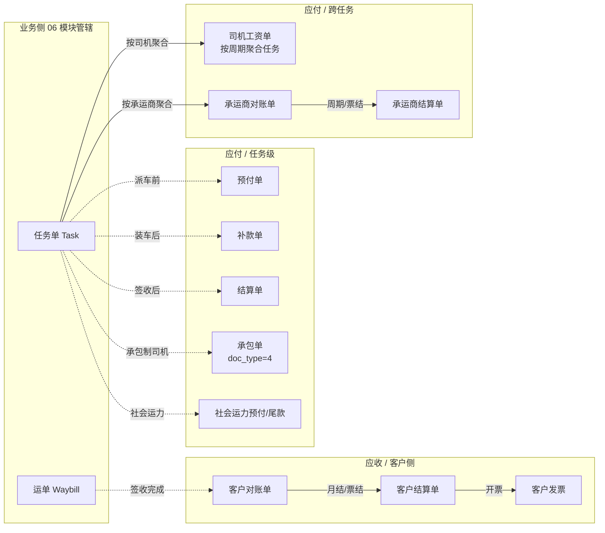

# 企业端财务结算模块 - 模块总览

> **所属阶段**：阶段六 - 财务结算模块
>
> **文档状态**：第 1 期已落地（通用基座 + 任务级费用单 + 承包单已接入代码）；客户侧 / 承运商侧 / 司机工资侧待实现
>
> **创建日期**：2026-05-19
>
> **最近更新**：2026-07-06（同步 `cadcc0c` 财务基座落地：新增承包单 `doc_type=4`、财务与 `task.status` 彻底解耦改用 `is_locked`、审计事件流 `biz_finance_doc_event` 落表）
>
> **优先级**：高（与业务单据闭环对齐）
>
> **关联文档**：
>
> - [06.运营调度模块/02.运单与任务单状态机联动设计](../06.运营调度模块/02.运单与任务单状态机联动设计.md)（§7 业务-财务边界由本模块承接）
> - [05.合作伙伴模块/01.客户管理](../05.合作伙伴模块/01.客户管理.md)
> - [05.合作伙伴模块/02.承运商管理](../05.合作伙伴模块/02.承运商管理.md)
> - [04.计费引擎模块/02.运单合同运费自动计算系统设计文档](../04.计费引擎模块/02.运单合同运费自动计算系统设计文档.md)
>
> **本目录文档清单**：
>
> | # | 文档 | 内容 |
> |---|------|------|
> | 00 | 本文 | 模块全景、单据矩阵、与业务单据边界、术语表 |
> | 01 | [财务单据体系与业务单据联动设计](01.财务单据体系与业务单据联动设计.md) | 通用基座：基类、状态机、关联结构、锁定/审计、闸口实现位置 |
> | 02 | [客户侧-对账与结算与发票](02.客户侧-对账与结算与发票.md) | 客户对账单 → 客户结算单 → 客户发票 → 应收冲销 |
> | 03 | [承运商侧-对账与结算](03.承运商侧-对账与结算.md) | 承运商对账单 → 承运商结算单（跨任务） |
> | 04 | [自有司机工资单](04.自有司机工资单.md) | 周期 + 任务聚合 + 多工资项的应付工资闭环 |
> | 05 | [任务级费用单演进与社会运力预付尾款](05.任务级费用单演进与社会运力预付尾款.md) | 现有预付/补款/结算如何对接通用基座；社会运力预付/尾款扩展 |
> | 06 | [任务级承包单与司机承包结算](06.任务级承包单与司机承包结算.md) | 承包单 `doc_type=4` + 司机承包结算配置 `biz_driver_settlement_config` + 结算模式（已落地） |
> | 07 | [驾驶员资金账户](07.驾驶员资金账户.md) | 驾驶员往来账户 `biz_driver_fund_account` + 资金流水 `biz_driver_fund_transaction`；预付沉淀、双向往来、手工记账（设计中） |

## 一、模块定位与设计目标

### 1.1 定位

财务结算模块是业务单据（运单 / 任务单 / 挂接行）的"下游账务侧"。它负责把"已发生的物的流转"换算成"对内对外的钱的流转"，并通过审批、支付、核销、开票完成闭环。

它**不重新定义业务单据的状态**，只通过 06 模块《运单与任务单状态机联动设计》§7 约定的稳定接口字段，从业务侧读取"什么可以结算 / 已经结算到什么程度"。

### 1.2 设计目标

| # | 目标 | 落点 |
|---|------|------|
| 1 | **应收 / 应付 / 对账 / 开票四象限闭环** | 客户侧、承运商侧、自有司机、任务级 4 条线 |
| 2 | **复用同一套基座抽象**：避免每类单据一套草稿/审批/支付状态机各写一遍 | `01.通用基座` 定义 `FinanceDocBase` + 通用状态机 |
| 3 | **与业务单据强解耦，弱联动**：业务单据状态机不感知财务单据存在，财务单据只在闸口处反向影响业务 | 闸口数 ≤ 8（见 06 模块 §7.4） |
| 4 | **关联拓扑按基数分两条路径**：避免使用多态外键 `(biz_doc_type, biz_doc_id)` | 1:1 → 直接 FK；N:N → 桥接表 |
| 5 | **审计与锁定一等公民**：任何"已支付 / 已收款 / 已开票"动作都不可静默修改，留痕到 `biz_finance_doc_event` | 见 `01.通用基座` §6 |
| 6 | **优先实现已有缺口**：客户对账/结算（应收）零实现需先补上；任务级预付/补款/结算已有，按基座规范"渐进迁移"非"推倒重来" | 见 `05.任务级费用单演进` 兼容策略 |

### 1.3 不在本期范围

| 不做 | 原因 | 未来路径 |
|------|------|---------|
| 自动对账匹配 / 银行流水回单 OCR | 工程量大，依赖外部网关 | 远期独立子模块 |
| 多税率自动开票 / 电子发票网关对接 | 涉及金税合规、依赖第三方 SaaS | `02.客户侧` 预留 `tax_rate` / `invoice_no` 字段，远期接入 |
| 多币种汇率换算 | 当前 99% 业务 CNY | 字段已留 `currency`，远期补汇率表 |
| 多组织合并报表 | 企业端单租户视角即可 | 平台端阶段处理 |
| 财务凭证导出（金蝶/用友） | 一次性脚本即可，不形成模块 | 远期工具脚本 |

## 二、业务全景

### 2.1 价值链一图流



### 2.2 单据矩阵（全模块全单据）

| # | 单据 | 收/付 | 关联对象 | 关联基数 | 状态机 | 现状 | 落地文档 |
|---|------|------|---------|---------|--------|------|---------|
| 1 | 客户对账单 | 应收 | 多张运单 | N:N | 草稿→对账中→已确认→已结清/已撤销 | 未实现 | `02` |
| 2 | 客户结算单 | 应收 | 一/多张客户对账单 | 1:N | 草稿→待审批→已审批→已收款→已撤销/已开票 | 未实现 | `02` |
| 3 | 客户发票 | 应收 | 一/多张客户结算单 | 1:N | 草稿→申请中→已开票→已作废/已红冲 | 未实现 | `02` |
| 4 | 承运商对账单 | 应付 | 多张任务单 | N:N | 草稿→对账中→已确认→已结清/已撤销 | 未实现 | `03` |
| 5 | 承运商结算单 | 应付 | 一/多张承运商对账单 | 1:N | 草稿→待审批→已审批→已支付→已撤销 | 未实现 | `03` |
| 6 | 自有司机工资单 | 应付 | 多张任务单 | N:N | 草稿→待审批→已审批→已发放→已撤销 | 未实现 | `04` |
| 7 | 任务级预付单 | 应付 | 1 张任务单 | 1:1 | 草稿→待审批→已审批→已支付→已撤销 | 已落地 | `05` |
| 8 | 任务级补款单 | 应付 | 1 张任务单 | 1:1 | 同上 | 已落地 | `05` |
| 9 | 任务级结算单 | 应付 | 1 张任务单 | 1:1 | 同上；`is_final=1` 已支付 → 锁定 `task.is_locked=1`（不改 `task.status`） | 已落地 | `05` |
| 10 | 任务级承包单 | 应付 | 1 张任务单 | 1:1 | 同 #7；收款人限司机、必填结算周期、与结算单互斥 | 已落地（`doc_type=4`） | `06` |
| 11 | 社会运力预付单 | 应付 | 1 张任务单 | 1:1 | 同 #7 | 复用 `biz_task_finance_doc` | `05` |
| 12 | 社会运力尾款单 | 应付 | 1 张任务单 | 1:1 | 同 #7 | 复用 `biz_task_finance_doc` | `05` |

### 2.3 四象限分布

```text
                  应收（客户）             应付（任务/资源）
        ┌────────────────────────┬─────────────────────────────┐
单据级  │  发票（开票/作废）       │  任务级预付/补款/结算         │
        │  ─ 触发：单张结算单      │  ─ 触发：任务推进事件         │
        │  ─ 1:N 结算单 → 发票     │  ─ 1:1 任务 → 单据           │
        ├────────────────────────┼─────────────────────────────┤
对账级  │  客户对账单 → 结算单     │  司机工资 / 承运商对账 → 结算 │
        │  ─ 触发：按周期/票结     │  ─ 触发：按周期/任务批次      │
        │  ─ N:N 运单 → 对账单     │  ─ N:N 任务 → 单据           │
        └────────────────────────┴─────────────────────────────┘
```

## 三、与业务单据模块的边界

> 这里只罗列协议条款；逐条规则、错误码、闸口实现位置请见 [01.通用基座](01.财务单据体系与业务单据联动设计.md) §3 / §5。

### 3.1 业务侧 → 财务侧（业务推进事件的财务触发）

| 业务事件 | 触发的财务动作 | 联动类型 | 落地文档 |
|---------|--------------|---------|---------|
| `task.status` 0→1 派车 | 允许创建任务级**预付单** | 软触发（UI 提示） | `05` |
| `task.status` 2→4 装车后 | 允许创建任务级**补款单** | 软触发 | `05` |
| `task.status` 4→5 签收 | 允许创建任务级**结算单**；生成承运商对账候选；生成司机工资候选 | 软触发 | `05` / `03` / `04` |
| `waybill.status` 4→5 完成 | 允许纳入客户对账候选 | 软触发 | `02` |
| `task.cancel` / `task.force_cancel` | 自动撤销该任务下所有**未支付**费用单 | 硬联动 | `01` §3.2 |
| `task.revert_status` 任意逆向 | 不联动财务（保留已生成单据，由调度员手动决定） | 显式不联动 | `01` §3.3 |

### 3.2 财务侧 → 业务侧（财务动作反向影响业务）

| 财务事件 | 反向影响 | 联动类型 | 落地文档 |
|---------|---------|---------|---------|
| 任务级最终结算单（`doc_type=3 is_final=1`）已支付 | `task.is_locked=1` + `locked_by_doc_id`（**不改 `task.status`**） | 硬联动（已落地） | `05` |
| 撤销/强制撤销已支付的最终结算单 | `task.is_locked=0`、清空 `locked_*`（解锁） | 硬联动（已落地） | `05` |
| 客户结算单已收款 | 关联运单 `is_locked = 1` | 硬联动 | `02` |
| 承运商结算单已支付 | 关联任务 `is_locked = 1`（`is_recon_bound` 软标记） | 软触发 | `03` |
| 司机工资单已发放 | 关联任务记录 `payroll_settled = 1`（冗余字段，`is_payroll_bound` 软标记） | 软触发 | `04` |

> **重要变更（2026-07）**：早期设计中"最终结算单已支付 → `task.status` 5→6 已结算"的硬联动已废弃。"已结算"枚举已从任务状态机移除，财务侧与 `task.status` **彻底解耦**：财务支付只维护 `task.settled_amount / prepaid_amount / supplement_amount / contracted_amount` 冗余金额，并通过 `task.is_locked` 保护成本字段不被业务侧误改。任务是否"关闭"由调度员综合应付完成情况手动判断。详见 `05` §二、§七。

### 3.3 业务侧暴露给财务侧的稳定字段（财务侧只读）

| 字段 | 提供方 | 财务侧使用 |
|------|--------|----------|
| `waybill.status` / `waybill.freight_amount` / `waybill.quantity` / `waybill.is_locked` | 06 模块 | 客户对账基准 |
| `task.status` / `task.actual_*_time` / `task.carrier_cost_amount` / `task.total_quantity` | 06 模块 | 应付账期 / 应付预算 |
| `task.settled_amount` / `prepaid_amount` / `supplement_amount` / `contracted_amount` | 财务侧自维护（各 `doc_type` 已支付合计），业务侧仅展示 | 报表 / 列表筛选 |
| `task.is_locked` / `locked_at` / `locked_by_doc_id` / `is_payroll_bound` / `is_recon_bound` / `payroll_settled` | 财务侧维护，业务侧只读 | 成本字段保护 / 挂接软标记 |
| `item.signed_qty`（派生）/ `item.signed_at` | 06 模块 | 客户对账按台 / 承运商对账按台 |

## 四、技术原则

| 原则 | 说明 |
|------|------|
| **基座 + 子类** | 通用字段（金额、币种、状态、审批人、付款时间、撤销原因）抽到基类；子类只描述领域特定字段，沿用同一套状态机 |
| **关联用桥接表，不用多态外键** | 强外键、强约束、便于报表 join；具体表见 `01.通用基座` §4 |
| **审计先行** | 任何状态变更走 `biz_finance_doc_event`，与 `operation_log` 互补：前者是单据领域内的事实表，后者是跨模块通用日志 |
| **金额一律 `Numeric(12,2)`，币种字段必填** | 远期多币种切换不破坏数据 |
| **锁定优先于删除**：已支付 / 已开票的单据**禁止 hard delete**，只能撤销并留痕 | 与 06 模块"已结算的任务禁止改挂接"对齐 |
| **同事务原子性**：单次 API 内的"状态切换 + 业务联动 + 审计事件"三件套必须在同一事务内 | 与 06 模块状态机的一贯要求一致 |
| **幂等保护**：所有写操作支持 `idempotency_key`（请求头），避免网络重复支付 | 远期落实，本期 schema 预留 |

## 五、目录与代码组织约定

### 5.1 后端目录

> 标记：✅ 已落地（`cadcc0c`）；🕒 规划中（后续期次）。

```text
backend/app/modules/client/
├── models/finance/
│   ├── __init__.py                   # ✅
│   ├── finance_doc_base.py           # ✅ FinanceDocBaseMixin（mixin 风格，不映射表）
│   ├── finance_doc_event.py          # ✅ FinanceDocEvent 审计事件表
│   ├── customer_recon.py             # 🕒 客户对账单 + 桥接
│   ├── customer_settlement.py        # 🕒 客户结算单
│   ├── customer_invoice.py           # 🕒 客户发票
│   ├── carrier_recon.py              # 🕒 承运商对账单 + 桥接
│   ├── carrier_settlement_doc.py     # 🕒 承运商结算单（避免与现有 carrier_settlement「账户」重名）
│   └── driver_payroll.py             # 🕒 司机工资单 + 桥接 + 工资项
├── services/finance/
│   ├── base/
│   │   ├── finance_state_machine.py       # ✅ 通用状态机 FinanceStateMachine
│   │   ├── finance_doc_event_writer.py    # ✅ 审计事件写入器 + FinanceEventType
│   │   └── finance_doc_service.py         # 🕒 通用支付/撤销/审批服务（当前由 task_finance_service 内联实现）
│   ├── linkage/
│   │   └── lock_orchestrator.py           # ✅ 业务侧 is_locked 编排器（task 锁定/解锁）
│   ├── customer/                          # 🕒
│   ├── carrier/                           # 🕒
│   └── driver/                            # 🕒
├── schemas/finance/                       # 🕒（任务级复用 schemas/task/task_finance_doc.py）
└── api/finance/                           # 🕒（任务级复用 api/task/task_finance.py）
```

> 说明：任务级费用单（含承包单）目前不落在 `models/finance/`，而是沿用既有
> [`models/task/task_finance_doc.py`](../../../../backend/app/modules/client/models/task/task_finance_doc.py)，
> 通过渐进 ALTER 补齐与 `FinanceDocBaseMixin` 同名字段（`doc_kind='task_finance'`）。
> 客户/承运商/司机侧新单据落地时才启用 `models/finance/` 下的独立表与桥接表。

### 5.2 前端目录

```text
frontend/client/src/views/finance/
├── customer-recon/        # 客户对账
├── customer-settlement/   # 客户结算
├── customer-invoice/      # 客户发票
├── carrier-recon/         # 承运商对账
├── carrier-settlement/    # 承运商结算
├── driver-payroll/        # 司机工资
└── task-finance/          # 已存在，需按基座适配
```

### 5.3 菜单与权限

| 一级菜单 | 二级菜单 | 路径 | 关键权限点前缀 |
|---------|---------|------|--------------|
| 财务结算 | 客户对账 | `/finance/customer-recon` | `finance:cust-recon:*` |
| 财务结算 | 客户结算 | `/finance/customer-settlement` | `finance:cust-settle:*` |
| 财务结算 | 客户发票 | `/finance/customer-invoice` | `finance:cust-invoice:*` |
| 财务结算 | 承运商对账 | `/finance/carrier-recon` | `finance:carrier-recon:*` |
| 财务结算 | 承运商结算 | `/finance/carrier-settlement` | `finance:carrier-settle:*` |
| 财务结算 | 司机工资 | `/finance/driver-payroll` | `finance:driver-payroll:*` |
| 财务结算 | 任务费用 | `/finance/task-finance`（迁移现有） | `finance:task-finance:*` |

每个二级菜单下统一按钮权限点：`list / detail / create / submit / approve / pay / cancel / lock-unlock / export`。

## 六、术语表

| 术语 | 含义 |
|------|------|
| 对账单 | "事项确认书"：罗列计费基础（按台/按吨/按趟），与对方核对无误后冻结金额；不发生实际钱流 |
| 结算单 | "钱单"：基于已确认对账单或单张运单/任务单，进入审批 → 支付流转 |
| 发票 | 客户结算单完成收款后的开票动作，可拆票（1 张结算单对多张发票） |
| 单据基座 | `FinanceDocBase`：抽象基类，不映射表，只提供通用字段集与方法 |
| 财务单据事件 | `biz_finance_doc_event`：所有状态变更 / 支付 / 撤销 / 锁定动作的领域事件流水 |
| 软触发 | 不阻塞业务推进，仅在 UI 提示或候选池生成 |
| 硬联动 | 一方动作必然在同事务内推动另一方状态变更，失败回滚 |
| 闸口 | 业务↔财务之间被严格定义的双向影响点，全表见 `01.通用基座` §3 |
| 锁定 (`is_locked`) | 单据进入财务终态后，业务侧禁止改基础数据；与 `waybill.is_locked` / `task.is_locked` 互通 |
| 应收冲销 | 客户结算单已收款后，刷新对应运单"待结算金额"为 0 |

## 七、实施分期建议

| 期次 | 目标 | 覆盖文档 |
|------|------|---------|
| **第 1 期（本设计落地后）** | 通用基座 + 任务级费用单兼容（不改既有数据） | `01` + `05` |
| **第 2 期** | 客户对账 → 结算闭环（应收最关键缺口） | `02`（不含发票） |
| **第 3 期** | 承运商对账 → 结算 + 司机工资单 | `03` + `04` |
| **第 4 期** | 客户发票 + 锁定与审计完整闭环 | `02` 发票章节 + `01` §6 |
| **第 5 期** | 报表、批量回灌、对账自动匹配（远期） | 独立子模块 |

## 八、待办与开放问题

| 项 | 说明 | 影响 |
|---|------|------|
| 跨年/跨月分摊 | 月结客户结算单跨期处理规则 | 设计第 2 期前需与财务确认 |
| 油卡/油气款核销 | `pay_method` 为油卡时，应付金额是否抵扣司机账户余额 | `04.司机工资单` 章节会讨论一种方案 |
| 多税率发票 | 同一结算单含不同税率运单时是否允许拆票 | `02.客户发票` 章节明确"允许拆票"为基线 |
| 与计费引擎反向校验 | 客户对账时若发现计费引擎漏算/错算，回灌策略 | 通过"差异单"机制处理，见 `02` |
| 财务系统外部对接 | 凭证导出格式（金蝶/用友）暂列工具脚本，不入主流程 | 远期 |
