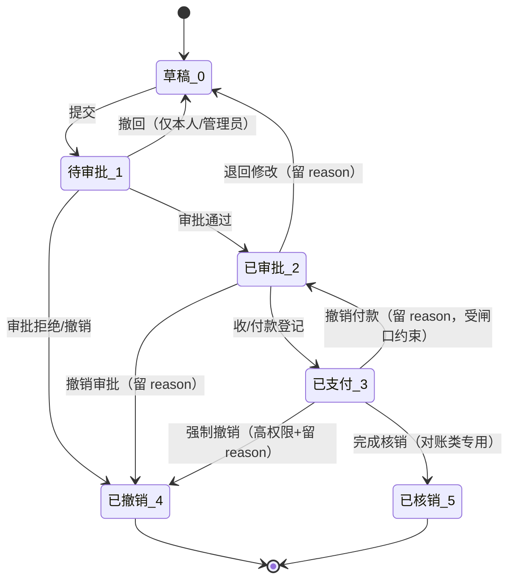

# 财务单据体系与业务单据联动设计（通用基座）

> **所属阶段**：阶段六 - 财务结算模块
>
> **文档状态**：通用基座已落地（`cadcc0c`）；task_finance 已接入，客户/承运商/司机侧待实现
>
> **创建日期**：2026-05-19
>
> **最近更新**：2026-07-06（同步落地：`FinanceDocBaseMixin` / `FinanceDocEvent` / `FinanceStateMachine` / `FinanceDocEventWriter` / `LockOrchestrator` 已实现；财务与 `task.status` 解耦、承包单 `doc_type=4` 上线）
>
> **关联文档**：
>
> - 同目录 [00.模块总览](00.模块总览.md)
> - 同目录 [02.客户侧-对账与结算与发票](02.客户侧-对账与结算与发票.md)
> - 同目录 [03.承运商侧-对账与结算](03.承运商侧-对账与结算.md)
> - 同目录 [04.自有司机工资单](04.自有司机工资单.md)
> - 同目录 [05.任务级费用单演进与社会运力预付尾款](05.任务级费用单演进与社会运力预付尾款.md)
> - 同目录 [06.任务级承包单与司机承包结算](06.任务级承包单与司机承包结算.md)
> - [06.运营调度模块/02.运单与任务单状态机联动设计](../06.运营调度模块/02.运单与任务单状态机联动设计.md)（§7 业务-财务边界由本文档承接）

## 一、文档定位

本文是 07 财务结算模块的"中枢规范"，承担四件事：

1. 定义所有财务单据的**通用基座**（字段集、状态机、生命周期）；
2. 落地业务单据与财务单据之间的**关联拓扑**（直接 FK + 4 类桥接表）；
3. 落地业务↔财务之间的**联动闸口**清单与实现位置；
4. 落地审计、锁定、并发与幂等规范。

后续 4 篇专门文档（客户侧、承运商侧、司机工资、任务费用演进）只描述领域差异点，不再重复本文规范。

## 二、通用基座

### 2.1 基类字段集（`FinanceDocBase`，mixin 风格，不映射表）

```python
# backend/app/modules/client/models/finance/finance_doc_base.py
class FinanceDocBaseMixin:
    """财务单据通用字段集

    所有具体财务单据表（biz_customer_recon / biz_customer_settlement /
    biz_carrier_recon / biz_carrier_settlement_doc /
    biz_driver_payroll / biz_task_finance_doc 等）通过 mixin 复用本字段集。
    不映射到独立表，避免一张超大单据表。
    """
    doc_no             # 单据编号（系统生成；租户内唯一）
    doc_kind           # 单据大类（冗余字段）：'customer_recon' / 'customer_settle' / ...
    status             # 通用状态见 §2.2
    direction          # 收/付方向：1-收款（应收） 2-付款（应付）
    currency           # 币种，默认 CNY
    planned_amount     # 计划金额（必填，>= 0）
    actual_amount      # 实际金额（支付/收款后填）
    period_start       # 周期起（对账类必填，单据类可空）
    period_end         # 周期止
    created_by         # 创建人
    submitted_by       # 提交审批人
    submitted_at       # 提交审批时间
    reviewed_by        # 审批人
    reviewed_at        # 审批时间
    paid_by            # 付款/收款操作人
    paid_at            # 付款/收款时间
    pay_method         # 支付方式（应付类用）/ 收款方式（应收类用）
    pay_voucher_url    # 凭证图片 URL
    cancelled_by       # 撤销操作人
    cancelled_at       # 撤销时间
    cancel_reason      # 撤销原因（撤销必填）
    is_locked          # 是否锁定（终态后置 1）
    locked_at          # 锁定时间
    locked_by_doc_id   # 锁定来源（被哪个上游单据锁定，可空）
    approval_no        # 远期审批中心单号
    idempotency_key    # 幂等键（远期写库唯一索引）
    remark             # 备注
```

> ✅ 已落地：`FinanceDocBaseMixin` 见 [`finance_doc_base.py`](../../../../backend/app/modules/client/models/finance/finance_doc_base.py)。现有 [`biz_task_finance_doc`](../../../../backend/app/modules/client/models/task/task_finance_doc.py) 出于向后兼容**不直接继承 mixin**，而是通过迁移 `20260703_001` ALTER 补齐全部同名字段，现已与上表**完全对齐**（含 `direction / is_locked / locked_at / locked_by_doc_id / idempotency_key / period_start / period_end / doc_kind`）。渐进过程见 `05.任务级费用单演进`。

### 2.2 通用状态机

#### 2.2.1 状态码

| 状态码 | 文案 | 说明 |
|--------|------|------|
| 0 | 草稿 | 可任意编辑、删除 |
| 1 | 待审批 | 提交审批后，只读 |
| 2 | 已审批 | 等待支付/收款；可撤销返回草稿 |
| 3 | 已支付 / 已收款 / 已开票 | 应付类=已支付，应收结算单=已收款，发票=已开票 |
| 4 | 已撤销 | 终态；不可再操作 |
| 5 | 已核销 / 已结清 | 对账类专用："对账金额=实付金额"达成 |
| 6 | 部分核销 / 部分支付 | 应收应付场景的中间态（远期使用） |
| 9 | 已作废 | 发票专用 |

> 不同子单据**只使用其中部分状态码**。状态码具体可用集合见 §2.2.3 矩阵。

#### 2.2.2 通用状态机图



#### 2.2.3 各单据可用状态集

| 单据 | 0 草稿 | 1 待审批 | 2 已审批 | 3 已支付/已收款/已开票 | 4 已撤销 | 5 已核销/已结清 | 9 已作废 |
|------|:----:|:------:|:------:|:--------------------:|:------:|:-------------:|:------:|
| 客户对账单 | √ | - | √（已确认） | √（已结清=3 复用） | √ | - | - |
| 客户结算单 | √ | √ | √ | √（已收款） | √ | √ | - |
| 客户发票 | √ | √（申请中=1） | - | √（已开票） | - | - | √（已作废/红冲） |
| 承运商对账单 | √ | - | √（已确认） | √（已结清） | √ | - | - |
| 承运商结算单 | √ | √ | √ | √（已支付） | √ | √ | - |
| 司机工资单 | √ | √ | √ | √（已发放） | √ | - | - |
| 任务级预付/补款 | √ | √ | √ | √（已支付） | √ | - | - |
| 任务级结算单 | √ | √ | √ | √（已支付，`is_final=1` 时锁定 `task.is_locked`） | √ | - | - |
| 任务级承包单（`doc_type=4`） | √ | √ | √ | √（已支付） | √ | - | - |

> 各单据的"具体状态文案"由其落地文档定义（如客户对账单 2 显示"已确认"、承运商结算单 2 显示"已审批"），但状态码与机器逻辑统一。
>
> ✅ 已落地矩阵见代码 [`finance_state_machine.py`](../../../../backend/app/modules/client/services/finance/base/finance_state_machine.py) 的 `DOC_KIND_STATES`：`task_finance = {0,1,2,3,4}`（预付/补款/结算/承包单共用此集合），其余 `doc_kind` 已在状态机登记但对应单据表尚未落地。

### 2.3 通用方法（`FinanceStateMachine`）

集中维护，与 06 模块 `TaskStateMachine` / `WaybillStateMachine` / `ItemStateMachine` 同源风格。

```python
# backend/app/modules/client/services/finance/base/finance_state_machine.py（✅ 已落地）
class FinanceStateMachine:
    @staticmethod
    def assert_transition(doc_kind: str, old: int, new: int, *, has_reason: bool = False) -> None:
        """校验 old→new 合法 + new 在该 doc_kind 可用状态集内；撤销/退回/撤销支付必须 has_reason=True"""

    @staticmethod
    def assert_submittable(*, planned_amount, has_payee: bool = True) -> None:
        """0 -> 1 校验：金额>0、必填收/付款对象已填"""

    @staticmethod
    def assert_payable(*, actual_amount, paid_at, pay_method) -> None:
        """2 -> 3 校验：actual_amount>0、paid_at、pay_method 填写完整"""

    @staticmethod
    def assert_cancellable(old: int, *, with_force: bool = False) -> None:
        """撤销校验：终态 5/4/9 不可撤；3 已支付需 with_force=True（高权限）"""

    @staticmethod
    def assert_not_locked(is_locked) -> None:
        """is_locked=1 时拒绝任何修改"""

    @staticmethod
    def legal_next(doc_kind: str, old: int) -> Set[int]:
        """UI 联动用：返回按 doc_kind 裁剪后的下一步可跳转状态集合"""
```

> 通用合法跳转表 `FIN_VALID_TRANS`（代码常量）：
> `0→{1,4}`、`1→{0,2,4}`、`2→{0,3,4}`、`3→{2,4,5}`、`4/5/9` 为终态、`6→{3,5}`（远期）。
> 强制原因：目标 `4 已撤销`、以及 `3→2 撤销支付` 必须 `has_reason=True`。

## 三、与业务单据的联动闸口（双方协议钉死）

> 本节是 06 模块《运单与任务单状态机联动设计》§7.4 的延续与展开。06 模块只列了 8 条协议，本节按子单据拆细。

### 3.1 业务事件 → 财务侧的触发表

| # | 业务事件 | 财务侧动作 | 联动类型 | 实现位置 |
|---|---------|----------|---------|---------|
| 1 | `task.status` 0→1 派车 | 任务级**预付单**可创建（候选生成） | 软触发 | 任务详情页"创建预付单"按钮启用 |
| 2 | `task.status` 2→4 装车完成 | 任务级**补款单**可创建 | 软触发 | 同上 |
| 3 | `task.status` 4→5 签收 | 任务级**结算单**可创建；并入承运商对账候选池；并入司机工资候选池 | 软触发 + 候选池 | 服务方法 `linkage/task_to_finance.on_task_signed(task_id)` |
| 4 | `waybill.status` 4→5 完成 | 并入客户对账候选池 | 软触发 + 候选池 | 服务方法 `linkage/waybill_to_finance.on_waybill_completed(wb_id)` |
| 5 | `task.cancel_task` | 自动**撤销**该 task 下 `status ∈ {0,1,2}` 的全部费用单（不含已支付） | 硬联动 | 已落地 `task_finance_service.cancel_all_unpaid_docs` |
| 6 | `task.force_cancel` | 同 #5；并提示"已支付 N 张需财务侧手工处理" | 硬联动 | 同上 |
| 7 | `task.revert_status` 任意逆向 | **不联动财务**（保留已生成单据） | 显式不联动 | 调度员页面提示文案 |
| 8 | 删除/修改运单挂接（已挂入对账单时） | **拒绝**操作 | 硬闸口 | `linkage/waybill_to_finance.assert_unbound(wb_id)` |

### 3.2 财务事件 → 业务侧的反向影响表

| # | 财务事件 | 反向影响 | 联动类型 | 实现位置 |
|---|---------|---------|---------|---------|
| 1 | 任务级最终结算单已支付（`doc_type=3 is_final=1` → status 3） | `task.is_locked=1` + `locked_at` + `locked_by_doc_id`（**不改 `task.status`**） | 硬联动 | ✅ `task_finance_service.pay_doc` → `LockOrchestrator.lock_task_if_final` |
| 2 | 撤销/强制撤销已支付的最终结算单 | `task.is_locked=0`、清空 `locked_*`（解锁） | 硬联动 | ✅ `task_finance_service.cancel_payment` / `force_cancel` → `LockOrchestrator.unlock_task` |
| 3 | 客户结算单已收款（status 3） | 关联**运单**的 `is_locked=1` | 硬联动 | 🕒 `02.客户侧` 服务 |
| 4 | 客户发票已开票 / 已作废 | 关联**结算单**的 `is_locked=1 / 0` | 硬联动 | 🕒 `02.客户侧` 服务 |
| 5 | 承运商结算单已支付 | 关联**任务**的 `is_locked=1`（`is_recon_bound` 软标记） | 软触发 | 🕒 `03.承运商侧` 服务 |
| 6 | 司机工资单已发放 | 关联**任务**记录 `payroll_settled=1`（冗余，`is_payroll_bound` 软标记） | 软触发 | 🕒 `04.司机工资` 服务 |

> **⚠️ 设计变更（2026-07）**：原设计中 #1「已支付 → `task.status` 5→6 已结算」与 #2「撤销 → 6→5」的 **task 状态硬联动已废弃**。"已结算"枚举已从任务状态机移除（详见 06 模块状态机文档与 [`task_finance_service.py`](../../../../backend/app/modules/client/services/task/task_finance_service.py) 顶部注释）。财务侧与 `task.status` 彻底解耦，改用 `task.is_locked` 保护成本字段。撤销已支付单据走**高权限**的 `cancel_payment`（3→2）或 `force_cancel`（3→4），普通 `cancel_doc` 只处理未支付单据。

### 3.3 显式"不联动"清单（避免误以为遗漏）

| 场景 | 设计意图 |
|------|---------|
| 任务逆向（如撤销签收 5→4）不影响已生成结算单 | 调度员需主动撤销结算单后再撤销签收，避免"账已动、单已扭"难复原 |
| 客户结算单已收款不会回灌 `waybill.status` | `waybill.status` 是物的状态，结算单只是钱的状态；用 `is_locked` 解决"不可改"的诉求 |
| 司机工资单已发放不会回灌 `task.status` 6→7 | 任务"已关闭 7"是综合判断，由 03 / 04 / 05 三类应付都完成后由调度员手动关闭 |

## 四、关联拓扑（按基数分两条路径）

### 4.1 决策树

```text
                业务单据 ↔ 财务单据是 1:1 ?
                       ├── 是 ──> 财务单据加 task_id / waybill_id 直接列（不建桥接表）
                       └── 否 ──> 走桥接表
                                  ├── 财务侧 1 个，业务侧 N 个 (1:N) ──> 桥接表
                                  └── 双向 N:N ──> 桥接表 + 唯一索引
```

### 4.2 关联结构清单

| 财务单据 | 关系 | 推荐结构 |
|---------|------|---------|
| 任务级预付/补款/结算 | 1:1 → task | 主单 `task_id` 列（沿用现有） |
| 社会运力预付/尾款 | 1:1 → task | 主单 `task_id` + `payee_type=3` |
| 司机工资单 | 1:N → task | 桥接表 `biz_driver_payroll_task_link` |
| 承运商对账单 | 1:N → task | 桥接表 `biz_carrier_recon_task_link` |
| 承运商结算单 | 1:N → 承运商对账单 | 桥接表 `biz_carrier_settle_recon_link` |
| 客户对账单 | 1:N → waybill | 桥接表 `biz_customer_recon_waybill_link` |
| 客户结算单 | 1:N → 客户对账单 | 桥接表 `biz_customer_settle_recon_link` |
| 客户发票 | 1:N → 客户结算单 | 桥接表 `biz_customer_invoice_settle_link` |

### 4.3 桥接表通用骨架

```python
# 以司机工资单 ↔ 任务的桥接为例，其他桥接表同构
class DriverPayrollTaskLink(TenantModelBase):
    __tablename__ = "biz_driver_payroll_task_link"
    __table_args__ = (
        UniqueConstraint("payroll_id", "task_id", name="uk_payroll_task"),
        Index("idx_payroll_id", "payroll_id"),
        Index("idx_task_id", "task_id"),
    )
    payroll_id     # 财务单据 ID
    task_id        # 业务单据 ID
    base_amount    # 该任务对该单据的计费基础（按台/按吨/按趟）
    quantity       # 数量（按台时=已签收台数）
    unit_price     # 单价（冗余，便于报表）
    amount         # 该任务对该单据的金额 = quantity * unit_price ± 调整
    adjust_amount  # 调整（油卡核销、罚款等）
    adjust_reason  # 调整原因
    locked_snapshot_at  # 写入时的业务字段快照时间（避免业务后续 revert 造成对账漂移）
    remark
```

### 4.4 明确不做的事

| 不做 | 原因 |
|------|------|
| 多态外键 `(biz_doc_type, biz_doc_id)` 一刀切 | 失去强外键，跨表 join 复杂，租户级数据稽核难做 |
| 让财务单据直接挂在 `biz_task` / `biz_waybill` 的扩展 JSON 字段 | 状态机/索引/锁定都做不了 |
| 多张财务单据之间链式跳转（结算单"父子"关系） | 通过对账单中转即可，避免环 |

## 五、单据生命周期与方法集

> 本节描述"通用基座"上每一类单据通用的方法签名；具体业务规则放到子文档。

### 5.1 生命周期阶段

```text
[ 起点 / 触发 ]
      │ 业务事件 (3.1) 或 操作员手动新建
      ▼
[ 候选 / 编辑 ]  -- status 0 草稿
      │ 校验金额、关联完整性
      ▼
[ 提交 ]         -- status 1 待审批
      │ 审批人/管理员
      ▼
[ 审批 ]         -- status 2 已审批 / 已确认
      │ 出纳/财务专员
      ▼
[ 支付/收款/开票 ] -- status 3
      │ 业务侧反向影响 (3.2)
      ▼
[ 核销 / 结清 ]   -- status 5（对账类专用） / 终态
```

### 5.2 通用服务接口（`FinanceDocService`）

| 方法 | 用途 | 触发联动 |
|------|------|---------|
| `create_draft(payload)` | 新建草稿 | 无 |
| `update_draft(id, payload)` | 草稿态编辑 | 无 |
| `submit(id)` | 0 → 1 | 闸口 §3.1 校验 |
| `approve(id, opinion?)` | 1 → 2 | 写 `reviewed_*` |
| `reject(id, reason)` | 1 → 4 | 必填 reason |
| `withdraw_to_draft(id, reason)` | 2 → 0 | 必填 reason |
| `pay_or_receive(id, payload)` | 2 → 3 | 触发 §3.2 反向影响 |
| `cancel_payment(id, reason, *, force=False)` | 3 → 2 | 受闸口约束 |
| `cancel(id, reason)` | 0/1/2 → 4 | 必填 reason |
| `force_cancel(id, reason)` | 3 → 4 | 高权限 + 必填 reason |
| `settle(id, settle_amount)` | 3 → 5 | 对账类专用 |
| `lock(id, by_doc_id)` / `unlock(id)` | 是否锁定 | §3.2 触发 |

> **✅ 任务级已落地映射**（[`task_finance_service.py`](../../../../backend/app/modules/client/services/task/task_finance_service.py)）：
> `create_doc` / `update_doc` / `delete_doc` / `submit_doc`(0→1) / `approve_doc`(1→2) /
> `withdraw_to_draft`(1|2→0) / `pay_doc`(2→3) / `cancel_doc`(0|1|2→4) /
> `cancel_payment`(3→2，高权限) / `force_cancel`(3→4，高权限) / `cancel_all_unpaid_docs`（随任务取消批量撤销未支付）。
> 每个状态切换统一走 `_change_status()` → `FinanceStateMachine.assert_transition` + `FinanceDocEventWriter.write` 写审计事件。
> 任务级尚无独立 `reject_doc`（审批拒绝复用 `cancel_doc`）。

### 5.3 通用 API 路径规范

```text
POST   /api/finance/<doc-kind>             创建草稿
PUT    /api/finance/<doc-kind>/{id}        草稿态编辑
POST   /api/finance/<doc-kind>/{id}/submit  提交审批
POST   /api/finance/<doc-kind>/{id}/approve
POST   /api/finance/<doc-kind>/{id}/reject
POST   /api/finance/<doc-kind>/{id}/withdraw
POST   /api/finance/<doc-kind>/{id}/pay        # 应付类
POST   /api/finance/<doc-kind>/{id}/receive    # 应收类
POST   /api/finance/<doc-kind>/{id}/cancel-payment
POST   /api/finance/<doc-kind>/{id}/cancel
POST   /api/finance/<doc-kind>/{id}/force-cancel
POST   /api/finance/<doc-kind>/{id}/settle     # 对账类
GET    /api/finance/<doc-kind>/{id}
GET    /api/finance/<doc-kind>                  # 列表 + 筛选
GET    /api/finance/<doc-kind>/{id}/events      # 审计事件流
```

## 六、锁定与审计

### 6.1 `is_locked` 锁定规则

| 触发动作 | 被锁对象 | 锁定来源记录 |
|---------|---------|------------|
| 任务级最终结算单已支付 | `task.is_locked=1` | `locked_by_doc_id` = 该结算单 id |
| 承运商结算单已支付 | 关联范围内的 `task.is_locked=1` | 同上 |
| 客户结算单已收款 | 关联范围内的 `waybill.is_locked=1` | 同上 |
| 客户发票已开票 | 客户结算单 `is_locked=1` | 同上 |
| 司机工资单已发放 | 关联任务 `payroll_settled=1`（非全锁，允许其他财务侧动作） | 软标记 |

锁定后的禁止动作：

- 业务侧：禁止修改 `freight_amount` / `quantity` / 挂接 / 删除运单与任务
- 财务侧：禁止反向撤销支付（必须先 `unlock`，记录原因）

`unlock` 是高权限操作：只有"财务主管"角色 + 必填 `unlock_reason` 才允许。

### 6.2 `biz_finance_doc_event` 审计事件表

```python
class FinanceDocEvent(TenantModelBase):  # ✅ 已落地
    __tablename__ = "biz_finance_doc_event"
    __table_args__ = (
        Index("idx_fde_doc_kind_id", "doc_kind", "doc_id"),
        Index("idx_fde_event_time", "event_time"),
    )
    doc_kind          # 单据大类（同 FinanceDocBaseMixin.doc_kind）
    doc_id            # 单据 ID
    event_type        # 事件类型 1-创建 2-提交 3-审批通过 4-审批拒绝 5-退回草稿
                      # 6-支付 7-撤销支付 8-撤销 9-强制撤销 10-核销 11-锁定 12-解锁
                      # 13-开票 14-作废 15-红冲
    from_status / to_status
    direction         # 1-收 2-付
    occurred_amount   # 该事件涉及金额（撤销/红冲填负数）
    operator_id       # 操作人
    operator_name     # 操作人姓名（冗余）
    reason            # 原因
    payload_snapshot  # JSON：关键字段快照（金额/关联范围等）
    event_time        # 事件时间
```

#### 设计要点

- **append-only**：不允许更新或删除事件；任何"删错单据"通过反向事件冲销
- **冗余字段足够**：操作人姓名、金额、关联快照都冗余在事件里，单据软删除后也可定位
- **与通用 `operation_log` 互补**：`operation_log` 记录跨模块通用日志，`biz_finance_doc_event` 是财务领域内的"事实流水"，对账时直接读这张表
- **检索接口**：`GET /api/finance/<doc-kind>/{id}/events` 返回时间倒序事件流，前端单据详情 Drawer 直接复用

## 七、并发与幂等

### 7.1 并发保护

| 场景 | 策略 |
|------|------|
| 批量回灌（如把多张运单纳入对账单） | 对涉及的 `waybill_id` 按 id 升序 `SELECT FOR UPDATE`（与 06 模块 `WaybillStatusAggregator` 同风格） |
| 同一张结算单的并发支付 | 单据行 `SELECT FOR UPDATE` |
| 候选池生成 | 候选池为读视图，不抢锁；最终生成对账单时再加锁 |

### 7.2 幂等

| 场景 | 策略 |
|------|------|
| `pay_or_receive` 网络重试 | 请求头 `Idempotency-Key`；表内 `idempotency_key` 列加唯一索引；命中则返回上次结果 |
| 候选池生成 | `(doc_kind, period_start, period_end, source_id)` 唯一约束 |
| `submit` 重复点击 | 状态机本身保证：1→1 自动失败 |

## 八、权限与角色

| 角色 | 典型操作 |
|------|---------|
| 调度员 | 任务级费用单 / 司机工资单候选生成；无审批权限 |
| 财务专员 | 全部单据的创建、编辑、提交、对账核对 |
| 财务主管 | 审批、撤销支付、解锁、强制撤销 |
| 出纳 | 支付/收款登记 |
| 业务主管 | 客户对账确认（业务-财务双方对账场景） |

每张单据的具体权限矩阵（含按钮级）在其落地文档中给出。本文只钉死大类的角色边界。

## 九、后端代码改造蓝图

### 9.1 新建文件（落地状态）

| 文件 | 内容 | 状态 |
|------|------|------|
| `models/finance/__init__.py` | 包初始化 | ✅ |
| `models/finance/finance_doc_base.py` | `FinanceDocBaseMixin` | ✅ |
| `models/finance/finance_doc_event.py` | `FinanceDocEvent` | ✅ |
| `services/finance/base/finance_state_machine.py` | `FinanceStateMachine` + `FIN_VALID_TRANS` / `DOC_KIND_STATES` | ✅ |
| `services/finance/base/finance_doc_event_writer.py` | `FinanceDocEventWriter` + `FinanceEventType` | ✅ |
| `services/finance/linkage/lock_orchestrator.py` | 业务侧 `is_locked` 编排器（`lock_task_if_final` / `unlock_task`） | ✅ |
| `services/finance/base/finance_doc_service.py` | 通用 service 模板 | 🕒 客户/承运商侧落地时新建；任务级当前内联在 `task_finance_service` |
| `services/finance/linkage/task_to_finance.py` | 任务事件 → 财务候选池 | 🕒 待客户/承运商对账落地 |
| `services/finance/linkage/waybill_to_finance.py` | 运单事件 → 财务候选池 | 🕒 待客户对账落地 |

### 9.2 现有文件改造点

| 文件 | 改动 | 状态 |
|------|------|------|
| [`task_finance_service.py`](../../../../backend/app/modules/client/services/task/task_finance_service.py) | 注入 `FinanceDocEventWriter`；所有状态切换经 `_change_status` 补写事件 | ✅ |
| [`task_finance_service.pay_doc`](../../../../backend/app/modules/client/services/task/task_finance_service.py) | `is_final=1` 支付后调用 `LockOrchestrator.lock_task_if_final`；不再驱动 `task.status` 5→6 | ✅ |
| [`task_finance_service.cancel_payment / force_cancel`](../../../../backend/app/modules/client/services/task/task_finance_service.py) | 撤销前 `LockOrchestrator.unlock_task` 解锁任务 | ✅ |
| [`task_service`](../../../../backend/app/modules/client/services/task/task_service.py) | task→5 时生成承运商/司机候选（`task_to_finance.on_task_signed`） | 🕒 待客户/承运商对账落地 |
| [`waybill_service`](../../../../backend/app/modules/client/services/waybill/waybill_service.py) | waybill→5 生成客户对账候选、挂接后 `assert_unbound` 保护 | 🕒 待客户对账落地 |

### 9.3 Schema 变更

| Schema | 改动 |
|--------|------|
| 全部财务单据 `*Out` | 增加 `canSubmit / canApprove / canPay / canCancel / canForceCancel` 由 service 计算返回 |
| 全部财务单据 `*Create` | 强制 `currency` 字段；金额 `Decimal` |
| 全部 `*CancelRequest` | 强制 `reason` 字段，长度≥5 |

### 9.4 数据库迁移

| 表 | 迁移 | 状态 |
|----|------|------|
| 现有 `biz_task_finance_doc` | 增加 `direction` / `doc_kind` / `is_locked` / `locked_at` / `locked_by_doc_id` / `idempotency_key` / `period_start` / `period_end` / `cancel_reason` / `cancelled_at` / `cancelled_by` / `submitted_at` / `submitted_by`；`doc_type` 注释补 `4-承包单` | ✅ `20260703_001` |
| 现有 `biz_task` | 增加 `is_locked` / `locked_at` / `locked_by_doc_id` / `is_payroll_bound` / `is_recon_bound` / `payroll_settled` / `contracted_amount` | ✅ `20260703_001` |
| 新增 `biz_finance_doc_event` | 见 §6.2；由 runner Phase 1 自动建表 | ✅ |
| 新增 `biz_driver_settlement_config` | 司机承包结算配置（见 `06`）；由 runner Phase 1 自动建表 | ✅ |
| 桥接表 | 按 §4.2 清单逐个迁移，分散到 02/03/04 文档落地 | 🕒 |

## 十、前端通用蓝图

### 10.1 通用列表页规范

| 元素 | 要求 |
|------|------|
| 状态 Tag | 复用 `WaybillStatusTag` 模式，新增 `FinanceDocStatusTag`，按 §2.2.3 矩阵给颜色 |
| 操作列 | 按状态条件渲染：草稿态显"编辑/提交"，待审批显"审批/拒绝"，已审批显"支付/撤销"，已支付显"撤销支付"（受闸口约束） |
| 顶部筛选 | 状态、币种、关联业务对象（运单号/任务号/承运商/司机）、时间范围 |
| 顶部统计 | 4 个色块：草稿数、待审批数、已审批金额合计、本期已支付金额合计 |

### 10.2 通用详情抽屉规范

| 区块 | 内容 |
|------|------|
| 头部 | 单据号 + 状态 Tag + 锁定徽章（`is_locked=1` 时显示） |
| 关联业务对象 | 列表展示桥接行：业务单号、计费基础、台数、单价、金额；点击跳到业务详情 |
| 金额明细 | 计划金额 / 实际金额 / 调整 / 差异 |
| 流程操作 | 当前可执行动作按钮（统一 emit `actionKey`） |
| 审计事件流 | 时间倒序列出 `biz_finance_doc_event`，显示操作人、原因、关联金额 |

### 10.3 通用组件

| 组件 | 文件 | 用途 |
|------|------|------|
| `<finance-doc-status-tag>` | `frontend/client/src/views/finance/components/finance-doc-status-tag.vue` | 通用状态标签 |
| `<finance-doc-event-timeline>` | 同上目录 | 审计事件流时间轴 |
| `<finance-cancel-dialog>` | 同上目录 | 通用"撤销 / 撤销支付"对话框，强制原因 |
| `<finance-pay-dialog>` | 同上目录 | 支付/收款登记，凭证上传 |
| `<finance-amount-cell>` | 同上目录 | 金额展示（千分位 + 币种） |

## 十一、测试要点（通用基座层）

1. **状态机校验**：任意单据从草稿直接 PATCH 到已支付 → 422
2. **撤销缺 reason**：所有 cancel 类 API 不带 reason → 422
3. **锁定保护**：`waybill.is_locked=1` 时调用 `waybill_service.update_waybill` → 422
4. **审计事件链完整**：从创建到撤销，事件表能拼出完整轨迹
5. **幂等**：同一 `Idempotency-Key` 重复支付，第二次返回首单结果，不产生重复事件
6. **并发**：两人并发审批同张单据 → 一方失败
7. **跨表锁顺序**：批量回灌时，被锁的业务行 id 升序
8. **解锁审计**：解锁必须有 `unlock_reason`，事件类型 = 12
9. **业务事件触发候选池**：task→5 后查 `task_to_finance.list_settle_candidates(task_id)` 返回非空
10. **业务逆向不触发财务回退**：task 5→4 后已有结算单状态不变，仅 UI 警示

## 十二、远期演进锚点

| 远期能力 | 本文档预留 |
|---------|----------|
| 审批中心对接（钉钉/飞书审批） | `approval_no` 字段已留 |
| 银行流水回单自动核销 | 事件表的 `payload_snapshot.bank_serial_no` 字段可承载 |
| 多币种 | `currency` 字段已留；新增汇率表后由 service 兼容换算 |
| 财务凭证导出（金蝶/用友） | 事件表足以重建凭证流水，落工具脚本 |
| 财务报表 BI | 桥接表 + 事件表能覆盖"应收应付账龄、对账时效、撤销率" |
| Domain Event 异步化 | 当前同事务联动；远期把 `task_to_finance.on_*` 改成事件订阅，本文档接口保持兼容 |
