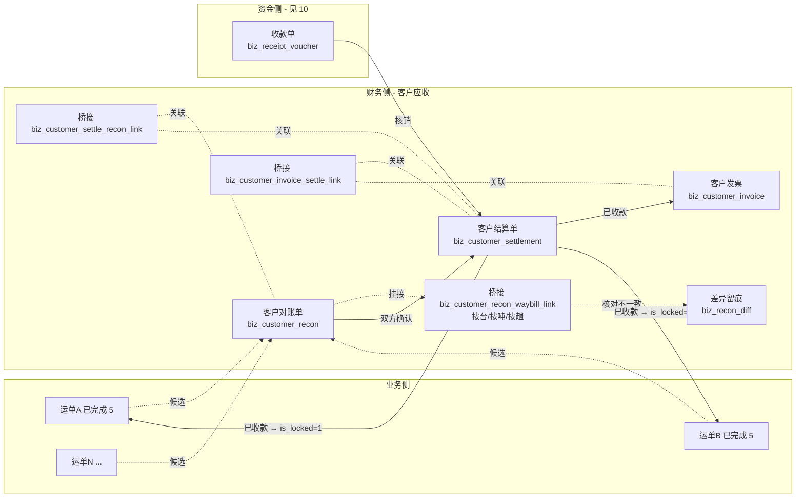

# 客户侧 - 对账与结算与发票（应收闭环）

> **所属阶段**：阶段六 - 财务结算模块
>
> **文档状态**：已落地（第 2 期：对账单 + 结算单 + 收款核销；第 4 期：§五 销项发票 前后端完成）
>
> **创建日期**：2026-05-19
>
> **最近更新**：2026-08-14（第 4 期落地回写：§8.1 销项发票页标已落地、§8.2 补两个发票组件、§10.1 记录销项票落地文件与三处口径差异）
>
> **上一次更新**：2026-08-14（第 2 期落地回写：§8.1 三个页面标已落地、§8.2 换成实际组件清单并记录两处偏差、§10.1 补收款单服务与工作台聚合的实际落点）
>
> **上一次更新**：2026-08-13（框架重构对齐：收款账户改 `biz_bank_account` 外键、补 `received_amount_total` / `due_date` / 脏标记列、差异机制正式落地到 `09`、收款支持「单据直登」与「收款单核销」双路径、权限点与 `00` §9.4 对齐、按第 2/4 期拆分交付范围）
>
> **优先级**：高（当前应收侧零实现，影响月结/票结客户的对账效率）
>
> **落地期次**：对账单 + 结算单 + 收款核销 → **第 2 期**；发票（§五）→ **第 4 期**。见 [00.模块总览](00.模块总览.md) §七
>
> **关联文档**：
>
> - 同目录 [00.模块总览](00.模块总览.md)（§7 实施分期、§9 菜单与权限点落地清单）
> - 同目录 [01.财务单据体系与业务单据联动设计](01.财务单据体系与业务单据联动设计.md)（本文严格遵守其通用基座）
> - 同目录 [09.运输单与财务单一致性核对](09.运输单与财务单一致性核对.md)（§3.6 差异机制的正式实现）
> - 同目录 [10.资金收付与出纳台](10.资金收付与出纳台.md)（收款账户、收款单核销）
> - 同目录 [12.应收账龄与信用管控](12.应收账龄与信用管控.md)（账龄以本文结算单为原子单位）
> - [05.合作伙伴模块/01.客户管理](../05.合作伙伴模块/01.客户管理.md)
> - [05.业务模块-运单管理](../05.业务模块-运单管理.md)

## 一、业务背景

### 1.1 现状问题

| # | 问题 | 影响 |
|---|------|------|
| 1 | 客户对账完全线下走 Excel | 100+ 张运单一份对账，人工拆分账期/客户耗时 1 小时；签收金额与 Excel 漂移 |
| 2 | 没有"已结算/未结算"状态 | 财务无法回答"客户 X 还欠多少"；运单 status=5 已完成不等于已结算 |
| 3 | 无发票闭环 | 开票动作零留痕，跨月对账难复盘 |
| 4 | 计费引擎与对账无联动 | 计费引擎漏算的运单，客户主张差异时无法在系统内回灌 |

### 1.2 设计目标

| 目标 | 落地 |
|------|------|
| 把"对账事项"和"钱"分两个单据 | 对账单（事项）→ 结算单（钱）→ 发票（票），层层冻结 |
| 支持月结 / 票结 / 预付三种客户结算节奏 | 取 `customer.settlement_type` 字段（已存在），由生成规则适配 |
| 跨运单按台/按吨/按趟对账 | 桥接表存"基础数量 + 单价"，独立计费而非依赖运单冗余金额 |
| 与开票合规对齐 | 发票拆票、红冲、作废留痕 |

## 二、单据全景



结算单收款有两条路径：出纳录**收款单**后核销分配（多对多），或在结算单上直接登记收款。见 §4.6。

## 三、客户对账单

### 3.1 业务模型

| 概念 | 定义 |
|------|------|
| 客户对账单 | 一段时间内某客户名下所有"待结算运单"的事项确认书，列出每张运单的计费基础、台数、单价、应收金额 |
| 计费基础 | 按台 / 按吨 / 按趟（来自运单合同；客户可能覆盖） |
| 对账状态 | 草稿 → 对账中 → 已确认 → 已结清 / 已撤销 |
| 范围维度 | `customer_id` + `period_start` + `period_end`，同维度同时只允许一张"非撤销"对账单 |

### 3.2 数据模型

#### `biz_customer_recon`（客户对账单主表）

继承 §01 §2.1 `FinanceDocBaseMixin`；本表特有字段：

| 字段 | 类型 | 备注 |
|------|------|------|
| `doc_kind` | `'customer_recon'` 常量 | 基类字段，本表填固定值 |
| `customer_id` | BigInt | 关联 `biz_customer.id` |
| `customer_name` | VARCHAR(100) | 冗余 |
| `settlement_type` | TinyInt | 0-月结 1-票结 2-预付（取自客户档案，写入时冻结） |
| `period_start` / `period_end` | DateTime | 对账周期（基类字段已有，本表必填） |
| `waybill_count` | Int | 关联运单总数（冗余，便于列表筛选） |
| `total_quantity` | Int | 总台数（按行聚合） |
| `total_planned_amount` | Numeric(14,2) | 应收金额合计 |
| `total_actual_amount` | Numeric(14,2) | 实际已收金额（联动 §4 结算单） |
| `confirmed_by_customer_at` | DateTime | 客户方确认时间 |
| `confirmed_by_customer_name` | VARCHAR(100) | 客户方确认人姓名（自由文本） |
| `confirm_voucher_url` | VARCHAR(500) | 客户回签 PDF/图片 URL |
| `customer_contact_name` / `customer_contact_phone` | VARCHAR | 冗余客户对账联系人 |
| `dirty_line_count` | Int，默认 0 | 脏行数（快照与业务事实不一致的行）；> 0 时列表页与对账工作台高亮，见 [09](09.运输单与财务单一致性核对.md) §3.2 |
| `diff_open_count` | Int，默认 0 | 未处置差异条数（`biz_recon_diff.status=0`），冗余避免列表页 count 子查询 |
| `diff_forced_count` | Int，默认 0 | 已强制放行差异条数（`status=3`），> 0 时列表页显示「带未决差异」徽章 |
| `status` | 见 §01 §2.2.3 矩阵：`0 草稿 / 2 已确认 / 3 已结清 / 4 已撤销` | 不使用 1 待审批（对账类直接由业务主管确认） |

> **状态文案**：本表 status=2 显示「已确认」、3 显示「已结清」。

#### `biz_customer_recon_waybill_link`（桥接表 - 对账行）

| 字段 | 类型 | 备注 |
|------|------|------|
| `recon_id` | BigInt | 关联 `biz_customer_recon.id` |
| `waybill_id` | BigInt | 关联 `biz_waybill.id` |
| `waybill_no` | VARCHAR(50) | 冗余 |
| `billing_base` | TinyInt | 1-按台 2-按吨 3-按趟 4-固定金额 |
| `quantity` | Numeric(10,2) | 计费数量（按台=已签收台数；按吨=吨数；按趟=1） |
| `unit_price` | Numeric(12,2) | 单价（运单合同冻结，可手工覆盖） |
| `amount` | Numeric(12,2) | 行金额 = quantity × unit_price ± adjust |
| `adjust_amount` | Numeric(12,2) | 调整（差异、罚款、补价） |
| `adjust_reason` | VARCHAR(255) | 调整原因 |
| `freight_amount_snapshot` | Numeric(12,2) | 写入时的 `waybill.freight_amount` 快照 |
| `signed_quantity_snapshot` | Int | 写入时的 `item.signed_qty` 聚合快照 |
| `locked_snapshot_at` | DateTime | 快照时间 |
| `recon_dirty` | TinyInt，默认 0 | 1 = 快照与业务侧当前事实已不一致，需重新核对 |
| `dirty_reason` | VARCHAR(255) | 置脏原因，由闸口写入，如「签收台数由 8 变为 7」 |
| `dirty_at` | DateTime | 置脏时间 |
| `remark` | TEXT | 备注 |
| 唯一约束 | `(recon_id, waybill_id)` | 防重复挂接 |

> **快照字段意义**：业务侧逆向（如撤销签收）不应回灌对账行金额。快照保留事实，避免对账漂移。
>
> **脏标记三列**（`recon_dirty` / `dirty_reason` / `dirty_at`）建表时一次带上，不做二次 ALTER。置脏闸口清单、四类差异检测与三种处置路径见 [09.运输单与财务单一致性核对](09.运输单与财务单一致性核对.md)；本文 §3.6 只保留「行内调整」这一条轻量路径的描述。

### 3.3 状态机

| 当前状态 | 触发动作 | 目标状态 | 校验 |
|---------|---------|---------|------|
| 草稿 0 | 添加 / 删除运单行；编辑数量 / 单价 | 草稿 0 | 运单 `status=5` 已完成、`is_locked=0` |
| 草稿 0 | 提交确认 | 已确认 2 | 至少 1 行；total > 0；客户档案有效 |
| 草稿 0 | 撤销 | 已撤销 4 | 留 reason |
| 已确认 2 | 退回修改 | 草稿 0 | 留 reason；解除关联运单的"挂接对账中"标记 |
| 已确认 2 | 录入客户回签 | 已确认 2 | 写 `confirmed_by_customer_at` + 凭证 URL |
| 已确认 2 | 关联结算单 | 已确认 2 | 不切状态，仅写关联 |
| 已确认 2 | 全部结清 | 已结清 3 | 全部关联结算单都 `status=3`，且金额覆盖 |
| 已确认 2 | 撤销（高权限） | 已撤销 4 | 留 reason；级联解除运单挂接标记 |
| 已结清 3 | 解锁结清（高权限） | 已确认 2 | 用于"客户事后追加差异" |

> **业务规则**：运单一旦挂入"非撤销"对账单，在 06 模块层面追加"挂入对账"的软标记，禁止 `delete_waybill` 与 `update_waybill` 的关键字段（金额、台数、客户）修改。落地位置：`linkage/waybill_to_finance.assert_unbound`。

### 3.4 候选生成规则

| 触发 | 候选范围 |
|------|---------|
| 客户列表"生成对账"按钮 | `waybill.customer_id = X` AND `status=5` AND `is_locked=0` AND **未挂在任何非撤销对账单**；按 `period_start <= signed_at <= period_end` 过滤 |
| 定时任务（月结客户） | 每月 `settlement_day` + 3 天后批量生成，落候选池供财务一键确认 |
| 单张运单"加入对账"按钮 | 在运单详情页可手工挂入指定客户对账单 |

候选生成由 service 层封装：

```python
# services/finance/customer/customer_recon_service.py
def list_candidates(customer_id, period_start, period_end) -> list[WaybillCandidate]:
    """返回可加入对账单的运单候选；考虑 is_locked、已挂接其他对账单"""

def create_from_candidates(customer_id, waybill_ids, billing_rules) -> CustomerRecon:
    """按选中候选生成草稿态对账单"""
```

### 3.5 业务规则细节

| 规则 | 说明 |
|------|------|
| 同客户同周期唯一 | `(customer_id, period_start, period_end, status != 4)` 至多 1 张 |
| 行金额来源优先级 | 行 `amount`（手工覆盖）> `quantity × unit_price`（合同/手工）> `freight_amount_snapshot`（运单冗余兜底） |
| 客户回签是软约束 | 没有客户回签也允许进入"已确认"，但发起结算单时强警示 |
| 部分确认/分批结清 | 允许同一对账单关联多张结算单；只有全部关联结算单结清才能 3 已结清 |
| 跨月跨年 | 当 `period_end < period_start` 跨年时强警示但允许 |

### 3.6 差异处理

> **本节已由 [09.运输单与财务单一致性核对](09.运输单与财务单一致性核对.md) 正式落地**。09 提供了差异的检测规则（8 类）、留痕表（`biz_recon_diff`）与三种处置路径；本节只保留客户侧特有的阈值与入口约定，实现细节不再在此重复。

当客户对账中发现"系统金额 ≠ 客户主张金额"时：

1. 财务在对账行的 `adjust_amount` / `adjust_reason` 直接调整；
2. **调整额 > ¥5000 触发"业务主管审批"软门槛**（拒绝则回退草稿）。这是客户侧特有阈值，承运商侧为 ¥3000（见 [03](03.承运商侧-对账与结算.md) §3.5）；
3. 调整动作必写 `biz_finance_doc_event`，事件类型 = **16 `ADJUST`**（号段分配见 [00](00.模块总览.md) §6.3），便于事后回溯；
4. 如果差异是因为计费引擎错算，走 09 的**回灌重算**路径：对账工作台点「回灌重算」触发计费引擎重算，回写后核对器自动重新比对并刷新对账行。

三种处置路径的分工（详见 09 §5.3）：

| 路径 | 适用 | 本文对应 |
|------|------|---------|
| 回灌重算 | 计费引擎算错，系统值不对 | 上述第 4 点 |
| 协商确认 | 系统值与实际都没错，是商务口径差异 | 上述第 1~3 点 |
| 强制确认 | 差异暂无定论但账期到了必须出单 | 财务主管权限，留痕事件 19 |

**确认闸口**：对账单 `0 → 2 确认` 前必须无「阻塞级」未处置差异，否则拒绝确认（除非走强制确认）。落地位置 `ConsistencyChecker.assert_confirmable`。

## 四、客户结算单

### 4.1 业务模型

| 概念 | 定义 |
|------|------|
| 客户结算单 | 基于一张或多张"已确认"对账单，进入审批与收款流程 |
| 拆并规则 | 1 张对账单可拆 N 张结算单（多笔到账）；多张对账单可并入 1 张结算单（合并到账） |
| 状态机 | 草稿 → 待审批 → 已审批 → 已收款 → 已撤销 / 已开票（开票后 `is_locked=1`） |

### 4.2 数据模型

#### `biz_customer_settlement`（客户结算单主表）

继承 `FinanceDocBaseMixin`；特有字段：

| 字段 | 类型 | 备注 |
|------|------|------|
| `doc_kind` | `'customer_settle'` | 常量 |
| `customer_id` | BigInt | 冗余 |
| `customer_name` | VARCHAR(100) | 冗余 |
| `recon_count` | Int | 关联对账单数量（冗余） |
| `planned_amount` | Numeric(14,2) | 计划收款金额（基类已有，本表必填） |
| `actual_amount` | Numeric(14,2) | **正式收妥金额**，只在收齐（满额）置 `status=3` 时一次写入 |
| `received_amount_total` | Numeric(14,2)，默认 0 | **已收累计**，随每次收款单核销递增；账龄的「已收金额」口径取本列，见 [12](12.应收账龄与信用管控.md) §2.1 |
| `received_at` | DateTime | 收款时间（=基类 `paid_at`，应收语义） |
| `received_voucher_url` | VARCHAR(500) | 银行回单 URL |
| `received_account_id` | BigInt | 收款账户（`biz_bank_account.id`），见 §4.5 |
| `received_account_label` | VARCHAR(100) | 收款账户标签（冗余展示，避免列表页 join） |
| `due_date` | Date，可空 | **单据级账期覆盖**。非空时账龄直接用它；为空时按客户 `settlement_type` + `payment_days` 推导，见 [12](12.应收账龄与信用管控.md) §2.2 |
| `invoice_required` | TinyInt | 是否需要开票 0/1 |
| `invoice_count` | Int | 已关联发票数量（冗余） |
| `invoice_amount_total` | Numeric(14,2) | 已开发票金额合计（冗余） |

> **`actual_amount` 与 `received_amount_total` 的区别**：前者是「这单收妥了，金额是 X」的结论，只写一次；后者是过程累计，分次到账时逐步递增。未满额时结算单停在 `status=2`，此时 `actual_amount` 为空但 `received_amount_total` 已有值，账龄按 `planned_amount - received_amount_total` 计算未收余额。

#### `biz_customer_settle_recon_link`（桥接：结算单 ↔ 对账单）

| 字段 | 类型 |
|------|------|
| `settle_id` | BigInt |
| `recon_id` | BigInt |
| `applied_amount` | Numeric(14,2)（本结算单对该对账单的应用金额，便于"对账单部分结清"） |
| 唯一约束 | `(settle_id, recon_id)` |

### 4.3 状态机

完全遵循 §01 §2.2 通用状态机：

```text
0 草稿 → 1 待审批 → 2 已审批 → 3 已收款 → 5 已核销
                                ↘ 4 已撤销
```

| 触发 | from | to | 校验 |
|------|------|----|------|
| 提交审批 | 0 | 1 | 至少 1 张关联对账单；金额一致 |
| 审批通过 | 1 | 2 | 财务主管角色 |
| 审批拒绝 | 1 | 4 | 留 reason |
| 退回修改 | 2 | 0 | 留 reason |
| 登记收款（直登） | 2 | 3 | `actual_amount` + `received_at` + `received_account_id` + 凭证 |
| 登记收款（核销驱动） | 2 | 3 | 收款单累计核销额 = `planned_amount` 时**自动**跳转，见 §4.6 |
| 撤销收款 | 3 | 2 | 高权限 + 留 reason；联动 `unlock_waybills`；核销驱动的还需先撤销核销明细 |
| 完成核销 | 3 | 5 | 关联对账单全部结清；远期自动 |
| 强制撤销 | 任意非终态 | 4 | 留 reason |

### 4.4 反向影响（硬联动）

| 触发 | 影响对象 | 动作 | 实现 |
|------|---------|------|------|
| 登记收款（→3，含核销驱动） | 关联对账单范围内的运单 | `waybill.is_locked = 1`、`locked_by_doc_id = 结算单 id` | `lock_orchestrator.lock_waybills(settle_id)` |
| **部分核销（未满额，仍为 2）** | 运单 | **不锁定**，只更新 `received_amount_total` | `receipt_service.settle` |
| 撤销收款（3→2） | 同上 | 解锁运单 `is_locked=0`、`locked_by_doc_id=NULL` | 同上反向操作 |
| 撤销收款时存在已开票发票 | 拒绝撤销 | 422 | `assert_no_active_invoice(settle_id)` |
| 关联对账单 | 对账单 | 不切状态，仅写关联，更新 `total_actual_amount` 冗余 | 服务方法 |

### 4.5 业务规则细节

| 规则 | 说明 |
|------|------|
| 关联对账单必须同客户 | 跨客户合并禁止 |
| 关联对账单必须 `status=2 已确认` | 草稿态不能并入 |
| `planned_amount` 必须 = Σ `applied_amount` | 自动核算 |
| 关联对账单可分次收款 | 同一对账单关联多张结算单时，applied_amount 总和 ≤ 对账单未结金额 |
| 收款方式 | 1-银行转账 2-现金 3-支票 4-承兑汇票 5-平台代收 |
| 收款账户管理 | 落 **`biz_bank_account` 独立表**（`received_account_id` 外键），按经营主体归属、可维护余额。表设计见 [10.资金收付与出纳台](10.资金收付与出纳台.md) §三 |

> **口径修订（2026-08-13）**：原设计为「远期独立企业银行账户模块，本期用 `tenant_bank_account` 字典」。字典方案存不了余额、存不了经营主体归属、无法做收支流水归集，故直接建表。第 2 期建表时 `received_account_id` 一次到位，不做二次迁移；`biz_bank_account` 本身在第 4 期建，第 2 期该列先允许为空、下拉取空列表（简单场景可只填 `received_account_label` 文本）。

### 4.6 收款的两条路径

一笔钱对一张单据、与一次到账对多张单据，是两种不同的实务场景，系统提供两条路径（完整设计见 [10](10.资金收付与出纳台.md) §2.3 与 §4）：

| 路径 | 操作 | 适用 |
|------|------|------|
| **单据直登** | 结算单详情点「登记收款」，直接 2→3 | 单笔到账对单张结算单；小额零星回款 |
| **收款单核销** | 出纳录 `biz_receipt_voucher` 到账事实 → 核销分配到多张结算单 → 某张满额时自动 2→3 | 一笔大额到账覆盖多张结算单；一张结算单分多笔付清 |

两条路径**互斥不重复**：单据一旦通过核销置为 `status=3`，不能再手工直登；反之直登过的单据不出现在核销候选里。实现上靠「只有 `status=2` 才可收款」这个前置条件天然保证，无需额外字段。

未满额时的表现：结算单保持 `status=2`，`received_amount_total` 累计已收，`actual_amount` 仍为空，运单**不锁定**（锁定只在收妥置 3 时发生）。

## 五、客户发票（销项）

> **本节落在第 4 期**，与进项发票（[11.进项发票管理](11.进项发票管理.md)）分表分流程：销项是「我们开给客户」，进项是「承运商开给我们」，两者的状态机、校验、税额方向都不同，不复用同一张表。理由见 `11` §2.1。

### 5.1 业务模型

| 概念 | 定义 |
|------|------|
| 客户发票 | 客户结算单完成收款后的开票动作；1 张结算单可对 N 张发票（拆票）、N 张结算单可对 1 张发票（合并开票） |
| 状态机 | 草稿 → 申请中（1）→ 已开票（3）→ 已作废（9）/ 已红冲（9 子分类） |
| 多税率 | 同一发票内可含多个税率行，按行声明 |

### 5.2 数据模型

#### `biz_customer_invoice`（客户发票主表）

继承 `FinanceDocBaseMixin`；特有字段：

| 字段 | 类型 | 备注 |
|------|------|------|
| `doc_kind` | `'customer_invoice'` | 常量 |
| `customer_id` | BigInt | 冗余 |
| `customer_name` | VARCHAR(100) | 冗余 |
| `invoice_type` | TinyInt | 1-普票 2-专票 3-电子普票 4-电子专票 |
| `applicant_at` | DateTime | 申请开票时间 |
| `issued_at` | DateTime | 开票时间 |
| `invoice_no` | VARCHAR(50) | 发票号（远期对接金税后写入） |
| `invoice_code` | VARCHAR(30) | 发票代码 |
| `tax_amount` | Numeric(14,2) | 税额合计 |
| `amount_excl_tax` | Numeric(14,2) | 不含税金额合计 |
| `amount_incl_tax` | Numeric(14,2) | 含税金额合计 |
| `buyer_title` / `buyer_tax_id` / `buyer_address` / `buyer_phone` / `buyer_bank` / `buyer_account` | VARCHAR | 完整购方信息（冗余冻结） |
| `void_reason` | VARCHAR(255) | 作废原因 |
| `voided_at` | DateTime | 作废时间 |
| `red_invoice_no` | VARCHAR(50) | 红冲发票号 |
| `pdf_url` | VARCHAR(500) | 发票 PDF |

#### `biz_customer_invoice_item`（发票行明细）

| 字段 | 类型 | 备注 |
|------|------|------|
| `invoice_id` | BigInt | 关联发票主表 |
| `item_name` | VARCHAR(100) | 商品/服务名称（如"汽车整车运输服务"） |
| `tax_rate` | Numeric(5,2) | 税率 % |
| `amount_excl_tax` | Numeric(12,2) | 不含税 |
| `tax_amount` | Numeric(12,2) | 税额 |
| `amount_incl_tax` | Numeric(12,2) | 含税 |
| `remark` | VARCHAR(255) | 备注 |

#### `biz_customer_invoice_settle_link`（桥接：发票 ↔ 结算单）

| 字段 | 类型 |
|------|------|
| `invoice_id` | BigInt |
| `settle_id` | BigInt |
| `applied_amount_incl_tax` | Numeric(14,2)（本发票对该结算单的开票金额） |
| 唯一约束 | `(invoice_id, settle_id)` |

### 5.3 状态机

| 当前状态 | 动作 | 目标 | 校验 |
|---------|------|------|------|
| - | 创建草稿 | 0 草稿 | 必填关联结算单 |
| 0 | 提交申请 | 1 申请中 | 行明细金额 = 关联结算单金额 |
| 1 | 退回修改 | 0 | 留 reason |
| 1 | 开票完成 | 3 已开票 | 录入发票号 + 代码 + PDF；联动结算单 `is_locked=1` |
| 3 | 作废 | 9 已作废 | 必须未跨月（远期对接金税校验）；留 reason |
| 3 | 红冲 | 9 + 子分类红冲 | 需创建反向发票（金额取负） |

### 5.4 业务规则细节

| 规则 | 说明 |
|------|------|
| 拆票 | 允许；金额合计 = 关联结算单金额 |
| 合并开票 | 允许；要求关联结算单同 `customer_id` |
| 红冲 | 自动创建 1 张反向发票（金额取负），原发票状态 9，但保留可见 |
| 跨月作废禁止 | 业务规则提示；最终以金税平台为准 |
| 自动开票 | 本期不做；远期对接电子发票网关 |

## 六、与业务侧的联动闸口（本文档钉死）

| # | 触发 | 影响 | 实现位置 |
|---|------|------|---------|
| 1 | 运单 `status` 4→5 完成 | 进入候选池（**查询派生，无回调**） | `linkage/waybill_to_finance.list_candidates` |
| 2 | 运单挂入对账单（草稿态） | `waybill.is_recon_bound=1`（软标记字段，新增） | `customer_recon_service.add_waybill` |
| 3 | 对账单退回草稿 / 撤销 | 解除运单 `is_recon_bound=0` | 同上 |
| 4 | 客户结算单已收款（→3） | 关联运单 `is_locked=1`、`locked_by_doc_id` | `lock_orchestrator.lock_waybills` |
| 5 | 客户结算单撤销收款（3→2） | 反向解锁 | 同上反向 |
| 6 | 发票已开票 | 结算单 `is_locked=1` | `lock_orchestrator.lock_settlement` |
| 7 | 业务侧试图改"已挂对账"或"已锁定"运单 | 422 拒绝 | 06 模块 `waybill_service.update_waybill` 套用闸口断言 |
| 8 | 运单核心字段变更但对账单尚可改（草稿态） | 对账行 `recon_dirty=1` + 主表 `dirty_line_count` 累加 | `linkage/waybill_to_finance.on_waybill_changed` → `consistency_checker.mark_dirty` |
| 9 | 运单 5→4 逆向 / 撤销签收 | 同上置脏 + 差异记录（阻塞级） | 同上 |
| 10 | 对账单确认前 | 存在阻塞级未处置差异则拒绝确认 | `consistency_checker.assert_confirmable` |

> 闸口 8~10 是本次框架重构新增，完整置脏触发清单（7 类业务事件）见 [09](09.运输单与财务单一致性核对.md) §3.3。核心分工：**能改的时候置脏提醒，不能改的时候硬拦截**——草稿态对账单允许业务侧继续变更但要留下脏标记，已确认之后才走闸口 7 的 422。
>
> **闸口 1 不落回调**（原设计是 `on_waybill_completed` 写候选池软标记）：候选池按 `status` / `is_locked` / 是否已挂接实时查询即可，多存一个软标记只会多一处可能与事实不同步的状态。「已挂接」的判定由 `ConsistencyChecker.bound_biz_ids` 统一提供，候选池排除、重挂检测、编辑拦截共用同一份定义，不会出现「候选池里看不到但加行时又能挂上」。
>
> `biz_waybill.is_recon_bound` 列仍保留，但只用于**列表页徽章展示**，不作为拦截判据——判据以桥接表为准。

> 新字段 `biz_waybill.is_recon_bound` 是软标记，与 `is_locked` 区分语义：
>
> - `is_recon_bound`：挂在草稿/已确认对账单时为 1；用于禁止运单编辑核心字段；对账撤销即解除
> - `is_locked`：已收款后才置 1；终态锁定，需高权限 unlock

## 七、API 设计（概览）

> 详细请求体 / 响应体见 §10 后端蓝图；本节仅列路径与功能。
>
> 路径遵循 `01` §5.3 的 `/api/finance/<doc-kind>/...` 规范；**实际注册前缀为 `/api/client` + `/finance/...`**（如 `/api/client/finance/customer-recon`），与既有 client 路由约定一致。下文省略 `/client` 段。

```text
# 对账单
POST   /api/finance/customer-recon                        创建草稿
PUT    /api/finance/customer-recon/{id}                    编辑草稿
POST   /api/finance/customer-recon/{id}/waybills           添加运单行（批量）
DELETE /api/finance/customer-recon/{id}/waybills/{rid}     移除行
PATCH  /api/finance/customer-recon/{id}/waybills/{rid}     调整数量/单价/调整额
POST   /api/finance/customer-recon/{id}/confirm            草稿 → 已确认
POST   /api/finance/customer-recon/{id}/customer-sign      上传客户回签
POST   /api/finance/customer-recon/{id}/withdraw           已确认 → 草稿
POST   /api/finance/customer-recon/{id}/cancel             撤销
GET    /api/finance/customer-recon                         列表 + 多维筛选
GET    /api/finance/customer-recon/{id}                    详情（含桥接行）
GET    /api/finance/customer-recon/{id}/events             审计事件流
GET    /api/finance/customer-recon/candidates              候选运单池（按 customer_id / period）

# 对账一致性（见 09）
POST   /api/finance/customer-recon/{id}/check              触发一致性核对，返回差异汇总
GET    /api/finance/customer-recon/{id}/diffs              差异列表
POST   /api/finance/customer-recon/{id}/diffs/{did}/resolve 处置差异（协商确认 / 强制通过）
POST   /api/finance/customer-recon/{id}/recalc             回灌重算（触发计费引擎重算并刷新对账行）
POST   /api/finance/customer-recon/{id}/force-confirm      带差异强制确认（财务主管）

# 结算单
POST   /api/finance/customer-settle                        创建草稿
POST   /api/finance/customer-settle/{id}/recons            关联对账单
POST   /api/finance/customer-settle/{id}/submit            草稿 → 待审批
POST   /api/finance/customer-settle/{id}/approve           待审批 → 已审批
POST   /api/finance/customer-settle/{id}/reject            待审批 → 已撤销
POST   /api/finance/customer-settle/{id}/withdraw          已审批 → 草稿
POST   /api/finance/customer-settle/{id}/receive           已审批 → 已收款
POST   /api/finance/customer-settle/{id}/cancel-receive    已收款 → 已审批（高权限）
POST   /api/finance/customer-settle/{id}/cancel            撤销
POST   /api/finance/customer-settle/{id}/force-cancel      强制撤销
GET    /api/finance/customer-settle/{id}                   详情
GET    /api/finance/customer-settle/{id}/events            事件流

# 发票
POST   /api/finance/customer-invoice                       创建草稿
POST   /api/finance/customer-invoice/{id}/items            添加行明细
POST   /api/finance/customer-invoice/{id}/submit           申请开票
POST   /api/finance/customer-invoice/{id}/issue            完成开票（录入发票号）
POST   /api/finance/customer-invoice/{id}/void             作废
POST   /api/finance/customer-invoice/{id}/red-flush        红冲
GET    /api/finance/customer-invoice/{id}                  详情
```

## 八、前端蓝图

### 8.1 菜单与页面

| 路径 | 页面 | 菜单 id | 期次 | 状态 |
|------|------|:------:|:---:|:---:|
| `/finance/customer-recon` | 客户对账单列表 + 详情抽屉（含一致性核对区块） | 944 | 2 | ✅ |
| `/finance/customer-settlement` | 客户结算单列表 + 详情 | 945 | 2 | ✅ |
| `/finance/ar-aging` | 应收账龄（见 [12](12.应收账龄与信用管控.md)） | 947 | 2 | ✅ |
| `/finance/customer-invoice` | 销项发票台账 + 待开票池 + 详情抽屉 | 946 | 4 | ✅ |

> **路径口径**：结算单前端路由是 `/finance/customer-settlement`（与菜单一致），而 API 前缀是 `/api/client/finance/customer-settle`（由 `doc_kind = customer_settle` 推导，遵循 `01` §5.3 规范）。两者不同名是有意的：路由面向用户可读，API 面向 `doc_kind` 一致性。
>
> 新建对账 / 新建结算**不占独立菜单与独立路由**，走列表页内的抽屉式候选选择器。原设计的 `/create` 子路由取消——独立路由会让「从候选池带参进入」的跳转链路变复杂，且新建后仍要回列表。

### 8.2 关键组件（第 2 期已落地）

| 组件 | 用途 |
|------|------|
| `views/finance/status-config.ts` | 客户侧状态码、枚举字典与金额格式化，四个页面共用 |
| `components/finance-kpi-cards.vue` | 通用 KPI 卡片区（对账工作台、应收账龄共用，见 [08](08.岗位视角与工作台设计.md) §六） |
| `customer-recon/components/recon-create.vue` | 建单：选客户与周期 + 勾选候选运单 |
| `customer-recon/components/recon-add-waybills.vue` | 草稿态追加运单 |
| `customer-recon/components/recon-line-adjust.vue` | 对账行调整：数量 / 单价 / 调整额 + 调整原因 |
| `customer-recon/components/recon-detail.vue` | 详情抽屉：对账行、差异、审计事件三个 Tab + 动作区 |
| `customer-recon/components/recon-sign.vue` | 客户回签登记（签收人 + 回签件） |
| `customer-recon/components/recon-diff-resolve.vue` | 差异处置（回灌 / 协商确认 / 强制放行 / 失效） |
| `customer-settlement/components/settlement-create.vue` | 建单：勾选已确认对账单并逐张填认领金额 |
| `customer-settlement/components/settlement-detail.vue` | 详情抽屉：关联对账单、到账构成、审计事件 |
| `customer-settlement/components/settlement-receive.vue` | 单据直登收款 |
| `ar-aging/components/aging-detail-drawer.vue` | 客户账龄下钻（见 [12](12.应收账龄与信用管控.md)） |
| `customer-invoice/components/customer-invoice-create.vue` | 建单：选客户 + 勾选可开票结算单 + 票面与税率（第 4 期） |
| `customer-invoice/components/customer-invoice-detail.vue` | 详情抽屉：关联结算单、开票行、事件 + 登记开票 / 作废 / 红冲（第 4 期） |

> **两处与原设计的偏差**：
>
> 1. **没有做通用 `<finance-pay-dialog>` / `<finance-cancel-dialog>`**。收款登记各单据要填的字段不同（客户结算单要收款方式与到账账户，应付侧要付款账户与批次），抽通用弹窗只会变成一堆条件字段；撤销 / 驳回 / 退回这类「填个原因」的动作直接用 `ElMessageBox.prompt` + 5 字校验，比造组件轻。第 3、4 期若应付侧出现同构表单再抽。
> 2. **对账行表格不单独成组件**，直接写在详情抽屉里——它只有一个使用方，独立出去反而要把一堆动作回调透传出来。

### 8.3 列表页关键字段

| 单据 | 列 |
|------|-----|
| 对账单列表 | 单据号 / 客户 / 周期 / 运单数 / 总台数 / 应收金额 / 已收金额 / 状态 / 创建人 / 创建时间 / 操作 |
| 结算单列表 | 单据号 / 客户 / 关联对账单数 / 计划金额 / 实际金额 / 收款时间 / 状态 / 操作 |
| 发票列表 | 发票号 / 客户 / 关联结算单 / 含税金额 / 税额 / 开票时间 / 状态 / 操作 |

### 8.4 详情抽屉关键区块

- 头部：单据号 + 状态 Tag + 锁定徽章 + 关键金额
- "关联业务对象"区块：可点击跳到运单详情
- "金额明细"区块：计划 / 实际 / 调整 / 差异
- "审计事件流"区块：`<finance-doc-event-timeline>`

## 九、权限矩阵

岗位口径与 [08.岗位视角与工作台设计](08.岗位视角与工作台设计.md) 对齐（「财务专员」在 08 中细分为应收会计 / 应付会计 / 对账专员）：

| 岗位 | 客户对账 | 客户结算 | 销项发票 |
|------|---------|---------|---------|
| 调度员 | 只读列表 | 无 | 无 |
| **应收会计** | 创建/编辑/提交确认 | 创建/编辑/提交 | 创建/编辑/申请开票 |
| **对账专员** | 只读 + 行调整 + 核对/登记差异 | 只读 | 无 |
| 业务主管 | 客户回签登记 / 退回草稿 / 调整额 > 5000 审批 | 无 | 无 |
| 财务主管 | 撤销已确认 / 解锁已结清 / 强制确认差异 | 审批 / 撤销收款 / 强制撤销 | 作废 / 红冲 |
| 出纳 | 只读 | **仅收款登记**（`receive`，不含 `edit`） | 只读 |

权限点前缀（与 [00](00.模块总览.md) §9.4 保持一致，id 分段见 §9.3）：

```text
finance:cust-recon:list / detail / create / edit / delete /
                    add-waybill / remove-waybill / adjust-line /
                    confirm / customer-sign / withdraw / cancel /
                    check / force-confirm / recalc / unlock / export

finance:cust-settle:list / detail / create / edit / delete / link-recon /
                    submit / approve / reject / withdraw /
                    receive / cancel-receive / cancel / force-cancel / export

finance:cust-invoice:list / detail / create / edit / submit /
                     issue / void / red-flush / export
```

其中 `check`（触发一致性核对）、`force-confirm`（带差异强制确认）、`recalc`（回灌重算）、`adjust-line`（调整行金额）四个是本次框架重构新增的，语义见 [09](09.运输单与财务单一致性核对.md)。

> **钱账分离**：`receive` 只发给出纳，`create` / `edit` / `submit` 只发给应收会计，二者不应授予同一角色。系统不硬拦截（小微企业一人多岗），但角色配置页会给软提示，见 `08` §2.3。

## 十、后端代码蓝图

### 10.1 新建文件

| 文件 | 内容 | 期次 |
|------|------|:---:|
| `models/finance/customer_recon.py` | `CustomerRecon` + `CustomerReconWaybillLink`（含脏标记三列） | 2 |
| `models/finance/customer_settlement.py` | `CustomerSettlement` + `CustomerSettleReconLink` | 2 |
| `models/finance/customer_invoice.py` | `CustomerInvoice` + `CustomerInvoiceItem` + `CustomerInvoiceSettleLink` | 4 |
| `services/finance/customer/customer_recon_service.py` | 候选生成、CRUD、状态切换、行调整 | 2 |
| `services/finance/customer/customer_settlement_service.py` | 同上 + 收款直登 | 2 |
| `services/finance/customer/aging_service.py` | 账龄聚合（见 [12](12.应收账龄与信用管控.md)） | 2 |
| `services/finance/customer/customer_invoice_service.py` | 开票、拆票、作废、红冲 | 4 |
| `services/finance/linkage/waybill_to_finance.py` | `on_waybill_completed` / `assert_unbound` / `on_waybill_changed`（置脏中转） | **1** |
| `services/finance/recon/consistency_checker.py` | 一致性核对器（见 [09](09.运输单与财务单一致性核对.md)） | **1** |
| `services/finance/base/finance_doc_service.py` | 通用提交/审批/支付/撤销服务模板 | **1** |
| `services/finance/linkage/lock_orchestrator.py` | 追加 `lock_waybills` / `unlock_waybills` / `lock_settlement`（`lock_task_if_final` / `unlock_task` 已落地） | 2 |
| `services/finance/cashier/receipt_service.py` | 收款单与核销（见 [10](10.资金收付与出纳台.md)） | 2 |
| `schemas/finance/customer_recon.py` 等 | DTO | 2 / 4 |
| `api/finance/customer_recon.py` 等 | API | 2 / 4 |

标 **1** 的三个文件是第 1 期公共底座，先于本文其余内容落地。

第 4 期的销项票已落地：`models/finance/customer_invoice.py`、`services/finance/customer/customer_invoice_service.py`、`schemas/finance/customer_invoice.py`、`api/finance/customer_invoice.py`，锁定动作复用 `lock_orchestrator.lock_settlements` / `unlock_settlements`（上表写的是 `lock_settlement` 单数，实际按批量实现）。三处与本文设计的落地口径差异：

1. **开票行金额校验放宽为「关联合计 = 票面合计」**，不校验单行与单张结算单一一对应。多张结算单合开一张票时按品名合并成一行更贴近税控系统的实际填法。
2. **购方银行与账号来自手工填写**，`biz_customer` 上没有开户行字段；购方税号取客户档案的统一社会信用代码。
3. **作废与红冲都保留原票记录**：作废把原票置 `9-已作废` 并解锁结算单；红冲另生成一张红字票（负数金额）并把原票置 `9`，`red_flush_from_id` 指回原票，便于跨月场景对税。

第 2 期的文件已全部落地（对账单、结算单、账龄、收款单核销、`lock_orchestrator` 的运单锁）。两处与上表的路径差异：收款单服务落在 `services/finance/customer/receipt_voucher_service.py` 而非 `services/finance/cashier/receipt_service.py`——第 2 期只有客户侧到账核销，与结算单是同一批读写；第 4 期出纳台上打款批次时再建 `cashier/` 目录。另外对账工作台的读聚合落在 `services/finance/recon/workbench_service.py`（本文未列，见 [08](08.岗位视角与工作台设计.md) §3.2）。

### 10.2 现有文件改动

| 文件 | 改动 |
|------|------|
| `models/waybill/waybill.py` | 新增 `is_locked` / `locked_at` / `locked_by_doc_id` / `is_recon_bound` 字段（向后兼容） |
| `services/waybill/waybill_service.py` | `update_waybill` / `delete_waybill` 调用 `WaybillToFinance.assert_unbound`；运费 / 台数 / 状态变更处调用 `on_*_changed` 置脏 |
| `schemas/waybill/waybill.py` `WaybillOut` | 暴露 `isLocked` / `isReconBound` / `lockedByDocId` 给前端 |

### 10.3 数据库迁移

| 表 | 迁移 | 期次 |
|----|------|:---:|
| `biz_recon_diff` | 新建（差异留痕，见 [09](09.运输单与财务单一致性核对.md) §4） | **1** |
| `biz_customer_recon` | 新建（含 `dirty_line_count` / `diff_open_count` / `diff_forced_count`） | 2 |
| `biz_customer_recon_waybill_link` | 新建 + 唯一索引 + 脏标记三列 | 2 |
| `biz_customer_settlement` | 新建（含 `received_amount_total` / `received_account_id` / `received_account_label` / `due_date`） | 2 |
| `biz_customer_settle_recon_link` | 新建 + 唯一索引 | 2 |
| `biz_customer` | `ALTER TABLE ADD COLUMN payment_days / credit_limit / credit_status`（见 [12](12.应收账龄与信用管控.md) §3） | 2 |
| `biz_receipt_voucher` / `_settle_link` | 新建（见 [10](10.资金收付与出纳台.md)） | 2 |
| `biz_bank_account` | 新建；建后回填 `received_account_id` 下拉 | 4 |
| `biz_customer_invoice` / `_item` / `_settle_link` | 新建 | 4 |
| `biz_waybill` | `ALTER TABLE ADD COLUMN is_locked / locked_at / locked_by_doc_id / is_recon_bound DEFAULT 0` | 2 |

> **一次到位原则**：新表的所有列（含脏标记、账龄、账户外键）在建表迁移里一次带上，不做「先建表后 ALTER 补列」。`biz_bank_account` 晚一期建表不影响 `received_account_id` 先落列——外键约束在本项目按惯例不建物理 FK，只做逻辑关联。
>
> 新表名必须同步写进对应 feature 的 `required_tables`（`product_feature.json`），否则 runner Phase1 不会补表。

## 十一、测试要点

### 11.1 对账单

1. **候选过滤**：选中 `customer_id=X`、`period=2026-04` → 列表只含已完成且未挂的运单
2. **同期唯一**：对同一客户同周期生成第二张对账单 → 422
3. **挂入软锁**：草稿对账单挂入运单 A → 编辑 A 的 freight_amount → 422
4. **撤销解锁**：撤销该对账单 → A 可编辑
5. **调整额审批**：行 `adjust_amount = 6000` → 业务主管未审批不允许 confirm
6. **客户回签**：confirm 后上传客户签字 PDF → 详情可见 URL

### 11.2 结算单

7. **关联校验**：跨客户结算 → 422
8. **金额一致性**：planned_amount ≠ Σ applied_amount → 422
9. **收款登记**：→3 后查关联运单 `is_locked=1`
10. **撤销收款**：→2 后运单解锁；如果有关联发票已开票 → 422 拒绝
11. **核销**：所有关联对账单 status=3 → 自动 5

### 11.3 发票

12. **拆票**：1 张结算单拆 2 张发票，金额合计 = 结算单金额
13. **合并开票**：2 张结算单合并 1 张发票，校验同客户
14. **作废**：开票后作废 → 关联结算单 unlock
15. **红冲**：开票后红冲 → 自动创建反向发票，金额取负

### 11.4 业务-财务联动

16. **运单未完成不可加入对账**：status<5 → 422
17. **运单已结算不可改金额**：is_locked=1 → 422
18. **运单已挂对账不可删除**：is_recon_bound=1 → 422
19. **业务侧 waybill 5→4 逆向**：已挂对账单不影响业务侧逆向，但对账行被置脏（`recon_dirty=1`）且 UI 警示
20. **客户结算单收款后批量解锁**：撤销收款触发批量解锁，行锁按 waybill_id 升序，无死锁

### 11.5 一致性与收款（本次新增）

21. **置脏**：草稿对账单挂入运单 A → 改 A 的签收台数 → 该行 `recon_dirty=1`、主表 `dirty_line_count=1`
22. **阻塞差异拦确认**：存在阻塞级未处置差异 → confirm 返回 422，文案指向对账工作台
23. **强制确认留痕**：财务主管强制确认 → 状态切 2 且写事件 19，差异记录状态转「已强制通过」
24. **分次收款**：结算单 planned 10000，核销两笔 4000 + 6000 → 第一笔后仍为 2 且运单未锁、第二笔后自动 3 且运单锁定
25. **双路径互斥**：已通过核销置 3 的结算单再调「登记收款」→ 422
26. **账期推导**：`due_date` 为空时按客户 `payment_days` 推导；非空时以单据值为准

## 十二、远期演进锚点

| 远期能力 | 本文档预留 |
|---------|----------|
| 电子发票网关对接（百望/航信） | `invoice_no` / `invoice_code` 字段已留；远期改为自动写入 |
| 多税率发票 | `biz_customer_invoice_item.tax_rate` 已支持多行 |
| 跨期分摊（跨年/跨月） | 对账单 `period_start/end` 不约束跨期；分摊报表远期独立 |
| 银行流水自动核销 | `received_account_id` + `biz_bank_account` + 事件表 `payload_snapshot.bank_serial` 字段预留 |
| AI 智能对账（推荐金额匹配） | 候选池接口已对外暴露，远期换 service 实现即可 |
| 客户对账自助门户（让客户自己确认） | `customer_contact_*` 字段已留；远期对接平台端客户协作模块 |
