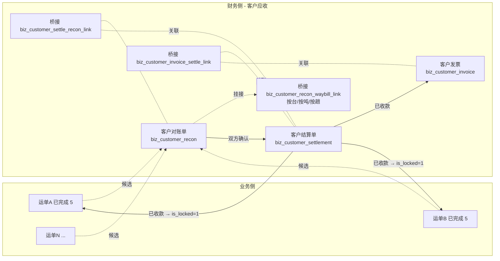

# 客户侧 - 对账与结算与发票（应收闭环）

> **所属阶段**：阶段六 - 财务结算模块
>
> **文档状态**：方案确认（首版）
>
> **创建日期**：2026-05-19
>
> **优先级**：高（当前应收侧零实现，影响月结/票结客户的对账效率）
>
> **关联文档**：
>
> - 同目录 [00.模块总览](00.模块总览.md)
> - 同目录 [01.财务单据体系与业务单据联动设计](01.财务单据体系与业务单据联动设计.md)（本文严格遵守其通用基座）
> - [05.合作伙伴模块/01.客户管理](../05.合作伙伴模块/01.客户管理.md)
> - [05.业务模块-运单管理](../05.业务模块-运单管理.md)

## 一、业务背景

### 1.1 现状问题

| # | 问题 | 影响 |
|---|------|------|
| 1 | 客户对账完全线下走 Excel | 100+ 张运单一份对账，人工拆分账期/客户耗时 1 小时；签收金额与 Excel 漂移 |
| 2 | 没有"已结算/未结算"状态 | 财务无法回答"客户 X 还欠多少"；运单 status=5 已完成不等于已结算 |
| 3 | 无发票闭环 | 开票动作零留痕，跨月对账难复盘 |
| 4 | 计费引擎与对账无联动 | 计费引擎漏算的运单，客户主张差异时无法在系统内回灌 |

### 1.2 设计目标

| 目标 | 落地 |
|------|------|
| 把"对账事项"和"钱"分两个单据 | 对账单（事项）→ 结算单（钱）→ 发票（票），层层冻结 |
| 支持月结 / 票结 / 预付三种客户结算节奏 | 取 `customer.settlement_type` 字段（已存在），由生成规则适配 |
| 跨运单按台/按吨/按趟对账 | 桥接表存"基础数量 + 单价"，独立计费而非依赖运单冗余金额 |
| 与开票合规对齐 | 发票拆票、红冲、作废留痕 |

## 二、单据全景



## 三、客户对账单

### 3.1 业务模型

| 概念 | 定义 |
|------|------|
| 客户对账单 | 一段时间内某客户名下所有"待结算运单"的事项确认书，列出每张运单的计费基础、台数、单价、应收金额 |
| 计费基础 | 按台 / 按吨 / 按趟（来自运单合同；客户可能覆盖） |
| 对账状态 | 草稿 → 对账中 → 已确认 → 已结清 / 已撤销 |
| 范围维度 | `customer_id` + `period_start` + `period_end`，同维度同时只允许一张"非撤销"对账单 |

### 3.2 数据模型

#### `biz_customer_recon`（客户对账单主表）

继承 §01 §2.1 `FinanceDocBaseMixin`；本表特有字段：

| 字段 | 类型 | 备注 |
|------|------|------|
| `doc_kind` | `'customer_recon'` 常量 | 基类字段，本表填固定值 |
| `customer_id` | BigInt | 关联 `biz_customer.id` |
| `customer_name` | VARCHAR(100) | 冗余 |
| `settlement_type` | TinyInt | 0-月结 1-票结 2-预付（取自客户档案，写入时冻结） |
| `period_start` / `period_end` | DateTime | 对账周期（基类字段已有，本表必填） |
| `waybill_count` | Int | 关联运单总数（冗余，便于列表筛选） |
| `total_quantity` | Int | 总台数（按行聚合） |
| `total_planned_amount` | Numeric(14,2) | 应收金额合计 |
| `total_actual_amount` | Numeric(14,2) | 实际已收金额（联动 §4 结算单） |
| `confirmed_by_customer_at` | DateTime | 客户方确认时间 |
| `confirmed_by_customer_name` | VARCHAR(100) | 客户方确认人姓名（自由文本） |
| `confirm_voucher_url` | VARCHAR(500) | 客户回签 PDF/图片 URL |
| `customer_contact_name` / `customer_contact_phone` | VARCHAR | 冗余客户对账联系人 |
| `status` | 见 §01 §2.2.3 矩阵：`0 草稿 / 2 已确认 / 3 已结清 / 4 已撤销` | 不使用 1 待审批（对账类直接由业务主管确认） |

> **状态文案**：本表 status=2 显示「已确认」、3 显示「已结清」。

#### `biz_customer_recon_waybill_link`（桥接表 - 对账行）

| 字段 | 类型 | 备注 |
|------|------|------|
| `recon_id` | BigInt | 关联 `biz_customer_recon.id` |
| `waybill_id` | BigInt | 关联 `biz_waybill.id` |
| `waybill_no` | VARCHAR(50) | 冗余 |
| `billing_base` | TinyInt | 1-按台 2-按吨 3-按趟 4-固定金额 |
| `quantity` | Numeric(10,2) | 计费数量（按台=已签收台数；按吨=吨数；按趟=1） |
| `unit_price` | Numeric(12,2) | 单价（运单合同冻结，可手工覆盖） |
| `amount` | Numeric(12,2) | 行金额 = quantity × unit_price ± adjust |
| `adjust_amount` | Numeric(12,2) | 调整（差异、罚款、补价） |
| `adjust_reason` | VARCHAR(255) | 调整原因 |
| `freight_amount_snapshot` | Numeric(12,2) | 写入时的 `waybill.freight_amount` 快照 |
| `signed_quantity_snapshot` | Int | 写入时的 `item.signed_qty` 聚合快照 |
| `locked_snapshot_at` | DateTime | 快照时间 |
| `remark` | TEXT | 备注 |
| 唯一约束 | `(recon_id, waybill_id)` | 防重复挂接 |

> **快照字段意义**：业务侧逆向（如撤销签收）不应回灌对账行金额。快照保留事实，避免对账漂移。差异需通过 §3.6 "差异单"机制处理。

### 3.3 状态机

| 当前状态 | 触发动作 | 目标状态 | 校验 |
|---------|---------|---------|------|
| 草稿 0 | 添加 / 删除运单行；编辑数量 / 单价 | 草稿 0 | 运单 `status=5` 已完成、`is_locked=0` |
| 草稿 0 | 提交确认 | 已确认 2 | 至少 1 行；total > 0；客户档案有效 |
| 草稿 0 | 撤销 | 已撤销 4 | 留 reason |
| 已确认 2 | 退回修改 | 草稿 0 | 留 reason；解除关联运单的"挂接对账中"标记 |
| 已确认 2 | 录入客户回签 | 已确认 2 | 写 `confirmed_by_customer_at` + 凭证 URL |
| 已确认 2 | 关联结算单 | 已确认 2 | 不切状态，仅写关联 |
| 已确认 2 | 全部结清 | 已结清 3 | 全部关联结算单都 `status=3`，且金额覆盖 |
| 已确认 2 | 撤销（高权限） | 已撤销 4 | 留 reason；级联解除运单挂接标记 |
| 已结清 3 | 解锁结清（高权限） | 已确认 2 | 用于"客户事后追加差异" |

> **业务规则**：运单一旦挂入"非撤销"对账单，在 06 模块层面追加"挂入对账"的软标记，禁止 `delete_waybill` 与 `update_waybill` 的关键字段（金额、台数、客户）修改。落地位置：`linkage/waybill_to_finance.assert_unbound`。

### 3.4 候选生成规则

| 触发 | 候选范围 |
|------|---------|
| 客户列表"生成对账"按钮 | `waybill.customer_id = X` AND `status=5` AND `is_locked=0` AND **未挂在任何非撤销对账单**；按 `period_start <= signed_at <= period_end` 过滤 |
| 定时任务（月结客户） | 每月 `settlement_day` + 3 天后批量生成，落候选池供财务一键确认 |
| 单张运单"加入对账"按钮 | 在运单详情页可手工挂入指定客户对账单 |

候选生成由 service 层封装：

```python
# services/finance/customer/customer_recon_service.py
def list_candidates(customer_id, period_start, period_end) -> list[WaybillCandidate]:
    """返回可加入对账单的运单候选；考虑 is_locked、已挂接其他对账单"""

def create_from_candidates(customer_id, waybill_ids, billing_rules) -> CustomerRecon:
    """按选中候选生成草稿态对账单"""
```

### 3.5 业务规则细节

| 规则 | 说明 |
|------|------|
| 同客户同周期唯一 | `(customer_id, period_start, period_end, status != 4)` 至多 1 张 |
| 行金额来源优先级 | 行 `amount`（手工覆盖）> `quantity × unit_price`（合同/手工）> `freight_amount_snapshot`（运单冗余兜底） |
| 客户回签是软约束 | 没有客户回签也允许进入"已确认"，但发起结算单时强警示 |
| 部分确认/分批结清 | 允许同一对账单关联多张结算单；只有全部关联结算单结清才能 3 已结清 |
| 跨月跨年 | 当 `period_end < period_start` 跨年时强警示但允许 |

### 3.6 差异单机制（轻量）

当客户对账中发现"系统金额 ≠ 客户主张金额"时：

1. 财务在对账行的 `adjust_amount` / `adjust_reason` 直接调整；
2. 调整额 > ¥5000 触发"业务主管审批"软门槛（拒绝则回退草稿）；
3. 调整动作必写 `biz_finance_doc_event`，事件类型 = 16（调整），便于事后回溯；
4. 如果差异是因为计费引擎错算，财务可点击行的"反查计费"按钮跳到计费引擎，并触发"重新计费"任务（属于计费引擎模块功能）。

## 四、客户结算单

### 4.1 业务模型

| 概念 | 定义 |
|------|------|
| 客户结算单 | 基于一张或多张"已确认"对账单，进入审批与收款流程 |
| 拆并规则 | 1 张对账单可拆 N 张结算单（多笔到账）；多张对账单可并入 1 张结算单（合并到账） |
| 状态机 | 草稿 → 待审批 → 已审批 → 已收款 → 已撤销 / 已开票（开票后 `is_locked=1`） |

### 4.2 数据模型

#### `biz_customer_settlement`（客户结算单主表）

继承 `FinanceDocBaseMixin`；特有字段：

| 字段 | 类型 | 备注 |
|------|------|------|
| `doc_kind` | `'customer_settle'` | 常量 |
| `customer_id` | BigInt | 冗余 |
| `customer_name` | VARCHAR(100) | 冗余 |
| `recon_count` | Int | 关联对账单数量（冗余） |
| `planned_amount` | Numeric(14,2) | 计划收款金额（基类已有，本表必填） |
| `actual_amount` | Numeric(14,2) | 实际收款金额 |
| `received_at` | DateTime | 收款时间（=基类 `paid_at`，应收语义） |
| `received_voucher_url` | VARCHAR(500) | 银行回单 URL |
| `received_account` | VARCHAR(100) | 收款账户（企业自有银行账户标签） |
| `invoice_required` | TinyInt | 是否需要开票 0/1 |
| `invoice_count` | Int | 已关联发票数量（冗余） |
| `invoice_amount_total` | Numeric(14,2) | 已开发票金额合计（冗余） |

#### `biz_customer_settle_recon_link`（桥接：结算单 ↔ 对账单）

| 字段 | 类型 |
|------|------|
| `settle_id` | BigInt |
| `recon_id` | BigInt |
| `applied_amount` | Numeric(14,2)（本结算单对该对账单的应用金额，便于"对账单部分结清"） |
| 唯一约束 | `(settle_id, recon_id)` |

### 4.3 状态机

完全遵循 §01 §2.2 通用状态机：

```text
0 草稿 → 1 待审批 → 2 已审批 → 3 已收款 → 5 已核销
                                ↘ 4 已撤销
```

| 触发 | from | to | 校验 |
|------|------|----|------|
| 提交审批 | 0 | 1 | 至少 1 张关联对账单；金额一致 |
| 审批通过 | 1 | 2 | 财务主管角色 |
| 审批拒绝 | 1 | 4 | 留 reason |
| 退回修改 | 2 | 0 | 留 reason |
| 登记收款 | 2 | 3 | `actual_amount` + `received_at` + 凭证 |
| 撤销收款 | 3 | 2 | 高权限 + 留 reason；联动 `unlock_waybills` |
| 完成核销 | 3 | 5 | 关联对账单全部结清；远期自动 |
| 强制撤销 | 任意非终态 | 4 | 留 reason |

### 4.4 反向影响（硬联动）

| 触发 | 影响对象 | 动作 | 实现 |
|------|---------|------|------|
| 登记收款（→3） | 关联对账单范围内的运单 | `waybill.is_locked = 1`、`locked_by_doc_id = 结算单 id` | `lock_orchestrator.lock_waybills(settle_id)` |
| 撤销收款（3→2） | 同上 | 解锁运单 `is_locked=0`、`locked_by_doc_id=NULL` | 同上反向操作 |
| 撤销收款时存在已开票发票 | 拒绝撤销 | 422 | `assert_no_active_invoice(settle_id)` |
| 关联对账单 | 对账单 | 不切状态，仅写关联，更新 `total_actual_amount` 冗余 | 服务方法 |

### 4.5 业务规则细节

| 规则 | 说明 |
|------|------|
| 关联对账单必须同客户 | 跨客户合并禁止 |
| 关联对账单必须 `status=2 已确认` | 草稿态不能并入 |
| `planned_amount` 必须 = Σ `applied_amount` | 自动核算 |
| 关联对账单可分次收款 | 同一对账单关联多张结算单时，applied_amount 总和 ≤ 对账单未结金额 |
| 收款方式 | 1-银行转账 2-现金 3-支票 4-承兑汇票 5-平台代收 |
| 收款账户管理 | 远期独立"企业银行账户"模块，本期下拉字典：`tenant_bank_account` 字典 |

## 五、客户发票

### 5.1 业务模型

| 概念 | 定义 |
|------|------|
| 客户发票 | 客户结算单完成收款后的开票动作；1 张结算单可对 N 张发票（拆票）、N 张结算单可对 1 张发票（合并开票） |
| 状态机 | 草稿 → 申请中（1）→ 已开票（3）→ 已作废（9）/ 已红冲（9 子分类） |
| 多税率 | 同一发票内可含多个税率行，按行声明 |

### 5.2 数据模型

#### `biz_customer_invoice`（客户发票主表）

继承 `FinanceDocBaseMixin`；特有字段：

| 字段 | 类型 | 备注 |
|------|------|------|
| `doc_kind` | `'customer_invoice'` | 常量 |
| `customer_id` | BigInt | 冗余 |
| `customer_name` | VARCHAR(100) | 冗余 |
| `invoice_type` | TinyInt | 1-普票 2-专票 3-电子普票 4-电子专票 |
| `applicant_at` | DateTime | 申请开票时间 |
| `issued_at` | DateTime | 开票时间 |
| `invoice_no` | VARCHAR(50) | 发票号（远期对接金税后写入） |
| `invoice_code` | VARCHAR(30) | 发票代码 |
| `tax_amount` | Numeric(14,2) | 税额合计 |
| `amount_excl_tax` | Numeric(14,2) | 不含税金额合计 |
| `amount_incl_tax` | Numeric(14,2) | 含税金额合计 |
| `buyer_title` / `buyer_tax_id` / `buyer_address` / `buyer_phone` / `buyer_bank` / `buyer_account` | VARCHAR | 完整购方信息（冗余冻结） |
| `void_reason` | VARCHAR(255) | 作废原因 |
| `voided_at` | DateTime | 作废时间 |
| `red_invoice_no` | VARCHAR(50) | 红冲发票号 |
| `pdf_url` | VARCHAR(500) | 发票 PDF |

#### `biz_customer_invoice_item`（发票行明细）

| 字段 | 类型 | 备注 |
|------|------|------|
| `invoice_id` | BigInt | 关联发票主表 |
| `item_name` | VARCHAR(100) | 商品/服务名称（如"汽车整车运输服务"） |
| `tax_rate` | Numeric(5,2) | 税率 % |
| `amount_excl_tax` | Numeric(12,2) | 不含税 |
| `tax_amount` | Numeric(12,2) | 税额 |
| `amount_incl_tax` | Numeric(12,2) | 含税 |
| `remark` | VARCHAR(255) | 备注 |

#### `biz_customer_invoice_settle_link`（桥接：发票 ↔ 结算单）

| 字段 | 类型 |
|------|------|
| `invoice_id` | BigInt |
| `settle_id` | BigInt |
| `applied_amount_incl_tax` | Numeric(14,2)（本发票对该结算单的开票金额） |
| 唯一约束 | `(invoice_id, settle_id)` |

### 5.3 状态机

| 当前状态 | 动作 | 目标 | 校验 |
|---------|------|------|------|
| - | 创建草稿 | 0 草稿 | 必填关联结算单 |
| 0 | 提交申请 | 1 申请中 | 行明细金额 = 关联结算单金额 |
| 1 | 退回修改 | 0 | 留 reason |
| 1 | 开票完成 | 3 已开票 | 录入发票号 + 代码 + PDF；联动结算单 `is_locked=1` |
| 3 | 作废 | 9 已作废 | 必须未跨月（远期对接金税校验）；留 reason |
| 3 | 红冲 | 9 + 子分类红冲 | 需创建反向发票（金额取负） |

### 5.4 业务规则细节

| 规则 | 说明 |
|------|------|
| 拆票 | 允许；金额合计 = 关联结算单金额 |
| 合并开票 | 允许；要求关联结算单同 `customer_id` |
| 红冲 | 自动创建 1 张反向发票（金额取负），原发票状态 9，但保留可见 |
| 跨月作废禁止 | 业务规则提示；最终以金税平台为准 |
| 自动开票 | 本期不做；远期对接电子发票网关 |

## 六、与业务侧的联动闸口（本文档钉死）

| # | 触发 | 影响 | 实现位置 |
|---|------|------|---------|
| 1 | 运单 `status` 4→5 完成 | 加入候选池 | `linkage/waybill_to_finance.on_waybill_completed(wb_id)` |
| 2 | 运单挂入对账单（草稿态） | `waybill.is_recon_bound=1`（软标记字段，新增） | `customer_recon_service.add_waybill` |
| 3 | 对账单退回草稿 / 撤销 | 解除运单 `is_recon_bound=0` | 同上 |
| 4 | 客户结算单已收款（→3） | 关联运单 `is_locked=1`、`locked_by_doc_id` | `lock_orchestrator.lock_waybills` |
| 5 | 客户结算单撤销收款（3→2） | 反向解锁 | 同上反向 |
| 6 | 发票已开票 | 结算单 `is_locked=1` | `lock_orchestrator.lock_settlement` |
| 7 | 业务侧试图改"已挂对账"或"已锁定"运单 | 422 拒绝 | 06 模块 `waybill_service.update_waybill` 套用闸口断言 |

> 新字段 `biz_waybill.is_recon_bound` 是软标记，与 `is_locked` 区分语义：
>
> - `is_recon_bound`：挂在草稿/已确认对账单时为 1；用于禁止运单编辑核心字段；对账撤销即解除
> - `is_locked`：已收款后才置 1；终态锁定，需高权限 unlock

## 七、API 设计（概览）

> 详细请求体 / 响应体见 §10 后端蓝图；本节仅列路径与功能。

```text
# 对账单
POST   /api/finance/customer-recon                        创建草稿
PUT    /api/finance/customer-recon/{id}                    编辑草稿
POST   /api/finance/customer-recon/{id}/waybills           添加运单行（批量）
DELETE /api/finance/customer-recon/{id}/waybills/{rid}     移除行
PATCH  /api/finance/customer-recon/{id}/waybills/{rid}     调整数量/单价/调整额
POST   /api/finance/customer-recon/{id}/confirm            草稿 → 已确认
POST   /api/finance/customer-recon/{id}/customer-sign      上传客户回签
POST   /api/finance/customer-recon/{id}/withdraw           已确认 → 草稿
POST   /api/finance/customer-recon/{id}/cancel             撤销
GET    /api/finance/customer-recon                         列表 + 多维筛选
GET    /api/finance/customer-recon/{id}                    详情（含桥接行）
GET    /api/finance/customer-recon/{id}/events             审计事件流
GET    /api/finance/customer-recon/candidates              候选运单池（按 customer_id / period）

# 结算单
POST   /api/finance/customer-settle                        创建草稿
POST   /api/finance/customer-settle/{id}/recons            关联对账单
POST   /api/finance/customer-settle/{id}/submit            草稿 → 待审批
POST   /api/finance/customer-settle/{id}/approve           待审批 → 已审批
POST   /api/finance/customer-settle/{id}/reject            待审批 → 已撤销
POST   /api/finance/customer-settle/{id}/withdraw          已审批 → 草稿
POST   /api/finance/customer-settle/{id}/receive           已审批 → 已收款
POST   /api/finance/customer-settle/{id}/cancel-receive    已收款 → 已审批（高权限）
POST   /api/finance/customer-settle/{id}/cancel            撤销
POST   /api/finance/customer-settle/{id}/force-cancel      强制撤销
GET    /api/finance/customer-settle/{id}                   详情
GET    /api/finance/customer-settle/{id}/events            事件流

# 发票
POST   /api/finance/customer-invoice                       创建草稿
POST   /api/finance/customer-invoice/{id}/items            添加行明细
POST   /api/finance/customer-invoice/{id}/submit           申请开票
POST   /api/finance/customer-invoice/{id}/issue            完成开票（录入发票号）
POST   /api/finance/customer-invoice/{id}/void             作废
POST   /api/finance/customer-invoice/{id}/red-flush        红冲
GET    /api/finance/customer-invoice/{id}                  详情
```

## 八、前端蓝图

### 8.1 菜单与页面

| 路径 | 页面 |
|------|------|
| `/finance/customer-recon` | 客户对账单列表 + 详情抽屉 |
| `/finance/customer-recon/create` | 新建对账（候选选择器） |
| `/finance/customer-settle` | 客户结算单列表 + 详情 |
| `/finance/customer-settle/create` | 新建结算（对账单选择器） |
| `/finance/customer-invoice` | 客户发票列表 + 详情 |

### 8.2 关键组件

| 组件 | 用途 |
|------|------|
| `<customer-recon-candidate-picker>` | 候选运单选择器：左侧筛选（客户/周期/状态），右侧选择列表 + 计费规则配置 |
| `<customer-recon-line-table>` | 对账行表格：可编辑数量/单价/调整额；高亮"调整"项 |
| `<customer-recon-customer-sign-dialog>` | 客户回签上传 |
| `<customer-settle-recon-picker>` | 结算单的对账单选择器（同客户、status=2） |
| `<finance-pay-dialog>`（通用） | 收款登记（凭证上传 + 收款账户选择） |
| `<finance-cancel-dialog>`（通用） | 撤销原因输入 |
| `<customer-invoice-item-table>` | 发票行编辑（含税率） |

### 8.3 列表页关键字段

| 单据 | 列 |
|------|-----|
| 对账单列表 | 单据号 / 客户 / 周期 / 运单数 / 总台数 / 应收金额 / 已收金额 / 状态 / 创建人 / 创建时间 / 操作 |
| 结算单列表 | 单据号 / 客户 / 关联对账单数 / 计划金额 / 实际金额 / 收款时间 / 状态 / 操作 |
| 发票列表 | 发票号 / 客户 / 关联结算单 / 含税金额 / 税额 / 开票时间 / 状态 / 操作 |

### 8.4 详情抽屉关键区块

- 头部：单据号 + 状态 Tag + 锁定徽章 + 关键金额
- "关联业务对象"区块：可点击跳到运单详情
- "金额明细"区块：计划 / 实际 / 调整 / 差异
- "审计事件流"区块：`<finance-doc-event-timeline>`

## 九、权限矩阵

| 角色 | 客户对账 | 客户结算 | 客户发票 |
|------|---------|---------|---------|
| 调度员 | 只读列表 | 无 | 无 |
| 财务专员 | 创建/编辑/提交确认 | 创建/编辑/提交 | 创建/编辑/提交 |
| 业务主管 | 客户回签登记 / 退回草稿 / 调整额> 5000 审批 | 无 | 无 |
| 财务主管 | 撤销已确认 / 解锁已结清 | 审批 / 撤销收款 / 强制撤销 | 作废 / 红冲 |
| 出纳 | 无 | 收款登记 | 无 |

权限点前缀：

```text
finance:cust-recon:list / detail / create / edit / add-waybill / remove-waybill /
                    confirm / customer-sign / withdraw / cancel / unlock / export

finance:cust-settle:list / detail / create / edit / link-recon / submit / approve /
                    reject / withdraw / receive / cancel-receive / cancel / force-cancel / export

finance:cust-invoice:list / detail / create / edit / submit / issue / void / red-flush / export
```

## 十、后端代码蓝图

### 10.1 新建文件

| 文件 | 内容 |
|------|------|
| `models/finance/customer_recon.py` | `CustomerRecon` + `CustomerReconWaybillLink` |
| `models/finance/customer_settlement.py` | `CustomerSettlement` + `CustomerSettleReconLink` |
| `models/finance/customer_invoice.py` | `CustomerInvoice` + `CustomerInvoiceItem` + `CustomerInvoiceSettleLink` |
| `services/finance/customer/customer_recon_service.py` | 候选生成、CRUD、状态切换 |
| `services/finance/customer/customer_settlement_service.py` | 同上 |
| `services/finance/customer/customer_invoice_service.py` | 同上 |
| `services/finance/linkage/waybill_to_finance.py` | `on_waybill_completed` / `assert_unbound` |
| `services/finance/linkage/lock_orchestrator.py` | `lock_waybills` / `unlock_waybills` / `lock_settlement` |
| `schemas/finance/customer_recon.py` 等 | DTO |
| `api/finance/customer_recon.py` 等 | API |

### 10.2 现有文件改动

| 文件 | 改动 |
|------|------|
| `models/waybill/waybill.py` | 新增 `is_locked` / `locked_at` / `locked_by_doc_id` / `is_recon_bound` 字段（向后兼容） |
| `services/waybill/waybill_service.py` | `update_waybill` / `delete_waybill` 调用 `waybill_to_finance.assert_unbound` |
| `services/waybill/waybill_service.update_status` | waybill→5 时调用 `on_waybill_completed`（候选池软标记） |
| `schemas/waybill/waybill.py` `WaybillOut` | 暴露 `isLocked` / `isReconBound` / `lockedByDocId` 给前端 |

### 10.3 数据库迁移

| 表 | 迁移 |
|----|------|
| `biz_customer_recon` | 新建 |
| `biz_customer_recon_waybill_link` | 新建 + 唯一索引 |
| `biz_customer_settlement` | 新建 |
| `biz_customer_settle_recon_link` | 新建 + 唯一索引 |
| `biz_customer_invoice` / `_item` / `_settle_link` | 新建 |
| `biz_waybill` | `ALTER TABLE ADD COLUMN is_locked / locked_at / locked_by_doc_id / is_recon_bound DEFAULT 0` |

## 十一、测试要点

### 11.1 对账单

1. **候选过滤**：选中 `customer_id=X`、`period=2026-04` → 列表只含已完成且未挂的运单
2. **同期唯一**：对同一客户同周期生成第二张对账单 → 422
3. **挂入软锁**：草稿对账单挂入运单 A → 编辑 A 的 freight_amount → 422
4. **撤销解锁**：撤销该对账单 → A 可编辑
5. **调整额审批**：行 `adjust_amount = 6000` → 业务主管未审批不允许 confirm
6. **客户回签**：confirm 后上传客户签字 PDF → 详情可见 URL

### 11.2 结算单

7. **关联校验**：跨客户结算 → 422
8. **金额一致性**：planned_amount ≠ Σ applied_amount → 422
9. **收款登记**：→3 后查关联运单 `is_locked=1`
10. **撤销收款**：→2 后运单解锁；如果有关联发票已开票 → 422 拒绝
11. **核销**：所有关联对账单 status=3 → 自动 5

### 11.3 发票

12. **拆票**：1 张结算单拆 2 张发票，金额合计 = 结算单金额
13. **合并开票**：2 张结算单合并 1 张发票，校验同客户
14. **作废**：开票后作废 → 关联结算单 unlock
15. **红冲**：开票后红冲 → 自动创建反向发票，金额取负

### 11.4 业务-财务联动

16. **运单未完成不可加入对账**：status<5 → 422
17. **运单已结算不可改金额**：is_locked=1 → 422
18. **运单已挂对账不可删除**：is_recon_bound=1 → 422
19. **业务侧 waybill 5→4 逆向**：已挂对账单不影响业务侧逆向，但 UI 警示
20. **客户结算单收款后批量解锁**：撤销收款触发批量解锁，行锁按 waybill_id 升序，无死锁

## 十二、远期演进锚点

| 远期能力 | 本文档预留 |
|---------|----------|
| 电子发票网关对接（百望/航信） | `invoice_no` / `invoice_code` 字段已留；远期改为自动写入 |
| 多税率发票 | `biz_customer_invoice_item.tax_rate` 已支持多行 |
| 跨期分摊（跨年/跨月） | 对账单 `period_start/end` 不约束跨期；分摊报表远期独立 |
| 银行流水自动核销 | `received_account` 字段 + 事件表 `payload_snapshot.bank_serial` 字段预留 |
| AI 智能对账（推荐金额匹配） | 候选池接口已对外暴露，远期换 service 实现即可 |
| 客户对账自助门户（让客户自己确认） | `customer_contact_*` 字段已留；远期对接平台端客户协作模块 |
