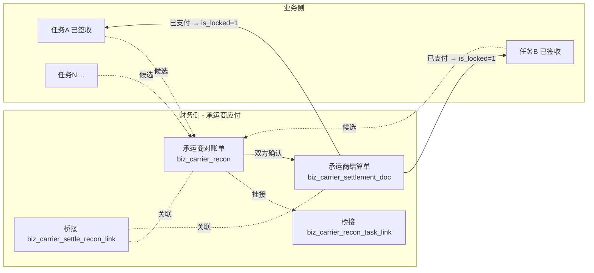

# 承运商侧 - 对账与结算（跨任务应付闭环）

> **所属阶段**：阶段六 - 财务结算模块
>
> **文档状态**：方案确认（首版）
>
> **创建日期**：2026-05-19
>
> **优先级**：高（与承运商对账高频、月结金额大）
>
> **关联文档**：
>
> - 同目录 [00.模块总览](00.模块总览.md)
> - 同目录 [01.财务单据体系与业务单据联动设计](01.财务单据体系与业务单据联动设计.md)（本文严格遵守通用基座）
> - 同目录 [05.任务级费用单演进与社会运力预付尾款](05.任务级费用单演进与社会运力预付尾款.md)
> - [05.合作伙伴模块/02.承运商管理](../05.合作伙伴模块/02.承运商管理.md)
> - [06.运营调度模块/01.运输任务单管理](../06.运营调度模块/01.运输任务单管理.md)

## 一、业务背景

### 1.1 现状问题

| # | 问题 | 影响 |
|---|------|------|
| 1 | 承运商对账完全 Excel | 月初 1-3 号财务专员加班整理上月任务，常出现"对不上账" |
| 2 | 任务级结算单（[`biz_task_finance_doc`](../../../../backend/app/modules/client/models/task/task_finance_doc.py)）解决了"单任务付款"，但**没有解决"跨任务批量结算"** | 月结承运商每月几十张任务，逐张签结算单效率低 |
| 3 | 承运商有多个结算账户（[`biz_carrier_settlement`](../../../../backend/app/modules/client/models/partner/carrier_settlement.py)），但任务级付款时未充分使用 | 经常付错账户 |
| 4 | 已支付的任务级结算单与"是否纳入承运商对账"无标志 | 易出现"双重支付"风险 |

### 1.2 与"任务级结算单"的关系定位

承运商侧设计**承运商对账 → 承运商结算**两层单据，**不取代**现有任务级预付/补款/结算单：

| 单据 | 角色 | 何时用 |
|------|------|--------|
| 任务级预付/补款（[05](05.任务级费用单演进与社会运力预付尾款.md)） | 单任务高时效付款（出车前预付、装车后补款） | 任务进行中 |
| 任务级结算单 | 单任务结清 | 票结承运商、单任务结算 |
| **承运商对账单（本文）** | 把"该承运商一段时间内多张任务"汇总成一张事项确认 | 月结承运商 |
| **承运商结算单（本文）** | 基于承运商对账单进入审批 + 批量付款 | 月结付款 / 多对账单合并支付 |

> **核心约束**：一张任务**只能在一种付款路径**内流转：要么"任务级最终结算单"，要么"纳入承运商对账"，不能同时存在。冲突由 §3.4 闸口控制。

### 1.3 设计目标

| 目标 | 落地 |
|------|------|
| 月结闭环 | 候选池 → 对账单 → 结算单 → 付款 → 锁定 |
| 票结兼容 | 票结承运商继续走任务级结算单路径；本文档不影响 |
| 多账户支持 | 付款时强制选择承运商结算账户 |
| 与任务侧锁定联动 | 已纳入"非撤销"对账单的任务，task.is_locked=1（软锁），禁止改成本字段 |

## 二、单据全景



## 三、承运商对账单

### 3.1 业务模型

| 概念 | 定义 |
|------|------|
| 承运商对账单 | 一段时间内某承运商名下"已签收且未付清"任务的事项确认书 |
| 计费基础 | 按台 / 按吨 / 按趟 / 包车（任务承运成本基线，可逐行覆盖） |
| 范围维度 | `carrier_id` + `period_start` + `period_end`，同维度同时只允许一张"非撤销"对账单 |

### 3.2 数据模型

#### `biz_carrier_recon`（承运商对账单主表）

继承 `FinanceDocBaseMixin`；本表特有字段：

| 字段 | 类型 | 备注 |
|------|------|------|
| `doc_kind` | `'carrier_recon'` | 常量 |
| `carrier_id` | BigInt | 关联 `biz_carrier.id` |
| `carrier_name` | VARCHAR(100) | 冗余 |
| `carrier_short_name` | VARCHAR(50) | 冗余 |
| `settlement_account_id` | BigInt | 推荐结算账户（`biz_carrier_settlement.id`，写入时冻结） |
| `settlement_account_label` | VARCHAR(50) | 冗余账户标签 |
| `settlement_type_snapshot` | TinyInt | 写入时承运商主结算方式快照（0-月结/1-票结/2-预付/3-趟结） |
| `period_start` / `period_end` | DateTime | 对账周期，必填 |
| `task_count` | Int | 关联任务数（冗余） |
| `total_quantity` | Int | 总台数（按行聚合） |
| `total_planned_amount` | Numeric(14,2) | 应付金额合计 |
| `total_paid_amount` | Numeric(14,2) | 已支付金额合计（联动结算单） |
| `total_prepaid_amount` | Numeric(14,2) | 任务级**预付/补款已支付**金额合计（自动扣减项，见 §3.6） |
| `total_net_amount` | Numeric(14,2) | 净应付 = total_planned_amount - total_prepaid_amount |
| `confirmed_by_carrier_at` | DateTime | 承运商确认时间 |
| `confirmed_by_carrier_name` | VARCHAR(100) | 承运商确认人 |
| `confirm_voucher_url` | VARCHAR(500) | 承运商回签 |
| `status` | 0/2/3/4 | 0 草稿 / 2 已确认 / 3 已结清 / 4 已撤销 |

> 与客户对账同构；区别：增加 `total_prepaid_amount` / `total_net_amount` 用于扣减已通过任务级预付/补款支付的金额。

#### `biz_carrier_recon_task_link`（桥接：对账行）

| 字段 | 类型 | 备注 |
|------|------|------|
| `recon_id` | BigInt | 关联 `biz_carrier_recon.id` |
| `task_id` | BigInt | 关联 `biz_task.id` |
| `task_no` | VARCHAR(50) | 冗余 |
| `billing_base` | TinyInt | 1-按台 2-按吨 3-按趟 4-包车 |
| `quantity` | Numeric(10,2) | 计费数量（按台=已签收台数） |
| `unit_price` | Numeric(12,2) | 单价 |
| `gross_amount` | Numeric(12,2) | 毛额 = quantity × unit_price ± adjust |
| `adjust_amount` | Numeric(12,2) | 调整（罚款、补价、油卡核销） |
| `adjust_reason` | VARCHAR(255) | 调整原因 |
| `prepaid_offset_amount` | Numeric(12,2) | **任务级预付/补款已支付的扣减额**（见 §3.6） |
| `net_amount` | Numeric(12,2) | 行净额 = gross_amount - prepaid_offset_amount |
| `carrier_cost_amount_snapshot` | Numeric(12,2) | 写入时 `task.carrier_cost_amount` 快照 |
| `signed_quantity_snapshot` | Int | 写入时已签收台数快照 |
| `locked_snapshot_at` | DateTime | 快照时间 |
| 唯一约束 | `(recon_id, task_id)` | 防重复 |

### 3.3 状态机

完全复用客户对账单逻辑（§02 §3.3），仅状态文案不变。

### 3.4 候选生成规则（关键差异）

| 触发 | 候选范围 |
|------|---------|
| 承运商列表"生成对账"按钮 | `task.carrier_id = X` AND `carrier_type ∈ {2,3}`（承运商或社会运力）AND `status >= 5 已签收` AND `is_locked=0` AND **未挂在任何非撤销承运商对账单** AND **不存在已支付的"任务级最终结算单"**（`doc_type=3 is_final=1 status=3` 不存在） |
| 月结定时任务 | 月末 + 3 天后批量生成候选 |
| 单张任务"加入对账"按钮 | 任务详情页可手工挂入 |

> 关键校验：候选过滤排除掉**已通过任务级最终结算单结清**的任务，避免双重支付。

### 3.5 业务规则细节

| 规则 | 说明 |
|------|------|
| 同承运商同周期唯一 | `(carrier_id, period_start, period_end, status != 4)` 至多 1 张 |
| 行金额来源优先级 | 行 `gross_amount`（手工）> `quantity × unit_price` > `carrier_cost_amount_snapshot` |
| 调整审批门槛 | 单行 `adjust_amount` > ¥3000 触发业务主管审批 |
| 自有车排除 | `task.carrier_type=1 自有车` 不进入承运商对账，转入司机工资单（[04](04.自有司机工资单.md)） |
| 社会运力归类 | `task.carrier_type=3 社会运力`：默认走任务级预付/尾款（[05](05.任务级费用单演进与社会运力预付尾款.md)），不进入承运商对账；若客户后续选"批量结算"则需切到承运商对账（远期） |

### 3.6 预付/补款金额扣减规则

当任务在"装车后/在途"已通过任务级预付/补款收到部分款项时，纳入承运商对账后需扣减：

```text
对账行净额 = gross_amount (按台/趟计算的毛额)
            - 已支付的预付单金额合计
            - 已支付的补款单金额合计
```

实现：

```python
# services/finance/carrier/carrier_recon_service.py
def calculate_prepaid_offset(task_id: int) -> Decimal:
    """计算该任务已通过预付/补款支付的金额合计（不含结算单）"""
    return db.query(
        func.coalesce(func.sum(TaskFinanceDoc.actual_amount), 0)
    ).filter(
        TaskFinanceDoc.task_id == task_id,
        TaskFinanceDoc.doc_type.in_([1, 2]),    # 1-预付 2-补款
        TaskFinanceDoc.status == 3,              # 已支付
    ).scalar()
```

写入对账行时同步快照到 `prepaid_offset_amount`。后续即使预付单被撤销，对账行扣减不漂移（事实快照原则）。

如果撤销发生，差额通过 `adjust_amount` 手工补回，留 audit trail。

## 四、承运商结算单

### 4.1 业务模型

| 概念 | 定义 |
|------|------|
| 承运商结算单 | 基于一/多张"已确认"对账单进入审批 + 付款流程 |
| 拆并规则 | 同客户结算单：1 对账单可拆 N 结算单；N 对账单可并 1 结算单（必须同承运商） |
| 状态机 | 草稿 → 待审批 → 已审批 → 已支付 → 已撤销 / 已核销 |

### 4.2 数据模型

#### `biz_carrier_settlement_doc`（承运商结算单主表）

> **命名规避**：避免与 `biz_carrier_settlement`（承运商结算账户）重名。

继承 `FinanceDocBaseMixin`；特有字段：

| 字段 | 类型 | 备注 |
|------|------|------|
| `doc_kind` | `'carrier_settle'` | 常量 |
| `carrier_id` | BigInt | 冗余 |
| `carrier_name` | VARCHAR(100) | 冗余 |
| `settlement_account_id` | BigInt | 结算账户 `biz_carrier_settlement.id`（付款时校验账户状态=1） |
| `settlement_account_label` / `bank_name` / `bank_account_masked` | VARCHAR | 冗余 |
| `recon_count` | Int | 关联对账单数量 |
| `planned_amount` | Numeric(14,2) | 计划付款金额 = Σ 对账单净额 |
| `actual_amount` | Numeric(14,2) | 实际付款金额 |
| `paid_at` | DateTime | 付款时间（基类字段） |
| `pay_method` | TinyInt | 1-银行转账 2-油卡 3-油气款 4-现金 5-平台代付 |
| `payment_voucher_url` | VARCHAR(500) | 银行回单 |
| `is_offset_only` | TinyInt | 是否仅作"抵账操作"（无实付，仅对账闭环）；当任务级预付/补款 = 对账总额时使用 |

#### `biz_carrier_settle_recon_link`（桥接：结算单 ↔ 对账单）

| 字段 | 类型 |
|------|------|
| `settle_id` | BigInt |
| `recon_id` | BigInt |
| `applied_amount` | Numeric(14,2)（本结算单对该对账单的支付金额） |
| 唯一约束 | `(settle_id, recon_id)` |

### 4.3 状态机

完全遵循 §01 §2.2 通用状态机。

### 4.4 反向影响（硬联动）

| 触发 | 影响对象 | 动作 | 实现 |
|------|---------|------|------|
| 登记付款（→3） | 关联对账单范围内的任务 | `task.is_locked=1`、`locked_by_doc_id=结算单 id` | `lock_orchestrator.lock_tasks(settle_id)` |
| 登记付款（→3） | 关联任务可选关闭 | `task.status` 6/5 → 7 已关闭（软触发，UI 提示） | `linkage/task_to_finance.suggest_close_task` |
| 撤销付款（3→2） | 关联任务解锁；如已关闭则手动 unclose | 同上反向 | 需高权限 |

### 4.5 业务规则细节

| 规则 | 说明 |
|------|------|
| 跨承运商禁止合并 | 422 |
| 跨币种禁止合并 | 422 |
| 关联对账单必须 `status=2 已确认` | 草稿不能并入 |
| `planned_amount` = Σ `applied_amount` | 自动核算 |
| `is_offset_only=1` 时跳过付款凭证 | 仅做账面闭环 |

## 五、与业务侧的联动闸口

| # | 触发 | 影响 | 实现 |
|---|------|------|------|
| 1 | 任务 `status` 4→5 签收 | 加入候选池 | `linkage/task_to_finance.on_task_signed` |
| 2 | 任务挂入承运商对账单 | `task.is_recon_bound=1`（软标记，新增字段） | `carrier_recon_service.add_task` |
| 3 | 对账单撤销 / 退回草稿 | 解除 `is_recon_bound=0` | 同上 |
| 4 | 结算单已支付（→3） | 关联任务 `is_locked=1` | `lock_orchestrator.lock_tasks` |
| 5 | 结算单撤销付款（3→2） | 反向解锁 | 同上 |
| 6 | 业务侧改"已挂对账"任务的承运成本字段 | 422 拒绝 | `task_service.update_task` 套断言 |
| 7 | 任务级"最终结算单"已支付的任务 | **拒绝**纳入承运商对账 | 候选过滤 + 二次校验 |
| 8 | 承运商对账中任务被强制取消 | 自动从对账单移除（草稿态）或拒绝（已确认态） | `linkage/task_to_finance.on_task_force_cancelled` |

> 新字段 `biz_task.is_recon_bound`：与 06 模块状态机 `is_locked` 区分语义。

## 六、与"任务级最终结算单"的冲突避免

| 场景 | 处理 |
|------|------|
| 任务先走任务级最终结算单（已支付） | 候选池**排除**该任务；财务专员强行加入 → 422 |
| 任务先纳入承运商对账（已确认） | 创建任务级最终结算单时校验：若任务已挂对账则**拒绝**创建 → 422，需先撤销对账挂接 |
| 任务先有预付/补款（已支付） | 允许纳入对账；通过 §3.6 自动扣减 |
| 任务承运商对账已支付（已锁定） | 业务侧任何成本字段修改、任务 force_cancel 均拒绝；需高权限解锁 |

## 七、API 设计（概览）

```text
# 承运商对账
POST   /api/finance/carrier-recon                     创建草稿
POST   /api/finance/carrier-recon/{id}/tasks          添加任务行
DELETE /api/finance/carrier-recon/{id}/tasks/{tid}    移除任务行
PATCH  /api/finance/carrier-recon/{id}/tasks/{tid}    调整数量/单价/调整额
POST   /api/finance/carrier-recon/{id}/confirm        草稿 → 已确认
POST   /api/finance/carrier-recon/{id}/carrier-sign   上传承运商回签
POST   /api/finance/carrier-recon/{id}/withdraw       已确认 → 草稿
POST   /api/finance/carrier-recon/{id}/cancel         撤销
GET    /api/finance/carrier-recon/candidates          候选任务池

# 承运商结算单
POST   /api/finance/carrier-settle                    创建草稿
POST   /api/finance/carrier-settle/{id}/recons        关联对账单
POST   /api/finance/carrier-settle/{id}/submit
POST   /api/finance/carrier-settle/{id}/approve
POST   /api/finance/carrier-settle/{id}/reject
POST   /api/finance/carrier-settle/{id}/withdraw
POST   /api/finance/carrier-settle/{id}/pay           已审批 → 已支付
POST   /api/finance/carrier-settle/{id}/cancel-pay    已支付 → 已审批（高权限）
POST   /api/finance/carrier-settle/{id}/cancel
POST   /api/finance/carrier-settle/{id}/force-cancel
```

## 八、前端蓝图

### 8.1 菜单与页面

| 路径 | 页面 |
|------|------|
| `/finance/carrier-recon` | 承运商对账单列表 + 详情 |
| `/finance/carrier-recon/create` | 新建对账（任务候选选择器） |
| `/finance/carrier-settle` | 承运商结算单列表 + 详情 |
| `/finance/carrier-settle/create` | 新建结算（对账单选择器） |

### 8.2 关键组件

| 组件 | 用途 |
|------|------|
| `<carrier-recon-candidate-picker>` | 任务候选选择器：左侧筛选（承运商/周期/计费基础），右侧选择；显示是否含已支付预付/补款 |
| `<carrier-recon-line-table>` | 对账行表格；含"预付扣减额"列、"调整额"列 |
| `<carrier-recon-carrier-sign-dialog>` | 承运商回签上传 |
| `<carrier-settle-recon-picker>` | 结算单的对账单选择器 |
| `<carrier-pay-dialog>` | 付款登记（强制选择 `settlement_account_id`，校验账户状态=1） |
| `<carrier-account-selector>` | 承运商结算账户选择器（按 `carrier_id` 过滤） |

### 8.3 列表关键字段

| 单据 | 列 |
|------|-----|
| 对账单列表 | 单据号 / 承运商 / 周期 / 任务数 / 总台数 / 毛额 / 扣减 / 净额 / 已付 / 状态 / 操作 |
| 结算单列表 | 单据号 / 承运商 / 关联对账数 / 计划金额 / 实付 / 付款账户 / 付款时间 / 状态 / 操作 |

### 8.4 详情抽屉

与 §02 客户侧同构；额外区块："预付/补款扣减明细"。

## 九、权限矩阵

| 角色 | 承运商对账 | 承运商结算 |
|------|---------|---------|
| 调度员 | 只读 | 无 |
| 财务专员 | 创建/编辑/提交确认 | 创建/编辑/提交 |
| 业务主管 | 承运商回签登记 / 调整额> 3000 审批 | 无 |
| 财务主管 | 撤销已确认 / 解锁 / 调整额 > 1万 二次审批 | 审批 / 撤销付款 / 强制撤销 |
| 出纳 | 无 | 付款登记 |

权限点：

```text
finance:carrier-recon:list / detail / create / edit / add-task / remove-task /
                     confirm / carrier-sign / withdraw / cancel / unlock / export

finance:carrier-settle:list / detail / create / edit / link-recon / submit / approve /
                     reject / withdraw / pay / cancel-pay / cancel / force-cancel / export
```

## 十、后端代码蓝图

### 10.1 新建文件

| 文件 | 内容 |
|------|------|
| `models/finance/carrier_recon.py` | `CarrierRecon` + `CarrierReconTaskLink` |
| `models/finance/carrier_settlement_doc.py` | `CarrierSettlementDoc` + `CarrierSettleReconLink` |
| `services/finance/carrier/carrier_recon_service.py` | 候选生成、CRUD、状态切换、`calculate_prepaid_offset` |
| `services/finance/carrier/carrier_settlement_doc_service.py` | 同上 |
| `services/finance/linkage/task_to_finance.py` 补 | `on_task_signed_for_carrier` / `on_task_force_cancelled` |
| `schemas/finance/carrier_*.py` / `api/finance/carrier_*.py` | DTO + API |

### 10.2 现有文件改动

| 文件 | 改动 |
|------|------|
| `models/task/task.py` | 新增 `is_locked` / `locked_at` / `locked_by_doc_id` / `is_recon_bound` 字段 |
| `services/task/task_service.py` `update_task` / `update_status` / `force_cancel` | 套用 `assert_unbound`；force_cancel 时联动通知对账单 |
| `services/task/task_service.py` `_serialize_task` | 暴露 `isLocked / isReconBound` 字段 |
| `services/task/task_finance_service.py` `create_doc` | 增加校验：若 `task.is_recon_bound=1` 且尝试创建 `doc_type=3 is_final=1` → 拒绝 |

### 10.3 数据库迁移

| 表 | 迁移 |
|----|------|
| `biz_carrier_recon` 等 | 新建 |
| `biz_task` | `ADD COLUMN is_locked / locked_at / locked_by_doc_id / is_recon_bound DEFAULT 0` |

## 十一、测试要点

### 11.1 对账单

1. **候选过滤**：选中承运商 X、周期 2026-04 → 列表只含已签收且未挂的任务，且不含已最终结算的任务
2. **自有车排除**：候选不返回 `carrier_type=1` 任务
3. **同期唯一**：同承运商同周期已存在非撤销对账单 → 422
4. **挂入软锁**：草稿对账单挂入任务 A → 修改 A.carrier_cost_amount → 422
5. **撤销解锁**：撤销对账单 → A 可编辑
6. **预付扣减**：任务 A 有已支付预付单 ¥1000 → 加入对账行时 `prepaid_offset_amount=1000`、`net_amount=gross-1000`
7. **预付撤销不漂移**：加入对账后撤销该预付单 → 对账行扣减不变，UI 警示需手工 `adjust_amount` 补回

### 11.2 结算单

8. **关联校验**：跨承运商合并 → 422
9. **金额一致性**：`planned_amount ≠ Σ applied_amount` → 422
10. **付款账户校验**：选择 `settlement_account.status=0` → 422
11. **`is_offset_only=1`**：跳过付款凭证校验，直接 →3
12. **付款登记**：→3 后查关联任务 `is_locked=1`
13. **撤销付款**：→2 后任务解锁

### 11.3 与任务级结算单冲突

14. **已最终结算任务不可加入对账**：候选过滤排除
15. **已挂对账任务不可创建最终结算单**：`task_finance_service.create_doc` 拒绝
16. **预付/补款 允许并存**：已支付的预付/补款不阻止纳入对账，自动扣减

### 11.4 与业务侧联动

17. **任务 force_cancel 时**：已挂草稿对账单 → 自动移除；已挂已确认对账单 → 拒绝 force_cancel
18. **任务承运成本字段保护**：已挂对账时改 `carrier_cost_amount` → 422

## 十二、远期演进锚点

| 远期能力 | 本文档预留 |
|---------|----------|
| AI 智能对账（金额匹配 / 异常识别） | 候选池接口已隔离，远期换实现 |
| 承运商门户自助对账 | `confirmed_by_carrier_*` 字段已留；远期对接平台端承运商互联模块 |
| 油卡 / 油气款抵账 | `pay_method` 已留；远期对接油卡平台 |
| 多账户付款拆分 | 单结算单当前 1 账户；远期改桥接表 `biz_carrier_settle_account_split` |
| 任务级费用合并对账 | 远期允许任务级预付/补款也纳入对账单作为"参考项"，本期通过 `prepaid_offset_amount` 显式扣减 |
