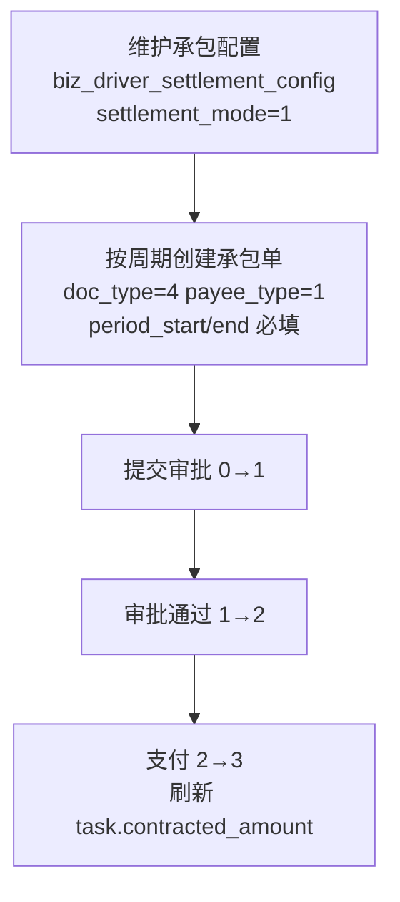

# 任务级承包单与司机承包结算

> **所属阶段**：阶段六 - 财务结算模块
>
> **文档状态**：已落地（`cadcc0c`）
>
> **创建日期**：2026-07-06
>
> **优先级**：高（自有车承包制司机结算闭环）
>
> **关联文档**：
>
> - 同目录 [00.模块总览](00.模块总览.md)
> - 同目录 [01.财务单据体系与业务单据联动设计](01.财务单据体系与业务单据联动设计.md)
> - 同目录 [05.任务级费用单演进与社会运力预付尾款](05.任务级费用单演进与社会运力预付尾款.md)
> - [02.资源管理模块/02.驾驶员管理](../02.资源管理模块/02.驾驶员管理.md)（结算模式字段落地方）

## 一、文档定位

本文补齐**承包单 `doc_type=4`** 与**司机承包结算**这一此前无文档覆盖的能力，包含：

1. 司机三种**结算模式**（承包制 / 统一管理 / 计件提成）的数据落点；
2. 承包制司机的**承包结算配置** `biz_driver_settlement_config`（承包周期、承包费基准、生效区间）；
3. 复用 [`biz_task_finance_doc`](../../../../backend/app/modules/client/models/task/task_finance_doc.py) 的承包单 `doc_type=4` 业务规则与校验；
4. 与既有预付/补款/结算单的边界。

> 承包单**完全复用**任务级费用单的通用基座（状态机、审计事件、锁定），故本文只描述承包单的**领域差异点**，通用规则见 `01` / `05`。

## 二、结算模式（`driver_operation.settlement_mode`）

自有驾驶员在 [`biz_driver_operation`](../../../../backend/app/modules/client/models/capacity/self_capacity/driver/driver_operation.py) 上通过 `settlement_mode` 声明结算方式：

| 值 | 结算模式 | 含义 | 是否需承包配置 |
|----|---------|------|--------------|
| 1 | 承包制 | 按周期支付固定承包费，司机自负部分成本 | ✅ 需 `biz_driver_settlement_config` |
| 2 | 统一管理各费用（默认） | 公司统一承担各项费用，按实际费用报销/结算 | 否 |
| 3 | 计件提成 | 按台数/趟次/吨位计件提成 | 否 |

> 迁移 `20260703_001` 已为 `biz_driver_operation` 增加 `settlement_mode SMALLINT NOT NULL DEFAULT 2`。存量司机默认「统一管理」，不影响既有结算。

## 三、司机承包结算配置（`biz_driver_settlement_config`）

承包制（`settlement_mode=1`）司机需维护承包合同参数，支持**一名司机多期承包合同**（历史合同保留，按生效区间取当期）。

### 3.1 表结构（已落地）

```python
# backend/app/modules/client/models/capacity/self_capacity/driver/driver_settlement_config.py
class DriverSettlementConfig(TenantModelBase):
    __tablename__ = "biz_driver_settlement_config"
    __table_args__ = (
        Index("idx_dsc_driver_effective", "driver_id", "effective_start"),
        {"comment": "驾驶员承包结算配置表"},
    )
    driver_id             # 关联驾驶员 ID
    period_type           # 承包周期类型 1-按月 2-按季 3-按年 4-自定义区间
    contract_base_amount  # 承包费基准（每周期金额，>= 0）Numeric(14,2)
    effective_start       # 承包合同生效起
    effective_end         # 承包合同生效止（空表示长期）
    status                # 状态 0-停用 1-生效（默认 1）
    remark                # 备注
```

> 该表由 runner Phase 1（`feature.required_tables`）自动建表，无需手写 versioned migration。

### 3.2 取当期合同规则

| 规则 | 说明 |
|------|------|
| 按生效区间匹配 | 结算发生时刻落在 `[effective_start, effective_end)` 内的、`status=1` 的记录为当期合同 |
| 长期合同 | `effective_end` 为空表示长期有效 |
| 多期重叠保护 | 同一司机同一时刻应至多一条生效合同；新增/编辑时应校验区间不重叠（业务层） |
| 历史保留 | 旧合同置 `status=0` 停用而非删除，保留审计与历史结算依据 |

## 四、承包单 `doc_type=4`

### 4.1 与其它单据类型对比

| doc_type | 单据 | 单号前缀 | 主表冗余字段 | 收款人 | 结算周期 |
|:--------:|------|:-------:|-------------|--------|---------|
| 1 | 预付单 | `FY` | `prepaid_amount` | 司机/承运商/其他 | 可空 |
| 2 | 补款单 | `FB` | `supplement_amount` | 司机/承运商/其他 | 可空 |
| 3 | 结算单 | `FS` | `settled_amount` | 司机/承运商/其他 | 可空 |
| **4** | **承包单** | **`FC`** | **`contracted_amount`** | **仅司机（`payee_type=1`）** | **必填** |

> 单号生成见 [`TaskFinanceService.generate_doc_no`](../../../../backend/app/modules/client/services/task/task_finance_service.py)：`FC + yyyymmdd + 4 位流水`。
> 主表冗余聚合：`task.contracted_amount = Σ(doc_type=4 且 status=3 的 actual_amount)`。

### 4.2 承包单业务校验（`_validate_contracted_payee`）

创建/编辑承包单时强制以下规则（[`task_finance_service._validate_contracted_payee`](../../../../backend/app/modules/client/services/task/task_finance_service.py)）：

| # | 校验 | 报错文案 |
|---|------|---------|
| 1 | 收款人必须为司机（`payee_type=1`） | 承包单收款人必须为司机（payeeType=1） |
| 2 | 必填 `period_start` / `period_end` | 承包单必须填写结算周期起止 |
| 3 | `period_start < period_end` | 承包单结算周期起必须早于周期止 |
| 4 | 与结算单互斥：同任务下不允许并存**未撤销**的结算单（`doc_type=3 且 status≠4`） | 该任务已存在有效结算单，承包单与结算单互斥，不可重复结算 |

> 互斥方向双保险：创建承包单时校验无有效结算单；创建结算单时同理（见 `05`）。避免同一任务既走"承包"又走"结算"造成重复付款。

### 4.3 状态机与生命周期

承包单与预付/补款/结算完全共享 `doc_kind='task_finance'` 的状态机，可用状态集 `{0,1,2,3,4}`：

```text
草稿(0) → 待审批(1) → 已审批(2) → 已支付(3)
   ↘ 已撤销(4)（未支付走 cancel_doc；已支付走 force_cancel，高权限）
```

- 支付走 `pay_doc`（2→3），现金/微信/支付宝（`pay_method ∈ {4,5,6}`）必须上传凭证；
- 承包单**不涉及** `is_final` 与任务锁定（仅最终结算单 `doc_type=3 is_final=1` 会锁定 `task.is_locked`）；
- 每次状态切换写 `biz_finance_doc_event` 审计事件。

## 五、典型业务流程



1. 为承包制司机建立承包结算配置（承包费基准、周期、生效区间）；
2. 每个结算周期按合同基准创建承包单，填结算周期起止；
3. 审批 → 支付，支付后 `task.contracted_amount` 累加；
4. 承包制司机通常不再单独走"结算单"，两者互斥。

## 六、权限与前端

沿用任务级费用单权限点（`operation:task:finance-doc:*`），承包单不新增独立权限前缀。前端在任务详情费用单区块的"新建"下拉中增加"承包单"类型项，并在选择时：

- 收款人选择器锁定为"司机"；
- 强制展示并校验结算周期起止；
- 若该任务已存在有效结算单，禁用承包单选项并提示互斥。

## 七、测试要点

1. `settlement_mode=1` 存量默认值：升级后旧司机 `settlement_mode=2`，不误判为承包制；
2. 承包单收款人非司机 → 422；
3. 承包单缺结算周期 / 起 ≥ 止 → 422；
4. 同任务已有有效结算单再建承包单 → 422（互斥）；
5. 承包单支付后 `task.contracted_amount` 正确累加，撤销后回退；
6. 现金/微信/支付宝支付承包单缺凭证 → 422；
7. 承包配置多期不重叠：重叠区间新增应被业务层拦截。

## 八、远期演进锚点

| 远期能力 | 预留 |
|---------|------|
| 承包费自动生成承包单 | 按 `biz_driver_settlement_config` 周期定时任务生成候选承包单 |
| 承包制盈亏核算 | 承包费 vs 实际运输成本（油/路桥/维修）对比报表 |
| 承包合同电子签 | `biz_driver_settlement_config` 增加合同附件/签署状态字段 |
| 计件提成模式落地 | `settlement_mode=3` 对应的计件规则表与提成单（独立设计） |
