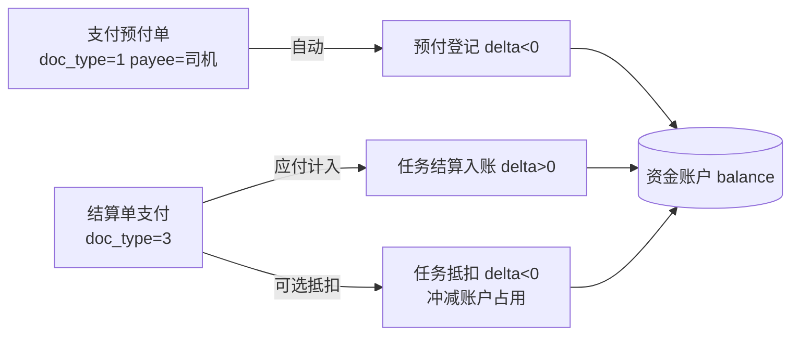

# 驾驶员资金账户（往来账与预付沉淀）

> **所属阶段**：阶段六 - 财务结算模块
>
> **文档状态**：已落地（第 1 期：账户本体 + 手工流水 + 司机端只读；第 2 期：**预付单支付/撤销联动已实现**，结算入账/抵扣仍为预留）
>
> **创建日期**：2026-07-06
>
> **最近更新**：2026-07-06（初稿：确立"资金账户 ≠ 收款账户"、双向往来账余额语义、两表模型、行锁原子记账）
>
> **优先级**：高（解决预付款沉淀、换/退司机资金无处记录的实际痛点）
>
> **关联文档**：
>
> - 同目录 [00.模块总览](00.模块总览.md)
> - 同目录 [01.财务单据体系与业务单据联动设计](01.财务单据体系与业务单据联动设计.md)
> - 同目录 [05.任务级费用单演进与社会运力预付尾款](05.任务级费用单演进与社会运力预付尾款.md)（预付单/结算单是本模块第 2 期的资金来源）
> - 同目录 [06.任务级承包单与司机承包结算](06.任务级承包单与司机承包结算.md)
> - [03.移动端/02.驾驶员H5端/03.财务与收入查询](../../03.移动端/02.驾驶员H5端/03.财务与收入查询.md)（司机端只读入口）
> - [02.企业端/02.资源管理模块/02.驾驶员管理](../02.资源管理模块/02.驾驶员管理.md)（账户挂在驾驶员详情下）
> - [10.系统管理模块/02.经营主体管理](../10.系统管理模块/02.经营主体管理.md)（账户 `enterprise_id` 由该需求真正贯通：账户按 `(driver_id, enterprise_id)` 定位）

## 一、文档定位与业务背景

### 1.1 要解决的真实场景

对公司**自有司机 / 外协司机**，实际业务中反复出现如下资金错位：

1. 任务派车前，公司把**预付款**（油费、路桥、生活费等）打给了司机，钱**已实际到司机账上**；
2. 任务受各种因素影响被迫**换司机**或**取消**，这笔已打的预付款**退回来很麻烦**（司机拖延、金额零散、跨月）；
3. 这笔"悬空的钱"当前系统**无处记录**，只能靠财务台账/微信记账，公司和司机之间**资金不透明、易扯皮**。

本模块提供一个**驾驶员资金账户（往来账户）**，把"公司与司机之间未核销的资金"沉淀为**可查、可抵扣、可对账**的台账：

- 预付款沉淀 → 记入账户，钱不必立刻退；
- **下次任务** → 直接用账户余额抵扣，不必重复打款；
- **财务** → 可随时对账户手工入账 / 出账 / 调整，每一笔留痕。

**核心目标：司机 ↔ 公司之间的资金透明、可追溯、可核销。**

### 1.2 与既有"驾驶员收款账户"的区别（重要）

系统里已存在 [`biz_driver_account`](../../../../backend/app/modules/client/models/capacity/self_capacity/driver/driver_account.py)（中文名"驾驶员账户结算表"），**它不是本模块的账户**。二者是不同概念，本模块**新建独立表**，不改动、不复用它：

| 维度 | 既有 `biz_driver_account`（收款账户） | 本模块 `biz_driver_fund_account`（资金账户） |
|------|--------------------------------------|-----------------------------------------------|
| 本质 | 司机的**收款方式**（银行卡 / 油气款 / 积分卡号） | 司机与公司之间的**资金往来台账 / 钱包** |
| 关键字段 | `account_no`（卡号）、`account_name`（户名） | `balance`（带符号净额）+ 流水 |
| 数量 | 一个司机可有多条（多张卡） | 一个司机 × 一个经营主体**唯一一账** |
| `balance` 字段 | 历史遗留、**未使用** | 核心字段，由流水驱动 |
| 用途 | 付款时选"打到哪张卡" | 记"公司欠司机 / 司机欠公司多少钱" |
| 变更方式 | 普通 CRUD | **只能通过流水**改变余额（不可直接改 balance） |

> 术语约定：下文"账户""资金账户"一律指本模块的 `biz_driver_fund_account`；提到收款卡时明确写"收款账户"。

## 二、余额语义（双向往来账）

### 2.1 符号约定（以司机视角记净资金）

`balance` 为**带符号金额**（`Numeric(14,2)`）：

| 余额 | 含义 | 会计对应 |
|------|------|---------|
| `balance > 0` | **公司欠司机**（应付未付、司机可提取） | 其他应付款—司机 |
| `balance = 0` | 两清 | — |
| `balance < 0` | **司机欠公司**（预付未核销、占用公司资金） | 其他应收款—司机 |

### 2.2 记账模型：每笔流水带符号 delta

- 每条流水记 `delta`（带符号），`balance_after = balance_before + delta`；
- `direction`（入 1 / 出 2）由 `delta` 符号派生，仅用于展示；
- 余额**只能被流水改变**，任何时刻 `balance == Σ delta`（对账恒等式）。

### 2.3 典型场景走查（验证方向自洽）

以"预付 → 任务取消 → 下次任务抵扣 → 结清"为例：

| # | 动作 | biz_type | delta | balance | 含义 |
|---|------|----------|-------|---------|------|
| 1 | 公司预付打款给司机 5000 | 预付登记 | −5000 | −5000 | 司机欠公司 5000（钱在司机处） |
| 2 | 任务取消、款退不回 | —（不产生流水） | 0 | −5000 | 资金沉淀维持 |
| 3 | 下次任务应付运费 6000 计入 | 人工入账 | +6000 | +1000 | 预付被抵扣，剩公司欠司机 1000 |
| 4 | 司机把多的 1000 退回 / 公司补付 1000 | 退款入账 / 人工出账 | 视方向 | 0 | 结清 |

> 说明：第 1 期第 3 步"应付运费计入"由财务**手工入账**完成；第 2 期由结算单支付自动写入（见 §六）。

## 三、数据模型（2 张新表，均租户库 `biz_*`）

### 3.1 `biz_driver_fund_account`（驾驶员资金账户）

一个司机 × 一个经营主体唯一一账。

| 字段 | 类型 | 约束 | 说明 |
|------|------|------|------|
| `id` | BigInt | PK | 主键 |
| `driver_id` | BigInt | NOT NULL, index | 关联 `biz_driver.id` |
| `enterprise_id` | BigInt | NULL | 所属经营主体 |
| `balance` | Numeric(14,2) | NOT NULL default 0 | 当前净余额（带符号，§二） |
| `frozen_amount` | Numeric(14,2) | NOT NULL default 0 | 冻结金额（第 2 期抵扣中/审批中占用，预留） |
| `total_in` | Numeric(16,2) | NOT NULL default 0 | 累计入账（对账用） |
| `total_out` | Numeric(16,2) | NOT NULL default 0 | 累计出账（对账用） |
| `status` | SmallInt | default 1 | 1-正常 0-冻结（冻结后禁止新流水） |
| `last_txn_at` | DateTime | NULL | 最近一笔流水时间（列表排序） |
| `remark` | Text | NULL | 备注 |

- 唯一索引：`uk_dfa_driver_ent (driver_id, enterprise_id)`
- 账户懒创建：首次查询/记账时若不存在则以零余额创建（避免空账户堆积）。

### 3.2 `biz_driver_fund_transaction`（资金流水，append-only）

**只增不改不删**，是余额的唯一事实来源。

| 字段 | 类型 | 约束 | 说明 |
|------|------|------|------|
| `id` | BigInt | PK | 主键 |
| `account_id` | BigInt | NOT NULL, index | 关联 `biz_driver_fund_account.id` |
| `driver_id` | BigInt | NOT NULL, index | 冗余，便于按司机查 |
| `enterprise_id` | BigInt | NULL | 冗余 |
| `txn_no` | VARCHAR(50) | UNIQUE, NOT NULL | 流水号（系统生成） |
| `biz_type` | SmallInt | NOT NULL | 业务类型（§3.3） |
| `direction` | SmallInt | NOT NULL | 1-入 2-出（由 delta 符号派生，冗余） |
| `amount` | Numeric(14,2) | NOT NULL | 金额（正数，展示用） |
| `delta` | Numeric(14,2) | NOT NULL | 带符号变动额（记账用，= ±amount） |
| `balance_before` | Numeric(14,2) | NOT NULL | 记账前余额快照 |
| `balance_after` | Numeric(14,2) | NOT NULL | 记账后余额快照 |
| `related_task_id` | BigInt | NULL | 关联 `biz_task.id`（第 2 期联动填） |
| `related_finance_doc_id` | BigInt | NULL | 关联 `biz_task_finance_doc.id`（第 2 期填） |
| `source` | SmallInt | default 1 | 来源 1-手工 2-系统联动（第 2 期） |
| `operator_id` | BigInt | NULL | 操作人 user_id |
| `operator_name` | VARCHAR(50) | NULL | 操作人姓名（冗余） |
| `voucher_url` | VARCHAR(500) | NULL | 凭证图片 URL（打款截图/签收单） |
| `remark` | VARCHAR(255) | NULL | 备注（手工流水建议必填） |

- 索引：`idx_dft_account (account_id)`、`idx_dft_driver (driver_id)`、`idx_dft_biz_type (biz_type)`、`idx_dft_created (created_at)`
- `created_at` 由基类提供；流水**无 `updated_at` 语义**（禁改）。

### 3.3 `biz_type` 业务类型枚举

| 值 | 名称 | 典型 delta 方向 | 期次 | 说明 |
|----|------|----------------|------|------|
| 1 | 预付登记 | − | 1 | 公司预付款已打给司机，登记为司机占用公司资金 |
| 2 | 退款入账 | + | 1 | 司机退还预付/多收款，账户回冲 |
| 3 | 人工入账 | + | 1 | 财务手工增加"公司欠司机"（如补录应付） |
| 4 | 人工出账 | − | 1 | 财务手工减少（如司机提现、线下已结） |
| 5 | 人工调整 | ± | 1 | 差错更正、期初导入（正负皆可，强制备注） |
| 6 | 任务抵扣 | − | 2 | 结算时用账户余额抵扣本次应付（系统联动） |
| 7 | 任务结算入账 | + | 2 | 任务应付运费计入账户（系统联动） |

> 第 1 期只开放 1~5（手工）；6~7 为第 2 期系统联动预留，本期 schema 已备但服务不产生。

## 四、功能范围（分期）

### 4.1 第 1 期（本次落地）

| # | 能力 | 端 | 说明 |
|---|------|----|------|
| 1 | 查看司机资金账户（余额、累计入/出、状态） | 企业端 | 不存在则懒创建返回零余额 |
| 2 | 资金流水台账（分页 + 按类型/时间/来源筛选） | 企业端 | append-only，倒序 |
| 3 | 手工记账（预付登记/退款入账/人工入账/出账/调整） | 企业端财务 | 行锁 + 原子写流水，留痕操作人 |
| 4 | 冻结 / 解冻账户 | 企业端财务 | 冻结后禁止新流水 |
| 5 | 我的账户（余额 + 流水）**只读** | 司机 H5 | 资金透明，仅看自己 |

### 4.2 第 2 期

| 能力 | 状态 | 依赖 |
|------|------|------|
| 支付任务**预付单**（`doc_type=1` payee=司机）自动写"预付登记"流水（delta<0） | ✅ 已实现 | `task_finance_service.pay_doc` → `DriverFundOrchestrator.on_finance_doc_paid` |
| 撤销预付单支付（撤销支付/强制撤销）自动**冲正**（delta>0） | ✅ 已实现 | `cancel_payment`/`force_cancel` → `on_finance_doc_payment_reversed` |
| 任务**结算单**支付自动"任务结算入账"，并可"任务抵扣"账户余额 | 预留 | 结算流程联动 + `frozen_amount` 启用 |
| 审批中心接入（大额入账/出账走审批） | 审批中心 |
| 司机 H5 发起提现/退款申请 | 司机端写能力 + 审批 |
| 账户对账报表、期末余额快照 | 报表模块 |

## 五、业务规则与一致性

### 5.1 记账一致性（强约束）

| 规则 | 说明 |
|------|------|
| **行锁记账** | 每次记账对账户行 `SELECT ... FOR UPDATE`，读余额→算新余额→插流水→更新账户，全部在**同一事务** |
| **余额=流水和** | 任何时刻 `account.balance == Σ transaction.delta`；`total_in/total_out` 同步累加 |
| **快照冗余** | 每条流水写 `balance_before/after`，即便未来算法变更也能回放 |
| **流水不可变** | 流水**禁止 update/delete**；写错只能反向冲正（新增一条相反 delta 的"人工调整"） |
| **金额校验** | `amount > 0`；`delta` 由 `biz_type` + 方向推导，禁止前端直接传 balance |
| **冻结拦截** | 账户 `status=0 冻结` 时拒绝任何新流水（除解冻本身） |
| **幂等** | 写操作预留 `idempotency_key`（请求头），远期启用，避免重复入账 |

### 5.2 权限与操作留痕

| 规则 | 说明 |
|------|------|
| 手工记账仅企业端**财务角色** | 权限点见 §八 |
| 每笔流水强制 `operator_id` + `operator_name` | 从登录态取 |
| 手工调整（`biz_type=5`）强制 `remark` ≥ 5 字 | 差错更正需说明 |
| 大额（阈值可配）出账建议上传凭证 | 第 1 期软提示，第 2 期接审批 |
| 写操作走 `@operation_log` | 与既有模块一致 |

### 5.3 与任务/费用单的边界

- **预付单**（`doc_type=1` 且 `payee_type=1` 司机）支付成功后**自动**写"预付登记"（`source=2 系统`，`delta<0`），撤销支付时自动冲正；均按 `related_finance_doc_id` **幂等**，重复回调不重复入账。
- **结算单/补款单**为即时对价（收付相抵），**不改往来账**，核销留给财务手工或后续"任务抵扣"联动，避免与实际现金流重复计账。
- 系统联动流水**绕过冻结校验**（数据完整性优先）；手工记账仍受冻结拦截。
- `related_task_id / related_finance_doc_id`：手工记账时可选填溯源；系统联动时自动回填。

## 六、第 2 期联动设计

> 预付单联动已落地（见下表 ✅）；结算入账 / 抵扣仍为预留方向。



| 联动点 | 状态 | 触发 | 写入流水 | 备注 |
|--------|------|------|---------|------|
| 预付单支付 | ✅ | `pay_doc` 且 `doc_type=1 payee_type=1` | `biz_type=1 预付登记`（delta<0） | `source=2 系统`，回填 `related_*`，幂等 |
| 撤销预付单支付 | ✅ | `cancel_payment` / `force_cancel` | `biz_type=2 退款入账/冲正`（delta>0） | 按原登记金额冲正，不物删原流水，幂等 |
| 结算单支付 | 预留 | `pay_doc` 且 `doc_type=3 payee_type=1` | `biz_type=7 任务结算入账`（delta>0） | 应付运费入账 |
| 结算时抵扣 | 预留 | 结算单选择"用账户余额抵扣" | `biz_type=6 任务抵扣`（delta<0） | 需先 `frozen_amount` 占用再核销 |

## 七、后端设计（沿用现有分层）

### 7.1 目录与文件

代码落在自有运力驾驶员目录下（与既有收款账户同级，命名以 `fund` 区分）：

```text
backend/app/modules/client/
├── models/capacity/self_capacity/driver/
│   ├── driver_fund_account.py          # 资金账户表
│   └── driver_fund_transaction.py      # 资金流水表
├── schemas/capacity/self_capacity/driver/
│   └── driver_fund_account.py          # 账户 + 流水的 In/Out schema
├── services/capacity/self_capacity/driver/
│   └── driver_fund_account_service.py  # 行锁 + 余额增减 + 原子写流水
└── api/capacity/self_capacity/driver/
    └── driver_fund_account.py          # 企业端财务 API（注册到 driver __init__ 路由聚合）
```

司机 H5 只读，复用 `backend/app/modules/driver/`：在 `api/finance.py` + `services/driver_finance_service.py` 增加账户/流水只读查询，经 `driver_context` 锁定当前企业内 `driver_id`，**硬过滤**只看自己。

### 7.2 企业端 API

前缀 `/api/client/capacity/self_capacity/driver`：

```text
GET   /{driver_id}/fund-account                       查账户（懒创建，返回余额/累计/状态）
GET   /{driver_id}/fund-account/transactions          流水台账（分页 + biz_type/时间/来源筛选）
POST  /{driver_id}/fund-account/transactions          财务记账（biz_type/amount/方向/remark/voucher/related_*）
PATCH /fund-account/{account_id}/status               冻结 / 解冻
```

### 7.3 司机 H5 API（只读）

前缀 `/api/driver/finance`：

```text
GET   /fund-account                                    我的账户余额
GET   /fund-account/transactions                       我的流水（分页）
```

### 7.4 记账服务核心伪代码

```python
async def post_transaction(db, driver_id, enterprise_id, payload, operator):
    account = await _get_or_create_locked(db, driver_id, enterprise_id)  # SELECT ... FOR UPDATE
    if account.status == 0:
        raise BizException("账户已冻结，禁止记账")
    delta = _resolve_delta(payload.biz_type, payload.amount)  # 由类型决定符号
    before = account.balance
    after = before + delta
    txn = DriverFundTransaction(
        account_id=account.id, driver_id=driver_id, txn_no=gen_txn_no(),
        biz_type=payload.biz_type, direction=1 if delta > 0 else 2,
        amount=payload.amount, delta=delta,
        balance_before=before, balance_after=after,
        related_task_id=payload.related_task_id,
        related_finance_doc_id=payload.related_finance_doc_id,
        source=1, operator_id=operator.id, operator_name=operator.name,
        voucher_url=payload.voucher_url, remark=payload.remark,
    )
    account.balance = after
    account.total_in += delta if delta > 0 else 0
    account.total_out += -delta if delta < 0 else 0
    account.last_txn_at = now()
    db.add(txn)
    await db.flush()  # 同一事务提交，保证 balance 与流水一致
```

## 八、菜单与权限

账户入口挂在**驾驶员管理**菜单（`id=342`）下的按钮权限点（`menu_type=1`），复用 `capacity_self_driver` feature，随 `client_menu.json` 快照 + `seed_client_menus.py` 落库。

按钮权限点前缀沿用驾驶员菜单既有前缀 `capacity:self_capacity:driver:`：

| 权限点 | menu id | 能力 |
|--------|---------|------|
| `capacity:self_capacity:driver:fund-account` | 820 | 查看账户与流水（列表操作入口） |
| `capacity:self_capacity:driver:fund-post` | 821 | 手工入账 / 出账 / 调整（记账） |
| `capacity:self_capacity:driver:fund-freeze` | 822 | 冻结 / 解冻账户 |

前端通过 `BtnItems` 的 `permission` 字段与 `usePermission().hasPermission` 双重控制入口与按钮显隐。

司机 H5 端无独立权限点，登录态即可看**自己**账户（硬过滤 `ctx.driver_id`）。

## 九、前端设计

### 9.1 企业端（驾驶员详情 → 资金账户页签）

- **余额卡片**：净余额（正绿负红 + "公司欠司机 / 司机欠公司"文案）、累计入账、累计出账、账户状态。
- **记账弹窗**：业务类型（预付登记/退款入账/人工入账/出账/调整）、金额、方向随类型自动、备注、凭证上传、可选关联任务。
- **流水表格**：时间、流水号、类型、方向、金额、变动后余额、操作人、备注、凭证；支持按类型/时间/来源筛选、导出。
- **冻结/解冻**按钮（高权限）。

### 9.2 司机 H5（财务模块 → 我的账户）

- 余额展示（带"公司欠你 / 你欠公司" friendly 文案）+ 流水列表（Vant 下拉分页），**纯只读**。

## 十、数据库迁移

新增整表，走租户库 runner 自动建表（Phase 1），**不手写 versioned migration**：

1. 新增两个 ORM 模型（`biz_driver_fund_account` / `biz_driver_fund_transaction`）；
2. `python -m scripts.migration.autogen tenant --name "driver_fund_account"` 刷新 `snapshots/tenant_schema.json`；
3. 把两张表名加入 `capacity_self_driver` feature 的 `required_tables`（platform_sync）；
4. `python -m scripts.migration.check` 确认无 drift。

遵循 [database-migration 规范](../../../../backend/scripts/migration/README.md)。

## 十一、测试要点

| # | 场景 | 期望 |
|---|------|------|
| 1 | 首次查账户 | 懒创建，余额 0，状态正常 |
| 2 | 预付登记 5000 | balance −5000，流水 delta=−5000，direction=2 |
| 3 | 连续多笔记账 | `balance == Σ delta`，每条 `balance_after` 正确 |
| 4 | 人工调整缺备注 | 422（`biz_type=5` 强制 remark ≥ 5 字） |
| 5 | 金额 ≤ 0 | 422 |
| 6 | 冻结账户后记账 | 拒绝 |
| 7 | 并发两笔记账 | 行锁串行，余额不错乱 |
| 8 | 司机 H5 查他人账户 | 只返回自己（硬过滤），越权取不到 |
| 9 | 流水 update/delete | 无此接口；冲正只能新增反向流水 |
| 10 | `total_in/total_out` | 与所有正/负 delta 累计一致 |
| 11 | 预付单支付联动 | 自动写 `biz_type=1`（delta<0），幂等（重复回调不重复入账） |
| 12 | 撤销预付单支付 | 自动按原额冲正（delta>0），幂等 |

> 已落地测试：`backend/tests/test_driver_fund_account.py`（`_resolve_delta` 纯逻辑 + 真实租户库事务回滚集成，覆盖上表 1/2/3/4/5/6/10 及联动 11/12 的幂等）。运行：`cd backend && python -m pytest tests/test_driver_fund_account.py`。

## 十二、远期演进锚点

| 远期能力 | 本文预留 |
|---------|---------|
| 与预付/结算单自动联动 | `related_task_id/related_finance_doc_id`、`source`、`biz_type` 6/7 |
| 抵扣占用 | `frozen_amount` 字段已备 |
| 审批接入 | 记账动作可挂审批中心 |
| 司机端提现/退款申请 | H5 现为只读，预留写入口 |
| 幂等 | `idempotency_key` 请求头 |
| 期末余额快照 / 对账报表 | 由 `balance_after` 快照回放 |
| 油卡/油气款专项账户 | 可扩展 `account_kind` 区分资金池类型 |
