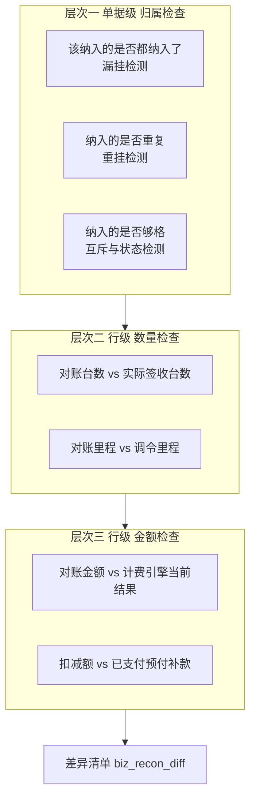
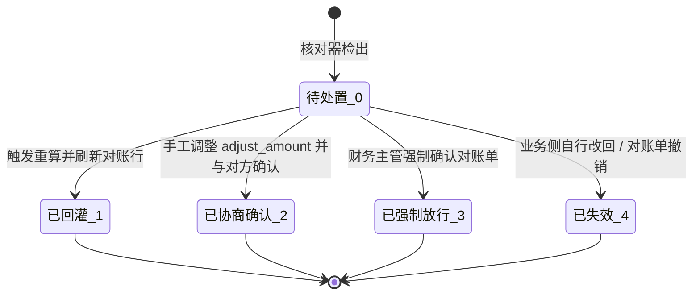

# 运输单与财务单一致性核对

> **所属阶段**：阶段六 - 财务结算模块
>
> **文档状态**：第 1 期公共底座已落地（核对器、差异表、linkage、通用服务模板）；两侧对账 service 的 `line_detector` 待第 2/3 期
>
> **创建日期**：2026-08-13
>
> **最近更新**：2026-08-13（编码回写：主表计数改 3 列并新增 `diff_forced_count`、差异表新增 `is_manual`、强制确认只放行阻塞级、§6.1 补 `ReconBinding` 注册机制）
>
> **优先级**：高（第 1 期公共底座，客户侧与承运商侧对账共用）
>
> **关联文档**：
>
> - 同目录 [00.模块总览](00.模块总览.md)（§3.3 新增闸口、§6.3 事件类型 17~20）
> - 同目录 [01.财务单据体系与业务单据联动设计](01.财务单据体系与业务单据联动设计.md)（快照原则、桥接表骨架、审计事件表）
> - 同目录 [02.客户侧-对账与结算与发票](02.客户侧-对账与结算与发票.md)（§3.6 差异单机制由本文正式落地）
> - 同目录 [03.承运商侧-对账与结算](03.承运商侧-对账与结算.md)（§6 与任务级结算单的冲突避免由本文统一收口）
> - 同目录 [08.岗位视角与工作台设计](08.岗位视角与工作台设计.md)（§3.2 对账工作台是本文能力的唯一 UI 入口）
> - [04.计费引擎模块/02.运单合同运费自动计算系统设计文档](../04.计费引擎模块/02.运单合同运费自动计算系统设计文档.md)（回灌重算的下游）

## 一、文档定位

### 1.1 要解决的问题

对账岗每天回答的其实是一个问题：**这张财务单上写的钱，和实际拉了多少车、什么时候签收、按什么价算，是不是一回事。**

现有设计已经有「快照」原则（对账行写入时冻结运输事实，业务侧逆向不回灌），但只解决了「金额不漂移」，没有解决三件事：

| # | 缺口 | 后果 |
|---|------|------|
| 1 | 快照写入后业务侧改了数据，系统不知道 | 对账单还是旧数字，与客户/承运商核对时才发现，返工 |
| 2 | 差异只能靠 `adjust_amount` 硬改一个数 | 改了多少、为什么改、对方是否认可，全靠 `adjust_reason` 一句话，无法跟踪未决差异 |
| 3 | 「该进对账的没进」「不该进的进了」没有检查 | 漏结算直接损失收入；重复结算导致多付，且与任务级结算单撞账 |

`02` §3.6 给了「差异单机制（轻量）」的方向，但只有 4 条描述、没有表结构与状态。本文把它正式落地，并扩展到承运商侧。

### 1.2 设计边界

| 做 | 不做 |
|---|------|
| 检测差异、留痕差异、提供处置入口 | 自动判断谁对谁错、自动改金额 |
| 触发计费引擎重算（调用方） | 重算本身（属计费引擎模块） |
| 客户侧 + 承运商侧对账单的核对 | 任务级费用单的核对（1:1 关联，无聚合，不需要） |
| 与业务事实的比对 | 与银行流水的比对（属 `10` 核销范畴） |

## 二、核对的三个层次



三层是**递进**的：归属错了，数量金额比对没有意义。核对器按此顺序短路执行，第一层有阻塞级问题时不继续算下面两层。

## 三、快照与脏标记

### 3.1 快照字段（已有，本文只做汇总）

对账行写入时冻结运输事实，各侧字段已在 `02` / `03` 定义：

| 侧 | 桥接表 | 已有快照字段 |
|---|-------|------------|
| 客户 | `biz_customer_recon_waybill_link` | `freight_amount_snapshot`、`signed_quantity_snapshot`、`locked_snapshot_at` |
| 承运商 | `biz_carrier_recon_task_link` | `carrier_cost_amount_snapshot`、`signed_quantity_snapshot`、`prepaid_offset_amount`、`locked_snapshot_at` |

### 3.2 新增：脏标记字段

**桥接表新增 3 列**（两侧同构）：

| 字段 | 类型 | 说明 |
|------|------|------|
| `recon_dirty` | TinyInt，默认 0 | 1 = 快照与业务侧当前事实已不一致，需重新核对 |
| `dirty_reason` | VARCHAR(255) | 置脏原因，由闸口写入，如「签收台数由 8 变为 7」 |
| `dirty_at` | DateTime | 置脏时间 |

**对账单主表新增 3 列冗余**（避免列表页对桥接表做 count）：

| 字段 | 类型 | 说明 |
|------|------|------|
| `dirty_line_count` | Int，默认 0 | 脏行数，> 0 时列表页与工作台高亮 |
| `diff_open_count` | Int，默认 0 | 未处置差异条数（`biz_recon_diff.status=0`） |
| `diff_forced_count` | Int，默认 0 | 已强制放行差异条数（`status=3`），> 0 时列表页显示「带未决差异」徽章 |

三列统一由 `ConsistencyChecker._refresh_counters` 维护，各侧对账 service 不自己算。

> **为什么要第三列**：初版设计是「强制确认后让 `diff_open_count` 保留原值」来撑起徽章，但那等于故意让计数字段与事实不一致，后续任何一次刷新都会把它抹平。改为单独一列记录强制放行数：徽章有据可依，`diff_open_count` 始终等于真实待处置数。

### 3.3 置脏闸口

业务侧发生下列改动时，把受影响的对账行置脏。**只置脏、不改金额**，符合快照不漂移原则。

| # | 业务事件 | 影响范围 | 置脏原因文案 |
|---|---------|---------|------------|
| 1 | 挂接行签收台数变化（`item.signed_qty` 聚合变化） | 该运单/任务所在的所有非终态对账行 | 签收台数由 X 变为 Y |
| 2 | 运单 `freight_amount` 变化（含计费引擎重算回填） | 该运单所在客户对账行 | 运费金额由 X 变为 Y |
| 3 | `task.carrier_cost_amount` 变化 | 该任务所在承运商对账行 | 承运成本由 X 变为 Y |
| 4 | 运单/任务状态逆向（5→4 撤销签收等） | 对应对账行 | 业务单据已回退至「未签收」 |
| 5 | 挂接行增删（`biz_task_waybill_item`） | 该任务与相关运单的对账行 | 任务挂接已变更 |
| 6 | 调令里程变化（`mileage`） | 按公里计费的对账行 | 调令里程由 X 变为 Y |
| 7 | 任务级预付/补款单支付或撤销 | 该任务所在承运商对账行 | 已支付预付补款金额由 X 变为 Y |

生效范围限定：只对 `status ∈ {0 草稿, 2 已确认}` 的对账单置脏。已结清（3）或已撤销（4）不再置脏——钱已经动过，差异要走「解锁结清」重新走一遍流程。

实现位置：`services/finance/recon/consistency_checker.py` 暴露 `mark_dirty_by_waybill(wb_id, reason)` / `mark_dirty_by_task(task_id, reason)`，由业务侧 service 在对应变更处调用；调用点通过 `linkage/waybill_to_finance.py` 与 `linkage/task_to_finance.py` 中转，业务模块不直接依赖财务内部实现。

> **为什么不用数据库触发器**：置脏原因需要业务语义（「由 8 变为 7」），触发器拿不到上下文；且本项目一租户一库，触发器维护成本高。

## 四、四类差异检测

### 4.1 检测规则总表

| 类 | `diff_type` | 差异名 | 检测口径 | 严重度 |
|---|:----------:|-------|---------|:-----:|
| 归属 | 1 | 漏挂 | 满足候选条件但未挂入任何非撤销对账单，且业务完成时间在对账周期内 | 提示 |
| 归属 | 2 | 重挂 | 同一 `waybill_id` / `task_id` 出现在两张非撤销对账单中 | 阻塞 |
| 归属 | 3 | 资格不符 | 已挂入但不满足纳入条件（详见 §4.2） | 阻塞 |
| 数量 | 4 | 台数不符 | `signed_quantity_snapshot ≠` 当前签收台数聚合 | 阻塞 |
| 数量 | 5 | 里程不符 | 按公里计费行的 `quantity ≠` 当前调令里程 | 提示 |
| 金额 | 6 | 金额不符 | 行金额 ≠ 计费引擎当前结果（客户侧比 `WaybillFreightResult.total_amount`，承运商侧比 `CarrierFreightResult.total_amount`） | 阻塞 |
| 金额 | 7 | 扣减不符 | 承运商侧 `prepaid_offset_amount ≠` 当前该任务已支付预付/补款合计 | 阻塞 |
| 状态 | 8 | 状态回退 | 关联业务单据当前状态 < 完成态（运单 `<5` / 任务 `<5`） | 阻塞 |

严重度语义：

- **阻塞**：对账单 `0 → 2 确认` 被拒绝，除非走强制确认（§5.3）
- **提示**：不阻塞确认，只在工作台与详情页提示

### 4.2 资格不符（`diff_type=3`）的具体条件

客户侧，运单必须满足：

| 条件 | 不满足则 |
|------|---------|
| `status = 5` 已完成 | 资格不符 |
| `is_locked = 0` | 资格不符（已被其他结算单锁定） |
| `customer_id` = 对账单的 `customer_id` | 资格不符（跨客户混挂） |

承运商侧，任务必须满足：

| 条件 | 不满足则 | 依据 |
|------|---------|------|
| `status = 5` 已交车 | 资格不符 | `03` §3.4 |
| `carrier_type = 2` 承运商 | 资格不符（自有车应走司机工资单，社会运力应走任务级预付尾款） | `03` §3.5 |
| `carrier_id` = 对账单的 `carrier_id` | 资格不符 | `03` §3.5 |
| 不存在已支付的任务级最终结算单（`doc_type=3 is_final=1 status=3`） | **互斥冲突** | `03` §六 |

### 4.3 互斥校验统一收口

`03` §6 已定义「任务级最终结算单」与「承运商对账」的互斥规则，但校验点分散在候选过滤、对账单加行、费用单创建三处。本文把三处统一到核对器的同一个方法：

```python
# services/finance/recon/consistency_checker.py
def assert_task_settle_exclusive(db, task_id: int, *, intent: str) -> None:
    """任务级最终结算单 与 承运商对账 二选一。

    intent='carrier_recon'：要把 task 挂入承运商对账单
        → 若存在已支付的最终结算单，抛 BizException
    intent='final_settle'：要为 task 创建最终结算单
        → 若 task.is_recon_bound=1，抛 BizException
    """
```

三个调用点：

| 调用方 | 传入 `intent` |
|-------|--------------|
| `carrier_recon_service.add_task` / 候选池过滤 | `carrier_recon` |
| `task_finance_service.create_doc`（`doc_type=3 is_final=1`） | `final_settle` |
| 核对器自身的 `diff_type=3` 检测 | 内部复用 |

> 收口的价值：规则只有一份实现。此前三处各写一遍，任何一处漏改就会出现「A 路径拦住、B 路径放过」的账务事故。

### 4.4 检测的执行时机

| 时机 | 范围 | 阻塞性 |
|------|------|-------|
| 对账工作台点「重新核对」 | 指定对账单全部行 | 无（只出报告） |
| 对账单 `0 → 2 确认` 前 | 该对账单全部行 | 有阻塞级差异则拒绝 |
| 候选池查询时 | 候选范围内的漏挂/重挂 | 无（只提示） |
| 定时任务（每日一次，可关） | 全部 `status ∈ {0,2}` 对账单 | 无，只置脏 + 生成差异记录 |

定时任务开关走环境变量 `RECON_CHECK_WORKER_ENABLED`（默认关），周期 `RECON_CHECK_INTERVAL`。首期不建独立 worker 进程，挂在已有的调度 worker 内即可，避免为一个低频任务多起一个容器。

## 五、差异记录与三种处置

### 5.1 `biz_recon_diff`（差异记录表）

不继承 `FinanceDocBaseMixin`——差异不是单据，没有金额审批与支付流程，只是一条待办事项。

| 字段 | 类型 | 说明 |
|------|------|------|
| `recon_kind` | VARCHAR(20) | 对账单大类：`customer_recon` / `carrier_recon` |
| `recon_id` | BigInt | 对账单 ID（漏挂类可为空，此时尚无对账单） |
| `link_id` | BigInt，可空 | 对账行 ID（桥接表主键；漏挂/重挂类为空） |
| `biz_doc_type` | TinyInt | 关联业务单据类型 1-运单 2-任务单 |
| `biz_doc_id` | BigInt | 业务单据 ID |
| `biz_doc_no` | VARCHAR(50) | 业务单号（冗余，便于列表展示与单据软删后追溯） |
| `diff_type` | TinyInt | 差异类型 1~8，见 §4.1 |
| `severity` | TinyInt | 1-提示 2-阻塞 |
| `expected_value` | VARCHAR(100) | 财务侧快照值（对账行上写的） |
| `actual_value` | VARCHAR(100) | 业务侧当前值 |
| `diff_amount` | Numeric(14,2)，可空 | 金额类差异的差额（`actual - expected`，可负） |
| `detected_at` | DateTime | 检出时间 |
| `detected_by` | BigInt，可空 | 检出人（定时任务为空） |
| `is_manual` | TinyInt，默认 0 | 0-核对器检出 1-对账岗手工登记（`finance:recon-wb:raise-diff`） |
| `status` | TinyInt，默认 0 | 0-待处置 1-已回灌 2-已协商确认 3-已强制放行 4-已失效 |
| `resolution` | VARCHAR(255) | 处置说明 |
| `resolved_by` / `resolved_at` | BigInt / DateTime | 处置人与时间 |
| 唯一约束 | `(recon_kind, recon_id, biz_doc_id, diff_type, status)` 中 `status=0` 部分唯一 | 同一差异未处置时不重复生成 |
| 索引 | `(recon_kind, recon_id)`、`(status, severity)`、`(biz_doc_type, biz_doc_id)` | 列表与工作台查询 |

> **部分唯一索引的实现**：MySQL 不支持 partial index。落地方式是加冗余列 `dedup_key`（`status=0` 时写 `recon_kind:recon_id:biz_doc_id:diff_type`，处置后置 NULL），对 `dedup_key` 建唯一索引。NULL 值在 MySQL 唯一索引中不参与冲突判定，天然满足需求。

> **`is_manual` 的必要性**：核对器每轮会把「本轮未再检出」的待处置差异自动置失效（§5.4）。人工登记的差异不是核对器产出的，没检出不代表已解决，必须排除在自动失效之外，否则对账岗刚记的待办下一次核对就被清掉。

> `biz_doc_type + biz_doc_id` 这里是**有意**使用的弱关联，与 `01` §4.4「不用多态外键」不冲突：那条禁令针对的是**财务单据与业务单据的主关联**（需要强外键做报表 join），差异记录是审计辅助表，不参与金额计算与对账 join，用弱关联换「一张表覆盖运单与任务两侧」是划算的。

### 5.2 状态流转



### 5.3 三种处置路径

#### 路径一：回灌重算（`status → 1`）

适用：差异根因是计费引擎漏算/错算，系统值不对。

1. 对账工作台点「回灌重算」，调用计费引擎的重算入口（客户侧 `WaybillFreightCalc`，承运商侧 `CarrierFreightCalc`）；
2. 重算是**异步**的（既有实现走 `*_calc_task` 队列 + worker），差异记录先置「重算中」标记 `resolution='已提交重算，等待计费引擎回写'`，仍保持 `status=0`；
3. 计费引擎回写后触发置脏闸口 #2 / #3，核对器重新比对：一致则差异 `status=1 已回灌`、行快照刷新为新值；仍不一致则更新 `actual_value` 保持待处置；
4. 写事件 20 `RECALC_REFRESH`。

**前置约束**：`waybill.is_locked=1` 或 `task.is_locked=1` 时禁止重算（计费引擎既有约束），此时只能走路径二或三。

#### 路径二：协商确认（`status → 2`）

适用：系统值与实际都没错，是商务口径差异（客户只认 7 台、临时加收装卸费等）。

1. 在对账行直接改 `adjust_amount` + `adjust_reason`（`02` §3.6 已有机制）；
2. 调整额超阈值触发业务主管审批：客户侧 > ¥5000（`02` §3.5）、承运商侧 > ¥3000（`03` §3.5）；
3. 差异记录置 `status=2`，`resolution` 记录协商结论；
4. 写事件 16 `ADJUST`（金额调整）+ 事件 18 `DIFF_CLOSED`（差异关闭）。

#### 路径三：强制确认（`status → 3`）

适用：差异暂时无法定论，但账期到了必须先出对账单。

1. 仅**财务主管**（`finance:cust-recon:unlock` 同级权限）可执行；
2. 必填理由，长度 ≥ 10 字；
3. **只放行阻塞级**差异（`severity=2`）并置 `status=3`；提示级本来就不阻塞确认，留着继续提醒；
4. 对账单允许 `0 → 2 确认`，主表 `diff_forced_count` > 0，详情页与列表页持续显示「带未决差异」徽章；
5. 写事件 19 `FORCE_CONFIRM`，`payload_snapshot` 记录被放行的差异 id 列表与各自金额；
6. 无阻塞级差异时调用直接报错（「直接确认即可，无需强制确认」），避免留下无意义的强制确认痕迹。

> 强制确认**不清除**差异痕迹。这是与「协商确认」的关键区别：协商确认表示账已对平，强制确认表示账没对平但先走流程，后者必须在报表里可筛出来——按 `status=3` 筛即可。

### 5.4 失效（`status → 4`）

两种情况自动置失效，无需人工：对账单被撤销（`status=4`）时其名下全部待处置差异失效；业务侧数据被改回与快照一致时，核对器下次运行自动失效。

## 六、服务层设计

### 6.1 两侧共用的实现方式：`ReconBinding` 注册

客户侧与承运商侧的表不同（`biz_customer_recon_waybill_link` vs `biz_carrier_recon_task_link`），但**脏标记列名与主表计数列名两侧同构**。核对器因此不为每侧各写一份，而是让各侧对账 service 在模块导入时注册自己的表结构：

```python
@dataclass(frozen=True)
class ReconBinding:
    recon_kind: str          # customer_recon / carrier_recon
    biz_doc_type: int        # 1 运单 / 2 任务单
    recon_model: type        # 对账主表 ORM
    link_model: type         # 桥接表 ORM
    link_recon_fk: str       # 桥接表指向主表的列名，如 "recon_id"
    link_biz_fk: str         # 桥接表指向业务单的列名，如 "waybill_id"
    line_detector: LineDetector | None = None    # 侧特有的数量/金额比对
    orphan_detector: OrphanDetector | None = None  # 侧特有的漏挂规则
```

分工：**通用层做归属检查与差异生命周期，侧特有层做数量与金额比对。**重挂（`diff_type=2`）两侧算法一致，放通用层；台数/里程/金额/扣减依赖各侧业务事实，由 `line_detector` 提供。

绑定未注册时（对应对账表还没落地），置脏类方法**安全空转返回 0**，因此业务侧调用点可以先于对账表接入，不用等。

### 6.2 `consistency_checker.py` 接口

```python
class ConsistencyChecker:
    # ---- 绑定 ----
    register_binding(binding) / binding_or_none(kind) / binding_or_raise(kind)

    # ---- 「已挂接」口径（候选池排除 / 重挂检测 / 编辑拦截共用一份定义）----
    bound_biz_ids(kind, *, exclude_recon_id=None)          # 子查询
    await is_biz_doc_bound(db, kind, biz_doc_id)           # 布尔判定

    # ---- 核对 ----
    await check_recon(db, *, recon_kind, recon_id, persist=True, operator_id=None)
        -> ReconCheckReport
    await detect_orphans(db, *, recon_kind, **filters)

    # ---- 置脏 ----
    await mark_dirty_by_waybill(db, wb_id, reason) -> int
    await mark_dirty_by_task(db, task_id, reason) -> int

    # ---- 差异生命周期 ----
    await record_diffs(db, *, recon_kind, recon_id, candidates, operator_id=None)
    await raise_manual_diff(db, *, recon_kind, recon_id, candidate, operator_id)
    await resolve_diff(db, diff_id, *, status, resolution, operator_id)
    await assert_confirmable(db, *, recon_kind, recon_id)
    await force_confirm(db, *, recon_kind, recon_id, reason, operator_id) -> int
    await invalidate_by_recon(db, *, recon_kind, recon_id, reason)

    # ---- 互斥（三处调用同一实现，见 §4.3）----
    await assert_task_settle_exclusive(db, task_id, *, intent)
```

`persist=True` 时写入 `biz_recon_diff`、自动失效本轮未检出的旧差异、刷新主表三个计数列；`persist=False` 只返回不落库（前端「试算」与确认前预检用）。

`ReconCheckReport` 结构：

```python
@dataclass
class ReconCheckReport:
    recon_id: int
    recon_kind: str
    checked_lines: int
    blocking_count: int      # 阻塞级差异数
    warning_count: int       # 提示级差异数
    dirty_lines: int
    diffs: list[DiffCandidate]
    checked_at: datetime
    passed: bool             # 无任何差异
```

### 6.2 与两侧对账 service 的分工

| 职责 | 归属 |
|------|------|
| 候选池生成、对账单 CRUD、行增删改、状态切换 | `customer_recon_service` / `carrier_recon_service` |
| 一致性比对、差异生成与处置、置脏、互斥校验 | `ConsistencyChecker` |
| 计费引擎重算触发 | 对账 service 调计费引擎，核对器只负责判定"需要重算" |

核对器**不写**对账行的金额字段，只写 `recon_dirty` 三列与差异表。金额刷新由对账 service 在回灌成功后执行，保持「谁的表谁来写」。

### 6.3 并发与性能

| 场景 | 策略 |
|------|------|
| 核对时业务侧并发改动 | 核对是只读比对 + 差异表写入，不锁业务行；差异可能瞬时过期，由下次核对自愈 |
| 大对账单（500+ 行） | 按 `link_id` 分批 200 条读取；计费结果批量预取（一次 `IN` 查询），避免 N+1 |
| 定时全量核对 | 按对账单逐张处理，每张一个短事务，失败不影响其他张 |
| 确认时预检 | `assert_confirmable` 直接查 `biz_recon_diff` 计数，不重跑全量比对（避免确认动作变慢） |

## 七、API 设计

```text
# 核对与差异（挂在对账单下，两侧同构）
POST   /api/client/finance/customer-recon/{id}/check          触发核对，返回报告
GET    /api/client/finance/customer-recon/{id}/diffs          该对账单差异列表
POST   /api/client/finance/customer-recon/{id}/force-confirm  强制确认（高权限）
POST   /api/client/finance/customer-recon/{id}/recalc         触发计费引擎回灌重算
GET    /api/client/finance/customer-recon/orphans             漏挂检测（按客户+周期）

POST   /api/client/finance/carrier-recon/{id}/check
GET    /api/client/finance/carrier-recon/{id}/diffs
POST   /api/client/finance/carrier-recon/{id}/force-confirm
POST   /api/client/finance/carrier-recon/{id}/recalc
GET    /api/client/finance/carrier-recon/orphans

# 差异处置（跨对账单，工作台用）
GET    /api/client/finance/recon-diff                         差异总列表 + 多维筛选
POST   /api/client/finance/recon-diff                         手工登记差异（is_manual=1）
POST   /api/client/finance/recon-diff/{id}/resolve             协商确认（写 resolution）
GET    /api/client/finance/recon-workbench/summary             工作台 KPI + Tab 计数
```

> 路径遵循 `01` §5.3 的 `/api/finance/<doc-kind>/...` 规范；实际注册前缀为 `/api/client` + `/finance/...`，与既有 `client` 路由约定一致。

## 八、前端要点

| 项 | 要求 |
|---|------|
| 差异展示 | 对账单详情抽屉增加「一致性核对」区块：顶部核对结论条（`已核对通过` / `N 项阻塞、M 项提示`），下方差异表 |
| 行级高亮 | 对账行表格中脏行加左侧色条 + `dirty_reason` tooltip；有差异的行金额单元格标红并显示期望值/实际值对比 |
| 对比呈现 | 差异行用「快照值 → 当前值」两列并排，不要挤在一个单元格里 |
| 确认拦截 | 点「提交确认」时若有阻塞差异，弹窗列出差异明细并提供「去处理」与「申请强制确认」两个出口，不要只弹一句失败提示 |
| 强制确认 | 独立弹窗，必填理由（≥10 字），二次确认，明确文案「本次将带 N 项未决差异确认对账单，差异记录会保留并在报表中标记」 |
| 提示语 | 遵循 [humanized-ux-copy](../../../../.cursor/rules/humanized-ux-copy.mdc)：「正在核对运输数据，请稍候…」「核对完成，发现 3 项需要处理」「已提交重算，计费结果回写后会自动重新核对」 |

## 九、后端代码蓝图

### 9.1 新建文件

| 文件 | 内容 | 期次 | 状态 |
|------|------|:---:|------|
| `models/finance/recon_diff.py` | `ReconDiff`（`biz_recon_diff`） | 1 | ✅ |
| `services/finance/recon/__init__.py` | 包初始化 | 1 | ✅ |
| `services/finance/recon/consistency_checker.py` | `ConsistencyChecker` + `ReconBinding` + `ReconCheckReport` + `DiffCandidate` | 1 | ✅ |
| `services/finance/recon/diff_constants.py` | `ReconKind` / `BizDocType` / `DiffType` / `DiffSeverity` / `DiffStatus` | 1 | ✅ |
| `schemas/finance/recon_diff.py` | DTO | 1 | ✅ |
| `api/finance/recon_diff.py` | 差异列表与处置 API | 2 | 🕒 |

第 1 期同时落地的公共底座（不属本文范围但供本文调用）：

| 文件 | 内容 | 状态 |
|------|------|------|
| `services/finance/base/finance_doc_service.py` | 通用单据动作模板（单号/状态机/事件/按钮位） | ✅ |
| `services/finance/linkage/waybill_to_finance.py` | 客户侧候选池、签收台数口径、编辑拦截、置脏文案 | ✅ |
| `services/finance/linkage/task_to_finance.py` | 应付侧候选池、扣减额口径、互斥、置脏文案 | ✅ |

### 9.2 现有文件改动

置脏与拦截的**函数已就绪**，业务侧调用点按期接入（改业务代码要等对账表落地才有效果，提前接入只会空转）：

| 文件 | 改动 | 期次 |
|------|------|:---:|
| `services/waybill/waybill_service.py` | 运费/台数/状态变更处调用 `WaybillToFinance.on_*_changed`；改删前调 `assert_unbound` | 2 |
| `services/task/task_service.py` | 承运成本/挂接/状态/里程变更处调用 `TaskToFinance.on_*_changed` | 3 |
| `services/task/task_finance_service.py` | `create_doc` 建最终结算单前调 `assert_task_settle_exclusive(intent='final_settle')`；预付/补款支付撤销后调 `on_prepay_changed` | 3 |
| `services/billing/*_calc_service.py` 回写处 | 计费结果回写后经 linkage 中转置脏（不直接依赖财务模块） | 2 |

### 9.3 数据库迁移

| 表 | 迁移 | 期次 | 状态 |
|----|------|:---:|------|
| `biz_recon_diff` | 新建（runner Phase 1 按 feature `finance_reconciliation` 的 `required_tables` 自动建表） | 1 | ✅ 已应用 |
| `biz_customer_recon_waybill_link` | 建表时直接含 `recon_dirty` / `dirty_reason` / `dirty_at` | 2 | 🕒 |
| `biz_customer_recon` | 建表时直接含 `dirty_line_count` / `diff_open_count` / `diff_forced_count` | 2 | 🕒 |
| `biz_carrier_recon_task_link` | 同上 | 3 | 🕒 |
| `biz_carrier_recon` | 同上 | 3 | 🕒 |

> 脏标记字段在建表时一次带上，不做二次 ALTER：`biz_recon_diff` 在第 1 期先建（核对器需要），两侧对账表在各自期次建表时已包含这些列。
>
> 第 1 期同时改了 `biz_finance_doc_event.event_type` 的列注释（补 16~20），迁移文件 `20260813_002_recon_diff_table.py`。

## 十、测试要点

### 10.1 置脏

1. **签收台数变化置脏**：对账单挂入运单 A（快照 8 台）→ 业务侧撤销 1 台签收 → 该行 `recon_dirty=1`、`dirty_reason` 含「8」「7」
2. **终态不置脏**：对账单已结清（3）→ 改业务数据 → 该行 `recon_dirty` 保持 0
3. **冗余计数同步**：置脏 3 行后主表 `dirty_line_count=3`

### 10.2 四类差异

4. **台数不符阻塞确认**：存在 `diff_type=4` 未处置 → `confirm` 返回 422，错误信息含差异条数
5. **里程不符不阻塞**：只有 `diff_type=5` → `confirm` 成功
6. **重挂检出**：同一运单挂入两张草稿对账单 → 检出 `diff_type=2` 且 `severity=2`
7. **漏挂检出**：周期内已完成运单未挂任何对账单 → `orphans` 接口返回该运单
8. **资格不符**：把 `carrier_type=1` 自有车任务挂入承运商对账 → 检出 `diff_type=3`
9. **金额不符**：手工改计费结果使其与快照不一致 → 检出 `diff_type=6`，`diff_amount` = 当前 - 快照
10. **扣减不符**：任务级预付单支付后 → 承运商对账行检出 `diff_type=7`

### 10.3 互斥

11. **对账拦最终结算**：任务已挂承运商对账（`is_recon_bound=1`）→ 创建 `doc_type=3 is_final=1` → 422
12. **最终结算拦对账**：任务已有已支付最终结算单 → 挂入承运商对账 → 422
13. **候选池已过滤**：上述两种任务不出现在对方候选池中
14. **三处调用同一实现**：三个入口的错误文案一致（防止各写一份）

### 10.4 处置

15. **回灌重算**：触发 recalc → 差异保持 `status=0` 且 `resolution` 含等待提示；模拟计费回写一致值 → 差异 `status=1`，行快照已刷新
16. **锁定禁止重算**：`waybill.is_locked=1` 时 recalc → 422
17. **协商确认**：改 `adjust_amount` 后差异 `status=2`，事件表有 16 与 18
18. **调整超阈值**：客户侧 `adjust_amount=6000` 未经主管审批 → confirm 被拒
19. **强制确认权限**：非财务主管调用 force-confirm → 403
20. **强制确认留痕**：执行后对账单 `status=2`、差异全部 `status=3`、事件 19 的 `payload_snapshot` 含差异 id 列表
21. **理由长度**：force-confirm 理由 5 字 → 422
22. **撤销即失效**：对账单撤销 → 名下待处置差异全部 `status=4`
23. **幂等去重**：同一差异连续核对两次 → `biz_recon_diff` 只有 1 条 `status=0` 记录

### 10.5 性能

24. **大单据核对**：600 行对账单核对，计费结果查询次数 ≤ 分批数（无 N+1）
25. **确认预检不重算**：`confirm` 调用不触发全量比对（用查询计数验证）

## 十一、远期演进锚点

| 远期能力 | 本文预留 |
|---------|---------|
| 自动对账匹配（AI 推荐处置） | 差异表已结构化存 `expected/actual/diff_amount`，可直接作为训练与推荐输入 |
| 银行流水比对 | `diff_type` 号段留空 9~15，远期加「回款金额不符」等类型 |
| 客户自助对账门户 | 差异列表可按对账单维度对外暴露只读视图，让客户线上提出差异 |
| 差异看板与考核 | `detected_at` / `resolved_at` 可算差异处置时效；`status=3` 占比可作为对账质量指标 |
| 事件驱动异步化 | 置脏当前为同事务同步调用；远期改为领域事件订阅，接口签名保持兼容 |
