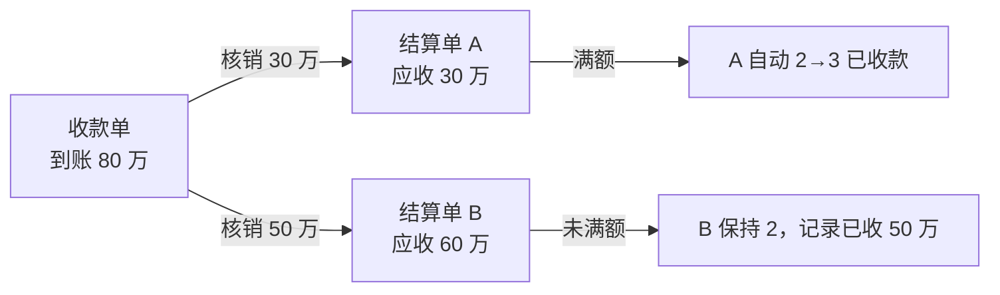
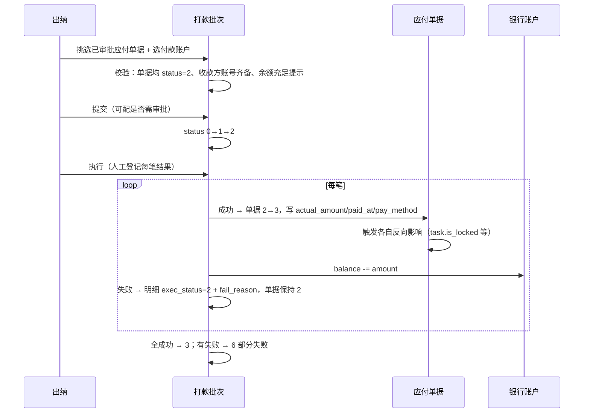

# 资金收付与出纳台

> **所属阶段**：阶段六 - 财务结算模块
>
> **文档状态**：已落地（第 2 期：收款单与核销；第 4 期：银行账户 + 打款批次 + 出纳台 + 收付款流水 前后端完成）
>
> **创建日期**：2026-08-13
>
> **最近更新**：2026-08-14（第 4 期落地回写：§9.1 补银行账户 / 打款批次 / 出纳台的实际落点与三处结构差异、收款单银行余额联动）
>
> **上一次更新**：2026-08-14（§9.1 回写收款单服务与 API 的实际落点及目录偏差原因）
>
> **优先级**：中高（第 2 期先落收款单与核销，第 4 期落银行账户与打款批次）
>
> **关联文档**：
>
> - 同目录 [00.模块总览](00.模块总览.md)（§2.2 单据 #13/#14、§6.2 `doc_kind`、§6.3 事件 21~23）
> - 同目录 [01.财务单据体系与业务单据联动设计](01.财务单据体系与业务单据联动设计.md)（通用基座、幂等与并发）
> - 同目录 [02.客户侧-对账与结算与发票](02.客户侧-对账与结算与发票.md)（§4.5「收款账户字典」由本文的 `biz_bank_account` 取代）
> - 同目录 [08.岗位视角与工作台设计](08.岗位视角与工作台设计.md)（§3.3 出纳工作台）
> - 同目录 [11.进项发票管理](11.进项发票管理.md)（票款核对与本文核销的关系）
> - 同目录 [12.应收账龄与信用管控](12.应收账龄与信用管控.md)（账龄以本文的收款核销为事实来源）

## 一、文档定位

### 1.1 要解决的问题

此前的设计里，「钱实际动了」这件事是被塞在单据里的一个动作：结算单上点一下「登记收款/支付」，写 `actual_amount` + `paid_at`。这在单笔对单张的简单场景够用，但物流公司的资金实务有三个特点会让它撑不住：

| # | 实务特点 | 单据内登记为什么不够 |
|---|---------|-------------------|
| 1 | 一次银行付款覆盖多张单据 | 出纳一天付 40 笔司机运费，逐张点「支付」既慢又容易漏，且无法回答「今天从哪个账户出去多少钱」 |
| 2 | 一笔到账对不上一张单据 | 客户月底打一笔 80 万覆盖 6 张结算单，或分 3 笔付清 1 张；单据上的 `actual_amount` 无法表达这种多对多 |
| 3 | 账户是有限资源 | 有多个经营主体、多个银行账户，付款要选账户、要看余额；`biz_business_entity` 只有一组 `bank_name/bank_account` 字段，装不下 |

### 1.2 设计目标

| 目标 | 落地 |
|------|------|
| 资金动作与应收应付义务分离 | 义务在单据（结算单/工资单/费用单），资金事实在收款单与打款批次 |
| 不引入新的应付义务实体 | 打款批次只是「一次付款动作的载体」，不重复表达应付金额（§二） |
| 简单场景不变复杂 | 单笔对单张仍可在单据上直接登记，不强制走批次/收款单（§2.3 双路径） |
| 账户与余额可管 | `biz_bank_account` 独立表，按经营主体归属 |

### 1.3 明确不做

| 不做 | 原因 | 预留 |
|------|------|------|
| 银企直连自动打款 | 依赖银行接口与资质 | 批次表留 `bank_serial_no`、`exec_result`，远期换实现即可 |
| 银行流水导入与自动匹配 | 需要各行对账文件解析 | 收款单支持手工录，远期加导入 |
| 完整总账与凭证 | 明确不做（见 `00` §1.3） | 事件表足以重建流水 |
| 现金/备用金管理 | 物流公司现金收付主要在司机端，已由驾驶员资金账户覆盖 | 见 `07` |

## 二、核心设计取舍：为什么不建「付款单」

一个很自然的想法是：建一张 `biz_payment_order`（付款单），出纳挑几张应付单据生成付款单，走审批后付款。这个方案被否决，理由：

| 问题 | 说明 |
|------|------|
| 义务被表达两次 | 承运商结算单已经是「应付 20 万」，付款单再写一遍「应付 20 万」，两处金额必须永远一致，同步逻辑是纯负担 |
| 审批变两层 | 结算单已经财务主管审批过，付款单再审一次，业务上没有新增判断，只是流程摩擦 |
| 状态机耦合 | 付款单撤销时结算单该回到什么状态？两个状态机互相约束，组合爆炸 |

**采用的方案**：打款批次（`biz_payment_batch`）**不是应付单据**，它是一次银行付款动作的执行记录。它的语义是「这 40 笔已审批的钱，从 X 账户一次性付出去」：

- 批次**不持有**应付义务，金额是所包含单据金额的求和结果，非独立录入；
- 批次执行成功后，把批内每张单据各自推到 `status=3 已支付`，触发它们原有的反向影响（如 `task.is_locked`）；
- 批次撤销 = 批内单据回退到 `status=2`，各单据自身的撤销规则仍适用。

同理，收款单（`biz_receipt_voucher`）是「银行到账事实」，不是应收义务；应收义务在客户结算单。

### 2.3 双路径原则

| 场景 | 路径 | 适用 |
|------|------|------|
| 一笔钱对一张单据 | 直接在单据上 `pay` / `receive` | 小额零星、社会运力现付、单张客户回款 |
| 一次动作对多张单据 | 走打款批次 / 收款单核销 | 月结批量付款、大额回款覆盖多单 |

两条路径**互斥不重复**：单据一旦通过批次或核销置为 `status=3`，就不能再手工 `pay`；反之手工 `pay` 过的单据不出现在批次候选与核销候选里。实现上靠 `status=2` 这个前置条件天然保证，无需额外字段。

## 三、银行账户 `biz_bank_account`

### 3.1 定位

取代 `02` §4.5 的临时方案（「远期独立企业银行账户模块，本期下拉字典 `tenant_bank_account`」）。字典方案的问题是存不了余额、存不了经营主体归属、无法做收支流水归集。

> **对 `02` 文档的调整**：`biz_customer_settlement.received_account`（VARCHAR 标签）改为 `received_account_id`（BigInt，FK → `biz_bank_account.id`）+ `received_account_label`（冗余展示）。第 2 期建表时直接用新字段，不做二次迁移。

### 3.2 表设计

不继承 `FinanceDocBaseMixin`——账户是主数据，不是单据。

| 字段 | 类型 | 说明 |
|------|------|------|
| `enterprise_id` | BigInt | 所属经营主体（`biz_business_entity.id`），必填 |
| `account_name` | VARCHAR(100) | 账户名称（户名） |
| `account_no` | VARCHAR(50) | 银行账号 |
| `bank_name` | VARCHAR(100) | 开户行全称 |
| `bank_branch` | VARCHAR(100) | 支行 |
| `account_type` | TinyInt | 1-基本户 2-一般户 3-专用户 4-其他 |
| `currency` | VARCHAR(8)，默认 CNY | 币种 |
| `balance` | Numeric(16,2)，默认 0 | 账面余额（由收付动作维护，见 §3.3） |
| `usage_scope` | TinyInt | 用途 1-收付通用 2-仅收款 3-仅付款 |
| `is_default_receive` | TinyInt，默认 0 | 是否该主体的默认收款账户 |
| `is_default_pay` | TinyInt，默认 0 | 是否该主体的默认付款账户 |
| `status` | TinyInt，默认 1 | 0-停用 1-正常 |
| `sort_order` | Int，默认 0 | 下拉排序 |
| `remark` | VARCHAR(255) | 备注 |
| 唯一约束 | `(account_no, is_deleted)` | 同一账号不重复建（软删后可重建） |
| 索引 | `(enterprise_id, status)` | 按主体筛可用账户 |

### 3.3 余额的口径

**余额是账面值，不是银行真实余额**，只作为出纳的参考与超额提示依据：

| 动作 | 余额变化 |
|------|---------|
| 打款批次执行成功（每笔） | `balance -= 该笔实付金额` |
| 打款批次某笔失败 | 该笔不扣 |
| 撤销已支付单据（含强制撤销） | `balance += 原实付金额` |
| 收款单认领到账 | `balance += 到账金额` |
| 撤销收款认领 | `balance -= 原到账金额` |
| 手工调账 | 提供「余额校准」动作，必填原因，写事件留痕 |

并发保护：余额更新一律 `SELECT ... FOR UPDATE` 锁账户行，同一账户的并发付款串行化。

> **明确不做自动对平**：账面余额与银行实际余额必然有差（手续费、利息、未入账），系统不追求一致，只提供「余额校准」让出纳定期对齐。追求自动一致就必须做银行流水导入，超出本期范围。

## 四、收款单 `biz_receipt_voucher`

### 4.1 定位与状态

`doc_kind = 'receipt_voucher'`，继承 `FinanceDocBaseMixin`，`direction=1 收款`。可用状态集 `{0,3,4,5,6}`：

| 状态 | 文案 | 含义 |
|:---:|------|------|
| 0 | 草稿 | 已录到账信息，尚未核销到任何结算单 |
| 3 | 已认领 | 已核销部分金额，但未核销完 |
| 6 | 部分核销 | 与 3 同义，保留供远期区分（本期不用，统一用 3） |
| 5 | 已核销 | 核销金额 = 到账金额，完全对应 |
| 4 | 已撤销 | 录错撤销 |

无 `1 待审批` / `2 已审批`：到账是客观事实，不需要审批。这也是它与结算单的本质区别。

### 4.2 表设计

继承 `FinanceDocBaseMixin`；特有字段：

| 字段 | 类型 | 说明 |
|------|------|------|
| `doc_kind` | `'receipt_voucher'` | 常量 |
| `customer_id` | BigInt，可空 | 付款方客户（可空：认领前可能不确定是谁打的） |
| `customer_name` | VARCHAR(100) | 冗余 |
| `payer_name` | VARCHAR(100) | 银行回单上的付款方名称（原文，可能与客户档案名不同） |
| `bank_account_id` | BigInt | 收款账户（`biz_bank_account.id`） |
| `bank_account_label` | VARCHAR(100) | 冗余展示 |
| `received_at` | DateTime | 到账时间（= 基类 `paid_at` 的应收语义，本表额外冗余便于筛选） |
| `receive_method` | TinyInt | 收款方式 1-银行转账 2-现金 3-支票 4-承兑汇票 5-平台代收 |
| `bank_serial_no` | VARCHAR(64) | 银行流水号（远期自动匹配的关键） |
| `settled_amount` | Numeric(14,2)，默认 0 | 已核销金额（冗余，= Σ 核销明细） |
| `unsettled_amount` | Numeric(14,2) | 未核销金额 = `planned_amount - settled_amount`（冗余，便于筛「待认领」） |
| `voucher_url` | VARCHAR(500) | 银行回单附件 |
| 索引 | `(customer_id, received_at)`、`(status, unsettled_amount)`、`(bank_serial_no)` | 认领与查询 |

金额语义：`planned_amount` = 到账总额（收款单里就是实收，故 `actual_amount` 与之相等，建表时同步写入以复用基座字段）。

### 4.3 核销桥接 `biz_receipt_settle_link`

| 字段 | 类型 | 说明 |
|------|------|------|
| `receipt_id` | BigInt | 收款单 ID |
| `settle_id` | BigInt | 客户结算单 ID（`biz_customer_settlement.id`） |
| `applied_amount` | Numeric(14,2) | 本收款单核销到该结算单的金额（> 0） |
| `settled_at` | DateTime | 核销时间 |
| `settled_by` | BigInt | 核销操作人 |
| `remark` | VARCHAR(255) | 备注 |
| 唯一约束 | `(receipt_id, settle_id)` | 同一对关系只一条，追加金额走更新 |
| 索引 | `(settle_id)` | 反查某结算单的到账构成 |

### 4.4 核销规则



| 规则 | 说明 |
|------|------|
| 金额上限 | Σ `applied_amount` ≤ 收款单 `planned_amount`；单张结算单累计核销 ≤ 其 `planned_amount` |
| 同客户约束 | 收款单已指定 `customer_id` 时，只能核销到同客户的结算单 |
| 结算单状态要求 | 只能核销到 `status=2 已审批` 的结算单；草稿与待审批不可核销 |
| 满额驱动 | 某结算单累计核销额 = `planned_amount` 时，自动 `2→3 已收款`，`actual_amount` 写累计核销额、`paid_at` 取最后一笔核销的 `received_at`，并触发 `02` §4.4 的运单锁定 |
| 未满额 | 结算单保持 `2`，但冗余字段 `received_amount_total` 记录已收累计（`biz_customer_settlement` 新增列），账龄按未收余额计算（见 `12`） |
| 超收处理 | 客户多打的钱不允许强行核销超额；剩余留在收款单 `unsettled_amount` 里，可核销到该客户后续结算单，或标记为预收（远期） |
| 撤销核销 | 支持删除核销明细（事件 23 `UNSETTLE`）。若该结算单已因满额置 3，则先把结算单退回 `2`（需高权限，走结算单既有 `cancel-receive` 逻辑，同时解锁运单） |

**新增列**：`biz_customer_settlement.received_amount_total`（Numeric(14,2)，默认 0）——已核销到本单的收款累计。与 `actual_amount` 的区别：前者随每次核销递增，后者只在满额置 3 时一次写入，作为「正式收妥金额」。

### 4.5 认领工作流

| 步骤 | 操作 | 岗位 |
|------|------|------|
| 1 | 录入收款单（金额、账户、到账时间、付款方、回单附件） | 出纳 |
| 2 | 系统推荐可核销结算单：按 `payer_name` 模糊匹配客户 + 该客户 `status=2` 的结算单，按金额接近度排序 | 系统 |
| 3 | 勾选结算单并分配核销金额（支持「一键按顺序填满」） | 出纳 |
| 4 | 提交核销，满额结算单自动置 3 并锁定运单 | 系统 |

推荐逻辑只做「候选排序」，不自动核销。自动核销属于 `00` §1.3 明确不做的「自动对账匹配」。

## 五、打款批次 `biz_payment_batch`

### 5.1 定位与状态

`doc_kind = 'payment_batch'`，继承 `FinanceDocBaseMixin`，`direction=2 付款`。可用状态集 `{0,1,2,3,4,6}`：

| 状态 | 文案 | 含义 |
|:---:|------|------|
| 0 | 草稿 | 已挑单、已选账户，未提交 |
| 1 | 待审批 | 提交后等主管审批（是否需要审批可配置，见 §5.4） |
| 2 | 已审批 | 可执行 |
| 3 | 已执行 | 全部笔成功 |
| 6 | 部分失败 | 部分笔成功、部分笔失败，需处理 |
| 4 | 已撤销 | 撤销整批（仅未执行时） |

### 5.2 表设计

继承 `FinanceDocBaseMixin`；特有字段：

| 字段 | 类型 | 说明 |
|------|------|------|
| `doc_kind` | `'payment_batch'` | 常量 |
| `enterprise_id` | BigInt | 付款主体 |
| `bank_account_id` | BigInt | 付款账户 |
| `bank_account_label` | VARCHAR(100) | 冗余 |
| `item_count` | Int | 总笔数 |
| `success_count` | Int，默认 0 | 成功笔数 |
| `fail_count` | Int，默认 0 | 失败笔数 |
| `total_amount` | Numeric(16,2) | 计划付款总额（= Σ 明细，等同基类 `planned_amount`，本表冗余便于报表） |
| `paid_amount` | Numeric(16,2)，默认 0 | 实际付出总额（= Σ 成功笔） |
| `plan_pay_date` | Date | 计划付款日 |
| `exec_started_at` / `exec_finished_at` | DateTime | 执行起止 |
| `exec_mode` | TinyInt，默认 1 | 1-人工登记结果 2-银企直连（远期） |
| 索引 | `(status, plan_pay_date)`、`(bank_account_id)` | 工作台查询 |

### 5.3 批次明细 `biz_payment_batch_item`

每一笔对应一张被打包的应付单据。这里用弱关联 `(doc_kind, doc_id)` 而非强外键——因为它要同时指向三种不同的应付单据表（任务费用单、承运商结算单、司机工资单）。

| 字段 | 类型 | 说明 |
|------|------|------|
| `batch_id` | BigInt | 批次 ID |
| `doc_kind` | VARCHAR(30) | 被付单据大类：`task_finance` / `carrier_settle` / `driver_payroll` |
| `doc_id` | BigInt | 被付单据 ID |
| `doc_no` | VARCHAR(50) | 被付单号（冗余） |
| `payee_type` | TinyInt | 收款方类型 1-司机 2-承运商 3-其他 |
| `payee_id` | BigInt，可空 | 收款方 ID |
| `payee_name` | VARCHAR(100) | 收款方名称（冗余） |
| `payee_bank_name` | VARCHAR(100) | 收款方开户行（冗余冻结，来自 `biz_carrier_settlement` / `biz_driver_account`） |
| `payee_bank_account` | VARCHAR(50) | 收款方账号（冗余冻结） |
| `amount` | Numeric(14,2) | 本笔金额 |
| `pay_method` | TinyInt | 支付方式（默认继承批次，可单笔改） |
| `exec_status` | TinyInt，默认 0 | 0-待执行 1-成功 2-失败 |
| `fail_reason` | VARCHAR(255) | 失败原因 |
| `bank_serial_no` | VARCHAR(64) | 银行流水号 |
| `paid_at` | DateTime | 本笔实付时间 |
| 唯一约束 | `(doc_kind, doc_id)` 在 `exec_status != 2` 时唯一 | 同一单据不被两个批次重复付；失败笔可重新入批 |
| 索引 | `(batch_id, exec_status)` | 批次详情与重试 |

> 唯一约束的实现同 `09` §5.1：加冗余列 `dedup_key`（`exec_status != 2` 时写 `doc_kind:doc_id`，失败时置 NULL），对其建唯一索引，借 MySQL 唯一索引忽略 NULL 的特性实现条件唯一。

> 收款方银行信息**冗余冻结**在明细里，不实时读主数据。理由：付款是历史事实，承运商事后改了账号不应影响已付记录的可追溯性。

### 5.4 执行流程



关键校验与规则：

| 规则 | 说明 |
|------|------|
| 入批条件 | 单据 `status=2 已审批`、未在其他未失败批次中、金额 > 0 |
| 收款方账号 | 缺开户行或账号的单据允许入批但标警示（可能走现金/油卡），`pay_method` 为银行转账时必填 |
| 余额校验 | 批次总额 > 账户余额时**只警示不阻断**（账面余额本身不准，见 §3.3） |
| 是否需审批 | 租户配置项 `finance.payment_batch_need_approval`（默认 true）。为 false 时 `0 → 2` 直接跳过待审批 |
| 单笔幂等 | 执行接口按 `batch_id + item_id` 幂等；重复提交同一笔不重复扣款、不重复置 3 |
| 事务粒度 | **每笔一个子事务**。一笔失败不回滚已成功的笔，否则 40 笔里 1 笔错就全部重来 |
| 撤销批次 | 仅 `status ∈ {0,1,2}` 可撤销；已执行的批次不能整批撤销，只能逐张走单据自身的 `cancel_payment`（高权限） |
| 重试失败笔 | `status=6` 时可对失败笔重新执行或移出批次；全部处理完后批次转 3 |
| 审计 | 批次执行写事件 21 `BATCH_PAY`（批次维度）；每笔单据另写自身的事件 6 `PAY`，两者通过 `payload_snapshot.batch_id` 关联 |

### 5.5 与既有批量支付的关系

「费用工作台」`views/operation/task-finance-workbench` 已有批量支付能力，它逐张调 `pay_doc`，不产生批次记录。第 4 期落地后：

- 保留原批量支付入口（单一类型、小批量场景更轻快）；
- 出纳工作台的批量打款走批次（跨类型、需要账户与执行结果记录）；
- 两者最终都把单据置 3，互不冲突。

## 六、收付款流水页 `/finance/fund-flow`

不新建流水表。流水是**视图**，由三处数据 UNION 而来：

| 来源 | 方向 | 关键字段映射 |
|------|------|------------|
| `biz_payment_batch_item`（`exec_status=1`） | 付 | 时间 = `paid_at`，对方 = `payee_name`，账户 = 批次的 `bank_account_id` |
| `biz_receipt_voucher`（`status ∈ {3,5}`） | 收 | 时间 = `received_at`，对方 = `payer_name`，账户 = `bank_account_id` |
| 单据直接 `pay`/`receive`（未走批次/收款单） | 收/付 | 从 `biz_finance_doc_event`（`event_type=6`）取，时间 = `event_time` |

> 之所以不建独立流水表：流水的每一条都能从上述三处无损还原，建表就要处理三处写入的一致性，是纯粹的冗余风险。若后续性能不足，再加物化视图或汇总表，届时口径已由本节钉死。

页面能力：按时间/账户/经营主体/方向/对方筛选，导出，按账户汇总收支合计。

## 七、API 设计

```text
# 银行账户
GET    /api/client/finance/bank-account                    列表
POST   /api/client/finance/bank-account                    新增
PUT    /api/client/finance/bank-account/{id}               编辑
DELETE /api/client/finance/bank-account/{id}               删除（有流水则拒绝，只允许停用）
POST   /api/client/finance/bank-account/{id}/calibrate      余额校准（必填原因）
GET    /api/client/finance/bank-account/options             下拉选项（按 enterprise_id + usage_scope 过滤）

# 收款单
GET    /api/client/finance/receipt                          列表
POST   /api/client/finance/receipt                          录入到账
PUT    /api/client/finance/receipt/{id}                     编辑（仅未核销）
POST   /api/client/finance/receipt/{id}/cancel               撤销
GET    /api/client/finance/receipt/{id}/candidates           可核销结算单推荐
POST   /api/client/finance/receipt/{id}/settle               核销（批量分配金额）
DELETE /api/client/finance/receipt/{id}/settle/{linkId}      撤销单条核销
GET    /api/client/finance/receipt/{id}/events               事件流

# 打款批次
GET    /api/client/finance/payment-batch                    列表
POST   /api/client/finance/payment-batch                    创建（传应付单据 id 列表 + 账户）
GET    /api/client/finance/payment-batch/payable-candidates  跨类型待付单据候选
PUT    /api/client/finance/payment-batch/{id}               编辑草稿（增删笔、改金额）
POST   /api/client/finance/payment-batch/{id}/submit         0→1
POST   /api/client/finance/payment-batch/{id}/approve        1→2
POST   /api/client/finance/payment-batch/{id}/execute        执行（登记每笔结果）
POST   /api/client/finance/payment-batch/{id}/retry          重试失败笔
POST   /api/client/finance/payment-batch/{id}/cancel         撤销（未执行）
GET    /api/client/finance/payment-batch/{id}/items          明细
GET    /api/client/finance/payment-batch/{id}/export         导出银行代发模板

# 出纳工作台
GET    /api/client/finance/cashier-workbench/summary         KPI + Tab 计数
GET    /api/client/finance/fund-flow                         收付款流水（UNION 视图）
```

> **收款单与打款批次不建独立菜单**。二者的操作入口都在出纳工作台内（「待认领到账」与「我的批次」两个 Tab），权限点复用 `finance:cashier-wb:*`，不单独发 `finance:receipt:*` / `finance:payment-batch:*`。理由见 `00` §9.4：独立成页会多出两个几乎无人主动打开的菜单。
>
> 银行账户是主数据，需要独立台账页，故保留 `finance:bank-account:*` 权限点。

## 八、前端要点

| 项 | 要求 |
|---|------|
| 批次创建 | 两步式：先选付款账户与计划付款日，再挑单；挑单表格按收款方分组小计，避免同一承运商多笔看不出总额 |
| 执行结果登记 | 表格内联编辑每笔的成功/失败 + 流水号 + 失败原因；提供「全部标记成功」快捷动作 |
| 部分失败呈现 | 批次详情顶部红色条：「N 笔未成功，合计 X 元」+「重试」「移出批次」两个动作 |
| 核销分配 | 收款单核销弹窗左侧显示「到账 80 万 / 已分配 30 万 / 待分配 50 万」实时计算，右侧结算单列表可输入金额；提供「按顺序填满」 |
| 导出银行模板 | 批次可导出为常见银行代发格式（户名、账号、开户行、金额），减少手工录入 |
| 余额展示 | 账户下拉里显示余额，超额时黄色警示文案而非禁用 |
| 提示语 | 遵循 [humanized-ux-copy](../../../../.cursor/rules/humanized-ux-copy.mdc)：「正在批量打款，请稍候…」「已成功打款 37 笔，3 笔未成功，请查看失败原因」「已核销 30 万，该收款单还有 50 万待分配」 |

## 九、后端代码蓝图

### 9.1 新建文件

| 文件 | 内容 | 期次 |
|------|------|:---:|
| `models/finance/receipt_voucher.py` | `ReceiptVoucher` + `ReceiptSettleLink` | 2 |
| `models/finance/bank_account.py` | `BankAccount` | 4 |
| `models/finance/payment_batch.py` | `PaymentBatch` + `PaymentBatchItem` | 4 |
| `services/finance/customer/receipt_voucher_service.py` | 录入、核销、撤销核销、候选推荐（✅ 第 2 期落地；原计划放 `cashier/receipt_service.py`，见下方说明） | 2 |
| `services/finance/cashier/bank_account_service.py` | CRUD、余额变动、校准、引用保护 | 4 |
| `services/finance/cashier/payment_batch_service.py` | 建批、执行、重试、撤销 | 4 |
| `services/finance/cashier/fund_flow_service.py` | 流水 UNION 查询 | 4 |
| `schemas/finance/receipt_voucher.py` / `bank_account.py` / `payment_batch.py` | DTO | 2 / 4 |
| `api/finance/receipt_voucher.py`（✅）/ `bank_account.py` / `payment_batch.py` / `cashier_workbench.py` | API | 2 / 4 |

> **目录偏差说明**：第 2 期只有客户侧到账核销，它与客户结算单是同一批读写（认领即改结算单状态），因此收款单的 service / schemas / API 都落在 `customer/` 下，没有先建空的 `cashier/` 目录。第 4 期上银行账户与打款批次时再建 `services/finance/cashier/`，届时收款单服务是否搬过去按调用方决定——若出纳台的到账认领与客户结算耦合仍紧，可以留在原处，由出纳台 API 调用。
>
> 收款单 API 已挂在 `finance_cashier` feature 下（`/api/client/finance/receipt`），前端第 2 期不给独立菜单：录入与认领入口在客户结算单详情与第 4 期的出纳台，权限点复用 `finance:cust-settle:receive` 与第 4 期的 `finance:cashier-wb:*`。

**第 4 期落地情况**（与上表的三处差异）：

| 项 | 落地结果 |
|---|---------|
| 银行账户 | `services/finance/cashier/bank_account_service.py` + `api/finance/bank_account.py` ✅。**不继承 `FinanceDocService`**——账户是主数据不是单据，没有状态机与审批，只借用 `FinanceDocEventWriter` 记余额变动（事件 27 `BALANCE_CALIBRATE`） |
| 打款批次 | `services/finance/cashier/payment_batch_service.py` + `api/finance/payment_batch.py` ✅。执行支持逐笔成败，失败笔留在批次里等补打，批次进 `6-部分失败`；失败笔另记事件 28 `BATCH_ITEM_FAIL` 便于筛查 |
| 出纳台与流水 | **没有单独的 `fund_flow_service.py` 与 `cashier_workbench.py`**：读聚合统一落在 `services/finance/cashier/cashier_service.py`，API 挂在 `payment_batch.py` 的 `/workbench/*` 三个子路由下（`overview` / `flow` / `calendar`）。流水也没用 SQL UNION，而是收款单与批次明细各查各的再在内存合并——按天量级最多几百行，UNION 拼 SQL 反而难维护 |

收款单在第 4 期**留在 `customer/` 未搬家**：到账认领要即时改结算单状态，与客户结算是同一批读写；出纳台通过调用它的 `cashier_stats()` 与列表接口拿数，没必要为了目录整齐制造一次跨模块搬迁。同时补了银行余额联动：收款单创建 / 改额 / 换账户 / 撤销都会调 `BankAccountService.apply_delta` 增减账面余额。

### 9.2 现有文件改动

| 文件 | 改动 | 期次 |
|------|------|:---:|
| `services/finance/base/finance_state_machine.py` | `DOC_KIND_STATES` 补 `receipt_voucher` / `payment_batch` | 2 / 4 |
| `services/finance/base/finance_doc_event_writer.py` | `FinanceEventType` 补 21 `BATCH_PAY` / 22 `RECEIPT_CLAIM` / 23 `UNSETTLE` | 2 / 4 |
| `services/finance/base/constants.py` | 补 `ReceiveMethod`（收款方式）与 `BatchExecStatus` | 2 / 4 |
| `models/finance/customer_settlement.py` | 建表时含 `received_account_id` / `received_account_label` / `received_amount_total` | 2 |

### 9.3 数据库迁移

| 表 | 迁移 | 期次 |
|----|------|:---:|
| `biz_receipt_voucher` / `biz_receipt_settle_link` | 新建，写入 `finance_receivable` 的 `required_tables` | 2 |
| `biz_bank_account` | 新建，写入 `finance_cashier` 的 `required_tables` | 4 |
| `biz_payment_batch` / `biz_payment_batch_item` | 新建，写入 `finance_cashier` 的 `required_tables` | 4 |

## 十、测试要点

### 10.1 银行账户

1. **同账号防重**：重复创建同 `account_no` → 422
2. **删除保护**：有流水的账户删除 → 422，提示改用停用
3. **默认账户唯一**：同主体设置第二个 `is_default_pay=1` → 前一个自动取消
4. **余额并发**：两个请求同时用同一账户付款 → 余额扣减正确无丢失
5. **校准留痕**：余额校准必填原因，事件表可查

### 10.2 收款核销

6. **超额拦截**：核销总额 > 到账额 → 422
7. **跨客户拦截**：核销到其他客户的结算单 → 422
8. **状态要求**：核销到草稿态结算单 → 422
9. **满额驱动**：核销至结算单满额 → 结算单自动 3，关联运单 `is_locked=1`
10. **未满额**：核销部分 → 结算单保持 2，`received_amount_total` 正确累计
11. **撤销核销**：撤销已满额核销 → 结算单退回 2 且运单解锁；无权限用户操作 → 403
12. **多对多**：1 张收款单核销到 3 张结算单、1 张结算单被 2 张收款单核销 → 金额与状态均正确
13. **超收留存**：核销后 `unsettled_amount` 正确，可继续核销到后续结算单

### 10.3 打款批次

14. **入批条件**：把 `status=1` 的单据加入批次 → 422
15. **重复入批**：同一单据加入两个未失败批次 → 422
16. **余额不足不阻断**：批次总额 > 余额 → 允许创建，返回警示标记
17. **全成功**：执行后批次 3，每张单据 3，账户余额扣减 = 批次总额
18. **部分失败**：3 笔中 1 笔失败 → 批次 6，成功笔为 3、失败笔仍为 2，余额只扣成功笔
19. **失败不回滚成功**：失败笔抛错后已成功笔的状态与余额保留
20. **重试**：重试失败笔成功后批次转 3
21. **执行幂等**：重复调用 execute 同一笔 → 不重复扣款、不重复写事件
22. **已执行不可整批撤销**：`status=3` 调 cancel → 422
23. **反向影响触发**：批内含 `is_final=1` 任务结算单，执行后 `task.is_locked=1`
24. **审批开关**：`payment_batch_need_approval=false` 时 submit 直接到 2
25. **事件关联**：批次事件 21 与各单据事件 6 可通过 `payload_snapshot.batch_id` 串起来

### 10.4 流水

26. **三源合一**：批次付款 1 笔 + 收款单 1 笔 + 单据直接支付 1 笔 → 流水页 3 条，方向与金额正确
27. **账户汇总**：按账户汇总的收支合计 = 明细之和

## 十一、远期演进锚点

| 远期能力 | 本文预留 |
|---------|---------|
| 银企直连 | `exec_mode=2` + `bank_serial_no` 已留；执行动作从「人工登记」换成「调接口 + 轮询回执」，前端与状态机不变 |
| 银行流水导入自动匹配 | 收款单的 `bank_serial_no` + `payer_name` 是匹配键；候选推荐接口已存在，换实现即可 |
| 预收款与预付款账户 | 收款单超收余额目前留在单上；远期可沉淀为客户预收账户（参考 `07` 驾驶员资金账户的往来账模型） |
| 资金计划与现金流预测 | `plan_pay_date` + 应收账期（见 `12`）已足够算出未来 30 天资金缺口 |
| 多币种 | 账户与单据均有 `currency`，远期补汇率表 |
