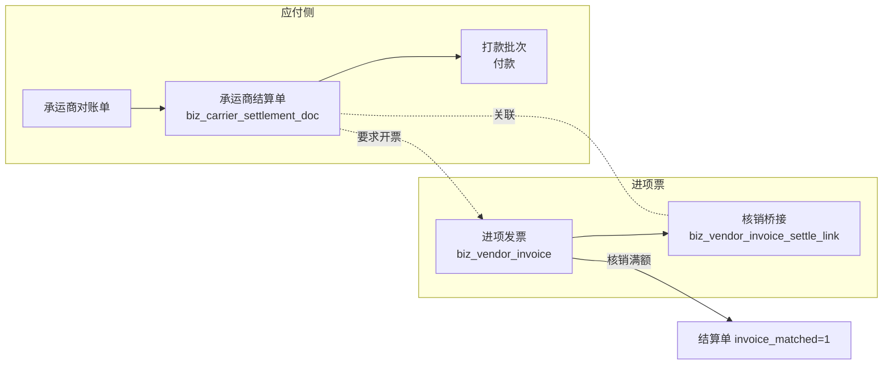

# 进项发票管理（承运商收票）

> **所属阶段**：阶段六 - 财务结算模块
>
> **文档状态**：已落地（第 3 期：进项票登记 + 票款核销 + 抵扣台账 前后端完成）
>
> **创建日期**：2026-08-13
>
> **最近更新**：2026-08-14（第 3 期落地回写：§8.1 补实际落点与三处差异，票据工作台改为纯前端聚合）
>
> **优先级**：中（第 3 期，与承运商对账结算同期落地）
>
> **关联文档**：
>
> - 同目录 [00.模块总览](00.模块总览.md)（§2.2 单据 #15、§6.2 `doc_kind`、§6.3 事件 24~25）
> - 同目录 [01.财务单据体系与业务单据联动设计](01.财务单据体系与业务单据联动设计.md)（通用基座）
> - 同目录 [02.客户侧-对账与结算与发票](02.客户侧-对账与结算与发票.md)（§5 销项发票，本文与之对称但不共表）
> - 同目录 [03.承运商侧-对账与结算](03.承运商侧-对账与结算.md)（进项票的核销对象）
> - 同目录 [08.岗位视角与工作台设计](08.岗位视角与工作台设计.md)（§3.4 票据工作台的进项侧）
> - 同目录 [10.资金收付与出纳台](10.资金收付与出纳台.md)（付款与收票的先后关系）
> - [05.合作伙伴模块/02.承运商管理](../05.合作伙伴模块/02.承运商管理.md)（承运商档案与税率字段）

## 一、文档定位

### 1.1 缺口

现有设计只做了**销项**（我方开给客户的票，`02` §5），没有**进项**（承运商开给我方的票）。这是个实质缺口，不是遗漏细节：

| # | 缺口后果 | 说明 |
|---|---------|------|
| 1 | 进项税无法抵扣管理 | 付了钱没收到票，进项税抵扣不了，直接是利润损失 |
| 2 | 「先票后款」的承运商无法管 | 票结承运商要求先给票再付款，系统里没有票的概念，只能线下催 |
| 3 | 票款不符无人发现 | 承运商开票金额与结算金额不一致（多开、少开、拆开），无系统校验 |
| 4 | 经营核算的成本口径不完整 | 含税成本与不含税成本分不开，毛利算不准（见 `13`） |

### 1.2 为什么不复用销项发票表

`biz_customer_invoice` 与进项票看似都是「发票」，但方向相反导致差异贯穿全表：

| 维度 | 销项（我方开票） | 进项（承运商开票） |
|------|---------------|-----------------|
| 开票主体 | 我方经营主体 | 承运商 |
| 我方角色 | 销方 | 购方 |
| 流程发起 | 我方主动申请开票 | 被动接收，登记为主 |
| 状态机 | 草稿→申请中→已开票→作废/红冲 | 草稿→已收票→已核销/已作废（无「申请中」） |
| 关键动作 | 开票、拆票、红冲 | 登记、验真、核销、退票 |
| 核销对象 | 客户结算单（应收） | 承运商结算单（应付） |
| 税务用途 | 销项税额 | 进项税额抵扣 |

强行共表会得到一张一半字段永远为空、状态机靠 `direction` 分叉的表。因此**独立建表**，但共用 `FinanceDocBaseMixin` 与通用状态机，保持基座一致。

### 1.3 边界

| 做 | 不做 |
|---|------|
| 收票登记、票款核对、与承运商结算单核销、抵扣台账 | 发票 OCR 自动识别（远期） |
| 手工录入发票要素 + 附件上传 | 全国增值税发票查验平台对接（远期，预留字段） |
| 税额与不含税金额的记录与汇总 | 纳税申报表生成（不属本系统） |
| 承运商侧进项 | 其他供应商（油品、保险、维修）进项票——**表结构已支持**，见 §2.4 |

## 二、单据设计

### 2.1 全景



**付款与收票的顺序不固定**，取决于承运商结算方式：

| 结算方式 | 顺序 | 系统表现 |
|---------|------|---------|
| 票结（`settlement_type=1`） | 先票后款 | 结算单审批后，`invoice_matched=0` 时打款批次给出警示（不阻断，见 §四） |
| 月结（`settlement_type=0`） | 先款后票 | 付款后进「待收票」池，按月催票 |
| 预付 / 趟结 | 通常后补票 | 同月结 |

### 2.2 `biz_vendor_invoice`（进项发票主表）

`doc_kind = 'vendor_invoice'`，继承 `FinanceDocBaseMixin`，`direction=2 付款侧`。可用状态集 `{0,3,4,5,9}`：

| 状态 | 文案 | 含义 |
|:---:|------|------|
| 0 | 草稿 | 已登记票面信息，未核销 |
| 3 | 已收票 | 已核销部分金额 |
| 5 | 已核销 | 核销金额 = 票面含税金额 |
| 4 | 已撤销 | 登记错误撤销 |
| 9 | 已作废 | 承运商作废/红冲该票 |

无 `1 待审批` / `2 已审批`：收到票是客观事实，不需要审批。与收款单（`10` §4.1）同理。

特有字段：

| 字段 | 类型 | 说明 |
|------|------|------|
| `doc_kind` | `'vendor_invoice'` | 常量 |
| `vendor_type` | TinyInt，默认 1 | 供应商类型 1-承运商 2-社会运力 3-其他供应商 |
| `vendor_id` | BigInt，可空 | 供应商 ID（`vendor_type=1` 时指 `biz_carrier.id`） |
| `vendor_name` | VARCHAR(100) | 供应商名称（冗余） |
| `seller_title` | VARCHAR(100) | 票面销方名称（原文，可能与档案名不同） |
| `seller_tax_no` | VARCHAR(30) | 票面销方税号 |
| `buyer_entity_id` | BigInt | 购方经营主体（`biz_business_entity.id`） |
| `buyer_title` | VARCHAR(100) | 票面购方名称（冗余冻结） |
| `buyer_tax_no` | VARCHAR(30) | 票面购方税号 |
| `invoice_type` | TinyInt | 1-普票 2-专票 3-电子普票 4-电子专票 5-其他 |
| `invoice_no` | VARCHAR(50) | 发票号码 |
| `invoice_code` | VARCHAR(30) | 发票代码 |
| `invoice_date` | Date | 开票日期（票面日期，非登记日期） |
| `received_at` | DateTime | 收到票的时间（登记时间语义） |
| `amount_excl_tax` | Numeric(14,2) | 不含税金额 |
| `tax_rate` | Numeric(5,2) | 税率 %（多税率时留空，按行明细） |
| `tax_amount` | Numeric(14,2) | 税额 |
| `amount_incl_tax` | Numeric(14,2) | 含税金额（= 基类 `planned_amount`，本表冗余便于报表） |
| `settled_amount` | Numeric(14,2)，默认 0 | 已核销金额（冗余，= Σ 核销明细） |
| `unsettled_amount` | Numeric(14,2) | 未核销金额（冗余，便于筛「待核销票」） |
| `deductible` | TinyInt，默认 1 | 是否可抵扣（普票通常 0，专票 1） |
| `deduct_period` | VARCHAR(7)，可空 | 抵扣税期 `YYYY-MM`（认证抵扣月份） |
| `verify_status` | TinyInt，默认 0 | 验真状态 0-未验 1-已验通过 2-验真不符（远期对接查验平台） |
| `void_reason` | VARCHAR(255) | 作废/退票原因 |
| `voided_at` | DateTime | 作废时间 |
| `attachment_url` | VARCHAR(500) | 发票扫描件/PDF |
| 唯一约束 | `(invoice_code, invoice_no, is_deleted)` | 同一张票不重复登记（软删后可重录） |
| 索引 | `(vendor_id, invoice_date)`、`(status, unsettled_amount)`、`(deduct_period)` | 台账与抵扣汇总 |

> 金额关系：`amount_incl_tax = amount_excl_tax + tax_amount`，落库前服务层校验（允许 ±0.01 舍入误差）。`planned_amount` 与 `amount_incl_tax` 同值写入，前者供基座通用逻辑用，后者语义明确供报表用。

### 2.3 `biz_vendor_invoice_item`（发票行明细，可选）

只在**多税率**发票时使用；单税率发票不建行，直接用主表字段。

| 字段 | 类型 | 说明 |
|------|------|------|
| `invoice_id` | BigInt | 发票 ID |
| `item_name` | VARCHAR(100) | 品名（如「运输服务」） |
| `tax_rate` | Numeric(5,2) | 税率 % |
| `amount_excl_tax` | Numeric(12,2) | 不含税 |
| `tax_amount` | Numeric(12,2) | 税额 |
| `amount_incl_tax` | Numeric(12,2) | 含税 |
| `remark` | VARCHAR(255) | 备注 |

存在行明细时，主表的 `tax_rate` 留空、三个金额字段取行汇总。

### 2.4 表结构对其他供应商的兼容

`vendor_type` 预留了 `3-其他供应商`，使油品、保险、维修等进项票也能登记（`vendor_id` 可空，靠 `seller_title` 标识）。但**本期不建对应的核销对象**——这类票没有「结算单」可核销，登记后 `status` 停在 0 草稿，只进抵扣台账。这是有意的：先让票据不丢，核销闭环等采购/费用报销模块建成后再补。

## 三、核销桥接 `biz_vendor_invoice_settle_link`

| 字段 | 类型 | 说明 |
|------|------|------|
| `invoice_id` | BigInt | 进项发票 ID |
| `settle_id` | BigInt | 承运商结算单 ID（`biz_carrier_settlement_doc.id`） |
| `applied_amount` | Numeric(14,2) | 本票核销到该结算单的含税金额（> 0） |
| `matched_at` | DateTime | 核销时间 |
| `matched_by` | BigInt | 核销操作人 |
| `remark` | VARCHAR(255) | 备注 |
| 唯一约束 | `(invoice_id, settle_id)` | 同一对关系一条，追加金额走更新 |
| 索引 | `(settle_id)` | 反查某结算单的票据构成 |

支持 N:N：一张大额发票覆盖多张结算单，多张小额发票凑一张结算单。

**新增列**（`biz_carrier_settlement_doc` 建表时直接包含）：

| 字段 | 类型 | 说明 |
|------|------|------|
| `invoice_matched` | TinyInt，默认 0 | 是否已收齐票 0-未齐 1-已齐 |
| `invoice_amount_total` | Numeric(14,2)，默认 0 | 已核销进项票含税金额累计 |

## 四、票款核对

### 4.1 核对口径

核对的是**票面含税金额**与**结算单应付金额**：

| 判定 | 条件 | 处理 |
|------|------|------|
| 票款相符 | Σ `applied_amount` = 结算单 `planned_amount`（容差 ±0.01） | 置 `invoice_matched=1`，写事件 25 `INVOICE_MATCH` |
| 票不足 | Σ < `planned_amount` | 保持 `invoice_matched=0`，进「待收票」池，差额 = 缺票金额 |
| 票超额 | Σ > `planned_amount` | **拒绝核销**，超出部分不允许挂到该结算单；提示改用「拆分核销到多张结算单」 |

### 4.2 与付款的关系：警示不阻断

票结承运商理论上应「先票后款」，但强行阻断付款会出事故（票在路上、急付运费）。因此：

| 场景 | 系统行为 |
|------|---------|
| 票结承运商的结算单 `invoice_matched=0` 时入打款批次 | **允许**，批次明细行标黄警示「该承运商为票结，尚未收齐发票」 |
| 出纳执行批次 | 允许，不拦截 |
| 已付款但长期未收票 | 进票据工作台「待收票」池，按账期天数排序催票 |

这与 `12` 的信用管控采用同一原则：**财务风险用可见性管理，不用流程阻断管理**。阻断会让业务停摆，而可见性配上考核就能解决问题。

### 4.3 票款不符的登记

票款不符不复用 `biz_recon_diff`（那是运输事实与财务单的差异，见 `09`），因为票款差异的处置路径完全不同（找承运商换票 / 补票 / 调结算金额），且不影响运输事实。

处理方式：直接在结算单详情的「发票」区块展示缺口金额与已核销明细，票据工作台「票款不符」Tab 按缺口金额排序。不为此建新表——缺口 = `planned_amount - invoice_amount_total`，是派生值。

### 4.4 作废与退票

| 场景 | 处理 |
|------|------|
| 承运商作废该票并重开 | 原票置 `status=9 已作废`（必填原因），其核销明细全部删除并回退结算单的 `invoice_amount_total` / `invoice_matched`；新票重新登记核销 |
| 我方退票（票面信息有误） | 同上，`void_reason` 记录退票原因 |
| 已进入抵扣税期的票作废 | 允许但强警示：「该票已登记 YYYY-MM 抵扣，作废需同步处理申报」，写事件 14 `VOID` |

## 五、抵扣台账

进项发票台账页 `/finance/vendor-invoice` 除标准列表外，提供**按税期汇总**视图：

| 汇总维度 | 指标 |
|---------|------|
| 税期（`deduct_period`） | 票数、不含税合计、税额合计、含税合计 |
| 经营主体（`buyer_entity_id`） | 同上（多主体分别申报，必须能分开看） |
| 税率 | 按 `tax_rate` 分组的税额分布 |
| 可抵扣性 | `deductible=1` 与 `=0` 分开合计 |

这是纯查询视图，不建汇总表。导出为 Excel 供财务做申报底稿。

> **不做纳税申报**：申报表格式随政策变化、且各地口径不同，属于专业财税软件的范畴。系统只提供准确的底稿数据。

## 六、API 设计

```text
# 进项发票
GET    /api/client/finance/vendor-invoice                      列表 + 多维筛选
POST   /api/client/finance/vendor-invoice                      登记收票
PUT    /api/client/finance/vendor-invoice/{id}                 编辑（仅未核销）
POST   /api/client/finance/vendor-invoice/{id}/void             作废/退票
POST   /api/client/finance/vendor-invoice/{id}/cancel           撤销（登记错误）
GET    /api/client/finance/vendor-invoice/{id}/candidates       可核销承运商结算单推荐
POST   /api/client/finance/vendor-invoice/{id}/match            核销（批量分配金额）
DELETE /api/client/finance/vendor-invoice/{id}/match/{linkId}   撤销单条核销
GET    /api/client/finance/vendor-invoice/{id}/events           事件流
GET    /api/client/finance/vendor-invoice/deduct-summary        抵扣台账汇总（按税期/主体/税率）
GET    /api/client/finance/vendor-invoice/pending-list          待收票池（已付未收齐票的结算单）

# 票据工作台（销项+进项共用）
GET    /api/client/finance/invoice-workbench/summary            KPI + Tab 计数
```

## 七、前端要点

| 项 | 要求 |
|---|------|
| 登记表单 | 票面字段分组：销方 / 购方 / 票面金额 / 附件。含税金额与不含税+税额联动自动计算，任填两项算第三项 |
| 多税率切换 | 默认单税率简表；勾选「多税率」后展开行明细表格，主表金额字段变为只读汇总 |
| 核销弹窗 | 与收款核销（`10` §八）同一交互：左侧「票面 X / 已分配 Y / 待分配 Z」，右侧候选结算单可输入金额，提供「按顺序填满」 |
| 待收票池 | 按「已付款天数」倒序，标出承运商与缺票金额，支持批量导出催票清单 |
| 票款不符提示 | 结算单详情「发票」区块：已核销票列表 + 缺口金额红字；缺口为 0 时显示绿色「票款已齐」 |
| 唯一性提示 | 登记时若 `invoice_code + invoice_no` 已存在，提示「这张发票已登记过，可点击查看」并给跳转链接，而非只报错 |
| 提示语 | 遵循 [humanized-ux-copy](../../../../.cursor/rules/humanized-ux-copy.mdc)：「正在登记发票，请稍候…」「已登记发票，还有 3.2 万元未核销」「该承运商为票结，尚未收齐发票，请确认是否继续付款」 |

## 八、后端代码蓝图

### 8.1 新建文件（均第 3 期）

| 文件 | 内容 |
|------|------|
| `models/finance/vendor_invoice.py` | `VendorInvoice` + `VendorInvoiceItem` + `VendorInvoiceSettleLink` |
| `services/finance/invoice/vendor_invoice_service.py` | 登记、编辑、作废、核销、撤销核销、候选推荐 |
| `services/finance/invoice/deduct_summary_service.py` | 抵扣台账汇总查询 |
| `schemas/finance/vendor_invoice.py` | DTO |
| `api/finance/vendor_invoice.py` | API |
| `api/finance/invoice_workbench.py` | 票据工作台（第 4 期补销项部分） |

第 3 期已落地，与上表三处差异：

1. **发票服务落在 `services/finance/invoice/vendor_invoice_service.py`**（同表），抵扣台账没有单独建 `deduct_summary_service.py`——它是同一批表的一个聚合查询，作为 `vendor_invoice_service.deduct_summary()` 更省一层依赖。
2. **没有 `api/finance/invoice_workbench.py`**。票据工作台（`/finance/invoice-workbench`，菜单 943，第 4 期）是纯读聚合页，前端直接调销项待开票池、进项待收票池与销项台账三个既有接口，不再加一层后端聚合；一旦要加「批量催票」这类写动作再补。
3. **前端组件**：`vendor-invoice/components/vendor-invoice-edit.vue`（登记 / 改票面，含多税率行）、`vendor-invoice-detail.vue`（详情 + 作废 / 撤销）、`invoice-match.vue`（票款核销弹窗）。

### 8.2 现有文件改动

| 文件 | 改动 | 期次 |
|------|------|:---:|
| `services/finance/base/finance_state_machine.py` | `DOC_KIND_STATES` 补 `vendor_invoice: {0,3,4,5,9}` | 3 |
| `services/finance/base/finance_doc_event_writer.py` | `FinanceEventType` 补 24 `INVOICE_IN` / 25 `INVOICE_MATCH` | 3 |
| `services/finance/base/constants.py` | 补 `InvoiceType` / `VendorType` / `VerifyStatus` | 3 |
| `models/finance/carrier_settlement_doc.py` | 建表时含 `invoice_matched` / `invoice_amount_total` | 3 |
| `services/finance/cashier/payment_batch_service.py` | 入批时对票结未收票的结算单打警示标记（不阻断） | 4 |

### 8.3 数据库迁移

| 表 | 迁移 | 期次 |
|----|------|:---:|
| `biz_vendor_invoice` / `_item` / `_settle_link` | 新建，写入 `finance_invoice` 的 `required_tables` | 3 |

## 九、权限点

```text
finance:vendor-invoice:list / detail / create / edit / void / cancel /
                       match / unmatch / deduct-summary / export
```

授予：应付会计（`list/detail/create/edit/match/export`）、财务主管（全部）、出纳（`list/detail`）。见 `08` §2.2。

## 十、测试要点

1. **金额校验**：`amount_excl_tax + tax_amount ≠ amount_incl_tax`（差超 0.01）→ 422
2. **重复登记**：同 `invoice_code + invoice_no` 再次登记 → 422，错误信息带已存在票的 id
3. **软删后可重录**：撤销（软删）后同号可重新登记
4. **多税率汇总**：录 3 行不同税率 → 主表三个金额字段 = 行汇总
5. **核销上限**：核销总额 > 票面含税 → 422
6. **票超额拒绝**：核销到结算单使其超过 `planned_amount` → 422，提示拆分核销
7. **满额置标记**：核销至结算单满额 → `invoice_matched=1`，事件 25 存在
8. **不足保持**：部分核销 → `invoice_matched=0`，`invoice_amount_total` 正确累计
9. **N:N**：1 票核销 3 张结算单、1 张结算单收 2 张票 → 金额与标记正确
10. **作废回退**：已核销票作废 → 核销明细清空、结算单 `invoice_amount_total` 归零、`invoice_matched=0`
11. **抵扣期作废警示**：有 `deduct_period` 的票作废 → 返回警示标记但允许操作
12. **付款不阻断**：票结承运商 `invoice_matched=0` 的结算单入批并执行 → 成功，且明细带警示标记
13. **待收票池**：已付款且未收齐票的结算单出现在 `pending-list`，按已付款天数排序
14. **抵扣汇总口径**：按税期汇总的税额合计 = 该税期票据税额之和；`deductible=0` 的票单独统计
15. **多主体隔离**：两个 `buyer_entity_id` 的票在汇总里分别成组
16. **权限**：出纳调用 `match` → 403

## 十一、远期演进锚点

| 远期能力 | 本文预留 |
|---------|---------|
| 发票 OCR 识别 | 登记接口的字段结构即 OCR 输出目标；`attachment_url` 已存原件。可复用 AI 数字人模块既有的图片识别能力（参考 `image.extract_waybill` 的实现模式） |
| 增值税发票查验平台对接 | `verify_status` 已留 0/1/2 三态，接入后由后台任务批量验真 |
| 进项税抵扣自动认证 | `deduct_period` + `deductible` 已足够，远期对接勾选平台 |
| 其他供应商进项闭环 | `vendor_type=3` 已支持登记；等费用报销/采购模块建成后补核销对象 |
| 承运商自助上传发票 | 平台互联（`carrier_invitation`）已有承运商侧入口，远期让承运商自己传票，我方只做审核 |
| 票据档案与归档 | `attachment_url` 已存原件，远期加按税期打包归档下载 |
