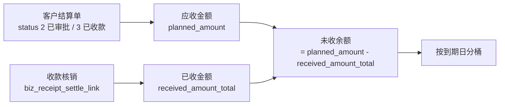

# 应收账龄与信用管控

> **所属阶段**：阶段六 - 财务结算模块
>
> **文档状态**：已落地（第 2 期前后端；派车与对账确认两个提示点顺延到第 3 期，见 §4.1）
>
> **创建日期**：2026-08-13
>
> **最近更新**：2026-08-14 —— 账龄页、客户档案「结算与信用」分组、录单提示条已落地；
> §4.1 触发点补状态列，§7.2 补前端落点与顺延说明
>
> **上一次更新**：2026-08-13 —— `aging_service` / `credit_alert_service` /
> `ar_aging` 接口与客户档案三字段读写已落地，落地中的三处口径细化已回写本文
> （见 §2.2 票结兜底、§4.1 留痕触发方式、§三 前端清空语义）
>
> **优先级**：高（第 2 期，与客户侧应收闭环同期落地）
>
> **关联文档**：
>
> - 同目录 [00.模块总览](00.模块总览.md)（§3.3 闸口 #7、§6.3 事件 26）
> - 同目录 [02.客户侧-对账与结算与发票](02.客户侧-对账与结算与发票.md)（账龄的数据来源）
> - 同目录 [10.资金收付与出纳台](10.资金收付与出纳台.md)（§4 收款核销是「已收金额」的事实来源）
> - 同目录 [13.经营核算口径](13.经营核算口径.md)（账龄与毛利同属核算视图，口径需一致）
> - [05.合作伙伴模块/01.客户管理](../05.合作伙伴模块/01.客户管理.md)（客户档案扩展三列）

## 一、文档定位

### 1.1 要解决的问题

应收侧只做到「对账 → 结算 → 收款」还差最后一环：**已经确认的应收，到底有多少没收回来、逾期了多久、哪个客户风险最大**。这个问题不回答，财务无法催收，老板无法判断现金流。

| # | 缺口 | 后果 |
|---|------|------|
| 1 | 没有「未收余额」的统一口径 | 结算单的 `planned_amount` 与已核销收款额分散两处，人工算账 |
| 2 | 没有账期概念 | 客户档案里只有 `settlement_type`（月结/票结/预付），没有「月结几天」，无法判断是否逾期 |
| 3 | 没有信用额度 | 一个客户欠 300 万还在接单，业务不知情 |
| 4 | 催收无优先级 | 逾期 5 天和逾期 120 天混在一起，催收资源用不到刀刃上 |

### 1.2 核心原则：只预警不拦截

**信用超额与账期逾期一律不阻断业务操作。** 这是本文最重要的一条约定。

理由：

| 理由 | 说明 |
|------|------|
| 与项目既有策略一致 | 经营主体跨主体归属已明确「不拦截，如实两侧记账」（见 [需求-代码落地差距清单](../../../05.开发计划/需求-代码落地差距清单.md) §2.2） |
| 信用数据本身是滞后的 | 额度是人工维护的、账龄依赖对账进度，用不准的数据阻断真实业务，代价远大于收益 |
| 物流业务不能停 | 车已经在路上、货已经装了，此时因为额度不足禁止录单，只会逼业务绕过系统 |
| 风险靠可见性 + 考核解决 | 让业务、财务、老板都看见欠款，配上考核指标，比系统硬卡有效 |

预警的落点是**提示 + 看板 + 事件留痕**，不是 `raise BizException`。

### 1.3 边界

| 做 | 不做 |
|---|------|
| 账龄分桶统计、客户维度汇总、逾期预警 | 坏账计提与核销（会计科目层面，不属本系统） |
| 客户账期与信用额度维护 | 自动信用评分模型（远期） |
| 催收提示与清单导出 | 催收流程管理（跟进记录、承诺还款日等，属客户运营模块） |
| 应收侧账龄 | 应付账龄（承运商侧我方是欠款方，付款节奏由自己控制，需求弱，远期补） |

## 二、账龄口径

### 2.1 数据来源与未收余额定义

账龄的原子单位是**客户结算单**，不是运单，也不是对账单。理由：结算单才是「确认了要收多少钱」的单据（对账单是事项确认，运单是业务单据）。



| 概念 | 口径 |
|------|------|
| 纳入范围 | `biz_customer_settlement` 中 `status ∈ {2 已审批, 3 已收款}` 且 `is_deleted=0` |
| 应收金额 | `planned_amount` |
| 已收金额 | `received_amount_total`（由收款核销维护，见 `10` §4.4） |
| 未收余额 | `planned_amount - received_amount_total`，≤ 0 时不计入账龄 |
| 排除 | `status ∈ {0 草稿, 1 待审批, 4 已撤销}` 一律不计入——未经审批的不算确认的应收 |

> **为什么 `status=3 已收款` 也要纳入**：满额核销才会置 3，理论上余额为 0。但存在「手工 `receive` 登记了金额但小于 `planned_amount`」的历史数据，纳入后由余额计算自然过滤，比按状态硬排除更稳。

### 2.2 到期日的计算

到期日 = 账期起算日 + 客户账期天数（`payment_days`）。

| 客户结算方式 | 账期起算日 | 说明 |
|------------|-----------|------|
| 月结（`settlement_type=0`） | 结算单关联对账单的 `period_end` | 月结按账期月末起算 |
| 票结（`settlement_type=1`） | 关联销项发票的 `issued_at`（开票日）；未开票则取结算单审批日 `reviewed_at` | 票到才起算。销项发票表第 4 期才建，**当前实现一律走 `reviewed_at` 兜底**，第 4 期补开票日优先 |
| 预付（`settlement_type=2`） | 结算单 `reviewed_at` | 预付客户理论上不该有应收，出现即视为异常，`payment_days` 按 0 算 |

计算逻辑集中在 `AgingService._resolve_due_date(settlement)`，不在数据库里存 `due_date` 字段——因为账期天数是客户档案上的可变配置，改了以后历史账龄应随之重算。若存死值，改配置就要批量刷数据。

> **例外**：结算单支持**单据级覆盖**。新增列 `biz_customer_settlement.due_date`（Date，可空）：非空时直接用它，为空时按上表推导。用于「这一单特批 90 天」的场景。

### 2.3 分桶规则

逾期天数 = 统计基准日（默认今天）- 到期日。

| 桶 | 逾期天数 | 语义 |
|---|---------|------|
| 未到期 | ≤ 0 | 在账期内，正常 |
| 1-30 天 | 1 ~ 30 | 轻度逾期，提醒 |
| 31-60 天 | 31 ~ 60 | 中度逾期，重点催 |
| 61-90 天 | 61 ~ 90 | 高风险 |
| 90 天以上 | > 90 | 极高风险，建议暂停合作 |

分桶阈值**做成租户配置项** `finance.aging_buckets`（默认 `[30, 60, 90]`），因为不同企业的账期习惯差异大。配置读取沿用既有租户配置机制（与 `finance.task_doc_stage_rules` 同一套），已挂进 `SystemConfigService._ensure_lazy_defaults` 懒补齐，存量租户无需手工插配置行。

配置值是 JSON 数组（升序、正整数，最多 6 档），也兼容 `{"buckets": [...]}` 写法。**解析失败一律回退默认并记日志**，不抛异常——配错一个字符导致整张账龄页打不开，比按默认阈值展示更糟。桶名由阈值自动推导（`[15, 45]` → 未到期 / 1-15 天 / 16-45 天 / 45 天以上），故预警等级判定也按「首档 / 末档阈值」表达，不写死 30/90。

### 2.4 汇总维度

| 维度 | 用途 |
|------|------|
| 客户 | 催收主视图，按未收余额倒序 |
| 经营主体（`enterprise_id`） | 多主体分别看应收（多法人必须分开） |
| 账龄桶 | 风险分布 |
| 业务员 / 客户经理 | 责任归属（取 `biz_customer` 的负责人字段，若无则不提供该维度） |

## 三、客户档案扩展

### 3.1 新增三列（`biz_customer`）

| 字段 | 类型 | 默认 | 说明 |
|------|------|:----:|------|
| `payment_days` | Int，可空 | NULL | 账期天数。NULL = 未设置，按 0 天算（即审批/开票即到期） |
| `credit_limit` | Numeric(14,2)，可空 | NULL | 信用额度（未收余额上限）。NULL = 不限额 |
| `credit_status` | TinyInt | 1 | 信用状态 0-暂停合作 1-正常 2-重点关注 |

不新建 `biz_customer_credit` 小表：三个字段与客户是严格 1:1，独立建表只多一次 join，没有扩展性收益。若远期要做信用变更历史，届时加 `biz_customer_credit_log` 流水表，与主表三列并存。

### 3.2 字段语义细节

| 字段 | 细节 |
|------|------|
| `payment_days` | 与 `settlement_type` 配合：月结 30 表示「月末后 30 天付」；票结 15 表示「开票后 15 天付」 |
| `credit_limit` | 与**未收余额合计**比较，不含未审批的结算单，也不含在途未对账的运单（口径见 §4.2） |
| `credit_status=0 暂停合作` | 仅作为强提示依据，**不阻断**录单派车；实际停单靠业务管理，不靠系统 |
| `credit_status=2 重点关注` | 提示级别提升（黄→橙），并在账龄看板置顶 |

### 3.3 前端维护入口

客户档案编辑表单新增「结算与信用」分组，含上述三列 + 已有的 `settlement_type`。这四个字段放在一起才好理解，分散在不同分组会让人填错。

`PUT` 时 `paymentDays` 与 `creditLimit` 按「是否提交了该字段」判断：**显式传 `null` 即清空**（改回未设置 / 不限额），不提交则保持原值。客户档案其余字段沿用既有的「非空才覆盖」语义不动——只有账期与额度存在「取消」这个真实诉求。

## 四、预警设计

### 4.1 预警触发点

| # | 触发点 | 预警内容 | 展示方式 | 阻断 | 状态 |
|---|-------|---------|---------|:----:|:---:|
| 1 | 运单录入选中客户后 | 该客户未收余额、逾期金额、信用状态 | 客户选择器上方提示条 | 否 | ✅ |
| 2 | 任务派车（该任务含该客户运单） | 同上，仅当有 90 天以上逾期或超额时提示 | 派车确认弹窗内提示 | 否 | 🕒 3 期 |
| 3 | 客户对账单确认 | 该客户历史逾期情况 | 确认弹窗内提示 | 否 | 🕒 3 期 |
| 4 | 客户结算单建单 / 提交审批 | 该客户未收余额与超额情况 | 建单弹窗内提示条 | 否 | ✅ |
| 5 | 对账工作台 / 账龄页 | 全量预警看板 | 常驻 | 否 | ✅ |
| 6 | 客户档案详情 | 该客户账龄明细 | 「应收情况」区块 | 否 | 🕒 3 期 |

触发点 1、2 是**业务侧**页面，需要业务模块调用财务侧的只读接口。为避免业务模块依赖财务内部实现，统一走一个轻量接口：

```text
GET /api/client/finance/ar-aging/customer-brief?customerId=X
→ { unsettledAmount, overdueAmount, maxOverdueDays, creditLimit,
    creditStatus, exceeded, bucketSummary }
```

该接口要求**快**（业务页面同步调用）：只查结算单聚合，不做复杂 join，必要时加缓存（租户级 5 分钟）。

实现上信用字段优先取账龄行上的冗余值，只有该客户完全没有未收余额时才回查一次客户档案，正常路径两次查询（分桶配置 + 明细聚合）。返回体已含 `alertLevel` / `alertMessage`，前端直接展示，不需要自己拼文案、也不需要知道分桶阈值。

### 4.2 超额判定口径

```text
超额 = (未收余额合计 > credit_limit)
未收余额合计 = Σ (planned_amount - received_amount_total)
               WHERE customer_id = X AND status ∈ {2,3} AND 余额 > 0
```

**不含**在途业务（未对账的已完成运单、草稿态对账单）。理由：在途金额随对账进度波动大，纳入后额度会频繁虚假触发。若企业要更严的口径，远期加配置项 `finance.credit_include_in_transit`。

### 4.3 预警等级与文案

| 等级 | 条件 | 颜色 | 文案示例 |
|------|------|------|---------|
| 无 | 无逾期且未超额 | — | 不显示 |
| 提醒 | 有 1-30 天逾期 | 黄 | 该客户有 3.2 万元已逾期 12 天，请关注回款 |
| 警示 | 有 31-90 天逾期，或已超信用额度 | 橙 | 该客户逾期 45 天未回款 8.6 万元，已超信用额度 3 万元 |
| 高危 | 有 90 天以上逾期，或 `credit_status=0` | 红 | 该客户有 15 万元逾期超过 90 天，客户信用状态为「暂停合作」，请先与财务确认 |

文案遵循 [humanized-ux-copy](../../../../.cursor/rules/humanized-ux-copy.mdc)：说清事实 + 给出下一步，不出现字段名与状态码。

### 4.4 事件留痕

高危级预警在触发点 1、2、4 被展示时，写一条事件 26 `CREDIT_ALERT` 到 `biz_finance_doc_event`：

| 字段 | 值 |
|------|---|
| `doc_kind` | `credit_alert`（虚拟大类，非单据） |
| `doc_id` | `customer_id` |
| `event_type` | 26 |
| `occurred_amount` | 触发时的未收余额 |
| `operator_id` | 当前操作人 |
| `reason` | 触发场景（如「运单录入」「派车」） |
| `payload_snapshot` | 逾期金额、最大逾期天数、额度、超额金额 |

只在**高危**级留痕，提醒与警示级不写（避免事件表被刷爆）。留痕的用途是事后追责：「这单派车时系统已经提示过客户逾期 15 万」。

> 复用 `biz_finance_doc_event` 而不新建预警表：它本就是 append-only 的领域事实流水，`doc_kind` 已是字符串，容纳一个虚拟大类不破坏结构。

**留痕的触发方式**：`customer-brief` 接受可选参数 `scene`（`waybill_create` / `task_dispatch` / `recon_confirm` / `settle_submit`）。传了场景即表示「这次是业务页面真的把提示展示给人看了」，此时高危级才写事件；账龄页与客户档案只是看数，不传 `scene`，不留痕。

这让一个只读接口带上了写副作用，取舍是：留痕的语义本就是「提示被展示过」，只有前端知道这件事发生了；改成前端展示后再单独调一次 POST 上报，多一次往返却不改变任何结论，也更容易漏调。

## 五、账龄页 `/finance/ar-aging`

### 5.1 页面结构

| 区块 | 内容 |
|------|------|
| 顶部 KPI | 应收总额、未到期、逾期总额、90 天以上、超额客户数（各可点击下钻） |
| 分桶图 | 横向堆叠条形图，按桶展示金额占比；按经营主体可切换 |
| 客户汇总表 | 客户 / 信用状态 / 额度 / 未收余额 / 各桶金额 / 最大逾期天数 / 操作（展开明细、导出、跳客户档案） |
| 明细下钻 | 展开某客户后显示其结算单明细：单据号 / 对账周期 / 应收 / 已收 / 未收 / 到期日 / 逾期天数 |

### 5.2 实现方式：视图而非表

账龄**不建表**，全部由结算单 + 收款核销实时聚合。

| 考量 | 结论 |
|------|------|
| 数据量 | 单租户结算单量级在万级，实时聚合完全够 |
| 一致性 | 建快照表就要处理「核销后刷新」「账期改了重算」，一致性成本高 |
| 历史账龄 | 需要「查某个历史时点的账龄」时，用统计基准日参数回溯计算即可（结算单与核销都有时间戳） |

性能兜底：客户汇总查询按 `customer_id` 分组聚合，配 `(customer_id, status)` 索引；若后续超过 10 万级结算单，再加日终汇总表，届时口径已由 §2 钉死。

### 5.3 导出

导出两种格式：客户汇总（催收用）、结算单明细（对账用）。均带统计基准日与分桶阈值，避免拿到表格看不出口径。

## 六、API 设计

```text
GET  /api/client/finance/ar-aging                      账龄客户汇总（分页 + 筛选）
GET  /api/client/finance/ar-aging/summary               KPI + 分桶汇总
GET  /api/client/finance/ar-aging/detail                某客户结算单明细
GET  /api/client/finance/ar-aging/customer-brief        单客户预警摘要（业务侧调用，轻量）
GET  /api/client/finance/ar-aging/export                导出

# 客户信用维护复用客户档案接口，不单独建
PUT  /api/client/partner/customer/{id}                  含 paymentDays / creditLimit / creditStatus
```

筛选参数：`customerId`、`enterpriseId`、`bucket`、`creditStatus`、`onlyExceeded`、`onlyOverdue`、`baseDate`（统计基准日，默认今天）。

## 七、后端代码蓝图

### 7.1 新建文件（均第 2 期）

| 文件 | 内容 | 状态 |
|------|------|:---:|
| `services/finance/customer/aging_service.py` | `AgingService`：分桶配置解析、到期日推导、明细行、客户汇总与 KPI、单客户摘要、导出工作簿 | ✅ |
| `services/finance/customer/credit_alert_service.py` | 预警等级判定（`AlertLevel`）+ 场景（`AlertScene`）+ 事件 26 留痕 | ✅ |
| `schemas/finance/ar_aging.py` | DTO（`extra="ignore"`，只固定对外契约） | ✅ |
| `api/finance/ar_aging.py` | 5 个只读接口 | ✅ |

### 7.2 现有文件改动

| 文件 | 改动 | 期次 |
|------|------|:---:|
| `models/partner/customer.py` | 新增 `payment_days` / `credit_limit` / `credit_status` | 2 ✅ |
| `schemas/partner/customer.py` | `CustomerOut` / `CustomerCreate` / `CustomerUpdate` 暴露三字段，出参带 `creditStatusLabel` | 2 ✅ |
| `services/partner/customer_service.py` | 三字段的读写与校验（`credit_limit ≥ 0`、`payment_days ∈ [0, 365]`、`credit_status ∈ {0,1,2}`，校验落在 schema 上返回 422） | 2 ✅ |
| `models/finance/customer_settlement.py` | 建表时含 `due_date`（可空，单据级账期覆盖） | 2 ✅ |
| `services/finance/base/finance_doc_event_writer.py` | `FinanceEventType` 补 26 `CREDIT_ALERT` | 2 ✅ |
| `services/system_config_service.py` | `_ensure_lazy_defaults` 补 `finance.aging_buckets` | 2 ✅ |
| `services/finance/base/constants.py` | 补 `SettlementType`（到期日推导用）与 `CreditStatus` | 2 ✅ |
| `services/waybill/waybill_service.py` | 不改后端逻辑；前端录单页调 `customer-brief` 展示提示 | 2 ✅ |
| 前端 `views/partner/customer/` | 编辑表单新增「结算与信用」分组（账期、额度、信用状态 + 已有结算方式）；列表补「账期」「信用」两列 | 2 ✅ |
| 前端 `views/finance/components/customer-credit-tip.vue` | 提示条组件，业务页只需传 `customerId` + `scene`，文案与等级由接口给 | 2 ✅ |
| 前端运单录入 `waybill-edit-basic.vue` | 客户选择器上方接入提示条（`scene=waybill_create`，高危留痕） | 2 ✅ |
| 前端客户结算单建单弹窗 | 接入提示条（不传 `scene`，只展示不留痕） | 2 ✅ |
| 前端派车确认 / 对账单确认弹窗 | 接入提示条 | 3 🕒 |

派车确认（§4.1 触发点 2）留到第 3 期：派车面对的是一个任务下多张运单、可能跨多个客户，提示条要先解决「按客户归并后展示哪几条」的问题，与承运商侧对账一并做更顺。对账单确认（触发点 3）同理放在第 3 期，届时确认弹窗要同时承载差异与信用两类提示。

### 7.3 数据库迁移

| 表 | 迁移 | 期次 |
|----|------|:---:|
| `biz_customer` | `ALTER TABLE ADD COLUMN payment_days INT NULL / credit_limit DECIMAL(14,2) NULL / credit_status TINYINT DEFAULT 1` | 2 |

`biz_customer` 是已有表，必须写迁移文件（`scripts/migration/versions/`），按幂等 ALTER 模式逐列 `col_exists` 检测后添加。

## 八、权限点

```text
finance:ar-aging:list / detail / summary / brief / export
```

授予：应收会计、对账专员、财务主管（读 + 导出）；出纳只读。客户信用字段的写权限走客户档案的 `partner:customer:edit`，不单独建——信用额度是商务决策，归客户管理岗。

## 九、测试要点

### 9.1 口径

1. **状态过滤**：草稿/待审批/已撤销的结算单不计入账龄
2. **余额计算**：`planned_amount=10万`、核销 3 万 → 未收 7 万
3. **满额不计入**：核销至满额 → 该单不出现在账龄中
4. **月结到期日**：`settlement_type=0`、`payment_days=30`、对账 `period_end=2026-06-30` → 到期日 2026-07-30
5. **票结到期日**：`settlement_type=1`、`payment_days=15`、开票日 2026-07-05 → 到期日 2026-07-20；未开票时取 `reviewed_at` 起算
6. **单据级覆盖**：结算单 `due_date` 非空 → 直接用该日期，忽略客户账期
7. **账期未设置**：`payment_days=NULL` → 按 0 天，审批日即到期
8. **分桶边界**：逾期 0 天 → 未到期桶；1 天 → 1-30 桶；30 天 → 1-30 桶；31 天 → 31-60 桶
9. **自定义阈值**：配置 `[15, 45, 90]` → 分桶按新阈值
10. **基准日回溯**：`baseDate` 传 30 天前 → 逾期天数与分桶按该日计算
11. **多主体隔离**：两个 `enterprise_id` 的应收分别汇总，合计 = 总额

### 9.2 信用与预警

12. **超额判定**：未收余额 105 万、额度 100 万 → `exceeded=true`，超额 5 万
13. **不限额**：`credit_limit=NULL` → 永不超额
14. **在途不计入**：草稿对账单金额不影响超额判定
15. **等级判定**：仅 1-30 天逾期 → 提醒；超额 → 警示；90 天以上 → 高危；`credit_status=0` → 高危
16. **不拦截**：超额客户可正常创建运单、派车、提交结算单（全部返回 2xx）
17. **高危留痕**：高危客户录单 → 事件表新增 1 条 `event_type=26`，`payload_snapshot` 含逾期天数与超额金额
18. **非高危不留痕**：提醒级录单 → 不产生事件 26
19. **摘要接口性能**：`customer-brief` 单次查询数 ≤ 2（防 N+1 与复杂 join）
20. **字段校验**：`credit_limit=-1` → 422；`payment_days=400` → 422

## 十、远期演进锚点

| 远期能力 | 本文预留 |
|---------|---------|
| 应付账龄 | §2 的口径可对称套用到承运商结算单（未付余额 = `planned_amount - 已付`），实现时复用 `AgingService` 的分桶逻辑 |
| 信用变更历史 | 远期加 `biz_customer_credit_log`，与主表三列并存 |
| 自动信用评分 | 账龄历史 + 回款及时率是评分输入；`credit_status` 可从人工维护改为模型输出 |
| 催收流程 | 催收跟进记录属客户运营模块，本文只提供清单与优先级 |
| 硬拦截开关 | 若某租户确实要求硬卡，加配置项 `finance.credit_block_mode`（默认 off）；判定逻辑已在 `credit_alert_service` 收口，接入点单一 |
| 现金流预测 | 到期日 + 未收余额可直接推出未来 30/60/90 天预计回款，与 `10` 的 `plan_pay_date` 合成资金计划 |
