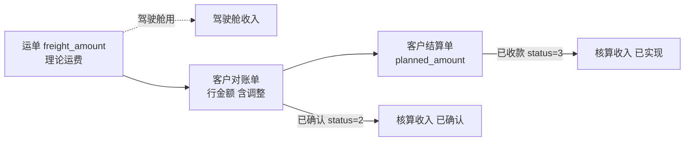

# 经营核算口径

> **所属阶段**：阶段六 - 财务结算模块
>
> **文档状态**：已落地（第 4 期：KPI + 六维汇总 + 下钻 + 跨主体明细 + 底稿导出 前后端完成）
>
> **创建日期**：2026-08-13
>
> **最近更新**：2026-08-14（第 4 期落地回写：§8.1 全部落地、§8.2 记录「不动驾驶舱分摊」与「暂不加互链」两项刻意取舍）
>
> **优先级**：中（第 4 期，依赖前三期的应收应付单据已产生数据）
>
> **关联文档**：
>
> - 同目录 [00.模块总览](00.模块总览.md)（§5.3.3 与驾驶舱的分工决策）
> - 同目录 [02.客户侧-对账与结算与发票](02.客户侧-对账与结算与发票.md) / [03.承运商侧-对账与结算](03.承运商侧-对账与结算.md) / [04.自有司机工资单](04.自有司机工资单.md)（收入与成本的单据来源）
> - 同目录 [11.进项发票管理](11.进项发票管理.md)（含税/不含税成本的依据）
> - 同目录 [12.应收账龄与信用管控](12.应收账龄与信用管控.md)（同属核算视图，口径需一致）
> - [04.计费引擎模块/04.任务支出成本自动计算系统设计文档](../04.计费引擎模块/04.任务支出成本自动计算系统设计文档.md)（理论成本来源）
> - `backend/app/modules/client/api/insight/profit.py` + `services/insight/profit_service.py`（既有经营驾驶舱实现）

## 一、文档定位

### 1.1 要解决的问题

系统里已经有一个利润分析页（`/insight/cockpit/profit`，经营驾驶舱），做得不错：KPI、趋势、承运结构、成本构成、客户排行都有。那为什么还要在财务模块下再做一个「经营核算」？

因为两者**口径不同，且都必须存在**：

| | 经营驾驶舱 `/insight/cockpit/profit` | 经营核算 `/finance/profit` |
|---|---|---|
| 服务对象 | 老板、运营总监 | 财务主管、会计 |
| 回答的问题 | 这个月生意怎么样、哪个客户赚钱 | 这个月账上确认了多少收入成本、能不能对上单据 |
| 收入取值 | 计费引擎理论结果 `biz_waybill_freight_result` | 财务确认金额（对账单确认额 / 结算单金额） |
| 成本取值 | 成本引擎理论结果 `biz_task_cost_result` 按台数分摊 | 财务确认金额（承运商结算单 + 司机工资单 + 任务费用单） |
| 归期依据 | `biz_waybill.created_at`（业务发生期） | 财务期间（对账周期 / 结算审批月） |
| 税额处理 | 不区分含税不含税 | 区分（进项票不含税额是真实成本） |
| 及时性 vs 准确性 | 及时性优先，未对账也能看 | 准确性优先，只认已确认单据 |
| 可追溯 | 到运单 | 到单据，可导出底稿逐笔核对 |

一句话概括：**驾驶舱看趋势，核算对账本。** 驾驶舱的数字第二天就有，但月底会变；核算的数字滞后于对账进度，但一旦出来就是账上的数，不再变。

### 1.2 为什么不合并成一个

试过的两条路都不通：

| 方案 | 为什么不行 |
|------|-----------|
| 只保留驾驶舱口径 | 财务无法用理论值报数。计费引擎算出来的运费和客户实际认的金额有差（调整额、差异协商），拿理论值给老板报「本月收入」，月底对账后数字变了，无法解释 |
| 只保留财务口径 | 老板无法接受「本月数据要等对账完才能看」。物流公司对账周期是月结 + 3 天，等到账确认，当月经营已经无法干预 |

所以两个页面都保留，但必须在产品上说清区别，避免用户看到两个不同的「本月毛利」而不知道信哪个。落地方式见 §五。

### 1.3 边界

| 做 | 不做 |
|---|------|
| 多维收入-成本-毛利归集，可下钻到单据 | 会计科目、总账、凭证（明确不做，见 `00` §1.3） |
| 含税/不含税双口径 | 纳税申报 |
| 底稿导出 | 合并报表（多主体合并属集团层面） |
| 跨主体差额的**报表呈现** | 跨主体差额的**结算单据**（第 5 期，见 §六） |

## 二、核算口径定义

### 2.1 收入口径



| 口径 | 定义 | 用途 |
|------|------|------|
| **已确认收入** | `biz_customer_recon` 中 `status ∈ {2 已确认, 3 已结清}` 的对账行金额合计（`amount`，已含 `adjust_amount`） | 主口径。对账双方认可即算收入，符合权责发生制 |
| **已实现收入** | `biz_customer_settlement` 中 `status=3 已收款` 的 `actual_amount` 合计 | 收付实现制口径，供现金流视角 |
| 不含税收入 | 已确认收入 ÷ (1 + 税率)。税率取销项票 `tax_rate`，未开票时取租户配置默认税率 `finance.default_output_tax_rate`（默认 9%，公路运输） | 毛利率计算的分母口径之一 |

**主口径选「已确认收入」而非「已开票」**：物流行业普遍先服务后开票，且开票可能滞后一两个月。按开票归期会让收入严重失真。

### 2.2 成本口径

成本由四条线汇总，各线的确认标准不同：

| 线 | 来源单据 | 纳入条件 | 说明 |
|---|---------|---------|------|
| 承运商运费 | `biz_carrier_settlement_doc` | `status ∈ {2 已审批, 3 已支付}` | 主要成本项 |
| 司机工资 | `biz_driver_payroll` | `status ∈ {2 已审批, 3 已发放}` | 自有车队人力成本 |
| 任务级费用 | `biz_task_finance_doc` | `status=3 已支付`，`doc_type ∈ {2 补款, 3 结算, 4 承包}` | 预付单（`doc_type=1`）**不计入成本**，它是资金流出不是成本发生，避免与结算单重复计 |
| 社会运力 | `biz_task_finance_doc`（`payee_type=3`） | 同上 | 计入承运成本 |

> **预付单不计成本**是关键约定。预付是「先给钱」，成本在结算时才确认；若两处都计，成本会翻倍。承运商侧的 `prepaid_offset_amount`（`03` §3.6）已保证结算单金额是扣减预付后的净额，两者相加正好等于实际成本。

不含税成本：有进项票的部分按 `biz_vendor_invoice.amount_excl_tax` 计；无票部分按含税金额计（无票不能抵扣，全额是成本）。这是含税/不含税双口径的核心价值——**能算出「因为没收到票而多承担的税负」**。

### 2.3 毛利

| 指标 | 公式 |
|------|------|
| 含税毛利 | 已确认收入 - 含税成本 |
| 不含税毛利 | 不含税收入 - 不含税成本 |
| 毛利率 | 不含税毛利 ÷ 不含税收入 |
| 缺票税损 | (无进项票的成本金额) × 适用税率，作为独立指标呈现 |

主推**不含税毛利率**：含税口径会因为收入税率（9%）与成本税率（9% 或 0%）不一致而失真。

### 2.4 归期规则

| 单据 | 归期字段 |
|------|---------|
| 客户对账单 | `period_end` 所在月 |
| 客户结算单 | 关联对账单的 `period_end`；无对账单时取 `reviewed_at` |
| 承运商对账单/结算单 | `period_end` 所在月 |
| 司机工资单 | `period_end` 所在月 |
| 任务级费用单 | `paid_at` 所在月（无对账周期概念） |

归期一律用**财务期间**，不用业务发生时间。这与驾驶舱按 `waybill.created_at` 归期是本质区别，也是两个页面数字不同的主因之一——必须在页面上说明。

## 三、分析维度

### 3.1 维度清单

| 维度 | 收入侧取值 | 成本侧取值 | 可行性 |
|------|-----------|-----------|-------|
| 客户 | 对账单 `customer_id` | 经运单→任务的挂接关系分摊 | 需分摊，见 §3.2 |
| 经营主体 | 对账单/结算单 `enterprise_id` | 结算单/工资单 `enterprise_id` | 直接，无需分摊 |
| 线路 | 运单起止（`origin_region_id` / `destination_region_id`） | 任务调令 | 需分摊 |
| 车辆 | — | 任务 `plate_number` | 只有成本侧，收入需分摊 |
| 司机 | — | 工资单 / 任务费用单 `payee_id` | 同上 |
| 承运类型 | — | 任务 `carrier_type` | 与驾驶舱的「承运结构」同维度 |

### 3.2 成本分摊规则

多数成本发生在**任务**上，而收入确认在**运单**上，一个任务通常拉多个客户的车，因此需要分摊。

分摊基准：**按台数**（`biz_task_waybill_item.quantity`）。

```text
某任务成本 C，任务下有挂接行 (运单A 5台, 运单B 3台)
→ 运单A 分摊 C × 5/8，运单B 分摊 C × 3/8
```

选台数而非里程或金额的理由：台数是汽车物流的天然计量单位，挂接行上就有准确值；里程需要按段拆分，金额分摊会让高价客户背更多成本，不合理。

与既有驾驶舱**采用同一分摊基准**（`profit_service` 已按台数分摊），保证两个页面的成本分摊逻辑一致，差异只来自取值口径与归期，便于向用户解释。

> 分摊只用于「客户 / 线路」这两个需要跨越任务与运单的维度。经营主体、车辆、司机、承运类型都能直接取到，不做分摊。

### 3.3 无法归集的部分

| 情况 | 处理 |
|------|------|
| 空驶调令成本（`dispatch_type=2`） | 无对应运单，无法分摊到客户 → 归入「未分摊成本」单列 |
| 年检、应急等非运输调令 | 同上 |
| 无挂接行的任务 | 同上 |
| 其他供应商进项（油品、保险） | 本期不纳入核算（无核销对象，见 `11` §2.4） |

「未分摊成本」必须在报表上**显式呈现**，不能默默丢弃也不能强行摊到客户头上。它的占比本身就是一个管理指标（空驶率高则该值高）。

## 四、页面设计 `/finance/profit`

现有 `views/finance/profit/index.vue` 是占位页，第 4 期按本文口径重做。

### 4.1 页面结构

| 区块 | 内容 |
|------|------|
| 口径说明条 | 页面顶部常驻一行：「本页按财务确认口径统计，与经营驾驶舱的差异说明」+ 展开链接。**不可省略**，这是避免双入口困惑的关键 |
| 期间选择 | 按月/季/年选择财务期间（不是任意时间范围——核算是按期的） |
| KPI 卡 | 已确认收入、含税成本、不含税毛利、毛利率、缺票税损、未分摊成本 |
| 维度切换 Tab | 客户 / 经营主体 / 线路 / 车辆 / 司机 / 承运类型 |
| 明细表 | 当前维度下的收入、成本、毛利、毛利率，可排序；行可展开下钻到单据列表 |
| 下钻抽屉 | 该维度值下的收入单据与成本单据清单，可点击跳到单据详情 |
| 导出 | 汇总表 + 单据底稿两种 |

### 4.2 口径差异说明的具体文案

点击「差异说明」展开：

```text
本页与「数据洞察 - 经营驾驶舱」的数字会有差异，原因有三：

1. 取值不同：本页只统计已对账确认的收入与已审批的成本；驾驶舱统计计费引擎
   算出的理论值，未对账也会计入。
2. 归期不同：本页按对账周期归属月份；驾驶舱按运单创建时间归属。
3. 税额不同：本页区分含税与不含税；驾驶舱不区分。

需要看及时的经营趋势，请用经营驾驶舱；需要与账面核对、导出底稿，请用本页。
```

这段文案直接写进页面，不是文档里的说明。用户不会来读文档。

### 4.3 与驾驶舱的互链

两个页面顶部互相放一个跳转链接（「查看经营驾驶舱」/「查看财务核算口径」），让用户知道另一个存在，而不是以为系统里有两个矛盾的利润表。

## 五、实现方式

### 5.1 不建汇总表

与 `12` 账龄同理：全部实时聚合，不建快照表。

| 考量 | 结论 |
|------|------|
| 数据量 | 单租户月度单据量级在千级，聚合无压力 |
| 一致性 | 单据金额可能因撤销、调整而变，快照表要处理刷新 |
| 历史期间 | 按财务期间查询天然可回溯 |

性能兜底：分摊计算涉及 `task ↔ waybill_item ↔ waybill` 三表 join，按期间过滤后数据量可控；预取成本单据到内存做分摊，避免逐行查询。若后续期间数据超过十万级，加日终物化视图，口径已由 §二 §三 钉死。

### 5.2 服务层

```python
# backend/app/modules/client/services/finance/accounting/profit_accounting_service.py

class ProfitAccountingService:
    """财务确认口径的经营核算（区别于 insight.ProfitService 的理论值口径）"""

    @staticmethod
    async def kpi(db, *, period: str, enterprise_id=None) -> AccountingKpi:
        """期间 KPI：已确认收入 / 含税成本 / 不含税毛利 / 毛利率 / 缺票税损 / 未分摊成本"""

    @staticmethod
    async def by_dimension(
        db, *, period: str, dimension: str, enterprise_id=None,
    ) -> list[DimensionRow]:
        """按维度汇总。dimension ∈ customer|entity|route|vehicle|driver|carrier_type"""

    @staticmethod
    async def drill_down(
        db, *, period: str, dimension: str, dimension_value: str,
    ) -> DrillDownResult:
        """下钻：返回该维度值下的收入单据与成本单据清单"""

    @staticmethod
    async def export_worksheet(db, *, period: str) -> bytes:
        """底稿导出：单据级明细，供财务逐笔核对"""
```

命名上刻意与 `insight/profit_service.py` 的 `ProfitService` 区分开，避免两个同名服务混用。

### 5.3 成本分摊的复用

分摊逻辑（按台数把任务成本摊到运单）在 `insight/profit_service.py` 中已有实现。第 4 期落地时抽出为共享工具：

```text
services/finance/accounting/cost_allocator.py
    allocate_task_cost_to_waybills(task_costs, task_items) -> dict[waybill_id, Decimal]
```

`insight` 侧改为调用该工具，保证两处分摊算法**只有一份实现**。这是避免「两个页面成本分摊不一致」的唯一可靠办法。

> 改动 `insight` 模块属跨模块重构，需在第 4 期评估回归风险；若时间紧，先各自实现但用同一份单元测试用例保证行为一致，后续再合并。

## 六、经营主体内部往来（本期不建表）

### 6.1 场景

A 经营主体接了客户单（收入归 A），实际用 B 主体的车执行（成本归 B）。当前系统的处理是「跨主体不拦截，如实两侧记账」：A 有收入无成本，B 有成本无收入。单看任一主体的毛利都是错的。

### 6.2 本期做什么

**只做报表呈现，不做结算单据**：

| 能力 | 本期 |
|------|:---:|
| 识别跨主体任务（运单 `enterprise_id` ≠ 任务 `enterprise_id`） | ✅ |
| 在经营主体维度报表中，把跨主体金额单列为「跨主体待结转」 | ✅ |
| 提供跨主体明细清单（哪些运单/任务、金额多少） | ✅ |
| 生成主体间结算单据、走审批与账务处理 | ❌ 第 5 期 |

经营主体维度的报表因此有三行口径：

| 行 | 含义 |
|---|------|
| 直接收入 / 直接成本 | 主体自身归属的收入与成本 |
| 跨主体待结转（转出） | 本主体承担了成本、收入归其他主体的金额 |
| 跨主体待结转（转入） | 本主体有收入、成本由其他主体承担的金额 |

这样即使不做内部结算，财务也能手工算出各主体的真实贡献，并知道内部往来的规模。

### 6.3 第 5 期立项的前置条件

必须先由业务确认**关联交易定价口径**，三个候选：

| 方案 | 说明 | 影响 |
|------|------|------|
| 成本加成 | 以 B 主体实际成本为基础加固定管理费率 | 需配置管理费率；B 主体毛利固定，A 承担市场风险 |
| 内部协议价 | 单独维护主体间内部运价表，把 B 当内部承运商 | 需建内部运价表（可复用 `biz_carrier_contract` 结构）；最灵活但维护成本高 |
| 收入分成 | 按客户运费的固定比例分给 B | 最简单；但 B 的收益与自身成本脱钩 |

口径定了才能确定 `biz_inter_entity_settlement` 的字段与计算逻辑。**在此之前建表必然返工**，故明确不做（见 `00` §1.3）。

## 七、API 设计

```text
GET  /api/client/finance/profit/kpi                    期间 KPI
GET  /api/client/finance/profit/by-dimension           按维度汇总
GET  /api/client/finance/profit/drill-down             下钻单据清单
GET  /api/client/finance/profit/inter-entity           跨主体待结转明细
GET  /api/client/finance/profit/export                 底稿导出
```

参数：`period`（`YYYY-MM` / `YYYY-Q1` / `YYYY`）、`dimension`、`dimensionValue`、`enterpriseId`、`taxMode`（`incl` / `excl`，默认 `excl`）。

## 八、后端代码蓝图

### 8.1 新建文件（均第 4 期）

| 文件 | 内容 |
|------|------|
| `services/finance/accounting/__init__.py` | 包初始化 |
| `services/finance/accounting/profit_accounting_service.py` | `ProfitAccountingService` |
| `services/finance/accounting/cost_allocator.py` | 台数分摊工具（与 insight 共用） |
| `services/finance/accounting/accounting_constants.py` | 口径常量（纳入状态集、默认税率键名） |
| `schemas/finance/profit_accounting.py` | DTO |
| `api/finance/profit_accounting.py` | API |

§8.1 的六个文件已全部落地。

### 8.2 现有文件改动

| 文件 | 改动 | 状态 |
|------|------|:---:|
| `services/insight/profit_service.py` | 分摊逻辑改为调用 `cost_allocator`（见 §5.3 的风险说明） | 🕒 未改 |
| `views/finance/profit/index.vue` | 占位页重做为核算页 | ✅ |
| `views/insight/cockpit/profit/index.vue` | 顶部加「查看财务核算口径」互链 | 🕒 未改 |
| `config/module-overview/finance.ts` | 「利润分析」卡片文案改为「经营核算」并说明口径 | ✅ |
| `services/client/system_config_service.py` | 补 `finance.default_output_tax_rate` 懒加载默认值（默认 9） | ✅ |

**两项刻意没做**：

1. **没有改 `insight/profit_service.py` 去调 `cost_allocator`**。驾驶舱的分摊已经在跑且有既有用户，为了「同一份工具函数」去动它，收益是代码去重、代价是驾驶舱数字可能偏移——这不是本期该承担的风险。`cost_allocator` 先按纯函数独立存在并被核算服务使用，等驾驶舱下次真要改分摊口径时再合并。
2. **没有加两个页面的互链**。互链要求两边都能解释清楚对方的口径，属文案设计工作；目前核算页顶部已常驻口径说明，先满足「不误解」这个底线，互链留到 §4.3 的文案定稿后再补。

### 8.3 数据库迁移

无新建表。仅依赖前三期已建的单据表。

## 九、权限点

```text
finance:profit:list / by-dimension / drill-down / inter-entity / export
```

授予：财务主管、应收会计、应付会计（读 + 导出）。经营核算含全量成本与毛利，属敏感数据，**不默认给对账专员与出纳**。

## 十、测试要点

### 10.1 口径

1. **收入纳入**：`status=0/4` 的对账单不计入；`status=2/3` 计入
2. **调整额included**：对账行 `adjust_amount=-5000` → 收入减少 5000
3. **预付不计成本**：`doc_type=1` 预付单已支付 → 不计入成本
4. **预付不重复**：承运商结算单（已扣预付）+ 预付单 → 成本 = 结算单金额 + 预付金额，且等于实际总支出
5. **不含税换算**：有销项票时按票面税率；无票时按配置默认税率
6. **缺票税损**：无进项票成本 10 万、税率 9% → 缺票税损 = 9000
7. **归期正确**：对账周期 `period_end=2026-06-30` 的单据归入 2026-06，即使审批在 7 月

### 10.2 分摊

8. **按台数分摊**：任务成本 8000，挂接 A 5 台 / B 3 台 → A 摊 5000、B 摊 3000
9. **分摊无损**：各运单分摊额合计 = 任务成本（分位差 ≤ 0.01，尾差归最后一行）
10. **空驶归未分摊**：`dispatch_type=2` 的调令成本进「未分摊成本」，不摊给客户
11. **无挂接任务**：成本进「未分摊成本」
12. **与驾驶舱分摊一致**：同一任务在两个页面的分摊结果相同（共用 `cost_allocator` 后应完全相等）

### 10.3 维度与下钻

13. **主体维度无分摊**：经营主体维度直接取单据 `enterprise_id`，不经分摊
14. **下钻可追溯**：某客户毛利下钻，收入单据金额合计 = 该行收入
15. **维度合计**：各维度值合计 + 未分摊成本 = KPI 总成本
16. **跨主体识别**：运单 `enterprise_id=1`、任务 `enterprise_id=2` → 出现在跨主体待结转，转出/转入方向正确

### 10.4 其他

17. **含税/不含税切换**：`taxMode` 切换后毛利率变化符合预期
18. **导出底稿**：导出行数 = 期间内纳入的单据数
19. **权限**：出纳调用 → 403
20. **期间格式**：`period=2026-Q1` 正确覆盖 1~3 月

## 十一、远期演进锚点

| 远期能力 | 本文预留 |
|---------|---------|
| 主体内部往来结算 | §六 已定义报表口径与三个候选定价方案，第 5 期直接接续 |
| 月度经营分析报告自动生成 | KPI + 维度接口已齐备，远期加模板渲染 |
| 预算与实际对比 | 维度口径已固定，远期加预算表按同维度录入 |
| 多主体合并报表 | 需先有内部往来结算才能正确抵消，排在第 5 期之后 |
| 单车/单人效益考核 | 车辆、司机维度已在 §3.1，收入侧分摊逻辑复用 `cost_allocator` 的反向 |
| 物化视图加速 | §5.1 已说明触发条件与不影响口径的前提 |
