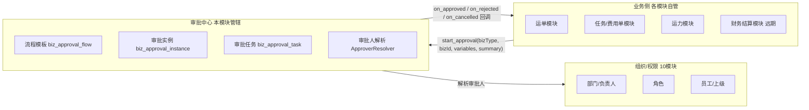

# 企业端审批中心 - 模块总览

> **所属阶段**：阶段七 - 审批中心（横切管理能力）
>
> **文档状态**：方案设计（首版）
>
> **创建日期**：2026-06-10
>
> **优先级**：高（多个业务/财务模块的共用闸口）
>
> **关联文档**：
>
> - [06.运营调度模块/02.运单与任务单状态机联动设计](../06.运营调度模块/02.运单与任务单状态机联动设计.md)（业务状态机如何与审批对接）
> - [07.财务结算模块/00.模块总览](../07.财务结算模块/00.模块总览.md)（财务单据的"待审批 → 已审批"将接入本中心）
> - [10.系统管理模块/01.基础模块-组织架构与权限](../10.系统管理模块/01.基础模块-组织架构与权限.md)（审批人解析依赖组织/角色/部门数据）
>
> **本目录文档清单**：
>
> | # | 文档 | 内容 |
> |---|------|------|
> | 00 | 本文 | 模块定位、解耦边界、审批场景矩阵、菜单与权限、术语表、分期 |
> | 01 | [审批引擎核心设计](01.审批引擎核心设计.md) | `biz_approval_*` 数据模型、实例状态机、审批人解析、或签/会签、通过/拒绝/撤回/转审/加签/抄送、条件审批 |
> | 02 | [业务接入规范](02.业务接入规范.md) | 解耦协议、`ApprovalCallback` 回调、6 步接入清单、任务费用单 / 社会运力接入样例 |
> | 03 | [前端交互与流程配置设计](03.前端交互与流程配置设计.md) | 待办/申请/记录三页、按 `biz_type` 差异化渲染、企微式线性节点流程配置器 |
> | 04 | [组织模型扩展依赖](04.组织模型扩展依赖.md) | `leader_user_id` / `supervisor_user_id`、`user-info` 返回部门、逐级上级解析、兼容与迁移 |
> | 05 | [实施方案与部署落地](05.实施方案与部署落地.md) | 建表 / 加列迁移、菜单权限功能同步、灰度开关、上线检查清单、分期实施步骤 |

## 一、模块定位与设计目标

### 1.1 定位

审批中心是物流企业管理系统的**横切（cross-cutting）管理能力**，与运单、任务、财务、运力等业务模块平级而**不耦合**。它把散落在各业务模块里的"提交 → 谁来批 → 怎么流转 → 批完了干什么"统一抽象成一套引擎，让任何业务模块都能以**最小侵入**的方式接入审批流。

它只回答三个核心问题：

| 核心问题 | 引擎职责 | 不做的事 |
|---------|---------|---------|
| **谁审批** | 按流程模板把节点解析成具体审批人（人/角色/部门/部门负责人/上级主管/自选） | 不关心审批的是运单还是费用单 |
| **怎么流转** | 多级节点、或签/会签、撤回/转审/加签/抄送、条件分支 | 不写业务字段、不改业务状态机 |
| **审批结果是什么** | 通过 / 拒绝 / 撤回，并通过**回调**通知业务方 | 不直接 UPDATE 业务表，由业务回调自己处理 |

> 定位类比：审批中心之于业务模块，等同于财务结算模块之于业务单据——**只通过约定的接口读输入、回调写结果，绝不反向侵入对方的状态机**。

### 1.2 设计目标

| # | 目标 | 落点 |
|---|------|------|
| 1 | **与业务彻底解耦**：业务模块不感知引擎内部，引擎不感知业务语义 | `biz_type` 场景码 + `variables` 输入 + `summary` 快照 + 回调写回 |
| 2 | **一套引擎服务所有场景**：运单、任务、财务、运力共用，不为每个模块各写一套审批 | `biz_approval_*` 通用表 + `ApprovalCallback` 协议 |
| 3 | **SaaS 级审批能力**：指定人/角色/部门、或签/会签、撤回/转审/加签/抄送、条件审批 | 见 `01.审批引擎核心设计` |
| 4 | **审批记录按场景差异化展示**：不同业务展示字段不一致 | 实例存 `summary` JSON 快照 + 前端按 `biz_type` 注册渲染模板 |
| 5 | **可视化流程配置**：运营可自助配流程，无需开发 | 企微式线性节点配置器，见 `03` |
| 6 | **可灰度、可分期接入**：先试点一个场景，逐步铺开 | feature 开关 `approval_manage` / `approval_config` + 分期接入 |
| 7 | **审计先行**：每个动作留痕，可追溯"谁在什么时候做了什么" | `biz_approval_record` 流水 + `operation_log` 互补 |

### 1.3 不在本期范围

| 不做 | 原因 | 未来路径 |
|------|------|---------|
| 自由连线 DAG 流程编排（任意分叉/合并/会签子流程） | 物流企业 95% 审批是线性多级，企微/钉钉式线性节点足够 | 远期如需可引入 LogicFlow/X6，引擎 `flow_node` 预留 `branch` 结构 |
| 跨租户 / 集团多组织审批 | 企业端单租户视角即可 | 平台端阶段处理 |
| 审批超时自动提醒 / 自动通过（SLA 定时器） | 依赖定时任务与通知中心 | 复用 APScheduler，远期接入；`task` 预留 `due_at` 字段 |
| 电子签章 / 手写签名 | 合规与第三方依赖 | 远期独立子能力 |
| 委托代理（长期出差自动代批） | 增加规则复杂度 | 远期；`record` 预留 `on_behalf_of` 语义 |
| 移动端/小程序审批 | 本期聚焦企业端 Web | 引擎 API 与端无关，远期复用 |

## 二、与业务模块的解耦边界

### 2.1 解耦视图

### 2.2 解耦协议（双方契约）

| 方向 | 接口 | 说明 |
|------|------|------|
| 业务 → 引擎 | `start_approval(biz_type, biz_id, biz_no, variables, summary, initiator_id)` | 业务提交时调用；`variables` 供条件审批用，`summary` 是展示快照 |
| 业务 → 引擎 | 业务表持有 `approval_instance_id`（已预留 `approval_flow_inst_id` / `approval_no`） | 反查审批进度、做幂等"是否已在审批中" |
| 引擎 → 业务 | `ApprovalCallback.on_approved / on_rejected / on_cancelled(instance)` | 引擎在实例进入终态时**同事务/事务后**同步回调业务 handler |
| 引擎 → 组织 | `ApproverResolver` 读 `biz_department` / `biz_role` / `biz_user` | 把节点审批人配置解析为具体 `user_id` 列表 |

**铁律**：

- 引擎**绝不**直接 `UPDATE` 任何 `biz_*` 业务表——业务状态变更只能由业务模块在自己的 `on_approved` 回调里完成。
- 业务模块**绝不**直接读写 `biz_approval_*` 表——只能通过引擎 Service / API。
- 引擎只读组织数据用于解析审批人，不写组织表。

> 详细协议条款、回调接口骨架、边界示例见 [02.业务接入规范](02.业务接入规范.md)。

## 三、审批场景矩阵

引擎用 `biz_type`（场景码）区分业务场景。以下为规划清单（实际接入分期推进）：

| # | 场景码 `biz_type` | 业务含义 | 触发点 | 关联业务表 | 现状 |
|---|------------------|---------|--------|-----------|------|
| 1 | `task_finance_prepay` | 任务级预付单审批 | 创建预付单提交 | `biz_task_finance_doc` (`approval_no` 已预留) | 单级，待接入 |
| 2 | `task_finance_supplement` | 任务级补款单审批 | 创建补款单提交 | `biz_task_finance_doc` | 单级，待接入 |
| 3 | `task_finance_settle` | 任务级结算单审批 | 创建结算单提交 | `biz_task_finance_doc` | 单级，待接入 |
| 4 | `social_capacity_audit` | 社会运力准入审核 | 运力提交审核 | `biz_social_capacity_audit` (`approval_flow_inst_id` 已预留) | 单级已实现，待迁移 |
| 5 | `customer_settlement` | 客户结算单审批 | 财务模块结算单提交 | 远期 `biz_customer_settlement` | 未实现 |
| 6 | `carrier_settlement` | 承运商结算单审批 | 财务模块结算单提交 | 远期 `biz_carrier_settlement_doc` | 未实现 |
| 7 | `driver_payroll` | 司机工资单审批 | 财务模块工资单提交 | 远期 `biz_driver_payroll` | 未实现 |
| 8 | `freight_contract` | 运价合同审批 | 合同提交审核 | `biz_freight_contract` | 未实现 |
| 9 | `customer_credit` | 客户授信/账期审批 | 客户授信变更 | 远期 | 未实现 |

> 场景码命名约定：`{业务域}_{单据/动作}`，全小写下划线。新增场景**只登记不改引擎**——这是解耦设计的核心收益。

## 四、菜单与权限点规划

### 4.1 菜单（已预留，见 [_build_v2_menus.py](../../../../backend/scripts/seed/_build_v2_menus.py)）

| 一级菜单 | 二级菜单 | 路径 | feature_code | 现状 |
|---------|---------|------|--------------|------|
| 审批中心 | 我的待办 | `/approval/pending` | `approval_manage` | 占位页已建 |
| 审批中心 | 我的申请 | `/approval/initiated` | `approval_manage` | 占位页已建 |
| 审批中心 | 审批记录 | `/approval/history` | `approval_manage` | 占位页已建 |
| 企业管理 | 审批流程配置 | `/enterprise/approval-config` | `approval_config` | 占位页已建 |

### 4.2 权限点（本模块需补登）

| 权限点 | 含义 | 归属菜单 |
|--------|------|---------|
| `approval:pending:list` / `approval:initiated:list` / `approval:history:list` | 列表查看 | 三页 |
| `approval:approve` | 同意 | 我的待办 |
| `approval:reject` | 拒绝 | 我的待办 |
| `approval:withdraw` | 撤回（发起人） | 我的申请 |
| `approval:transfer` | 转审 | 我的待办 |
| `approval:addsign` | 加签（前/后） | 我的待办 |
| `approval:cc` | 抄送/手动抄送 | 我的待办 |
| `approval:config:list` / `:create` / `:update` / `:publish` / `:disable` | 流程模板管理 | 审批流程配置 |

> 权限点登记与同步流程见 [05.实施方案与部署落地](05.实施方案与部署落地.md) §菜单与权限点同步。

## 五、术语表

| 术语 | 含义 |
|------|------|
| 流程模板（Flow） | 某 `biz_type` 下的一套可复用审批配置（节点链 + 条件），由运营在"审批流程配置"维护 |
| 流程节点（Flow Node） | 模板中的一个环节：审批节点 / 抄送节点；审批节点含审批人配置与签署方式 |
| 审批实例（Instance） | 一次具体的审批"运行时"，由业务提交触发，绑定 `biz_type` + `biz_id` |
| 审批任务（Task） | 实例某节点展开给某个具体审批人的待办项（一个会签节点 = N 个 task） |
| 审批记录（Record） | 实例内所有动作的领域流水（提交/同意/拒绝/撤回/转审/加签/抄送） |
| 或签（ANY） | 多审批人中**任一人**通过即节点通过 |
| 会签（ALL） | 多审批人**全部**通过节点才通过；任一人拒绝则节点拒绝 |
| 依次会签（SEQUENTIAL） | 按顺序逐个审批，前一人通过才轮到下一人 |
| 抄送（CC） | 知会相关人，不参与流转结果 |
| 转审（Transfer） | 审批人把自己的待办整体转交他人处理 |
| 加签（Add-sign） | 审批人临时增加额外审批人（前加签 = 在我之前先批；后加签 = 我之后再加一环） |
| 撤回（Withdraw） | 发起人在终态前主动撤销整个实例 |
| 条件审批 | 基于提交 `variables` 的表达式，决定走哪条流程 / 是否跳过某节点 |
| 审批人解析（Resolve） | 把节点的"审批人类型 + 配置"动态翻译成具体 `user_id` 列表 |
| 摘要快照（Summary） | 提交时业务给引擎的展示数据 JSON，冻结当时事实，供审批记录差异化渲染 |
| 回调（Callback） | 引擎在实例终态时调用的业务侧处理器，业务据此推进自己的状态机 |

## 六、实施分期建议

| 期次 | 目标 | 覆盖文档 | 关键交付 |
|------|------|---------|---------|
| **第 1 期** | 引擎基座 + 1 个试点场景 | `01` + `02` | `biz_approval_*` 表、引擎 Service/API、`task_finance_*` 接入、待办/申请/记录基础页 |
| **第 2 期** | 组织扩展 + 动态审批人 | `04` | `leader_user_id` / `supervisor_user_id`、`user-info` 返回部门、部门负责人/逐级上级解析 |
| **第 3 期** | 可视化流程配置 | `03` | 企微式线性节点配置器、条件审批 UI、或签/会签配置 |
| **第 4 期** | 财务模块全面接入 + 抄送/转审/加签完善 | `02` + 07 财务 | 客户/承运商结算单、司机工资单接入；高级流转动作 |

## 七、开放问题

| 项 | 说明 | 影响 |
|---|------|------|
| 审批中途流程模板被改 | 实例应锁定提交时的模板快照，还是跟随最新模板 | 引擎采用"实例创建时冻结节点快照"，见 `01` §数据模型 |
| 业务回调失败如何处理 | `on_approved` 抛异常时，审批是否回滚 | 默认同事务回滚 + 报错；幂等重试见 `02` |
| 同一业务单是否允许并发多个审批实例 | 如重复提交 | 业务表 `approval_instance_id` + 状态校验防重复，见 `02` |
| 条件表达式的能力边界 | 是否支持 and/or/嵌套、跨字段比较 | 第 1 期支持单层 and/or + 比较运算，见 `01` 条件审批 |
| 删除/停用流程模板对在途实例的影响 | 停用模板后在途实例继续走完 | 模板停用只影响新实例，见 `03` |
