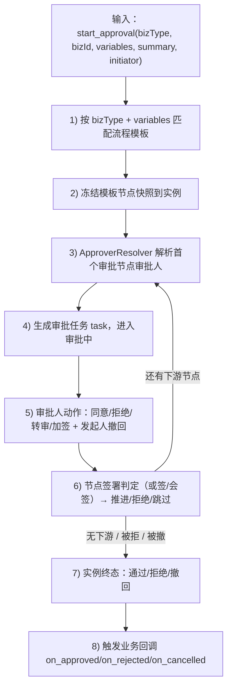
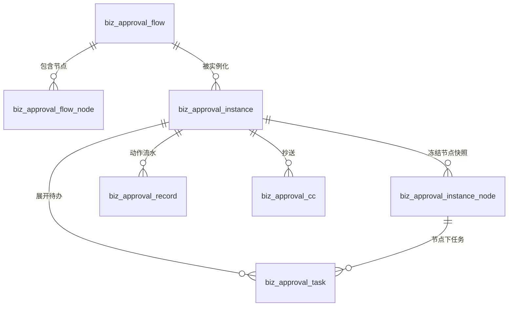
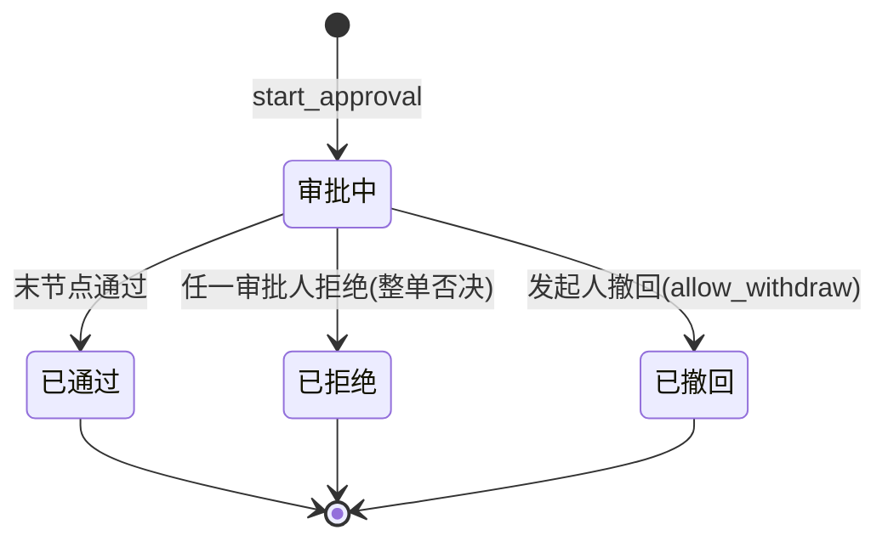
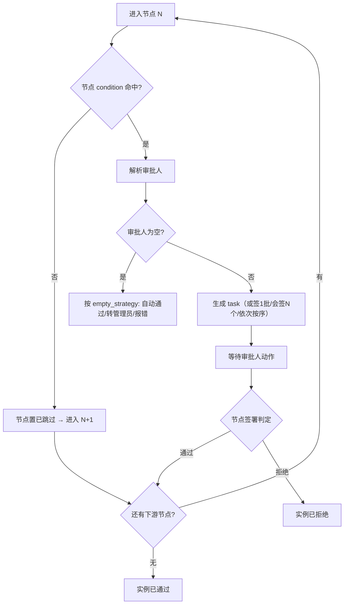

# 审批中心 - 审批引擎核心设计

> **所属阶段**：阶段七 - 审批中心
>
> **文档状态**：方案设计（首版）
>
> **创建日期**：2026-06-10
>
> **优先级**：高（引擎基座，所有场景共用）
>
> **关联文档**：
>
> - [00.模块总览](00.模块总览.md)
> - [02.业务接入规范](02.业务接入规范.md)（业务如何调用本引擎）
> - [04.组织模型扩展依赖](04.组织模型扩展依赖.md)（审批人解析依赖）

## 一、引擎职责边界

引擎是一套**领域无关**的状态推进机器，输入输出严格收口：



## 二、数据模型

全部表落在**租户业务库** `zt_biz_{tenant}`，前缀 `biz_approval_`，继承 `TenantModelBase`（`__table_tier__ = "premium"`，随 `approval_manage` 功能启用建表）。

### 2.1 ER 概览



### 2.2 `biz_approval_flow` 流程模板（定义）

| 字段 | 类型 | 说明 |
|------|------|------|
| `id` | BigInt PK | |
| `biz_type` | varchar(64) | 业务场景码，如 `task_finance_settle` |
| `flow_name` | varchar(100) | 模板名称 |
| `flow_code` | varchar(64) | 模板编码（租户内唯一，便于引用） |
| `condition` | json | 流程级生效条件（多模板时按条件选，见 §六）；空=默认 |
| `priority` | int | 同 `biz_type` 下多模板的匹配优先级（数值小优先） |
| `is_default` | tinyint | 是否兜底默认模板（所有条件都不命中时用） |
| `allow_withdraw` | tinyint | 是否允许发起人撤回 |
| `withdraw_scope` | tinyint | 撤回范围：0-仅首节点未审批前 1-审批中任意时刻 |
| `status` | tinyint | 0-草稿 1-已发布 2-已停用 |
| `version` | int | 发布版本号，每次发布递增（实例冻结引用） |
| `remark` | varchar(255) | 备注 |
| 公共 | | `created_at` / `updated_at` / `is_deleted`（继承基类） |

> 唯一约束：`(biz_type, flow_code, is_deleted)`；索引：`(biz_type, status)`。

### 2.3 `biz_approval_flow_node` 流程节点（定义）

| 字段 | 类型 | 说明 |
|------|------|------|
| `id` | BigInt PK | |
| `flow_id` | BigInt FK | 所属模板 |
| `node_order` | int | 节点序号（线性链，从 1 递增；发起人=0 不入库） |
| `node_type` | tinyint | 1-审批节点 2-抄送节点 |
| `node_name` | varchar(100) | 节点名（如"部门主管审批"） |
| `approver_type` | tinyint | 审批人类型，见 §四枚举 |
| `approver_config` | json | 审批人配置（用户ID数组/角色ID数组/部门ID/上级层级等） |
| `sign_type` | tinyint | 签署方式：1-或签(ANY) 2-会签(ALL) 3-依次会签(SEQUENTIAL)；抄送节点忽略 |
| `condition` | json | 节点级条件（命中才执行，否则跳过），空=总是执行 |
| `empty_strategy` | tinyint | 解析出空审批人时：1-自动通过 2-转交管理员 3-报错阻断 |
| `allow_transfer` | tinyint | 该节点是否允许转审 |
| `allow_addsign` | tinyint | 该节点是否允许加签 |
| 公共 | | 同上 |

> 索引：`(flow_id, node_order)`。

### 2.4 `biz_approval_instance` 审批实例（运行时）

| 字段 | 类型 | 说明 |
|------|------|------|
| `id` | BigInt PK | 即业务侧持有的 `approval_instance_id` |
| `instance_no` | varchar(50) | 审批单号（展示用，如 `SP20260610001`） |
| `biz_type` | varchar(64) | 业务场景码 |
| `biz_id` | BigInt | 业务单据主键 |
| `biz_no` | varchar(64) | 业务单据展示号（冗余，便于列表展示） |
| `flow_id` | BigInt | 命中的模板 ID |
| `flow_version` | int | 命中模板的发布版本（冻结） |
| `initiator_id` | BigInt | 发起人 user_id |
| `initiator_dept_id` | BigInt | 发起人提交时所属部门（冻结，供上级解析） |
| `variables` | json | 提交时业务变量（条件审批/解析用） |
| `summary` | json | 展示摘要快照（差异化渲染用，见 03） |
| `status` | tinyint | 0-审批中 1-已通过 2-已拒绝 3-已撤回 |
| `current_node_order` | int | 当前推进到的节点序号 |
| `result_comment` | varchar(500) | 终态结论（如拒绝原因摘要） |
| `submitted_at` | datetime | 提交时间 |
| `finished_at` | datetime | 终态时间 |
| 公共 | | 同上 |

> 索引：`(biz_type, biz_id)`、`(initiator_id, status)`、`(status, current_node_order)`。
> 唯一性由业务侧保证（同一 `biz_id` 不并发开多个"审批中"实例，见 02 接入规范）。

### 2.5 `biz_approval_instance_node` 实例节点快照

实例创建时把模板节点**复制**一份冻结，避免模板事后修改影响在途实例。

| 字段 | 类型 | 说明 |
|------|------|------|
| `id` | BigInt PK | |
| `instance_id` | BigInt FK | |
| `node_order` | int | 节点序号 |
| `node_type` / `node_name` / `approver_type` / `approver_config` / `sign_type` / `condition` / `empty_strategy` / `allow_transfer` / `allow_addsign` | 同 flow_node | 冻结快照 |
| `status` | tinyint | 0-未开始 1-进行中 2-已通过 3-已拒绝 4-已跳过(条件不命中) |
| `resolved_approver_ids` | json | 解析后的审批人 user_id 数组（含加签追加） |
| `started_at` / `finished_at` | datetime | |

> 索引：`(instance_id, node_order)`。

### 2.6 `biz_approval_task` 审批任务（待办）

节点展开到**每个具体审批人**的一行；"我的待办"直接查这张表。

| 字段 | 类型 | 说明 |
|------|------|------|
| `id` | BigInt PK | |
| `instance_id` | BigInt FK | |
| `instance_node_id` | BigInt FK | 所属实例节点快照 |
| `node_order` | int | 冗余，便于排序 |
| `approver_id` | BigInt | 审批人 user_id |
| `assign_source` | tinyint | 来源：1-正常解析 2-转审而来 3-前加签 4-后加签 |
| `sign_order` | int | 依次会签时的顺序（或/会签为 0） |
| `status` | tinyint | 0-待处理 1-已同意 2-已拒绝 3-已转审(失效) 4-已跳过 |
| `comment` | varchar(500) | 审批意见 |
| `attachments` | json | 附件（图片/文件 url 数组） |
| `due_at` | datetime | 预留：超时时间（SLA 远期） |
| `acted_at` | datetime | 处理时间 |
| 公共 | | 同上 |

> 索引：`(approver_id, status)`（待办列表核心）、`(instance_id, instance_node_id)`。

### 2.7 `biz_approval_record` 审批记录（动作流水）

实例内所有动作的**领域事件流水**，是"审批记录"页与进度时间轴的数据源；与 `operation_log`（跨模块通用日志）互补。

| 字段 | 类型 | 说明 |
|------|------|------|
| `id` | BigInt PK | |
| `instance_id` | BigInt FK | |
| `node_order` | int | 发生在哪个节点（提交=0） |
| `operator_id` | BigInt | 操作人 user_id |
| `action` | tinyint | 1-提交 2-同意 3-拒绝 4-撤回 5-转审 6-前加签 7-后加签 8-抄送 9-自动通过 10-跳过 |
| `target_user_id` | BigInt | 动作目标（转审给谁/加签给谁） |
| `comment` | varchar(500) | 意见 |
| `attachments` | json | 附件 |
| `created_at` | datetime | |

> 索引：`(instance_id, id)`（按时间轴顺序读）。**只追加不修改**。

### 2.8 `biz_approval_cc` 抄送

| 字段 | 类型 | 说明 |
|------|------|------|
| `id` | BigInt PK | |
| `instance_id` | BigInt FK | |
| `node_order` | int | 哪个节点触发的抄送（结束抄送可记终态节点） |
| `user_id` | BigInt | 被抄送人 |
| `source` | tinyint | 1-节点配置 2-审批人手动抄送 |
| `is_read` | tinyint | 是否已读 |
| `read_at` | datetime | |
| 公共 | | 同上 |

> 索引：`(user_id, is_read)`。

## 三、实例状态机

### 3.1 实例级状态



| 状态 | 值 | 进入条件 | 出口 |
|------|----|---------|------|
| 审批中 | 0 | 提交且成功匹配模板 | 推进 / 拒绝 / 撤回 |
| 已通过 | 1 | 最后一个审批节点通过 | 终态，触发 `on_approved` |
| 已拒绝 | 2 | 任一节点判定拒绝（默认整单否决） | 终态，触发 `on_rejected` |
| 已撤回 | 3 | 发起人撤回 | 终态，触发 `on_cancelled` |

> **拒绝语义**：默认"一票否决"——任一审批人拒绝即实例 `已拒绝`，业务单退回发起人。可在模板预留 `reject_strategy`（整单否决 / 退回上一节点 / 退回发起人重新提交），第 1 期固定整单否决。

### 3.2 节点推进规则



## 四、审批人类型与解析

### 4.1 审批人类型枚举（`approver_type`）

| 值 | 类型 | `approver_config` 结构 | 解析逻辑 | 依赖 |
|----|------|----------------------|---------|------|
| 1 | 指定成员 | `{ "user_ids": [..] }` | 直接取该数组 | — |
| 2 | 指定角色 | `{ "role_ids": [..] }` | 查 `biz_user_role` 取拥有该角色的所有 user | 现有 |
| 3 | 指定部门 | `{ "dept_ids": [..], "include_child": true }` | 查 `biz_user.department_id ∈ 部门(含子)` | 现有 |
| 4 | 部门负责人 | `{ "dept_ref": "initiator" \| "dept_id" }` | 取目标部门 `leader_user_id` | **04 扩展** |
| 5 | 逐级上级主管 | `{ "level": 1 }` | 从发起人沿 `supervisor_user_id` 上溯 N 级 | **04 扩展** |
| 6 | 发起人自选 | `{ "scope": "all" \| "dept" \| "role:x" }` | 提交时由发起人在 `variables.picked_approvers` 指定 | 现有 |
| 7 | 发起人本人 | `{}` | 取 `initiator_id`（常用于"知会本人"或自动通过节点） | — |

> 类型 4 / 5 在 04 文档落地组织扩展前，配置可保存但解析会回退到 `empty_strategy`；本期前端配置时给出"该能力依赖组织扩展，第 2 期生效"提示。

### 4.2 解析服务 `ApproverResolver`

伪代码（引擎内，读组织数据不写）：

```python
class ApproverResolver:
    @staticmethod
    async def resolve(db, node_snapshot, instance) -> list[int]:
        t = node_snapshot.approver_type
        cfg = node_snapshot.approver_config or {}
        if t == 1:   # 指定成员
            return list(cfg.get("user_ids", []))
        if t == 2:   # 指定角色
            return await _users_by_roles(db, cfg["role_ids"])
        if t == 3:   # 指定部门
            return await _users_by_depts(db, cfg["dept_ids"], cfg.get("include_child", True))
        if t == 4:   # 部门负责人（04 扩展）
            dept_id = instance.initiator_dept_id if cfg.get("dept_ref") == "initiator" else cfg["dept_id"]
            return await _dept_leader_user(db, dept_id)
        if t == 5:   # 逐级上级（04 扩展）
            return await _supervisor_chain(db, instance.initiator_id, cfg.get("level", 1))
        if t == 6:   # 发起人自选
            return list((instance.variables or {}).get("picked_approvers", []))
        if t == 7:   # 发起人本人
            return [instance.initiator_id]
        return []
```

- **去重 + 排除发起人**（可配 `skip_initiator`，避免自己批自己）。
- **解析时机**：进入该节点时解析（而非实例创建时全解），保证拿到最新组织关系。
- **空结果**走节点 `empty_strategy`。

## 五、签署方式与节点判定

| `sign_type` | 生成 task | 节点通过条件 | 节点拒绝条件 |
|-------------|----------|------------|------------|
| 1 或签 ANY | 一次性给所有审批人各 1 个 task | **任一** task 同意 → 节点通过，其余 task 置失效 | **任一** task 拒绝 → 节点拒绝（或可配"全拒才拒"，第 1 期取任一拒绝即拒绝） |
| 2 会签 ALL | 一次性给所有审批人各 1 个 task | **全部** task 同意 | **任一** task 拒绝 → 立即节点拒绝，其余失效 |
| 3 依次会签 SEQUENTIAL | 仅给 `sign_order` 最小者，通过后再生成下一个 | 全部按序通过 | 任一拒绝即节点拒绝 |

判定在每次审批动作后执行：

```python
async def _judge_node(db, inst_node):
    tasks = active_tasks(inst_node)
    if inst_node.sign_type == ANY:
        if any(t.status == AGREE for t in tasks): return NODE_PASS
        if any(t.status == REJECT for t in tasks): return NODE_REJECT
    elif inst_node.sign_type == ALL:
        if any(t.status == REJECT for t in tasks): return NODE_REJECT
        if all(t.status == AGREE for t in tasks): return NODE_PASS
    elif inst_node.sign_type == SEQUENTIAL:
        if any(t.status == REJECT for t in tasks): return NODE_REJECT
        if all(t.status == AGREE for t in generated): 
            return NODE_PASS if no_more_in_sequence else NODE_PENDING_NEXT
    return NODE_PENDING
```

## 六、动作语义与权限

| 动作 | 谁可操作 | 前置条件 | 效果 | 权限点 |
|------|---------|---------|------|--------|
| 提交 | 发起人（业务侧调 `start_approval`） | 业务单无在途实例 | 创建实例，进入首节点 | 业务侧权限 |
| 同意 | 当前节点有待办 task 的审批人 | 实例审批中、task 待处理 | task→同意，触发节点判定 | `approval:approve` |
| 拒绝 | 同上 | 同上 | task→拒绝，默认整单否决 | `approval:reject` |
| 撤回 | 发起人 | `allow_withdraw` 且在 `withdraw_scope` 允许窗口内 | 实例→已撤回，触发 `on_cancelled` | `approval:withdraw` |
| 转审 | 当前 task 审批人 | 节点 `allow_transfer` | 原 task 置已转审失效，给目标人新建 task（`assign_source=2`） | `approval:transfer` |
| 前加签 | 当前 task 审批人 | 节点 `allow_addsign` | 在当前人之前插入审批人，先批完才轮回当前人 | `approval:addsign` |
| 后加签 | 同上 | 同上 | 在当前节点追加审批人，当前人通过后该节点仍需新增人通过 | `approval:addsign` |
| 手动抄送 | 当前 task 审批人 | — | 追加 `biz_approval_cc` 记录（`source=2`） | `approval:cc` |

> 所有动作**同事务**写：更新 `task` / `instance_node` / `instance` + 追加 `biz_approval_record` + 必要时 `operation_log`。

### 6.1 加签语义细化

- **前加签（before）**：当前审批人 A 觉得需要先听 B 的意见 → 在节点内 A 之前插入 B 的 task；B 通过后流转回 A。实现为依次会签局部插队（B.sign_order < A.sign_order）。
- **后加签（after）**：A 通过，但要求 C 也确认 → 节点新增 C 的 task；节点判定改为"含 C 在内全部通过"。

## 七、条件审批

### 7.1 两个层级

| 层级 | 作用 | 配置位置 | 数据来源 |
|------|------|---------|---------|
| 流程级条件 | 同一 `biz_type` 多套模板时，按条件选用哪套 | `biz_approval_flow.condition` + `priority` + `is_default` | 提交 `variables` |
| 节点级条件 | 决定某节点是否执行（不命中则跳过） | `biz_approval_flow_node.condition` | 提交 `variables` |

### 7.2 条件表达式结构（JSON DSL，第 1 期）

```json
{
  "logic": "and",
  "rules": [
    { "field": "amount", "op": ">=", "value": 10000 },
    { "field": "doc_type", "op": "in", "value": [3, 9] }
  ]
}
```

- `logic`: `and` / `or`（第 1 期单层，不支持嵌套；远期升级为树）
- `op`: `==` `!=` `>` `>=` `<` `<=` `in` `not_in`
- `field`: 取自 `instance.variables`（业务提交时塞入，如金额、单据类型、客户等级）
- 空 `condition` = 恒真。

### 7.3 流程匹配算法

```python
def match_flow(db, biz_type, variables):
    flows = published_flows(biz_type)              # status=1
    flows.sort(key=lambda f: f.priority)            # 小优先
    for f in flows:
        if eval_condition(f.condition, variables):  # 含空条件=True
            return f
    return next((f for f in flows if f.is_default), None)  # 兜底
    # 仍无 → 抛 BizException("未配置可用审批流程")
```

> 示例：结算单审批，金额 < 1 万走"部门主管单签"，≥ 1 万走"主管 + 财务总监会签"——两套模板，`condition` 区分，`priority` 排序。

## 八、并发、幂等与审计

| 议题 | 策略 |
|------|------|
| 同一实例并发审批（两审批人同时点同意） | 节点判定前 `SELECT ... FOR UPDATE` 锁 `instance` 行，串行化推进 |
| 重复提交业务单 | 业务侧在调用前校验 `approval_instance_id` 对应实例非"审批中"，见 02 |
| 同一 task 重复点击 | task `status != 待处理` 直接幂等返回 |
| 回调失败 | `on_approved` 等回调在同事务内执行，抛异常则整体回滚、实例不进终态、返回错误给审批人重试；幂等约定见 02 |
| 审计 | 每个动作写 `biz_approval_record`（领域内事实）；关键 API 叠加 `@operation_log`（跨模块通用日志） |
| 软删除 | 模板/实例均 `is_deleted` 软删；已终态实例**禁止物理删除**，保留审计 |

## 九、引擎对外 Service 接口（骨架）

```python
class ApprovalEngine:
    async def start(db, *, biz_type, biz_id, biz_no, variables, summary,
                    initiator_id, initiator_dept_id) -> ApprovalInstance: ...
    async def agree(db, *, task_id, operator_id, comment, attachments=None): ...
    async def reject(db, *, task_id, operator_id, comment, attachments=None): ...
    async def withdraw(db, *, instance_id, operator_id, reason): ...
    async def transfer(db, *, task_id, operator_id, target_user_id, comment): ...
    async def add_sign(db, *, task_id, operator_id, target_user_id, mode, comment): ...
    async def cc(db, *, instance_id, operator_id, target_user_ids): ...
    # 查询
    async def list_pending(db, *, user_id, biz_type=None, page): ...
    async def list_initiated(db, *, user_id, status=None, page): ...
    async def list_records(db, *, biz_type=None, status=None, page): ...
    async def get_detail(db, *, instance_id) -> ApprovalInstanceDetail: ...
```

> API 路由前缀建议 `/api/client/approval/*`；终态触发回调的调度由 `ApprovalEngine` 内部完成（回调注册表见 [02.业务接入规范](02.业务接入规范.md)）。
