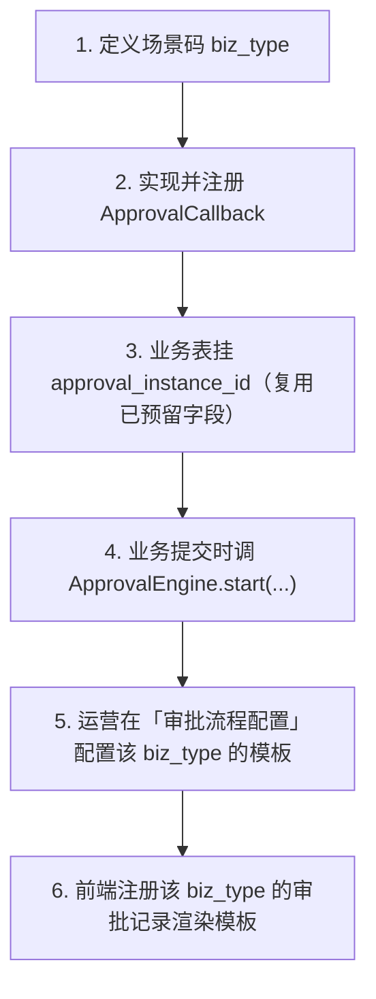
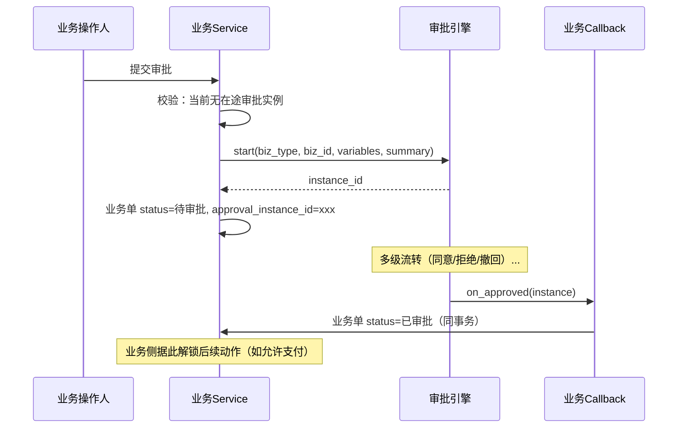

# 审批中心 - 业务接入规范

> **所属阶段**：阶段七 - 审批中心
>
> **文档状态**：方案设计（首版）
>
> **创建日期**：2026-06-10
>
> **优先级**：高（决定后续所有模块如何低成本接入）
>
> **关联文档**：
>
> - [00.模块总览](00.模块总览.md)
> - [01.审批引擎核心设计](01.审批引擎核心设计.md)
> - [07.财务结算模块/00.模块总览](../07.财务结算模块/00.模块总览.md)（财务单据"待审批"态接入目标）

## 一、为什么需要一套接入规范

审批中心的价值不在于"会审批"，而在于**任何模块都能用统一的、最小侵入的方式接入**。本文档是业务模块（运单、任务、财务、运力）与引擎之间的**契约**，规定：

- 业务侧要做哪些事（场景码、回调、字段、提交调用）
- 引擎承诺哪些行为（终态回调、不侵入业务表）
- 两个状态机（业务 vs 审批）如何共存不打架

> 这套契约对标 07 财务模块与 06 业务模块之间的"稳定接口字段 + 闸口"解耦思路：**只通过约定接口交互，不互相读写对方的表**。

## 二、解耦协议（铁律复述）

| 约束 | 业务侧 | 引擎侧 |
|------|--------|--------|
| 表访问 | 只持有 `approval_instance_id`，**不读写** `biz_approval_*` | **不读写** 任何 `biz_*` 业务表 |
| 状态变更 | 业务状态机只由业务模块在 `on_*` 回调里推进 | 引擎只推进 `biz_approval_*` 自己的状态 |
| 数据传递 | 提交时传 `variables`（机器用）+ `summary`（展示用） | 冻结快照，终态时原样回传给回调 |
| 审批人 | 不参与解析 | 由引擎 `ApproverResolver` 解析（读组织数据） |

## 三、回调注册表机制（无 Event Bus 的解耦方案）

项目当前**没有全局事件总线**，模块间通信靠 Service 直调。为避免引擎反向 `import` 各业务 Service 造成耦合，采用**回调注册表**模式（与 AI 工具注册思路一致）：

```mermaid
flowchart LR
    subgraph engine [审批引擎]
        Reg["ApprovalCallbackRegistry<br/>(biz_type → callback)"]
        Eng["ApprovalEngine"]
    end
    subgraph biz [各业务模块 启动时注册]
        TF["TaskFinanceApprovalCallback"]
        SC["SocialCapacityApprovalCallback"]
        FIN["FinanceDocApprovalCallback 远期"]
    end
    TF -->|register('task_finance_settle')| Reg
    SC -->|register('social_capacity_audit')| Reg
    Eng -->|"终态时按 biz_type 查表回调"| Reg
```

### 3.1 回调协议接口

```python
class ApprovalCallback(Protocol):
    """业务模块实现并注册到 ApprovalCallbackRegistry。引擎在实例终态时同步调用。"""

    biz_type: str  # 场景码

    async def build_summary(self, db, biz_id: int) -> dict:
        """（可选）由业务侧构建展示摘要快照；也可在提交时直接传入 summary。"""
        ...

    async def on_approved(self, db, instance: ApprovalInstance) -> None:
        """审批通过：业务侧推进自己的状态机（如 doc 待审批 → 已审批）。"""
        ...

    async def on_rejected(self, db, instance: ApprovalInstance) -> None:
        """审批拒绝：业务侧退回（如 doc → 草稿/已驳回）。"""
        ...

    async def on_cancelled(self, db, instance: ApprovalInstance) -> None:
        """发起人撤回：业务侧恢复可编辑（如 doc → 草稿）。"""
        ...
```

### 3.2 注册时机

仿照项目现有"启动时注册 AI 工具"的方式，在 FastAPI lifespan（`app/core/events.py`）或各模块 `__init__` 导入时把 callback 注册进 `ApprovalCallbackRegistry`。引擎只依赖注册表，**不依赖具体业务模块**。

### 3.3 回调事务边界与幂等

| 议题 | 约定 |
|------|------|
| 事务 | `on_approved` 等在引擎推进终态的**同一事务**内调用；回调内只用传入的 `db` Session，禁止自己提交/新开事务 |
| 失败 | 回调抛异常 → 整个动作回滚，实例不进终态，错误返回给审批人，可重试 |
| 幂等 | 回调实现需幂等（以 `instance.id` + 业务单当前状态判重），防止重试/重复回调导致重复推进 |
| 顺序 | 单 `biz_type` 单 callback；不支持一个场景多 callback（保持简单可追溯） |

## 四、6 步接入清单

新业务（或财务）模块接入审批中心，固定 6 步：



| 步骤 | 做什么 | 产物 |
|------|--------|------|
| 1 定义场景码 | 在 00 文档场景矩阵登记 `biz_type`（如 `task_finance_settle`） | 文档 + 常量 |
| 2 回调 | 实现 `build_summary` / `on_approved` / `on_rejected` / `on_cancelled` 并注册 | 业务模块内 1 个 callback 类 |
| 3 字段 | 业务主表加 / 复用 `approval_instance_id`（社会运力用已预留 `approval_flow_inst_id`，任务费用单可用 `approval_no` 关联 `instance_no`） | 迁移（加列，见 05） |
| 4 提交 | 业务"提交审批"动作里调 `ApprovalEngine.start(biz_type, biz_id, biz_no, variables, summary, initiator_id, initiator_dept_id)`，把返回的实例 id 写回业务表，业务状态置"审批中" | 业务 Service 改造 |
| 5 配模板 | 运营在前端配审批人/或签会签/条件（无模板则提交报"未配置审批流程"） | 数据，无需开发 |
| 6 前端渲染 | 在前端审批记录渲染注册表登记该 `biz_type` 的字段展示模板（见 03） | 前端 1 个配置 |

## 五、业务状态机与审批的边界约定

两个状态机必须**单向、不打架**：



### 5.1 业务单状态映射建议

| 业务侧状态 | 与审批的关系 |
|-----------|------------|
| 草稿 | 未提交审批，无实例 |
| 待审批 | 已 `start`，`approval_instance_id` 指向审批中实例 |
| 已审批 / 已通过 | `on_approved` 回调推进 |
| 已驳回 | `on_rejected` 回调推进（可回到草稿允许修改重提） |
| （撤回后） | `on_cancelled` 回调恢复到草稿 |

### 5.2 防重复与一致性

- 提交前校验：业务单若已有 `approval_instance_id` 且该实例 `status=审批中`，拒绝重复提交。
- 已审批/已支付的业务单**禁止再次提交审批**（业务侧闸口）。
- 业务单被审批中时，业务侧应锁定关键字段编辑（避免审批依据与最终单据不符）。

## 六、接入样例

### 6.1 样例 A：任务费用单审批（`task_finance_*`）

现状：`biz_task_finance_doc` 已有单级"草稿→待审批→已审批→已支付"状态机，并预留 `approval_no` 字段对接审批中心。

接入后：

| 步骤 | 落地 |
|------|------|
| 场景码 | `task_finance_prepay` / `task_finance_supplement` / `task_finance_settle`（按 `doc_type` 区分） |
| variables | `{ "amount": 12000, "doc_type": 3, "task_id": 888 }` |
| summary | `{ "单据类型": "结算单", "任务号": "T20260610", "承运商": "顺达物流", "金额": "¥12,000.00" }` |
| 提交 | 现 `task_finance_service` 的"提交审批"由"直接置待审批"改为调 `ApprovalEngine.start(...)` |
| on_approved | 把 doc `待审批 → 已审批`，刷新 `task.settled_amount` 等冗余金额（沿用现逻辑） |
| on_rejected | doc → 已驳回，允许编辑重提 |
| 条件 | 金额 ≥ 1 万走"主管 + 财务会签"，否则"主管单签"（流程级 condition） |

> 与 06 状态机文档一致：**审批通过不直接推进 `task.status`**，仅推进财务单据自身状态 + 冗余金额；`task.status` 由业务联动单独维护。

### 6.2 样例 B：社会运力准入审核（`social_capacity_audit`）

现状：`biz_social_capacity_audit` 已实现单级审核（通过/驳回 + 审核流水），并预留 `approval_flow_inst_id` 字段。

接入后：

| 步骤 | 落地 |
|------|------|
| 场景码 | `social_capacity_audit` |
| 字段 | 复用已预留 `approval_flow_inst_id` 存 `instance_id` |
| variables | `{ "capacity_type": "社会车", "region": "华东" }` |
| summary | `{ "运力名称": "...", "车牌": "...", "证件齐全": true }` |
| 提交 | 运力提交审核 → `ApprovalEngine.start('social_capacity_audit', ...)` |
| on_approved | 运力 `审批状态 → 已通过`（沿用 `SocialCapacityAuditService` 现有写流水逻辑） |
| on_rejected | 运力 `→ 已驳回` |
| 迁移策略 | 旧单级审核保留为"默认单级模板"，运营可升级为多级；存量在途单据走默认模板 |

## 七、接入检查清单（Checklist）

接入一个新场景前，逐项确认：

- [ ] `biz_type` 已在 00 文档场景矩阵登记，命名符合 `{域}_{单据}` 约定
- [ ] `ApprovalCallback` 四个方法实现完毕且**幂等**，已注册到 Registry
- [ ] 业务主表有 `approval_instance_id`（或复用预留字段），迁移已提交（见 05）
- [ ] 提交动作改为调 `ApprovalEngine.start`，并把实例 id 写回、业务状态置"待审批"
- [ ] 提交前有"防重复审批"校验
- [ ] 已为该 `biz_type` 配置至少一套可发布的流程模板（或默认模板）
- [ ] `variables` 覆盖了流程/节点 `condition` 用到的全部字段
- [ ] `summary` 字段满足审批记录展示需求
- [ ] 前端已注册该 `biz_type` 的审批记录渲染模板
- [ ] 回测：通过 / 拒绝 / 撤回三条终态路径均正确回调并推进业务状态
