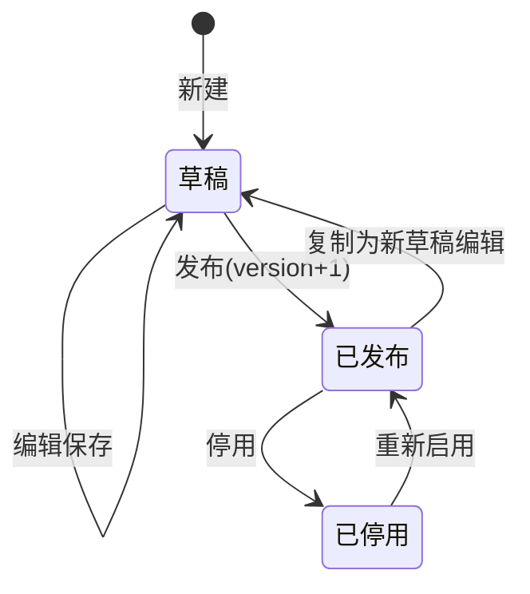

# 审批中心 - 前端交互与流程配置设计

> **所属阶段**：阶段七 - 审批中心
>
> **文档状态**：方案设计（首版）
>
> **创建日期**：2026-06-10
>
> **优先级**：高（用户直接感知层）
>
> **关联文档**：
>
> - [00.模块总览](00.模块总览.md)
> - [01.审批引擎核心设计](01.审批引擎核心设计.md)
> - [02.业务接入规范](02.业务接入规范.md)

## 一、技术栈与既有资产

| 项 | 现状 | 本模块用法 |
|----|------|-----------|
| 框架 | Vue 3.5 + TS + Vite + Pinia | 沿用 |
| UI | Element Plus + ele-admin-plus（`ele-page` / `ele-pro-table` / `ele-modal` / `ele-drawer`） | 沿用标准 CRUD 模式 |
| 选人组件 | `UserSelect` / `DepartmentSelect` / `RoleSelect`（`src/components/`） | **直接复用**于审批人配置 |
| 占位页 | `views/approval/{pending,initiated,history}/index.vue` + `views/enterprise/approval-config/index.vue` | 替换 PlaceholderPage 为真实页面 |
| 功能开关 | `userStore.hasFeature('approval_manage' / 'approval_config')` | 控制入口与按钮显隐 |
| 流程图库 | **无**（未装 LogicFlow/X6/G6） | **不引入**，用纯 Vue 组件实现线性节点配置器 |

> API 封装：新建 `src/api/approval/`（`pending` / `initiated` / `history` / `config` + `model`），沿用 `request` 工厂与 `ApiResult` 约定；参考 `src/api/basic-data/dealer/`。

## 二、页面总览

| 页面 | 路由 | 数据源 | 核心交互 |
|------|------|--------|---------|
| 我的待办 | `/approval/pending` | `biz_approval_task`（当前用户待处理） | 列表 + 审批抽屉（同意/拒绝/转审/加签/抄送） + 批量审批 |
| 我的申请 | `/approval/initiated` | `biz_approval_instance`（我发起） | 列表 + 进度时间轴 + 撤回 |
| 审批记录 | `/approval/history` | `biz_approval_instance`（全部，按权限） | 列表（按 `biz_type` 筛选）+ 详情（差异化渲染）|
| 审批流程配置 | `/enterprise/approval-config` | `biz_approval_flow` + `flow_node` | 场景列表 + 线性节点配置器 |

## 三、我的待办

### 3.1 列表

- 顶部场景筛选 Tab（全部 / 各 `biz_type`）+ 搜索（发起人、单号、提交时间）。
- 列：审批单号、业务类型、摘要主字段（取 `summary` 约定主字段）、发起人、当前节点、提交时间、操作。
- 红点角标：待办数量（接口 `GET /approval/pending/count`，用于菜单 badge）。

### 3.2 审批抽屉（`ele-drawer`）

```
┌─────────────────────────────────────────┐
│ [业务类型] 审批单号 SP20260610001          │
├─────────────────────────────────────────┤
│ 【业务摘要】按 biz_type 差异化渲染（见 §六）│
├─────────────────────────────────────────┤
│ 【审批进度】时间轴：提交 → 节点1 → 节点2... │
│   每节点显示：审批人头像、或/会签、结果、意见 │
├─────────────────────────────────────────┤
│ 【我的操作】意见输入框 + 附件                │
│  [同意] [拒绝] [转审] [加签 ▾] [抄送]       │
└─────────────────────────────────────────┘
```

- 操作按钮按 `task` 能力 + 节点配置（`allow_transfer` / `allow_addsign`）+ 权限点显隐。
- 同意/拒绝：意见可选（拒绝时建议必填），附件可选。
- 转审：弹 `UserSelect` 选目标人。
- 加签：选"前加签/后加签" + `UserSelect`。
- 抄送：`UserSelect` 多选。
- 批量审批：列表勾选多条 → 仅"同意/拒绝"，逐条调接口，结果汇总提示。

## 四、我的申请

- 列表：我发起的实例，状态 Tag（审批中/已通过/已拒绝/已撤回）、当前节点、进度。
- 详情抽屉：同 §3.2 的"摘要 + 进度时间轴"，但**我的操作区**替换为：
  - 审批中 + 模板 `allow_withdraw` 且在 `withdraw_scope` 窗口内 → 显示 [撤回] 按钮（需填原因）。
  - 已拒绝/已撤回 → 显示 [重新提交]（跳回业务单编辑页，由业务侧处理）。
- 进度时间轴用 Element Plus `el-timeline` 渲染 `biz_approval_record`。

## 五、审批记录

- 面向管理/查询，按权限可见范围（本部门/全公司）。
- 强筛选：业务类型 `biz_type`、状态、发起人、审批人、时间区间、单号。
- 列表点击 → 详情（只读，摘要差异化渲染 + 完整流水时间轴）。
- 支持导出（`approval:history:export` 远期）。

## 六、审批记录按 `biz_type` 差异化渲染（核心机制）

不同业务展示字段不一致（需求 3.4）。引擎只存 `summary` JSON 快照；前端用**渲染注册表**把 `biz_type` 映射到展示模板，避免 hardcode。

### 6.1 渲染注册表

```ts
// src/views/approval/summary-renderers/index.ts
import type { Component } from 'vue';

interface SummaryRenderer {
  bizType: string;
  label: string;                 // 业务类型显示名
  primaryField: string;          // 列表主字段 key（如金额/单号）
  component?: Component;          // 详情自定义渲染组件（可选）
  fields?: { key: string; label: string; format?: (v: any) => string }[];
}

const registry = new Map<string, SummaryRenderer>();
export function registerSummaryRenderer(r: SummaryRenderer) { registry.set(r.bizType, r); }
export function getSummaryRenderer(bizType: string) {
  return registry.get(bizType) ?? defaultRenderer;
}
```

### 6.2 默认渲染 + 自定义

- **默认渲染**：把 `summary` 的 key-value 平铺为描述列表（`el-descriptions`）。多数场景够用。
- **自定义渲染**：复杂场景（如费用单要展示金额明细表）注册 `component`，传入 `summary` 自行渲染。
- 接入新场景时（02 文档第 6 步）只需 `registerSummaryRenderer({ bizType: 'task_finance_settle', ... })`，**不改公共页面**。

### 6.3 示例

```ts
registerSummaryRenderer({
  bizType: 'task_finance_settle',
  label: '任务结算单',
  primaryField: '金额',
  fields: [
    { key: '单据类型', label: '单据类型' },
    { key: '任务号', label: '任务号' },
    { key: '承运商', label: '承运商' },
    { key: '金额', label: '金额' }
  ]
});
```

## 七、可视化流程配置（对标企微，线性节点）

参考用户提供的企微审批配置截图：本质是**自上而下的固定节点链**（发起人 → 审批节点(可多级) → 抄送 → 结束），点击节点在右侧抽屉配置，**不是自由连线 DAG**。因此用纯 Vue + Element Plus 实现，无需流程图库。

### 7.1 页面布局

```
┌──────────┬────────────────────────────┬──────────────────────┐
│ 业务场景  │        流程画布（中间）       │   节点配置（右抽屉）    │
│ 列表/树   │                            │                      │
│          │      ● 发起人               │  [审批人设置] [属性]   │
│ 运单类    │        │                   │                      │
│ ▸ 任务结算 │      ▢ 节点1 部门主管 ⊕     │  ○ 指定成员           │
│ ▸ 预付单   │        │                   │  ○ 指定角色           │
│ 财务类    │      ▢ 节点2 财务会签 ⊕     │  ● 部门负责人         │
│ ▸ 客户结算 │        │                   │  ○ 逐级上级 [1]级      │
│ 运力类    │      ▣ 抄送 ⊕              │  ○ 发起人自选         │
│ ▸ 运力审核 │        │                   │  ─────────────       │
│          │      ◉ 结束                 │  签署: ○或签 ●会签     │
│          │     [+ 添加节点]            │  [完成时多人] 会签     │
└──────────┴────────────────────────────┴──────────────────────┘
```

### 7.2 组件拆分（建议）

| 组件 | 职责 |
|------|------|
| `approval-config/index.vue` | 页面框架：左场景树 + 中画布 + 顶部模板管理（新建/发布/停用/版本） |
| `components/flow-canvas.vue` | 垂直节点链渲染：发起人/审批/抄送/结束 + 节点间"+"加节点 |
| `components/flow-node-card.vue` | 单节点卡片：名称、审批人摘要、签署方式角标、编辑/删除 |
| `components/node-config-drawer.vue` | 右侧抽屉：节点属性配置 |
| `components/approver-setting.vue` | 审批人设置：7 种类型单选 + 对应配置（复用 `UserSelect`/`RoleSelect`/`DepartmentSelect`） |
| `components/condition-editor.vue` | 条件审批配置（JSON DSL 可视化：字段/运算符/值 + and/or） |
| `components/scene-tree.vue` | 左侧业务场景树（按 00 文档场景矩阵分组） |

### 7.3 审批人设置交互（对应截图右侧）

| 类型 | 控件 | 备注 |
|------|------|------|
| 指定成员 | `UserSelect`（多选） | 多人时启用下方"签署方式" |
| 指定角色 | `RoleSelect`（多选） | 解析为角色下全部成员 |
| 指定部门 | `DepartmentSelect` + "是否含子部门" | 解析为部门成员 |
| 部门负责人 | 单选"发起人所在部门 / 指定部门" | **依赖 04 组织扩展**，未上线时禁用并提示 |
| 逐级上级主管 | 数字"第 N 级" | **依赖 04 组织扩展**，同上 |
| 发起人自选 | 范围限制（全员/本部门/某角色） | 提交时发起人选具体人 |

- **多人时的签署方式**：或签（一人通过即可） / 会签（需所有人同意） / 依次会签——与截图"多人审批方式"一致。
- **审批人为空策略**：自动通过 / 转交管理员 / 阻断（对应 `empty_strategy`）。

### 7.4 模板生命周期



- 只有**已发布**模板参与新实例匹配。
- 模板修改不影响在途实例（实例已冻结节点快照，见 01 §2.5）。
- 同 `biz_type` 多模板用条件 + 优先级区分（01 §七）。

## 八、与业务单页面的衔接

- 业务单详情页加"审批进度"入口：若业务单 `approval_instance_id` 非空，展示一个迷你时间轴或"查看审批"按钮（跳详情抽屉，复用同一组件）。
- 业务单"提交审批"按钮：调业务侧提交接口（业务侧内部调 `ApprovalEngine.start`），成功后刷新状态为"审批中"。
- 复用同一套"摘要 + 时间轴"展示组件，避免业务页与审批中心两套实现。

## 九、前端落地清单（第 1/3 期）

| 文件 | 内容 |
|------|------|
| `src/api/approval/{pending,initiated,history,config}/index.ts` + `model` | 接口封装 |
| `src/views/approval/pending/index.vue` | 待办列表（替换占位） |
| `src/views/approval/initiated/index.vue` | 我的申请（替换占位） |
| `src/views/approval/history/index.vue` | 审批记录（替换占位） |
| `src/views/approval/components/approval-detail-drawer.vue` | 通用详情/审批抽屉（三页共用） |
| `src/views/approval/components/approval-timeline.vue` | 进度时间轴 |
| `src/views/approval/summary-renderers/` | 差异化渲染注册表 + 各场景模板 |
| `src/views/enterprise/approval-config/index.vue` + `components/*` | 流程配置器（替换占位，第 3 期） |

> 第 1 期可先用"基础表单式"流程配置（节点列表 + 表单）兜底，第 3 期再升级为 §7 的可视化画布。
