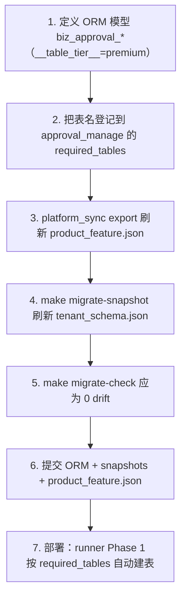
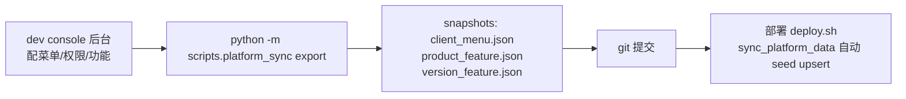
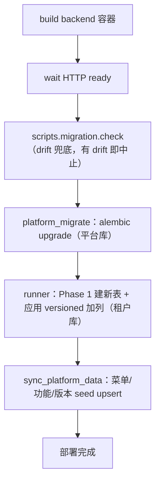

# 审批中心 - 实施方案与部署落地

> **所属阶段**：阶段七 - 审批中心
>
> **文档状态**：方案设计（首版）
>
> **优先级**：高（决定能否安全上线、平滑灰度）
>
> **创建日期**：2026-06-10
>
> **关联文档**：
>
> - [01.审批引擎核心设计](01.审批引擎核心设计.md)（新增表清单）
> - [04.组织模型扩展依赖](04.组织模型扩展依赖.md)（加列迁移）
> - 项目级强制规范：[backend/scripts/migration/README.md](../../../../backend/scripts/migration/README.md)、[.cursor/rules/database-migration.mdc](../../../../.cursor/rules/database-migration.mdc)

## 一、目标

把审批中心的设计安全地落到智途现有的**自动化迁移 / 部署 / 种子**体系里，避免"本地建表线上没建""菜单没同步""老租户缺表"等历史事故。本文档给出从 **设计 → 建表 → 上线 → 灰度** 的可执行路径，并钉死每期涉及的迁移 / 种子 / 部署动作。

## 二、落地前必须分清的两类 DDL（本模块最关键结论）

智途对"ORM 改动 ↔ 迁移文件 ↔ 线上 DB"三方一致性有强约束（CI 硬阻塞 + `deploy.sh` 兜底）。审批中心同时涉及两类改动，**处理方式完全不同**：

| 类别 | 本模块的内容 | 是否写 versioned migration | 落地机制 |
|------|-------------|--------------------------|---------|
| **新增整表** | 审批引擎全部 `biz_approval_*` 表 | **不写**迁移文件 | `runner.py` Phase 1 依据 `sys_product_feature.required_tables` 自动建表；只需登记表名 + 刷 snapshot |
| **现有表加列** | 04 组织扩展：`biz_department.leader_user_id`、`biz_user.supervisor_user_id` | **必须写** versioned migration | `make migrate-new-tenant` 生成 + 人工 review + 刷 snapshot |

> 依据 README §7"常见场景速查"：**新增表不需要写迁移文件**（runner Phase 1 + `feature.required_tables` 自动建表），只需更新 snapshot；**新增列**必须生成 versioned migration。

### 2.1 平台库 vs 租户库

| 改动 | 落库 | 通道 | 命令 |
|------|------|------|------|
| `biz_approval_*` 新表 | 租户业务库 `zt_biz_*` | runner（tenant） | 登记 `required_tables` + `make migrate-snapshot` |
| 组织扩展加列 | 租户业务库 | runner（tenant） | `make migrate-new-tenant` |
| 菜单 / 功能 / 版本授权 | 平台库 `zt_platform` | alembic + platform_sync | `platform_sync export` → seed |

## 三、新增审批表的落地步骤（引擎基座，第 1 期）



详解：

1. **新建 ORM 模型**：在 `backend/app/modules/client/models/approval/` 下定义 `biz_approval_flow / flow_node / instance / instance_node / task / record / cc`，继承 `TenantModelBase`，`__table_tier__ = "premium"`，并在 `models/__init__.py` 注册。
2. **登记 `required_tables`**：把上述表名加入 `approval_manage` 功能的 `required_tables`（在 dev console 配置或经 `platform_sync`），使 runner Phase 1 在启用该功能的租户库自动建表。
3. **导出快照**：`cd backend && python -m scripts.platform_sync export` 刷新 `scripts/platform_sync/snapshots/product_feature.json`。
4. **刷新 schema 快照**：`make migrate-snapshot`（或 autogen tenant）刷新 `scripts/migration/snapshots/tenant_schema.json`，让新表被 drift check 认可。
5. **drift 校验**：`make migrate-check` 返回 0（ORM ↔ snapshot 对齐），否则 CI 会硬阻塞。
6. **提交**：ORM 文件 + `snapshots/tenant_schema.json` + `product_feature.json`（**不需要** `scripts/migration/versions/*.py`）。
7. **存量租户补建**：已激活租户若未走版本激活流程，可参照 `scripts/fix/fix_social_capacity_tables.py` 写一次性补表脚本（幂等，按 information_schema 自检）。

> 参考既有先例：`scripts/migration/versions/20260525_001_add_social_capacity_tables.py` 的 `upgrade()` 体内只有注释 + `pass`——明确说明"新表由 runner Phase 1 自动建表"。审批表沿用同一范式。

## 四、组织扩展加列的落地步骤（第 2 期）

严格按 README §3 强制流程（详见 [04.组织模型扩展依赖](04.组织模型扩展依赖.md) §五）：

1. 改 ORM：`biz_department` 加 `leader_user_id`、`biz_user` 加 `supervisor_user_id`（**nullable**）。
2. `make migrate-check` → 有 drift。
3. `make migrate-new-tenant name="add org approver fields"` 生成 `scripts/migration/versions/<id>.py` + 自动刷 snapshot。
4. 人工 review：可空 / 无回填 / 无类型截断 / 无新唯一约束（NOT NULL 列才需回填，本扩展不涉及）。
5. `make migrate-apply-local` 本地验证。
6. 一并提交：ORM + versioned migration + snapshot。
7. （可选）`scripts/fix/` 回填脚本：`leader` 文本 → `leader_user_id` 模糊匹配。

## 五、菜单与权限点同步

### 5.1 现状

审批中心菜单已在 [_build_v2_menus.py](../../../../backend/scripts/seed/_build_v2_menus.py) 预留（我的待办 / 我的申请 / 审批记录 + 企业管理下的审批流程配置），`feature_code` = `approval_manage` / `approval_config`，归属专业版（pro）。

### 5.2 需补登

- 审批操作按钮权限点：`approval:approve` / `reject` / `withdraw` / `transfer` / `addsign` / `cc`。
- 流程配置权限点：`approval:config:list` / `create` / `update` / `publish` / `disable`。

### 5.3 同步流程（平台库）



> 菜单/功能/版本均以 `platform_sync` 导出的快照为唯一事实源；`seed_product_features.py` / `seed_client_menus.py` 在部署时做幂等 upsert。**不要**手编 snapshot。

## 六、功能开关与灰度

| 开关 | 控制 | 机制 |
|------|------|------|
| `approval_manage` | 待办 / 申请 / 记录入口 | `sys_version_feature` 归 pro；租户授权后下发到 `/auth/user-info` 的 `features[]` |
| `approval_config` | 审批流程配置入口 | 同上 |
| 前端入口显隐 | 页面/按钮 | `userStore.hasFeature('approval_manage' / 'approval_config')` |
| 按租户灰度 | 哪些租户启用 | 通过版本授权 / 单租户功能授权控制，逐户开放 |
| 按场景灰度 | 哪些 `biz_type` 接入 | 业务侧"是否提交审批中心"由该 `biz_type` 是否配置了已发布模板决定；未配置则保持原有直通逻辑 |

> 灰度策略：第 1 期只对 1 个试点租户 + 1 个场景（任务费用单）开启，验证闭环后再扩面。

## 七、种子数据

| 种子 | 内容 | 落地脚本 |
|------|------|---------|
| 字典 | 审批人类型 / 节点类型 / 签署方式 / 实例状态 / 任务状态 / 动作类型 | [seed_client_dicts.py](../../../../backend/scripts/seed/seed_client_dicts.py) |
| 默认流程模板（可选） | 为试点 `biz_type` 内置一套"部门主管单签"默认模板，避免空配置阻断 | 新增 seed 或随接入脚本 |

## 八、部署链路与三道防线

智途迁移规范的三道防线，审批中心一并受益：

```
本地 pre-commit（软提示） → CI migration-check（硬阻塞） → deploy.sh（兜底拒绝部署）
```

`deploy.sh update` 关键链路：



- 新表（审批引擎）在 runner Phase 1 自动建立。
- 加列（组织扩展）由 runner 应用 versioned migration。
- 菜单/权限/功能由 sync_platform_data 落地。
- drift check 兜底：若 ORM 与 snapshot 不一致直接中止部署。

## 九、上线检查清单

部署后逐项核对：

- [ ] `make migrate-check` / `scripts.migration.check` 返回 **0 drift**
- [ ] 试点租户库已存在全部 `biz_approval_*` 表（`runner --dry-run` 或连库核对）
- [ ] 组织扩展列已生效（`biz_department.leader_user_id` / `biz_user.supervisor_user_id`，第 2 期）
- [ ] `/auth/user-info` 对试点用户返回 `features` 含 `approval_manage`（已授权）
- [ ] 审批中心三页菜单可见、可访问（非 PlaceholderPage）
- [ ] 审批操作 / 流程配置权限点已同步，按钮按权限显隐
- [ ] 已为试点 `biz_type` 配置并发布至少一套流程模板
- [ ] 端到端回归：试点场景"提交 → 多级流转 → 通过/拒绝/撤回 → 回调推进业务状态"全链路通过
- [ ] 回调失败回滚验证：故意让 `on_approved` 抛错，确认审批不进终态、业务状态不变

## 十、分期实施步骤表

| 期次 | 目标 | 迁移动作 | 种子/平台同步 | 部署关注点 |
|------|------|---------|--------------|-----------|
| **第 1 期** | 引擎基座 + 任务费用单试点 | 新增 `biz_approval_*` 表（登记 `required_tables` + 刷 snapshot，不写迁移文件） | 字典种子 + 权限点同步 + 试点租户授权 `approval_manage` | runner Phase 1 建表；灰度 1 租户 1 场景 |
| **第 2 期** | 组织扩展 + 动态审批人 | `make migrate-new-tenant` 加 `leader_user_id` / `supervisor_user_id`（加列） | 组织/员工页维护入口；`user-info` 返回部门 | versioned migration 应用；可选回填脚本 |
| **第 3 期** | 可视化流程配置 + 条件/或签/会签 | 无表变更（纯前端 + 已有引擎能力） | `approval_config` 授权扩面 | 前端发布；模板配置培训 |
| **第 4 期** | 财务模块全面接入 | 财务单据表加 `approval_instance_id`（按需加列） | 各财务 `biz_type` 模板与渲染模板 | 按财务单据类型分批接入 |

## 十一、风险与回滚

| 风险 | 缓解 |
|------|------|
| 新表未在老租户建好 | runner Phase 1 幂等建表 + `scripts/fix/` 补表脚本兜底 |
| 加列在大表上锁表 | 列可空、无默认回填，ALTER 轻量；必要时低峰执行 |
| 业务回调引入耦合/故障 | 回调注册表隔离 + 同事务回滚；单 `biz_type` 单 callback 易定位 |
| 灰度期双轨（部分场景走审批、部分直通） | 由"是否配置已发布模板"自动切换，未配置保持原逻辑，零侵入回退 |
| 误改已合并 migration | 遵守规范：只加新 `MIGRATION_ID` 反向修正，不改历史文件 |

> 回滚原则：审批中心是**增量旁路**——未接入的场景完全不受影响；某场景出问题，停用其流程模板即可让该场景回退到原直通逻辑，无需回滚数据库。
