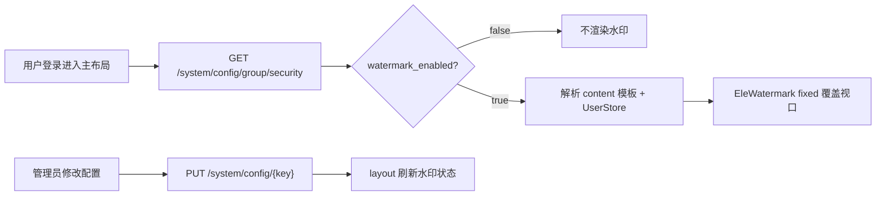

# 企业端系统设置 - 系统水印设置

> **所属阶段**：阶段三 - 企业端系统设置
>
> **文档状态**：已实现（首版，待业务验收）
>
> **创建日期**：2026-06-12
>
> **优先级**：高（涉及企业业务数据外传防护）
>
> **关联文档**：
>
> - [00.模块总览](00.模块总览.md)
> - [03.数据库设计/06.biz_system_config.sql](../../../03.数据库设计/02.租户业务库数据表/06.biz_system_config.sql)
> - 前端配置页 [`enterprise/config`](../../../../frontend/client/src/views/enterprise/config/)
> - 水印组件 [`ele-watermark`](../../../../frontend/client/components/ele-watermark/index.vue)

## 一、功能概述

业务运营系统涉及大量企业敏感数据（运单、客户、运费、运力等）。为降低员工通过截图、拍照等方式外传数据的风险，需在企业端 Web 页面集成**可配置的页面水印**，使泄露内容具备**用户身份可追溯性**。

核心设计原则：

- **租户级策略**：企业管理员在「系统设置 → 水印设置」统一配置，对该租户下所有登录用户生效
- **动态内容**：水印文本支持变量模板，运行时按当前登录用户与当前时间解析
- **全局覆盖**：在 layout 层以 `fixed` 方式覆盖侧栏、顶栏、内容区及分页空白区域（对齐产品参考效果图）
- **防轻易移除**：复用 `EleWatermark` 组件内置的防删节点、防篡改样式能力
- **默认关闭**：新租户默认不启用水印，由有安全诉求的企业自行开启

### 显示范围决策（已确认）

| 方案 | 结论 |
|------|------|
| **租户级全局显示** | **首期采用** — 防截图无盲区，实现简单，与参考图一致 |
| 按业务模块勾选 | **不纳入首期** — 易留安全漏洞，模块清单维护成本高 |

**首期例外页面：**

| 页面 | 是否显示水印 | 说明 |
|------|-------------|------|
| 登录页 `/login` | 否 | 未登录无用户身份 |
| 登录后主布局内所有业务页 | 是 | 含运单、审批、系统设置等 |
| 系统设置 · 水印设置页 | 是 | 配置区下方提供「效果预览」便于调参 |
| 全屏外链 / 独立窗口 | 不强制 | 若有则按实际路由评估 |

## 二、业务背景

### 2.1 核心诉求

1. **威慑与溯源**：水印含用户标识信息，降低随意截图外传意愿；外传后可辅助追溯来源
2. **可自定义**：管理员可配置水印文本模板与视觉风格（字号、透明度、角度、间距）
3. **低侵入接入**：不改动各业务页面，在 layout 层一次性挂载

### 2.2 与现有配置模式的关系

本功能沿用运单敏感信息开关的端到端模式：

```
系统设置页修改 → PUT /system/config/{key} → biz_system_config
                                              ↓
                                    layout 读取 security 分组 → 全局 EleWatermark
```

参考实现：[`waybill-settings.vue`](../../../../frontend/client/src/views/enterprise/config/components/waybill-settings.vue)（开关 + tooltip + 即时保存）。

### 2.3 技术资产

| 资产 | 路径 | 说明 |
|------|------|------|
| 水印组件 | `frontend/client/components/ele-watermark/` | 支持 content / gap / rotate / font / fixed / disabled |
| 演示页 | `frontend/client/src/views/extension/watermark/index.vue` | 基本用法、多行、图片水印示例 |
| 配置 API | `frontend/client/src/api/system/config/` | `listConfigs` / `listConfigsByGroup` / `updateConfig` |
| 用户信息 | `GET /auth/user-info` | 提供 nickname、phone、tenantName 等变量来源 |

### 2.4 安全边界说明（诚实约束）

- 前端 DOM 水印**无法**阻止操作系统级截屏、录屏或物理拍照完全绕过
- 水印主要起**威慑、标识、溯源辅助**作用；敏感字段的后端脱敏（如 `waybill.list_show_freight_amount`）仍须保留
- 水印层须 `pointer-events: none`，不得阻挡正常点击操作

## 三、需求详情

### 3.1 配置入口

| 项 | 说明 |
|---|---|
| 菜单路径 | 系统设置 → 左侧分组「水印设置」 |
| 路由 | `/enterprise/config`（选中 `security` 分组） |
| 权限 | 与现有系统设置一致（企业管理员 / 具备 `base_config` 菜单权限） |
| 保存方式 | 单项变更即调用 `PUT /system/config/{key}`，成功提示「保存成功」 |

### 3.2 配置项

存储于 `biz_system_config`，`config_group = security`。

| config_key | value_type | 默认值 | 说明 |
|---|---|---|---|
| `system.watermark_enabled` | boolean | `false` | 是否启用水印 |
| `system.watermark_content` | string | `{nickname} {phoneLast4} {date}` | 水印文本模板，支持变量与固定文本混写 |
| `system.watermark_style` | json | 见 §3.2.2 | 显示风格：字号、颜色、旋转、间距等 |

#### 3.2.1 内容模板变量

| 变量 | 解析来源 | 示例 | 规则 |
|---|---|---|---|
| `{nickname}` | `/auth/user-info` → `nickname` | 张三 | 为空时替换为 `-` |
| `{realName}` | 同上（client 端 nickname 即 `biz_user.real_name`） | 张三 | 与 nickname 同源，便于模板语义化 |
| `{phone}` | `User.phone` | `138****8179` | **默认脱敏**：保留前 3 后 4，中间 `****` |
| `{phoneLast4}` | `User.phone` 末四位 | `8179` | 不足四位则原样或 `-` |
| `{tenantName}` | `User.tenantName` | XX物流 | 为空时 `-` |
| `{date}` | 客户端当前日期 | `2026-06-12` | 格式 `YYYY-MM-DD` |
| `{datetime}` | 客户端当前时间 | `2026-06-12 14:30` | 格式 `YYYY-MM-DD HH:mm` |

**模板规则：**

- 支持固定文本 + 多个变量，例如：`{tenantName} {nickname} {date}`
- 支持多行：模板中含 `\n` 时，解析为多行 `content: string[]` 传给 `EleWatermark`
- 未知变量：保留原文或替换为空，**不阻断**页面渲染
- 默认模板 `{nickname} {phoneLast4} {date}`：兼顾溯源与隐私（参考效果图类似账号 + 标识）

#### 3.2.2 默认 style JSON

```json
{
  "fontSize": 14,
  "color": "rgba(0, 0, 0, 0.12)",
  "rotate": -22,
  "gap": [200, 160],
  "zIndex": 9999
}
```

| 字段 | 类型 | 可配置范围（UI） | 说明 |
|---|---|---|---|
| `fontSize` | number | 12 ~ 24 | 字号（px） |
| `color` | string | rgba | 含透明度，浅色主题默认 `rgba(0,0,0,0.12)` |
| `rotate` | number | -45 ~ 0 | 旋转角度（度） |
| `gap` | [number, number] | 水平 100~300，垂直 80~240 | 平铺间距 [gapX, gapY] |
| `zIndex` | number | 固定 9999 | 层级，高于业务内容、低于全局弹窗时可再调 |

**暗色主题**：实现时可根据 `themeStore.darkMode` 将 color 调整为 `rgba(255,255,255,0.08)` 量级，保证可读且不刺眼。

### 3.3 配置页 UI

#### 3.3.1 布局线框

```
┌─ 系统设置 ─────────────────────────────────────────────┐
│ [运单设置] [任务单设置] [水印设置]  ← 左侧分组            │
├────────────────────────────────────────────────────────┤
│ 水印设置                                                │
│ ┌──────────────────────────────────────────────────┐  │
│ │ 启用水印          [开关]     默认：关闭              │  │
│ │ 水印内容          [多行文本框]                       │  │
│ │                   [插入变量 ▼] 昵称/手机后四位/日期…   │  │
│ │ 字号              [数字输入 12-24]                   │  │
│ │ 透明度            [滑块 5% ~ 30%] → 映射到 color alpha │  │
│ │ 旋转角度          [数字输入 -45~0]                   │  │
│ │ 间距              水平 [___]  垂直 [___]             │  │
│ └──────────────────────────────────────────────────┘  │
│ 效果预览（实时，使用当前登录用户解析变量）                 │
│ ┌──────────────────────────────────────────────────┐  │
│ │  ┌────────────────────────────────────────────┐  │  │
│ │  │ 模拟表格背景 + EleWatermark 平铺            │  │  │
│ │  │ （与线上下方全局水印视觉一致）               │  │  │
│ │  └────────────────────────────────────────────┘  │  │
│ └──────────────────────────────────────────────────┘  │
└────────────────────────────────────────────────────────┘
```

#### 3.3.2 交互说明

| 交互 | 行为 |
|---|---|
| 修改开关 / 表单项 | 预览区**即时**更新；持久化仍走 `updateConfig` |
| 插入变量 | 下拉或按钮在光标处插入 `{variable}` |
| 保存失败 | 回滚表单项至旧值，错误提示 |
| 开启水印后 | 通知 layout 刷新配置（同会话内立即生效，无需重新登录） |

专用面板组件：`watermark-settings.vue`（不使用 `generic-group-settings.vue`）。

### 3.4 全局生效规则



| 项 | 说明 |
|---|---|
| 挂载位置 | `frontend/client/src/layout/index.vue`，与 `<router-layout />` 同级或外层 |
| 组件参数 | `fixed: true`、`disabled: !enabled`、`wrapPosition: false` |
| 加载时机 | 主布局 `onMounted` 拉取 `security` 分组；结果缓存于 composable |
| 配置加载失败 | fail-safe：不显示水印，不影响业务 |
| 退出登录 | 水印随 layout 卸载消失 |

### 3.5 非功能需求

| 类别 | 要求 |
|---|---|
| 性能 | security 分组配置在 layout 级缓存，避免每个业务页重复请求 |
| 无障碍 | 水印不拦截鼠标事件 |
| 兼容性 | Chrome / Edge 最新两个大版本；与 ele-admin-plus 布局共存 |
| 字符限制 | `config_value` 最长 500 字符；style JSON 仅保留上述 5 个字段 |

## 四、数据模型设计

**不新建表**，扩展 `biz_system_config`。

### 4.1 新增种子数据

| config_key | config_value | config_group | value_type | default_value |
|---|---|---|---|---|
| `system.watermark_enabled` | `false` | `security` | `boolean` | `false` |
| `system.watermark_content` | `{nickname} {phoneLast4} {date}` | `security` | `string` | `{nickname} {phoneLast4} {date}` |
| `system.watermark_style` | 见 §3.2.2 JSON 字符串 | `security` | `json` | 同上 |

### 4.2 需变更的代码文件

| 操作 | 文件路径 | 变更内容 |
|---|---|---|
| 修改 | `backend/app/modules/console/services/tenant/tenant_service.py` | 新租户 `default_configs` 增加 3 项 |
| 新增 | `backend/scripts/fix/sql/system_watermark_config.sql` | 存量租户补数据 |
| 修改 | `doc/03.数据库设计/.../06.biz_system_config.sql` | 文档同步初始 INSERT |
| 新增 | `frontend/client/src/utils/watermark.ts` | 模板解析、style 解析、手机脱敏 |
| 新增 | `frontend/client/src/utils/use-watermark-config.ts` | 配置加载与 layout 共享状态 |
| 新增 | `frontend/client/src/views/enterprise/config/components/watermark-settings.vue` | 设置面板 + 预览 |
| 修改 | `frontend/client/src/views/enterprise/config/index.vue` | 注册 `security` 面板 |
| 修改 | `frontend/client/src/views/enterprise/config/constants.ts` | 分组文案与排序 |
| 修改 | `frontend/client/src/layout/index.vue` | 全局 `EleWatermark` |

## 五、API 接口设计

认证：Bearer Token。前缀：`/api/client`。

**全部复用已有接口，无新增后端路由。**

| 方法 | 路径 | 说明 | 状态 |
|---|---|---|---|
| GET | `/system/config` | 配置页加载全部（含水印三项） | 已有 |
| GET | `/system/config/group/security` | layout 按需加载水印配置 | 已有 |
| PUT | `/system/config/{key}` | 单项保存，body: `{ configValue }` | 已有 |

**可选增强（首期不做）：** `/auth/user-info` 附带 `watermarkEnabled` 摘要，减少 layout 额外 HTTP 请求。

### 5.1 响应示例（security 分组）

```json
[
  {
    "id": 10,
    "configKey": "system.watermark_enabled",
    "configValue": "true",
    "configGroup": "security",
    "valueType": "boolean",
    "defaultValue": "false"
  },
  {
    "id": 11,
    "configKey": "system.watermark_content",
    "configValue": "{nickname} {phoneLast4} {date}",
    "configGroup": "security",
    "valueType": "string",
    "defaultValue": "{nickname} {phoneLast4} {date}"
  },
  {
    "id": 12,
    "configKey": "system.watermark_style",
    "configValue": "{\"fontSize\":14,\"color\":\"rgba(0,0,0,0.12)\",\"rotate\":-22,\"gap\":[200,160],\"zIndex\":9999}",
    "configGroup": "security",
    "valueType": "json",
    "defaultValue": "{\"fontSize\":14,\"color\":\"rgba(0,0,0,0.12)\",\"rotate\":-22,\"gap\":[200,160],\"zIndex\":9999}"
  }
]
```

## 六、前端页面设计

### 6.1 路由与菜单

| 项 | 值 |
|---|---|
| 路由 | `/enterprise/config` |
| 菜单 | 系统设置（已有） |
| 侧栏分组 | `security` → 显示名「水印设置」 |

### 6.2 组件职责

| 组件 | 职责 |
|---|---|
| `watermark-settings.vue` | 表单编辑、变量插入、实时预览、emit config-change |
| `use-watermark-config.ts` | 拉取/缓存配置、解析模板、供 layout 与设置页共用 |
| `watermark.ts` | 纯函数：变量替换、手机脱敏、style JSON 解析 |
| `layout/index.vue` | 根据 composable 渲染全局 fixed 水印 |

### 6.3 layout 集成示意

```vue
<ele-watermark
  v-if="watermarkReady"
  :content="watermarkLines"
  :gap="watermarkGap"
  :rotate="watermarkRotate"
  :font="watermarkFont"
  :z-index="watermarkZIndex"
  :fixed="true"
  :wrap-position="false"
  :disabled="!watermarkEnabled"
>
  <span aria-hidden="true" style="display: none" />
</ele-watermark>
```

## 七、测试要点

### 7.1 默认与开关

1. 新租户 / 未补数据租户：`watermark_enabled=false`，登录后全站无水印
2. 开启开关并保存：运单列表、审批、系统设置、表格底部分页空白区均可见平铺水印
3. 关闭开关：当前会话内水印立即消失

### 7.2 页面范围

1. 登录页 `/login` 无水印
2. 退出登录后水印消失
3. 水印设置页：线上水印仍显示；预览区与线上效果一致

### 7.3 模板与样式

1. 不同用户登录，水印文本中 nickname / phoneLast4 不同
2. `{phone}` 脱敏为 `138****8179` 格式
3. 修改字号、透明度、角度、间距后预览与线上一致；刷新页面配置仍生效
4. 浅色 / 深色主题下水印可读、不遮挡按钮点击

### 7.4 安全特性

1. DevTools 删除水印 DOM 节点后，`EleWatermark` 应自动重建（组件内置 mutation 监听）
2. 配置 API 失败时不影响业务页正常使用

## 八、不在本期范围

- Console 管理端、驾驶员 H5 水印
- 按业务模块 / 菜单勾选显示范围
- 图片水印、二维码水印
- 水印审计日志、截图检测
- 路由黑名单（排除帮助页等）

## 九、待确认事项（评审清单）

| # | 事项 | 推荐默认值 | 确认结果 |
|---|---|---|---|
| 1 | 显示范围 | 租户级全局 | 已采纳 |
| 2 | 默认开关 | 关闭 | 已采纳 |
| 3 | 默认内容模板 | `{nickname} {phoneLast4} {date}` | 已采纳 |
| 4 | 侧栏分组名 | 「水印设置」 | 已采纳 |
| 5 | `{phone}` 脱敏规则 | 前 3 + `****` + 后 4 | 已采纳 |
