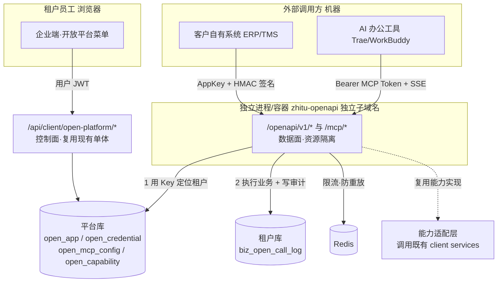
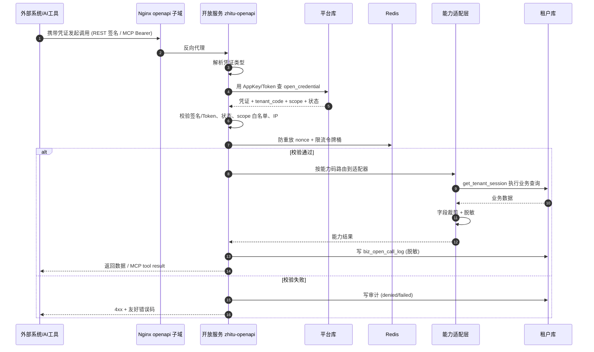

# 企业端开放平台 - 模块总览

> **所属阶段**：阶段八 - 平台开放能力建设
>
> **文档状态**：方案设计（首版）
>
> **创建日期**：2026-07-24
>
> **优先级**：高（对外集成与 AI 生态接入的统一入口）
>
> **关联文档**：
>
> - [01.架构设计/系统架构设计](../../../01.架构设计/系统架构设计.md)（§5 演进阶段：本模块落地"独立开放服务"）
> - [01.架构设计/账号体系设计](../../../01.架构设计/账号体系设计.md)（用户 JWT 与本模块的机器凭证区别）
> - [06.AI 数字人模块/00.模块总览](../06.AI%20数字人模块/00.模块总览.md)（复用工具注册 / 调用审计 / 脱敏 / 限流基线）
> - [01.运营后台/04.AI 数字员工/02.工具中心](../../01.运营后台/04.AI%20数字员工/02.工具中心.md)（`@register_tool` 注册范式参照）
>
> **本目录文档清单**：
>
> | # | 文档 | 内容 |
> |---|------|------|
> | 00 | 本文 | 模块定位、控制面/数据面分离、术语的用户化表达、菜单权限、分期 |
> | 01 | [架构与部署设计](01.架构与部署设计.md) | 独立进程/容器、独立子域名入口、与单体/Redis/租户库关系、演进路径 |
> | 02 | [认证与安全设计](02.认证与安全设计.md) | HMAC 签名、MCP Token、scope 白名单、防重放、数据安全防线、吊销 |
> | 03 | [能力目录与接口设计](03.能力目录与接口设计.md) | 能力抽象、`@register_capability`、适配层、REST 契约、版本化 |
> | 04 | [MCP 远程服务设计](04.MCP远程服务设计.md) | 远程 MCP 协议、自定义服务名、配置生成向导、Tool 映射 |
> | 05 | [调用审计与限流配额](05.调用审计与限流配额.md) | 审计模型、Redis 令牌桶限流、配额、运营观测 |
> | 06 | [数据库设计](06.数据库设计.md) | 平台库/租户库表结构、字段、索引、迁移 |
> | 07 | [前端交互与 UX 设计](07.前端交互与UX设计.md) | 菜单/页面/向导/文案，面向非技术用户的友好设计 |

## 一、模块定位与设计目标

### 1.1 定位

开放平台是智途面向**第三方系统集成**与**AI 办公工具接入**的统一对外能力出口。它把租户在系统里的数据与操作，以**受控、可审计、可计量**的方式开放出去，回答两个客户诉求：

| 客户诉求 | 开放平台的回答 |
|---------|---------------|
| "我要把智途和我自己的系统（ERP / TMS / WMS / 财务）打通" | 提供标准化 **REST 开放 API** + 应用密钥 + 接口文档，客户开发者自助对接 |
| "我要让 AI 办公工具（Trae、WorkBuddy 等）直接读写智途的数据" | 提供**远程 MCP 服务**，一段配置粘贴进 AI 工具即可，无需客户本地部署任何程序 |

一句话定位：**开放平台之于业务模块，等同于"对外插座"——只按约定的能力目录对外供电，绝不让外部直接接触内部电路（业务库与业务接口）。**

### 1.2 设计目标

| # | 目标 | 落点 |
|---|------|------|
| 1 | **资源隔离**：对外调用不与业务接口抢资源 | 数据面单独起进程/容器，独立连接池、独立限流预算、崩溃互不影响（见 `01`） |
| 2 | **架构解耦**：对外契约与内部实现分离 | 独立能力目录 + `@register_capability` 适配层，底层复用 `client` service，不重写领域逻辑（见 `03`） |
| 3 | **架构安全**：机器调用与用户登录用不同信任体系 | 机器凭证（AppKey/Secret、MCP Token）独立于用户 JWT；HMAC 签名 + 防重放（见 `02`） |
| 4 | **数据安全**：默认最小权限、可控可撤、可脱敏 | scope 白名单默认拒绝、字段级裁剪、响应脱敏、一键吊销、IP 白名单、租户物理隔离不被打破（见 `02`） |
| 5 | **可计量可观测**：每一次对外调用都留痕 | 全量调用审计 + 限流配额 + 运营侧跨租户观测（见 `05`） |
| 6 | **一份能力双通道复用**：同一能力同时服务 REST 与 MCP | 能力目录既生成 REST 接口，又映射为 MCP Tool（见 `03`、`04`） |
| 7 | **面向非技术用户友好**：用户不懂"MCP""密钥"也能用 | 业务语言包装 + 向导式接入 + 一键复制配置（见 `07`） |

### 1.3 不在本期范围

| 不做 | 原因 | 未来路径 |
|------|------|---------|
| OAuth2 授权码 / 第三方代客户授权（3-legged） | 首期是客户对接自己的系统，两方同属一个租户，无需代第三方用户授权 | 远期开放"应用市场"时引入 |
| Webhook / 事件订阅（数据变更主动推送） | 首期先打通"拉取 + 操作"，推送依赖消息基建 | 列入路线图第 2 期 |
| 写操作开放 API（创建运单、改状态等） | 写操作风险高，先以只读查询建立信任与观测基线 | 第 2 期灰度开放，复用高风险确认理念 |
| 独立开发者门户站点 / SDK 包 | 首期文档内嵌企业端即可 | 远期随生态规模扩大再建 |
| 计费与套餐（按调用量收费） | 先做免费额度内的能力开放 | 与商业化（运力宝式 feature/配额）联动，见 `05` §配额 |
| 独立 API 网关（Kong/APISIX） | 首期用独立进程 + Nginx + 应用层中间件即可满足隔离与鉴权 | 对齐架构文档阶段 3，流量增长后引入 |

## 二、两个平面：控制面 / 数据面分离

这是本模块的架构骨架，也是"服务单独起、避免抢资源"与"安全解耦"的核心。开放平台在物理与职责上拆成两个平面：

| 平面 | 职责 | 使用者 | 部署位置 | 鉴权 | 路由 |
|------|------|--------|---------|------|------|
| **控制面**（管理） | 管理接入应用、密钥、MCP 配置、看审计 | 租户员工（浏览器） | 复用现有单体 `/api/client` | 用户 JWT | `/api/client/open-platform/*` |
| **数据面**（调用） | 真正对外的 API 调用与 MCP 连接 | 外部系统 / AI 工具（机器） | **独立进程/容器** `zhitu-openapi` | AppKey+HMAC / MCP Token | `openapi.<域名>/openapi/v1/*`、`/mcp/*` |

> 关键理由：管理动作需要登录态、菜单、RBAC、操作日志，天然属于企业端 UI 后端；而对外调用面向机器、流量不可控、需资源隔离与独立信任体系，必须单独起。二者同处一个代码库，共享租户库访问、能力实现、审计与脱敏组件，实现"解耦但不重复造轮子"。

> 与现有 `/api/open`（官网/短信/邀请等**免登录公开接口**）的区别：`/api/open` 无任何调用方身份、面向匿名场景；开放平台数据面**必须持凭证**、面向具名的第三方应用，故使用全新前缀 `openapi.<域名>/openapi/*`，避免语义与安全策略混淆。

## 三、术语的用户化表达（UX 基石）

我们的用户是物流企业的管理员与业务人员，**不了解 MCP、API Key、scope 等技术术语**。全模块统一采用"技术概念 → 用户语言"的映射，界面只出现右列词汇，技术词仅作副标题辅助说明。

| 技术概念 | 界面用词 | 一句话解释（界面 tooltip） |
|---------|---------|---------------------------|
| 第三方应用 / OAuth Client | **接入应用** | "你要对接的一个外部系统或工具，就是一个接入应用" |
| API Key / AppSecret | **接入凭证** | "让外部系统证明'我是你授权的'的一把钥匙，请妥善保管" |
| scope / 权限范围 | **可用接口 / 可用能力** | "这个应用被允许读取或操作哪些数据" |
| Capability / Endpoint | **能力** | "一项可以对外开放的数据查询或操作，例如'查询运单'" |
| Rate Limit / Quota | **调用上限** | "为防止异常，单位时间内允许的调用次数" |
| MCP Server | **AI 助手接入** | "把智途接入你的 AI 办公工具，让 AI 直接帮你查数据、办业务" |
| MCP Config / server name | **助手连接 + 连接名称** | "给这条连接起个名字，方便你在 AI 工具里认出它" |
| Call Audit / Log | **调用记录** | "谁、在什么时候、调用了哪个能力、成功还是失败" |
| HMAC 签名 | （不暴露） | 在"接口文档"里以"如何签名"技术章节呈现，普通用户无需感知 |

> 详细文案与向导交互见 [07.前端交互与 UX 设计](07.前端交互与UX设计.md)。所有面向用户文案遵循项目《人性化交互提示语》规范：不甩技术黑话、给下一步行动、等待用"请稍候"。

## 四、包含的功能与页面

| 序 | 界面名称 | 路由 | 作用 | 对应技术能力 |
|---|---------|------|------|-------------|
| 1 | 概览与接入指引 | `/open-platform/overview` | 讲清"能做什么"，三条接入路径引导 | landing + 引导 |
| 2 | 接入应用与凭证 | `/open-platform/apps` | 创建应用、生成/重置凭证、配置可用接口 | AppKey/Secret + scope |
| 3 | 能力目录 | `/open-platform/capabilities` | 浏览可开放的数据与操作，按业务分类 | `open_capability` |
| 4 | 接口文档 | `/open-platform/docs` | 按能力生成的调用文档、参数、示例、签名说明 | OpenAPI 文档 |
| 5 | AI 助手接入 | `/open-platform/mcp` | 向导式生成 MCP 连接配置，自定义连接名称，一键复制 | 远程 MCP |
| 6 | 调用记录 | `/open-platform/audit` | 调用流水、成功率、热门能力、耗时统计 | `biz_open_call_log` |

> 需求补充建议（超出用户初始清单，已纳入设计）：
>
> - **概览与接入指引**（新增）：降低非技术用户上手门槛，是"用户不懂 MCP/Key"痛点的直接解法。
> - **凭证重置 / 吊销 / 有效期**（新增）：密钥泄露是开放平台最大风险，必须提供即时吊销与轮换。
> - **调用上限（限流配额）**（新增）：防止异常调用拖垮系统或被恶意刷量，是安全与稳定的底线。

## 五、菜单与权限点规划

### 5.1 菜单（客户端菜单快照 `client_menu.json`，`app_type=client`）

| 一级菜单 | 二级菜单 | 路径 | component | feature_code |
|---------|---------|------|-----------|--------------|
| 开放平台 | — | `/open-platform` | 目录 | `open_platform` |
| 开放平台 | 概览 | `/open-platform/overview` | `/open-platform/overview/index` | `open_platform` |
| 开放平台 | 接入应用 | `/open-platform/apps` | `/open-platform/apps/index` | `open_platform` |
| 开放平台 | 能力目录 | `/open-platform/capabilities` | `/open-platform/capabilities/index` | `open_platform` |
| 开放平台 | 接口文档 | `/open-platform/docs` | `/open-platform/docs/index` | `open_platform` |
| 开放平台 | AI 助手接入 | `/open-platform/mcp` | `/open-platform/mcp/index` | `open_platform` |
| 开放平台 | 调用记录 | `/open-platform/audit` | `/open-platform/audit/index` | `open_platform` |

> 一级菜单排序建议置于「服务平台 `/ecosystem`」之后（`sort_order` 约 820），与 `/ecosystem`（货源/运力/服务三大厅）明确区分：ecosystem 是**平台内的业务撮合**，open-platform 是**跨系统的技术开放**。

### 5.2 产品功能开关

`sys_product_feature` 新增：

| feature_code | 名称 | required_tables | 建议默认开通版本 |
|--------------|------|-----------------|-----------------|
| `open_platform` | 开放平台 | `["biz_open_call_log"]` | `pro` / `enterprise`（高阶版本卖点） |

> 应用与凭证元数据存平台库（见 `06`），无需随租户库建表；租户库仅新增 `biz_open_call_log` 一张审计表，故 `required_tables` 只含它。

### 5.3 权限点（按钮级，`menu_type=1`）

| 权限点 | 含义 | 归属页面 |
|--------|------|---------|
| `open:app:list` / `:create` / `:update` / `:disable` | 应用管理 | 接入应用 |
| `open:credential:create` / `:reset` / `:revoke` | 凭证生成/重置/吊销 | 接入应用 |
| `open:mcp:list` / `:create` / `:update` / `:revoke` | MCP 配置管理 | AI 助手接入 |
| `open:capability:list` | 查看能力目录 | 能力目录 |
| `open:audit:list` / `:export` | 调用记录查看/导出 | 调用记录 |

> 凭证生成/重置/吊销属高敏动作，独立成权限点，可只授予企业管理员或指定 IT 角色。

## 六、与相邻模块的协作与复用

| 能力/数据 | 来源 | 复用方式 |
|----------|------|---------|
| 能力实现（查运单/车辆/客户等业务逻辑） | `backend/app/modules/client/services/*` | 能力适配层调用，不重写 |
| 调用审计模型与查询范式 | AI 模块 `biz_ai_tool_call_log` + `AuditService` | 扩展字段后复用为 `biz_open_call_log` + 查询 |
| 响应/日志脱敏 | AI 模块 `security/desensitize.py` | 直接复用 |
| 限流实现范式 | AI 模块 `security/quota.py`（进程内滑窗） | 参考并升级为 Redis 令牌桶（多实例） |
| 权限守卫范式 | AI 模块 `security/permission_guard.py` | 参考，扩展为 scope 白名单校验 |
| 工具注册范式 | AI 模块 `@register_tool` + `ToolRegistry` | 参照实现独立的 `@register_capability` |
| 运营侧观测 UI 范式 | Console `views/ai/observe/` | 参照实现开放平台运营观测（远期） |
| 租户库切换 | `db_manager.get_tenant_session(tenant_code)` | 数据面用 Key 定位租户后直接调用 |
| 产品功能门控 | `core/permissions.py:require_feature` | 控制面菜单与接口按 `open_platform` 门控 |

## 七、端到端调用时序（REST 与 MCP）

## 八、实施分期建议

| 期次 | 目标 | 覆盖文档 | 关键交付 |
|------|------|---------|---------|
| **第 1 期** | 控制面 + 只读开放 | `01`~`03`、`06`、`07` | 独立服务骨架、应用/凭证管理、HMAC 鉴权、一批只读 REST 能力、能力目录、接口文档、调用审计、基础限流 |
| **第 2 期** | AI 生态接入 | `04` | 远程 MCP 服务、配置向导、Tool 映射、MCP Token |
| **第 3 期** | 写操作与事件 | `03` §写能力、路线图 | 灰度开放写能力（高风险确认理念）、Webhook 事件订阅 |
| **第 4 期** | 商业化与网关 | `05` §配额、`01` §演进 | 调用量计费/套餐、独立 API 网关演进、运营观测台 |

> 首期（第 1、2 期）即覆盖用户提出的全部诉求：应用+密钥、接口文档、能力目录、MCP 配置、调用审计。

## 九、开放问题

| 项 | 说明 | 倾向 |
|---|------|------|
| 数据面是否需要感知登录用户 | 机器调用无登录用户，审计里"操作人"如何体现 | 记录为"应用+凭证"，`operator=app:{appKey}`，与人类操作日志区分 |
| MCP 工具能否触发写操作 | AI 工具误操作风险 | 首期 MCP 只暴露只读能力；写能力待第 3 期高风险确认机制就绪 |
| 凭证有效期策略 | 长期有效便利 vs 安全 | 默认长期有效 + 支持设置到期 + 强制轮换提醒；MCP Token 建议 90 天轮换 |
| 独立进程与单体的代码边界 | 同库共享模型，如何防止耦合蔓延 | 数据面只依赖"能力适配层"接口，不直接 import client 内部实现细节，见 `01` §4 |
| 跨租户运营观测归属 | 开放平台调用观测放企业端还是运营端 | 租户看自己（企业端"调用记录"）；运营看全局（Console 远期观测台） |
