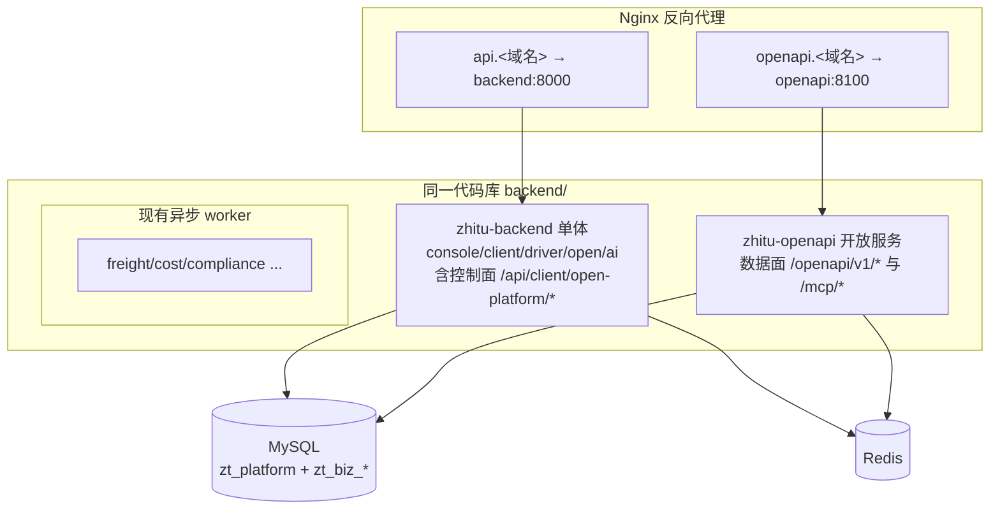
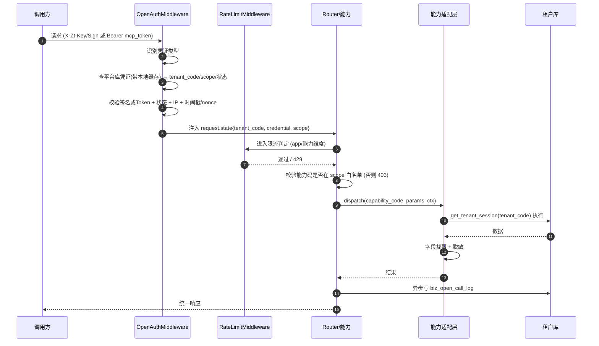
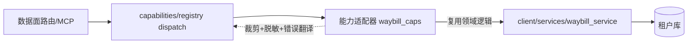

# 开放平台 - 架构与部署设计

> 上级文档：[00.模块总览](00.模块总览.md)
>
> 本文回答：开放服务如何"单独起"、如何与现有单体/Redis/租户库协作、代码如何解耦、如何部署与演进。

## 一、架构总原则

1. **控制面复用单体，数据面独立进程**：管理走 `/api/client`，调用走独立部署的 `zhitu-openapi`。
2. **同一代码库，两个进程入口**：不拆仓库、不拆微服务，避免跨库访问与能力重复实现；通过"进程隔离 + 独立 Nginx 入口"获得资源隔离与崩溃隔离。
3. **数据面无状态**：凭证、能力目录读平台库并本地缓存；业务执行按 `tenant_code` 动态切租户库；限流/防重放状态放 Redis。可水平扩容。
4. **依赖单向**：数据面依赖"能力适配层"抽象，不反向被业务模块依赖；业务模块无需感知开放平台存在。

## 二、进程与部署拓扑

现状（调研结论）：后端是 FastAPI 模块化单体，单进程承载 `console/client/driver/open/ai` 全部路由；Nginx 反代 `backend:8000`；另有若干独立 worker 容器；Redis 已配置但业务未接入。

新增数据面进程后的拓扑：



### 2.1 新增容器

`deploy/docker/docker-compose.yml` 增加一个服务（与 `zhitu-backend` 同镜像、不同启动命令与端口）：

| 项 | 值 |
|----|----|
| 容器名 | `zhitu-openapi` |
| 镜像 | 与 `zhitu-backend` 相同（同代码库） |
| 启动命令 | `uvicorn app.open_main:app --host 0.0.0.0 --port 8100 --workers N` |
| 端口 | 8100（仅集群内，经 Nginx 暴露） |
| 资源限制 | 独立 CPU/内存 limit，与业务后端隔离 |
| 依赖 | MySQL、Redis |

> 复用同一镜像意味着**零额外构建成本**；只是换了应用入口 `app/open_main.py`（只挂载开放平台数据面路由，不挂载 console/client/driver 业务路由），从而进程级隔离。

### 2.2 应用入口 `app/open_main.py`（新增，与 `app/main.py` 平级）

职责：

- 只 `include_router` 开放平台数据面路由（`/openapi/v1/*`、`/mcp/*`），**不加载** 业务后台路由，减小攻击面与内存占用。
- 挂载专属中间件链：`CORS`（放开 AI 工具来源）→ `OpenAuthMiddleware`（凭证解析与鉴权）→ `RateLimitMiddleware`（Redis 限流）→ `RequestLogMiddleware`。
- **不复用** `TenantMiddleware`（那是解析用户 JWT 的），改由 `OpenAuthMiddleware` 用凭证定位租户并注入 `request.state.tenant_code`。

```python
# 伪代码，示意入口结构，非最终实现
app = FastAPI(title="智途开放平台", docs_url=None)  # 生产关闭内置 docs
app.add_middleware(CORSMiddleware, allow_origins=OPEN_CORS_ORIGINS, ...)
app.add_middleware(RequestLogMiddleware)
app.add_middleware(RateLimitMiddleware)      # Redis 令牌桶
app.add_middleware(OpenAuthMiddleware)       # 凭证 → tenant_code + scope
app.include_router(openapi_v1_router, prefix="/openapi/v1")
app.include_router(mcp_router, prefix="/mcp")
```

### 2.3 Nginx 入口

`deploy/nginx/` 新增 `openapi.conf`，独立 server 块绑定子域名 `openapi.<域名>`：

- 独立 TLS 证书。
- 独立 `limit_req`（边缘粗粒度防洪）与 `client_max_body_size`。
- 反代 `openapi:8100`。
- CORS 预检直接透传给应用处理（应用层精确控制来源）。

> 为何用**子域名**而非主域名 `/openapi/` 路径：MCP 远程地址需长期稳定且独立可控（独立 TLS、CORS、限流、可单独下线维护而不影响业务），对 AI 工具也更清晰。

## 三、请求生命周期（数据面）



## 四、代码组织与解耦边界

新增后端模块 `backend/app/modules/open_platform/`：

```
backend/app/
├── open_main.py                    # 数据面进程入口 (新增，与 main.py 平级)
└── modules/open_platform/
    ├── api/
    │   ├── v1/                      # 数据面 REST 路由 (/openapi/v1/*)
    │   └── mcp/                     # 数据面 MCP 路由 (/mcp/*)
    ├── management/                  # 控制面：挂到 /api/client/open-platform/*
    │   ├── api/                     # 应用/凭证/MCP/审计的管理接口
    │   └── services/
    ├── auth/                        # OpenAuthMiddleware、签名校验、凭证解析
    ├── ratelimit/                   # Redis 令牌桶
    ├── capabilities/                # 能力注册表 + @register_capability + 各能力实现
    │   ├── registry.py
    │   ├── waybill_caps.py
    │   ├── vehicle_caps.py
    │   └── ...
    ├── mcp/                         # MCP Server 协议实现 (SSE/Streamable HTTP)
    ├── models/
    │   ├── platform/                # open_app / open_credential / open_mcp_config / open_capability
    │   └── tenant/                  # biz_open_call_log
    ├── schemas/
    └── services/                    # 审计写入、凭证签发等共享服务
```

### 4.1 控制面如何挂到单体

`app/main.py` 中，client 路由聚合处新增：

```python
# app/modules/client/api/__init__.py 或 main.py 聚合处
from app.modules.open_platform.management.api import router as open_mgmt_router
client_router.include_router(
    open_mgmt_router,
    prefix="/open-platform",
    dependencies=[Depends(require_feature("open_platform"))],
)
```

控制面复用现有 `get_current_user`（用户 JWT）、`get_platform_db`/`get_tenant_db`、`@operation_log`、RBAC，与其它企业端模块一致。

### 4.2 数据面对业务的依赖：只穿过"能力适配层"

**铁律**：

- 数据面 REST/MCP 路由 **只调用** `capabilities/registry.py` 暴露的 `dispatch(code, params, ctx)`，不直接 import `client` 内部 service。
- 能力适配器（`waybill_caps.py` 等）**可以** import 并调用 `client` 的查询 service（复用领域逻辑），但适配器负责：入参校验、字段裁剪、脱敏、把内部异常翻译为对外错误码。
- 业务模块（`client`）**绝不**依赖 `open_platform`。

这样对外契约（能力目录）与内部实现之间隔了一层适配器，内部重构不破坏对外契约，对外契约演进也不侵入业务代码。



## 五、与 Redis 的关系

Redis 当前已在 compose 与 config 中就绪但业务未使用。开放平台是其首个正式使用方：

| 用途 | Key 设计（示意） | TTL |
|------|----------------|-----|
| 防重放 nonce | `op:nonce:{appKey}:{nonce}` | 时间戳窗口（如 5min） |
| 限流令牌桶（应用维度） | `op:rl:app:{appKey}` | 滑动窗口 |
| 限流令牌桶（能力维度） | `op:rl:cap:{appKey}:{capCode}` | 滑动窗口 |
| 凭证解析缓存 | `op:cred:{appKey}` | 短 TTL（如 60s）+ 吊销时主动失效 |

> 凭证缓存需在"吊销/重置/停用"时由控制面主动删除对应 Key，保证吊销秒级生效（见 `02` §吊销）。

## 六、配置项（新增环境变量建议）

| 变量 | 说明 |
|------|------|
| `OPEN_PLATFORM_BASE_URL` | 对外基础地址，如 `https://openapi.zhitu.com`，用于生成文档示例与 MCP 配置 |
| `OPEN_CORS_ORIGINS` | 允许的跨域来源（AI 工具/客户前端），逗号分隔 |
| `OPEN_SIGN_TS_WINDOW_SEC` | HMAC 时间戳容忍窗口，默认 300 |
| `OPEN_RATE_LIMIT_DEFAULT_QPS` | 应用默认 QPS 上限 |
| `OPEN_RATE_LIMIT_DEFAULT_DAILY` | 应用默认日调用上限 |
| `OPEN_MCP_TOKEN_TTL_DAYS` | MCP Token 建议有效期，默认 90 |

复用现有 `REDIS_*`、`DB_*`、`APP_SECRET_KEY`（用于凭证加密派生）等既有配置。

## 七、演进路径

| 阶段 | 形态 | 触发条件 |
|------|------|---------|
| 当前设计 | 独立进程 `zhitu-openapi` + Nginx + 应用层鉴权/限流 | 首期 |
| 中期 | 数据面多副本水平扩容（无状态 + Redis 共享） | 调用量上升 |
| 远期 | 引入独立 API 网关（Kong/APISIX）承接边缘鉴权/限流/配额，数据面聚焦能力执行 | 对齐架构文档阶段 3，接入方规模化 |

> 采用独立进程而非直接上网关，是"渐进式解耦"：先用最小成本拿到资源隔离与安全隔离，待规模与需求明确后再引入重型网关，避免过度工程。
