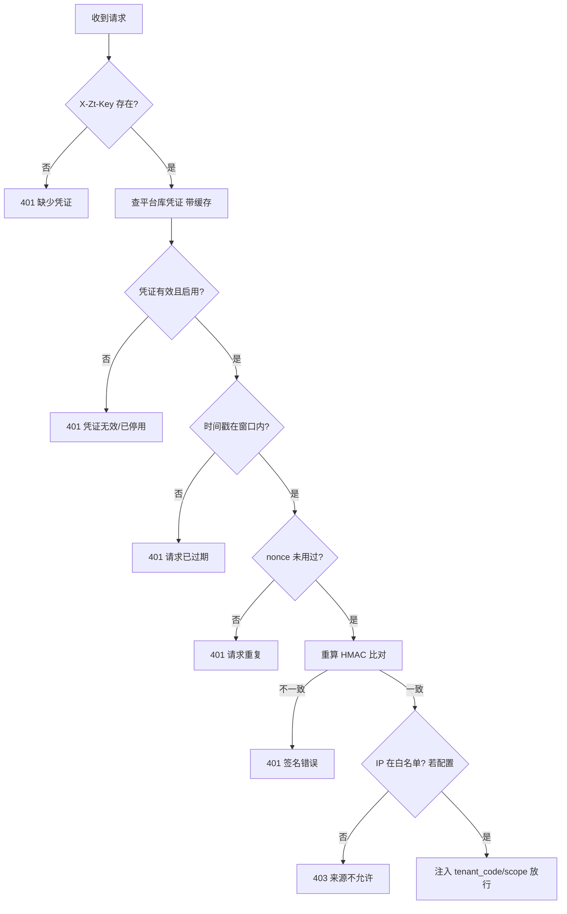
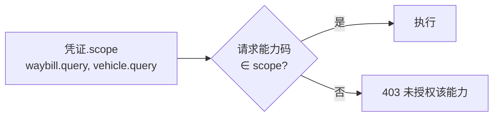
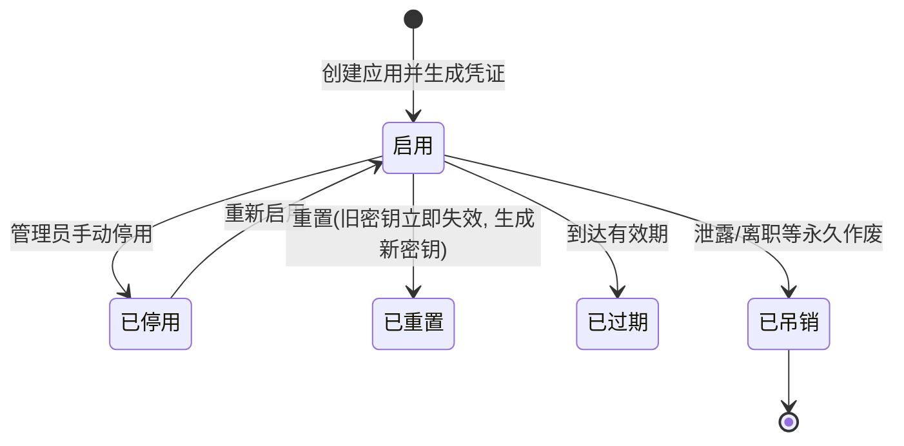

# 开放平台 - 认证与安全设计

> 上级文档：[00.模块总览](00.模块总览.md)
>
> 本文回答：外部调用方如何证明身份、如何授权、如何防重放/防泄露、如何保障数据安全、如何即时吊销。

## 一、信任模型：机器凭证独立于用户 JWT

现有账号体系是"手机号登录 → 用户 JWT（含 tenant_code/roles）"，面向**人**。开放平台面向**机器**（外部系统、AI 工具），二者信任基础不同，**绝不复用同一套 Token**：

| 维度 | 用户 JWT（现有） | 开放平台凭证（新增） |
|------|-----------------|---------------------|
| 主体 | 自然人用户 | 接入应用（machine） |
| 签发 | 登录成功后签发 | 租户管理员在控制面创建应用时签发 |
| 载体 | `Authorization: Bearer <jwt>` | AppKey+HMAC 签名 / MCP Bearer Token |
| 生命周期 | 2h/7d（access/refresh） | 长期有效 + 可设到期 + 可轮换/吊销 |
| 权限 | 角色/菜单/feature | scope 能力白名单 + IP 白名单 |
| 定位租户 | JWT 内 `tenant_code` | 凭证在平台库关联 `tenant_code` |

## 二、两类凭证与两种鉴权方式

同一个"接入应用"下可签发两类凭证，服务不同场景：

| 凭证类型 | 场景 | 鉴权方式 | 原因 |
|---------|------|---------|------|
| **API 凭证**（AppKey + AppSecret） | 客户自有系统对接 | **HMAC-SHA256 请求签名** | 客户系统可编程，能做签名；签名不上行密钥，最安全 |
| **MCP 凭证**（MCP Token） | AI 工具接入（Trae/WorkBuddy） | **Bearer Token** | 第三方 AI 工具只支持在请求头放 Token，无法自定义签名逻辑 |

### 2.1 AppKey / AppSecret

- `AppKey`：公开标识，格式 `ak_<随机>`，可出现在日志/配置中。
- `AppSecret`：机密，格式 `sk_<高熵随机>`，**仅在生成时明文展示一次**，库内只存哈希（HMAC-SHA256 with `APP_SECRET_KEY`，或 bcrypt）。用户遗失只能重置，不能找回。

### 2.2 MCP Token

- 格式 `mcp_<高熵随机>`，绑定一个 MCP 配置 + scope。
- 库内存哈希；生成时展示一次并写入给用户复制的 MCP JSON。
- 建议 90 天轮换，到期前控制面提醒。

## 三、HMAC 签名协议（API 凭证）

### 3.1 请求头

| Header | 说明 |
|--------|------|
| `X-Zt-Key` | AppKey |
| `X-Zt-Timestamp` | 请求 Unix 秒级时间戳 |
| `X-Zt-Nonce` | 随机串（每次唯一），防重放 |
| `X-Zt-Sign` | 签名值（十六进制） |

### 3.2 签名串构造与计算

```
待签名串 stringToSign =
  method + "\n" +
  path + "\n" +
  canonicalQuery + "\n" +        # query 参数按 key 字典序拼接
  sha256Hex(body) + "\n" +       # body 的 sha256（无 body 则空串的 sha256）
  timestamp + "\n" +
  nonce

sign = HMAC_SHA256(stringToSign, AppSecret)  # 输出 hex
```

服务端用同一算法重算比对，一致才放行。

### 3.3 校验步骤（服务端，`OpenAuthMiddleware`）



- **防重放**：时间戳窗口（默认 ±5min）+ Redis nonce 去重（TTL=窗口时长）。
- **恒定时间比较**：签名比对用 `hmac.compare_digest`，防时序攻击。

### 3.4 对用户屏蔽复杂度

普通用户无需理解签名。接口文档页提供：多语言签名示例代码（Java/Python/Node/PHP）、在线调试器、Postman/OpenAPI 导出。签名逻辑由客户开发者一次性接入。

## 四、授权：scope 能力白名单（"可用接口"）

- 每个凭证绑定一组**能力码白名单**（`scope`，JSON 数组），例如 `["waybill.query", "vehicle.query"]`。
- 中间件放行后，路由层校验当前能力码是否在白名单内，**默认拒绝**（未勾选即不可调用）。
- 用户在"接入应用"里勾选"可用接口"即配置 scope（满足需求点 3）。
- MCP 凭证的 scope 决定它向 AI 工具暴露哪些 Tool。



## 五、数据安全防线（纵深防御）

外部开放数据，最大风险是**越权访问**与**数据泄露**。设计多层防线，任一层失效仍有兜底：

| # | 防线 | 作用 | 落点 |
|---|------|------|------|
| 1 | 产品功能门控 | 未购买 `open_platform` 的租户整个模块不可用 | `require_feature` |
| 2 | 凭证有效性 | 停用/吊销/过期立即失效 | `OpenAuthMiddleware` + Redis 缓存失效 |
| 3 | scope 白名单 | 默认拒绝，只开放显式勾选的能力 | 路由层校验 |
| 4 | IP 白名单（可选） | 限制调用来源网段 | 中间件 |
| 5 | 租户物理隔离 | 凭证绑定单一 `tenant_code`，只能切到本租户库 | `get_tenant_session(tenant_code)`，无跨租户能力 |
| 6 | 字段级裁剪 | 能力声明对外可见字段，其余不返回 | 能力适配器 |
| 7 | 响应脱敏 | 手机号/身份证/银行卡等默认脱敏 | 复用 AI `desensitize.py` |
| 8 | 限流配额 | 异常高频调用被拦截，遏制批量爬取 | Redis 令牌桶（见 `05`） |
| 9 | 全量审计 | 所有调用留痕，可事后追溯与告警 | `biz_open_call_log`（见 `05`） |
| 10 | 传输加密 | 全程 HTTPS，密钥不落明文 | Nginx TLS + Secret 存哈希 |

### 5.1 租户隔离铁律

凭证在平台库唯一绑定一个 `tenant_code`。数据面用凭证定位租户后，**只能**通过 `get_tenant_session(该 tenant_code)` 访问对应租户库，无任何跨租户查询路径。开放平台不改变现有"数据库分库"隔离模型。

### 5.2 字段裁剪与脱敏

- 能力目录为每个能力声明 `output_fields`（对外可见字段集）与 `sensitive_fields`（需脱敏字段）。
- 适配器返回前先按 `output_fields` 裁剪，再对 `sensitive_fields` 脱敏。
- 默认策略：涉及自然人 PII（司机手机号、身份证等）一律脱敏；如客户业务确需明文，需在能力级显式开启并记录风险确认。

## 六、凭证生命周期与吊销



- **停用/吊销/重置/过期**任一动作，控制面在写库后**主动删除 Redis 凭证缓存**（`op:cred:{appKey}`），保证秒级生效。
- 吊销为不可逆；重置生成新 Secret 并使旧的立即失效（用于"泄露了但应用还要用"）。
- 所有凭证操作写 `@operation_log`（谁在何时对哪个凭证做了什么）。

## 七、审计与告警（安全视角）

- 每次鉴权失败（签名错误、越权、限流）都落审计，标注 `status=denied/failed` 与原因码。
- 建议阈值告警（远期）：同一应用短时间大量 401/403、异常地域 IP、调用量突增，触发运营/租户通知。
- 详见 [05.调用审计与限流配额](05.调用审计与限流配额.md)。

## 八、错误码与对外提示（人性化）

对外错误对**开发者**给精确技术码（便于排障），对**控制面用户界面**给业务化文案。数据面响应示例：

```json
{ "code": "OPEN_401_SIGN", "message": "签名校验未通过，请检查密钥与签名算法", "requestId": "..." }
```

| 错误码 | 含义 | 面向机器的 message |
|--------|------|-------------------|
| `OPEN_401_NO_CRED` | 缺少凭证 | 缺少接入凭证 |
| `OPEN_401_CRED_INVALID` | 凭证无效/停用 | 凭证无效或已停用 |
| `OPEN_401_EXPIRED` | 请求过期 | 请求时间戳超出允许窗口 |
| `OPEN_401_REPLAY` | 重放 | 请求重复（nonce 已使用） |
| `OPEN_401_SIGN` | 签名错误 | 签名校验未通过 |
| `OPEN_403_SCOPE` | 越权 | 当前凭证无权调用该能力 |
| `OPEN_403_IP` | 来源不允许 | 来源 IP 不在白名单 |
| `OPEN_429_RATELIMIT` | 限流 | 调用过于频繁，请降低频率 |
| `OPEN_404_CAP` | 能力不存在/下线 | 能力不存在或已下线 |

> 数据面对机器返回技术码；控制面"调用记录"页把这些码翻译成用户能懂的说明（如"该应用没有开通这项能力，去接入应用里勾选"），遵循《人性化交互提示语》。
