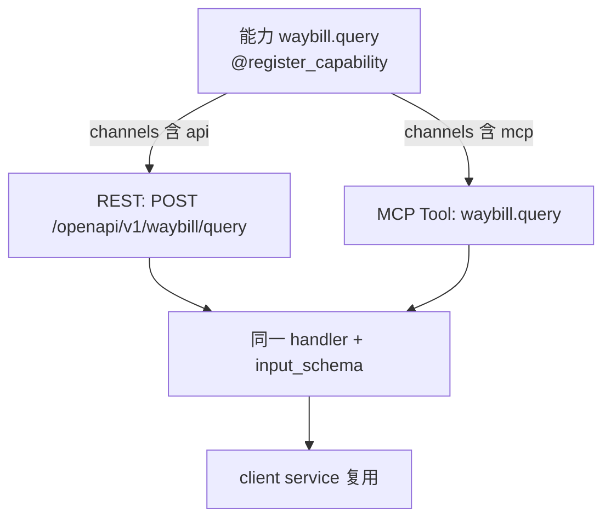
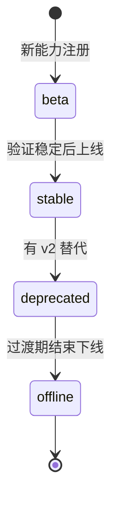

# 开放平台 - 能力目录与接口设计

> 上级文档：[00.模块总览](00.模块总览.md)
>
> 本文回答：什么是"能力"、如何注册、如何与业务解耦、REST 契约长什么样、如何版本化。

## 一、核心抽象：能力（Capability）

"能力"是开放平台对外的**最小开放单元**——一项可被外部调用的数据查询或业务操作。它是"对外契约"，不是内部接口的裸露。

一个能力包含：

| 属性 | 说明 | 示例 |
|------|------|------|
| `code` | 能力码，全局唯一，`{域}.{动作}` | `waybill.query` |
| `name` | 业务友好名称（界面展示） | 查询运单 |
| `category` | 分类（界面分组） | 运输管理 |
| `description` | 用途说明 | 按条件分页查询运单列表 |
| `channels` | 支持通道 | `["api", "mcp"]` |
| `read_only` | 是否只读 | `true` |
| `input_schema` | 入参 JSON Schema（Pydantic 导出） | 分页/筛选字段 |
| `output_fields` | 对外可见字段白名单 | 裁剪内部字段 |
| `sensitive_fields` | 需脱敏字段 | 司机手机号 |
| `required_scope` | 调用所需 scope 码（通常等于 `code`） | `waybill.query` |
| `risk_level` | 风险等级 | `low`（读）/`high`（写） |
| `default_rate_limit` | 默认限流 | QPS/日上限 |
| `stability` | 稳定性 | `stable`/`beta` |
| `version` | 契约版本 | `v1` |
| `handler` | 适配器函数 | 见 §三 |

> 能力目录是**平台策展**的：由开发注册（代码）、运营审校上下线，租户只能在已上线的能力里勾选授权，不能自定义能力。这保证对外接口质量与稳定性。

## 二、能力注册：`@register_capability`

参照 AI 模块成熟的 `@register_tool` 范式，**独立**一套能力注册器（对外契约与 AI 内部工具解耦，见 `00` §六决策）。

```python
# backend/app/modules/open_platform/capabilities/registry.py (示意)
@register_capability(
    code="waybill.query",
    name="查询运单",
    category="运输管理",
    channels=["api", "mcp"],
    read_only=True,
    input_schema=WaybillQueryInput,      # Pydantic 模型 → 自动导出 JSON Schema
    output_fields=["waybillNo", "status", "origin", "destination", "createdAt"],
    sensitive_fields=["driverPhone"],
    required_scope="waybill.query",
    risk_level="low",
    stability="stable",
    version="v1",
)
async def waybill_query(ctx: OpenContext, params: WaybillQueryInput) -> CapabilityResult:
    # 复用 client 领域逻辑，不重写
    async for db in db_manager.get_tenant_session(ctx.tenant_code):
        data = await WaybillService.page_waybills(db, **params.to_service_kwargs())
    return CapabilityResult(data=data)
```

- 启动时反射注册进内存表；可选同步元数据到平台库 `open_capability`（供控制面展示与文档生成）。
- `ctx: OpenContext` 携带 `tenant_code`、`credential`、`request_id`、`scope`，由中间件注入。
- 一次注册，`channels` 同时决定它出现在 REST 路由与 MCP Tool 列表。

### 2.1 双通道复用



一份能力定义，REST 与 MCP 两个通道共享 handler、入参 Schema、字段裁剪与脱敏，避免重复实现与契约漂移。

## 三、与业务解耦：适配器层

能力 handler 是**适配器**，职责边界清晰：

| 适配器负责 | 适配器不负责 |
|-----------|-------------|
| 对外入参校验（Pydantic） | 业务领域规则（交给 client service） |
| 调用 client 查询 service 复用逻辑 | 重写查询/计算逻辑 |
| 字段裁剪（`output_fields`） | 修改业务数据 |
| 脱敏（`sensitive_fields`） | — |
| 内部异常 → 对外错误码翻译 | — |

**依赖方向**：`open_platform` → `client`（单向）。`client` 不感知 `open_platform`。内部重构只要 service 签名兼容，对外契约不变。

## 四、REST 接口契约

### 4.1 统一约定

| 项 | 约定 |
|----|------|
| Base URL | `https://openapi.<域名>/openapi/v1` |
| 方法 | 查询类统一 `POST`（复杂筛选走 body，便于签名）；简单 GET 亦可 |
| 路径 | `/{域}/{动作}`，如 `/waybill/query` |
| 请求体 | JSON |
| 鉴权头 | `X-Zt-Key / X-Zt-Timestamp / X-Zt-Nonce / X-Zt-Sign`（见 `02`） |
| 版本 | 路径含 `v1`；不兼容变更升 `v2`，旧版并存过渡期 |

### 4.2 统一响应体

```json
{
  "code": "OK",
  "message": "success",
  "requestId": "op_20260724_abc123",
  "data": { "list": [ ], "total": 0, "page": 1, "pageSize": 20 }
}
```

- `requestId`：贯穿审计，客户报障可凭此定位。
- 错误时 `code` 为 `02` §八 的错误码，`data=null`。

### 4.3 首期能力清单（只读，建议）

| 能力码 | 名称 | 说明 | 通道 |
|--------|------|------|------|
| `waybill.query` | 查询运单 | 分页/条件查询运单 | api, mcp |
| `waybill.detail` | 运单详情 | 按单号查详情 | api, mcp |
| `vehicle.query` | 查询车辆 | 车辆列表 | api, mcp |
| `driver.query` | 查询司机 | 司机列表（PII 脱敏） | api, mcp |
| `customer.query` | 查询客户 | 客商列表 | api, mcp |
| `task.query` | 查询任务单 | 运输任务单列表 | api, mcp |
| `capacity.query` | 查询运力 | 自有/社会运力 | api, mcp |
| `dict.query` | 查询数据字典 | 状态码/枚举含义，便于对接方解析 | api, mcp |

> 只读优先：先以查询能力建立信任与观测基线；写能力（创建运单、改状态等）待第 3 期，借鉴 AI"高风险确认"理念灰度开放。

### 4.4 分页与筛选

- 统一 `page` / `pageSize`（上限如 100）；游标分页远期可选。
- 筛选字段由各能力 `input_schema` 定义，只暴露安全、必要的过滤维度。
- 时间范围、状态枚举等复用业务已有查询能力。

## 五、能力版本化与生命周期



- **版本**：契约不兼容变更必须升版本（`v1`→`v2`），旧版保留过渡期，不静默破坏客户对接。
- **稳定性**：`beta` 能力在文档标注，可能变更；`stable` 承诺兼容。
- **下线**：`deprecated → offline`，提前通知已授权该能力的租户。
- 能力上下线、稳定性由运营通过运营端维护（远期），首期可由代码 + 平台库同步控制。

## 六、能力目录数据来源

- **事实源**：代码里的 `@register_capability`（保证 handler 与元数据一致）。
- **展示源**：启动同步到平台库 `open_capability`（见 `06`），供控制面"能力目录"页与"接口文档"页读取，无需前端硬编码。
- 同步策略参照 AI `ToolRegistry.sync_to_db()`：启动反射 + 可手动触发同步。

## 七、接口文档生成

"接口文档"页（`/open-platform/docs`）内容全部来自能力元数据，自动生成、无需人工维护：

| 文档区块 | 数据来源 |
|---------|---------|
| 能力列表与分类 | `open_capability.category/name` |
| 请求参数说明 | `input_schema`（JSON Schema） |
| 响应字段说明 | `output_fields` + 类型 |
| 调用示例（多语言） | 模板 + BaseURL + 能力路径 |
| 签名说明 | 统一签名章节（见 `02` §三） |
| 在线调试 | 用当前租户的凭证试调（沙箱或真实只读） |

> 可选：暴露标准 OpenAPI 3.0 描述文件，供客户导入 Postman/Apifox/生成 SDK。
