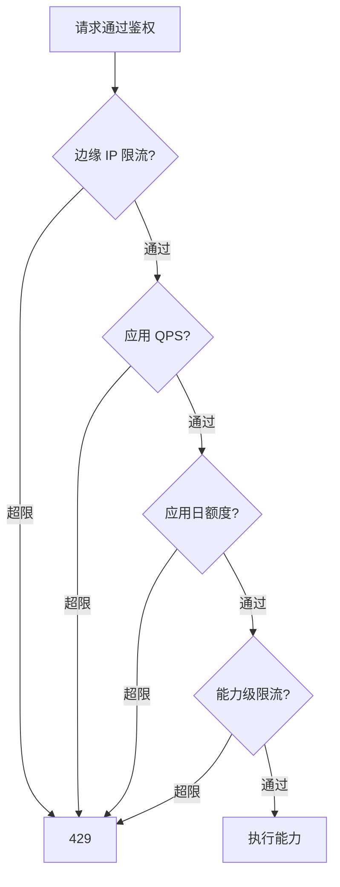

# 开放平台 - 调用审计与限流配额

> 上级文档：[00.模块总览](00.模块总览.md)
>
> 本文回答：每次调用如何留痕、租户如何看调用记录、如何限流防滥用、配额如何设计。

## 一、调用审计

### 1.1 目标

- **可追溯**：谁（哪个应用/凭证）、什么时候、调了哪个能力、成功还是失败、耗时多久、从哪来。
- **可排障**：客户报"调用失败"，凭 `requestId` 秒级定位。
- **可观测**：成功率、热门能力、耗时分布、异常趋势。
- **安全审计**：鉴权失败、越权、限流命中都留痕，供事后分析与告警。

### 1.2 存储位置

审计数据是**高频、租户可查、随租户隔离**的业务数据，存**租户库** `biz_open_call_log`（表结构见 [06.数据库设计](06.数据库设计.md)）。数据面进程按 `tenant_code` 切库写入。

> 复用 AI 模块 `biz_ai_tool_call_log` 的数据模型思路与 `AuditService` 查询范式，扩展"调用方=应用/凭证""通道=api/mcp"等字段。

### 1.3 记录字段（要点）

| 字段 | 说明 |
|------|------|
| `request_id` | 全局请求号，贯穿响应与日志 |
| `app_id` / `credential_id` | 调用方应用与凭证 |
| `channel` | `api` / `mcp` |
| `capability_code` | 能力码（越权/未命中时可能为空） |
| `method` / `path` | HTTP 方法与路径 |
| `params_masked` | 入参（脱敏后） |
| `status` | `success` / `failed` / `denied` |
| `error_code` | 见 `02` §八 错误码 |
| `http_status` | HTTP 状态码 |
| `latency_ms` | 耗时 |
| `client_ip` / `user_agent` | 来源 |
| `result_summary` | 结果摘要（如返回条数），不存全量数据 |
| `created_at` | 时间 |

> **审计本身也要脱敏**：`params_masked` / `result_summary` 复用 `desensitize.py`，绝不落敏感明文；不存完整响应体，避免审计表成为二次数据泄露源。

### 1.4 写入策略

- 调用主流程结束后**异步写入**（不阻塞响应）；失败降级为日志，不影响主调用。
- 鉴权阶段失败（如签名错误、越权）也要落审计，标注 `denied`。

### 1.5 租户侧"调用记录"页

- 按能力、状态、时间、应用、通道筛选；分页。
- 行内下钻：请求号、耗时、错误说明（技术码翻译成用户语言）。
- 顶部统计卡片：总调用量、成功率、平均耗时、Top 能力。
- 支持导出（`open:audit:export` 权限）。

### 1.6 运营侧观测（远期）

参照 Console `views/ai/observe/`，做跨租户开放平台观测台：调用量排行、异常租户、限流命中率，供运营运维与容量规划。

## 二、限流

### 2.1 为何必须限流

开放数据面向机器，一旦对接方代码 bug 或恶意刷量，可能：拖垮数据库、批量爬取数据、影响其他租户。限流是稳定性与数据安全的底线。

### 2.2 实现：Redis 令牌桶

数据面是可水平扩容的无状态进程，限流状态必须集中在 **Redis**（现有已配置、开放平台是首个正式使用方）。参照 AI `quota.py` 的滑窗思路，升级为分布式令牌桶。

多维度限流（由粗到细）：

| 维度 | Key（示意） | 作用 |
|------|-----------|------|
| 边缘 IP | Nginx `limit_req` | 粗粒度防洪 |
| 应用 QPS | `op:rl:app:{appKey}` | 单应用每秒/每分钟上限 |
| 应用日调用量 | `op:rl:app:daily:{appKey}:{date}` | 单应用每日总量 |
| 能力级 | `op:rl:cap:{appKey}:{capCode}` | 高开销能力单独限更严 |

命中限流返回 `429 OPEN_429_RATELIMIT`，并在响应头给 `Retry-After`。

## 三、配额

限流是"速率"，配额是"总量/资源上限"，与商业化联动。

| 配额维度 | 说明 | 默认 |
|---------|------|------|
| 应用数量 | 单租户可创建的接入应用数 | 按版本，如 pro=5 |
| 凭证数量 | 单应用凭证数 | 如 3 |
| MCP 配置数 | 单租户 MCP 连接数 | 如 3 |
| 日调用总量 | 租户/应用每日调用上限 | 按版本 |
| 可用能力范围 | 哪些能力可授权 | 按版本（高阶能力仅高版本） |

- 配额默认值随产品版本（feature）下发，参照运力宝 `QuotaService` 的"多版本取最大值、`<=0` 不限"范式。
- 超配额时控制面给业务化提示："当前版本最多创建 5 个接入应用，如需更多请升级版本或联系我们"。

## 四、与既有机制的关系

| 既有 | 复用/差异 |
|------|----------|
| AI `quota.py`（进程内滑窗） | 借鉴算法；开放平台改用 Redis 支持多实例 |
| `QuotaService`（资源上限） | 复用"版本→配额"范式做应用/凭证/调用量配额 |
| `require_feature` | 门控整个开放平台功能开关 |
| `biz_ai_tool_call_log` + `AuditService` | 数据模型与查询范式的直接参照 |
| `desensitize.py` | 审计脱敏直接复用 |

## 五、告警（远期）

- 规则：单应用短时大量 `denied`、日调用量突增、异常地域 IP、限流命中率飙升。
- 通道：租户内通知 + 运营侧看板；严重时自动临时降级该应用。
