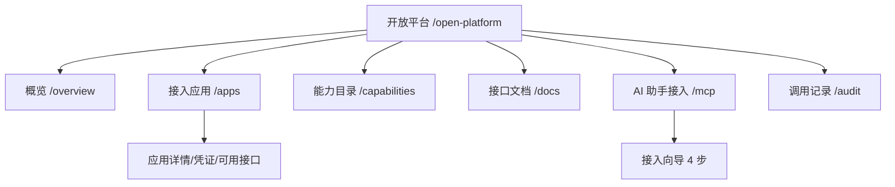

# 开放平台 - 前端交互与 UX 设计

> 上级文档：[00.模块总览](00.模块总览.md)
>
> 本文回答：页面如何组织、如何让不懂"MCP/密钥"的用户也能顺畅接入、文案如何写。

## 一、设计原则

我们的用户是物流企业的管理员与业务人员，**不是开发者**。UX 第一目标是：让不懂技术的人也能看懂"这能帮我干什么"、"我该点哪"、"下一步做什么"。

| 原则 | 落地 |
|------|------|
| 用业务语言，不甩术语 | 全站按 `00` §三术语映射；技术词只作副标题或折叠区 |
| 向导式而非表单堆砌 | 应用创建、MCP 接入都用分步向导，每步只问一件事 |
| 说清价值再谈操作 | 每个页面顶部先讲"能做什么"，再给操作区 |
| 危险动作强提示 | 密钥展示一次、吊销二次确认、明确后果 |
| 给下一步行动 | 空态、成功、失败都指向"接下来做什么" |
| 遵循人性化文案规范 | 等待用"请稍候"、失败给可行动建议 |

## 二、菜单与页面地图



前端目录（对齐现有 client 约定）：

```
frontend/client/src/
├── views/open-platform/
│   ├── overview/index.vue
│   ├── apps/index.vue + components/{app-edit, credential-dialog, scope-picker}.vue
│   ├── capabilities/index.vue
│   ├── docs/index.vue
│   ├── mcp/index.vue + components/{mcp-wizard, config-preview}.vue
│   └── audit/index.vue
├── api/open-platform/{index.ts, model/index.ts}
└── config/module-overview/open-platform.ts   # 一级模块总览卡片
```

## 三、概览与接入指引（`/overview`）

一级模块 landing，回答"这是什么、我能用它干嘛、从哪开始"。三张引导卡片：

| 卡片 | 标题 | 说明 | 主按钮 |
|------|------|------|--------|
| 1 | 对接我的系统 | 把智途和你的 ERP、财务等系统打通，数据自动流转 | 创建接入应用 |
| 2 | 让 AI 工具连接系统 | 在 Trae、WorkBuddy 等 AI 工具里，让 AI 直接帮你查数据、办业务 | 去接入 AI 助手 |
| 3 | 查看调用记录 | 随时了解谁在什么时候调用了哪些数据 | 查看调用记录 |

- 顶部一句话定位：**"开放平台让智途和你的其他系统、AI 工具连起来。"**
- 底部"接入三步走"图示：① 创建应用拿到凭证 → ② 勾选可用接口 → ③ 让开发者对接 / 或复制配置到 AI 工具。

## 四、接入应用与凭证（`/apps`）

### 4.1 列表

- 卡片/表格展示应用：名称、状态、可用接口数、凭证数、最近调用时间。
- 空态："还没有接入应用。创建一个，就能让外部系统或 AI 工具安全地访问智途数据。" + "创建接入应用"按钮。

### 4.2 创建应用向导


- **步骤 2 可用接口**：能力按分类（运输/运力/客商/基础数据）分组勾选；每项带一句话说明与"只读"标签。这就是 scope 配置（满足需求点 3）。
- **步骤 3 生成凭证**：
  - 醒目展示 AppKey + AppSecret，"复制"按钮。
  - 强提示框："**接入密钥只显示这一次**，请立即复制并妥善保管。遗失后无法找回，只能重置。"
  - 说明"密钥的作用"：一句话——"它是外部系统访问智途的钥匙，谁拿到它就能按你勾选的范围访问数据，切勿泄露。"

### 4.3 应用详情

- 三个区：基本信息 / 可用接口（可增减，实时生效）/ 凭证管理。
- 凭证管理：列出凭证、状态、到期时间；操作：重置（二次确认，说明"旧密钥立即失效"）、停用、吊销。
- 每个操作后给明确反馈："已重置，请复制新的接入密钥并更新到你的系统。"

## 五、能力目录（`/capabilities`）

- 按分类展示所有可开放能力：名称、说明、只读标签、稳定性标签（"稳定/测试中"）。
- 每项可展开看参数与返回字段（从能力元数据来）。
- 顶部说明："这些是可以开放给外部系统或 AI 工具使用的数据和操作。在'接入应用'里勾选后即可调用。"
- 用户视角只读浏览，不在此授权（授权在应用里做，避免概念混淆）。

## 六、接口文档（`/docs`）

- 面向对接方开发者，但入口在企业端便于管理员转交。
- 左侧能力树，右侧：说明、请求参数、返回字段、多语言示例、"如何签名"章节、在线调试。
- 顶部提示："把本页链接发给你的技术同事或服务商，即可按文档完成对接。"
- 内容全部来自能力元数据自动生成（见 `03` §七）。

## 七、AI 助手接入（`/mcp`）

这是"用户不懂 MCP"痛点的主战场，务必做到"零技术背景也能接通"。

### 7.1 页面顶部

- 标题：**AI 助手接入**，副标题小字：（MCP 服务）。
- 一句话价值："把智途接入你的 AI 办公工具（如 Trae、WorkBuddy），让 AI 直接帮你查运单、看数据、办业务。"

### 7.2 四步接入向导


- **步骤 1**：勾选能力（决定 AI 能调哪些 Tool），默认只读；带说明。
- **步骤 2**：自定义连接名称（满足需求点 4），提示"这个名字只是方便你在 AI 工具里认出它"。
- **步骤 3**：选目标工具，向导据此输出对应格式的配置模板。
- **步骤 4**：展示生成的 JSON（见下），大号"复制"按钮 + 图文粘贴指引；强安全提示："此连接可让 AI 读取你勾选的数据，请勿分享给无关人员。"

### 7.3 生成的配置预览

```json
{
  "mcpServers": {
    "我的智途运输助手": {
      "url": "https://openapi.<域名>/mcp/7f3a9c2e",
      "headers": { "Authorization": "Bearer mcp_xxxxxxxxxxxx" }
    }
  }
}
```

- Token 同样"只显示一次 + 可轮换"，复用凭证的强提示。
- 提供"连接自检"："点这里测试，确认 AI 能查到数据。"

### 7.4 已建连接列表

- 展示连接：自定义名称、开放能力数、状态、最近调用。
- 操作：改名（即时，不影响连接）、编辑能力、轮换 Token、停用、删除；每个动作说明后果。

## 八、调用记录（`/audit`）

- 顶部统计卡片：今日调用量、成功率、平均响应、Top 能力。
- 筛选：能力、状态（成功/失败/被拒）、通道（系统对接/AI 助手）、时间、应用。
- 列表列：时间、应用、能力、通道、状态、耗时、来源。
- 行内下钻：请求号、错误说明（技术码翻译成用户语言，如"该应用没有开通这项能力 → 去接入应用里勾选它"）。
- 导出按钮（有权限时）。
- 空态："还没有调用记录。当外部系统或 AI 工具开始访问时，这里会实时显示。"

## 九、关键文案对照（遵循人性化规范）

| 场景 | 推荐文案 |
|------|---------|
| 生成密钥中 | 正在生成接入凭证，请稍候… |
| 密钥生成成功 | 接入凭证已生成，请立即复制并妥善保管（仅显示这一次） |
| 复制成功 | 已复制到剪贴板 |
| 吊销确认 | 吊销后使用此凭证的系统将立即无法访问，且不可恢复。确认吊销？ |
| 未勾选可用接口就保存 | 请至少勾选一项可用接口，应用才能访问数据 |
| MCP 连接自检失败 | 连接未成功，请确认已把配置正确粘贴到 AI 工具并保存后重试 |
| 调用被限流（记录页说明） | 调用过于频繁被暂时拦截，请降低调用频率或联系我们提升上限 |
| 未开通功能（模块入口） | 开放平台是高级功能，如需开通请联系你的客户经理 |

## 十、可访问性与一致性

- 复用 EleAdminPlus / Element Plus 组件与现有企业端视觉规范。
- 一级模块注入"总览"子菜单（遵循 `menu-util.ts` 的 `injectModuleOverview`）。
- 二级菜单图标在 `SUBMENU_ICON_BY_PATH` 补充。
- 强敏感信息（密钥/Token）展示区统一封装为可复用的"一次性密钥展示"组件，避免各处实现不一致导致泄露风险。
