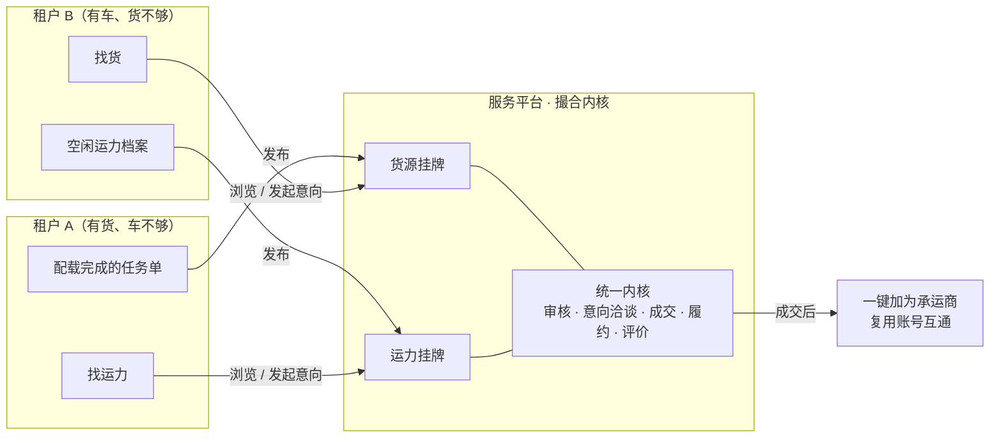
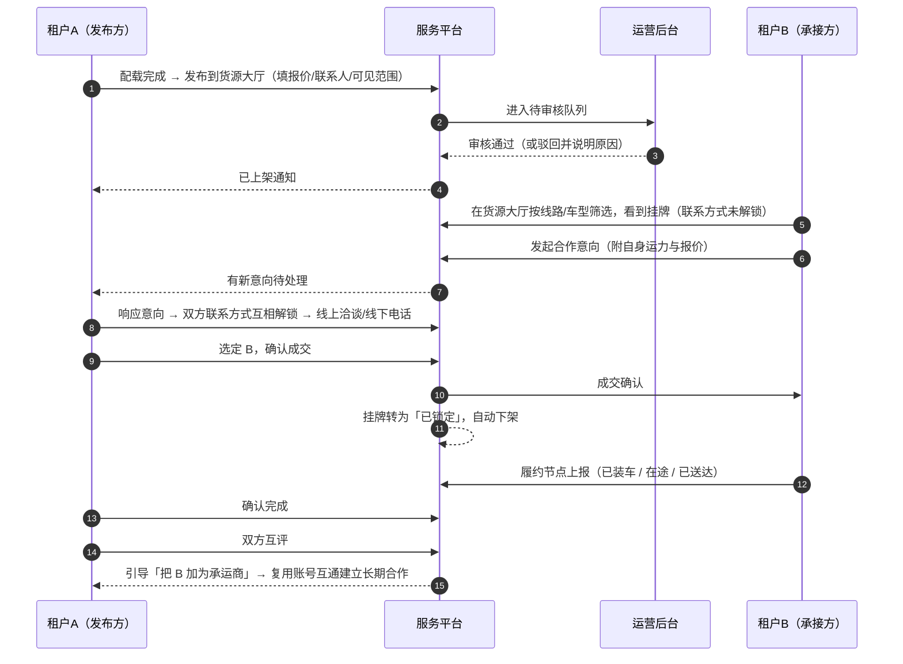

# 服务平台 - 模块总览

> **模块代号**：`ecosystem`（菜单域已预留，对外产品名「服务平台」）
>
> **所属阶段**：阶段九 - 平台生态与撮合网络建设
>
> **文档状态**：方案设计（首版，不含数据库 DDL 与编码）
>
> **创建日期**：2026-07-25
>
> **优先级**：高（从「物流公司操作系统」向「物流行业协作网络」演进的第一步）
>
> **关联文档**：
>
> - [01.客户端菜单架构重构设计](../01.客户端菜单架构重构设计.md)（§6 生态平台预留设计，本模块即该预留位的落地）
> - [05.合作伙伴模块/03.平台互联体系-账号互通设计](../05.合作伙伴模块/03.平台互联体系-账号互通设计.md)（成交后的承运商互联衔接点）
> - [06.运营调度模块/01.运输任务单管理](../06.运营调度模块/01.运输任务单管理.md)（货源发布的源单）
> - [02.资源管理模块/04.运力中心](../02.资源管理模块/04.运力中心.md)（运力发布的源单）
> - [12.开放平台/00.模块总览](../12.开放平台/00.模块总览.md)（边界区分：技术开放 vs 业务撮合）
> - [01.架构设计/系统架构设计](../../../01.架构设计/系统架构设计.md)（多租户分库架构，本模块的核心约束）
>
> **本目录文档清单**：
>
> | # | 文档 | 内容 |
> |---|------|------|
> | 00 | 本文 | 模块定位、双边市场模型、术语、菜单与权限、分期、开放问题 |
> | 01 | [架构与撮合内核设计](01.架构与撮合内核设计.md) | 跨租户数据落位、挂牌生命周期、源单联动、越权防线、API 总览 |
> | 02 | [货源大厅设计](02.货源大厅设计.md) | 发布来源、信息模型、筛选匹配、意向与成交、履约跟踪 |
> | 03 | [运力大厅设计](03.运力大厅设计.md) | 空闲运力挂牌、档期与流向、匹配与状态联动 |
> | 04 | [运营审核与风控设计](04.运营审核与风控设计.md) | 审核流与时效、脱敏分层、屏蔽名单、信用与举报 |
> | 05 | [前端交互与 UX 设计](05.前端交互与UX设计.md) | 页面结构、组件复用、文案规范 |
> | 06 | [实施方案与分期计划](06.实施方案与分期计划.md) | 代码改动清单、snapshot 变更、工作量与风险 |
> | 07 | [数据库设计](07.数据库设计.md) | 16+1 张表的字段与 DDL、索引、状态字典、关键查询、迁移与清理 |
> | 08 | [接口契约](08.接口契约.md) | 出入参 JSON、**字段可见性矩阵**、幂等并发、错误与成功文案 |
>
> **本期不含**：编码实现。`07`／`08` 已给出可直接开发的表结构与接口契约，剩余待补文档见 `06` §10。

---

## 一、模块定位与设计目标

### 1.1 定位

智途现有的九个一级菜单，全部服务于「一家物流公司把自己的事管好」。服务平台是第一个**跨企业**的模块：它把平台上已经存在的一个个租户，从彼此隔离的孤岛，连成一张可以互相找货、互相找车的协作网络。

物流公司的三类外部诉求，对应三个大厅：

| 客户诉求 | 大厅 | 本期 |
|---------|------|------|
| "这个月车跑不满，想接点活" | **货源大厅** | ✓ 本期建设 |
| "旺季车不够，急需外协补充运力" | **运力大厅** | ✓ 本期建设 |
| "找靠谱的维修保养、油气加注、ETC、金融服务商" | **服务大厅** | ✗ 本期仅保留占位，二期设计 |

一句话定位：**服务平台之于智途，等同于「同行集市」——每家物流公司照常在自己的系统里干活，把吃不下的货和跑不满的车挂到集市上，让同行接手；平台负责把集市办得可信、有序、有据可查。**

### 1.2 与市面货运信息平台的差异

做货源/运力撮合的产品已经很多（满帮、运满满等）。我们不是要再做一个，差异点必须先讲清楚，否则这个模块没有存在理由：

| 维度 | 公开货运信息平台 | 智途服务平台 |
|------|----------------|-------------|
| 参与者 | 海量个体司机 + 中小货主，身份真伪难辨 | **全部是平台已开户的物流企业**，营业执照、经营主体、车队规模系统内可查 |
| 信息来源 | 人工填写，与实际业务脱节 | **直接来自系统内的任务单与运力档案**，配载什么发布什么，车在哪、什么时候空系统里有数 |
| 成交之后 | 平台脱手，靠微信/电话对接 | **一键把对方加为承运商**，复用已有的账号互通能力，后续运单可在系统内直连（二期） |
| 履约数据 | 无 | 双方都在智途里作业，节点、回单、评价天然沉淀 |

结论：**我们的护城河不是流量，是「已经在系统里的真实业务数据 + 成交后能立刻变成系统级合作关系」。** 所有设计取舍都应服从这一点——凡是削弱「业务数据真实性」和「成交后系统级衔接」的做法，都不做。

### 1.3 设计目标

| # | 目标 | 落点 |
|---|------|------|
| 1 | **两个大厅共用一套撮合内核**，不写两遍 | 挂牌生命周期、审核、意向洽谈、成交、评价全部抽象为统一内核，大厅只是挂牌载体不同（见 `01` §3） |
| 2 | **发布零负担**：配载完就能发，不用重新录一遍 | 从任务单 / 运力档案一键带出信息，用户只补充对外报价与联系人（见 `02` §2、`03` §2） |
| 3 | **挂牌与源单不脱节**：源单变了大厅要跟着变 | 双向联动机制 + 巡检兜底，避免「大厅还挂着、实际车已派走」的信息污染（见 `01` §5） |
| 4 | **商业机密可控**：敢发布的前提是敢公开 | 四层可见性 + 客户名/合同价默认永不公开 + 同业屏蔽名单（见 `04` §3、§4） |
| 5 | **市场可信**：先建立秩序再谈规模 | 运营审核前置、企业认证标识、履约评价、违规处置（见 `04`） |
| 6 | **全流程在线可追溯**：从发布到交付每一步有记录 | 挂牌生命周期 + 意向洽谈记录 + 成交单 + 履约节点上报 + 互评闭环（见 `01` §4） |
| 7 | **不侵入现有业务流** | 发布是任务单/运力的一个附加动作，不发布的租户完全无感；调度、计费、结算逻辑零改动（见 `06` §2） |
| 8 | **冷启动可运营** | 支持手工发布（不依赖系统单据）、运营侧种子货源、灰度租户白名单（见 `06` §4） |

### 1.4 不在本期范围

| 不做 | 原因 | 未来路径 |
|------|------|---------|
| **跨租户运单直通**（成交后自动在承接方租户库生成任务单） | 涉及跨库写入、字段映射、双方数据主权与纠纷归属，风险与工作量都远大于撮合本身 | 第 2 期，依托账号互通已建立的 `sys_carrier_link` 通道 |
| **在线结算与资金托管** | 需要资金牌照/三方支付通道与对账体系，且一期成交量不足以支撑 | 第 3 期，与财务结算模块的应付/对账打通 |
| **服务大厅**（维修保养/金融/油气/ETC） | 属于「平台招商 + 服务商入驻」，与租户间撮合是两套业务逻辑和两套后台 | 第 2 期独立立项，菜单与占位页本期保留不动 |
| **在线竞价 / 抢单** | 商品车物流是关系型生意，不是价格竞拍；抢单机制会劣化服务质量 | 暂不规划，改为「期望价 + 一对一议价」 |
| **司机个人直接接单** | 我们面向的是企业租户，引入个人会破坏「全部是已认证企业」的核心差异点 | 暂不规划 |
| **智能推荐 / 撮合算法** | 一期挂牌量少，规则筛选 + 订阅提醒足够；过早做推荐无数据可用 | 第 2 期，挂牌量达到规模后基于成交数据建模 |
| **移动端（驾驶员 H5 / 小程序）** | 找货找车是调度员/老板的决策动作，在 PC 端完成 | 第 2 期视需求评估 |

---

## 二、核心业务模型：一个双边市场，两个入口

### 2.1 两个大厅是同一个市场的两侧

这是本模块最重要的一条建模判断，直接决定代码结构：

**货源大厅和运力大厅不是两个独立功能，而是同一个供需市场的两个方向。**

由此得出的结构决策：

- **挂牌（Post）是统一抽象**，`post_type` 区分货源 / 运力；生命周期状态机、审核流、意向单、成交单、评价全部共用一套模型与服务
- 两个大厅的差异只在**挂牌载体的业务字段**（货源关心品牌车系台数线路时间，运力关心车型位数所在地档期）和**列表筛选维度**
- 前端两个页面结构高度对称，可共用列表卡片、详情抽屉、意向洽谈面板等组件

如果按「货源大厅一套、运力大厅一套」分别实现，会产出两份 80% 重复的审核、洽谈、成交代码，后续加一个「服务大厅」还要再抄一遍。

### 2.2 端到端主流程

运力大厅方向完全对称，只是发起意向的一方变成了找运力的租户。

### 2.3 「全流程管理」的边界定义

需求里的「从发布到交付全流程管理」，本期定义为**挂牌单的全生命周期闭环**，而不是**运输作业的全流程**：

| 本期管什么 | 本期不管什么 |
|-----------|-------------|
| 挂牌从草稿到完成/下架的每一次状态变更，全部留痕 | 承接方内部怎么派车、怎么排线、司机是谁 |
| 谁在什么时候发起了意向、谁响应了、谁被选中、谁被婉拒 | 承接方租户库里的任务单执行细节 |
| 成交价格、成交时间、成交双方，形成成交单 | 运费怎么结、什么时候付、发不发票 |
| 履约的几个关键节点由承接方主动上报，发布方可见 | GPS 实时轨迹、电子围栏、异常预警 |
| 完成确认与双方互评，沉淀信用 | 纠纷仲裁、赔付 |

理由：承接方的运输执行发生在**它自己的租户库**里，要把执行数据同步到大厅，等于打通跨租户数据流——那是第 2 期「运单直通」要解决的问题。本期用「承接方手工上报关键节点」这种轻量方式先把闭环跑通，既满足发布方「货到哪了」的知情需求，又不引入跨库复杂度。等第 2 期运单直通做完，这几个节点自然可以从承接方的任务单状态自动同步，上报动作退化为兜底手段。

---

## 三、术语的用户化表达

用户是物流公司的调度员、车队长、老板，不是产品经理。界面上只出现右列词汇：

| 内部概念 | 界面用词 | 一句话解释（界面 tooltip） |
|---------|---------|---------------------------|
| Post / 挂牌 | **货源信息 / 运力信息** | "你发布到大厅里的一条货源（或一台可接单的车）" |
| Listing / 上架 | **展示中** | "同行现在能在大厅里看到这条信息" |
| Intent / 意向单 | **合作意向** | "有同行想接你这单，或你想接同行的单" |
| Deal / 成交单 | **合作记录** | "双方确认后形成的一条合作，可以在这里跟进进度" |
| Milestone / 履约节点 | **进度上报** | "承运方在这里更新装车、在途、送达进度" |
| Audit / 审核 | **平台审核** | "平台会先核一遍信息真实性，一般 2 小时内完成" |
| Delist / 下架 | **停止展示** | "同行将不再看到这条信息，已有的洽谈不受影响" |
| Visibility Level / 可见层级 | **公开范围** | "选择哪些信息对所有同行公开，哪些只给洽谈对象看" |
| Block List / 屏蔽名单 | **不希望看到我的企业** | "把同业竞争对手加进来，他们将看不到你发布的信息" |
| Credit / 信用 | **企业信誉** | "根据认证情况、成交次数和同行评价综合展示" |

面向用户的所有提示语遵循项目《人性化交互提示语》规范：不出现状态码/字段名/英文术语，失败必须给下一步动作，等待用「请稍候」。典型文案见 `05` §6。

---

## 四、包含的功能与页面

| 序 | 界面名称 | 端 | 路由 | 作用 |
|---|---------|---|------|------|
| 1 | 货源大厅 | 租户端 | `/ecosystem/cargo-hall` | 浏览筛选全平台货源、发起意向；Tab 切「我发布的」 |
| 2 | 运力大厅 | 租户端 | `/ecosystem/capacity-hall` | 浏览筛选全平台空闲运力、发起意向；Tab 切「我发布的」 |
| 3 | 服务大厅 | 租户端 | `/ecosystem/service-hall` | **本期保持占位页不变** |
| 4 | 我的合作 | 租户端 | `/ecosystem/deals` | 意向与成交的统一管理台，跟进履约、确认完成、互评 |
| 5 | 企业名片 | 租户端 | `/ecosystem/profile` | 对外展示的企业信息、主营线路、认证与信誉、屏蔽名单设置 |
| 6 | 发布货源（弹层） | 租户端 | — | 从任务单一键发布 / 手工新建 |
| 7 | 发布运力（弹层） | 租户端 | — | 从运力档案一键发布 / 手工新建 |
| 8 | 挂牌审核 | 运营后台 | `/ecosystem/post-audit` | 待审队列、批量通过、驳回并说明原因 |
| 9 | 挂牌管理 | 运营后台 | `/ecosystem/post-manage` | 全量挂牌检索、强制下架、免审白名单维护 |
| 10 | 举报处理 | 运营后台 | `/ecosystem/report` | 违规举报受理与处置 |
| 11 | 生态运营看板 | 运营后台 | `/ecosystem/dashboard` | 挂牌量、成交量、活跃租户、审核时效 |

> 页面 4、5 是新增的租户端二级菜单，需要在 `client_menu.json` 补两条记录；页面 1、2、3 复用已预留菜单。运营后台 8~11 需新增一级菜单「生态运营」及四条二级菜单。

---

## 五、菜单与权限规划

### 5.1 现状盘点

菜单和 feature 在 2026-04 的菜单架构 v2.0 中已预留并已同步到快照，本期是**改造**而非新建：

| 项 | 现状 | 位置 |
|---|------|------|
| 一级菜单「服务平台」 | 已存在，`menu_code=ecosystem`，`path=/ecosystem`，`sort_order=800`，`icon=cpgl` | `backend/scripts/platform_sync/snapshots/client_menu.json`（id=301） |
| 三个二级菜单 | 已存在（id=316/317/318），`visible=1`、`status=1` | 同上 |
| 三个 feature | 已存在，`module=ecosystem` | `product_feature.json` |
| 版本绑定 | 三个 feature **全部只绑在 `pro`** | `version_feature.json` |
| 前端页面 | 三个 `PlaceholderPage` 占位页已存在 | `frontend/client/src/views/ecosystem/*/index.vue` |
| 模块总览配置 | 已存在（定位文案、卡片、快捷操作、图标） | `frontend/client/src/config/module-overview/ecosystem.ts` |

> **需要澄清的事实**：`product_version.json` 中实际存在的版本只有 `lite / standard / pro / ylb` 四个，**没有 `enterprise`，也没有菜单架构文档里提到的 `ecosystem` 生态版**。因此本方案确定的「高级版」在代码中就是 **`pro`（专业版）**。后续若新增旗舰版，把发布类 feature 追加进去即可，方案不需要改。

### 5.2 feature 拆分方案（关键改动）

现状是「一个大厅一个 feature」，无法表达「浏览与发布免费、主动接入收费」。本期把每个大厅的 feature 按**能力**拆开：

| feature_code | 能力 | 开放版本 | 说明 |
|-------------|------|---------|------|
| `ecosystem_cargo_hall` | 浏览货源大厅 | **lite / standard / pro / ylb（全版本）** | 语义由「货源大厅」改为「货源大厅（浏览）」，控制菜单可见 |
| `ecosystem_capacity_hall` | 浏览运力大厅 | **全版本** | 同上 |
| `ecosystem_service_hall` | 服务大厅 | 保持 `pro` 不变 | 本期不做，不动 |
| `ecosystem_cargo_publish` | **发布货源** | **standard / pro** | 新增 |
| `ecosystem_capacity_publish` | **发布运力** | **standard / pro** | 新增 |
| `ecosystem_intent` | **主动发起合作意向、查看对方联系方式** | **仅 pro** | 新增。这是唯一的付费转化点 |
| `ecosystem_deal` | 我的合作（响应意向、成交、履约、评价） | **全版本** | 新增。非 pro 租户不能主动发起意向，但被别人找上门时必须能完整成交 |

### 5.2.1 为什么把免费线划在「主动发起」而不是「发布」

这是本模块的商业设计核心，是一个经过权衡的取舍，值得说清楚。

双边市场的通行做法是**补贴稀缺的一侧、向获益的一侧收费**。在我们这个市场里：

| | 挂牌（发布） | 主动接入（发起意向） |
|---|---|---|
| 谁在做 | 有富余资源、希望被找到的一方 | 有明确需求、正在主动寻找的一方 |
| 对平台的价值 | **提供内容，是市场的基础燃料** | 消费内容 |
| 付费意愿 | 低——「我把货挂出去还要付钱？」 | **高**——「我现在就需要车，能立刻联系上就值」 |
| 收费的后果 | 供给枯竭，市场空转 | 转化清晰，且不影响市场内容量 |

所以：**发布免费（越多越好），主动接入付费（真正获益的动作）。** 这与招聘网站「发布职位免费、主动联系候选人付费」是同一个模型。

由此形成的两档体验：

- **standard 租户**：可以把吃不下的货、跑不满的车挂到大厅（被动等同行来找），别人找上门时可以完整地响应、成交、履约、评价。**不能主动去大厅里找货找车。**
- **pro 租户**：以上全部 + 可以主动发起意向、查看对方联系方式，也就是主动出击的能力。

### 5.2.2 这个设计的一个副作用与应对

必须承认它带来一个不对称：**发起意向的只有 pro 租户，所以 standard 租户挂了牌可能长期无人问询。** 如果放任不管，standard 租户会觉得「发布没用」，供给侧的积极性反而受损。

三个应对措施：

1. **给挂牌方看到需求侧热度**。挂牌详情向发布方展示「本周有 12 家同行看过这条信息」，让他知道信息确实被看到了，只是还没人下决心。
2. **standard 点击「我要接单」时给的不是拒绝，而是价值证明**。弹层展示真实数据：「大厅里现在有 138 条货源，其中 23 条从你的常跑线路出发」——把升级动机建立在具体机会上，而不是抽象的功能对比。
3. **灰度期由运营人工牵线**。冷启动阶段 pro 租户少，运营要主动帮 standard 租户的挂牌找买家，把前几单撮合出来。这是运营成本，但也是唯一能让市场转起来的办法。

> 补充说明：`ecosystem_deal` 必须对全版本开放。设想一个 lite 或 standard 租户被 pro 租户找上门谈合作，如果它连「我的合作」页面都进不去，交易就断在这里，pro 用户的付费体验也一起受损。**付费门槛卡在「主动发起」，绝不能卡在「被动响应」。**

### 5.3 菜单变更清单

| 操作 | 菜单 | menu_code | path | component | feature_code |
|------|------|-----------|------|-----------|-------------|
| 保留 | 服务平台（一级） | `ecosystem` | `/ecosystem` | — | — |
| 保留 | 货源大厅 | `ecosystem:cargo-hall` | `/ecosystem/cargo-hall` | `/ecosystem/cargo-hall/index` | `ecosystem_cargo_hall` |
| 保留 | 运力大厅 | `ecosystem:capacity-hall` | `/ecosystem/capacity-hall` | `/ecosystem/capacity-hall/index` | `ecosystem_capacity_hall` |
| 保留 | 服务大厅 | `ecosystem:service-hall` | `/ecosystem/service-hall` | `/ecosystem/service-hall/index` | `ecosystem_service_hall` |
| **新增** | 我的合作 | `ecosystem:deals` | `/ecosystem/deals` | `/ecosystem/deals/index` | `ecosystem_deal` |
| **新增** | 企业名片 | `ecosystem:profile` | `/ecosystem/profile` | `/ecosystem/profile/index` | `ecosystem_deal` |

排序建议：货源大厅(0) → 运力大厅(10) → 服务大厅(20) → 我的合作(30) → 企业名片(40)。

### 5.4 按钮级权限点

沿用 `sys_menu` 中 `menu_type=1` 的按钮权限模式，前端用 `v-permission` 控制：

| 权限点 | 含义 | 归属页面 |
|--------|------|---------|
| `ecosystem:cargo:publish` | 发布货源 | 货源大厅 / 任务单列表 |
| `ecosystem:cargo:delist` | 下架自己的货源 | 货源大厅·我发布的 |
| `ecosystem:capacity:publish` | 发布运力 | 运力大厅 / 运力列表 |
| `ecosystem:capacity:delist` | 下架自己的运力 | 运力大厅·我发布的 |
| `ecosystem:intent:create` | 发起合作意向 | 两个大厅 |
| `ecosystem:intent:handle` | 响应/婉拒意向 | 我的合作 |
| `ecosystem:deal:confirm` | 确认成交 | 我的合作 |
| `ecosystem:deal:complete` | 确认完成、评价 | 我的合作 |
| `ecosystem:profile:edit` | 编辑企业名片、维护屏蔽名单 | 企业名片 |

> 权限点与 feature 是两套正交机制：feature 管「这个租户的套餐买没买」，权限点管「这个员工在企业内部有没有这个岗位职责」。发布货源既要租户是 pro（feature），也要该员工被分配了发布权限（权限点）。

### 5.5 运营后台菜单

新增一级菜单「生态运营」（`platform_menu.json`，`app_type=platform`）：

| 菜单 | path | 说明 |
|------|------|------|
| 挂牌审核 | `/ecosystem/post-audit` | 核心工作台，待审队列 |
| 挂牌管理 | `/ecosystem/post-manage` | 全量检索、强制下架、免审白名单 |
| 举报处理 | `/ecosystem/report` | 违规受理 |
| 生态看板 | `/ecosystem/dashboard` | 运营数据 |

---

## 六、与相邻模块的关系

| 模块 | 关系 | 复用方式 |
|------|------|---------|
| **运营调度·任务单** | 货源挂牌的主要来源 | 任务单详情/列表新增「发布到货源大厅」动作，带出线路、台数、时间、车型；任务单状态变化触发挂牌联动（见 `01` §5） |
| **运力中心·运力列表** | 运力挂牌的主要来源 | 运力卡片新增「发布到运力大厅」动作，带出车牌、司机、车型；`operation_status` 变化触发联动 |
| **客商中心·承运商管理** | 成交后的归宿 | 成交完成后引导「把对方加为承运商」，调用现有承运商建档 + 账号互通（`sys_carrier_link`），把一次性撮合转为长期合作关系 |
| **合作伙伴·账号互通** | 能力复用 + 边界区分 | 账号互通是**点对点私有连接**（我已经认识你，邀请你），服务平台是**公开市场发现**（我还不认识你，在集市上遇见）。两者互补：大厅负责「认识」，互通负责「合作」。账号互通设计文档 §12 规划的「反向接单广场」由本模块正式承接 |
| **企业管理·经营主体** | 名片信息来源 | 企业名片的工商信息取自 `sys_tenant` 与经营主体，不让用户重复填写 |
| **开放平台** | 边界区分 | 开放平台是**技术层面**把数据开放给客户自己的系统；服务平台是**业务层面**把货和车开放给同行。命名相近但完全不同，文档与界面都要避免混淆 |
| **运力宝（ylb）** | 边界区分 | 运力宝是租户**内部**的运力建档与证照监控；运力大厅是**跨租户**的运力市场。ylb 版本租户可浏览大厅（引流），但发布需升级 pro |
| **审批中心** | 可选接入 | 对外发布货源涉及报价，部分企业需内部审批。一期不强制接入，二期可作为可选开关接入 `biz_approval_*` |

---

## 七、实施分期

| 期次 | 目标 | 关键交付 | 覆盖文档 |
|------|------|---------|---------|
| **1.1 挂牌闭环** | 发得出去、审得过来、看得到 | 企业名片与认证展示、货源/运力发布（任务单来源 + 手工）、运营审核、大厅浏览筛选、下架与过期、源单联动与巡检兜底 | `01`~`04` |
| **1.2 撮合闭环** | 联系得上、谈得成 | 合作意向发起与响应、联系方式分层解锁、洽谈留言、选定与成交确认、挂牌自动锁定 | `01` §4、`02` §5 |
| **1.3 履约闭环** | 跟得到、评得了、留得住 | 履约节点上报、完成确认、双方互评、信誉展示、一键加为承运商 | `02` §6、`04` §5 |
| **1.4 运营增强** | 转得起来 | 订阅提醒（按线路/车型订阅新挂牌）、生态运营看板、免审白名单、举报处置 | `04` §6 |
| **2.x** | 跨租户直连 | 运单直通、服务大厅、智能推荐、在线结算 | 二期立项 |

1.1~1.4 建议连续排期、一次性上线灰度，因为只做到 1.1 的产品（只能看不能联系）对用户没有价值。分期的意义在于开发过程的可验收，而非分批上线。详见 `06`。

---

## 八、关键风险

| 风险 | 影响 | 应对 |
|------|------|------|
| **冷启动失败**：挂牌太少，用户来一次就不来了 | 模块废弃 | 灰度阶段先定向邀请 10~20 家互补型客户；运营侧可代发种子货源；浏览对全版本开放保证访问量；上线前先做 2 周的客户访谈验证真实意愿 |
| **同业竞争抵触**：怕商业机密泄露不敢发 | 供给侧枯竭 | 四层可见性 + 客户名/合同价永不公开 + 屏蔽名单，让用户对「谁能看到什么」有完全掌控（见 `04` §3、§4） |
| **跨库数据不一致**：大厅信息与真实状态脱节 | 用户信任崩塌 | 业务操作内同步 + 失败补偿 + 定时巡检三重保障；挂牌卡片展示「信息更新于 X 分钟前」（见 `01` §5） |
| **越权访问**：平台库集中存储失去物理隔离保护 | 严重数据事故 | 所有查询强制走统一的可见性过滤层，写操作强制校验归属租户；服务层禁止裸查（见 `01` §6） |
| **审核成为瓶颈**：货源时效性强，审不过来 | 用户流失 | 自动预检 + 免审白名单（先发后审）+ 批量通过 + 明确 SLA（见 `04` §2） |
| **绕单**：联系上后线下成交，平台无数据 | 无法评估效果、信用体系空转 | 一期承认并接受，用信誉激励引导登记而非强制；二期靠在线结算形成真实约束（见 `04` §7） |
| **法律与合规**：撮合方是否承担承运责任 | 潜在纠纷 | 明确平台定位为信息服务而非承运方，用户协议需法务补充；界面显著位置提示「合作前请自行核实对方资质」 |

---

## 九、开放问题

以下问题不阻塞方案成立，但影响细节设计，建议在评审时明确：

| # | 问题 | 我的倾向 |
|---|------|---------|
| 1 | 挂牌是否收费（发布条数配额）？ | 一期不收，pro 版内不限量，先把量做起来；若出现刷屏再加每日发布上限 |
| 2 | 成交是否抽佣？ | 一期不抽。抽佣会直接催生绕单，且我们没有资金通道做扣款。变现靠 pro 版本升级 |
| 3 | 企业认证由谁做？ | 复用注册时的营业执照信息，运营后台增加「认证核验」动作打标；不新建一套认证流程 |
| 4 | 货源计量单位 | 以「台」为主（商品车物流特性），兼容吨/方/件，发布时可选 |
| 5 | 是否允许跨租户看到对方的车辆/司机真实证件信息？ | 不允许。运力挂牌只展示车型、位数、车牌（可选打码），证件信息在成交后由双方线下核验，避免个人信息合规风险 |
| 6 | 上线灰度方式 | 用 `sys_tenant_product` 单独给试点租户开 `ecosystem_*_publish` feature，不影响全量 |
| 7 | 服务大厅二期形态 | 倾向「平台招商 + 服务商入驻 + 询价单」，与租户间撮合是两套后台，独立立项 |
| 8 | **`ylb`（运力宝）租户要不要给发布运力的权限？** | **建议给**，理由见下 |
| 9 | `lite`（承运商激活版）要不要给发布权限？ | 不给。lite 是免费版且数据完整度低（多数只是被邀请建档，没有真实运力档案），放开会同时冲击审核成本与信息质量 |

关于第 8 条：运力宝租户是**纯运力方**——有真实车队、有证照监控数据、本身就在找货，是运力大厅最理想的供给来源。它们没有货源可发，所以给 `ecosystem_capacity_publish` 不会冲击 standard 的价值感，反而能成为运力宝的一个卖点（「挂到运力大厅找货」）。建议一期就给 ylb 开放运力发布，不开放货源发布。此项需产品与商务确认。
