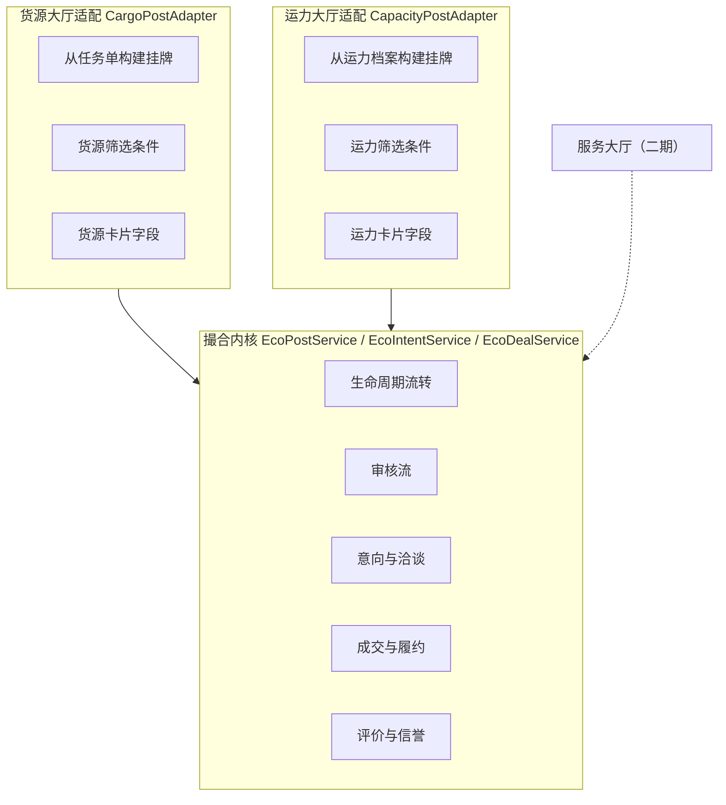
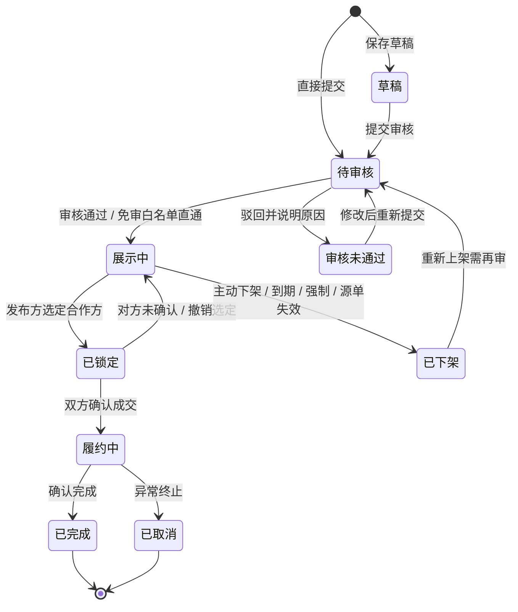
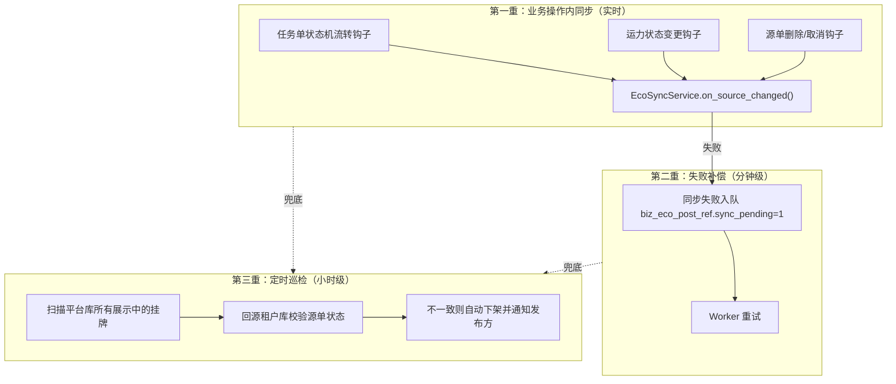

# 服务平台 - 架构与撮合内核设计

> 上级文档：[00.模块总览](00.模块总览.md)
>
> 本文回答：在「一租户一个库」的架构下，跨租户市场的数据放在哪、怎么保证挂牌与源单不脱节、怎么防越权，以及两个大厅共用的撮合内核长什么样。
>
> **适用技术栈**：FastAPI + SQLAlchemy 2.0 异步 + MySQL + Redis + APScheduler（沿用现有栈，无新增中间件）
>
> **文档定位**：架构设计 + 领域模型 + 状态机 + 代码蓝图
>
> **创建日期**：2026-07-25
>
> **本文不含**：建表 DDL 与字段类型明细（第二版出具）

---

## 1. 文档目标

1. 确定跨租户市场数据在**平台库 / 租户库**之间的落位与职责边界
2. 定义两个大厅共用的**撮合内核**：统一挂牌抽象与三条状态机
3. 设计**源单联动**机制，解决「大厅还挂着、车其实已经派走了」这类信息污染
4. 建立**越权防线**——这是本模块相对其他模块最大的安全风险增量
5. 给出后端代码目录蓝图与 API 总览，供开发直接落地

---

## 2. 核心架构约束

### 2.1 约束来源

智途采用 **database-per-tenant**：每个租户一个独立的 MySQL 库 `zt_biz_{tenant_code}`，租户上下文由 JWT 中的 `tenant_code` 决定，`get_tenant_db()` 依赖据此路由到对应连接池。这个架构的最大优点是**租户数据物理隔离，越权几乎不可能发生**——因为连接根本连不到别人的库。

服务平台是第一个打破这个前提的模块：**它的业务本质就是让 A 租户看到 B 租户的数据。**

### 2.2 三个被否决的方案

| 方案 | 做法 | 为什么否决 |
|------|------|-----------|
| A. 数据留在租户库，查询时聚合 | 挂牌存在各自租户库，大厅列表时并发查 N 个库再合并 | 租户数增长后每次列表要开 N 个连接；分页、排序、全局筛选无法在数据库层完成；性能与复杂度双重灾难 |
| B. 新建独立的「市场库」 | 除平台库、租户库外再建第三类库 | 引入第三套连接管理、迁移体系、备份策略，收益为零——平台库本身就是全局共享库，职责完全匹配 |
| C. 挂牌存租户库，平台库只存索引 | 平台库存 ID 与筛选字段，详情回源租户库 | 列表页每条卡片都要回源，一屏 20 条就是 20 次跨库；且详情与列表可能不一致 |

### 2.3 采用方案：平台库集中存储 + 发布即快照

**所有大厅数据（挂牌、意向、成交、评价、名片）全部存放在平台库 `zt_platform`。**

发布动作的本质是：**从租户库读取源单 → 提取对外可公开的字段 → 在平台库创建一份快照挂牌**。挂牌一旦创建，就是一个独立的业务对象，有自己的生命周期，不再依赖源单的实时读取。

这个模式在现有代码中已有先例可循：

```13:35:d:\zhitu\backend\app\modules\console\models\capacity\sys_capacity.py
class SysCapacity(PlatformModelBase):
    """平台运力（汇总各租户司机-车辆绑定关系）"""
    __tablename__ = "sys_capacity"
    __table_args__ = {"comment": "平台运力表（汇总各租户运力数据）"}

    tenant_code: Mapped[str] = mapped_column(
        String(32), nullable=False, comment="租户编码"
    )
    biz_capacity_id: Mapped[int] = mapped_column(
        BigInteger, nullable=False, comment="租户库 biz_capacity.id"
    )
```

`sys_capacity` 就是把各租户的运力汇总到平台库的镜像表，`sys_carrier_link` 同理。服务平台是把这个模式用在更完整的业务对象上。

**快照带来的收益**：

- 列表、筛选、排序、分页全部在平台库单表内完成，性能可控
- 挂牌信息在发布那一刻被「冻结」，源单后续的内部改动（比如调整了内部成本、换了调度员）不会莫名其妙地泄露到大厅
- 发布方可以对挂牌做独立于源单的编辑（改报价、改联系人），不污染源单

**快照带来的代价**：源单变了挂牌不会自动跟着变。这个代价由 §5 的联动机制来偿付，是本模块最需要认真对待的技术点。

---

## 3. 数据落位与对象清单

### 3.1 职责划分

| 库 | 承载 | 理由 |
|----|------|------|
| **平台库 `zt_platform`** | 挂牌、审核流水、意向单、洽谈留言、成交单、履约节点、互评、企业名片、信誉统计、屏蔽名单、订阅、举报 | 跨租户可见，必须集中 |
| **租户库 `zt_biz_*`** | 仅一张**发布关联表**：本租户的源单与平台挂牌的对应关系 + 状态镜像 | 让租户库内的业务页面（任务单列表、运力列表）能在不跨库的情况下知道「这条已发布/已成交」，并在源单状态流转时快速判断是否需要触发联动 |

租户库只加一张轻量表，是本模块「不侵入现有业务流」的关键：不发布的租户，这张表永远是空的；发布过的租户，这张表也只有寥寥数行。

### 3.2 平台库数据对象清单

> 表名前缀 `sys_eco_`（ecosystem），与平台库 `sys_` 规范一致，同时用 `eco_` 二级前缀把本模块的表聚成一组，便于检索与后续独立演进。**完整字段、索引与 DDL 见 [07.数据库设计](07.数据库设计.md)。**

| # | 对象 | 表名 | 职责 | 关键关系 |
|---|------|------|------|---------|
| 1 | **挂牌主体** | `sys_eco_post` | 两个大厅共用的挂牌主表，`post_type` 区分货源/运力；承载生命周期状态、归属租户、**线路与时间窗与数量与价格**、可见性配置、有效期、统计冗余 | 撮合内核的根对象 |
| 2 | 挂牌目的地 | `sys_eco_post_dest` | 目的地/期望流向；货源 1 行、运力可多行，使目的地筛选可走索引 | N:1 于 `sys_eco_post` |
| 3 | 货源挂牌扩展 | `sys_eco_cargo_post` | 货源特有字段：品牌车系明细、车况、承运要求、到达时间、结算方式 | 1:1 于 `sys_eco_post` |
| 4 | 运力挂牌扩展 | `sys_eco_capacity_post` | 运力特有字段：车型、位数、车牌与司机快照、可开票、服务承诺、取货半径 | 1:1 于 `sys_eco_post` |
| 5 | 流转审计 | `sys_eco_post_audit` | 每一次提交/通过/驳回/下架/编辑的记录，含操作人、原因、时间 | N:1 于 `sys_eco_post` |
| 6 | 浏览统计 | `sys_eco_post_view` | 按「挂牌 + 查看企业 + 日期」聚合，支撑向发布方展示需求侧热度 | N:1 于 `sys_eco_post` |
| 7 | 合作意向 | `sys_eco_intent` | 一次「我想接这单/我想用这台车」的表达，含发起方、报价、附言、状态 | N:1 于 `sys_eco_post` |
| 8 | 洽谈留言 | `sys_eco_intent_message` | 意向下的双方留言，形成可追溯的沟通记录 | N:1 于 `sys_eco_intent` |
| 9 | 成交单 | `sys_eco_deal` | 发布方选定某个意向后形成的合作记录，含成交价、双方、履约状态 | 1:1 于被选中的 `sys_eco_intent` |
| 10 | 履约节点 | `sys_eco_deal_milestone` | 承运方上报的装车/在途/送达等节点 | N:1 于 `sys_eco_deal` |
| 11 | 互评 | `sys_eco_evaluation` | 成交完成后双方互评，评分 + 标签 + 文字 | N:1 于 `sys_eco_deal`，每方一条 |
| 12 | 企业名片 | `sys_eco_tenant_profile` | 租户在大厅的对外形象：简介、主营线路、车队规模、认证状态、联系人 | 1:1 于 `sys_tenant` |
| 13 | 信誉统计 | `sys_eco_tenant_credit` | 累计发布/成交/完成率/评分/违规次数，由事件驱动增量更新 | 1:1 于 `sys_tenant` |
| 14 | 屏蔽名单 | `sys_eco_block_rule` | 「我不希望哪些企业看到我的挂牌」 | N:1 于 `sys_tenant` |
| 15 | 订阅提醒 | `sys_eco_subscription` | 按线路/车型订阅新挂牌，命中后推送 | N:1 于 `sys_tenant`，1.4 期 |
| 16 | 举报 | `sys_eco_report` | 违规举报与处置记录 | N:1 于 `sys_eco_post` |

> 第 2、6 两张表是在写 DDL 时才浮现出必要性的：目的地多值导致 JSON 筛选无法走索引（`07` §3.2），需求侧热度反馈需要去重统计（`07` §4.6）。同时 `07` §3.1 把线路、时间窗、数量、价格这四组**两个大厅同构**的筛选维度从扩展表上提到了主表，让大厅列表查询能命中单表联合索引。

> 拆表决策说明：主表 + 类型扩展表（1/2/3）而非单张大宽表，是因为货源与运力的业务字段几乎无交集（一个关心品牌台数，一个关心位数档期），塞在一张表里会有一半字段常年为空，且未来加「服务大厅」时还要再塞一批。主表只放**内核关心的通用字段**，内核代码永远只操作主表，扩展字段由各大厅的 service 处理。

### 3.3 租户库数据对象

| 对象 | 表名 | 职责 |
|------|------|------|
| 发布关联 | `biz_eco_post_ref` | 记录：源单类型（任务单/运力/手工）、源单 ID、平台挂牌 ID、挂牌当前状态镜像、最后同步时间。`__table_tier__ = "business"` |

有了这张表，任务单列表可以直接 `LEFT JOIN` 出「已发布/洽谈中/已成交」标记，不需要为了一个角标去跨库查平台库。

---

## 4. 撮合内核：统一抽象与三条状态机

### 4.1 为什么要抽象内核

货源大厅和运力大厅在业务上是镜像的，在流程上是**完全相同**的：都要经过发布 → 审核 → 上架 → 收到意向 → 选定 → 成交 → 履约 → 完成 → 评价。区别只在挂牌上写的是什么。

因此内核定义为：**一套操作 `sys_eco_post` 及其下游对象（审核、意向、成交、评价）的通用服务**，两个大厅各自只实现「怎么从源单生成扩展字段」和「怎么筛选」这两件事。



### 4.2 挂牌生命周期状态机

这是「全流程管理」的主干。所有状态变更都必须写 `sys_eco_post_audit` 流水，做到全程可追溯。

| 值 | 状态 | 含义 | 谁能看到 |
|---|------|------|---------|
| 0 | 草稿 | 已填写未提交 | 仅发布方 |
| 1 | 待审核 | 已提交，等待平台审核 | 仅发布方 |
| 2 | 审核未通过 | 被驳回，可修改后重新提交 | 仅发布方 |
| 3 | 展示中 | 在大厅公开展示，可被发起意向 | 全平台（受屏蔽名单与可见性约束） |
| 4 | 已锁定 | 发布方已选定合作方，等待双方确认成交 | 发布方 + 相关意向方 |
| 5 | 履约中 | 已成交，正在执行 | 发布方 + 承接方 |
| 6 | 已完成 | 履约完成并确认 | 发布方 + 承接方 |
| 7 | 已下架 | 不再展示（原因见 `delist_reason`） | 仅发布方 |
| 9 | 已取消 | 成交后异常终止 | 双方 |

下架原因 `delist_reason`：

| 值 | 原因 | 触发方 |
|---|------|-------|
| 1 | 发布方主动停止展示 | 用户 |
| 2 | 有效期到期自动下架 | 系统 |
| 3 | 平台强制下架（违规） | 运营 |
| 4 | 源单已变更或取消，信息失效 | 系统联动 |
| 5 | 已达成合作自动下架 | 系统 |



**设计说明：**

- **「洽谈中」不设为独立状态。** 一个挂牌可以同时被多方发起意向，如果把「洽谈中」做成主状态，会出现「有 3 个意向，撤回了 2 个，状态该不该退回展示中」这类扯不清的问题。洽谈热度用 `intent_count` 字段派生展示（卡片上显示「3 人想合作」），主状态保持「展示中」。
- **已锁定是一个可回退的中间态。** 发布方选定 B 后，B 可能反悔。此时挂牌应回到展示中继续找下家，而不是直接作废。
- **重新上架必须重新审核。** 下架的原因可能是违规，不能让用户下架再上架来绕过处置。因此「已下架」的唯一出口是「待审核」，且**不给免审白名单直通**——白名单信任的是租户的历史表现，而被下架过的恰恰是这条内容本身。

**状态图之外的三条补充，实现时不可省：**

| 流转 | 为什么必须允许 |
|------|--------------|
| 待审核 → 已下架 | 源单联动（§5.3）会在挂牌还排在审核队列里时就判定信息失效，此时必须能下架；同时也是发布方「等不及了，先撤回」的出口 |
| 审核未通过 → 已下架 | 给发布方一个「这条不发了」的收口，否则驳回态会永久滞留在「我发布的」列表里 |
| 展示中 → 待审核 | 编辑了核心信息要完整重审（`04` §2.4），期间从大厅移出 |

**刻意不允许的两条：** `已锁定 → 已下架` 与 `履约中 → 已下架`。这两个状态下都有成交单在跑，从挂牌侧下架会留下一张指向「已下架挂牌」的孤儿成交单。运营遇到这类违规应走成交单终止流程，而不是把挂牌抽走。

**允许发布方编辑的状态**是草稿、审核未通过、展示中、**已下架**。含已下架是关键一条：下架后往往正是要改内容（源单变了、被运营驳回过），不让改就只能重新发一条，历史与审核记录全断。**待审核不可编辑**，避开「审核员正在看、用户同时在改」的竞态——用户想立即改可以先停止展示（待审核 → 已下架），改完再重新上架。

### 4.3 意向单状态机

| 值 | 状态 | 说明 |
|---|------|------|
| 0 | 待响应 | 已发起，等待挂牌方处理 |
| 1 | 洽谈中 | 挂牌方已响应，**双方联系方式互相解锁** |
| 2 | 已选定 | 被挂牌方选为合作方，生成成交单 |
| 3 | 已婉拒 | 挂牌方婉拒（需选择原因，用于优化匹配） |
| 4 | 已撤回 | 发起方主动撤回 |
| 5 | 已失效 | 挂牌被他人锁定成交，或挂牌已下架 |

关键规则：

- 联系方式在状态 0 → 1 时解锁，**且是双向解锁**。这样发起意向的一方不能靠「广撒网」白嫖联系方式——只有挂牌方愿意谈，才会互相看到。
- 挂牌进入「已锁定」时，其余处于 0/1 状态的意向自动置为 5（已失效），并给这些租户一条礼貌的通知，而不是让人一直等着。
- 同一租户对同一挂牌只能有一个有效意向，避免刷屏。

### 4.4 成交单状态机

| 值 | 状态 | 说明 |
|---|------|------|
| 0 | 待确认 | 挂牌方已选定，等待承接方最终确认 |
| 1 | 已成交 | 双方确认，等待执行 |
| 2 | 履约中 | 承接方已上报首个节点 |
| 3 | 已完成 | 发布方确认完成 |
| 4 | 已终止 | 任一方发起终止且对方同意，或运营介入终止 |

成交单是本模块**唯一有商业价值的数据资产**：它记录了谁和谁在什么线路上以什么价格成交。信誉统计、生态看板、二期的推荐算法全都建立在它之上。因此即使一期承认存在绕单，也要通过产品引导尽可能让用户完成成交登记（见 `04` §7）。

### 4.5 履约节点

一期采用**承接方主动上报**，节点极简，不追求精确：

| 节点 | 上报方 | 说明 |
|------|-------|------|
| 已安排车辆 | 承接方 | 可填写车牌与司机联系方式 |
| 已装车 | 承接方 | 可上传装车照片 |
| 运输中 | 承接方 | 可填写当前位置与预计到达 |
| 已送达 | 承接方 | 可上传回单照片 |
| 确认完成 | **发布方** | 完成动作必须由发布方做，防止承接方单方面宣布完成 |

上报节点后给对方发通知。二期运单直通落地后，前四个节点可由承接方的任务单状态自动同步，上报动作退化为无系统对接时的兜底手段。

---

## 5. 源单联动机制

这是本模块最容易出线上问题的地方，需要重点设计。

### 5.1 问题场景

| 场景 | 不处理的后果 |
|------|-------------|
| 任务单发布到货源大厅后，租户自己又派了自有车 | 大厅里还挂着，同行打电话过来发现货没了，白跑一趟 |
| 任务单被取消/删除 | 大厅挂着一条根本不存在的货 |
| 任务单的装车时间、台数被修改 | 大厅信息与实际不符，谈好了才发现对不上 |
| 运力发布后，这台车在自己系统里被派车了 | 同行以为车空着 |
| 运力被解绑（司机下车） | 挂牌指向一个已不存在的运力 |

信息不准是撮合平台的死因。宁可少挂几条，不能挂错。

### 5.2 三重保障



**第一重：在既有状态机流转处挂钩子。**

现有任务单状态机集中在 `app/modules/client/services/state_machine/task_state_machine.py`，运力状态变更集中在运力 service，都是单一入口，适合挂钩子。钩子逻辑：查 `biz_eco_post_ref` 判断该源单是否有活跃挂牌，有则调用同步服务更新平台库。

因为跨库无法使用同一个事务，同步采用 **best-effort**：租户库的业务操作先提交（业务优先，绝不能因为大厅同步失败而阻塞用户派车），平台库同步失败则记录待重试标记。

**第二重：失败补偿。** `biz_eco_post_ref` 上标记 `sync_pending`，由 Worker 扫描重试。

**第三重：定时巡检兜底。** 新增 `ecosystem_sync_main.py` Worker，沿用现有 Worker 模式（扫 `db_initialized=1` 的租户 → 处理任务）。每小时扫描一次所有「展示中」的挂牌，回源校验，发现失效则自动下架（`delist_reason=4`）并通知发布方。

> 巡检是必须的，不是可选项。跨库无事务的架构下，任何「只靠实时同步」的设计都会在网络抖动、进程重启、代码遗漏钩子时留下脏数据。

### 5.3 联动规则表

| 源单变化 | 挂牌处理 | 通知 |
|---------|---------|------|
| 任务单被指派了运力（`capacity_id` 或 `carrier_id` 有值） | 自动下架，原因 4 | 通知发布方「货源已自动停止展示，因为这单已安排了车辆」 |
| 任务单状态推进到已派车及以后 | 自动下架，原因 4 | 同上 |
| 任务单取消/删除 | 自动下架，原因 4 | 通知发布方 |
| 任务单关键信息变更（线路、台数、时间） | **不自动下架**，标记「信息已变更，请及时更新」，48 小时未更新则自动下架 | 提醒发布方去更新挂牌 |
| 运力 `operation_status` 变为运输中/休假/停运/维修 | 自动下架，原因 4 | 通知发布方 |
| 运力被解绑（`status=0`） | 自动下架，原因 4 | 通知发布方 |
| 挂牌已进入「已锁定/履约中」 | **不自动下架**，仅提示；此时已有合作关系，需人工处理 | 通知双方 |

**反向约束（平台库 → 租户库）**：挂牌进入「已锁定」后，源任务单在租户库内**不做硬锁**，只在 `biz_eco_post_ref` 打标，前端在任务单上展示「已通过货源大厅外协给 XX 公司」的角标。

> 这个决策要说清理由：硬锁会侵入现有调度逻辑（派车、改配载、取消都要加判断），风险大且收益小。用户在大厅谈成后自己会去处理任务单，我们提示到位即可。如果后续发现确实有人乱操作，再收紧不迟——先松后紧比先紧后松容易得多。

---

## 6. 越权防线

### 6.1 风险为什么变大了

在其他模块里，越权的最坏后果是「A 租户的员工看到了 A 租户的另一个部门的数据」，因为连接根本连不到 B 租户的库。**服务平台把所有租户的挂牌放进了同一张平台库表，物理隔离这道天然屏障没有了。** 一个 `where` 条件写漏，就是跨企业数据泄露。

### 6.2 四条硬性规则

| # | 规则 | 落实方式 |
|---|------|---------|
| 1 | **所有列表查询必须经过统一可见性过滤器** | 提供 `EcoVisibilityFilter.apply(stmt, viewer_tenant_code)`，自动拼上：状态必须为展示中、未被 viewer 屏蔽、未过期、可见层级匹配。**Service 层禁止直接对 `sys_eco_post` 裸写 select** |
| 2 | **所有写操作必须校验归属** | 修改/下架/删除挂牌前，强制 `post.owner_tenant_code == current_user.tenant_code`，不匹配抛 `BizException("这条信息不属于你的企业，无法操作")` |
| 3 | **详情接口按可见层级裁剪字段** | 详情返回前统一过一遍 `EcoFieldMasker`，根据「查看方与该挂牌的关系」决定哪些字段返回、哪些脱敏、哪些直接剔除（不是前端隐藏，是后端不返回） |
| 4 | **意向/成交/留言的读写双向校验** | 只有意向的发起方与挂牌归属方两个租户能读写该意向及其下留言 |

### 6.3 实现约定

- 平台库的 `sys_eco_*` 查询统一收敛在 `EcoPostRepository` / `EcoIntentRepository` 中，API 与 Service 不直接写 SQL
- Repository 的每个方法**签名强制第一个参数是 `viewer_tenant_code`**，让「忘记传租户视角」变成编译期/调用期就能发现的错误，而不是上线后才发现
- 单元测试必须覆盖越权用例：A 租户尝试读取/修改 B 租户的挂牌、意向、成交，全部断言被拒绝

---

## 7. 后端代码蓝图

```text
backend/app/modules/
├── client/                                  # 租户端
│   ├── api/ecosystem/
│   │   ├── __init__.py                      # 子路由聚合
│   │   ├── cargo_post.py                    # 货源挂牌 CRUD + 发布
│   │   ├── capacity_post.py                 # 运力挂牌 CRUD + 发布
│   │   ├── hall.py                          # 大厅浏览（列表/详情/筛选选项）
│   │   ├── intent.py                        # 合作意向与洽谈留言
│   │   ├── deal.py                          # 成交、履约上报、完成、评价
│   │   ├── profile.py                       # 企业名片、屏蔽名单
│   │   └── subscription.py                  # 订阅提醒（1.4 期）
│   ├── schemas/ecosystem/                   # 出入参模型
│   ├── services/ecosystem/
│   │   ├── core/
│   │   │   ├── post_service.py              # 内核：挂牌生命周期
│   │   │   ├── post_state_machine.py        # 内核：状态机与合法流转表
│   │   │   ├── intent_service.py            # 内核：意向与洽谈
│   │   │   ├── deal_service.py              # 内核：成交与履约
│   │   │   ├── credit_service.py            # 内核：信誉统计增量更新
│   │   │   ├── visibility.py                # 可见性过滤器 + 字段脱敏器
│   │   │   └── repository.py                # 平台库访问收口
│   │   ├── cargo_adapter.py                 # 货源：从任务单构建、筛选、卡片
│   │   ├── capacity_adapter.py              # 运力：从运力档案构建、筛选、卡片
│   │   ├── sync_service.py                  # 源单联动
│   │   └── notify_service.py                # 通知（待办 + 短信）
│   └── models/ecosystem/
│       └── post_ref.py                      # 租户库 biz_eco_post_ref
│
└── console/                                 # 运营后台
    ├── api/ecosystem/
    │   ├── post_audit.py                    # 审核队列与处置
    │   ├── post_manage.py                   # 全量管理、强制下架、白名单
    │   ├── report.py                        # 举报处理
    │   └── dashboard.py                     # 生态看板
    ├── services/ecosystem/
    │   ├── audit_service.py
    │   ├── precheck_service.py              # 自动预检规则
    │   └── stats_service.py
    └── models/ecosystem/                    # 平台库 sys_eco_* 全部模型
        ├── post.py / cargo_post.py / capacity_post.py
        ├── post_audit.py
        ├── intent.py / intent_message.py
        ├── deal.py / deal_milestone.py / evaluation.py
        ├── tenant_profile.py / tenant_credit.py
        ├── block_rule.py / subscription.py / report.py

backend/app/workers/
└── ecosystem_sync_main.py                   # 巡检 Worker：过期下架 + 源单一致性校验
```

> 模型归属说明：`sys_eco_*` 全部是 `PlatformModelBase` 子类，按现有规范放在 `console/models/` 下；租户端 service 通过 `get_platform_db` 依赖访问它们。这与开放平台模块的 `open_*` 表处理方式一致。

---

## 8. API 总览

### 8.1 租户端（`/api/client/ecosystem`）

| 方法 | 路径 | 说明 | feature 门控 |
|------|------|------|-------------|
| GET | `/halls/{hall_type}/posts` | 大厅列表（`hall_type` = `cargo` \| `capacity`） | `ecosystem_{type}_hall` |
| GET | `/halls/{hall_type}/posts/{id}` | 挂牌详情（字段按可见层级裁剪） | 同上 |
| GET | `/halls/{hall_type}/filters` | 筛选项元数据（线路、车型等可选值） | 同上 |
| GET | `/my-posts` | 我发布的挂牌列表 | 浏览类 |
| POST | `/cargo-posts/from-task` | **从任务单发布货源** | `ecosystem_cargo_publish` |
| POST | `/cargo-posts` | 手工发布货源 | 同上 |
| PUT | `/cargo-posts/{id}` | 编辑货源挂牌（回到待审核） | 同上 |
| POST | `/capacity-posts/from-capacity` | **从运力档案发布运力** | `ecosystem_capacity_publish` |
| POST | `/capacity-posts` | 手工发布运力 | 同上 |
| PUT | `/capacity-posts/{id}` | 编辑运力挂牌 | 同上 |
| POST | `/posts/{id}/submit` | 提交审核 | 发布类 |
| POST | `/posts/{id}/delist` | 停止展示 | 发布类 |
| POST | `/posts/{id}/relist` | 重新上架（需重审） | 发布类 |
| POST | `/posts/{id}/intents` | **发起合作意向** | `ecosystem_intent` |
| GET | `/intents` | 我的意向（发出的 / 收到的） | `ecosystem_deal` |
| POST | `/intents/{id}/respond` | 响应意向（解锁联系方式） | `ecosystem_deal` |
| POST | `/intents/{id}/decline` | 婉拒意向 | `ecosystem_deal` |
| POST | `/intents/{id}/withdraw` | 撤回意向 | `ecosystem_intent` |
| GET/POST | `/intents/{id}/messages` | 洽谈留言 | `ecosystem_deal` |
| POST | `/intents/{id}/select` | **选定合作方，生成成交单** | `ecosystem_deal` |
| GET | `/deals` | 我的合作列表 | `ecosystem_deal` |
| GET | `/deals/{id}` | 成交详情 + 履约时间线 | `ecosystem_deal` |
| POST | `/deals/{id}/confirm` | 承接方确认成交 | `ecosystem_deal` |
| POST | `/deals/{id}/milestones` | 上报履约节点 | `ecosystem_deal` |
| POST | `/deals/{id}/complete` | 发布方确认完成 | `ecosystem_deal` |
| POST | `/deals/{id}/terminate` | 终止合作 | `ecosystem_deal` |
| POST | `/deals/{id}/evaluate` | 提交评价 | `ecosystem_deal` |
| POST | `/deals/{id}/link-carrier` | **一键加为承运商**（衔接账号互通） | `ecosystem_deal` |
| GET/PUT | `/profile` | 企业名片 | 浏览类 |
| GET/POST/DELETE | `/profile/block-rules` | 屏蔽名单 | 浏览类 |
| GET | `/tenants/{tenant_code}/card` | 查看对方企业名片（脱敏） | 浏览类 |

> **门控与版本的对应关系**（详见 `00` §5.2）：浏览类与 `ecosystem_deal` 对全版本开放；`ecosystem_*_publish` 开放到 `standard` 与 `pro`；**只有 `ecosystem_intent` 是 pro 独占**。因此本表中带 `ecosystem_intent` 的两个接口——发起意向与撤回意向——是唯一需要 pro 版本的写操作。
>
> 注意 `/intents/{id}/respond` 与 `/intents/{id}/select` 用的是 `ecosystem_deal`（全版本），不是 `ecosystem_intent`。这是刻意的：standard 租户发布挂牌后被 pro 租户找上门，必须能完整走完响应、选定、成交、评价的全流程，否则它的发布权就是废的。

### 8.2 运营后台（`/api/console/ecosystem`）

| 方法 | 路径 | 说明 |
|------|------|------|
| GET | `/posts` | 挂牌全量检索（按状态/租户/类型/时间） |
| GET | `/posts/pending` | 待审队列 |
| POST | `/posts/{id}/approve` | 审核通过 |
| POST | `/posts/{id}/reject` | 驳回并说明原因 |
| POST | `/posts/batch-approve` | 批量通过 |
| POST | `/posts/{id}/force-delist` | 强制下架 |
| GET/POST | `/audit-whitelist` | 免审白名单维护 |
| GET/POST | `/reports` | 举报列表与处置 |
| POST | `/tenants/{code}/verify` | 企业认证核验打标 |
| GET | `/dashboard` | 生态运营看板数据 |

---

## 9. 异步任务与通知

### 9.1 Worker

新增 `ecosystem_sync_main.py`，沿用现有 Worker 模式（APScheduler + `*_WORKER_ENABLED` 开关本地可内嵌）：

| 任务 | 频率 | 职责 |
|------|------|------|
| 过期下架 | 10 分钟 | 扫描 `valid_until` 已过的展示中挂牌，自动下架（原因 2）并通知 |
| 源单一致性巡检 | 1 小时 | 回源校验展示中挂牌的源单状态，不一致则下架（原因 4） |
| 同步失败重试 | 5 分钟 | 处理 `biz_eco_post_ref.sync_pending=1` 的记录 |
| 信息变更催更 | 1 天 | 标记「信息已变更」超过 48 小时未更新的挂牌，自动下架 |
| 订阅提醒推送 | 30 分钟 | 新挂牌匹配订阅条件，生成待办（1.4 期） |
| 信誉统计重算 | 1 天 | 全量校准增量统计的偏差 |

### 9.2 通知策略

现有能力：工作台待办 `sys_todo_task`、短信 `sms_service`、企业动态 `biz_company_activity`。本模块的通知遵循「重要的用短信，其余进待办」：

| 事件 | 通知对象 | 渠道 |
|------|---------|------|
| 审核通过 / 驳回 | 发布方 | 待办 + 站内提示 |
| **收到新的合作意向** | 挂牌方 | 待办 + **短信** |
| 意向被响应（联系方式已解锁） | 发起方 | 待办 + **短信** |
| 被选定为合作方 | 承接方 | 待办 + **短信** |
| 意向被婉拒 / 失效 | 发起方 | 待办 |
| 履约节点上报 | 发布方 | 待办 |
| 确认完成 / 收到评价 | 双方 | 待办 |
| 挂牌被自动下架 | 发布方 | 待办 |
| 挂牌即将过期（提前 24h） | 发布方 | 待办 |

> 短信只用于三个「不看就损失生意」的事件。撮合类产品最容易因为通知过频被用户关掉，克制是必要的。

---

## 10. 性能与扩展考量

| 关注点 | 判断 | 措施 |
|-------|------|------|
| 大厅列表查询量 | 一期挂牌量预计每日新增数十到数百条，在架量千级 | 平台库单表查询 + 常用筛选字段建索引即可，无需 ES |
| 热点读 | 大厅首页会被反复刷 | 首页默认列表（无筛选、按时间倒序第一页）缓存 60 秒；带筛选条件的查询不缓存 |
| 平台库压力 | 新增一组表，读多写少 | 与现有平台库共用连接池，监控慢查询；若未来量级上来再考虑读写分离 |
| 跨库查询 | 已通过快照方案规避 | 仅巡检 Worker 有回源行为，且是低频后台任务 |
| 未来接入服务大厅 | 内核已抽象 | 新增 `post_type=3` 与对应扩展表 + Adapter，内核零改动 |
| 未来接入运单直通 | 已预留 | `sys_eco_deal` 上预留承接方任务单引用字段，二期填充 |
