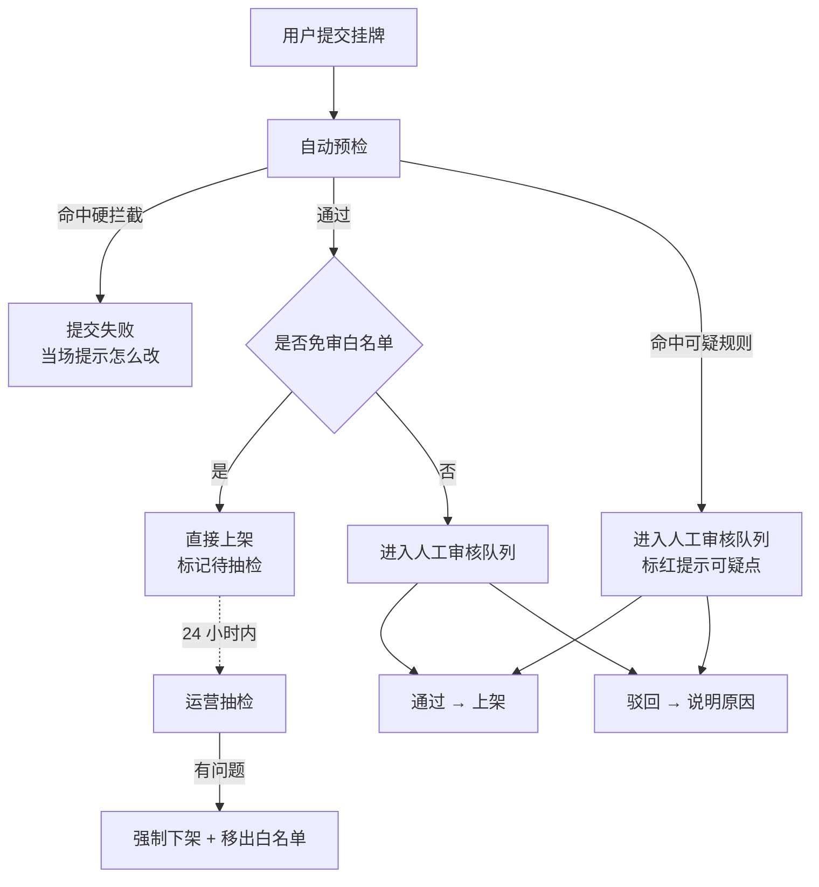

# 服务平台 - 运营审核与风控设计

> 上级文档：[00.模块总览](00.模块总览.md)
>
> 本文回答：平台怎么审、审多久、用户敢不敢发、看到多少、谁能看、出了事怎么办。
>
> **创建日期**：2026-07-25
>
> **本文不含**：建表 DDL 与字段类型明细

---

## 1. 为什么审核是这个模块的生死线

撮合市场只有一个核心资产：**信任**。一条假货源、一台证照过期的车、一次恶意骗单，就足以让用户再也不来。所以运营审核不是「合规流程」，而是产品能力本身。

但审核也有反面：**货源有强时效性。** 今天配载、明天发车的单，如果要等两小时人工审核，等审完车已经没了。审核越严，信任越强，但可用性越差。本方案的核心取舍是：

> **用自动预检拦住明显的坏内容，用免审白名单放行可信的老用户，把人工审核的精力集中在新用户和可疑内容上。**

---

## 2. 审核机制

### 2.1 三条通道

| 通道 | 适用 | 时效 |
|------|------|------|
| **硬拦截** | 明确违规内容 | 即时，提交时就失败 |
| **免审直通** | 免审白名单内的租户 | 即时上架，24 小时内抽检 |
| **人工审核** | 其余全部 | 承诺 2 小时内（工作时段 8:30~20:30），非工作时段次日首个工作时段起算 |

> **审核量的规模预判**：发布权限开放到 `standard`（详见 `00` §5.2）后，可发布租户数比「仅 pro」方案高出一个量级，审核量会同步放大。这意味着**免审白名单与批量通过不是优化项，而是 1.1 期的必需项**——没有它们，人工审核会在灰度阶段就被压垮。同时建议对 standard 租户的白名单准入门槛与 pro 保持一致，不因版本差异区别对待，避免规则复杂化。

### 2.2 免审白名单

同时满足以下条件的租户，由系统自动加入白名单（运营也可手动增删）：

| 条件 | 阈值 |
|------|------|
| 企业认证 | 已通过营业执照核验 |
| 历史挂牌 | 累计发布 ≥ 5 条且全部审核通过 |
| 成交记录 | 累计成交 ≥ 1 单且完成 |
| 违规记录 | 近 90 天无强制下架、无被举报成立 |

移出白名单的触发：抽检发现问题、被举报成立、连续 2 次成交后爽约。移出后需重新累积 30 天无违规才能再次进入。

> 白名单是审核体系里性价比最高的设计：老用户占了大部分发布量，把他们放行，人工审核的压力立刻降到可控范围，同时老用户得到了「我是可信商家」的正反馈。

**实现口径**（`EcoWhitelistService`，阈值集中在 `constants.py`）：

| 条件 | 常量 | 值 | 自动授予 | 人工授予 |
|------|------|----|---------|---------|
| 大厅能力未被关停 | — | — | 必须 | **必须** |
| 企业认证已通过 | — | — | 必须 | **必须** |
| 累计发布数 | `WHITELIST_MIN_PUBLISH` | 5 | 必须 | 可豁免 |
| 完成成交数 | `WHITELIST_MIN_DEAL` | 1 | 必须 | 可豁免 |
| 回溯窗口内无驳回 | `WHITELIST_CLEAN_DAYS` | 90 天 | 必须 | 可豁免 |
| 回溯窗口内无强制下架、无举报成立 | `WHITELIST_CLEAN_DAYS` | 90 天 | 必须 | 可豁免 |
| 被移出后的冷静期 | `WHITELIST_RECOVER_DAYS` | 30 天 | 必须 | 可豁免 |

只有前两条是硬条件，人工也不能绕：**大厅能力已被关停还给他开免审，是两条互相打架的处置；认证是参与大厅的门槛，绕过它等于把身份不明的租户直接放进大厅。**

其余条件人工可豁免，包括违规记录。这个选择是有代价的（运营理论上能给一个上个月刚被强制下架的租户开免审），但另一种做法代价更大：强制下架本身可能是上一个审核员判错的，如果违规记录硬堵免审通道，唯一的补救途径就是直接改数据库。人工授予会写 `sys_operation_log`、可随时移出，用「可追溯」而不是「不可能」来约束它。

**回溯窗口刻意收窄到 90 天，而不是「历史全部审核通过」。** 一年前的一次驳回永久堵住免审通道，与本节自己定的「移出后重新累积 30 天即可再进」是两套互相矛盾的尺度——后者已经确认了处置应当随时间衰减。

判定结果不是布尔值，而是逐条列出未达标项（`EligibilityResult.unmet`），审核详情页直接展示「累计发布 3 条，还差 2 条」「2026-07-13 被移出过，2026-08-12 之后才能重新进入」，避免运营对着一个「不符合条件」反复猜。`eligible`（自动结论）与 `manualAllowed`（人工能否拍）分开返回，界面才知道该灰按钮还是留按钮。

自动评估任务必须跳过冷静期内的租户，否则运营刚移出、当晚就被自动加回来（见 `07` §4.13 的 `whitelist_revoked_at`）。**自动任务只负责授予，永不负责移出**——移出是处置动作，必须有人签字。

**抽检**（`SPOT_CHECK_HOURS = 24`）：免审直通的挂牌上架后进抽检队列，按上架时间正序排，24 小时内抽检完。抽检通过只改审核状态为「抽检通过」、不动展示，租户端毫无感知；抽检发现问题则强制下架 + 移出白名单，两件事必须一起做——只下架这一条，同一个租户下一条照样直通上架。

抽检不通过时若该挂牌已经进了成交，就只记抽检失败并移出白名单，不下架挂牌（同 §2.5 末尾的硬约束）。这个租户后面发的所有内容都要过人工审核，已经跑起来的这一单该不该终止，交给成交单那条线判断。

### 2.3 自动预检规则

| 规则 | 类型 | 处置 | 提示文案 |
|------|------|------|---------|
| 正文/备注中包含手机号、微信号、QQ 号 | 硬拦截 | 提交失败 | 「为了保护双方，请不要在信息里直接留联系方式。同行对你的信息感兴趣时，你们会自动互相看到联系方式。」 |
| 包含敏感词（政治、色情、违禁品、竞品导流） | 硬拦截 | 提交失败 | 「信息里有不能发布的内容，请修改后再提交」 |
| 货物类别为违禁品（危化品无资质、活体等） | 硬拦截 | 提交失败 | 「这类货物需要专门资质，暂不支持在大厅发布」 |
| 运力证照已过期 | 硬拦截 | 提交失败 | 「{证照名称}已过期，请先更新后再对外发布」 |
| 起终点相同 | 硬拦截 | 提交失败 | 「起点和终点一样，请检查一下线路」 |
| 装车时间已过 | 硬拦截 | 提交失败 | 「计划装车时间已经过了，请调整时间」 |
| 报价明显异常（低于同线路均价 50% 或高于 300%） | 可疑 | 转人工并标红 | — |
| 24 小时内同租户发布 > 20 条 | 可疑 | 转人工并标红 | — |
| 与该租户近 7 天内某条挂牌高度相似 | 可疑 | 转人工并标红（疑似重复刷屏） | — |
| 新注册租户（< 30 天）首次发布 | 可疑 | 转人工并标红 | — |

> 报价异常规则需要同线路历史均价作为基线，一期数据不足时先关闭该规则，等成交数据积累后开启。规则应做成配置化的，运营后台可开关和调阈值，不要硬编码。

### 2.4 快速复审

用户编辑已上架的挂牌后需要重新审核，但不是所有编辑都需要完整重审：

| 编辑内容 | 处理 |
|---------|------|
| 仅修改联系人、备注、可见范围 | **快速复审**：仅跑自动预检，通过即留在大厅，不中断展示 |
| 修改价格、结算方式、标题 | 快速复审 |
| 修改线路、台数、时间、货物、车型、车辆、司机 | **完整重审**：回到待审核队列，期间从大厅移出 |

这个区分很重要：如果改个联系人电话都要重新排两小时队，用户就不会去维护信息准确性了。

**分档的判据不是「字段重不重要」，而是「改完之后，正在看这条信息的人是否被误导了」。** 线路、时间、台数、货物、车型、车辆、司机改了就是另一笔生意，同行按旧信息打过来会白跑，必须先撤出大厅；标题、备注、报价、联系人改的是描述与条件，同行看到的仍是同一笔生意。

按这个判据，**标题归快速复审**。它是最显眼的文本、也最容易夹带引流内容，但「其他要求」「服务承诺」同样是自由文本、同样在快速复审档，单独把标题拔高一档挡不住什么，只会造成规则不自洽。自由文本的风险由预检（联系方式硬拦 + 敏感词）加运营抽检兜底，不靠重审档位兜。

**三条实现约束：**

1. **命中任何可疑标记时，快速复审升级为完整重审。** 预检放过但需要人看一眼的内容，不能继续留在大厅。免审白名单同理被收回，与发布链路一致（§2.2）。
2. **快速复审保持原审核状态，不改写成「审核通过」。** 原本是「免审直通待抽检」的挂牌，被一次改联系人洗成正式通过，抽检队列里就再也找不到它了。
3. **编辑不修改有效期。** 展示天数只能由「延长展示」修改，否则用户反复保存就能无限续命，把展示天数上限绕空。
4. **完整重审不影响已有的洽谈意向。** 挂牌退回待审核、从大厅移出，但待响应与洽谈中的意向一律不动——洽谈是双方已经建立的关系，不能因为发布方把装车时间挪了一天，系统就单方面把正在谈的同行踢掉。改了哪些项记进 `sys_eco_post_audit.changed_fields`，后续给洽谈方推「对方更新了信息」用的就是这份数据。

**重新上架时的处置历史。** 曾被平台强制下架的挂牌允许重新上架（用户改好内容再上是正当需求，硬拦只会逼他新发一条一模一样的，反而甩掉了这段历史），但必须把 `was_force_delisted` 写进 `precheck_flags`，让审核员在队列里就看到「这条被强制下架过」，否则同一条违规内容会被当成新挂牌重新放行。

### 2.5 审核界面要点

运营后台的审核队列参考现有意见反馈处理页（`console/src/views/customer_voice/feedback/index.vue`）的交互模式，但需要针对批量场景优化：

- 队列按**进队时间**（`submitted_at`，非创建时间，见 `07` §3.5）正序，等待超过 1 小时的标黄、超过 2 小时的标红
- 卡片式展示，一屏能看完一条挂牌的全部关键信息，不需要点进详情
- **支持勾选批量通过**（正常情况下大部分挂牌是没问题的，逐条点击效率太低），单次上限 50 条（`MAX_BATCH_APPROVE`）
- 驳回必须选原因 + 可补充说明
- 右侧固定面板展示该租户的档案：认证状态、历史发布数、通过率、成交数、违规记录，帮助审核员快速判断
- 一键「加入免审白名单」/「移出白名单」，不满足条件时展示还差哪几项

**已落地的页面**（`console/src/views/ecosystem/`）：

| 页面 | 菜单 / 路由 | 承担的事 |
|------|------------|---------|
| 挂牌审核 | `ecosystem_ops:post-audit` → `/ecosystem/post-audit` | 顶部积压数字卡（点数字即带筛选跳队列）+ 待审 / 待抽检 / 全量检索三个页签 + 卡片列表 + 右侧发布方档案 + 勾选批量通过 |
| 免审白名单 | `ecosystem_ops:audit-whitelist` → `/ecosystem/audit-whitelist` | 成员列表（带发布量与违规数）+ 输入编码查资格后授予 + 移出 |

发布方档案与「授予 / 移出」做成了跨页共用的一个组件（`views/ecosystem/components/tenant-profile.vue` + `use-whitelist-actions.ts`）。共用的不只是布局，更是确认文案：「移出后 30 天内不会被自动加回来」这句风险提示如果只写在其中一个入口，从另一个入口点下去的人就不知道这件事。

审核详情做成抽屉而不是独立页面：审核员的动线是「在队列里连着处理十几条」，跳页面会丢掉队列位置和已勾选的项。抽屉里按「先看结论、再看内容」排：预检与源单核验置顶，挂牌全字段、发布方档案、流转流水分页签。

**驳回原因编码**（`PostRejectReason`，落 `sys_eco_post_audit.reason_code`）：

| 码 | 原因 | 码 | 原因 |
|----|------|----|------|
| 1 | 信息不完整 | 5 | 价格异常 |
| 2 | 信息不真实 | 6 | 疑似重复发布 |
| 3 | 联系方式违规 | 7 | 含违规内容 |
| 4 | 货物类别不支持 | 9 | 其他 |

必须存编码而不只存自由文本，是因为**只有编码才能做审核质量统计**：哪类问题最多、该去补哪条预检规则，靠一堆手写说明是统计不出来的。选了「其他」的必须填说明。

每个编码配一条**默认驳回文案**（`REJECT_TEMPLATES`）。运营只选原因不写说明时，推给租户的是「这条信息和实际情况对不上，请核对后重新提交」，而不是「信息不真实」四个字——后者没有任何下一步，租户只会来问客服。运营写了补充说明则以补充说明为准。

**批量通过逐条一个 SAVEPOINT**：勾了 50 条，其中 3 条因为租户自己刚撤回而状态已变，只有这 3 条失败，剩下 47 条照常通过，并明确告诉运营是哪 3 条失败、为什么。绝不能是「有一条不行，50 条全没动」。

**强制下架有一条硬约束：已进入成交（`LOCKED` / `FULFILLING`）的挂牌不能从挂牌侧下架**，必须走成交单的终止流程，否则会留下一张来源挂牌已消失的成交单。界面上要直接给这个指引，而不是报一句「操作失败」。

### 2.6 审核 SLA 与监控

| 指标 | 目标 | 看板位置 |
|------|------|---------|
| 平均审核时长 | < 30 分钟 | 生态运营看板 |
| 2 小时内处理率 | > 95% | 同上 |
| 超时未处理数 | 实时告警 | 同上 + 运营待办 |
| 免审直通占比 | 逐步提升至 > 60% | 同上 |
| 抽检问题率 | < 2% | 同上 |

**时长一律按工作时段分钟数计，不用自然时长**（`audit_sla`）。凌晨 2 点提交的挂牌，审核员 9 点上班时自然时长已经 7 小时——按自然时长算，每天早上整个队列全是红的，红色就不再有区分度，真正压线的那几条反而被埋掉；SLA 看板同理，把夜间等待算进平均审核时长，指标只反映用户的提交时间分布，不反映运营效率。

| 参数 | 值 |
|------|----|
| 工作时段 | 08:30 ~ 20:30 |
| 承诺处理时长 | 120 工作分钟 |
| 队列预警阈值 | 60 工作分钟 |

**周末不排除。** 物流七天运转，周末的车照样在跑，货源时效性不因为是周六就变弱；排除周末等于让周五晚上发布的用户等到周一，那条挂牌届时早就作废了。周末覆盖靠运营排班解决，不靠算法开例外。

紧迫度三档：正常 / 即将超时（≥ 60 工作分钟）/ 已超时（≥ 120 工作分钟），队列排序与前端标色共用这一个判定。积压统计需要「超时条数」时，用同一套口径反推出一个时间点再进 SQL 过滤，避免 Python 与 SQL 两处各算一遍、算出两个不同的数。

---

## 3. 可见性分层

### 3.1 四个层级

用户敢不敢发布，取决于他对「谁能看到什么」有多少掌控。设计四个层级，**后端按层级裁剪字段后返回，不是前端隐藏**：

| 层级 | 谁处于这一层 | 能看到 |
|------|-------------|--------|
| **L1 匿名层** | 任何登录用户（含未开通发布权限的 lite/basic 租户） | 线路（省市级）、货量/车型、时间、计价方式与价格区间、企业脱敏名（`杭州**物流`）+ 认证标识 + 信誉分 |
| **L2 认证层** | 已通过企业认证的租户 | L1 + 企业全称 + 企业名片（简介、主营线路、车队规模、历史成交数、评价） |
| **L3 洽谈层** | 意向已被响应的双方 | L2 + 双方联系人姓名与手机 + 货物/车辆的完整明细 + 详细地址（区县以下） |
| **L4 成交层** | 成交单双方 | L3 + 履约信息（车牌、司机、进度、附件） |

发布方可以对单条挂牌做两处覆盖：

- **提前公开企业全称**：把企业名从 L2 提到 L1，适合想扩大曝光的场景
- **提前公开联系方式**：把联系方式从 L3 提到 L2，适合急单，牺牲隐私换速度（界面需明确提示风险）

### 3.2 永不公开的字段

无论哪个层级、无论用户怎么设置，以下信息**不进入平台库**，因此技术上就不可能泄露：

| 字段 | 原因 |
|------|------|
| 客户名称 / 客户 ID | 客户资源是物流公司的命根子，泄露给同行等于送客户 |
| 内部单号（任务单号、运单号） | 可反推业务量 |
| 商品车 VIN 码 | 属于主机厂的发运数据 |
| 内部成本、合同价、计费规则 | 定价策略是核心机密 |
| 司机手机号、身份证、证件照 | 个人信息合规红线 |
| 收发货点的详细地址与联系人 | 属于客户信息 |

> 这一条比可见性分层更根本：**分层控制的是「返回不返回」，不进库控制的是「有没有」。** 对最敏感的数据，我们选择让它压根不存在于平台库，即使代码写错了也泄露不了。

---

## 4. 屏蔽名单

### 4.1 为什么必须有

物流行业地域性强，同一个城市的物流公司彼此都认识，而且往往是直接竞争对手。「我愿意把货给外地同行，但绝不想让隔壁老王知道我在做哪条线」——这是真实且普遍的心态。**没有屏蔽能力，很多客户根本不会发第一条挂牌。**

### 4.2 机制

| 项 | 设计 |
|---|------|
| 设置入口 | 企业名片页「不希望看到我信息的企业」 |
| 添加方式 | 按企业名搜索平台内租户，或从「曾经的合作对象」列表选 |
| 生效范围 | 租户级全局，对该租户所有挂牌生效；也支持单条挂牌单独指定额外屏蔽 |
| 效果 | 被屏蔽方在大厅列表、搜索、详情、订阅提醒中都看不到该租户的任何挂牌，表现为「不存在」而非「无权查看」 |
| 反向不可见 | 被屏蔽方**不会**收到任何提示，也无法得知自己被谁屏蔽 |
| 上限 | 每租户最多 50 家，避免被滥用成白名单模式 |
| 实现 | 统一在 `EcoVisibilityFilter` 中拼接 `NOT EXISTS` 子查询，Service 层无需感知 |

### 4.3 反向能力（二期考虑）

「只让指定企业看到」（定向发布）是屏蔽的反向需求，适合已有合作意向的场景。一期不做，因为定向发布本质上是点对点沟通，用现有的承运商互通更合适。

---

## 5. 企业认证与信誉

### 5.1 认证

不新建一套认证流程，复用注册时已采集的信息：

| 认证项 | 数据来源 | 展示 |
|-------|---------|------|
| 营业执照核验 | `sys_tenant.license_no` + 运营后台人工核验打标 | 「已认证」蓝标 |
| 道路运输经营许可证 | 企业名片中上传，运营核验 | 「持证承运」标 |
| 实名联系人 | 注册手机号已验证 | 「实名」标 |

运营后台提供 `POST /api/console/ecosystem/tenants/{code}/verify` 打标动作。认证是参与大厅的**前提**：未认证租户可以浏览，但不能发布、不能发起意向。这条限制比 feature 门控更靠前，是市场秩序的基础。

### 5.2 信誉展示（不做算分）

一期**不做综合信用分**，只做客观数据的透明展示。理由：信用分需要大量样本才有区分度，样本不足时的分数是噪音，反而误导用户；而且分数一旦公布就会被博弈。

企业名片与挂牌卡片上展示的信誉信息：

| 指标 | 计算 | 展示形式 |
|------|------|---------|
| 累计成交 | 完成的成交单数 | 「已完成 23 单合作」 |
| 履约完成率 | 完成数 / 成交数 | 「履约完成率 96%」，成交数 < 5 时不展示 |
| 平均评分 | 收到评价的均值 | 星级 + 数值，评价数 < 3 时显示「暂无足够评价」 |
| 好评标签 | 出现次数最多的 3 个标签 | 「准时」「沟通顺畅」「车况好」 |
| 平台经营时长 | 租户注册至今 | 「入驻 1 年 3 个月」 |
| 违规记录 | 强制下架 / 举报成立次数 | 有记录时展示警示条，无则不显示 |
| 响应速度 | 意向平均响应时长 | 「通常 2 小时内回复」 |

> 「响应速度」是撮合平台里被严重低估的指标。找货方最烦的是发了意向石沉大海，这个指标能有效引导挂牌方及时处理，也帮找货方选择靠谱对象。

### 5.3 爽约处置

| 行为 | 处置 |
|------|------|
| 选定后 24 小时不确认 | 成交单自动作废，计入承接方「爽约」 |
| 确认成交后单方面终止 | 计入终止方「爽约」，需填原因 |
| 30 天内爽约 ≥ 2 次 | 移出免审白名单 + 名片展示警示 |
| 30 天内爽约 ≥ 4 次 | 暂停发布与发起意向权限 7 天 |

处置规则应做成配置化，一期阈值先按上表，运营可根据实际情况调整。

---

## 6. 举报与处置

| 项 | 设计 |
|---|------|
| 入口 | 挂牌详情页、成交详情页的「举报」 |
| 举报类型 | 信息虚假 / 联系不上 / 恶意压价 / 骗取信息 / 爽约 / 违法违规 / 其他 |
| 必填 | 类型 + 说明；可上传截图凭证 |
| 处理 | 运营后台受理，48 小时内给出结论：成立 / 不成立 / 证据不足 |
| 成立后处置 | 挂牌强制下架 + 记入被举报方违规记录 + 视情节暂停权限；严重的直接关闭该租户的大厅能力 |
| 恶意举报 | 同一租户 30 天内 3 次举报不成立，暂停其举报权限 30 天 |
| 反馈 | 举报人收到处理结论通知 |

举报处理复用现有意见反馈的交互模式（`sys_feedback` 的状态机与处理页），不重新设计一套。

---

## 7. 绕单问题的态度

### 7.1 直面它

撮合平台的经典难题：双方在平台上认识后，直接微信/电话成交，不在平台登记，平台既拿不到数据也收不到费。

**一期的态度是：接受它，不用强制手段对抗。**

理由：我们的商业模式不是抽佣，而是 pro 版本订阅费。用户绕单不影响我们收钱，反而说明大厅创造了真实价值。真正的损失只有两个——成交数据缺失、信誉体系空转。而任何强制手段（隐藏联系方式到底、要求先付费才能沟通）都会大幅降低撮合成功率，得不偿失。

### 7.2 用引导代替强制

| 手段 | 说明 |
|------|------|
| 登记有回报 | 只有登记成交并完成，才能积累「成交数 / 完成率 / 评价」，这些是下次谈生意的信任资本 |
| 登记很轻 | 成交登记只需 3 个字段（成交价、承接台数、装车时间），30 秒完成 |
| 主动提醒 | 意向进入洽谈状态 3 天后，给双方一条待办：「和 XX 谈得怎么样了？谈成的话记得登记一下，方便后续跟进和积累信誉」 |
| 争议保护 | 明确告知：平台上的洽谈记录与成交登记可以在发生纠纷时作为凭证，线下私聊没有 |
| 数据价值 | 成交记录可导出，作为企业自己的外协台账 |

### 7.3 二期的真解

在线结算与资金托管才是绕单的真正解药——钱走平台，数据自然沉淀。这依赖支付通道与财务模块打通，列入第 3 期。

---

## 8. 风控规则汇总

| # | 规则 |
|---|------|
| 1 | 未通过企业认证的租户不能发布挂牌、不能发起意向 |
| 2 | 挂牌正文中的联系方式一律硬拦截 |
| 3 | 免审白名单租户先发后审，24 小时内抽检 |
| 4 | 人工审核 SLA：工作时段 2 小时内 |
| 5 | 敏感字段（客户名、VIN、内部成本、司机手机）不进入平台库 |
| 6 | 联系方式在意向被响应后双向解锁，不支持单向获取 |
| 7 | 屏蔽名单对被屏蔽方完全静默，上限 50 家 |
| 8 | 不做综合信用分，只展示客观数据 |
| 9 | 爽约累计触发权限暂停，阈值可配置 |
| 10 | 所有审核、下架、处置动作全部写审计流水，可追溯到人 |
