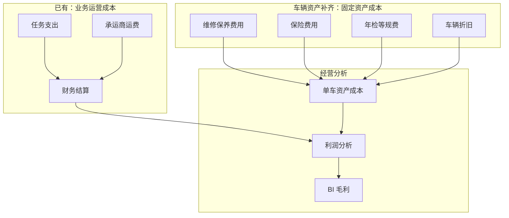
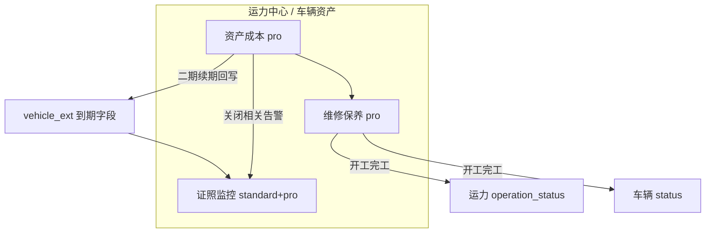

# 企业端车辆资产模块 - 模块总览

> **所属阶段**：阶段八 - 车辆资产（Pro 差异化 + 运力中心资产域收口）
>
> **文档状态**：方案重整（v2）
>
> **创建日期**：2026-07-30
>
> **最近更新**：2026-07-30（决策落地：移除运力宝版本口径；模块定名「车辆资产」；挂在运力中心二级）
>
> **优先级**：高（拉开 standard / pro 价值差距；固定资产在线化）
>
> **决策摘要**：
>
> 1. **版本矩阵不含运力宝（ylb）**——综合业务线仅保留 `lite` / `standard` / `pro`（本方案口径；平台快照落地另开任务）
> 2. **大模块定名「车辆资产」**——覆盖证照监控 + 维修保养 + 资产成本
> 3. **菜单挂在运力中心下二级目录**——不新开顶级中心
>
> **feature 分工**：
>
> | 子能力 | feature_code | 版本 |
> |--------|--------------|------|
> | 证照监控 | `fleet_compliance` | standard / pro |
> | 维修保养 / 资产成本 | `fleet_maintenance` | **仅 pro** |
>
> **关联文档**：
>
> - [02.资源管理模块/01.车辆管理](../02.资源管理模块/01.车辆管理.md)
> - [02.资源管理模块/04.运力中心](../02.资源管理模块/04.运力中心.md)
> - [06.运力宝/02.证照监控引擎技术设计](../../06.运力宝/02.证照监控引擎技术设计.md)（引擎实现仍可复用；**产品版本口径以本文为准，不再售卖 ylb**）
> - [06.运力宝/04.商业化基建-功能守卫与配额](../../06.运力宝/04.商业化基建-功能守卫与配额.md)（`require_feature` 机制）
> - [04.计费引擎模块/04.任务支出成本自动计算](../04.计费引擎模块/04.任务支出成本自动计算系统设计文档.md)
> - [07.财务结算模块/00.模块总览](../07.财务结算模块/00.模块总览.md)
> - [BI数据分析](../BI数据分析.md)
>
> **本目录文档清单**：
>
> | # | 文档 | 内容 |
> |---|------|------|
> | 00 | 本文 | 定位、成本全景、菜单 IA、版本边界、术语、分期 |
> | 01 | [市场调研与竞品分析](01.市场调研与竞品分析.md) | 痛点、竞品矩阵、差异化 |
> | 02 | [产品方案与商业化设计](02.产品方案与商业化设计.md) | 价值主张、财务视角、版本对比、升级路径 |
> | 03 | [功能需求与分期实施](03.功能需求与分期实施.md) | 页面/流程/验收 |
> | 04 | [业务联动与技术概要](04.业务联动与技术概要.md) | 状态回写、实体草图、成本口径、落地 checklist |

## 一、模块定位与设计目标

### 1.1 定位

**车辆资产**是运力中心下的资产域能力：把「车/人合规」与「自有车养护与成本」收在同一入口，服务两类目标：

1. **作业层**：证照到期看得见；维修保养进系统，并与运力调度打通——「车在修」→「运力不可派」。
2. **经营层**：把车辆做成**在线固定资产**——维保/保险/年检/折旧进入经营账，补齐「只有业务运营成本、缺少资产成本」的缺口。

| 核心问题 | 落在哪个子能力 | 不做的事 |
|---------|---------------|---------|
| 证件/保险/年检何时到期 | **证照监控** | 不做续期台账与保费沉淀（续期在维修保养侧二期） |
| 何时该修/保、能不能派车 | **维修保养**（pro） | 不改任务单状态机 |
| 养车花了多少、资产赚不赚钱 | **资产成本**（pro，二期为主） | 不做会计总账 / 完整 CMMS |

> 一句话：**运力中心管「谁能派」；车辆资产管「车是否合规、是否在养、养车花多少」——专业版把固定资产做成在线经营对象。**

### 1.2 设计目标

| # | 目标 | 落点 |
|---|------|------|
| 1 | **版本矩阵收敛** | 方案与销售口径不再包含运力宝（ylb） |
| 2 | **制造 standard ↔ pro 价值差** | 标准版有证照「看见」；专业版有维保闭环 + 运力联动 + 资产成本 |
| 3 | **菜单心智统一** | 运力中心 → 车辆资产（二级目录）收口证照与维保 |
| 4 | **固定资产在线化** | 车辆从档案字段升级为可记账资产对象 |
| 5 | **补齐成本全景** | 业务运营成本 + 资产成本 → 经营分析 |
| 6 | **feature 不混绑** | 目录不绑 `fleet_maintenance`，避免挡住标准版证照监控 |
| 7 | **分期可落地** | 见第三节 |

### 1.3 企业成本全景：业务成本 × 资产成本



| 成本类型 | 现状 | 车辆资产角色 |
|---------|------|-------------|
| 业务运营成本 | 已有（任务支出 + 结算） | 不重复建设 |
| 维修保养 | 线下 | 一期工单费用留痕（pro） |
| 保险 / 年检费用 | 仅有到期日 | 二期台账沉淀（pro） |
| 车辆折旧 | 缺失 | 二期资产卡片 + 直线法（pro） |

## 二、菜单信息架构（已拍板）

挂在 **运力中心** 下，**不新开顶级中心**。

```
运力中心
├── 总览
├── 自有运力
├── 承运商运力
├── 社会运力
└── 车辆资产                    ← 目录；feature_code = NULL（可见性随子菜单）
    ├── 证照监控                ← fleet_compliance · standard / pro
    ├── 维修保养                ← fleet_maintenance · 仅 pro
    │     （一期页内 Tab：看板 / 工单 / 保养计划）
    └── 资产成本（二期）        ← fleet_maintenance · 仅 pro
```

| 菜单项 | menu_code（建议） | path（建议） | feature | visible |
|--------|------------------|-------------|---------|---------|
| 车辆资产（目录） | `capacity:vehicle_asset` | — | NULL | 1 |
| 证照监控 | `capacity:compliance`（已有） | `/capacity/compliance` | `fleet_compliance` | 1（挪入目录下） |
| 维修保养 | `capacity:maintenance`（已有，改名） | `/capacity/maintenance` | `fleet_maintenance` | 1（原车辆维保） |
| 资产成本 | `capacity:vehicle_asset:cost` | `/capacity/vehicle-asset/cost` | `fleet_maintenance` | 二期 |

**标准版用户**：车辆资产下只见「证照监控」。  
**专业版用户**：另见「维修保养」「资产成本」。  
**目录不要绑** `fleet_maintenance`，否则标准版会丢证照入口。

## 三、子能力边界

| 维度 | 证照监控 | 维修保养 + 资产成本 |
|------|---------|-------------------|
| feature | `fleet_compliance` | `fleet_maintenance` |
| 版本 | standard / pro | **仅 pro** |
| 主体 | 司机+车；自有/社会/承运商 | 主要自有车 |
| 重心 | 到期扫描、分级告警 | 计划、工单、状态联动、费用与折旧 |
| 保险/年检 | 读到期日并告警 | 二期续期台账回写到期日并沉淀金额 |



## 四、目标客户与角色

| 客户 | 版本路径 |
|------|---------|
| 自有车 ≥20 台的车队 / 专线 | standard → 升 pro（车辆资产是主卖点之一） |
| 承运商上报场景 | lite（无车辆资产深层能力；证照/维保不作为 lite 卖点） |

| 角色 | 典型动作 |
|------|---------|
| 车队长 | 证照待办、保养计划、维修工单 |
| 调度员 | 运力「维修保养中」避派 |
| 财务 / 老板 | 单车资产成本、经营毛利输入（二期起） |

## 五、分期总览

| 期次 | 主题 | 交付 | 成功标准 |
|------|------|------|---------|
| **一期** | 菜单收口 + 维修保养闭环 | 车辆资产目录；证照挪入；维修保养（工单/计划/看板）+ 运力状态联动 | 菜单可达；开工运力不可派；完工可恢复 |
| **二期** | 固定资产成本 | 保险/年检台账、资产卡片与折旧、资产成本页 | 单车可汇总维保+保险+年检+折旧 |
| **三期** | 经营闭环 | 事故/配件/司机报修；利润分析/BI 消费资产成本 | 车辆维度利润可含资产成本 |

### 5.1 明确不做（一期～二期）

| 不做 | 原因 |
|------|------|
| 恢复或继续售卖运力宝（ylb）版本 | 版本矩阵已收敛 |
| 新开「资产中心」顶级菜单 | 顶级已满；资产属运力域 |
| 把证照 feature 并进 `fleet_maintenance` | 会挡住标准版合规能力 |
| OBD/故障码、完整 CMMS、会计总账 | 偏离 TMS 主线 |
| 工单自动生成财务付款单 | 先台账与分析，后评估联动 |

## 六、术语表

| 术语 | 含义 |
|------|------|
| 车辆资产 | 运力中心下二级模块总称：证照监控 + 维修保养 + 资产成本 |
| 维修保养 | Pro 子能力：工单、保养计划、与运力联动（原「车辆维保/车务」） |
| 固定资产在线化 | 车辆身份、状态、养护与成本数据进系统，可持续运营与分析 |
| 业务运营成本 | 任务产生的支出（司机运费、油补、承运运费等） |
| 资产成本 | 持有/养护车辆的支出与摊销（维保、保险、年检、折旧） |
| 资产卡片 | 购入日、原值、残值、折旧年限等经营侧档案（非会计总账） |
| 证照监控 | 到期扫描与分级告警引擎能力 |

## 七、落地 checklist（方案阶段不执行代码）

1. **产品版本**：从 `product_version` / `version_feature` / 销售物料中移除 ylb（独立变更单，含存量租户迁移策略）
2. **菜单**：新增目录「车辆资产」；证照监控挂到目录下；「车辆维保」改名为「维修保养」并 `visible=1`
3. **feature**：`fleet_compliance` ∈ standard+pro；`fleet_maintenance` ∈ pro；配置 `required_tables`
4. **迁移 / API / 状态联动**：见 `04`
5. **文案**：Placeholder「旗舰版」→「专业版」

## 八、阅读顺序

1. 本文（边界与菜单）→ `02`（商业化）→ `03`（功能）→ `04`（技术）  
2. 调研细节见 `01`
