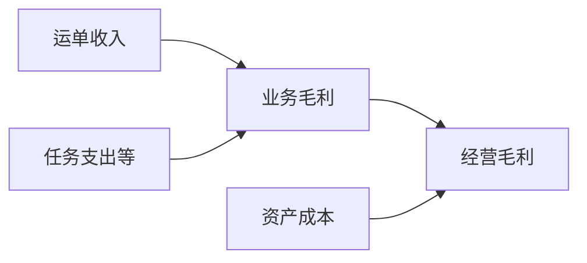
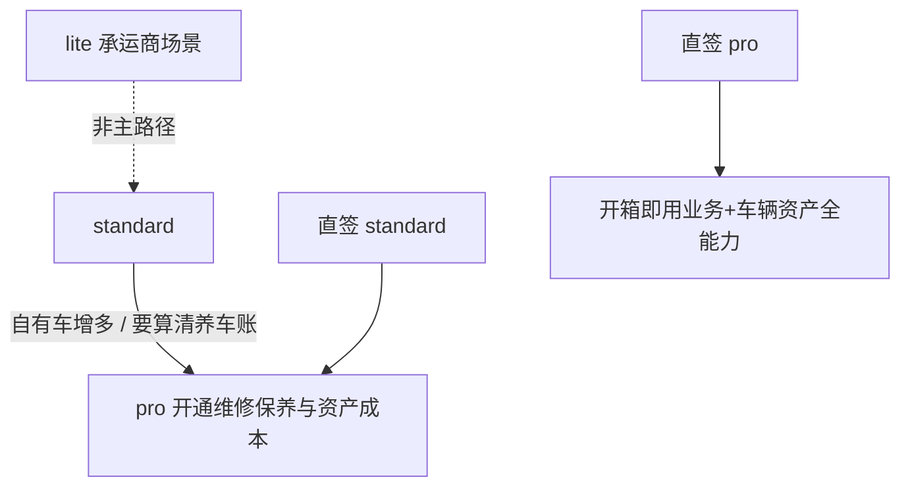

# 车辆资产 - 产品方案与商业化设计

> 关联：[00.模块总览](00.模块总览.md) · [01.市场调研与竞品分析](01.市场调研与竞品分析.md) · [03.功能需求与分期实施](03.功能需求与分期实施.md)
>
> **版本口径（已拍板）**：`lite` / `standard` / `pro`——**移除运力宝（ylb）**  
> **模块定名**：车辆资产（运力中心二级）  
> **最近更新**：2026-07-30 方案重整 v2

## 一、为什么做车辆资产

### 1.1 版本价值差

收敛后的综合业务线：

| 版本 | 定位（本方案） |
|------|---------------|
| lite | 承运商邀请上报等轻量场景 |
| standard | 综合业务：运单/任务/计费/财务 + **证照监控** |
| pro | standard + BI/AI 等高阶能力 + **维修保养闭环、运力联动、资产成本** |

对自有车 ≥20 台的客户：

- 调度与计费解决「怎么赚钱」；
- **车辆资产**解决「车是否合规、能否持续赚钱」，并把固定资产成本补进经营账。

若专业版缺少可演示的维保与资产成本，升级叙事只剩 BI/AI，偏虚；或客户另买管车软件，数据割裂。

### 1.2 可演示卖点（pro）

| 演示点 | 客户感知 |
|--------|---------|
| 开维修单 → 运力变「维修保养中」 | 调度不会误派 |
| 保养到期在维修保养看板 | 不用翻 Excel |
| （二期）单车资产成本 | 哪台车在烧钱 |
| （二期）业务成本 + 资产成本对照 | 经营毛利更接近真实 |

## 二、价值主张

### 2.1 对外一句话

> **专业版在运力中心把车辆做成在线固定资产：合规看得见，修保养进系统并同步运力，维保/保险/折旧进经营账。**

### 2.2 财务与经营视角

| 视角 | 标准版可见 | 专业版车辆资产补齐 |
|------|-----------|-------------------|
| 业务 | 运单收入、任务支出、结算 | — |
| 合规 | 证照到期监控 | 续期台账与费用沉淀（二期） |
| 资产养护 | — | 维修保养工单与计划 |
| 经营 | 业务毛利近似 | 单车资产成本 → 更真实的经营毛利 |

| 角色 | 价值 |
|------|------|
| 老板 | 单车效益、运力结构决策 |
| 财务 | 养车成本可归集、可导出 |
| 车队长 | 工单闭环 + 与调度同步 |

与财务结算 / 利润分析 / BI：**车辆资产沉淀资产成本；财务结算管收付；利润分析/BI 消费数据。**  
不宣称替代会计折旧准则。

### 2.3 版本内分工话术（无运力宝）

| 能力 | 解决什么 | 不解决什么 |
|------|---------|-----------|
| 标准版 + 证照监控 | 资质到期看得见 | 不负责工单、联动、资产成本账 |
| 标准版业务 | 接单派车计费结算 | 维保仍可靠线下 |
| **专业版 · 车辆资产（维保/成本）** | 计划保养、维修闭环、运力联动、固定资产成本 | 不做重配件仓、硬件、总账 |

销售话术：

1. 「标准版已能监控证照到期——底线合规。」
2. 「车多了以后，修车和调度不同步，毛利也没算养车的钱。」
3. 「升专业版：运力中心 → 车辆资产里管维修保养；进厂自动不可派，费用和折旧进经营账。」

## 三、版本对比（销售口径）

| 能力 | lite | standard | **pro** |
|------|:---:|:---:|:---:|
| 自有运力建档 | ✓ | ✓ | ✓ |
| **证照到期监控**（车辆资产下） | ✗ | ✓ | ✓ |
| 运单 / 任务 / 调度 | ✗ | ✓ | ✓ |
| 计费 / 财务结算 | ✗ | ✓ | ✓ |
| 业务运营成本（任务支出等） | ✗ | ✓ | ✓ |
| **维修工单闭环** | ✗ | ✗ | **✓** |
| **保养计划与提醒** | ✗ | ✗ | **✓** |
| **维修→运力状态联动** | ✗ | ✗ | **✓** |
| **保险/年检续期台账**（二期） | ✗ | ✗ | **✓** |
| **资产卡片与折旧**（二期） | ✗ | ✗ | **✓** |
| **单车资产成本汇总**（二期） | ✗ | ✗ | **✓** |
| BI / 利润分析等 | ✗ | ✗ | ✓ |
| 参考配额（人/车） | 5/20 | 20/100 | 100/500 |
| 参考定价 | 免费 | 2999/年 | 9999/年 |

> 本表为**产品方案口径**。仓库中若仍存在 `ylb`，视为待移除的历史版本，不纳入新签与新宣讲。  
> `fleet_maintenance` 仅挂 pro；`fleet_compliance` 挂 standard + pro。

### 3.1 标准版升级引导（维修保养入口）

- 「维修保养是专业版能力。开通后可登记维保、同步运力，并把养车成本沉淀进经营分析。」
- 禁止技术腔（feature / HTTP 等）。
- 证照监控在标准版正常可用，**不要**做成整体车辆资产目录的升级墙。

## 四、转化路径

| 路径 | 触发信号 | 主推 |
|------|---------|------|
| standard → pro | 调度扯皮、漏保养 | 状态联动演示 |
| standard → pro | 毛利算不准、不知哪台车亏 | 固定资产在线化 |
| 直签 pro | 招标要求维保台账 + 成本分析 | 车辆资产 + 利润分析 + BI |

**已取消**：运力宝获客 → 再升级综合系统 的主路径叙事。

## 五、包装与指标

| 项 | 建议 |
|----|------|
| SKU | 车辆资产维保/成本作为 pro 内置，不单拆 |
| 配额 | `max_vehicles`；工单量不另设配额 |
| 比价 | 「管车软件另购还要对 TMS；我们在运力中心完成修车联动与养车成本」 |

| 指标 | 目标（建议） |
|------|-------------|
| pro 租户 30 天内 ≥1 张工单 | ≥ 40% |
| 开工触发运力=5 的比例 | ≥ 80%（有绑定运力时） |
| 完工工单费用填写率（二期） | ≥ 60% |
| 资产卡片原值完整率（二期） | ≥ 50% |

## 六、风险

| 风险 | 应对 |
|------|------|
| 存量 ylb 租户 | 版本移除变更单中定义迁移到 standard 或停服策略（本方案不展开） |
| 标准版看不到证照 | 目录 `feature_code=NULL`，子菜单各自门控 |
| 「旗舰版」混用 | 统一「专业版」 |
| 被当成会计固定资产模块 | 明确经营视角，非总账 |

## 七、结论

车辆资产是运力中心下的资产域：**标准版保合规（证照），专业版做养护闭环与资产成本**。  
用固定资产在线化拉开 pro 与 standard 的可感知差距；版本矩阵不再包含运力宝。
