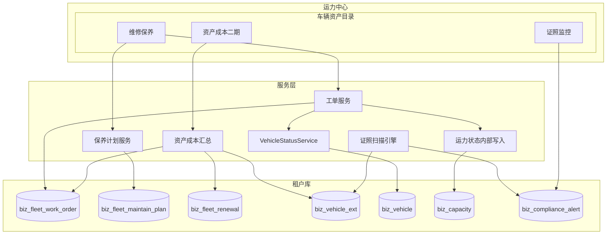

# 车辆资产 - 业务联动与技术概要

> 关联：[00.模块总览](00.模块总览.md) · [03.功能需求与分期实施](03.功能需求与分期实施.md)
>
> **说明**：研发拆任务用技术概要，非接口/迁移定稿。  
> **口径**：模块名「车辆资产」；版本 lite/standard/pro（**不含 ylb**）；证照与维保分 feature。

既有地基：

- `VehicleStatusService.change_status`（`status_source`：manual / maintenance / insurance）
- 运力 `operation_status=5`（手动接口禁止写 2/5）
- 证照监控 `biz_compliance_alert` + worker（`fleet_compliance`）
- `fleet_maintenance`（仅 pro）
- 任务支出成本引擎（业务运营成本，与资产成本并列）

## 一、模块位置



## 二、证照 vs 维修保养（实现约定）

| 事项 | 证照监控 `fleet_compliance` | 维修保养/资产成本 `fleet_maintenance` |
|------|----------------------------|--------------------------------------|
| 版本 | standard / pro | 仅 pro |
| 读到期日 | 扫描告警 | 二期台账写回 |
| 告警关闭 | dismiss/resolve | 二期续期后 resolve |
| 维修工单 | 不涉及 | 唯一写手 |
| 扫描引擎 | 唯一 worker | **禁止**再造扫描任务 |

维保看板保养待办**只来自保养计划**；二期可跳转证照页，不复制扫描。

## 三、状态联动（维修保养）

### 3.1 状态回顾

车辆：`0`停用 `1`正常 `2`维修/保养 `3`保险续期 `9`报废  
运力：`1`可接单 `2`运输中 `3`休假 `4`停运 `5`维修保养中（工单驱动）

### 3.2 开工

运输中 → 拒绝；已有进行中工单 → 拒绝；通过则车辆→2（maintenance），运力→5。

### 3.3 运力写入

须走**内部服务**（允许写被动状态 5），禁止走仅允许 1/3/4 的手动 API。  
休假/停运可被开工覆盖为 5；完工回落为**可接单**（不恢复原 3/4）。  
写 `biz_capacity_log` action=3。

### 3.4 车辆写入

`VehicleStatusService.change_status(..., source="maintenance"|"insurance")`  
互斥：进行中维保 vs 保险续期状态；回落前确认无其他进行中工单。

### 3.5 完工/取消

无其他进行中工单且 `status_source=maintenance` 时车辆回正常；运力为 5 则回 1。

### 3.6 与任务模块

运力=5 时任务派单应拒绝（任务模块落地时校验）；运力=2 时维保开工拒绝。

## 四、数据实体草图

均纳入 `fleet_maintenance.required_tables`（证照表已在 compliance 侧）。

### 4.1 `biz_fleet_work_order`

工单号、车辆、类型 repair/maintenance、计划 id、标题、里程、故障分类 `fault_category`、维修厂 id/文本、`labor_amount`/`parts_amount`/`cost_amount`、状态 draft/in_progress/completed/cancelled、started_at/finished_at、capacity_id、审计字段。

### 4.1b `biz_fleet_work_order_line`

line_type=`labor`|`part`|`other`；part_id；title；qty；unit_price；labor_hours；amount；sort。  
完工时：`cost_amount = Σ amount`；备件行出库扣减库存。

### 4.1c `biz_fleet_part` / `biz_fleet_stock_txn` / `biz_fleet_workshop`

- 备件：code/name/category/unit/ref_price/safety_stock/qty_on_hand/status  
- 流水：txn_type=`in`|`out`|`adjust`，qty/unit_cost/amount，ref_type/ref_id  
- 维修厂：name/contact/phone/address/enabled  

库存规则：草稿不占库；完工校验并出库；取消进行中不回滚出库（因未出库）。

### 4.2 `biz_fleet_maintain_plan`

车辆、名称、cycle_type、间隔、上次/下次日期与里程、remind_days、enabled。

### 4.3 二期 `biz_fleet_renewal`

insurance/inspection、日期、amount、policy_no、附件、status；生效写回 `vehicle_ext` 并 resolve 告警。

### 4.4 二期资产卡片（建议 `biz_vehicle_ext`）

purchase_date、original_value、residual_value、depreciable_months、depreciation_method=`straight_line`、depreciation_start_date。

```text
月折旧额 = max(原值 - 残值, 0) / 折旧月数
区间折旧 = 月折旧额 × 应计月数（购入当月起）
累计不超过 (原值 - 残值)
```

### 4.5 资产成本口径

| cost_type | 来源 | 计入 |
|-----------|------|------|
| maintenance | 完工工单费用（行汇总） | 完工日在区间内 |
| insurance / inspection | 续期台账 amount | effective；二期默认按生效日一次计入 |
| depreciation | 资产卡片 | 按月 |

`GET /cost/summary` 供利润分析/BI。  
**禁止**写入任务支出成本引擎 fee_type。

## 五、API 草图

前缀：`/api/client/capacity/maintenance`  
门控：`require_feature("fleet_maintenance")`

看板、工单 CRUD（含 lines）/开工完工取消、计划 CRUD/生成工单；  
维修厂 CRUD；备件 CRUD；入库/调整/流水；资产卡片与 cost summary/details。

用户文案示例：

- 「该车运输任务尚未结束，请先完成任务再安排进厂。」
- 「当前版本未开通维修保养，升级专业版后即可使用。」

证照 API 保持原前缀与 `fleet_compliance` 门控，不迁入 maintenance 前缀。

## 六、前端

| 项 | 说明 |
|----|------|
| 菜单 | 车辆资产目录；证照 parent 调整；维修保养改名可见 |
| 维修保养页 | 替换 Placeholder；升级引导用「专业版」 |
| 运力卡片 | 状态 5 tooltip：「由维修保养管理」 |
| 车辆详情 | 维保记录入口 |

## 七、落地 checklist

1. **移除 ylb**（独立变更）：`product_version` / `version_feature` / 销售与文档；存量租户迁移策略  
2. **菜单**：新增 `capacity:vehicle_asset`；compliance 挂到其下；maintenance 改名「维修保养」`visible=1`  
3. **feature**：`fleet_compliance` ∈ standard+pro；`fleet_maintenance` ∈ pro + `required_tables`  
4. **迁移**：check → autogen tenant → review → 提交  
5. **内部运力写状态** + 工单 API 门控  
6. **platform_sync export**  
7. 回归：菜单可见性（standard 仅证照 / pro 全量）+ 联动验收

## 八、测试要点

开工/完工/取消联动；并发开工；status_source 不被误覆盖；非 pro 升级提示；保养 either；菜单父级调整后 standard 仍能进证照；ylb 移除后的授权回归（若并行上线）。

## 九、摘要

1. **菜单**：运力中心 → 车辆资产（证照 + 维修保养 + 资产成本）  
2. **版本**：lite / standard / pro，无运力宝  
3. **联动**：工单 → 车辆/运力状态  
4. **成本**：资产成本独立汇总，供经营分析，不污染任务成本引擎  
